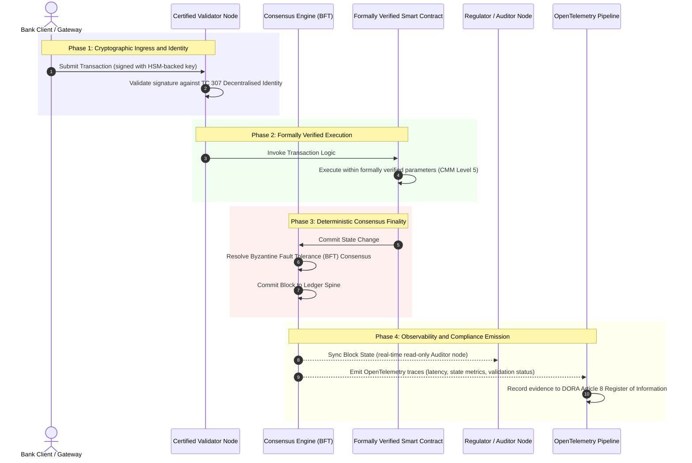

# Dari Bukti ke Kebenaran: Mengapa Blockchain Bersertifikat Akan Mendefinisikan Era Baru Kepercayaan Perbankan

**Tak dapat diubah tidak sama dengan tepercaya.** Saat perbankan grosir beralih ke penyelesaian real-time dan AI probabilistik, buku besar yang menentukan apa yang benar telah menjadi satu lapisan yang masih belum dapat disertifikasi oleh bank. Mereka menyertifikasi entitas di bawah Basel III, cloud di bawah ISO 27001 dan AI mereka di bawah ISO 42001, tetapi buku besar terdistribusi, tata kelolanya, konsensus, kriptografi dan kontrak pintarnya, diserahkan pada asumsi spesifik-vendor. Laporan ini berargumen bahwa menutup celah fidusia itu menuntut peralihan dari panduan ISO/IEC TC 307 ke jaminan preskriptif: menilai buku besar terhadap Indeks Blockchain Bersertifikat 5 tingkat yang mengubah metrik rekayasa menjadi kebenaran yang dapat diaudit direksi dan dapat dipertahankan di bawah DORA.

<!-- lead-start -->
<aside class="post-lead" aria-label="Ringkasan artikel">

<strong>Ringkasan.</strong> Bank menyertifikasi entitas, cloud dan AI mereka, tetapi bukan buku besar yang kian menentukan apa yang benar. ISO/IEC TC 307 memberikan panduan, bukan jaminan. Indeks Blockchain Bersertifikat 5 tingkat menilai tata kelola buku besar, integritas konsensus, identitas dan kriptografi, jaminan kontrak pintar dan observabilitas terhadap Model Kematangan Kapabilitas, menutup celah fidusia dan memberi AI probabilistik tulang punggung audit deterministik.

<strong>Poin-poin utama</strong>

<ul class="post-lead-takeaways">
  <li><strong>Celah friksional fidusia.</strong> Bank (Basel III), cloud (ISO 27001) dan sistem tata kelola AI (ISO 42001) dapat disertifikasi; buku besar terdistribusi yang menentukan apa yang benar belum dapat. Asimetri itu adalah kerentanan operasional yang nyata.</li>
  <li><strong>DORA membuatnya bersifat pribadi.</strong> Di bawah DORA Article 5, dewan direksi bank memikul tanggung jawab langsung dan tidak dapat didelegasikan atas ketahanan penerapan pihak ketiga dan buku besar, dengan sanksi pribadi SM&amp;CR atas kegagalan.</li>
  <li><strong>Tulang punggung audit AI.</strong> Pembelajaran mesin tidak dapat direproduksi; blockchain bersertifikat merekam versi model, input dan keputusan validasi secara deterministik di rantai, memenuhi ISO 42001 dan standar manajemen risiko model.</li>
  <li><strong>Indeks Blockchain Bersertifikat.</strong> Tata kelola, konsensus, kriptografi, kontrak pintar dan observabilitas menjadi kartu skor CMM 0-sampai-5 yang menerjemahkan metrik rekayasa menjadi Pernyataan Selera Risiko yang disetujui direksi.</li>
</ul>

<strong>Bacaan terkait:</strong> <a href="https://sebastienrousseau.com/2026-07-02-certified-blockchains-banking-trust-tc307-assurance-2026">Blockchain Bersertifikat dan Kepercayaan Perbankan: Jaminan TC 307</a>, <a href="https://sebastienrousseau.com/2026-07-24-global-payments-outlook-operating-model-risk-revenue">Outlook Pembayaran Global 2026</a>.

</aside>
<!-- lead-end -->

> **Ringkasan Eksekutif**
>
> - **Perbankan grosir berada di titik belok.** Kliring real-time dan AI probabilistik meruntuhkan model jaminan analog dan retrospektif: audit statis berbasis entitas tidak lagi memenuhi tuntutan manajemen risiko atau fidusia modern.
> - **TC 307 adalah dasar, bukan sertifikat.** ISO/IEC TC 307 telah membakukan kosakata, arsitektur referensi dan panduan keamanan untuk buku besar terdistribusi, tetapi sifatnya deskriptif. Ia mendefinisikan seperti apa yang baik itu; ia tidak menyediakan verifikasi preskriptif yang dibutuhkan pejabat risiko dan pengawas untuk mengizinkan penerapan produksi.
> - **Jaminan berarti menilai buku besar.** Tata kelola, integritas konsensus, keamanan kontrak pintar dan kelincahan kriptografi, dinilai terhadap Model Kematangan Kapabilitas 5 tingkat yang ketat, memindahkan bank dari asumsi tambal sulam spesifik-vendor ke kebenaran finansial yang dapat disertifikasi dan diaudit direksi.
> - **Buku besar adalah tulang punggung audit bagi AI.** Menautkan versi model, input dan keputusan validasi ke konsensus deterministik memberi pembelajaran mesin yang tidak dapat direproduksi catatan bukti yang dapat dipertahankan dan direkonstruksi di bawah ISO 42001, SR 11-7 dan PRA SS1/23.

## Celah Friksional Fidusia dalam Perbankan Digital

Dalam perbankan klasik, kepercayaan bersifat relasional, institusional, dan retrospektif. Ia bergantung pada auditor independen pihak ketiga yang meninjau keadaan finansial pada titik-titik waktu statis, merekonsiliasi ketidaksesuaian di antara silo buku besar bilateral. Dalam pasar real-time yang digerakkan API pada 2026, model ini menimbulkan latensi yang menghambat dan risiko struktural.

Ketika transaksi diselesaikan secara instan, kumpulan likuiditas intraday dikelola secara dinamis oleh gerbang API, dan kepemilikan aset ditokenisasi di antara buku besar bersama, audit retrospektif menjadi latihan forensik alih-alih kontrol preventif. Fidusia tidak lagi dapat semata-mata mengandalkan sertifikasi entitas korporasi. Mereka harus menyertifikasi substrat digital itu sendiri.

Saat ini, bank beroperasi di bawah asimetri arsitektur yang mencolok:

1. **Infrastruktur Cloud Bersertifikat**: Node perangkat keras, kontainer virtual, dan pusat data fisik divalidasi terhadap kontrol ISO/IEC 27001 dan SOC 2 Type II.  
2. **Proses Manajemen Bersertifikat**: Kebijakan risiko operasional, rencana kelangsungan bisnis, dan penerapan algoritmik diatur di bawah kerangka risiko yang ketat.  
3. **Mesin Buku Besar Tanpa Sertifikat**: Mekanisme konsensus terdistribusi inti, rantai pasok node validator, batas kontrak pintar, dan model tata kelola jaringan diserahkan pada asumsi tanpa sertifikat, kustom, atau spesifik-konsorsium.

Asimetri ini adalah titik kegagalan besar. Sebuah bank dapat menjalankan aplikasi tervalidasi di dalam kontainer cloud yang aman dan bersertifikat ISO 27001, tetapi jika kontainer itu menulis ke buku besar terdistribusi dengan kontrol validator terpusat, parameter konsensus yang rentan, atau kontrak pintar tanpa audit, integritas transaksi terganggu. Untuk menjembatani celah ini, mesin buku besar itu sendiri harus menjadi objek jaminan yang dapat disertifikasi.

## Dasar Standardisasi ISO/IEC TC 307

Pekerjaan fondasi yang diperlukan untuk membakukan buku besar terdistribusi sedang dibangun oleh ISO/IEC Technical Committee 307 (TC 307\) (Blockchain dan teknologi buku besar terdistribusi). Alih-alih memperlakukan blockchain sebagai protokol teknis terisolasi, TC 307 mengatasinya sebagai infrastruktur kepercayaan institusional, mengorganisir kerjanya di lima pilar inti:

1. **Taksonomi dan Kosakata (ISO 22739\)**: Menetapkan nomenklatur bersama, memastikan definisi hukum dan operasional yang konsisten di antara yurisdiksi, skema finansial, dan institusi yang berbeda.  
2. **Arsitektur Referensi (ISO/TR 23245\)**: Mendefinisikan batas, lapisan, alur data, dan komponen fungsional dari sistem buku besar terdistribusi yang patuh.  
3. **Keamanan, Privasi, dan Kontrak Pintar (ISO/TR 23244 / ISO 23613\)**: Menetapkan panduan keamanan dasar untuk sistem aset digital dan merinci praktik terbaik untuk mitigasi kerentanan kontrak pintar dan tata kelola siklus hidup.  
4. **Kerangka Interoperabilitas**: Mengatasi mekanisme pertukaran data dan aset antara jaringan buku besar yang heterogen, mencegah terbentuknya silo tertokenisasi yang terisolasi.  
5. **Identitas Terdesentralisasi dan Jangkar Kepercayaan**: Mengintegrasikan pengidentifikasi kriptografis berbasis buku besar dengan infrastruktur kunci publik (PKI) formal dan registri yang diotorisasi negara.

Secara kolektif, TC 307 menandai transisi DLT dari pilihan rekayasa kustom menjadi disiplin arsitektur yang dibakukan. Namun, TC 307 tetap terutama deskriptif. Ia mendefinisikan seperti apa yang baik itu (panduan), tetapi ia tidak menyediakan protokol verifikasi preskriptif (jaminan) yang dibutuhkan pejabat risiko dan pengawas untuk mengizinkan penerapan produksi fungsi kritis atau penting (CIFs).

## Panduan vs. Jaminan: Perbedaan Fidusia

Pelaku pasar finansial tidak menerapkan teknologi karena inovatif atau elegan; mereka menerapkannya ketika teknologi itu dapat ditata kelola, diaudit, dipertahankan, dan direkonsiliasi dengan persyaratan cadangan modal. Inilah sebabnya standardisasi dalam perbankan secara alami terurai menjadi dua lapisan:

* **Panduan (Kerangka)**: Menguraikan praktik terbaik, target referensi, dan panduan arsitektur (mis., ISO/IEC TC 307, kerangka NIST).  
* **Jaminan (Bukti)**: Menyediakan bukti independen, berkelanjutan, dan dapat diverifikasi pihak ketiga bahwa kerangka tersebut diterapkan dan beroperasi sebagaimana dirancang (mis., sertifikasi ISO 27001, audit SOC 2, pemeriksaan regulasi).

Mengandalkan konsensus buku besar tanpa sertifikat sambil menyertifikasi infrastruktur cloud adalah celah regulasi yang kritis. Blockchain yang "tak dapat diubah" belum tentu "tepercaya secara institusional." Ketakterubahan hanya menjamin bahwa data yang dimasukkan tidak berubah; ia tidak memverifikasi bahwa node validator aman, protokol konsensus tahan terhadap kolusi, logika kontrak pintar benar secara matematis, atau bahwa manajemen kunci kriptografis patuh pada mandat pasca-kuantum.

Untuk menutup celah ini, Indeks Blockchain Bersertifikat 2026 memformalkan persyaratan ini menjadi Model Kematangan Kapabilitas (CMM) yang terukur dan dipetakan ke regulasi perbankan global.

## Indeks Blockchain Bersertifikat 2026

Untuk memungkinkan manajemen senior mengevaluasi dan menyertifikasi platform buku besar mereka, indeks ini menstrukturkan infrastruktur buku besar terdistribusi menjadi lima lapisan operasional yang dapat diaudit, dinilai pada skala CMM 0-sampai-5.

### Tabel 1: Arsitektur Indeks Blockchain Bersertifikat

| Lapisan Indeks | Tingkat Kematangan Kapabilitas (CMM) | Metrik Teknis dan Operasional | Referensi Kontrol Regulasi / Fidusia |
| ---- | ---- | ---- | ---- |
| **Tata Kelola Buku Besar** | **Level 0**: Konsorsium ad-hoc**Level 3**: Penyaringan & rotasi validator otomatis**Level 5**: Penautan identitas kriptografis multi-pihak yang terdesentralisasi | % node validator yang dioperasikan oleh entitas finansial tersaring; rata-rata waktu penyelesaian sengketa validator; distribusi geografis node | **DORA Article 5** (Tata Kelola dan Organisasi); **CPMI-IOSCO PFMI Principle 2** (Tata Kelola) & **Principle 3** (Kerangka untuk manajemen risiko yang komprehensif) |
| **Integritas Konsensus** | **Level 0**: Node tunggal atau POW opak**Level 3**: BFT teraudit dengan finalitas deterministik**Level 5**: Konsensus multi-yurisdiksi, terverifikasi formal dengan pemantauan latensi berkelanjutan | Latensi konsensus maksimum yang dapat ditoleransi; ambang batas ketahanan-kolusi; SLA uptime di bawah partisi node tersimulasi | **DORA Article 6** (Kerangka Manajemen Risiko TIK); **CPMI-IOSCO PFMI Principle 8** (Finalitas Penyelesaian) |
| **Identitas & Kriptografi** | **Level 0**: Kunci RSA / ECDSA lemah**Level 3**: Multi-sig dengan manajemen kunci berbasis HSM**Level 5**: Kunci hibrida tahan-kuantum (FIPS 203 ML-KEM) dan gerbang privasi zero-knowledge | % transaksi buku besar yang ditandatangani dengan kunci berbasis HSM; skor kesiapan migrasi PQC; latensi bukti ZK | **NIST FIPS 203 / 204**; **ISO/IEC 27001** (Manajemen Keamanan Informasi) |
| **Jaminan Kontrak Pintar** | **Level 0**: Skrip solidity tanpa audit**Level 3**: Validasi kompiler otomatis & audit eksternal**Level 5**: Kontrak pintar terverifikasi formal, tak dapat diubah dengan peningkatan circuit-breaker | % kontrak pintar dengan verifikasi formal matematis; jumlah peringatan kompiler; cakupan pemindaian kerentanan | **EBA Guidelines on Outsourcing Arrangements** (Paragraf 81, 113-117); **DORA Article 30** (Klausul Kontraktual Minimum) |
| **Audit & Observabilitas** | **Level 0**: Pengorekan log manual**Level 3**: Jejak OTel terstruktur & node auditor hanya-baca**Level 5**: Rekonsiliasi otomatis dan berkelanjutan ke register Article 8 | % transaksi yang tercakup oleh jejak OpenTelemetry; latensi dari block-commit buku besar ke sinkronisasi node-auditor | **BCBS 239** (Agregasi Data Risiko); **DORA Article 8** (Register Informasi / Skema ITS) |

### Tabel 2: Sinyal Kepercayaan Utama yang Dipetakan ke Standar Perbankan Global

| Sinyal / Tolok Ukur | Metrik | Dampak pada Platform Perbankan | Sumber Regulasi |
| ---- | ---- | ---- | ---- |
| **Kemajuan ISO/IEC TC 307** | Transisi dari laporan teknis ISO/TR ke skema sertifikasi formal | Menetapkan kerangka baku pertama untuk menyertifikasi mesin buku besar terdistribusi | **ISO/IEC JTC 1 / SC 44** (Teknologi Buku Besar Terdistribusi) |
| **Fase Prototipe Project Agorá** | 40+ bank komersial peserta; pengujian buku besar terpadu atas deposito tertokenisasi | Menggeser kliring lintas batas dari perpesanan (SWIFT) ke penyelesaian tertokenisasi atomik | **Bank for International Settlements (BIS) Innovation Hub** |
| **Audit Pihak Ketiga DORA Article 30** | 100% penyedia node dan host infrastruktur diaudit terhadap kriteria keamanan | Menghapus "node validator bayangan"; mewajibkan transparansi rantai pasok total | **European Supervisory Authorities (ESA)** |
| **ISO/IEC 42001 (Tata Kelola AI)** | Model AI dan log pelatihan yang dijadikan tak-dapat-diubah secara kriptografis di rantai | Menggunakan blockchain sebagai buku besar bukti tak-dapat-diubah ("tulang punggung audit") bagi pembelajaran mesin | **ISO/IEC 42001:2023** (Teknologi informasi, Kecerdasan buatan) |
| **Kecukupan Modal Basel III** | Pengurangan buffer modal risiko operasional berdasarkan pengurangan kompleksitas yang terdokumentasi | Kerangka risiko operasional baku secara langsung mengkredit ketahanan buku besar yang terverifikasi | **Basel Committee on Banking Supervision (BCBS)** |

## "Tulang Punggung Audit" AI: Kecerdasan Probabilistik di atas Infrastruktur Deterministik

Salah satu peran strategis paling ampuh bagi blockchain bersertifikat pada 2026 adalah bertindak sebagai **"Tulang Punggung Audit"** bagi penerapan kecerdasan buatan. Sistem finansial modern kian bersifat probabilistik. Penilaian kredit, deteksi penipuan real-time, perdagangan algoritmik, dan interaksi pelanggan otonom digerakkan oleh model pembelajaran mesin yang berevolusi, bergeser, dan beradaptasi seiring waktu. Model-model ini bersifat non-deterministik: diberi input yang sama pada dua waktu berbeda, mereka dapat menghasilkan keluaran berbeda karena bobot dinamis dan pelatihan berkelanjutan.

Non-determinisme ini menimbulkan tantangan tata kelola yang mendalam di bawah standar **ISO/IEC 42001 (Tata Kelola AI)** dan **Manajemen Risiko Model (MRM)** (seperti **US Federal Reserve SR 11-7** dan **UK PRA SS1/23**): *Bagaimana Anda mengaudit, menjelaskan, dan mempertahankan keputusan yang tidak dapat direproduksi secara ketat?*

Buku besar terdistribusi bersertifikat menyediakan penyeimbang deterministik. Sementara model AI beroperasi secara probabilistik, blockchain bersertifikat merekam parameternya secara deterministik, menetapkan tulang punggung bukti yang tak dapat diubah:

* **Pemversian Model dan Penautan Bobot**: Setiap versi model yang diterapkan, bobot terkaitnya, dan checksum data pelatihannya di-hash dan ditulis ke buku besar pada saat build, memenuhi persyaratan rantai pasok **SLSA Level 3**.  
* **Pencatatan Input Kontekstual**: Ketika model AI menjalankan keputusan kritis (mis., menyetujui pinjaman atau menandai transaksi), input kontekstual persis dan hash model ditulis ke buku besar, menciptakan riwayat yang bukti-gangguannya terlihat.  
* **Kemampuan Audit tanpa Akses Kode**: Jika seorang regulator bertanya, "Mengapa model Anda menolak permohonan kredit ini pada 3 Juni?" bank tidak perlu mengekspos kode berpemilik atau mencoba menciptakan ulang keadaan model persis. Bank menyajikan catatan buku besar di rantai yang ditandatangani secara kriptografis atas input, bobot, dan keadaan validasi.

Dengan menautkan keputusan probabilistik model pembelajaran mesin ke konsensus deterministik blockchain bersertifikat, institusi menciptakan garis waktu tindakan otomatis yang dapat dipertahankan, direkonstruksi, dan diverifikasi secara independen.

## Memvisualisasikan Pipeline Konsensus-ke-Audit Bersertifikat

Diagram urutan berikut mengilustrasikan siklus hidup transaksi yang melewati platform blockchain bersertifikat, menunjukkan bagaimana gerbang validasi, integritas konsensus, eksekusi kontrak pintar, dan emisi telemetri saling terkait untuk menghasilkan bukti regulasi yang siap-direksi:

Jalur kritis untuk urutan transaksional ini menuntut agar setiap langkah validasi, eksekusi, dan konsensus ditandatangani secara kriptografis, memastikan provenans ujung-ke-ujung. Node auditor regulator menyinkronkan keadaan blok secara real-time, menghilangkan kebutuhan akan rekonsiliasi finansial manual dan retrospektif.

## Buku Panduan Ruang Rapat Direksi bagi Manajer Senior

Untuk berhasil mengelola peralihan dari kepercayaan organisasional ke kepercayaan infrastruktural, eksekutif bank dan manajer senior harus segera menjalankan empat arahan utama:

1. **Wajibkan Audit Buku Besar dalam Manajemen Risiko Perusahaan (ERM)**: Berlakukan kebijakan bahwa tidak ada platform buku besar terdistribusi, baik privat, publik, maupun berbasis konsorsium, yang boleh diterapkan untuk fungsi kritis atau penting (CIFs) kecuali telah diaudit terhadap **Arsitektur Indeks Blockchain Bersertifikat** 5 lapisan (minimum CMM Level 3).  
2. **Integrasikan Blockchain sebagai Tulang Punggung Bukti AI ISO 42001**: Arahkan Chief Risk Officer dan Lead AI Architect untuk mengintegrasikan semua model pembelajaran mesin berdampak-tinggi dengan blockchain bersertifikat, menciptakan buku besar audit yang bukti-gangguannya terlihat atas versi, bobot, input, dan keputusan model.  
3. **Audit Rantai Pasok Node Validator (DORA Article 30\)**: Wajibkan divisi pengadaan untuk mengaudit semua entitas pihak ketiga yang meng-host node validator atau mengelola hosting cloud untuk jaringan DLT, mewajibkan kepatuhan pada standar keamanan siber dan ketahanan operasional yang sama seperti yang diterapkan pada node cloud internal bank.  
4. **Selaraskan Arsitektur Buku Besar dengan CPMI-IOSCO dan BCBS 239**: Instruksikan tim rekayasa platform untuk menyelaraskan telemetri keluaran buku besar secara langsung dengan persyaratan pelaporan data **BCBS 239**, dan pastikan parameter konsensus serta finalitas penyelesaian patuh secara ketat pada **CPMI-IOSCO Principles 8 dan 9**.

## Pertanyaan yang Sering Diajukan

**Apakah ISO/IEC TC 307 merupakan standar sertifikasi?**  
Tidak. ISO/IEC TC 307 adalah komite teknis yang menetapkan kosakata, arsitektur referensi, dan panduan keamanan. Meskipun ia mendefinisikan "seperti apa yang baik itu" (panduan), industri harus mengoperasionalkan dokumen-dokumen ini menjadi skema sertifikasi formal yang dapat diaudit (jaminan) untuk memenuhi pengawas perbankan.

**Bagaimana blockchain bersertifikat mendukung kepatuhan DORA?**  
Di bawah DORA Article 5, dewan direksi bank memikul tanggung jawab langsung dan pribadi atas ketahanan teknologi. Blockchain bersertifikat menyediakan bukti kriptografis yang dapat diverifikasi atas integritas konsensus, kontrol rantai pasok validator, dan keamanan kontrak pintar, memberi anggota dewan "langkah-langkah wajar" yang dapat didokumentasikan yang diperlukan untuk mempertahankan diri dari klaim tanggung jawab pribadi SM\&CR.

**Apa perbedaan antara audit buku besar tradisional dan audit blockchain bersertifikat?**  
Audit tradisional bersifat retrospektif, memverifikasi entri manual dan file statis setelah transaksi selesai. Audit blockchain bersertifikat bersifat berkelanjutan dan real-time; node validator, mesin konsensus BFT, dan kontrak pintar terverifikasi formal disertifikasi untuk menjalankan transaksi secara deterministik, memancarkan telemetri terstruktur (OpenTelemetry) yang terus-menerus memvalidasi kesehatan sistem.

**Dapatkah blockchain publik disertifikasi untuk penggunaan perbankan?**  
Di sebagian besar yurisdiksi, blockchain publik tanpa izin murni gagal memenuhi regulasi perbankan karena kurangnya verifikasi identitas validator, biaya gas/transaksi yang tak terduga, dan finalitas non-deterministik (mis., fork proof-of-work/stake probabilistik). Blockchain bersertifikat dalam perbankan biasanya memanfaatkan arsitektur berizin tingkat perusahaan atau publik-hibrida yang sangat teratur di mana operator node validator adalah entitas finansial yang teridentifikasi dan teraudit.

## Referensi

* Basel Committee on Banking Supervision (BCBS), 2013\. *Principles for effective risk data aggregation and reporting (BCBS 239\)*. Basel: Bank for International Settlements. Tersedia di: [Basel Committee on Banking Supervision (BCBS), 2013\.](https://www.bis.org/publ/bcbs239.pdf "Basel Committee on Banking Supervision (BCBS), 2013\.").  
* Committee on Payments and Market Infrastructures and Technical Committee of the International Organisation of Securities Commissions (CPMI-IOSCO), 2012\. *Principles for financial market infrastructures*. Basel: Bank for International Settlements. Tersedia di: [Committee on Payments and Market Infrastructures and Technical Committee of the International Organisation of Securities Commissions (CPMI-IOSCO), 2012\.](https://www.bis.org/cpmi/publ/d101a.pdf "Committee on Payments and Market Infrastructures and Technical Committee of the International Organisation of Securities Commissions (CPMI-IOSCO), 2012\.").  
* European Banking Authority (EBA), 2019\. *EBA/GL/2019/02, Guidelines on outsourcing arrangements*. Paris: EBA. Tersedia di: [European Banking Authority (EBA), 2019\.](https://www.eba.europa.eu/regulation-and-policy/internal-governance/guidelines-on-outsourcing-arrangements "European Banking Authority (EBA), 2019\.").  
* European Parliament and Council of the European Union, 2022\. *Regulation (EU) 2022/2554 on digital operational resilience for the financial sector (DORA)*. Brussels: Official Journal of the European Union. Tersedia di: [European Parliament and Council of the European Union, 2022\.](https://eur-lex.europa.eu/legal-content/EN/TXT/?uri=CELEX%3A32022R2554 "European Parliament and Council of the European Union, 2022\.").  
* ISO/IEC JTC 1/SC 42, 2023\. *ISO/IEC 42001:2023, Information technology, Artificial intelligence, Management system*. Geneva: International Organisation for Standardisation. Tersedia di: [ISO/IEC JTC 1/SC 42, 2023\.](https://www.iso.org/standard/81230.html "ISO/IEC JTC 1/SC 42, 2023\.").  
* ISO/IEC Technical Committee 307, 2020\. *ISO/IEC 22739:2020, Blockchain and distributed ledger technologies, Vocabulary*. Geneva: International Organisation for Standardisation. Tersedia di: [ISO/IEC Technical Committee 307, 2020\.](https://www.iso.org/standard/73771.html "ISO/IEC Technical Committee 307, 2020\.").  
* National Institute of Standards and Technology (NIST), 2026\. *First Three Finalised Post-Quantum Encryption Standards (FIPS 203, 204, and 205\)*. Gaithersburg: U.S. Department of Commerce. Tersedia di: [National Institute of Standards and Technology (NIST), 2026\.](https://www.nist.gov/news-events/news/2024/08/nist-releases-first-3-finalised-post-quantum-encryption-standards "National Institute of Standards and Technology (NIST), 2026\.").
