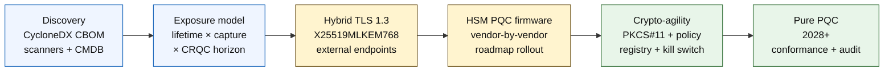

# L'Indice Quantum-Safe Banking nel 2026: Crittografia Post-Quantistica, QKD, Crypto-Agility e Rischio Harvest-Now-Decrypt-Later

<!-- lead-start: manual -->
<aside class="post-lead" aria-label="Sintesi dell'articolo">

<strong>In sintesi.</strong> La banca quantum-safe nel 2026 è un programma di consegna con una scadenza fissata dall'intersezione di due curve — la durata di riservatezza dei dati che l'istituto detiene oggi e l'orizzonte di arrivo di un Cryptographically Relevant Quantum Computer (CRQC). Le norme NIST FIPS 203 / 204 / 205 sono definitive da agosto 2024; il CNSA 2.0 fissa lo stato finale federale statunitense al 2033; l'harvest-now-decrypt-later è già operativo sui dati a lunga vita. La Quantum Scorecard a livello di consiglio misura quattro percentuali esatte: completezza dell'inventario, esposizione HNDL, avanzamento della migrazione NIST, prontezza di crypto-agility.

<strong>Punti chiave</strong>

<ul class="post-lead-takeaways">
  <li><strong>Il dibattito sugli algoritmi si è chiuso il 13 agosto 2024.</strong> ML-KEM (FIPS 203), ML-DSA (FIPS 204), SLH-DSA (FIPS 205) sono le risposte. Le banche che nel 2026 continuano valutazioni interne per "scegliere il vincitore" sono in ritardo di 18 mesi.</li>
  <li><strong>L'harvest-now-decrypt-later si applica già.</strong> Qualunque dato con durata di riservatezza oltre l'arrivo credibile di un CRQC — mutui a 30 anni, sottoscrizioni assicurative vita, registrazioni delle transazioni MiFID II / GDPR, archivi di retention M&amp;A — deve passare oggi all'incapsulamento ibrido di chiave quantum-safe, non quando verrà annunciato un CRQC.</li>
  <li><strong>L'inventario è la maturità abilitante.</strong> Un Cryptographic Bill of Materials (CBOM) — protocollo, libreria, certificato, partizione HSM, dipendenza dal fornitore, application owner, durata della classificazione del dato — è la condizione preliminare per tutto il resto. Misurate la freschezza, non la copertura.</li>
  <li><strong>Il TLS 1.3 ibrido è il deployment del 2026.</strong> La key share ibrida X25519MLKEM768 è quella che Chrome / Firefox / Cloudflare / Akamai negoziano davvero oggi. Il TLS con ML-KEM puro attende il firmware HSM e la prontezza delle CA.</li>
  <li><strong>La crypto-agility è il deliverable durevole.</strong> Astrazione PKCS#11, chiavi etichettate, registro di policy che mappa il servizio di business sull'insieme di algoritmi consentiti. Senza, la prossima transizione algoritmica diventa un altro programma pluriennale.</li>
</ul>
</aside>
<!-- lead-end -->

La banca quantum-safe nel 2026 riguarda la migrazione operativa, non la speculazione. Il NIST ha finalizzato i primi tre standard di crittografia post-quantistica e le banche devono ora capire quali sistemi dipendono da RSA, ECC, TLS, firme, HSM, certificati, canali di pagamento, archivi e dati riservati a lunga vita. La domanda indicizzata è semplice: l'istituto è in grado di sostituire la crittografia prima che la minaccia diventi operativa?

---

> **Sintesi esecutiva / Punti chiave**
>
> - **Gli standard NIST sono ora concreti.** FIPS 203 definisce ML-KEM per l'incapsulamento di chiave, FIPS 204 definisce ML-DSA per le firme e FIPS 205 definisce SLH-DSA come standard di firma stateless basato su hash.
> - **L'inventario è il primo varco di maturità.** Una banca non può migrare ciò che non riesce a trovare: certificati, chiavi, protocolli, applicazioni, fornitori, HSM, API, archivi e sistemi embedded devono essere mappati.
> - **La crypto-agility è l'obiettivo durevole.** Lo scopo non è uno scambio algoritmico una tantum; è la capacità di modificare le primitive crittografiche senza riprogettare intere applicazioni.
> - **I dati a lunga vita cambiano l'urgenza.** Il rischio harvest-now-decrypt-later significa che i dati catturati oggi possono diventare leggibili in futuro, se rimangono di valore abbastanza a lungo.
> - **Il QKD è un complemento specialistico.** La distribuzione quantistica di chiave può essere rilevante per i canali di massimo valore, ma non sostituisce la migrazione PQC su scala d'istituto.
>
---

## Perché il 2026 è l'anno in cui questo indice conta

Tre cambiamenti del 2024-2025 hanno trasformato il quantum-safe in un programma bancario misurabile, anziché in un punto di osservazione di ricerca. Primo, il NIST ha finalizzato i principali standard post-quantistici il 13 agosto 2024: [FIPS 203 (ML-KEM) ⧉](https://nvlpubs.nist.gov/nistpubs/FIPS/NIST.FIPS.203.pdf "FIPS 203 — Module-Lattice-Based Key-Encapsulation Mechanism"), [FIPS 204 (ML-DSA) ⧉](https://nvlpubs.nist.gov/nistpubs/FIPS/NIST.FIPS.204.pdf "FIPS 204 — Module-Lattice-Based Digital Signature Standard"), [FIPS 205 (SLH-DSA) ⧉](https://nvlpubs.nist.gov/nistpubs/FIPS/NIST.FIPS.205.pdf "FIPS 205 — Stateless Hash-Based Digital Signature Standard"). Il dibattito sulla selezione degli algoritmi si è chiuso in quella data; le banche che nel 2026 mantengono ancora workstream interni del tipo "quale schema vince" sono in ritardo di 18 mesi.

Secondo, il [CNSA 2.0 della NSA ⧉](https://media.defense.gov/2022/Sep/07/2003071834/-1/-1/0/CSA_CNSA_2.0_ALGORITHMS_.PDF "Commercial National Security Algorithm Suite 2.0") fissa lo stato finale federale statunitense al 2033, con scadenze intermedie a partire dal 2027 per la firma di software e firmware, e al 2030 per browser e sistemi operativi. Qualunque banca con esposizione verso controparti federali statunitensi — FedNow, operazioni del Treasury, conti di clienti federali — rientra in quel perimetro per i sistemi che toccano dati federali. L'orologio non è più astratto.

Terzo, l'[Harvest-Now-Decrypt-Later (HNDL) ⧉](https://csrc.nist.gov/Projects/post-quantum-cryptography "Programma NIST di crittografia post-quantistica") è l'argomento portante del rischio per l'urgenza. Avversari sofisticati stanno già catturando messaggi di pagamento protetti da TLS, buste SWIFT, documentazione KYC e ciphertext archiviati a lunga vita presso i principali centri finanziari. I dati catturati nel 2026 devono restare sensibili sotto il profilo della riservatezza solo al momento della decifratura — per mutui a 30 anni, sottoscrizioni assicurative vita, registrazioni delle transazioni MiFID II / GDPR e archivi di retention M&A, quella finestra si estende ben oltre ogni stima credibile per un Cryptographically Relevant Quantum Computer (CRQC). L'avversario non ha bisogno di un computer quantistico oggi. Gli serve prima che il dato smetta di contare.

L'indice Quantum-Safe Banking misura se il vostro istituto è in grado di consegnare la migrazione prima che arrivi quell'intersezione. Il lavoro non riguarda più se migrare; riguarda se la migrazione si completa entro una tempistica difendibile.

## L'architettura dell'indice 2026

| Strato dell'indice | Direzione 2026 | Metrica di prontezza | Rischio in caso di gestione errata |
|---|---|---|---|
| **Inventario** | Mappare asset crittografici, protocolli, certificati, fornitori e classi di dato | Percentuale del perimetro inventariato | Dipendenze ignote vulnerabili al quantistico |
| **Esposizione** | Classificare i sistemi per durata di riservatezza e criticità transazionale | Asset ad alto rischio per valore e durata | Migrazione mal prioritizzata |
| **Migrazione** | Adottare schemi ibridi e pronti per il PQC allineati agli standard NIST | Prontezza ML-KEM e ML-DSA | Re-platforming d'emergenza sotto scadenza |
| **Crypto-agility** | Separare la logica applicativa dalle primitive crittografiche | Copertura crypto governata da policy | Algoritmi cablati nel codice in tutto il perimetro |
| **Assurance** | Testare interoperabilità, prestazioni, supporto HSM, certificati e prontezza dei fornitori | Tasso di superamento dei test e arretrato delle eccezioni | Canali interrotti o controlli di fallback deboli |

### La Quantum Scorecard a livello di consiglio

Una scorecard di prontezza quantistica credibile richiede di misurare percentuali esatte, non solo stati di progetto:

1. **Completezza dell'inventario:** la percentuale di applicazioni tier-1 con un Cryptographic Bill of Materials (CBOM) interamente mappato.
2. **Esposizione HNDL:** il volume di dati riservati a lunga vita (ad esempio PII, segreti commerciali) trasmesso in rete senza incapsulamento ibrido quantum-safe della chiave.
3. **Avanzamento della migrazione NIST:** la percentuale di chiavi di cifratura asimmetrica e firme digitali migrate agli standard FIPS 203 (ML-KEM) e FIPS 204 (ML-DSA).
4. **Prontezza di crypto-agility:** la percentuale di sistemi critici in cui gli algoritmi crittografici possono essere ruotati via policy centralizzata, senza richiedere la ricompilazione del codice.

## Segnali correnti da monitorare

| Segnale | Cosa significa per le banche | Fonte |
|---|---|---|
| **FIPS 203 ML-KEM** | Standard NIST principale per lo stabilimento generico di chiave di cifratura | [NIST ⧉](https://www.nist.gov/news-events/news/2024/08/nist-releases-first-3-finalized-post-quantum-encryption-standards "Primi tre standard di cifratura post-quantistica finalizzati") |
| **FIPS 204 ML-DSA** | Standard NIST principale per le firme digitali | [NIST ⧉](https://www.nist.gov/news-events/news/2024/08/nist-releases-first-3-finalized-post-quantum-encryption-standards "Primi tre standard di cifratura post-quantistica finalizzati") |
| **FIPS 205 SLH-DSA** | Alternativa di firma basata su hash e disegno di backup | [NIST ⧉](https://www.nist.gov/news-events/news/2024/08/nist-releases-first-3-finalized-post-quantum-encryption-standards "Primi tre standard di cifratura post-quantistica finalizzati") |
| **Integrazione immediata raccomandata** | Il NIST indica esplicitamente agli amministratori di iniziare a integrare gli standard, perché l'integrazione completa richiede tempo | [NIST ⧉](https://www.nist.gov/news-events/news/2024/08/nist-releases-first-3-finalized-post-quantum-encryption-standards "Primi tre standard di cifratura post-quantistica finalizzati") |
| **I programmi quantistici delle banche si espandono** | Le grandi banche stanno esplorando le tecnologie quantistiche mentre preparano le transizioni PQC | [Quantum Insider ⧉](https://thequantuminsider.com/2026/03/27/15-plus-global-banks-probing-the-wonderful-world-of-quantum-technologies/ "Panoramica delle banche globali che esplorano le tecnologie quantistiche") |

## La migrazione parte dal registro della crittografia

A questo punto la sequenza di migrazione è ben compresa. Ogni varco produce evidenze che alimentano il successivo; saltare o comprimere un varco è ciò che genera il rischio di re-platforming d'emergenza che compare nella colonna dei fallimenti dell'architettura dell'indice.

Il primo deliverable non è un nuovo algoritmo; è un cryptographic bill of materials (CBOM). Le banche hanno bisogno di un inventario vivo che colleghi servizi di business ad algoritmi, librerie, certificati, lunghezze di chiave, HSM, durate dei dati, fornitori e responsabili operativi. Senza quel registro, la migrazione quantum-safe diventa congettura.

Il record set del CBOM deve catturare, per ogni primitiva crittografica: il protocollo o l'interfaccia (TLS 1.3, IPsec, SSH, formato di messaggio di pagamento custom), l'algoritmo e il parameter set (RSA-2048, ECDH P-256, ML-KEM-768, ML-DSA-65), la libreria e la versione (OpenSSL 3.4, hash di commit BoringSSL, build dell'SDK del fornitore), il confine hardware (partizione HSM, TPM, secure enclave o nessuno), l'identità del certificato se applicabile, l'application owner e la durata della classificazione del dato. Gli strumenti che arrivano in produzione nel 2025-2026 — IBM Quantum Safe Inventory, la [specifica open source CycloneDX CBOM ⧉](https://cyclonedx.org/capabilities/cbom/ "CycloneDX Cryptography Bill of Materials"), gli scanner enterprise di CryptoNext / Sandbox / PQShield — si integrano nelle pipeline CMDB esistenti. Nessuno è completo da solo; aspettatevi un ciclo di costruzione del CBOM di 12-18 mesi anche con tooling del fornitore e headcount dedicato.

La metrica da misurare è la freschezza, non la copertura. Un CBOM con due mesi di ritardo è peggio di nessun CBOM, perché dà al team sicurezza una falsa fiducia su ciò che è stato migrato.

## Prima ibrido, sempre agile

La maggior parte delle banche non commuterà tutto in una volta. Lo schema realistico è il deployment ibrido, in cui meccanismi classici e post-quantistici convivono mentre maturano fornitori, protocolli, certificati e tooling operativo. L'obiettivo di lungo periodo è la crypto-agility: scelte crittografiche governate da policy, modificabili senza ricostruire l'applicazione di business.

[Inserire componente interattivo: calcolatore del rischio Harvest-Now-Decrypt-Later (HNDL) — uno strumento basato su slider con cui i dirigenti inseriscono la shelf-life del dato rispetto alla timeline quantistica stimata, per visualizzare la propria finestra di esposizione.]

> **Insight chiave:** se il vostro dato deve restare riservato per 10 anni e un Cryptographically Relevant Quantum Computer (CRQC) è a 7 anni di distanza, la vostra scadenza di migrazione non è tra 7 anni — era 3 anni fa.

In pratica significa TLS 1.3 con key share ibrida `X25519MLKEM768` per gli endpoint esposti all'esterno (Chrome / Firefox / Cloudflare / Akamai la supportano già oggi), catene di firma classiche finché l'infrastruttura HSM e CA non si allinea, e uno strato di astrazione PKCS#11 che permetta al registro di policy di ruotare gli algoritmi senza ricompilare le applicazioni di business. La crypto-agility è ciò che determina se la prossima transizione algoritmica (quando, non se) sarà una rotazione di sei settimane o un altro programma di sette anni.

## Dove si colloca il QKD

La distribuzione quantistica di chiave entra nell'indice come opzione di canale ad alta sensibilità, soprattutto per le infrastrutture di mercato finanziario, la connettività verso banche centrali e i flussi istituzionali estremamente sensibili. Va trattata come complemento del PQC, non come pretesto per ritardare la migrazione enterprise.

## Cosa significa per tipo di banca

### Banche globali sistemicamente rilevanti

Il problema duro è la scala: decine di migliaia di endpoint TLS, centinaia di partizioni HSM, decine di autorità di certificazione interne, centinaia di applicazioni di business con primitive crittografiche embedded e SDK di fornitori che la banca non può modificare. L'investimento non è un altro pilota; è il tooling CBOM, lo strato di astrazione PKCS#11 cablato in ogni nuovo build, il piano di consolidamento HSM che sceglie un fornitore guida sul firmware PQC accettando una coda pluriennale sugli altri, e il registro di policy che diventa la superficie durevole di crypto-agility ben oltre il completamento della migrazione FIPS 203 / 204 / 205.

### Banche transazionali e corporate

Lo scope di migrazione è più stretto rispetto al livello G-SIB, ma l'esposizione HNDL è acuta: messaggistica SWIFT cross-border, dati di pagamento strutturati con PII di controparti corporate, piattaforme di scambio documentale che custodiscono documentazione trade-finance e archivi di reporting a lunga retention. Date priorità al TLS ibrido su ogni endpoint customer-facing e al PQC at-rest sugli archivi di retention. Imponete l'accountability del fornitore HSM — il team della piattaforma di corporate banking ha una leva di approvvigionamento diretta che il team della tecnologia wholesale spesso non ha.

### Banche regionali

Comprate lo stack del fornitore che ha già le primitive di crypto-agility. Scegliete una piattaforma di core banking il cui fornitore pubblichi un CBOM e si impegni su tempistiche di supporto a ML-KEM / ML-DSA. Verificate che la roadmap HSM del fornitore si allinei alla scadenza di migrazione della banca. La capacità ingegneristica necessaria a costruire crypto-agility da zero è pluriennale; il fornitore paga quel costo distribuendolo su molti clienti e la banca eredita il beneficio. Il lavoro di validazione — verificare che le dichiarazioni del fornitore reggano al processo MRM dell'istituto — è lo scope interno legittimo.

### Fintech, PSP e fornitori di infrastruttura

La domanda competitiva per i fornitori che vendono alle banche nel 2026 non è "supportate il PQC". È "siete in grado di produrre un CycloneDX CBOM per la vostra piattaforma, una matrice di supporto del fornitore HSM e uno SLA scritto sulla rotazione degli algoritmi". I fornitori che rispondono di sì supereranno i varchi di procurement tier-1 nel 2026-2027. Quelli che non potranno perderanno il ciclo di rinnovo a favore di un concorrente in grado di farlo.

## Conclusione

La banca quantum-safe nel 2026 non è un punto di osservazione di ricerca; è un programma di consegna con una scadenza fissata dall'intersezione di due curve — la durata di riservatezza dei dati che l'istituto detiene oggi e l'orizzonte di arrivo di un Cryptographically Relevant Quantum Computer. Gli istituti che appariranno credibili a regolatori e controparti nel 2030 sono quelli che hanno avviato la costruzione del CBOM nel 2024, distribuito il TLS ibrido su ogni endpoint esterno entro fine 2026 e ingegnerizzato la crypto-agility in ogni nuovo build fin dal primo giorno. Quelli che non l'hanno fatto scopriranno se la loro finestra di migrazione si è già chiusa per i dati che il loro avversario sta raccogliendo oggi.

Misurate la migrazione come misurereste qualunque altro programma operativo: scope noto, sequenziamento prioritizzato, scadenze impegnate, registri delle eccezioni onesti. Più a fondo guardate al vostro perimetro, più stretta vi sembrerà la finestra di migrazione.

## Domande frequenti

**Cosa dovrebbe inventariare per prima una banca?**

Partite dai TLS esposti all'esterno, dai canali di pagamento, dall'autenticazione cliente, dalla connettività interbancaria, dai servizi appoggiati a HSM, dagli archivi a lungo termine e dai sistemi che trattano dati riservati con vita utile estesa.

**Il PQC è solo una questione di cybersicurezza?**

No. Riguarda pagamenti, identità, evidenze legali, firma transazionale, fiducia del cliente, retention dei dati, gestione dei fornitori e resilienza operativa.

**Cosa significa crypto-agility?**

Crypto-agility significa la capacità di modificare le primitive crittografiche tramite controlli di policy e di piattaforma, anziché tramite modifiche applicative cablate nel codice.

**Le banche dovrebbero aspettare ulteriori standard?**

No. Il NIST ha invitato gli amministratori a iniziare a integrare i primi standard definitivi, perché l'integrazione completa richiede tempo.

## Riferimenti

- NIST, (2026). [Primi tre standard di cifratura post-quantistica finalizzati ⧉](https://www.nist.gov/news-events/news/2024/08/nist-releases-first-3-finalized-post-quantum-encryption-standards "Primi tre standard di cifratura post-quantistica finalizzati").

<!-- enrich-start -->
<aside class="author-card" aria-label="Informazioni sull'autore"><strong class="author-card-name"><a href="/about/index.html">Sebastien Rousseau</a></strong>Senior banking technologist. Scrive di AI applicata, infrastrutture di pagamento, moneta tokenizzata, ISO 20022, sicurezza post-quantistica, servizi finanziari cloud-nativi e mercati digitali regolamentati.Oltre 20 anni tra HSBC Commercial &amp; Investment Bank, PayPal, Barclays, Shazam, AKQA, Virgin Group. <a href="/about/index.html">Profilo completo</a> &middot; <a href="https://www.linkedin.com/in/sebastienrousseau/" rel="external noopener">LinkedIn</a> &middot; <a href="https://github.com/sebastienrousseau" rel="external noopener">GitHub</a></aside>

Ultima revisione <time datetime="2026-06-04">2026-06-04</time>.

<!-- enrich-end -->
