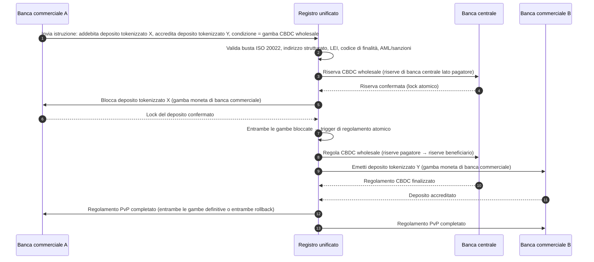

<!-- lead-start: manual -->
<aside class="post-lead" aria-label="Sintesi dell'articolo">

<strong>In sintesi.</strong> I pagamenti all'ingrosso nel 2026 si collocano all'incrocio di due transizioni strutturali: ISO 20022 che impone dati di pagamento strutturati nel modello operativo, e depositi tokenizzati più BIS Project Agorá che spingono il regolamento transfrontaliero verso binari atomici, programmabili e sempre attivi. La domanda 2026 per una banca non è più "abbiamo migrato i messaggi" ma "le nostre operazioni di pagamento sono misurabili, instradate e vigilabili" — e l'indice scompone la risposta in quattro percentuali esatte: completezza dei dati strutturati, ottimalità del routing dei binari, latenza della definitività del regolamento e copertura dei corridoi Agorá.

<strong>Punti chiave</strong>

<ul class="post-lead-takeaways">
  <li><strong>Novembre 2026 è una scadenza vincolante, non un orientamento.</strong> SWIFT rimuove il supporto agli indirizzi non strutturati nel rilascio SR 2026; i pagamenti privi di città e paese nei campi designati smettono di essere compensati. Costo di repair, tasso di reject e capacità operativa passano da "metrica" a "postura visibile al regolatore".</li>
  <li><strong>I depositi tokenizzati battono gli stablecoin nel wholesale regolamentato.</strong> Preservano la relazione banca-depositante e l'asset di regolamento di banca centrale, esponendo al contempo programmabilità. Gli stablecoin mantengono un ruolo periferico; i depositi tokenizzati ancorano il nucleo.</li>
  <li><strong>BIS Project Agorá è il riferimento per i corridoi.</strong> Se il prodotto transfrontaliero di una banca non è eseguibile dentro un corridoio Agorá entro il 2027, sta competendo su un binario che il resto del mercato sta già abbandonando.</li>
  <li><strong>L'orchestrazione dei binari real-time è il modello operativo.</strong> La decisione multi-binario del 2026 (FedNow / RTP / TIPS / SEPA Inst / on-chain) non è "quale binario" — è il registro di policy, il profilo di liquidità e il motore di routing che scelgono il binario per ogni pagamento.</li>
  <li><strong>Misurare o essere misurati.</strong> Quattro percentuali — completezza dei dati strutturati, ottimalità del routing dei binari, latenza della definitività del regolamento, copertura dei corridoi Agorá — convertono la postura dei pagamenti in evidenza pronta per la vigilanza prima della finestra di audit 2026/27.</li>
</ul>
</aside>
<!-- lead-end -->

# L'indice dei pagamenti all'ingrosso nel 2026: ISO 20022, depositi tokenizzati, binari real-time e regolamento transfrontaliero

I pagamenti all'ingrosso nel 2026 vengono ridisegnati da due transizioni simultanee: dati di pagamento strutturati e regolamento programmabile. La scadenza SWIFT di novembre 2026 sull'indirizzo strutturato impone la qualità del dato nel modello operativo, mentre BIS Project Agorá e i depositi tokenizzati verificano se il regolamento transfrontaliero possa diventare più atomico, trasparente e sempre attivo.

---

> **Sintesi esecutiva / Punti chiave**
>
> - **Novembre 2026 è una scadenza dura sui dati.** SWIFT dichiara che i pagamenti contenenti indirizzi non strutturati non saranno più supportati dopo il rilascio SR 2026.
> - **Il dato strutturato diventa infrastruttura di prodotto.** Città e paese devono comparire come minimo nei campi designati, trasformando la qualità del dato di pagamento in una questione di clienti, operazioni e compliance.
> - **I depositi tokenizzati sono un'opzione di design wholesale.** Project Agorá esplora depositi tokenizzati di banca commerciale e riserve tokenizzate di banca centrale in un modello a registro unificato.
> - **L'indice deve misurare la qualità del regolamento, non solo la velocità.** Definitività del regolamento, trasparenza, tassi di repair, uso di liquidità, dati di compliance e visibilità al cliente contano quanto l'esecuzione istantanea.
> - **I pagamenti transfrontalieri restano un'agenda pubblico-privata.** L'FSB continua a guidare la roadmap G20 in fase di attuazione, con coordinamento fra settore pubblico e privato.
>
---

## Perché il 2026 è l'anno in cui questo indice conta

Lo Stanford AI Index è utile perché tratta un settore tecnologico in rapida evoluzione come qualcosa di misurabile: produzione di ricerca, prestazioni tecniche, deployment responsabile, economia, adozione settoriale, policy e sentiment pubblico vengono inquadrati in un'unica cornice ([Stanford HAI ⧉](https://hai.stanford.edu/ai-index/2026-ai-index-report "The 2026 AI Index Report")). Banche e istituzioni finanziarie hanno ora bisogno della stessa disciplina per l'infrastruttura. AI agentica, sicurezza quantum-safe, resilienza cloud-nativa e pagamenti all'ingrosso non sono più filoni di innovazione separati; convergono in un unico modello operativo.

La domanda pratica per una banca non è se ciascun dominio sia importante. È se l'istituzione sappia misurare la prontezza in tutti contemporaneamente. Una banca può mettere in produzione l'AI agentica e restare fragile se la sua crittografia non è pronta alla migrazione. Può modernizzare le piattaforme cloud e fallire comunque se i dati di pagamento restano non strutturati. Può condurre pilot di tokenizzazione e generare rischio sistemico se i livelli di regolamento, liquidità, identità e registro di audit non sono progettati insieme.

## L'architettura dell'indice 2026

| Livello dell'indice | Direzione 2026 | Metrica di prontezza | Rischio in caso di gestione errata |
|---|---|---|---|
| **Dati ISO 20022** | Passaggio da testo non strutturato a campi strutturati governati | Prontezza dell'indirizzo strutturato e tasso di reject | Reject di pagamento e repair manuale |
| **Orchestrazione dei binari** | Routing fra RTGS, instant, corrispondenza, stablecoin e binari tokenizzati | Costo, velocità, definitività e routing consapevole della giurisdizione | Binari frammentati con controlli duplicati |
| **Regolamento tokenizzato** | Uso di depositi tokenizzati e moneta di banca centrale dove riducono frizione | Copertura DvP, PvP e regolamento atomico | Asset pilot senza valore di workflow di business |
| **Liquidità** | Ottimizzazione di liquidità intraday, cash intrappolato e finestre di regolamento | Liquidità risparmiata e riduzione dei fallimenti di regolamento | Drenaggi di liquidità più rapidi |
| **Compliance** | Inserimento di AML, sanzioni, FATF e requisiti di registro di audit nei dati di pagamento | Compliance straight-through e spiegabilità | Dati più ricchi senza controlli più solidi |

## Segnali chiave dei pagamenti all'ingrosso mappati sulle priorità globali

Il set di segnali 2026 non è un'agenda di ricerca. È una checklist di delivery sulla quale il Chief Payments Officer di una banca è già misurato. Il lavoro di remediation si materializza in tre punti: la busta del messaggio, il livello di orchestrazione dei binari e il registro di regolamento.

| Segnale | Riferimento G20 / SWIFT / BIS | Implementazione tecnica sulla piattaforma |
|---|---|---|
| **Il 65% dei messaggi di pagamento contiene ancora indirizzi non strutturati** | [SWIFT SR 2026 — scadenza indirizzo strutturato, nov. 2026 ⧉](https://www.swift.com/news-events/news/iso-20022-milestone-november-2026-unstructured-addresses-be-removed "Scadenza ISO 20022 indirizzo strutturato novembre 2026") | Validazione di schema nel middleware di pagamento prima che il messaggio raggiunga l'adapter SWIFTNet; parsing automatico dell'indirizzo all'ingresso da canale corporate + banca corrispondente. |
| **Target FSB G20: 75 % dei pagamenti transfrontalieri completati entro 1 ora entro il 2027** | [Roadmap FSB sui pagamenti transfrontalieri, fase di attuazione 2026 ⧉](https://www.fsb.org/2026/03/fsb-kicks-off-new-implementation-phase-to-enhance-cross-border-payments-through-public-private-partnership/ "Fase di attuazione pagamenti transfrontalieri") | Gateway di conversione FX in tempo reale con finestre di liquidità pre-concordate; hook di conferma T+0 nel portale cliente; motore di routing che esclude qualsiasi corridoio incapace di rispettare la busta da 1 ora. |
| **Target FSB G20: costo medio della transazione transfrontaliera sotto l'1 %, retail sotto il 3 %** | [Target quantitativi G20 dell'FSB ⧉](https://www.fsb.org/2026/03/fsb-kicks-off-new-implementation-phase-to-enhance-cross-border-payments-through-public-private-partnership/ "Fase di attuazione pagamenti transfrontalieri") | Telemetria di attribuzione dei costi su ogni corridoio (spread FX, commissione di corrispondenza, lifting cost); registro di policy sui margini che evidenzia il pricing non conforme prima del quote. |
| **BIS Project Agorá entra in fase di prototipo con sette banche centrali + 41 banche commerciali** | [BIS Project Agorá ⧉](https://www.bis.org/about/bisih/topics/fmis/agora.htm "Project Agorá") | Specifica di integrazione del registro unificato: nodo del registro di depositi tokenizzati + piano di regolamento in CBDC wholesale + hook KYC/AML; pool di liquidità on-chain dimensionati alla quota di corridoio della banca. |
| **Il framework "digital money" di Deutsche Bank si cristallizza nell'architettura cliente** | [Deutsche Bank — Digital Money: stablecoin, depositi tokenizzati e CBDC ⧉](https://flow.db.com/publications/flow-white-papers-and-guides/digital-money-a-perspective-on-stablecoins-tokenised-deposits-and-cbdcs "Digital Money: stablecoin, depositi tokenizzati e CBDC") | API di regolamento agnostica al wallet che astrae la selezione fra stablecoin / deposito tokenizzato / CBDC per ciascun pagamento; condizioni programmabili valutate sul registro di policy della banca, non su quello del cliente. |

## Il punto di svolta dei dati di pagamento

ISO 20022 è passato da progetto di formato di messaggistica a modello operativo di qualità del dato. Se i dati su beneficiario, debitore, creditore, agente, città, paese, finalità e parte sono deboli, la banca subirà reject, repair, frizione su sanzioni, frustrazione del cliente e analytics deboli.

**SR 2026 trasforma il tema in un contratto vincolante, non in un avviso.** Il rilascio SWIFT Standards 2026 (novembre 2026) impone la regola dell'indirizzo strutturato al livello di rete — i messaggi il cui elemento `<PstlAdr>` non contiene `<TwnNm>` e `<Ctry>` saranno rifiutati in ricezione dallo stack di validazione SWIFTNet, non segnalati per repair. La coda di repair smette di essere una voce di costo di back-office e diventa un evento di fallimento del regolamento con ritardo visibile al cliente. I team operativi che hanno trattato SR 2026 come "linea guida più stringente" stanno lavorando sul runbook sbagliato.

### Conformità dei dati di pagamento strutturati in ISO 20022

La superficie di remediation è ristretta e ben definita. Gli elementi XML qui sotto sono i punti in cui lo stack di validazione SWIFTNet di novembre 2026 effettivamente rifiuta i messaggi; tutto il resto è conseguenza a valle.

| Elemento dato | Tag XML ISO 20022 | Requisito SWIFT novembre 2026 | Strategia di remediation tecnica |
|---|---|---|---|
| **Indirizzo strutturato** | `<PstlAdr>` contenente `<TwnNm>` + `<Ctry>` | Obbligatorio. Il testo `<AdrLine>` non strutturato innesca il reject di rete sull'adapter SWIFTNet ricevente. | Parsing automatico dell'indirizzo all'avvio del pagamento; riscrittura dei form sul canale corporate; cleansing del back-book su ogni controparte prima del prossimo addebito. |
| **Legal Entity Identifier (LEI)** | `<Id>` sotto `<OrgId>` | Fortemente raccomandato per la verifica delle controparti finanziarie non-individuali; obbligatorio in diversi corridoi CBPR+. | Lookup LEI + cross-check GLEIF in onboarding corporate; arricchimento automatico delle controparti di back-book tramite servizi di reference data. |
| **Codici di finalità del pagamento** | `<Purp>` contenente `<Cd>` | Obbligatorio in più corridoi real-time regionali (CBPR+, SEPA Inst, TIPS) per lo screening AML / sanzioni automatizzato. | Mappare i codici transazione interni della banca sull'elenco standard ISO 20022 ExternalPurposeCode; esporre la selezione di finalità nell'UI del canale corporate; default-deny sui codici sconosciuti. |
| **Parti finali (Ultimate Parties)** | `<UltmtDbtr>` / `<UltmtCdtr>` | Esporre il contesto del beneficiario finale per soddisfare la travel rule FATF G20 + i parametri sanzioni; obbligatorio per diversi codici di tipo pagamento. | Estrarre i nomi delle parti end-to-end dai sotto-conti di ledger; riconciliare contro il grafo KYC; far emergere la parte finale su ogni conferma. |
| **Informazioni di rimessa (strutturate)** | `<RmtInf><Strd>` con `<RfrdDocInf>` | Richieste per i pagamenti corporate riconciliabili e collegati a fattura nell'ambito di CBPR+ Fase 2. | Catturare la rimessa strutturata al momento del quote nel portale corporate; rifiutare il fallback in testo libero per i flussi di importo elevato. |

## Depositi tokenizzati e CBDC all'ingrosso

I depositi tokenizzati preservano il modello di moneta di banca commerciale aggiungendo programmabilità. La moneta di banca centrale all'ingrosso preserva la definitività del regolamento. Il pattern di design interessante è la combinazione: moneta di banca commerciale per relazioni clienti e intermediazione del credito, moneta di banca centrale per regolamento finale e fiducia sistemica.

Project Agorá rende concreta la combinazione. L'architettura qui sotto è il pattern di riferimento BIS per un regolamento transfrontaliero atomico payment-versus-payment (PvP) che usa sia un registro di depositi di banca commerciale sia un piano di regolamento in CBDC wholesale, coordinati attraverso un registro unificato.

Il regolamento è atomico per costruzione: entrambe le gambe sono confermate o entrambe rollback. La definitività del regolamento sulla gamba in CBDC wholesale rende efficace il trasferimento del deposito tokenizzato di banca commerciale senza rischio di corrispondenza. Il registro unificato è il piano di coordinamento, non un sistema di pagamento a sé stante — la banca centrale resta l'emittente dell'asset di regolamento e la banca commerciale continua a contabilizzare la passività del deposito.

## Il nuovo prodotto di pagamento all'ingrosso

Il prodotto non è più semplicemente un pagamento. È un pacchetto di esecuzione, dato, liquidità, compliance, tracciabilità e gestione delle eccezioni. Le banche che sapranno esporre tali capacità attraverso API e cruscotti per i clienti convertiranno la compliance infrastrutturale in valore per il cliente.

## Cosa significa per tipo di banca

### Banche di rilevanza sistemica globale

Le banche globali devono trattare questo indice come una scorecard di architettura d'impresa. La priorità non è un ulteriore proof of concept; è l'evidenza che workflow autonomi, migrazione crittografica, dipendenza cloud e modernizzazione dei pagamenti possano essere governati come unico sistema di rischio e valore.

### Banche di transazione e corporate

Le banche di transazione devono concentrarsi su pagamenti all'ingrosso, dati strutturati, liquidità, depositi tokenizzati e servizi di tesoreria agentici. La proposizione di maggior valore per il cliente non è solo il movimento di denaro più veloce; è il movimento di denaro spiegabile, auditabile e programmabile, con meno indagini e migliore visibilità sul capitale circolante.

### Banche regionali

Le banche regionali devono usare l'indice per evitare la dispersione di programmi. Non devono guidare ogni frontiera, ma necessitano di posizioni credibili su governance dell'AI, inventario post-quantistico, evidenza di uscita dal cloud e prontezza del dato di pagamento.

### Fintech, PSP e fornitori di infrastruttura

Fintech e fornitori di infrastruttura devono allineare le proprie roadmap di prodotto alla prontezza misurabile delle banche. Le proposizioni migliori riducono il rischio di integrazione, rafforzano l'evidenza e rendono più semplice per le banche governare un'infrastruttura complessa.

## Conclusione

Il valore di un report in formato indice è convertire un'agenda tecnologica frammentata in un modello operativo misurabile. Nel 2026, i vincitori dell'infrastruttura finanziaria non saranno le istituzioni con il maggior numero di pilot. Saranno quelle in grado di dimostrare prontezza simultaneamente su autonomia, sicurezza, resilienza, regolamento, economia e governance.

## Domande frequenti

**Perché ISO 20022 è ancora un tema 2026?**

Perché la migrazione non è completa finché i dati di pagamento non sono strutturati, governati, catturati alla sorgente e utilizzabili su canali, clienti e infrastrutture di mercato.

**Cos'è un deposito tokenizzato?**

Un deposito tokenizzato è una rappresentazione digitale di moneta di banca commerciale, progettata per preservare la relazione banca-depositante e abilitare al contempo il regolamento programmabile.

**I depositi tokenizzati sostituiscono gli stablecoin?**

Non ovunque. Gli stablecoin possono restare utili in alcuni contesti digital-asset e transfrontalieri, mentre i depositi tokenizzati sono strutturalmente attrattivi per il banking wholesale regolamentato.

**Cosa devono misurare le banche?**

Misurare la prontezza del dato strutturato, i reject di pagamento, il costo di repair, il tempo di regolamento, l'uso di liquidità, gli esiti del routing dei binari e la visibilità al cliente.

## Riferimenti

- SWIFT, (2026). [Scadenza ISO 20022 indirizzo strutturato novembre 2026 ⧉](https://www.swift.com/news-events/news/iso-20022-milestone-november-2026-unstructured-addresses-be-removed "Scadenza ISO 20022 indirizzo strutturato novembre 2026").
- BIS Innovation Hub, (2026). [Project Agorá ⧉](https://www.bis.org/about/bisih/topics/fmis/agora.htm "Project Agorá").
- FSB, (2026). [Fase di attuazione dei pagamenti transfrontalieri ⧉](https://www.fsb.org/2026/03/fsb-kicks-off-new-implementation-phase-to-enhance-cross-border-payments-through-public-private-partnership/ "Fase di attuazione pagamenti transfrontalieri").
- Deutsche Bank, (2026). [Digital Money: stablecoin, depositi tokenizzati e CBDC ⧉](https://flow.db.com/publications/flow-white-papers-and-guides/digital-money-a-perspective-on-stablecoins-tokenised-deposits-and-cbdcs "Digital Money: stablecoin, depositi tokenizzati e CBDC").

<!-- enrich-start -->
<aside class="author-card" aria-label="Informazioni sull'autore"><strong class="author-card-name"><a href="/about/index.html">Sebastien Rousseau</a></strong>Senior banking technologist. Scrive di AI applicata, infrastrutture di pagamento, moneta tokenizzata, ISO 20022, sicurezza post-quantistica, servizi finanziari cloud-nativi e mercati digitali regolamentati.Oltre 20 anni tra HSBC Commercial &amp; Investment Bank, PayPal, Barclays, Shazam, AKQA, Virgin Group. <a href="/about/index.html">Profilo completo</a> &middot; <a href="https://www.linkedin.com/in/sebastienrousseau/" rel="external noopener">LinkedIn</a> &middot; <a href="https://github.com/sebastienrousseau" rel="external noopener">GitHub</a></aside>

Ultima revisione <time datetime="2026-06-06">2026-06-06</time>.

<!-- enrich-end -->
