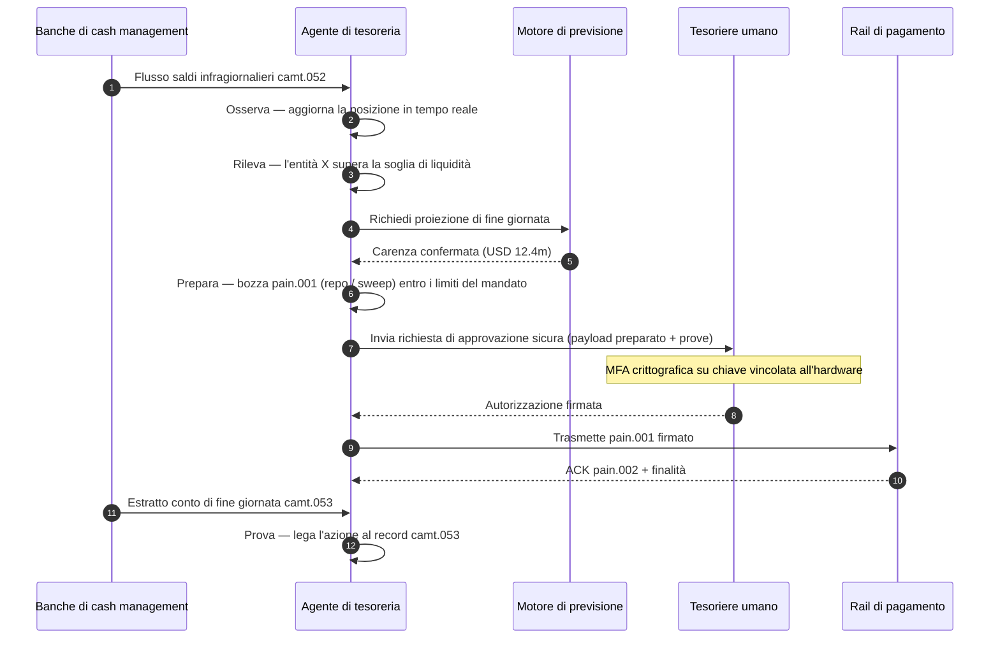

# Autonomous Treasury Index 2026: tesoreria agentica, liquidità programmabile, depositi tokenizzati e controllo di cassa in tempo reale

<!-- lead-start -->
<aside class="post-lead" aria-label="Sintesi dell'articolo">

<strong>In sintesi.</strong> Un indice della tesoreria autonoma per il 2026 — misura i workflow agentici, la copertura della liquidità programmabile, l'integrazione dei depositi tokenizzati, l'orchestrazione dei pagamenti in tempo reale e il controllo di cassa automatizzato come un'unica architettura del modello operativo.

<strong>Punti chiave</strong>

<ul class="post-lead-takeaways">
  <li><strong>La tesoreria sta diventando un sistema operativo in tempo reale.</strong> Le previsioni di cassa statiche e gli sweep batch non sono più l'unità di misura; lo sono i workflow agentici che girano su dati in tempo reale.</li>
  <li><strong>La liquidità programmabile è ora realizzabile.</strong> Depositi tokenizzati + rail in tempo reale rendono il provisioning di liquidità per singolo evento una primitiva del workflow, non un'iniziativa trimestrale.</li>
  <li><strong>I depositi tokenizzati sono la moneta digitale preferita dal tesoriere.</strong> Economia della moneta bancaria, programmabilità e certezza infragiornaliera — senza i temi di rischio emittente e di riserve delle stablecoin.</li>
  <li><strong>Il control plane è la nuova superficie di audit.</strong> Mandati, limiti, percorsi di override manuale e prove di storno devono essere primitive di piattaforma, non approvazioni manuali per singola azione.</li>
  <li><strong>Lo scorecard del CFO è per decisione, non per trimestre.</strong> Costo della liquidità, riduzione del buffer di liquidità infragiornaliera, efficienza FX e accuratezza della previsione di cassa si misurano alla velocità del workflow.</li>
</ul>

<strong>Letture correlate:</strong> <a href="https://sebastienrousseau.com/2026-05-25-programmable-liquidity-ai-tokenised-deposits-real-time-treasury-2026/index.html">Liquidità programmabile nel 2026: AI, depositi tokenizzati e orchestrazione della tesoreria in tempo reale</a>, <a href="https://sebastienrousseau.com/2026-05-21-tokenised-deposits-banking-services-status-2026/index.html">Depositi tokenizzati nel 2026: servizi bancari, concorrenza delle stablecoin e stato della moneta bancaria commerciale programmabile</a>.

</aside>
<!-- lead-end -->

La tesoreria autonoma è il punto di incontro naturale tra AI agentica, pagamenti wholesale, depositi tokenizzati e liquidità in tempo reale. Nel 2026 le migliori architetture di tesoreria non si limiteranno a prevedere la cassa: raccomanderanno, spiegheranno e, alla fine, eseguiranno azioni di liquidità delimitate su conti, valute, rail e asset di regolamento.

---

> **Sintesi esecutiva / Punti chiave**
>
> - **La tesoreria si sposta dalla rendicontazione al controllo.** Saldi in tempo reale, previsioni, stato dei pagamenti e movimento di liquidità entrano in un unico workflow.
> - **L'AI agentica crea una nuova interfaccia di tesoreria.** Gli agenti possono monitorare le posizioni, far emergere anomalie, preparare azioni di funding ed escalare decisioni entro mandati definiti.
> - **La moneta programmabile cambia la gamba cash.** Depositi tokenizzati e sperimentazioni di CBDC wholesale aprono nuove possibilità di regolamento atomico, pagamenti condizionati e liquidità always-on.
> - **L'indice deve misurare l'autorità.** Il punto non è se l'agente possa suggerire un'azione: è se autorità, limiti, approvazioni e prove siano chiari.
> - **Il valore della tesoreria è misurabile.** Liquidità risparmiata, investigazioni manuali ridotte, fallimenti di regolamento evitati e capitale circolante liberato devono definire il successo.
>
---

## Perché il 2026 è l'anno in cui questo indice conta

Lo Stanford AI Index è utile perché tratta un ambito tecnologico in rapida evoluzione come qualcosa di misurabile: produzione di ricerca, performance tecnica, deployment responsabile, economia, adozione settoriale, policy e percezione pubblica vengono ricondotti a un quadro unico ([Stanford HAI ⧉](https://hai.stanford.edu/ai-index/2026-ai-index-report "The 2026 AI Index Report")). Banche e istituzioni finanziarie hanno ora bisogno della stessa disciplina per l'infrastruttura. AI agentica, sicurezza quantum-safe, resilienza cloud-native e pagamenti wholesale non sono più filoni di innovazione separati: stanno convergendo in un unico modello operativo.

La domanda pratica per una banca non è se ciascun ambito sia importante. È se l'istituzione sappia misurare la maturità in tutti contemporaneamente. Una banca può adottare l'AI agentica e restare fragile se la sua crittografia non è pronta alla migrazione. Può modernizzare le piattaforme cloud e fallire comunque se i dati di pagamento restano non strutturati. Può condurre pilot di tokenizzazione e creare comunque rischio sistemico se gli strati di regolamento, liquidità, identità e audit non sono progettati insieme.

## L'architettura dell'indice 2026

| Strato dell'indice | Direzione 2026 | Metrica di maturità | Rischio se mal gestito |
|---|---|---|---|
| **Visibilità** | Unificare i dati di conto, pagamento, liquidità ed esposizione | Copertura delle posizioni di cassa in tempo reale | Visibilità di cassa frammentata |
| **Previsione** | Usare l'AI per prevedere saldi, flussi e fabbisogni di funding | Accuratezza della previsione di cassa e tasso di eccezioni | Falsa fiducia su dati deboli |
| **Autonomia** | Conferire agli agenti un'autorità delimitata per raccomandazioni e azioni | Copertura dei mandati e qualità delle approvazioni | Azioni non autorizzate o non spiegate |
| **Programmabilità** | Usare depositi tokenizzati e condizioni smart dove aggiungono valore | Casi d'uso di pagamento condizionato e regolamento atomico | Pilot di tesoreria guidati dalla tecnologia |
| **Controlli** | Integrare limiti, sanzioni, FX, liquidità e controlli di audit | Prove di controllo per ogni azione di tesoreria | Governance manuale dopo l'esecuzione |

## Segnali correnti da monitorare

| Segnale | Cosa significa per le banche | Fonte |
|---|---|---|
| **52% di adozione dell'AI agentica nei servizi finanziari** | La tesoreria può ora assorbire workflow agentici tramite piattaforme governate | [Cambridge CCAF ⧉](https://www.jbs.cam.ac.uk/faculty-research/centres/alternative-finance/publications/2026-global-ai-in-financial-services-report/ "2026 Global AI in Financial Services Report") |
| **Pagamenti condizionati di Project Agorá** | La tokenizzazione può abilitare pagamenti condizionati e always-on | [BIS ⧉](https://www.bis.org/about/bisih/topics/fmis/agora.htm "Project Agorá") |
| **Bank of England Digital Securities Sandbox** | Le obbligazioni e le azioni emesse su DLT regolano su base Consegna contro Pagamento (DvP) — la gamba dell'asset e la gamba cash (CBDC wholesale o depositi tokenizzati di banca commerciale) regolano nella stessa transazione atomica, rimuovendo il rischio di controparte sul capitale | [Bank of England ⧉](https://www.bankofengland.co.uk/financial-stability/digital-securities-sandbox "Digital Securities Sandbox") |
| **Scadenza SWIFT per gli indirizzi strutturati** | I dati di tesoreria vanno catturati correttamente alla fonte | [SWIFT ⧉](https://www.swift.com/news-events/news/iso-20022-milestone-november-2026-unstructured-addresses-be-removed "Milestone ISO 20022 di novembre 2026 sugli indirizzi strutturati") |
| **Le grandi FI faticano a misurare il valore dell'AI** | L'automazione di tesoreria richiede metriche economiche rigorose | [Cambridge CCAF ⧉](https://www.jbs.cam.ac.uk/faculty-research/centres/alternative-finance/publications/2026-global-ai-in-financial-services-report/ "2026 Global AI in Financial Services Report") |

## Il mandato dell'agente di tesoreria

Un agente di tesoreria non va progettato come assistente generalista. Ha bisogno di un mandato: osservare i conti, rilevare le eccezioni, prevedere i gap di funding, preparare le azioni, richiedere le approvazioni, eseguire entro i limiti e produrre prove. Ogni passo deve avere un modello di autorità distinto.

Il ciclo di controllo segue Osserva → Rileva → Prevedi → Prepara → Richiedi Approvazione — e si ferma. L'agente non oltrepassa mai da solo il confine dell'autorizzazione crittografica. Il diagramma sotto traccia un ciclo completo: una carenza di liquidità infragiornaliera da svariati milioni di dollari emerge nella telemetria `camt.052`, l'agente prevede la posizione di fine giornata, prepara un repo o uno sweep intercompany come `pain.001` completamente formato e lo consegna al tesoriere umano per la firma crittografica multi-fattore su una chiave vincolata all'hardware. L'agente trasmette poi il payload firmato; la finalità arriva come ACK `pain.002` e successivo `camt.053` di riferimento.

Il confine è il punto: ogni azione che muove denaro reale si trova dietro una porta crittografica che l'agente non può varcare da solo.

## Liquidità programmabile

La liquidità programmabile è la capacità di muovere valore a condizioni: se viene superata una soglia, se il collaterale è eleggibile, se una controparte supera lo screening, se la finalità di regolamento è disponibile o se un buffer di liquidità infragiornaliera è troppo basso. I depositi tokenizzati e le piattaforme di regolamento wholesale rendono questi pattern più praticabili.

Programmabile non significa fuori standard. Il percorso di esecuzione è `pain.001` — ISO 20022 Customer Credit Transfer Initiation. L'azione preparata dall'agente è un payload `pain.001` completamente formato, instradato alla banca sullo stesso canale che userebbe un ERP corporate, validato sullo stesso schema, valutato dagli stessi motori antifrode e sanzioni e riscontrato sugli stessi report di stato `pain.002`. Lo strato di condizionalità (soglia, eleggibilità del collaterale, disponibilità della finalità, livello minimo del buffer) vive sopra il messaggio: governa *se* un `pain.001` viene inviato, non *che forma* assume. Le piattaforme di tesoreria che inventano payload su misura per esprimere condizioni usciranno dal percorso consumabile dalla banca e ricadranno nell'integrazione bilaterale.

## La control room di tesoreria

Il modello operativo dovrebbe somigliare a una control room: posizioni, previsioni di cassa, stati dei pagamenti, utilizzo dei limiti, eccezioni, approvazioni e prove in un'unica interfaccia. L'indice dovrebbe penalizzare gli stack di tesoreria che obbligano i team a cucire insieme email, fogli di calcolo, portali bancari e cruscotti scollegati.

Il data plane dietro a quell'interfaccia è il cash management ISO 20022. La posizione infragiornaliera è `camt.052` — Bank-to-Customer Account Report — trasmesso da ogni banca di cash management nello strato di osservazione dell'agente alla frequenza con cui la banca lo pubblica (minuti per i provider GTB di prima fascia, fine ciclo per la coda lunga). La riconciliazione di fine giornata è `camt.053` — Bank-to-Customer Statement — il record auditabile su cui la previsione dell'agente viene valutata il mattino successivo. Le piattaforme di tesoreria che leggono estratti conto PDF o fanno screen-scraping dei portali bancari non possono raggiungere il Livello 4 dell'indice; la telemetria infragiornaliera deve arrivare come `camt.052` strutturato perché il loop di previsione si chiuda in tempo per agire.

## Cosa significa per tipo di banca

### Banche di rilevanza sistemica globale

Le banche globali devono trattare questo indice come uno scorecard di enterprise architecture. La priorità non è un'altra proof of concept: è la prova che workflow autonomi, migrazione crittografica, dipendenza dal cloud e modernizzazione dei pagamenti possano essere governati come un unico sistema di rischio e di valore.

### Transaction bank e banche corporate

Le transaction bank devono concentrarsi su pagamenti wholesale, dati strutturati, liquidità, depositi tokenizzati e servizi di tesoreria agentica. La proposizione cliente più preziosa non è solo la maggiore velocità del movimento di denaro: è un movimento di denaro spiegabile, auditabile e programmabile, con meno investigazioni e migliore visibilità sul capitale circolante.

### Banche regionali

Le banche regionali dovrebbero usare l'indice per evitare la proliferazione di programmi. Non devono guidare ogni frontiera, ma devono avere posizioni credibili su governance dell'AI, inventario post-quantistico, prove di uscita dal cloud e maturità del dato di pagamento.

### Fintech, PSP e fornitori di infrastruttura

Fintech e fornitori di infrastruttura devono allineare le proprie roadmap di prodotto alla maturità misurabile delle banche. Le proposizioni migliori ridurranno il rischio di integrazione, rafforzeranno le prove e renderanno più semplice per le banche governare un'infrastruttura complessa.

## Conclusione

Il valore di un report in formato indice è che traduce un'agenda tecnologica frammentata in un modello operativo misurabile. Nel 2026 non vinceranno, nell'infrastruttura finanziaria, le istituzioni con il maggior numero di pilot. Vinceranno quelle capaci di dimostrare maturità, allo stesso tempo, su autonomia, sicurezza, resilienza, regolamento, economia e governance.

## Domande frequenti

**Che cos'è la tesoreria autonoma?**

La tesoreria autonoma è l'uso di agenti AI, dati in tempo reale e pagamenti programmabili per monitorare, raccomandare e potenzialmente eseguire azioni di tesoreria entro controlli definiti.

**Gli agenti di tesoreria dovrebbero poter eseguire pagamenti?**

Solo all'interno di mandati ristretti, con limiti robusti, approvazioni esplicite e piena auditabilità. L'autorità di esecuzione va guadagnata attraverso la maturità.

**Come aiutano i depositi tokenizzati la tesoreria?**

Possono supportare regolamento programmabile, esecuzione atomica e potenzialmente un migliore controllo della liquidità infragiornaliera, preservando il rapporto con la moneta della banca commerciale.

**Qual è il primo passo di implementazione?**

Costruire visibilità in tempo reale e qualità del dato prima di concedere autonomia. Gli agenti non possono ottimizzare in sicurezza una cassa che non riescono a vedere con precisione.

## Riferimenti

- Cambridge Centre for Alternative Finance, (2026). [2026 Global AI in Financial Services Report ⧉](https://www.jbs.cam.ac.uk/faculty-research/centres/alternative-finance/publications/2026-global-ai-in-financial-services-report/ "2026 Global AI in Financial Services Report").
- SWIFT, (2026). [Milestone ISO 20022 di novembre 2026 sugli indirizzi strutturati ⧉](https://www.swift.com/news-events/news/iso-20022-milestone-november-2026-unstructured-addresses-be-removed "Milestone ISO 20022 di novembre 2026 sugli indirizzi strutturati").
- BIS Innovation Hub, (2026). [Project Agorá ⧉](https://www.bis.org/about/bisih/topics/fmis/agora.htm "Project Agorá").
- Bank of England, (2026). [Plasmare il futuro finanziario digitale del Regno Unito ⧉](https://www.bankofengland.co.uk/speech/2025/january/sasha-mills-speech-at-the-tokenisation-summit "Plasmare il futuro finanziario digitale del Regno Unito").

<!-- enrich-start -->
<aside class="author-card" aria-label="Informazioni sull'autore"><strong class="author-card-name"><a href="/about/index.html">Sebastien Rousseau</a></strong>Senior banking technologist. Scrive di AI applicata, infrastrutture di pagamento, moneta tokenizzata, ISO 20022, sicurezza post-quantistica, servizi finanziari cloud-native e mercati digitali regolamentati.Oltre 20 anni tra HSBC Commercial &amp; Investment Bank, PayPal, Barclays, Shazam, AKQA, Virgin Group. <a href="/about/index.html">Profilo completo</a> &middot; <a href="https://www.linkedin.com/in/sebastienrousseau/" rel="external noopener">LinkedIn</a> &middot; <a href="https://github.com/sebastienrousseau" rel="external noopener">GitHub</a></aside>

Ultima revisione <time datetime="2026-06-07">2026-06-07</time>.

<!-- enrich-end -->
