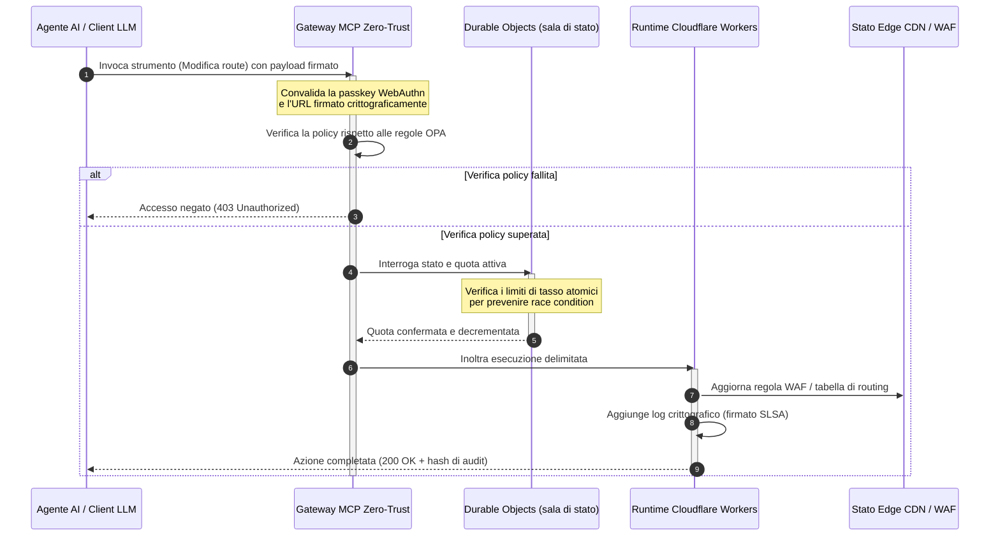

---

# Front Matter (YAML)

author: "contact@sebastienrousseau.com (Sebastien Rousseau)"
banner_alt: "Stack di rack di data centre illuminati nella notte — simbolo dell'edge ispezionabile, controllabile dagli agenti e open source su cui si fonda CloudCDN"
banner_height: "1597"
banner_width: "2584"
banner: "https://cloudcdn.pro/stocks/images/alis-po-IdVNRv-5wJo.webp"
cdn: "https://cloudcdn.pro"
charset: "UTF-8"
cname: "sebastienrousseau.com"
copyright: "© Copyright 2025 - 2026 - Sebastien Rousseau. Tutti i diritti riservati."
date: "11 giugno 2026"
description: "CloudCDN trasforma la CDN in un piano di controllo edge sicuro e controllabile dagli agenti: gateway MCP zero-trust, Durable Objects, SLSA Level 3, prove DORA."
format-detection: "telephone=no"
hreflang: "it"
icon: "https://cloudcdn.pro/clients/sebastienrousseau/v1/logos/sebastienrousseau.svg"
id: "https://sebastienrousseau.com/it/2026-06-11-cloudcdn-open-source-blueprint-ai-native-edge-2026"
image_alt: "Ritratto in bianco e nero di Sebastien Rousseau"
image_height: "162"
image_width: "162"
image: "https://cloudcdn.pro/stocks/images/sebastienrousseau.webp"
keywords: "CloudCDN, edge AI-nativo, CDN open source, server MCP, Cloudflare Workers, Durable Objects, zero trust, WebAuthn, URL firmati, SLSA Level 3, DORA, piano di controllo edge"
language: "it"
last_reviewed: "2026-06-11"
layout: "report"
locale: "it_IT"
logo_alt: "Logo di Sebastien Rousseau"
logo_height: "44"
logo_width: "44"
logo: "https://cloudcdn.pro/clients/sebastienrousseau/v1/logos/sebastienrousseau.svg"
menu: ""
measurementID: "G-169G4ET5HQ"
name: "Sebastien Rousseau"
permalink: "https://sebastienrousseau.com/it/2026-06-11-cloudcdn-open-source-blueprint-ai-native-edge-2026"
rating: "general"
referrer: "no-referrer"
robots: "index, follow"
schema: "FAQPage, Article"
seo_title: "CloudCDN: blueprint open source per l'edge AI-nativo"
short_name: "sebastienrousseau"
subtitle: "Spostare la CDN globale dal caching statico dei contenuti a un piano di controllo edge crittograficamente sicuro e controllabile dagli agenti."
tags: "CloudCDN, open source, CDN, edge, agenti AI, MCP, Cloudflare Workers, Durable Objects, rate limiting, zero trust, WebAuthn, SLSA, DORA, BCBS 239, Basel III, banking cloud-native"
theme-color: "0, 83, 191"
title: "CloudCDN: un blueprint open source per l'edge AI-nativo nel 2026"
url: "https://sebastienrousseau.com/it/2026-06-11-cloudcdn-open-source-blueprint-ai-native-edge-2026"
viewport: "width=device-width, initial-scale=1, shrink-to-fit=no"

# RSS - The RSS feed front matter (YAML).
atom_link: "https://sebastienrousseau.com/2026-06-11-cloudcdn-open-source-blueprint-ai-native-edge-2026/rss.xml"
category: "Technology"
docs: https://validator.w3.org/feed/docs/rss2.html
generator: "Static Site Generator (SSG) (version 0.0.26)"
item_description: "CloudCDN trasforma la CDN in un piano di controllo edge sicuro e controllabile dagli agenti: gateway MCP zero-trust, Durable Objects, SLSA Level 3, prove DORA."
item_guid: "https://sebastienrousseau.com/2026-06-11-cloudcdn-open-source-blueprint-ai-native-edge-2026/rss.xml"
item_link: "https://sebastienrousseau.com/2026-06-11-cloudcdn-open-source-blueprint-ai-native-edge-2026/rss.xml"
item_pub_date: "Thu, 11 Jun 2026 06:06:06 +0000"
item_title: "CloudCDN: un blueprint open source per l'edge AI-nativo nel 2026"
last_build_date: "Thu, 11 Jun 2026 06:06:06 +0000"
managing_editor: "contact@sebastienrousseau.com (Sebastien Rousseau)"
pub_date: "Thu, 11 Jun 2026 06:06:06 +0000"
ttl: "60"
type: "article"
webmaster: "contact@sebastienrousseau.com"

# Apple - The Apple front matter (YAML).
apple_mobile_web_app_orientations: "portrait"
apple_touch_icon_sizes: "192x192"
apple-mobile-web-app-capable: "yes"
apple-mobile-web-app-status-bar-inset: "black"
apple-mobile-web-app-status-bar-style: "black-translucent"
apple-mobile-web-app-title: "CloudCDN: blueprint open source per l'edge AI-nativo"
apple-touch-fullscreen: "yes"

# MS Application - The MS Application front matter (YAML).

msapplication-navbutton-color: "0, 83, 191"

# Twitter Card - The Twitter Card front matter (YAML).

twitter_card: "summary_large_image"
twitter_creator: "@wwdseb"
twitter_description: "CloudCDN trasforma la CDN in un piano di controllo edge sicuro e controllabile dagli agenti: gateway MCP zero-trust, Durable Objects, SLSA Level 3, prove DORA."
twitter_image: "https://cloudcdn.pro/clients/sebastienrousseau/v1/logos/sebastienrousseau.svg"
twitter_image_alt: "Logo di Sebastien Rousseau"
twitter_site: "@wwdseb"
twitter_title: "CloudCDN: blueprint open source per l'edge AI-nativo"
twitter_url: "https://sebastienrousseau.com/it/2026-06-11-cloudcdn-open-source-blueprint-ai-native-edge-2026"

excerpt: "CloudCDN è un blueprint open source per l'edge AI-nativo — un gateway MCP zero-trust con 42 strumenti, rate limiting atomico su Durable Objects, passkey WebAuthn, URL firmati, provenance di build SLSA Level 3 e 3.185 test al 100% di copertura, mappati su DORA, BCBS 239 e Basel III."

# Humans.txt - The Humans.txt front matter (YAML).
author_website: "https://sebastienrousseau.com"
author_twitter: "@wwdseb"
author_location: "London, UK"
thanks: "Grazie per la lettura!"
site_last_updated: "2026-06-11"
site_standards: "HTML5, CSS3, RSS, Atom, JSON, XML, YAML, Markdown, TOML"
site_components: "Kaishi, Kaishi Builder, Kaishi CLI, Kaishi Templates, Kaishi Themes"
site_software: "Static Site Generator, Rust"

---

# CloudCDN: un blueprint open source per l'edge AI-nativo nel 2026

<!-- lead-start: manual -->
<aside class="post-lead" aria-label="Sintesi dell'articolo">

<strong>In sintesi.</strong> La tecnologia enterprise nel 2026 è definita dalla convergenza tra esecuzione serverless distribuita a livello globale e AI agentica. Le CDN tradizionali — costruite per il caching di file statici e il routing di base del traffico — sono strutturalmente obsolete in un'era di orchestrazione attiva dei dati in tempo reale. CloudCDN è un blueprint open source che riconverte l'edge in un piano di controllo attivo: runtime serverless, coordinamento con stato tramite Cloudflare Durable Objects e un gateway Model Context Protocol (MCP) zero-trust che consente agli agenti AI autonomi di operare l'infrastruttura web entro perimetri operativi delimitati e protetti crittograficamente.

<strong>Punti chiave</strong>

<ul class="post-lead-takeaways">
  <li><strong>Dalla cache statica al piano di controllo delimitato.</strong> CloudCDN sposta il confine operativo sull'edge e converte i nodi CDN in gate di policy attivi che eseguono decisioni di sicurezza, routing e controllo degli accessi in meno di un millisecondo.</li>
  <li><strong>Coordinamento edge con stato.</strong> I Cloudflare Durable Objects applicano rate limiting atomico in tempo reale e coordinamento dello stato a livello globale — niente race condition distribuite, niente abuso sistemico delle quote tra regioni edge.</li>
  <li><strong>Gestione agentica sicura dell'infrastruttura via MCP.</strong> Un gateway zero-trust espone 42 strumenti MCP specializzati e consente agli agenti AI di ispezionare, configurare e operare l'infrastruttura entro vincoli firmati crittograficamente.</li>
  <li><strong>Sicurezza della supply chain come deliverable di pipeline.</strong> Provenance di build SLSA Level 3 via Sigstore/Cosign e 3.185 unit test al 100% di copertura su ogni release.</li>
  <li><strong>Evidenze per il consiglio di amministrazione, non dashboard.</strong> La telemetria edge si mappa direttamente sulla responsabilità del board ai sensi dell'Articolo 5 di DORA, sul reporting dei rischi BCBS 239 e sulle regole di capitale per il rischio operativo di Basel III.</li>
</ul>

<strong>Letture correlate:</strong> <a href="/2026-05-16-best-cloud-infrastructure-architecture-2026/">La migliore architettura di infrastruttura cloud nel 2026</a> · <a href="/2026-06-05-cloud-native-banking-index-dora-resilience-platform-engineering-2026/">L'indice del banking cloud-native nel 2026</a> · <a href="/2026-06-03-agentic-ai-index-banks-autonomy-governance-auditability-2026/">L'indice dell'AI agentica per le banche nel 2026</a>

</aside>
<!-- lead-end -->

Il dibattito sulle CDN è chiuso. L'edge non è più una cache; è il piano di controllo del software AI-nativo. Mentre gli agenti invocano strumenti, spostano dati, eseguono purge delle cache, richiedono URL firmati e coordinano workflow, il vecchio modello di dashboard opache e piani di controllo proprietari smette di essere un fastidio e diventa una passività regolamentare. CloudCDN sostiene un modello diverso: una piattaforma edge aperta, ispezionabile e controllabile dagli agenti, che tratta sicurezza, accessibilità, performance e auditabilità come default applicabili, non come promesse del fornitore.

Il riferimento open source di questo articolo è [cloudcdn.pro ⧉](https://github.com/sebastienrousseau/cloudcdn.pro "cloudcdn.pro"). Il repository è una CDN multi-tenant AI-nativa, leggibile end-to-end e distribuibile in autonomia: TTFB sotto i 100 ms sui PoP di Cloudflare, controllo MCP, rate limiting su Durable Objects, accessibilità WCAG-AA, URL firmati, passkey, SLSA Level 3 e 3.185 test al 100% di copertura.

---

> **Sintesi esecutiva / Punti chiave**
>
> - **L'edge diventa il confine operativo.** CloudCDN converte i nodi CDN tradizionali in gate di policy attivi che eseguono sicurezza, routing e controllo degli accessi in meno di un millisecondo.
> - **I Durable Objects rendono il rate limiting atomico.** L'enforcement delle quote in tempo reale e coerente a livello globale chiude la finestra di race condition che i limitatori a consistenza eventuale lasciano aperta ad attaccanti e agenti malfunzionanti.
> - **Gli agenti operano l'infrastruttura tramite 42 strumenti MCP delimitati.** Ogni invocazione è convalidata rispetto a passkey WebAuthn, payload firmati e policy OPA prima che qualsiasi cosa venga eseguita.
> - **La supply chain è parte del prodotto.** La provenance SLSA Level 3 via Sigstore/Cosign lega crittograficamente ogni release al suo codice sorgente sottoposto ad audit.
> - **La telemetria è evidenza di conformità.** Le operazioni edge si mappano sull'Articolo 5 di DORA, su BCBS 239 e sul capitale per il rischio operativo di Basel III — direttamente, non attraverso reportistica a posteriori.
>
---

## Perché questo progetto open source conta nel 2026

L'IT enterprise nel 2026 è passato dal provisioning statico dell'infrastruttura all'orchestrazione dei dati in tempo reale, guidata dagli eventi. Due forze di mercato guidano il cambiamento.

La prima è la proliferazione dell'AI agentica. Modelli autonomi e agenti software svolgono ormai compiti operativi complessi — mitigazione automatizzata delle minacce, decisioni di routing, bilanciamento dei registri contabili in tempo reale. Non usano dashboard. Invocano strumenti.

La seconda è l'applicazione attiva del [Digital Operational Resilience Act (DORA) ⧉](https://eur-lex.europa.eu/legal-content/EN/TXT/?uri=CELEX%3A32022R2554 "Regolamento (UE) 2022/2554 sulla resilienza operativa digitale per il settore finanziario"). Le istituzioni bancarie non possono più affidarsi a CDN di terze parti opache e proprietarie. I regolatori esigono piena visibilità sulla supply chain software, capacità di uscita verificabile e tracce di audit crittografiche inalterabili.

Le architetture server centralizzate impongono penalità di latenza che l'orchestrazione in tempo reale non può assorbire. Le CDN proprietarie funzionano come scatole nere che espongono le istituzioni a compromissioni della supply chain che non possono vedere, né tantomeno documentare. CloudCDN chiude quel divario con un blueprint trasparente, zero-trust e open source che trasforma l'edge in un piano di controllo attivo. Per i vertici tecnologici, sposta la conversazione dal costo della conformità al ritorno sulla resilienza (Return on Resilience): capitale preservato da pipeline operative automatizzate e pronte per l'audit.

## Lente architetturale

L'architettura di CloudCDN è strutturata su cinque livelli, che sostituiscono il middleware centralizzato con primitive edge localizzate e con stato:

| Livello | Decisione di progetto | Perché conta | Rischio se mal gestito |
|---|---|---|---|
| **Runtime edge** | Cloudflare Workers e Pages | Elimina la latenza delle VM centralizzate; esegue policy sub-millisecondo a livello globale | Guadagni di performance senza disciplina di policy producono una deriva caotica dell'edge |
| **Coordinamento dello stato** | Durable Objects | Garantisce consistenza atomica in tempo reale per limiti di tasso e stato condiviso tra le regioni | Race condition distribuite, abuso delle risorse API, quote perimetrali aggirate |
| **Interfaccia agente** | Gateway MCP zero-trust | Espone 42 strumenti MCP specializzati perché gli agenti AI operino l'infrastruttura entro vincoli governati | Invocazione di strumenti senza limiti e modifiche di configurazione non autorizzate |
| **Controllo degli accessi** | Passkey WebAuthn e URL firmati | Sostituisce le password statiche con firme crittografiche per operazioni auditabili | Modifiche debolmente attribuite; furto di credenziali che porta alla violazione del perimetro |
| **Quality gate** | SLSA Level 3 e copertura dei test al 100% | Verifica matematicamente l'origine della build; blocca l'iniezione di dipendenze malevole | Codice malevolo inserito attraverso la supply chain software |

## Segnali operativi da monitorare

La prontezza dell'edge è misurabile. Questi sono gli indicatori quantitativi che dimostrano capacità di esecuzione, non intenzioni:

| Segnale | Metrica / benchmark | Riferimento regolamentare | Implementazione nella piattaforma |
|---|---|---|---|
| **42 strumenti MCP** | Conteggio del registro di strumenti delimitato per la gestione automatizzata | COBIT 2019 (BAI06) | Gateway MCP che convalida le firme degli agenti rispetto alle policy OPA |
| **Durable Objects** | Enforcement atomico delle quote sub-millisecondo e senza perdite | DORA Articolo 6 | Durable Objects che tracciano lo stato globale delle quote API |
| **Passkey e URL firmati** | 100% delle sessioni amministrative verificate via FIDO2 WebAuthn | DORA Articolo 30 | Verifiche di firma crittografica integrate nel router edge |
| **SLSA Level 3** | Manifesti di build firmati crittograficamente (Sigstore) | DORA Articolo 30 | Pipeline GitHub Actions che generano metadati di build firmati |
| **3.185 unit test** | Copertura al 100%; gate di regressione su ogni release | NIST CSF 2.0 (PR.DS-01) | Pipeline CI che bloccano il deployment a ogni test fallito |

## La CDN diventa un piano di controllo attivo

Le CDN tradizionali erano progettate attorno all'accelerazione passiva di contenuti statici. CloudCDN ridefinisce il modello. Con Cloudflare Workers e Durable Objects integrati, l'edge funziona come un gate di policy attivo e con stato.

Quando un agente AI o un processo automatizzato richiede una modifica di configurazione dell'infrastruttura o un aggiustamento di routing, non dialoga con un database centralizzato e vulnerabile. La richiesta viene intercettata al nodo edge più vicino e sottoposta a verifiche di identità, policy e quota prima che qualsiasi cosa venga eseguita:

Ogni passaggio di quella sequenza produce un record firmato e attribuibile. È questa la differenza tra una CDN che accelera contenuti e un piano di controllo che si può governare.

## Perché l'open source cambia il modello di fiducia

Per i Chief Information Security Officer, le CDN proprietarie opache presentano un rischio che si compone nel tempo. Le reti edge closed-source sono scatole nere: se il fornitore subisce una compromissione interna, la banca ha zero visibilità finché la violazione non viene resa pubblica.

CloudCDN sostituisce quell'asimmetria con un modello di fiducia open source e pienamente auditabile, costruito su tre meccanismi:

1. **Provenance di build matematica.** Con SLSA Level 3, ogni release è legata crittograficamente al suo repository GitHub open source. Un CISO può verificare — matematicamente, non contrattualmente — che il binario in esecuzione sui nodi edge globali di Cloudflare contiene esattamente il codice sorgente sottoposto ad audit.
2. **Audit di sicurezza continui e pubblici.** Il codice è sottoposto a scansioni automatizzate, divulgazione pubblica delle vulnerabilità e audit del codice con revisione paritaria. L'oscurità non è un controllo; la revisione lo è.
3. **Nessun lock-in del fornitore (DORA Articolo 28).** DORA impone alle banche di dimostrare una strategia di uscita chiara e testata dai fornitori terzi critici. Poiché CloudCDN è open source e costruito su primitive serverless standard, le istituzioni possono migrare le configurazioni edge da Cloudflare verso altri runtime serverless o cluster Kubernetes privati — e documentare quella capacità al regolatore.

## Il pattern edge di livello bancario

CloudCDN è progettato per soddisfare gli standard di conformità del settore finanziario globale, mappando le operazioni tecniche dell'edge direttamente sui framework che i supervisori esaminano davvero:

- **Gestione del rischio di modello ([US Fed SR 11-7 ⧉](https://www.federalreserve.gov/supervisionreg/srletters/sr1107.htm "Guida di vigilanza sulla gestione del rischio di modello") / UK PRA SS1/23).** I modelli autonomi che eseguono compiti operativi ricadono nella governance del rischio di modello. Il gateway MCP di CloudCDN tratta gli strumenti agentici come modelli quantitativi: vincoli di policy rigorosi, logging in tempo reale e override human-in-the-loop obbligatori per le azioni ad alto impatto.
- **BCBS 239 (aggregazione dei dati di rischio).** Acquisendo, etichettando e strutturando i dati transazionali all'edge, le metriche operative sono generate in tempo reale — in linea con i requisiti BCBS 239 di integrità dei dati, tempestività e tracciabilità regolamentare.
- **DORA Articolo 5 (responsabilità del board).** Il consiglio di amministrazione porta la responsabilità personale ultima per la resilienza operativa. CloudCDN traduce la telemetria edge in evidenze quantificate e verificabili che gli amministratori non tecnici possono portare in un audit con responsabilità personale.
- **Capitale per il rischio operativo di Basel III.** Le banche detengono capitale regolamentare a fronte del rischio operativo. Il failover DR automatizzato e la provenance SLSA Level 3 riducono il profilo di rischio operativo dell'istituzione — preservando capitale a bilancio, non solo soddisfacendo un audit.

## Cosa significa per ciascun tipo di banca

### Banche a rilevanza sistemica globale (G-SIB)

Le G-SIB gestiscono volumi transazionali massicci su più giurisdizioni. La priorità è sostituire controlli perimetrali legacy frammentati con un unico piano edge unificato. Adottando il pattern CloudCDN, una G-SIB può standardizzare a livello globale policy di sicurezza, gateway API e governance agentica — e generare pipeline di evidenze conformi a DORA come sottoprodotto dell'operatività, non come corsa trimestrale.

### Banche transazionali e corporate

Per le banche transazionali, il prodotto rivolto al cliente è un insieme di velocità di esecuzione, sicurezza e trasparenza dei dati. Il pattern CloudCDN consente a queste banche di esporre dashboard API sicure e servizi di tracciamento della liquidità in tempo reale ai tesorieri corporate — una postura edge resiliente che difende i depositi enterprise.

### Banche regionali e di minori dimensioni

Le banche regionali affrontano gli stessi attori di minaccia delle G-SIB senza i budget di ingegneria. Un blueprint edge open source di livello bancario fornisce i controlli pronti all'uso: allineamento regolamentare immediato senza costi di licenza proprietari, e il codice sorgente per dimostrarlo.

## Il playbook per il consiglio di amministrazione

La resilienza operativa non è più una metrica IT invisibile di back-office; è una priorità da consiglio di amministrazione con responsabilità personale annessa. Le istituzioni che manterranno la fiducia di regolatori, clienti e azionisti nel 2026 trattano la tecnologia come un asset verificabile e osservabile.

La roadmap per i vertici tecnologici è breve:

1. **Imporre le evidenze come prodotto.** Stanziare budget per pipeline automatizzate e auto-documentanti all'edge — evidenze generate dall'operatività, non assemblate per l'auditor.
2. **Passare al controllo edge con stato.** Spostare rate limiting, WAF e verifica dell'identità dai server centralizzati alle primitive edge atomiche.
3. **Stabilire vincoli agentici crittografici.** Imporre gateway MCP zero-trust con convalida via passkey e OPA per ogni invocazione automatizzata di strumenti.
4. **Esigere audit di build open source.** Rendere la provenance di build SLSA Level 3 una condizione di deployment, non un'aspirazione.

## Domande frequenti

**CloudCDN è pronto per gli audit DORA?**

Sì. CloudCDN è progettato per produrre evidenze di conformità automatizzate che si mappano direttamente sui template ITS del Register of Information (da RT.01 a RT.15) e sulle clausole contrattuali dell'Articolo 30 di DORA.

**Qual è il vantaggio dei Durable Objects per il rate limiting?**

I limitatori distribuiti tradizionali si basano sulla consistenza eventuale, che lascia una finestra di latenza sfruttabile da attaccanti o agenti malfunzionanti. I Durable Objects garantiscono consistenza atomica e immediata a livello globale, chiudendo del tutto la finestra di race condition.

**Cosa rende CloudCDN AI-nativo?**

Le sue operazioni controllate via MCP e il modello di controllo agent-aware. L'infrastruttura è operata tramite 42 strumenti governati con identità crittografica e vincoli di policy — progettata per workflow autonomi, non solo per dashboard umane.

**Il codice open source aumenta il rischio di exploit zero-day?**

No. Le CDN proprietarie closed-source si affidano alla sicurezza tramite oscurità. Il codice di CloudCDN è sottoposto in continuo a test automatizzati, revisione paritaria pubblica e validazione SLSA Level 3 — una soglia di fiducia verificabilmente più alta.

## Riferimenti

- Parlamento europeo e Consiglio dell'Unione europea, (2022). [Regolamento (UE) 2022/2554 sulla resilienza operativa digitale per il settore finanziario (DORA) ⧉](https://eur-lex.europa.eu/legal-content/EN/TXT/?uri=CELEX%3A32022R2554 "Regolamento (UE) 2022/2554 sulla resilienza operativa digitale per il settore finanziario (DORA)"). Bruxelles: Gazzetta ufficiale dell'Unione europea.
- Comitato di Basilea per la vigilanza bancaria (BCBS), (2013). [Principi per un'efficace aggregazione dei dati di rischio e reportistica dei rischi (BCBS 239) ⧉](https://www.bis.org/publ/bcbs239.htm "Principi per un'efficace aggregazione dei dati di rischio e reportistica dei rischi (BCBS 239)"). Basilea: Banca dei Regolamenti Internazionali.
- Board of Governors of the Federal Reserve System, (2011). [Guida di vigilanza sulla gestione del rischio di modello (SR Letter 11-7) ⧉](https://www.federalreserve.gov/supervisionreg/srletters/sr1107.htm "Guida di vigilanza sulla gestione del rischio di modello (SR Letter 11-7)"). Washington D.C.: Federal Reserve.
- Cloudflare, (2026). [Documentazione Durable Objects: coordinamento edge con stato ⧉](https://developers.cloudflare.com/durable-objects/ "Documentazione Durable Objects"). San Francisco: Cloudflare.
- Cloudflare, (2026). [Costruire agenti AI con MCP, autenticazione e Durable Objects ⧉](https://blog.cloudflare.com/building-ai-agents-with-mcp-authn-authz-and-durable-objects/ "Costruire agenti AI con MCP, autenticazione e Durable Objects").
- GitHub, (2026). [Repository cloudcdn.pro ⧉](https://github.com/sebastienrousseau/cloudcdn.pro "Repository cloudcdn.pro").

<!-- enrich-start -->
<aside class="author-card" aria-label="Informazioni sull'autore"><strong class="author-card-name"><a href="/about/index.html">Sebastien Rousseau</a></strong>Senior banking technologist. Scrive di AI applicata, infrastrutture di pagamento, moneta tokenizzata, ISO 20022, sicurezza post-quantistica, servizi finanziari cloud-native, infrastruttura open source e mercati digitali regolamentati.Oltre 20 anni tra HSBC Commercial &amp; Investment Bank, PayPal, Barclays, Shazam, AKQA, Virgin Group. <a href="/about/index.html">Profilo completo</a> &middot; <a href="https://www.linkedin.com/in/sebastienrousseau/" rel="external noopener">LinkedIn</a> &middot; <a href="https://github.com/sebastienrousseau" rel="external noopener">GitHub</a></aside>

Ultima revisione <time datetime="2026-06-11">2026-06-11</time>.

<!-- enrich-end -->
