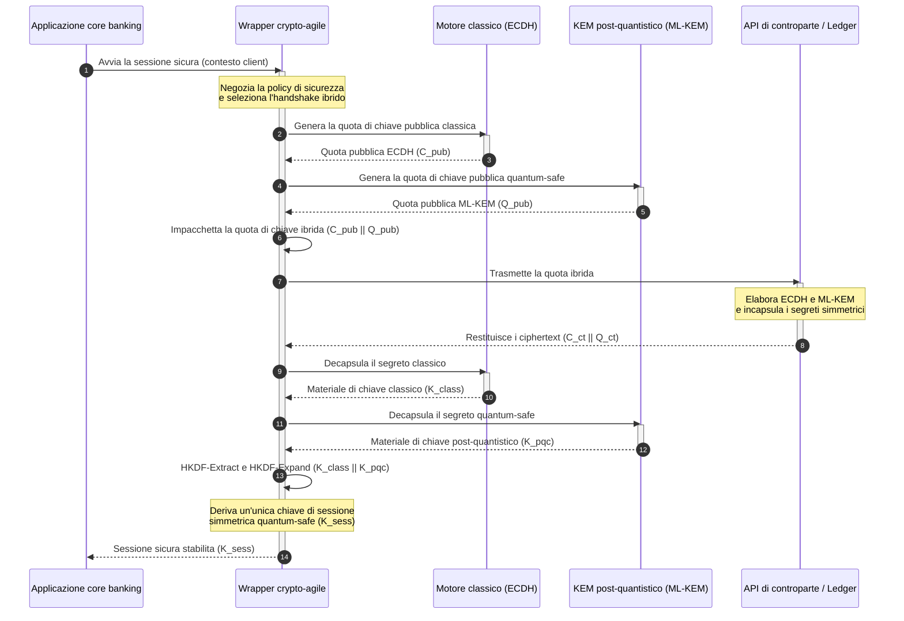

# KyberLib e la migrazione post-quantistica delle banche nel 2026: dagli standard al codice

<!-- lead-start: manual -->
<aside class="post-lead" aria-label="Sintesi dell'articolo">

<strong>In sintesi.</strong> L'infrastruttura bancaria nel 2026 affronta una minaccia sistemica con un punto d'arrivo noto: la computazione su scala quantistica romperà lo scambio di chiavi RSA ed ECC che oggi protegge il traffico in transito. Gli standard federali e i policy paper di vigilanza hanno accresciuto la consapevolezza; l'esecuzione tecnica resta frammentata. <a href="https://github.com/sebastienrousseau/kyberlib">KyberLib</a> è un blueprint ingegneristico open source che porta la narrazione post-quantistica in codice Rust concreto e memory-safe — implementando ML-KEM standardizzato dal NIST (FIPS 203) dietro confini di astrazione crypto-agili, così che le istituzioni possano aggiornare la sicurezza del trasporto e l'incapsulamento delle chiavi prima che gli attacchi "Store Now, Decrypt Later" raggiungano i loro archivi.

<strong>Punti chiave</strong>

<ul class="post-lead-takeaways">
  <li><strong>Dalla policy al codice ispezionabile.</strong> KyberLib sposta la crittografia post-quantistica dalle roadmap strategiche astratte a implementazioni Rust concrete, ad alte prestazioni e verificabili in audit.</li>
  <li><strong>Esecuzione ML-KEM FIPS 203 standardizzata.</strong> La libreria implementa ML-KEM — l'algoritmo di stabilimento delle chiavi finalizzato nel NIST FIPS 203 — mantenendo la conformità allineata alle aspettative regolamentari globali.</li>
  <li><strong>Agilità crittografica by design.</strong> Confini di astrazione stabili permettono alle applicazioni bancarie di sostituire le primitive crittografiche senza riscritture applicative costose e soggette a errori.</li>
  <li><strong>Sicurezza della memoria garantita da Rust.</strong> Le regole di ownership a compile time eliminano i buffer overflow e i memory leak che affliggono le librerie crittografiche legacy basate su C, alla velocità delle zero-cost abstraction.</li>
  <li><strong>Mitigazione della responsabilità fiduciaria.</strong> Evidenze di migrazione osservabili e testabili danno agli amministratori il registro di "misure ragionevoli" richiesto dagli audit di responsabilità personale dell'Articolo 5 di DORA.</li>
</ul>

<strong>Letture correlate:</strong> <a href="/2026-05-18-quantum-cryptography-standards-developments-2026/">Il reset della crittografia quantistica nel 2026</a> · <a href="/2026-05-28-dora-ai-act-data-sovereignty-banking-compliance-stack-2026/">Lo stack di conformità DORA + AI Act per le banche</a> · <a href="/2026-05-20-cloud-native-banking-financial-institutions-2026/">Il banking cloud-native nel 2026</a>

</aside>
<!-- lead-end -->

La migrazione post-quantistica ha smesso di essere un esercizio di pianificazione. Nel 2026 è un requisito operativo attivo, e il divario tra intento regolamentare ed esecuzione ingegneristica è il punto in cui oggi risiede il rischio. [KyberLib ⧉](https://github.com/sebastienrousseau/kyberlib "kyberlib") chiude parte di quel divario: una libreria Rust memory-safe orientata alla produzione che implementa ML-KEM secondo i parametri finalizzati di FIPS 203 e lo racchiude nei confini crypto-agili di cui il patrimonio transazionale di una banca ha realmente bisogno.

---

> **Sintesi esecutiva / Punti chiave**
>
> - **La minaccia è già operativa.** Gli avversari conducono oggi raccolte "Store Now, Decrypt Later"; la riservatezza dei dati fallisce retroattivamente il giorno in cui arriva un computer quantistico crittograficamente rilevante.
> - **Gli standard sono finalizzati.** NIST FIPS 203 (ML-KEM) e FIPS 204 (ML-DSA) danno ai comitati di audit un benchmark chiaro e testabile — la difesa "stiamo aspettando gli standard" non esiste più.
> - **KyberLib è il blueprint ingegneristico.** Rust memory-safe, compilazione `no_std` per HSM e smart card, e pattern di handshake ibrido che preservano l'interoperabilità classica.
> - **L'agilità crittografica è l'obiettivo durevole.** Confini di astrazione stabili consentono di cambiare le primitive senza riscritture applicative — la lezione che sopravvive a qualsiasi singolo algoritmo.
> - **La responsabilità ricade sui consigli di amministrazione.** L'Articolo 5 di DORA attribuisce responsabilità personale agli amministratori; un codice di migrazione ispezionabile e osservabile è l'evidenza che la soddisfa.
>
---

## Perché questo progetto open source conta nel 2026

Mentre la crittografia asimmetrica si avvicina all'obsolescenza, la minaccia non aspetta che venga costruito un computer quantistico crittograficamente rilevante. Gli avversari eseguono già attacchi **"Store Now, Decrypt Later" (SNDL)** — raccolgono i flussi cifrati in transito di transazioni bancarie corporate, segreti industriali e comunicazioni istituzionali con l'intento di decifrarli quando le capacità quantistiche saranno mature. Per una banca, ogni handshake classico che oggi attraversa la rete è una violazione di riservatezza con data di detonazione differita.

I regolatori hanno risposto con obblighi concreti:

1. **L'Articolo 6 di DORA (gestione del rischio ICT)** impone alle istituzioni di mappare, identificare e mitigare le vulnerabilità del proprio patrimonio crittografico — incluso lo scambio di chiavi asimmetrico sepolto in middleware che nessuno ha inventariato.
2. **NIST FIPS 203 e 204** stabiliscono gli standard post-quantistici ufficiali per l'incapsulamento delle chiavi (ML-KEM) e le firme digitali (ML-DSA), dando ai comitati di audit un benchmark standardizzato su cui misurare i progressi della migrazione.

Eseguire questa migrazione senza interrompere le operazioni correnti richiede di andare oltre i policy paper, verso un'**infrastruttura crittografica open source ispezionabile**. [KyberLib ⧉](https://github.com/sebastienrousseau/kyberlib "kyberlib") offre esattamente questo: una libreria Rust memory-safe conforme a FIPS 203 che trasforma la transizione post-quantistica in una pipeline ingegneristica misurabile e verificabile — e sposta la conversazione sugli investimenti tecnologici verso un ritorno tangibile in termini di resilienza.

## La lente architetturale

KyberLib si colloca dietro confini API stabili, isolando le applicazioni transazionali core di una banca dai cambiamenti nelle primitive crittografiche di basso livello.

| Strato | Scelta di progettazione | Perché conta | Rischio se mal gestita |
|---|---|---|---|
| **Primitiva** | Incapsulamento delle chiavi ML-KEM FIPS 203 | Sostituisce lo scambio di chiavi classico Diffie-Hellman e RSA con strutture basate su reticoli | Non conformità ai parametri finalizzati di FIPS 203, con conseguenti audit di conformità falliti |
| **Linguaggio** | Implementazione Rust memory-safe | Elimina le vulnerabilità di corruzione della memoria (buffer overflow, use-after-free) endemiche di C/C++ | Proliferazione di dipendenze che compromette l'integrità della build chain |
| **Astrazione** | Confini crypto-agili stabili | Le applicazioni cambiano algoritmo dietro un'interfaccia unificata man mano che gli standard evolvono | Primitive cablate nel codice che impongono riscritture manuali in ogni migrazione futura |
| **Distribuzione** | Handshake di cifratura ibridi | Combina KEM post-quantistici e algoritmi classici in una busta a doppio involucro | Perdita di interoperabilità legacy o deriva silenziosa della configurazione |
| **Garanzia** | Provenance SLSA Level 3 e test ispezionabili | Garantisce origine e provenienza del codice; gli esempi possono essere auditati riga per riga | Sicurezza di facciata — librerie black-box i cui errori implementativi emergono in produzione |

## Segnali operativi da monitorare

Dimostrare la conformità post-quantistica a consigli di vigilanza e regolatori significa monitorare metriche specifiche e quantificabili:

| Segnale | Metrica | Riferimento normativo | Implementazione di piattaforma |
|---|---|---|---|
| **Conformità ML-KEM FIPS 203** | 100% di conformità ai parametri finalizzati (ML-KEM-512/768/1024) | NIST FIPS 203 | Crittografia su reticoli a parametri verificati compilata nei moduli KyberLib |
| **Inventario crittografico** | Inventario completo dell'uso dello scambio di chiavi asimmetrico su tutti i sistemi | NIST SP 1800-38 | Agenti di scansione automatizzata che registrano le cipher suite attive in un registro centrale |
| **Scambio di chiavi ibrido** | Percentuale di handshake a livello di trasporto eseguiti in busta ibrida | Articolo 6 di DORA | Proxy di rete che avvolgono gli handshake TLS 1.3 classici nell'incapsulamento PQC |
| **Compilazione `no_std`** | Capacità di compilare senza la libreria standard di Rust per target vincolati | Articolo 30 di DORA | Compilazione condizionale `no_std` in KyberLib per gli Hardware Security Module |
| **Indice di agilità crittografica** | Tempo in minuti per sostituire una primitiva crittografica sull'API gateway | UK PRA SS1/23 | Registri di routing astratti che gestiscono l'allocazione degli algoritmi tramite variabili a runtime |

## Perché Rust conta per la crittografia post-quantistica

Implementare algoritmi post-quantistici come ML-KEM richiede operazioni matematiche complesse e di basso livello su anelli polinomiali. Storicamente, eseguire quelle operazioni a velocità di produzione significava C/C++ o assembly scritti a mano — un'ampia superficie d'attacco per la corruzione della memoria, esattamente nel codice che una banca può meno permettersi di sbagliare.

Rust cambia la postura di sicurezza dell'ingegneria crittografica in tre modi concreti:

1. **Sicurezza della memoria a compile time.** Il modello di ownership di Rust garantisce che buffer overflow, double free e use-after-free siano prevenuti in fase di compilazione. È un punto particolarmente critico per le librerie post-quantistiche, dove chiavi e ciphertext sono significativamente più grandi dei loro equivalenti classici.
2. **Astrazioni deterministiche a costo zero.** Rust compila in codice macchina nativo senza garbage collector, così velocità di esecuzione e impronta di memoria eguagliano o superano le librerie basate su C preservando la sicurezza.
3. **Compatibilità `no_std`.** KyberLib compila senza la libreria standard di Rust, quindi gira in ambienti vincolati e bare-metal — Hardware Security Module e smart card compresi — mantenendo la crittografia di livello bancario dentro i perimetri di sicurezza fisica.

## Progettare un'architettura crypto-agile

Il classico punto di rottura nelle migrazioni crittografiche è il cablaggio nel codice: assunzioni specifiche dell'algoritmo incorporate direttamente nella logica applicativa e riscoperte dolorosamente a ogni transizione. L'obiettivo durevole per il 2026 è l'**agilità crittografica** — uno strato di astrazione che tratta gli algoritmi come moduli sostituibili dietro un'interfaccia stabile, così la prossima migrazione diventa una modifica di configurazione anziché una riscrittura dell'intero patrimonio applicativo.

La sequenza che segue mostra come il wrapper crypto-agile di KyberLib coordina un handshake di scambio chiavi ibrido (classico più post-quantistico):

La busta ibrida è il dettaglio operativamente rilevante. Finché le primitive post-quantistiche non avranno accumulato anni di scrutinio in produzione, la chiave di sessione deriva sia dal segreto classico sia da quello post-quantistico: un attaccante deve rompere ECDH **e** ML-KEM per recuperare il canale. Le controparti che non hanno migrato continuano a funzionare; quelle che lo hanno fatto ottengono immediatamente la protezione basata su reticoli.

## Il playbook per il consiglio di amministrazione

La sicurezza post-quantistica non è una questione di cifratura da back-office; è un tema di governance da consiglio di amministrazione con implicazioni personali. I senior manager dovrebbero inquadrare la migrazione attraverso la responsabilità fiduciaria:

- **L'Articolo 5 di DORA (governance e organizzazione)** attribuisce al consiglio di amministrazione la responsabilità personale per la sicurezza ICT. Test open source e osservabili sono l'evidenza diretta che un audit di responsabilità personale richiede — "abbiamo scelto un'implementazione FIPS 203 ispezionabile ed ecco le sue esecuzioni di conformità" è una risposta difendibile; "il nostro fornitore ci ha rassicurato" non lo è.
- **La gestione del rischio di modello (US Fed SR 11-7 / UK PRA SS1/23)** si applica alle architetture di wrapper crittografici tanto quanto ai modelli di pricing. Gli strati di astrazione devono passare la validazione MRM, incluse le prestazioni in scenari di disruption estrema.
- **Il capitale per il rischio operativo di Basel III** premia la maturità dimostrata dei controlli. Handshake ibridi testati abbassano il profilo di rischio operativo di lungo periodo dell'istituzione, riducendo il premio di capitale e liberando capacità di bilancio per l'impiego attivo di tesoreria.

## Cosa significa per ciascun tipo di banca

### Banche di rilevanza sistemica globale (G-SIB)

Le G-SIB gestiscono patrimoni transazionali carichi di legacy, quindi il loro vincolo determinante è la scoperta: sapere dove avviene realmente lo scambio di chiavi asimmetrico. Gli inventari crittografici continui secondo le linee guida NIST SP 1800-38 vengono prima; KyberLib fornisce poi la libreria standardizzata e memory-safe per eseguire l'incapsulamento delle chiavi post-quantistico su ogni nodo moderno che l'inventario fa emergere.

### Banche transazionali e corporate

La riservatezza lungo i binari di pagamento è il cuore della franchise. Poiché KyberLib compila per target bare-metal `no_std`, le banche transazionali possono distribuire handshake post-quantistici direttamente dentro l'hardware edge di routing dei pagamenti e gestione della liquidità — non solo nel livello applicativo.

### Banche regionali e di minori dimensioni

Le istituzioni regionali affrontano la stessa raccolta sponsorizzata da Stati senza i budget di ricerca delle G-SIB. Un'implementazione Rust open source e ispezionabile dà loro un percorso chiavi in mano verso la conformità NIST FIPS 203 da subito, senza negoziare roadmap black-box dei fornitori.

## Dalle roadmap al codice che compila

La transizione post-quantistica è un compito ingegneristico attivo, e le istituzioni che manterranno la fiducia di vigilanti, controparti e tesorieri corporate lungo il 2026 sono quelle che passano dalle roadmap astratte a codice osservabile che compila. Il mandato esecutivo ne discende direttamente: auditare i punti di scambio chiavi legacy, distribuire handshake ibridi sui canali a maggior valore e costruire i confini di astrazione stabili che rendono routinaria ogni futura sostituzione di primitive. KyberLib rende ciascuno di questi passi una capacità operativa misurabile anziché un impegno da slide.

## Domande frequenti

**KyberLib è conforme agli standard NIST finalizzati?**

Sì. KyberLib è progettata attorno ai parametri di ML-KEM finalizzati in FIPS 203, mantenendo la libreria compilata allineata alle aspettative regolamentari federali e globali.

**Una libreria post-quantistica richiede hardware specializzato?**

No. L'implementazione Rust di KyberLib compila per le architetture di sistema standard. La capacità `no_std` le consente inoltre di girare su Hardware Security Module specializzati e smart card dove è richiesta la custodia fisica delle chiavi.

**In che modo "Store Now, Decrypt Later" incide sulla conformità attuale?**

Se il livello di trasporto si basa su RSA o ECC classici, gli avversari possono raccogliere il traffico oggi e decifrarlo quando la capacità quantistica sarà matura. Lo scambio di chiavi ibrido distribuito ora mantiene i dati catturati dietro una protezione basata su reticoli.

**Perché handshake ibridi invece di passare direttamente alle primitive post-quantistiche?**

Le buste ibride derivano la chiave di sessione sia da un segreto classico sia da uno post-quantistico, quindi la sicurezza regge a meno che entrambi siano violati. Ciò preserva l'interoperabilità con le controparti non migrate mentre le nuove primitive accumulano scrutinio in produzione.

## Riferimenti

- National Institute of Standards and Technology, (2024). [FIPS 203: Module-Lattice-Based Key-Encapsulation Mechanism Standard ⧉](https://www.nist.gov/news-events/news/2024/08/nist-releases-first-3-finalized-post-quantum-encryption-standards "Annuncio NIST FIPS 203").
- Board of Governors of the Federal Reserve System, (2011). [Supervisory Guidance on Model Risk Management (SR Letter 11-7) ⧉](https://www.federalreserve.gov/supervisionreg/srletters/sr1107.htm "Federal Reserve SR 11-7").
- Parlamento europeo e Consiglio dell'Unione europea, (2022). [Regolamento (UE) 2022/2554 sulla resilienza operativa digitale per il settore finanziario (DORA) ⧉](https://eur-lex.europa.eu/legal-content/EN/TXT/?uri=CELEX%3A32022R2554 "Regolamento DORA").
- NIST National Cybersecurity Center of Excellence, (2025). [Migration to Post-Quantum Cryptography (NIST SP 1800-38) ⧉](https://www.nccoe.nist.gov/projects/migration-post-quantum-cryptography "NIST SP 1800-38").
- GitHub, (2026). [Repository open source kyberlib ⧉](https://github.com/sebastienrousseau/kyberlib "Repository kyberlib").

<!-- enrich-start -->
<aside class="author-card" aria-label="Informazioni sull'autore"><strong class="author-card-name"><a href="/about/index.html">Sebastien Rousseau</a></strong>Senior banking technologist. Scrive di AI applicata, infrastrutture di pagamento, moneta tokenizzata, ISO 20022, sicurezza post-quantistica, servizi finanziari cloud-native e mercati digitali regolamentati.Oltre 20 anni tra HSBC Commercial &amp; Investment Bank, PayPal, Barclays, Shazam, AKQA, Virgin Group. <a href="/about/index.html">Profilo completo</a> &middot; <a href="https://www.linkedin.com/in/sebastienrousseau/" rel="external noopener">LinkedIn</a> &middot; <a href="https://github.com/sebastienrousseau" rel="external noopener">GitHub</a></aside>

Ultima revisione <time datetime="2026-06-12">2026-06-12</time>.

<!-- enrich-end -->
