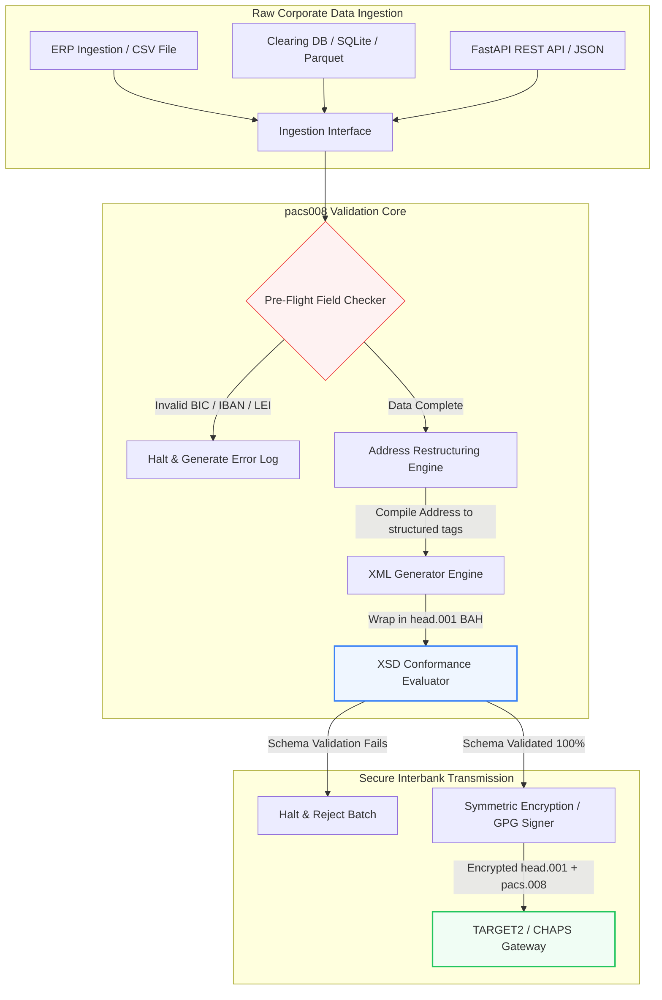

---

# Front Matter (YAML)

author: "contact@sebastienrousseau.com (Sebastien Rousseau)"
banner_alt: "Impiegato d'ufficio con assistente vocale e laptop — simbolo dei messaggi di pagamento interbancari strutturati e machine-readable che l'automazione di pacs.008 rende programmabili"
banner_height: "1597"
banner_width: "2584"
banner: "https://cloudcdn.pro/stocks/images/tyler-prahm-lmV3gJSAgbo.webp"
cdn: "https://cloudcdn.pro"
charset: "UTF-8"
cname: "sebastienrousseau.com"
copyright: "© Copyright 2025 - 2026 - Sebastien Rousseau. Tutti i diritti riservati."
date: "June 15, 2026"
description: "pacs008 è una libreria Python open source che automatizza la generazione e la validazione di pacs.008 FI-to-FI di bonifico cliente ISO 20022 — indirizzi strutturati, wrapping BAH head.001, checksum BIC/LEI/IBAN, tracing OpenTelemetry UETR — costruita per il cutover SWIFT di novembre 2026."
format-detection: "telephone=no"
hreflang: "it"
icon: "https://cloudcdn.pro/clients/sebastienrousseau/v1/logos/sebastienrousseau.svg"
id: "https://sebastienrousseau.com/2026-06-15-pacs008-automation-iso-20022-interbank-payments-2026"
image_alt: "Ritratto in bianco e nero di Sebastien Rousseau"
image_height: "162"
image_width: "162"
image: "https://cloudcdn.pro/stocks/images/sebastien-rousseau.png"
keywords: "pacs008, ISO 20022 pacs.008, bonifico cliente FI-to-FI, indirizzo strutturato, SWIFT CBPR+, BAH head.001, TARGET2, CHAPS, Fedwire, DORA, BCBS 239, Basel III, UETR, validazione LEI, SEPA VoP"
language: "it-IT"
last_reviewed: "2026-06-15"
layout: "report"
locale: "it_IT"
logo_alt: "Logo di Sebastien Rousseau"
logo_height: "44"
logo_width: "44"
logo: "https://cloudcdn.pro/clients/sebastienrousseau/v1/logos/sebastienrousseau.svg"
menu: ""
measurementID: "G-169G4ET5HQ"
name: "Sebastien Rousseau"
permalink: "https://sebastienrousseau.com/2026-06-15-pacs008-automation-iso-20022-interbank-payments-2026"
rating: "general"
referrer: "no-referrer"
robots: "index, follow"
schema: "FAQPage, Article"
seo_title: "Automazione pacs.008 per l'era ISO 20022"
short_name: "sebastienrousseau"
subtitle: "Il messaggio pacs.008 è il punto in cui dati di pagamento interbancari, indirizzi strutturati, conformità, instradamento e operazioni di regolamento si incontrano."
tags: "pacs008, ISO 20022, pagamenti interbancari, pagamenti wholesale, Python"
theme-color: "0, 83, 191"
title: "Automazione di pacs.008 per l'era interbancaria ISO 20022 nel 2026"
url: "https://sebastienrousseau.com/2026-06-15-pacs008-automation-iso-20022-interbank-payments-2026"
viewport: "width=device-width, initial-scale=1, shrink-to-fit=no"

# RSS - The RSS feed front matter (YAML).
atom_link: "https://sebastienrousseau.com/2026-06-15-pacs008-automation-iso-20022-interbank-payments-2026/rss.xml"
category: "Finance"
docs: https://validator.w3.org/feed/docs/rss2.html
generator: "Static Site Generator (SSG) (version 0.0.26)"
item_description: "pacs008 fornisce una base Python open source per automatizzare i messaggi ISO 20022 FI-to-FI di bonifico cliente nell'era dei pagamenti interbancari."
item_guid: "https://sebastienrousseau.com/2026-06-15-pacs008-automation-iso-20022-interbank-payments-2026/rss.xml"
item_link: "https://sebastienrousseau.com/2026-06-15-pacs008-automation-iso-20022-interbank-payments-2026/rss.xml"
item_pub_date: "Mon, 15 Jun 2026 06:06:06 +0000"
item_title: "Automazione di pacs.008 per l'era interbancaria ISO 20022 nel 2026"
last_build_date: "Mon, 15 Jun 2026 06:06:06 +0000"
managing_editor: "contact@sebastienrousseau.com (Sebastien Rousseau)"
pub_date: "Mon, 15 Jun 2026 06:06:06 +0000"
ttl: "60"
type: "article"
webmaster: "contact@sebastienrousseau.com"

# Apple - The Apple front matter (YAML).
apple_mobile_web_app_orientations: "portrait"
apple_touch_icon_sizes: "192x192"
apple-mobile-web-app-capable: "yes"
apple-mobile-web-app-status-bar-inset: "black"
apple-mobile-web-app-status-bar-style: "black-translucent"
apple-mobile-web-app-title: "Automazione pacs.008 ISO 20022"
apple-touch-fullscreen: "yes"

# MS Application - The MS Application front matter (YAML).

msapplication-navbutton-color: "0, 83, 191"

# Twitter Card - The Twitter Card front matter (YAML).

twitter_card: "summary_large_image"
twitter_creator: "@wwdseb"
twitter_description: "pacs008 fornisce una base Python open source per automatizzare i messaggi ISO 20022 FI-to-FI di bonifico cliente nell'era dei pagamenti interbancari."
twitter_image: "https://cloudcdn.pro/clients/sebastienrousseau/v1/logos/sebastienrousseau.svg"
twitter_image_alt: "Logo di Sebastien Rousseau"
twitter_site: "@wwdseb"
twitter_title: "Automazione pacs.008 per l'era ISO 20022"
twitter_url: "https://sebastienrousseau.com/2026-06-15-pacs008-automation-iso-20022-interbank-payments-2026"

excerpt: "pacs008 è un toolkit Python open source che rende programmabili i messaggi ISO 20022 FI-to-FI di bonifico cliente — indirizzi strutturati, validazione, instradamento, hook di conformità e la scadenza SWIFT di novembre 2026 integrati come default."

# Humans.txt - The Humans.txt front matter (YAML).
author_website: "https://sebastienrousseau.com"
author_twitter: "@wwdseb"
author_location: "London, UK"
thanks: "Grazie per la lettura!"
site_last_updated: "2026-06-15"
site_standards: "HTML5, CSS3, RSS, Atom, JSON, XML, YAML, Markdown, TOML"
site_components: "Kaishi, Kaishi Builder, Kaishi CLI, Kaishi Templates, Kaishi Themes"
site_software: "Static Site Generator, Rust"

---

# Automazione dei pagamenti interbancari ISO 20022 pacs.008 con Python open source nel 2026

<!-- lead-start -->
<aside class="post-lead" aria-label="Sintesi dell'articolo">

<strong>In sintesi.</strong> Secondo le linee guida SWIFT CBPR+, il 14 novembre 2026 il Structured Address Cliff dismette gli indirizzi postali non strutturati su TARGET2, CHAPS, Fedwire, Lynx e SEPA. pacs008 è una libreria Python open source che automatizza la generazione e la validazione dei messaggi ISO 20022 FI-to-FI di bonifico cliente (pacs.008), incapsula i pagamenti nei Business Application Header (BAH head.001) e incorpora la conformità sugli indirizzi strutturati nel data path prima che il messaggio tocchi una rete di clearing.

<strong>Punti chiave</strong>

<ul class="post-lead-takeaways">
  <li><strong>La scadenza sull'indirizzo strutturato è assoluta.</strong> Dopo il 14 novembre 2026 i blocchi di indirizzo non strutturati vengono ritirati. pacs008 impone gli elementi di indirizzo postale strutturato (<code>&lt;TwnNm&gt;</code>, <code>&lt;Ctry&gt;</code>, <code>&lt;PstCd&gt;</code>) in fase di compilazione dei dati per prevenire i respingimenti al confine di rete.</li>
  <li><strong>Orchestrazione unificata del messaggio.</strong> Incapsula il payload pacs.008 in un envelope Business Application Header (head.001) conforme, fornendo un modello di elaborazione round-trip standard.</li>
  <li><strong>Integrità algoritmica.</strong> Validatori integrati per BIC e Legal Entity Identifier (LEI) basati sul calcolo del checksum ISO 7064 Modulo 97-10.</li>
  <li><strong>Tracciabilità di livello DORA.</strong> Strumentazione OpenTelemetry completa basata sullo Unique End-to-End Transaction Reference (UETR) per log di audit in tempo reale e firme di audit crittografiche.</li>
  <li><strong>Tutela fiduciaria a livello board.</strong> Allinea l'accuratezza del messaggio interbancario con l'Articolo 5 DORA, il reporting BCBS 239 e i risparmi di capitale Basel III sul rischio operativo.</li>
</ul>

<strong>Letture correlate:</strong> <a href="https://sebastienrousseau.com/2026-05-19-global-wholesale-payments-economics-2026">Pagamenti wholesale globali nel 2026: ISO 20022, rinnovamento RTGS e l'economia dell'interoperabilità</a>, <a href="https://sebastienrousseau.com/2026-05-27-ai-operating-system-payments-fraud-routing-resilience-compliance-2026">L'AI come sistema operativo dei pagamenti: frode, instradamento, resilienza e conformità nel 2026</a>, <a href="https://sebastienrousseau.com/2026-05-12-iso-20022-pacs008-structured-address-deadline">La scadenza pacs.008 sull'indirizzo strutturato di novembre 2026: una vista a sei mesi</a>.

</aside>
<!-- lead-end -->

Colmare il divario fra dati finanziari legacy e messaggistica interbancaria strutturata attraverso una pipeline Python auditabile e validata contro schema.

Il riferimento open source di questo articolo è [pacs008 ⧉](https://github.com/sebastienrousseau/pacs008 "pacs008 — libreria Python open source"). Il repository si posiziona come libreria Python per automatizzare i messaggi XML ISO 20022 pacs.008 FI-to-FI di bonifico cliente.

## Perché questo progetto open source conta nel 2026

L'infrastruttura globale di clearing dei pagamenti interbancari sta vivendo la modernizzazione più profonda di quasi mezzo secolo.

A giugno 2026 il settore dei servizi finanziari si avvicina rapidamente al **SWIFT Structured Address Cliff del 14 novembre 2026**. Da quella data le linee guida SWIFT CBPR+, insieme a TARGET2, CHAPS, Fedwire e il Lynx canadese, dismetteranno ufficialmente le righe di indirizzo postale non strutturate (l'uso del solo `<AdrLine>` all'interno dei blocchi `<PstlAdr>`). Tutte le istituzioni finanziarie partecipanti dovranno trasmettere gli indirizzi in formato ibrido (`<TwnNm>` e `<Ctry>` strutturati, con un massimo di due elementi `<AdrLine>` per i dettagli residui) o in formato pienamente strutturato (elementi separati per nome via, numero civico e codice postale). Qualunque messaggio non conforme a questo criterio sarà respinto al confine di rete.

Per le istituzioni finanziarie questa transizione genera vincoli operativi rilevanti:

1. **La penalizzazione da respingimento al confine.** I pagamenti che non rispettano i criteri di indirizzo strutturato subiranno respingimenti immediati di rete, con ritardi transazionali, blocchi di liquidità e arretrati operativi.
2. **SEPA Verification of Payee (VoP).** Impone a tutti i Payment Service Provider (PSP) all'interno dell'area SEPA di verificare la corrispondenza fra il nome del beneficiario e l'IBAN prima di eseguire i bonifici, aggiungendo un ulteriore gate di validazione all'avvio del messaggio.

[pacs008](https://github.com/sebastienrousseau/pacs008) risolve questo problema. È una libreria Python open source e leggera che automatizza la conversione di dati finanziari grezzi in messaggi ISO 20022 pacs.008 di bonifico cliente interbancario pienamente validati e conformi allo schema. Colmando il divario fra dati legacy e dati strutturati, pacs008 produce un alto Return on Resilience (RoR), preservando il capitale circolante e assicurando l'esecuzione in tempo reale sui rail globali.

## La lente architetturale pacs008 2026

La libreria pacs008 è strutturata come un motore di validazione e generazione insulato, che assicura un parsing sistematico, l'arricchimento e l'incapsulamento standard degli input grezzi:

| Livello | Scelta di design | Perché conta | Rischio in caso di errore |
|---|---|---|---|
| **Input Layer** | Ingestion di CSV, JSON, SQLite e Parquet | Va incontro ai team di integrazione bancaria dove i dati già risiedono, evitando migrazioni di piattaforma. | Ingestion di payload grezzi, non validati o corrotti. |
| **Validation Layer** | Validazione pre-flight contro gli schemi XSD ufficiali e regole di business custom | Ferma l'esecuzione e segnala gli errori prima che il file di pagamento sia trasmesso alla rete di clearing. | File XML non validi che attivano respingimenti immediati e ritardi di clearing. |
| **BAH Envelope Layer** | Wrapping automatico del Business Application Header (head.001) | Standardizza dispatch e instradamento dei messaggi in base al tag `<MsgDefIdr>`. | Trasmissione di payload pacs.008 grezzi privi dell'envelope esterno richiesto, con conseguente rifiuto di sistema. |
| **Serialization Layer** | Supporto a XML standard e JSON conforme ISO (TS 23029) | Permette traduzione diretta fra payload XML e JSON, a sostegno di REST API moderne e streaming Kafka. | Rappresentazioni dei dati frammentate, in violazione delle linee guida ISO ufficiali. |
| **Observability Layer** | Tracing OpenTelemetry basato sullo UETR | Cattura percorsi di esecuzione e log dettagliati, fornendo auditabilità in tempo reale. | Lacune di tracing che bloccano visibilità operativa e audit. |

## Segnali interbancari chiave e milestone regolamentari

Per dimostrare resilienza operativa transazionale, i responsabili senior di tecnologia e rischio devono monitorare indicatori di conformità specifici e quantificabili:

| Segnale | Metrica / benchmark operativo | Riferimento G20 / SWIFT / DORA | Implementazione sulla piattaforma tecnica |
|---|---|---|---|
| **Conformità sull'indirizzo strutturato** | % di messaggi pacs.008 che utilizzano campi `<PstlAdr>` pienamente strutturati con `<TwnNm>` e `<Ctry>` designati. | Scadenza SWIFT SR 2026 | Controlli di schema pre-flight in pacs008 che rifiutano righe di indirizzo non strutturate. |
| **SEPA Verification of Payee** | Validazione di corrispondenza fra nome del beneficiario e IBAN prima dell'esecuzione del messaggio. | Regolamentazione SEPA VoP | Classi helper VoP integrate che eseguono query di pre-validazione su IBAN/BIC. |
| **Integrazione BAH head.001** | Percentuale di payload di pagamento in uscita correttamente incapsulati nei Business Application Header. | Linee guida TARGET2 / CBPR+ | Sottosistema di BAH wrapping che compila automaticamente l'envelope XML esterno. |
| **Checksum LEI Modulo** | Validazione di check-digit ISO 7064 Modulo 97-10 sui blocchi `<LEI>` di debtor e creditor. | Mandato Bank of England | Verificatore algoritmico che controlla l'integrità dell'identificativo a 20 caratteri. |
| **Accuratezza del tracking UETR** | 100% dei pagamenti generati con uno Unique End-to-End Transaction Reference valido. | Specifiche SWIFT UETR | Generazione e tracing automatici del codice di riferimento UUIDv4 a 36 caratteri. |

## Perché Python è la rampa di accesso ideale per l'automazione interbancaria

Hub di pagamento e team di treasury operations nel 2026 si basano largamente su Python per la trasformazione dei dati, la modellazione finanziaria e l'integrazione con database ERP.

Sfruttando una libreria Python open source, le istituzioni ottengono vantaggi significativi:

1. **Basso carico cognitivo e alta interoperabilità.** Python funziona da ponte coeso. Permette agli sviluppatori di scrivere script semplici che estraggono istruzioni di pagamento grezze da database legacy, le validano contro regole bancarie internazionali complesse e producono XML conforme in un unico flusso unificato.
2. **Eliminazione dei traduttori opachi "black-box".** I portali bancari proprietari spesso applicano licenze costose per traduttori custom di file di pagamento. Questi traduttori sono black box proprietari: rendono impossibile ai team di sicurezza verificare come i dati vengono elaborati o dove sono conservate le chiavi. Una libreria open source ispezionabile come pacs008 garantisce trasparenza totale del codice.
3. **Integrazione fluida con CI/CD.** pacs008 si integra direttamente nelle pipeline di integrazione e deployment continui, consentendo agli sviluppatori di automatizzare il test dei file di pagamento come parte del normale ciclo di delivery software.

## Progettare una pipeline interbancaria delimitata

Una vulnerabilità rilevante nel clearing interbancario è la "generazione batch non controllata" — la produzione di file senza un loop di verifica delimitato. pacs008 è progettato per operare come motore di validazione centrale all'interno di una pipeline transazionale strettamente controllata e multi-stadio.

Il flusso operativo seguente mostra come i dati transazionali grezzi attraversino la pipeline pacs008 per generare un file pacs.008 crittograficamente sicuro e conforme allo schema, incapsulato in un envelope BAH:

## Il playbook per il board e la responsabilità fiduciaria

L'automazione dei pagamenti interbancari è una questione di risk management e corporate governance a livello board. I senior manager devono affrontare la qualità dei dati transazionali con la lente della responsabilità fiduciaria e della riduzione del rischio operativo:

- **DORA Articolo 5 (responsabilità del board).** Pone responsabilità diretta e personale in capo ai membri del board sulla resilienza e sulla sicurezza delle operazioni ICT dell'istituzione. Poiché il clearing interbancario è una funzione corporate critica, i board devono dimostrare di aver implementato controlli transazionali robusti, validati e automatizzati per prevenire interruzioni operative o pagamenti ritardati.
- **BCBS 239 (aggregazione e reporting dei dati di rischio).** Richiede che il reporting delle transazioni finanziarie sia accurato, completo e prodotto in tempo reale. pacs008 aiuta le istituzioni a raggiungere la conformità BCBS 239 garantendo che i dati di pagamento siano strutturati e validati alla fonte, eliminando le lacune dei dati e gli errori di riconciliazione manuale tipici dei fogli di calcolo legacy.
- **Mitigazione dei requisiti di capitale per rischio operativo (Basel III).** In base alle linee guida Basel III, alti tassi di errore di pagamento e overhead di intervento manuale aumentano i requisiti di capitale per rischio operativo della banca, immobilizzando capitale che potrebbe altrimenti essere allocato a prestiti o investimenti. Automatizzare la pipeline di pagamento riduce direttamente questi premi di capitale, preservando il valore di bilancio.

## Cosa significa per tipologia di banca

### Banche di rilevanza sistemica globale (G-SIB)

Le G-SIB gestiscono volumi enormi di transazioni corporate transfrontaliere. La sfida principale è la rimediazione dei dati legacy non strutturati prima che raggiungano la rete di clearing. Integrando pacs008 nei propri gateway di corporate banking, le G-SIB possono offrire utility di validazione automatica ai clienti corporate, riducendo l'overhead delle riparazioni manuali dei pagamenti e assicurando l'esecuzione in tempo reale sulla rete SWIFT.

### Transaction bank e corporate bank

Per le transaction bank, la qualità dei dati di pagamento è un differenziatore competitivo. Offrendo uno strumento di validazione open source e ispezionabile come pacs008 ai clienti di treasury corporate, queste banche possono accelerare l'onboarding, minimizzare i respingimenti dei file di pagamento e consolidare la fiducia dei clienti tramite tassi di straight-through processing superiori.

### Banche regionali e di piccole dimensioni

Le banche regionali devono mantenere la conformità con gli standard di pagamento internazionali senza i budget tecnologici massicci delle G-SIB. pacs008 fornisce una soluzione Python leggera, economica e pienamente conforme, consentendo alle istituzioni più piccole di offrire capacità moderne di iniziazione dei pagamenti strutturati senza costose licenze di middleware proprietario.

## Conclusione: la roadmap del clearing interbancario

La scadenza SWIFT di novembre 2026 sull'indirizzo strutturato rappresenta un confine netto per le operazioni di treasury corporate. Affidarsi a fogli di calcolo legacy, inserimento manuale dei dati e file di pagamento non strutturati è un rischio operativo attivo.

Per assicurare continuità transazionale e minimizzare l'overhead operativo, i senior manager di tecnologia e finanza devono eseguire una roadmap di clearing chiara già oggi:

1. **Imporre la validazione alla fonte.** Esigere che tutte le istruzioni di pagamento siano validate e formattate secondo gli schemi XSD ufficiali ISO 20022 prima di lasciare i confini dell'ERP corporate.
2. **Auditare la pipeline dati.** Abbandonare l'elaborazione manuale tramite fogli di calcolo e implementare workflow Python automatizzati e ispezionabili basati su pacs008.
3. **Implementare sicurezza ibrida.** Assicurare che i file di pagamento generati siano firmati crittograficamente e cifrati prima della trasmissione, soddisfacendo le aspettative di rete zero-trust.
4. **Allineare alle priorità fiduciarie.** Riportare formalmente al board metriche di automazione dei pagamenti e di qualità dei dati, inquadrando l'investimento come un programma critico di riduzione del rischio operativo ai sensi di DORA.

## Domande frequenti

**pacs008 è conforme alle prossime regole SWIFT SR 2026 sugli indirizzi?**

Sì. pacs008 è progettato per supportare la milestone SWIFT di novembre 2026 sull'indirizzo strutturato, imponendo la separazione obbligatoria degli elementi di indirizzo postale (città, paese, codice postale) nei campi XML ISO 20022 designati.

**pacs008 può incapsulare i payload di pagamento nei Business Application Header?**

Sì. Poiché pacs008 supporta nativamente il wrapping del Business Application Header (BAH head.001), compila automaticamente l'envelope esterno richiesto da TARGET2, CHAPS e dalle reti CBPR+.

**Perché preferire una libreria open source ai traduttori di file proprietari?**

I traduttori proprietari sono black box opachi, che rendono impossibili gli audit di sicurezza. Una libreria open source e peer-reviewed come pacs008 offre trasparenza totale del codice, consentendo ai team di sicurezza di verificare che nessun dato di pagamento sensibile sia esposto durante l'elaborazione.

**Quali identificativi valida pacs008?**

pacs008 include validatori integrati per Bank Identifier Code (BIC) e Legal Entity Identifier (LEI) basati sul checksum ISO 7064 Modulo 97-10, oltre alla validazione del check-digit IBAN e ai controlli di unicità UETR.

## Riferimenti

- SWIFT, (2024). *ISO 20022 November 2026 Structured Address Milestone*. La Hulpe: SWIFT. Disponibile su: [Milestone SWIFT ISO 20022 ⧉](https://www.swift.com/standards/iso-20022/iso-20022-bytes/call-action-november-2026 "Milestone SWIFT ISO 20022").
- Basel Committee on Banking Supervision (BCBS), (2013). *Principles for effective risk data aggregation and risk reporting (BCBS 239)*. Basel: Bank for International Settlements. Disponibile su: [Principi BCBS 239 ⧉](https://www.bis.org/publ/bcbs239.htm "Principi BCBS 239").
- European Parliament and Council of the European Union, (2022). *Regulation (EU) 2022/2554 on digital operational resilience for the financial sector (DORA)*. Brussels: Official Journal of the European Union. Disponibile su: [Regolamento DORA ⧉](https://eur-lex.europa.eu/legal-content/EN/TXT/?uri=CELEX%3A32022R2554 "Regolamento DORA").
- GitHub, (2026). *Repository open source pacs008*. Disponibile su: [Repository pacs008 ⧉](https://github.com/sebastienrousseau/pacs008 "Repository pacs008").

<!-- enrich-start -->
<aside class="author-card" aria-label="Informazioni sull'autore"><strong class="author-card-name"><a href="/about/index.html">Sebastien Rousseau</a></strong>Senior banking technologist, scrive di AI applicata, migrazione ISO 20022, crittografia post-quantistica per i servizi finanziari e trasformazione strutturale dei pagamenti wholesale.Oltre 20 anni tra HSBC Commercial &amp; Investment Bank, PayPal, Barclays, Shazam, AKQA, Virgin Group. <a href="/about/index.html">Profilo completo</a> &middot; <a href="https://www.linkedin.com/in/sebastienrousseau/" rel="external noopener">LinkedIn</a> &middot; <a href="https://github.com/sebastienrousseau" rel="external noopener">GitHub</a></aside>

Ultima revisione <time datetime="2026-06-15">2026-06-15</time>.

<aside class="related-posts" aria-labelledby="related-heading">
<h2 id="related-heading" class="related-heading">Letture correlate</h2>

<article class="related-card"><footer class="related-body"><h3><a href="https://sebastienrousseau.com/2026-05-19-global-wholesale-payments-economics-2026">Pagamenti wholesale globali nel 2026: ISO 20022, rinnovamento RTGS e l'economia dell'interoperabilità</a></h3>
<time datetime="2026-05-19">2026-05-19</time>
</footer></article>
<article class="related-card"><footer class="related-body"><h3><a href="https://sebastienrousseau.com/2026-05-27-ai-operating-system-payments-fraud-routing-resilience-compliance-2026">L'AI come sistema operativo dei pagamenti: frode, instradamento, resilienza e conformità nel 2026</a></h3>
<time datetime="2026-05-27">2026-05-27</time>
</footer></article>
<article class="related-card"><footer class="related-body"><h3><a href="https://sebastienrousseau.com/2026-05-12-iso-20022-pacs008-structured-address-deadline">La scadenza pacs.008 sull'indirizzo strutturato di novembre 2026: una vista a sei mesi</a></h3>
<time datetime="2026-05-12">2026-05-12</time>
</footer></article>

</aside>
<!-- enrich-end -->
