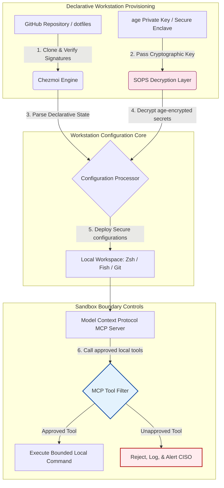

---

# Front Matter (YAML)

author: "contact@sebastienrousseau.com (Sebastien Rousseau)"
banner_alt: "Postazione sviluppatore in penombra — emblema di dotfiles AI-aware, riproducibili e sicuri per server MCP, firma SLSA, segreti age/SOPS e parità multi-shell"
banner_height: "1597"
banner_width: "2584"
banner: "https://cloudcdn.pro/stocks/images/almas-salakhov-Vq2ap8aFFEs.webp"
cdn: "https://cloudcdn.pro"
charset: "UTF-8"
cname: "sebastienrousseau.com"
copyright: "© Copyright 2025 - 2026 - Sebastien Rousseau. Tutti i diritti riservati."
date: "16 giugno 2026"
description: "I dotfiles AI-aware sono un pattern di postazione sviluppatore sicura e riproducibile per l'era MCP: configurazione dichiarativa con Chezmoi, segreti SOPS/age, provenienza SLSA Livello 3, parità multi-shell e confini sandbox per gli agenti AI locali."
format-detection: "telephone=no"
hreflang: "it"
icon: "https://cloudcdn.pro/clients/sebastienrousseau/v1/logos/sebastienrousseau.svg"
id: "https://sebastienrousseau.com/2026-06-16-ai-aware-dotfiles-secure-reproducible-workstation-2026"
image_alt: "Ritratto in bianco e nero di Sebastien Rousseau"
image_height: "162"
image_width: "162"
image: "https://cloudcdn.pro/stocks/images/sebastien-rousseau.png"
keywords: "dotfiles, Chezmoi, MCP, Model Context Protocol, SLSA, SOPS, cifratura age, configurazione dichiarativa, postazione sviluppatore, DORA Articolo 5, NIST CSF 2.0, sicurezza catena di fornitura, AI agentica, parità multi-shell, Zsh, Fish, Nushell"
language: "it-IT"
last_reviewed: "2026-06-16"
layout: "report"
locale: "it_IT"
logo_alt: "Logo di Sebastien Rousseau"
logo_height: "44"
logo_width: "44"
logo: "https://cloudcdn.pro/clients/sebastienrousseau/v1/logos/sebastienrousseau.svg"
menu: ""
measurementID: "G-169G4ET5HQ"
name: "Sebastien Rousseau"
permalink: "https://sebastienrousseau.com/2026-06-16-ai-aware-dotfiles-secure-reproducible-workstation-2026"
rating: "general"
referrer: "no-referrer"
robots: "index, follow"
schema: "FAQPage, Article"
seo_title: "Dotfiles AI-aware per una postazione sviluppatore sicura"
short_name: "sebastienrousseau"
subtitle: "La postazione sviluppatore è ormai parte della catena di fornitura dell'AI; i dotfiles richiedono sicurezza, riproducibilità, igiene dei segreti e flussi MCP-aware."
tags: "dotfiles, strumenti sviluppatore, MCP, SLSA, postazione sicura, chezmoi, macOS, Linux, WSL"
theme-color: "0, 83, 191"
title: "Dotfiles AI-aware nel 2026: costruire una postazione sviluppatore sicura e riproducibile per MCP, SLSA e parità multi-shell"
url: "https://sebastienrousseau.com/2026-06-16-ai-aware-dotfiles-secure-reproducible-workstation-2026"
viewport: "width=device-width, initial-scale=1, shrink-to-fit=no"

# RSS - The RSS feed front matter (YAML).
atom_link: "https://sebastienrousseau.com/2026-06-16-ai-aware-dotfiles-secure-reproducible-workstation-2026/rss.xml"
category: "Technology"
docs: https://validator.w3.org/feed/docs/rss2.html
generator: "Static Site Generator (SSG) (version 0.0.26)"
item_description: "Dotfiles dichiarativi per postazioni sviluppatore sicure e riproducibili su macOS, Linux e WSL, con consapevolezza MCP, SLSA, age, SOPS e parità multi-shell."
item_guid: "https://sebastienrousseau.com/2026-06-16-ai-aware-dotfiles-secure-reproducible-workstation-2026/rss.xml"
item_link: "https://sebastienrousseau.com/2026-06-16-ai-aware-dotfiles-secure-reproducible-workstation-2026/rss.xml"
item_pub_date: "Tue, 16 Jun 2026 06:06:06 +0000"
item_title: "Dotfiles AI-aware nel 2026: costruire una postazione sviluppatore sicura e riproducibile per MCP, SLSA e parità multi-shell"
last_build_date: "Tue, 16 Jun 2026 06:06:06 +0000"
managing_editor: "contact@sebastienrousseau.com (Sebastien Rousseau)"
pub_date: "Tue, 16 Jun 2026 06:06:06 +0000"
ttl: "60"
type: "article"
webmaster: "contact@sebastienrousseau.com"

# Apple - The Apple front matter (YAML).
apple_mobile_web_app_orientations: "portrait"
apple_touch_icon_sizes: "192x192"
apple-mobile-web-app-capable: "yes"
apple-mobile-web-app-status-bar-inset: "black"
apple-mobile-web-app-status-bar-style: "black-translucent"
apple-mobile-web-app-title: "Dotfiles AI-aware per una postazione sicura"
apple-touch-fullscreen: "yes"

# MS Application - The MS Application front matter (YAML).

msapplication-navbutton-color: "0, 83, 191"

# Twitter Card - The Twitter Card front matter (YAML).

twitter_card: "summary_large_image"
twitter_creator: "@wwdseb"
twitter_description: "Dotfiles dichiarativi per postazioni sviluppatore sicure e riproducibili su macOS, Linux e WSL, con consapevolezza MCP, SLSA, age, SOPS e parità multi-shell."
twitter_image: "https://cloudcdn.pro/clients/sebastienrousseau/v1/logos/sebastienrousseau.svg"
twitter_image_alt: "Logo di Sebastien Rousseau"
twitter_site: "@wwdseb"
twitter_title: "Dotfiles AI-aware per una postazione sviluppatore sicura"
twitter_url: "https://sebastienrousseau.com/2026-06-16-ai-aware-dotfiles-secure-reproducible-workstation-2026"

excerpt: "I dotfiles AI-aware nel 2026 trattano la postazione sviluppatore come infrastruttura di catena di fornitura: configurazione dichiarativa gestita da chezmoi con consapevolezza MCP, release firmate SLSA, segreti age/SOPS, avvio sub-secondo e parità macOS/Linux/WSL."

# Humans.txt - The Humans.txt front matter (YAML).
author_website: "https://sebastienrousseau.com"
author_twitter: "@wwdseb"
author_location: "London, UK"
thanks: "Grazie per la lettura!"
site_last_updated: "2026-06-16"
site_standards: "HTML5, CSS3, RSS, Atom, JSON, XML, YAML, Markdown, TOML"
site_components: "Kaishi, Kaishi Builder, Kaishi CLI, Kaishi Templates, Kaishi Themes"
site_software: "Static Site Generator, Rust"

---

# Dotfiles AI-aware nel 2026: costruire una postazione sviluppatore sicura e riproducibile per MCP, SLSA e parità multi-shell

<!-- lead-start -->
<aside class="post-lead" aria-label="Sintesi dell'articolo">

<strong>In sintesi.</strong> La postazione sviluppatore non è più solo un endpoint: è un partecipante attivo della catena di fornitura del software e l'interfaccia diretta del piano di controllo AI locale. Gli assistenti AI da terminale e i server <a href="https://modelcontextprotocol.io">Model Context Protocol (MCP)</a> eseguono comandi shell locali, ispezionano i repository e leggono direttamente i file di configurazione sensibili. <a href="https://github.com/sebastienrousseau/dotfiles">I Dotfiles di Sebastien Rousseau</a> sono un framework open source dichiarativo che costruisce postazioni sicure e riproducibili su macOS, Linux e Windows Subsystem for Linux (WSL), integrando <a href="https://www.chezmoi.io/">Chezmoi</a>, <a href="https://github.com/getsops/sops">SOPS, age</a> e la provenienza di build SLSA Livello 3 per l'isolamento dei segreti memory-safe e percorsi di esecuzione delimitati per i modelli AI locali.

<strong>Punti chiave</strong>

<ul class="post-lead-takeaways">
  <li><strong>Le postazioni sono infrastruttura di catena di fornitura.</strong> Le configurazioni dell'ambiente sviluppatore vanno trattate con lo stesso rigore dichiarativo dei deployment dei server di produzione, eliminando il drift di configurazione manuale.</li>
  <li><strong>La sfida del piano di controllo AI.</strong> I modelli AI da terminale e gli strumenti MCP possono accedere alle directory locali. I dotfiles devono imporre confini sandbox delimitati, liste di permessi degli strumenti rigorose e log locali inalterabili per impedire la fuga di dati.</li>
  <li><strong>Parità cross-platform assoluta.</strong> Prestazioni shell identiche, sub-secondo, e profili di sicurezza coerenti su macOS, Linux (Zsh, Fish, Nushell) e WSL, riducendo l'onboarding sviluppatore da settimane a minuti.</li>
  <li><strong>Isolamento dei segreti crittograficamente sicuro.</strong> La cifratura file SOPS e age impedisce che credenziali hardcoded (token GitHub, chiavi di accesso cloud) finiscano su Git o vengano lette dagli LLM locali.</li>
  <li><strong>Valore fiduciario a livello di consiglio.</strong> Traduce la conformità della configurazione delle postazioni in priorità chiare per il consiglio di amministrazione, a supporto dell'Articolo 5 di DORA, degli standard endpoint NIST CSF 2.0 e della riduzione del Rischio Operativo Basilea III.</li>
</ul>

<strong>Letture correlate:</strong> <a href="https://sebastienrousseau.com/2026-05-23-agentic-payments-banking-consent-liability-new-payment-ux-2026">Pagamenti agentici nel banking: consenso, responsabilità e la nuova UX dei pagamenti nel 2026</a>, <a href="https://sebastienrousseau.com/2024-03-12-revolutionising-real-time-speech-recognition-on-macos-with-openai-whisper/index.html">Riconoscimento vocale in tempo reale su macOS: OpenAI Whisper</a>, <a href="https://sebastienrousseau.com/2024-02-26-google-gemma-ai-transforming-open-source-ai-development/index.html">Google Gemma AI: lo sviluppo AI open source</a>.

</aside>
<!-- lead-end -->

Colmare lo scarto tra configurazione dichiarativa della postazione e catene di fornitura software sicure nell'era dei modelli AI locali e degli strumenti sviluppatore agentici.

Il riferimento open source di questo articolo è [dotfiles ⧉](https://github.com/sebastienrousseau/dotfiles "dotfiles — configurazione dichiarativa della postazione"). Il repository si presenta così: dotfiles dichiarativi per macOS, Linux e WSL, con parità multi-shell, avvio sub-secondo, release firmate SLSA e configurazione AI/MCP-aware.

## Perché questo progetto open source conta nel 2026

A giugno 2026 la postazione sviluppatore è l'anello più debole della catena di fornitura del software e un bersaglio di alto valore per sindacati cyber state-sponsored e criminali sofisticati.

Il quadro di sicurezza dell'ambiente di sviluppo è cambiato radicalmente con la diffusione degli assistenti AI di coding da terminale (come Claude Code) e l'adozione del Model Context Protocol (MCP). I terminali locali ospitano oggi agenti AI attivi e autonomi capaci di:

- Leggere e modificare file sorgente locali.
- Invocare strumenti CLI locali (`git`, `npm`, `aws`, `kubectl`).
- Ispezionare variabili d'ambiente shell, database locali e impostazioni di configurazione.

Se l'ambiente locale dello sviluppatore non ha confini rigorosi, questi strumenti AI autonomi possono leggere inavvertitamente dati personali sensibili, esfiltrare credenziali cloud verso API LLM pubbliche o eseguire pacchetti malevoli durante le build automatizzate.

In base al Digital Operational Resilience Act (DORA) e al NIST Cybersecurity Framework (CSF) 2.0, le istituzioni finanziarie sono giuridicamente obbligate a verificare provenienza e integrità di sicurezza di ogni dispositivo che accede alla catena di fornitura software. I "laptop fiocco di neve" — configurazioni manuali, non auditate, alla deriva — non sono più conformi agli standard bancari globali.

[I Dotfiles di Sebastien Rousseau](https://github.com/sebastienrousseau/dotfiles) risolvono il problema. Sono un framework open source dichiarativo di gestione delle postazioni che stabilisce ambienti sviluppatore sicuri e riproducibili. Imponendo una baseline di configurazione standardizzata e auditabile, il progetto produce un alto Return on Resilience (RoR), riducendo l'onboarding sviluppatore da settimane a ore e proteggendo le catene di fornitura finanziarie sensibili dalle vulnerabilità degli endpoint.

## La lente architetturale della postazione AI-aware 2026

Il framework dei dotfiles opera come gestore d'ambiente dichiarativo e sicuro: tutte le shell, gli strumenti e i segreti locali sono gestiti, auditati e isolati in modo sistematico.

| Strato | Decisione di progetto | Perché conta | Rischio se mal gestito |
|---|---|---|---|
| **Strato di provisioning** | Gestione della configurazione dichiarativa tramite Chezmoi | Costruisce postazioni completamente riproducibili su macOS, Linux e WSL, eliminando il drift. | Configurazioni fiocco di neve con stati locali non auditati e vulnerabili. |
| **Strato shell** | Parità multi-shell (Zsh, Fish, Nushell) | Garantisce avvio identico, sub-secondo, e comportamenti di alias coerenti tra ambienti diversi. | Incoerenze nei comandi shell che producono esiti di script inattesi. |
| **Strato segreti** | Cifratura file con SOPS e age | Impedisce che credenziali hardcoded e chiavi in chiaro finiscano su Git o vengano esposte agli LLM locali. | Credenziali esfiltrate nelle cronologie del repository pubblico o compromesse da agenti locali. |
| **Strato AI/MCP** | Controlli di confine Model Context Protocol | Restringe gli agenti AI locali a una lista specifica di strumenti approvati, loggando tutte le esecuzioni locali. | Agenti AI senza limiti che eseguono comandi runaway o distruttivi in locale. |
| **Strato catena di fornitura** | Release firmate SLSA e verifica Sigstore | Prova crittograficamente l'autenticità degli script di bootstrap e dei file di configurazione. | Script di setup compromessi che iniettano backdoor malevole negli ambienti sviluppatore. |

## Segnali chiave di sicurezza e automazione della postazione

Per mantenere una sicurezza assoluta su tutto il parco sviluppo, i Chief Information Security Officer (CISO) e i responsabili tecnologici devono monitorare indicatori operativi specifici e quantificabili:

| Segnale | Metrica / Benchmark operativo | Riferimento NIST CSF / DORA | Implementazione tecnica |
|---|---|---|---|
| **Riproducibilità della postazione** | % di laptop sviluppatore interamente gestiti tramite repository dichiarativi di dotfiles senza drift di configurazione. | NIST CSF 2.0 (PR.DS-01) | Audit di drift detection Chezmoi eseguiti automaticamente all'avvio del terminale. |
| **Igiene delle credenziali** | Zero segreti o chiavi non cifrati in chiaro nei file di configurazione locali. | DORA Articolo 6 (Sicurezza ICT) | Hook pre-commit Git e scansioni locali che rifiutano i file non cifrati. |
| **Provenienza di build** | 100% delle utility di bootstrap della postazione verificate tramite manifesti firmati crittograficamente. | DORA Articolo 30 (Catena di fornitura) | Verifica Sigstore e SLSA Livello 3 incorporata nelle pipeline di setup. |
| **Tempo di onboarding sviluppatore** | Tempo trascorso dal provisioning hardware iniziale a un workspace di sviluppo conforme e completamente configurato. | Return on Resilience (RoR) | Script di setup dichiarativi automatizzati che assemblano l'ambiente in meno di 15 minuti. |
| **Accesso delimitato degli agenti AI** | Verifica che gli strumenti AI locali operino entro limiti di directory definiti con default in sola lettura. | Model Risk Management | Profili di configurazione MCP che restringono i cataloghi degli strumenti agente alle operazioni approvate. |

## Perché la configurazione dichiarativa è il cuore della sicurezza della postazione

Gli approcci tradizionali al setup della postazione sviluppatore sono fortemente manuali e producono "laptop fiocco di neve": ambienti in cui le configurazioni driftano nel tempo mentre gli sviluppatori installano strumenti personalizzati, modificano variabili e ritoccano script locali. Questo drift crea diverse vulnerabilità critiche:

1. **Configurazioni shadow non tracciate.** I laptop alla deriva eseguono spesso pacchetti software obsoleti e vulnerabili o script locali che aggirano gli strumenti di sicurezza aziendali.
2. **Fuga di segreti.** Gli sviluppatori spesso hardcodano chiavi API, token GitHub o credenziali AWS direttamente in script in chiaro o profili shell, rendendoli altamente vulnerabili al furto.
3. **Onboarding inefficiente.** Configurare manualmente una nuova postazione sviluppatore può richiedere fino a due settimane di tempo ingegneristico, impattando la velocità del team.

Adottando una configurazione dichiarativa e model-driven basata su Chezmoi, l'intero workspace dello sviluppatore diventa un sistema di registrazione versionato e riproducibile. Ogni modifica, alias, dipendenza di pacchetto e default di sicurezza è documentato in Git, validato rispetto alle policy di conformità organizzative e verificato crittograficamente prima di essere applicato al laptop fisico.

## Progettare un ambiente sviluppatore AI delimitato

Per impedire che agenti AI locali e strumenti MCP ottengano accesso illimitato agli asset locali, la postazione deve operare come un piano di esecuzione delimitato.

Il flusso operativo seguente mostra come il framework dei dotfiles coordini Chezmoi, SOPS e age per decifrare e distribuire dotfiles sicuri mantenendo un confine di esecuzione isolato e sandboxed per gli agenti AI locali che invocano strumenti MCP:

## Il manuale operativo per il consiglio e la responsabilità fiduciaria

La sicurezza della postazione sviluppatore e l'integrità della catena di fornitura sono priorità critiche per il consiglio. I senior manager devono affrontare il rischio dell'ambiente sviluppatore attraverso la lente di responsabilità fiduciaria, conformità regolamentare e preservazione del valore di business:

- **DORA Articolo 5 (Responsabilità del consiglio).** Impone che l'organo di gestione (il consiglio) detenga la responsabilità ultima della gestione del rischio ICT dell'istituzione. Poiché le postazioni sviluppatore sono il gateway verso la catena di fornitura software, gli amministratori devono verificare che gli endpoint siano sicuri, pienamente auditabili e gestiti con framework di configurazione rigorosi e riproducibili, per superare gli audit regolamentari.
- **Conformità NIST CSF 2.0 (Sicurezza degli endpoint).** Richiede che solo dispositivi autorizzati e validati, che eseguono configurazioni standardizzate e sicure, possano accedere a reti e repository aziendali. I dotfiles dichiarativi consentono ai team di sicurezza di dimostrare matematicamente che tutti gli ambienti sviluppatore sono conformi alla baseline di sicurezza dell'organizzazione, eliminando il rischio di setup "fiocco di neve" non auditati.
- **Preservazione del valore di bilancio.** Una singola credenziale sviluppatore compromessa o una breccia della catena di fornitura possono costare a un'istituzione milioni di dollari in remediation, sanzioni regolamentari e danno reputazionale. Il passaggio a un ambiente sviluppatore sicuro e dichiarativo riduce direttamente questo rischio, preservando il valore di bilancio e proteggendo la fiducia dei clienti.

## Cosa significa per ciascun tipo di banca

### Banche di importanza sistemica globale (G-SIB)

Le G-SIB gestiscono migliaia di postazioni sviluppatore su più continenti e giurisdizioni regolamentari. La loro sfida principale è mantenere la coerenza di configurazione e prevenire la fuga di credenziali tra team di ingegneria enormi. Adottando un modello di dotfiles open source dichiarativo basato su Chezmoi, le G-SIB possono standardizzare la sicurezza degli endpoint, automatizzare l'audit di conformità e ridurre i tempi di onboarding sviluppatore da settimane a minuti su tutta l'organizzazione globale.

### Banche transazionali e corporate

Le banche transazionali operano gateway di pagamento sensibili e infrastrutture di clearing wholesale. Provare l'integrità assoluta del codice distribuito a questi ambienti di produzione è una richiesta regolamentare non negoziabile. Standardizzare le postazioni sviluppatore con un framework di dotfiles sicuro e conforme a SLSA garantisce che la catena di fornitura software sia pienamente auditata e protetta dalle vulnerabilità degli endpoint locali degli sviluppatori.

### Banche regionali e minori

Le banche regionali devono mantenere alti standard di cybersecurity senza i budget di sicurezza enormi delle G-SIB. Questo framework di dotfiles open source offre una soluzione leggera, conveniente e altamente sicura, compatibile con Python e Rust, che consente alle istituzioni più piccole di implementare sicurezza endpoint e protezione della catena di fornitura di livello enterprise senza costose licenze software proprietarie.

## Conclusione: la roadmap della postazione sviluppatore

La postazione sviluppatore non è più un dispositivo periferico: è un piano di controllo critico nella catena di fornitura del software. Permettere che "laptop fiocco di neve" configurati manualmente e non auditati accedano agli asset aziendali è un grave rischio operativo e regolamentare.

Per mettere in sicurezza la catena di fornitura software e proteggere gli endpoint dalle vulnerabilità degli agenti AI locali, i senior manager di tecnologia e sicurezza devono eseguire oggi una roadmap chiara:

1. **Imporre il provisioning dichiarativo.** Dismettere i processi di setup manuali e document-led e imporre che tutti gli ambienti sviluppatore siano forniti dichiarativamente con Chezmoi.
2. **Imporre l'igiene dei segreti.** Imporre hook pre-commit rigorosi e utility di scansione per garantire zero credenziali raw, chiavi o token API in chiaro nelle configurazioni delle postazioni locali.
3. **Stabilire confini sandbox per l'AI.** Implementare profili di configurazione MCP sicuri e delimitati per restringere assistenti AI di coding e agenti locali a strumenti e directory approvati e in sola lettura.
4. **Mettere in sicurezza la catena di fornitura.** Garantire che tutti gli script di bootstrap e le configurazioni d'ambiente siano verificati crittograficamente con provenienza SLSA Livello 3 prima del deployment.

## Domande frequenti

**Cos'è Chezmoi e perché viene usato per i dotfiles?**

Chezmoi è un gestore di dotfile open source, sicuro e dichiarativo. Consente agli sviluppatori di gestire le proprie configurazioni locali come un repository versionato, garantendo coerenza e riproducibilità assolute tra sistemi operativi diversi (macOS, Linux, WSL).

**Come protegge i segreti il framework?**

Il framework usa SOPS (Secrets Operations) e la cifratura file age per cifrare credenziali sensibili (come token GitHub o chiavi di accesso cloud) direttamente all'interno del repository dei dotfile. Questo impedisce che le chiavi vengano committate in chiaro o lette da agenti AI locali non autorizzati.

**Cos'è il Model Context Protocol (MCP) e come incide sulla sicurezza?**

MCP è uno standard aperto che consente ai modelli AI di eseguire in modo sicuro strumenti locali e accedere ai file. Il framework dei dotfiles implementa file di configurazione MCP rigorosi per restringere strumenti e agenti AI locali a directory e comandi approvati.

**Quali shell supporta il framework?**

Bash, Zsh, Fish, Nushell e PowerShell, con parità su macOS, Linux e WSL, in modo che il comportamento dei comandi resti identico indipendentemente dal terminale che lo sviluppatore apre.

## Riferimenti

- Open Source Security Foundation (OpenSSF), (2024). *Supply-chain Levels for Software Artifacts (SLSA)*. Disponibile su: [Framework SLSA ⧉](https://slsa.dev/ "framework SLSA").
- NIST, (2024). *NIST Cybersecurity Framework 2.0*. Gaithersburg: National Institute of Standards and Technology. Disponibile su: [NIST CSF 2.0 ⧉](https://www.nist.gov/cyberframework "NIST Cybersecurity Framework 2.0").
- Parlamento europeo e Consiglio dell'Unione europea, (2022). *Regolamento (UE) 2022/2554 sulla resilienza operativa digitale per il settore finanziario (DORA)*. Bruxelles: Gazzetta ufficiale dell'Unione europea. Disponibile su: [Regolamento DORA ⧉](https://eur-lex.europa.eu/legal-content/EN/TXT/?uri=CELEX%3A32022R2554 "regolamento DORA").
- GitHub, (2026). *repository open source dotfiles*. Disponibile su: [Repository dotfiles ⧉](https://github.com/sebastienrousseau/dotfiles "repository dotfiles").

<!-- enrich-start -->
<aside class="author-card" aria-label="Informazioni sull'autore"><strong class="author-card-name"><a href="/about/index.html">Sebastien Rousseau</a></strong>Senior banking technologist. Scrive di AI applicata, migrazione ISO 20022, crittografia post-quantistica per i servizi finanziari e trasformazione strutturale dei pagamenti wholesale.Oltre 20 anni tra HSBC Commercial &amp; Investment Bank, PayPal, Barclays, Shazam, AKQA, Virgin Group. <a href="/about/index.html">Profilo completo</a> &middot; <a href="https://www.linkedin.com/in/sebastienrousseau/" rel="external noopener">LinkedIn</a> &middot; <a href="https://github.com/sebastienrousseau" rel="external noopener">GitHub</a></aside>

Ultima revisione <time datetime="2026-06-16">2026-06-16</time>.

<aside class="related-posts" aria-labelledby="related-heading">
<h2 id="related-heading" class="related-heading">Letture correlate</h2>

<article class="related-card"><footer class="related-body"><h3><a href="https://sebastienrousseau.com/2026-05-23-agentic-payments-banking-consent-liability-new-payment-ux-2026">Pagamenti agentici nel banking: consenso, responsabilità e la nuova UX dei pagamenti nel 2026</a></h3>
<time datetime="2026-05-23">2026-05-23</time>
</footer></article>
<article class="related-card"><footer class="related-body"><h3><a href="https://sebastienrousseau.com/2024-03-12-revolutionising-real-time-speech-recognition-on-macos-with-openai-whisper/index.html">Riconoscimento vocale in tempo reale su macOS: OpenAI Whisper</a></h3>
<time datetime="2024-03-12">2024-03-12</time>
</footer></article>
<article class="related-card"><footer class="related-body"><h3><a href="https://sebastienrousseau.com/2024-02-26-google-gemma-ai-transforming-open-source-ai-development/index.html">Google Gemma AI: lo sviluppo AI open source</a></h3>
<time datetime="2024-02-26">2024-02-26</time>
</footer></article>

</aside>
<!-- enrich-end -->
