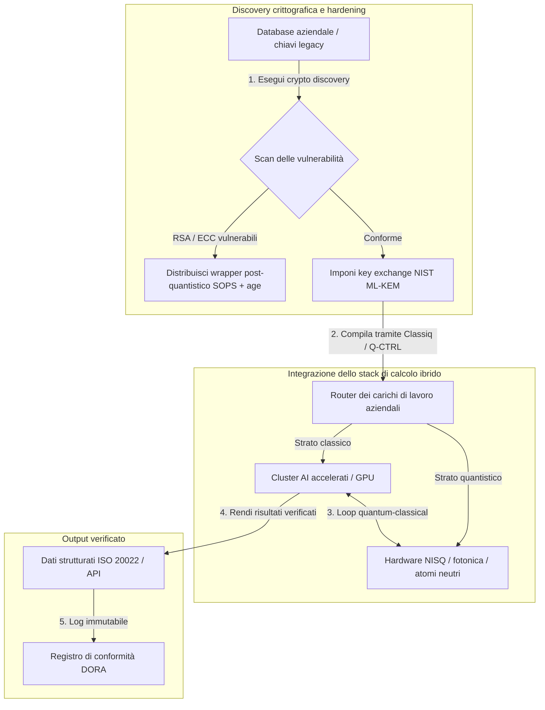

---

# Front Matter (YAML)

author: "contact@sebastienrousseau.com (Sebastien Rousseau)"
banner_alt: "Veduta del palco del summit Economist Impact 5th Annual Commercialising Quantum Global 2026 a Londra — emblema della transizione del quantum dalla ricerca fisica ai flussi di lavoro pronti per l'impresa"
banner_height: "1597"
banner_width: "2584"
banner: "https://cloudcdn.pro/stocks/images/sebastien-rousseau-20260617-5th-commercialising-quantum-2.webp"
cdn: "https://cloudcdn.pro"
charset: "UTF-8"
cname: "sebastienrousseau.com"
copyright: "© Copyright 2025 - 2026 - Sebastien Rousseau. Tutti i diritti riservati."
date: "17 giugno 2026"
description: "Conclusioni per il consiglio dal summit Economist Impact 5th Annual Commercialising Quantum Global 2026 — 1,3 miliardi di dollari di finanziamenti, stack ibridi 'no-regrets', urgenza della migrazione alla crittografia post-quantistica, commercializzazione del quantum sensing e la direttiva di HSBC secondo cui attendere è un errore non forzato."
format-detection: "telephone=no"
hreflang: "it"
icon: "https://cloudcdn.pro/clients/sebastienrousseau/v1/logos/sebastienrousseau.svg"
id: "https://sebastienrousseau.com/2026-06-17-economist-commercialising-quantum-summit-2026"
image_alt: "Ritratto in bianco e nero di Sebastien Rousseau"
image_height: "162"
image_width: "162"
image: "https://cloudcdn.pro/stocks/images/sebastienrousseau.webp"
keywords: "Commercialising Quantum Global 2026, summit Economist Impact, crittografia post-quantistica, NIST ML-KEM, harvest-now decrypt-later, SNDL, quantum HSBC, Philip Intallura, quantum sensing, navigazione GPS-independent, NQCC, EU Quantum Act, Quantcore, qBIG prize, Lord Vallance, ibrido quantum-classical, DORA Articolo 6"
language: "it-IT"
last_reviewed: "2026-06-17"
layout: "report"
locale: "it_IT"
logo_alt: "Logo di Sebastien Rousseau"
logo_height: "44"
logo_width: "44"
logo: "https://cloudcdn.pro/clients/sebastienrousseau/v1/logos/sebastienrousseau.svg"
menu: ""
measurementID: "G-169G4ET5HQ"
name: "Sebastien Rousseau"
permalink: "https://sebastienrousseau.com/2026-06-17-economist-commercialising-quantum-summit-2026"
rating: "general"
referrer: "no-referrer"
robots: "index, follow"
schema: "FAQPage, Article"
seo_title: "Commercialising Quantum 2026: conclusioni per il consiglio"
short_name: "sebastienrousseau"
subtitle: "Il quantum è passato dalla scienza di laboratorio speculativa ai flussi di lavoro aziendali ibridi; il consiglio deve rispondere a 1,3 miliardi di dollari di finanziamenti 2026, alla migrazione post-quantistica immediata e alla direttiva di HSBC: smettere di attendere."
tags: "quantum, crittografia post-quantistica, NIST ML-KEM, harvest-now decrypt-later, quantum sensing, HSBC, Economist Impact, calcolo ibrido, DORA, EU Quantum Act, NQCC, conclusioni summit"
theme-color: "0, 83, 191"
title: "Dai qubit ai profitti: conclusioni strategiche dal 5° summit annuale Commercialising Quantum Global 2026 dell'Economist"
url: "https://sebastienrousseau.com/2026-06-17-economist-commercialising-quantum-summit-2026"
viewport: "width=device-width, initial-scale=1, shrink-to-fit=no"

# RSS - The RSS feed front matter (YAML).
atom_link: "https://sebastienrousseau.com/2026-06-17-economist-commercialising-quantum-summit-2026/rss.xml"
category: "Technology"
docs: https://validator.w3.org/feed/docs/rss2.html
generator: "Static Site Generator (SSG) (version 0.0.26)"
item_description: "Conclusioni per il consiglio dal summit Economist Impact 5th Annual Commercialising Quantum Global 2026 — 1,3 miliardi di dollari di finanziamenti, stack ibridi 'no-regrets', urgenza della migrazione alla crittografia post-quantistica, commercializzazione del quantum sensing e la direttiva di HSBC secondo cui attendere è un errore non forzato."
item_guid: "https://sebastienrousseau.com/2026-06-17-economist-commercialising-quantum-summit-2026/rss.xml"
item_link: "https://sebastienrousseau.com/2026-06-17-economist-commercialising-quantum-summit-2026/rss.xml"
item_pub_date: "Wed, 17 Jun 2026 06:06:06 +0000"
item_title: "Dai qubit ai profitti: conclusioni strategiche dal 5° summit annuale Commercialising Quantum Global 2026 dell'Economist"
last_build_date: "Wed, 17 Jun 2026 06:06:06 +0000"
managing_editor: "contact@sebastienrousseau.com (Sebastien Rousseau)"
pub_date: "Wed, 17 Jun 2026 06:06:06 +0000"
ttl: "60"
type: "article"
webmaster: "contact@sebastienrousseau.com"

# Apple - The Apple front matter (YAML).
apple_mobile_web_app_orientations: "portrait"
apple_touch_icon_sizes: "192x192"
apple-mobile-web-app-capable: "yes"
apple-mobile-web-app-status-bar-inset: "black"
apple-mobile-web-app-status-bar-style: "black-translucent"
apple-mobile-web-app-title: "Commercialising Quantum 2026: conclusioni"
apple-touch-fullscreen: "yes"

# MS Application - The MS Application front matter (YAML).

msapplication-navbutton-color: "0, 83, 191"

# Twitter Card - The Twitter Card front matter (YAML).

twitter_card: "summary_large_image"
twitter_creator: "@wwdseb"
twitter_description: "Conclusioni per il consiglio dal summit Economist Impact 5th Annual Commercialising Quantum Global 2026 — 1,3 miliardi di dollari di finanziamenti, stack ibridi 'no-regrets', urgenza della migrazione alla crittografia post-quantistica, commercializzazione del quantum sensing e la direttiva di HSBC secondo cui attendere è un errore non forzato."
twitter_image: "https://cloudcdn.pro/clients/sebastienrousseau/v1/logos/sebastienrousseau.svg"
twitter_image_alt: "Logo di Sebastien Rousseau"
twitter_site: "@wwdseb"
twitter_title: "Commercialising Quantum 2026: conclusioni per il consiglio"
twitter_url: "https://sebastienrousseau.com/2026-06-17-economist-commercialising-quantum-summit-2026"

excerpt: "Il summit Economist Impact 5th Annual Commercialising Quantum Global 2026 ha confermato lo spostamento del quantum verso i flussi di lavoro aziendali: 1,3 miliardi di dollari raccolti in cinque mesi, la crittografia post-quantistica è ormai una questione fiduciaria a livello di consiglio sotto la pressione dell'harvesting SNDL, il quantum sensing è già in spedizione per la navigazione GPS-independent e Philip Intallura di HSBC ha trasmesso la direttiva: attendere l'hardware fault-tolerant è un errore non forzato."

# Humans.txt - The Humans.txt front matter (YAML).
author_website: "https://sebastienrousseau.com"
author_twitter: "@wwdseb"
author_location: "London, UK"
thanks: "Grazie per la lettura!"
site_last_updated: "2026-06-17"
site_standards: "HTML5, CSS3, RSS, Atom, JSON, XML, YAML, Markdown, TOML"
site_components: "Kaishi, Kaishi Builder, Kaishi CLI, Kaishi Templates, Kaishi Themes"
site_software: "Static Site Generator, Rust"

---

# Dai qubit ai profitti: conclusioni strategiche dal 5° summit annuale Commercialising Quantum Global 2026 dell'Economist

Maturità aziendale, migrazioni alla crittografia post-quantistica, stack di calcolo ibrido e il nascente panorama commerciale del quantum sensing e del networking quantistico.

**In sintesi.** Il 5° summit annuale Commercialising Quantum Global 2026, ospitato da Economist Impact il 16 e 17 giugno 2026 presso il Business Design Centre di Londra, ha riunito oltre 1.100 leader globali tra imprese, finanza, policy e ricerca. Il tema centrale ha segnato uno spostamento strutturale netto: la tecnologia quantistica è passata dalla scienza di laboratorio speculativa a flussi di lavoro aziendali ibridi e operativi. Sostenuto da 1,3 miliardi di dollari di venture capital raccolti solo nei primi cinque mesi del 2026, il dibattito in consiglio non riguarda più il conteggio dei qubit fisici, bensì la costruzione di stack di calcolo ibrido "no-regrets", la messa in sicurezza degli asset digitali contro la minaccia crittografica "harvest-now, decrypt-later" (SNDL) e il dispiegamento di sistemi di quantum sensing per la navigazione GPS-independent.

## Punti chiave

- **Spostamento aziendale verso flussi di lavoro pratici.** I leader del settore ([Steve Suarez](https://www.linkedin.com/in/stevesuarez) di HorizonX, [Phil Intallura](https://www.linkedin.com/in/intallura) di HSBC) hanno sottolineato che l'integrazione del quantum non è più un problema di fisica, ma operativo. Banche e imprese stanno dispiegando piloti ibridi quantum-classical per formare il talento e ottimizzare i carichi di lavoro attivi.
- **La crittografia post-quantistica (PQC) è una priorità del consiglio.** Esperti di sicurezza e legali (CMS UK, [Joanne Miller](https://www.linkedin.com/in/joanne-miller-nso) di Microsoft, [Craig Farrell](https://www.linkedin.com/in/craig-farrell) di EY) hanno avvertito che le organizzazioni non possono attendere l'hardware fault-tolerant prima di dispiegare la PQC. L'harvesting "harvest-now, decrypt-later" è in atto oggi, rendendo la migrazione agli standard NIST ML-KEM una preoccupazione fiduciaria immediata.
- **Il quantum sensing guida la redditività di breve termine.** Mentre il calcolo fault-tolerant resta a anni di distanza, il quantum sensing ([Matthew Kinsella](https://www.linkedin.com/in/matthewkinsella) di Infleqtion) sta scalando rapidamente. Orologi quantistici e sensori inerziali vengono dispiegati nella navigazione GPS-independent, nella sicurezza nazionale e nelle reti energetiche ultra-stabili.
- **Sovranità, cluster e urgenza di policy.** Il ministro britannico della Scienza [Lord Vallance](https://www.linkedin.com/in/patrick-vallance) e [Lord William Hague](https://www.linkedin.com/in/williamhague) hanno illustrato missioni nazionali per convertire la ricerca in "supercluster" di scala industriale coordinati con il National Quantum Computing Centre (NQCC). L'imminente EU Quantum Act sottolinea ulteriormente la corsa geopolitica alla capacità di calcolo sovrana.
- **Quantcore vince il qBIG prize.** Quantcore, spin-out dell'Università di Glasgow, si è aggiudicata il qBIG prize dell'IOP per i suoi componenti superconduttori a base di niobio, che operano a temperature più elevate rispetto ai materiali tradizionali, riducendo significativamente l'onere infrastrutturale criogenico.

**Letture correlate:** [KyberLib e la migrazione bancaria post-quantistica nel 2026: dagli standard al codice](https://sebastienrousseau.com/2026-06-12-kyberlib-post-quantum-banking-migration-standards-code-2026/), [Il Banking Resilience Index nel 2026: AI, Cloud, Quantum, Pagamenti e rischio di concentrazione di terze parti](https://sebastienrousseau.com/2026-06-08-banking-resilience-index-ai-cloud-quantum-payments-third-party-risk-2026/), [Il Cloud Native Banking Index nel 2026: DORA, platform engineering, sovereign cloud e resilienza operativa](https://sebastienrousseau.com/2026-06-05-cloud-native-banking-index-dora-resilience-platform-engineering-2026/).

## 01. Perché il summit 2026 conta per il consiglio

L'edizione 2026 del summit Commercialising Quantum Global dell'Economist ha sancito uno spostamento permanente nel modo in cui il mondo corporate valuta la deep tech.

Storicamente, il calcolo quantistico era relegato ai dipartimenti R&D come iniziativa scientifica pluridecennale. A giugno 2026 questa prospettiva è obsoleta. Le organizzazioni devono passare dalla curiosità "physics-centric" all'implementazione "business-centric". Il motivo è duplice:

1. **La convergenza quantum-AI.** Gli stack di high-performance computing (HPC) stanno fondendo nodi classici, AI accelerata e NISQ (Noisy Intermediate-Scale Quantum) in un unico strato di calcolo unificato. Le organizzazioni che ritardano la costruzione di applicazioni quantum-ready scopriranno che la finestra per catturare un vantaggio strategico si sta chiudendo più rapidamente del previsto.
2. **Urgenza geopolitica e fiduciaria.** Con il programma quantistico mission-led del Regno Unito e l'imminente EU Quantum Act, la capacità quantistica è diventata una questione di sovranità nazionale e continuità aziendale.

Inoltre, la cybersicurezza post-quantistica non è più un requisito di conformità futuro. La minaccia degli attacchi avversariali "store now, decrypt later" (SNDL) significa che i dati aziendali intercettati oggi saranno decifrati quando i sistemi quantistici commerciali scaleranno, generando responsabilità immediate ai sensi dei mandati globali di resilienza operativa come il Digital Operational Resilience Act (DORA).

## 02. La lente strategica Commercialising Quantum 2026

I leader tecnologici aziendali devono mappare la maturità quantistica su cinque strati operativi distinti, valutando gli orizzonti temporali e i rischi di bilancio.

### Tabella 1: la lente strategica Commercialising Quantum 2026

| Strato | Focus aziendale | Orizzonte temporale | Rischio aziendale chiave |
| ---- | ---- | ---- | ---- |
| **Hardware e compilatore** | Scelta tra approcci concorrenti (superconduttori, ioni intrappolati, atomi neutri, fotonica) | 3 – 5 anni (fault-tolerance) | Vincolarsi a un'architettura senza prospettive o puntare troppo presto su una sola piattaforma. |
| **Hardening crittografico** | Discovery e inventario delle dipendenze crittografiche; migrazione a NIST ML-KEM | Immediato (migrazione attiva) | Violazioni sistemiche dei dati e mancata conformità a DORA e NIST CSF 2.0. |
| **Quantum sensing** | Dispiegamento di navigazione GPS-independent, orologi ultra-stabili e gravimetri | 1 – 2 anni (commerciale immediato) | Disruption operativa di logistica, shipping e reti energetiche a causa del jamming GPS. |
| **Integrazione di sistema** | Connessione dell'hardware quantistico ai data centre HPC e di supercalcolo classici esistenti | 1 – 3 anni (fase ibrida) | Alta latenza, colli di bottiglia nel trasferimento dati e silos di calcolo frammentati. |
| **Software aziendale** | Esposizione degli algoritmi quantistici tramite strati di astrazione e API di alto livello (Classiq, Q-CTRL) | Immediato (sviluppo competenze) | Isolamento del talento e dei flussi di lavoro rispetto all'esecuzione ingegneristica reale. |

## 03. Segnali quantistici chiave e trigger per il consiglio

I leader tecnologici devono monitorare metriche di mercato e regolamentari specifiche e quantificabili per guidare i propri investimenti quantistici.

### Tabella 2: segnali quantistici chiave e trigger per il consiglio

| Segnale | Metrica quantitativa | Riferimento regolamentare / di policy | Priorità d'azione di piattaforma |
| ---- | ---- | ---- | ---- |
| **Impennata dei finanziamenti quantistici** | 1,3 miliardi di dollari raccolti a livello globale nei primi cinque mesi del 2026 | Return on Resilience (RoR) | Spostare i budget dai piloti speculativi ai carichi di lavoro ibridi quantum-classical "no-regrets". |
| **Esposizione alla decifratura dei dati** | 100% dei dati cifrati trasmessi su canali pubblici esposti all'harvesting SNDL | DORA Articolo 6 (sicurezza ICT) | Implementare strumenti di cryptographic discovery per identificare chiavi RSA/ECC vulnerabili in tutto il parco. |
| **Infrastruttura sovrana** | Stanziamento di 2,5 miliardi di sterline della UK National Quantum Strategy | UK Quantum Missions / Lord Vallance | Stabilire partnership locali con i supercluster nazionali come l'NQCC. |
| **Scadenze di conformità** | Cutover all'indirizzo strutturato SWIFT del 14 novembre 2026 | Direttiva SWIFT SR 2026 | Bonificare e formattare i database interbancari per soddisfare le specifiche XML strutturate. |

## 04. Approfondimento sui temi centrali del summit

### Il quantum raggiunge il punto di svolta degli investimenti

I finanziamenti venture capital hanno registrato un'accelerazione significativa, raccogliendo **1,3 miliardi di dollari** solo nei primi cinque mesi del 2026. A differenza dei cicli speculativi degli anni passati, l'attuale ondata di capitale è sostenuta da carichi di lavoro reali e di breve termine. Relatori di Classiq e IBM Quantum Platform hanno mostrato come gli strati di astrazione software e i compilatori automatizzati consentano a team di sviluppo non specialistici di eseguire algoritmi ibridi quantum-classical sull'infrastruttura classica odierna. Questa strategia "no-regrets" permette alle organizzazioni di costruire talento e flussi di lavoro quantum-ready da subito.

### Avvertimenti legali e regolamentari sull'"harvest now, decrypt later"

Partner legali e dirigenti della cybersicurezza hanno acceso il dibattito sull'immediatezza del rischio dati. I rappresentanti dello sponsor legale CMS UK e la CSO di Microsoft [Joanne Miller](https://www.linkedin.com/in/joanne-miller-nso) hanno trasmesso al senior management un avviso netto: *attendere l'arrivo dell'hardware fault-tolerant prima di dispiegare la crittografia post-quantistica è un fallimento fiduciario critico.*

Nel paradigma "store now, decrypt later" (SNDL), attori ostili stanno raccogliendo attivamente dati aziendali cifrati oggi con l'intento di decifrarli non appena emergeranno computer quantistici rilevanti per la crittografia. Le organizzazioni devono dispiegare protezioni post-quantistiche (come NIST ML-KEM) immediatamente per proteggere dataset sensibili di lunga durata, proprietà intellettuale e archivi storici dei clienti.

### Il riallineamento dell'hype sul "quantum sensing"

Mentre il calcolo quantistico fault-tolerant resta a anni di distanza, il summit ha indicato il quantum sensing come la prima ondata davvero redditizia di dispiegamento nel mondo reale. Il chief executive [Matthew Kinsella](https://www.linkedin.com/in/matthewkinsella) di Infleqtion ha illustrato come orologi quantistici, sensori inerziali e sistemi a radiofrequenza stiano scalando rapidamente in più settori industriali.

Poiché queste tecnologie misurano costanti fisiche con precisione subatomica, abilitano la **navigazione GPS-independent**, reti energetiche ultra-stabili e telecomunicazioni nello spazio profondo. Queste applicazioni sono altamente rilevanti per aviazione, trasporto marittimo e sistemi di difesa nazionale esposti a crescenti minacce di jamming del GPS.

### Ecosistema e collaborazione tra cluster

L'ecosistema quantistico britannico ha sfruttato il summit londinese per mettere in vetrina i supercluster di innovazione domestici. Aggiornamenti dal vivo dal National Quantum Computing Centre (NQCC) e dal Digital Catapult hanno illustrato come gli spin-out deep-tech in fase iniziale possano colmare il "technology divide" integrando l'hardware quantistico direttamente nei data centre di supercalcolo classico.

[Wridhdhisom Karar](https://www.linkedin.com/in/wridhdhisomkarar), cofondatore della startup quantistica scozzese Quantcore, ha ritirato il prestigioso premio Quantum Business Innovation and Growth (qBIG) dell'Institute of Physics (IOP) per i componenti superconduttori a base di niobio dell'azienda. Questi componenti operano a temperature più elevate rispetto ai materiali tradizionali, riducendo significativamente l'onere infrastrutturale criogenico necessario per scalare i processori quantistici.

### Il caso HSBC: perché attendere il quantum è un "errore non forzato"

Gli interventi di [**Philip Intallura, Ph.D.**](https://www.linkedin.com/in/intallura) (Global Head of Quantum Technologies di HSBC, advisor del governo britannico e board advisor) al 5° Commercialising Quantum Event dell'Economist (2026) hanno trasmesso una potente direttiva al consiglio: *"Attendere il quantum fault-tolerant prima di iniziare è un errore non forzato."*

Il dott. Intallura ha sostenuto che il comune approccio "wait-and-see" tra le istituzioni finanziarie è un autogol fondato su tre assunti errati:

- **Il ROI di breve termine è reale.** In test empirici, HSBC ha superato i modelli attualmente in produzione, ha collegato il lavoro quantistico ad altre aree del business, ha usato il quantum per approfondire i rapporti con alcuni dei suoi maggiori clienti e ha attratto significativo nuovo business in **HSBC Innovation Banking**.
- **Il quantum è una curva di adozione ripida.** Costruire capability, definire la strategia, ottenere i finanziamenti ed eseguire cicli sperimentali all'interno di un'organizzazione fortemente regolamentata non è un'impresa breve. I processi vanno sistematicamente testati e adattati alla tecnologia.
- **Il quantum è un ecosistema.** Nessun singolo player arriva da solo. Ogni paper di ricerca, POC e pilota eseguito da HSBC è avvenuto in stretta collaborazione con un fornitore quantistico — e in alcuni casi la collaborazione si estende ad accademia, regolatori e governo.

**Direttiva finale per il consiglio:** *"La capability di cui avrete bisogno al giorno uno della fault tolerance è la capability che costruite ora."*

## 05. Integrazione quantistica aziendale e pipeline di crittografia

Per mettere in sicurezza gli asset digitali costruendo al contempo la maturità quantistica, l'impresa deve stabilire una pipeline di integrazione chiara.

## 06. Il playbook del consiglio: imperativi operativi

Per tradurre le conclusioni del summit Commercialising Quantum Global 2026 in valore di business immediato, il senior management dovrebbe eseguire il seguente playbook in quattro passi:

1. **Mandato di cryptographic discovery.** Indirizzare il Chief Information Security Officer (CISO) a catalogare tutti gli asset crittografici, mappando ogni chiave legacy RSA ed ECC nell'impresa per prepararsi alla migrazione post-quantistica.
2. **Dispiegare una strategia ibrida "no-regrets".** Evitare di attendere l'hardware perfetto. Investire in software quantum-inspired e piloti ibridi classical-quantum per sviluppare talento interno e ottimizzare oggi logistica complessa o portafogli di rischio.
3. **Valutare il quantum sensing per la logistica.** Se la vostra organizzazione dipende da catene di fornitura globali, shipping o infrastrutture critiche, valutate attivamente i sistemi di quantum sensing (come la navigazione GPS-independent) per mitigare i rischi di disruption geopolitica.
4. **Iscriversi alla Insight Hour del 30 giugno.** Assicurarsi che i propri leader tecnologici si iscrivano alla **Commercialising Quantum Global Insight Hour** virtuale del 30 giugno 2026 alle 15:00 BST (con il supporto di IonQ) per continuare a tracciare le strategie di gestione del rischio aziendale e di allocazione del talento.

## 07. Domande frequenti

**Cos'è l'"harvest now, decrypt later" (SNDL) e perché conta oggi?**
SNDL è la pratica di intercettare e archiviare dati cifrati oggi, con l'intento di decifrarli più avanti, una volta disponibili computer quantistici rilevanti per la crittografia. Dataset sensibili di lunga durata — proprietà intellettuale, archivi clienti, comunicazioni governative — sono già nel mirino. Migrare a NIST ML-KEM è una decisione fiduciaria che il consiglio non può rinviare.

**Perché il quantum sensing è la prima ondata commerciale, non il calcolo?**
I sensori quantistici misurano costanti fisiche con precisione subatomica e non richiedono l'hardware fault-tolerant necessario al calcolo quantistico. Orologi quantistici, gravimetri e sensori inerziali sono già in pilota per la navigazione GPS-independent, reti energetiche ultra-stabili e comunicazioni nello spazio profondo.

**Il lavoro quantistico di HSBC è solo R&D o ha prodotto ritorni misurabili?**
Secondo Philip Intallura al summit, HSBC ha superato i modelli attualmente in produzione, ha usato il quantum per approfondire i rapporti con i suoi maggiori clienti e ha attratto significativo nuovo business in HSBC Innovation Banking. Il lavoro è passato dalla ricerca all'integrazione operativa.

## 08. Riferimenti

- **Economist Impact, (2026).** *5th Annual Commercialising Quantum Global 2026.* Atti dal vivo, 16–17 giugno 2026. Londra: Business Design Centre. Disponibile su: [Economist Impact](https://events.economist.com/commercialising-quantum/).
- **National Institute of Standards and Technology (NIST), (2024).** *First Three Finalized Post-Quantum Encryption Standards (FIPS 203, 204 e 205).* Gaithersburg: U.S. Department of Commerce. Disponibile su: [NIST Standards](https://www.nist.gov/news-events/news/2024/08/nist-releases-first-3-finalized-post-quantum-encryption-standards).
- **Parlamento europeo e Consiglio dell'Unione europea, (2022).** *Regolamento (UE) 2022/2554 sulla resilienza operativa digitale per il settore finanziario (DORA).* Bruxelles: Gazzetta ufficiale dell'Unione europea. Disponibile su: [Regolamento DORA](https://eur-lex.europa.eu/legal-content/EN/TXT/?uri=CELEX%3A32022R2554).
- **SWIFT, (2024).** *ISO 20022 November 2026 Structured Address Milestone.* La Hulpe: SWIFT. Disponibile su: [SWIFT ISO 20022 milestone](https://www.swift.com/standards/iso-20022/iso-20022-bytes/call-action-november-2026).
