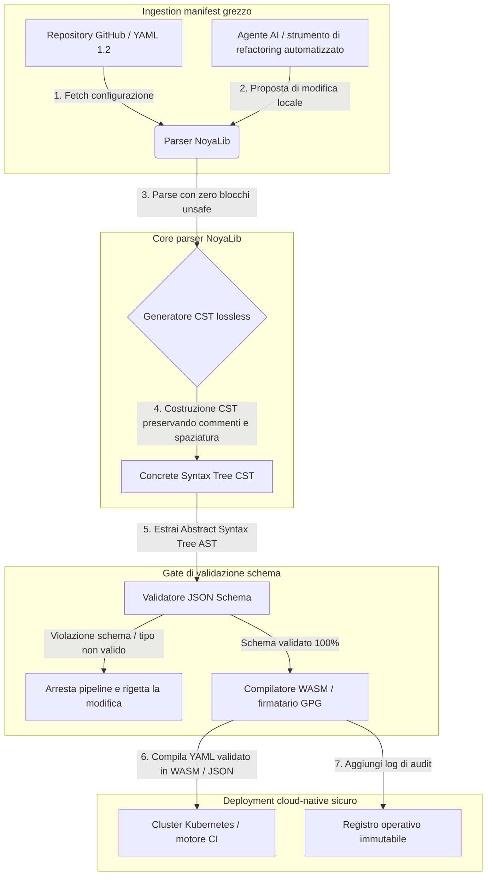

---

# Front Matter (YAML)

author: "contact@sebastienrousseau.com (Sebastien Rousseau)"
banner_alt: "Geometria architettonica sotto luce drammatica — emblema del ruolo di NoyaLib come parser YAML in Rust sicuro e portante per CI, Kubernetes, MCP e configurazione dei servizi finanziari"
banner_height: "1597"
banner_width: "2584"
banner: "https://cloudcdn.pro/stocks/images/ken-cheung-KonWFWUaAuk.webp"
cdn: "https://cloudcdn.pro"
charset: "UTF-8"
cname: "sebastienrousseau.com"
copyright: "© Copyright 2025 - 2026 - Sebastien Rousseau. Tutti i diritti riservati."
date: "18 giugno 2026"
description: "NoyaLib, parser YAML 1.2 in Rust zero-unsafe con compliance 406/406, validazione JSON Schema, CST lossless e binding MCP/WASM per l'infrastruttura finanziaria."
format-detection: "telephone=no"
hreflang: "it"
icon: "https://cloudcdn.pro/clients/sebastienrousseau/v1/logos/sebastienrousseau.svg"
id: "https://sebastienrousseau.com/2026-06-18-noyalib-safe-yaml-rust-ai-mcp-financial-infrastructure-2026"
image_alt: "Ritratto in bianco e nero di Sebastien Rousseau"
image_height: "162"
image_width: "162"
image: "https://cloudcdn.pro/stocks/images/sebastienrousseau.webp"
keywords: "parser YAML Rust più sicuro, NoyaLib, compliance specifica YAML 1.2, Rust zero-unsafe, validazione JSON Schema, Concrete Syntax Tree lossless, CST, MCP, Model Context Protocol, WebAssembly, manifest Kubernetes, configurazione CI/CD, DORA Articolo 5, BCBS 239, rischio operativo Basel III, infrastruttura finanziaria, sicurezza della configurazione, supply chain software"
language: "it-IT"
last_reviewed: "2026-06-18"
layout: "report"
locale: "it_IT"
logo_alt: "Logo di Sebastien Rousseau"
logo_height: "44"
logo_width: "44"
logo: "https://cloudcdn.pro/clients/sebastienrousseau/v1/logos/sebastienrousseau.svg"
menu: ""
measurementID: "G-169G4ET5HQ"
name: "Sebastien Rousseau"
permalink: "https://sebastienrousseau.com/2026-06-18-noyalib-safe-yaml-rust-ai-mcp-financial-infrastructure-2026"
rating: "general"
referrer: "no-referrer"
robots: "index, follow"
schema: "FAQPage, Article"
seo_title: "Parser YAML Rust più sicuro per AI, MCP e finanza"
short_name: "sebastienrousseau"
subtitle: "Uno stack YAML in Rust più sicuro — NoyaLib — trasforma YAML 1.2 da semplice markup di comodo in un piano di controllo della configurazione crittograficamente sicuro e conforme alla specifica, per agenti AI, MCP, Kubernetes e l'infrastruttura dei servizi finanziari."
tags: "parser YAML Rust più sicuro, NoyaLib, YAML 1.2, Rust zero-unsafe, JSON Schema, MCP, WebAssembly, Kubernetes, DORA, BCBS 239, Basel III, infrastruttura finanziaria, sicurezza supply chain"
theme-color: "0, 83, 191"
title: "Perché YAML necessita di uno stack Rust più sicuro per AI, MCP e l'infrastruttura finanziaria nel 2026"
url: "https://sebastienrousseau.com/2026-06-18-noyalib-safe-yaml-rust-ai-mcp-financial-infrastructure-2026"
viewport: "width=device-width, initial-scale=1, shrink-to-fit=no"

# RSS - The RSS feed front matter (YAML).
atom_link: "https://sebastienrousseau.com/2026-06-18-noyalib-safe-yaml-rust-ai-mcp-financial-infrastructure-2026/rss.xml"
category: "Technology"
docs: https://validator.w3.org/feed/docs/rss2.html
generator: "Static Site Generator (SSG) (version 0.0.26)"
item_description: "NoyaLib, parser YAML 1.2 in Rust zero-unsafe con compliance 406/406, validazione JSON Schema, CST lossless e binding MCP/WASM per l'infrastruttura finanziaria."
item_guid: "https://sebastienrousseau.com/2026-06-18-noyalib-safe-yaml-rust-ai-mcp-financial-infrastructure-2026/rss.xml"
item_link: "https://sebastienrousseau.com/2026-06-18-noyalib-safe-yaml-rust-ai-mcp-financial-infrastructure-2026/rss.xml"
item_pub_date: "Thu, 18 Jun 2026 06:06:06 +0000"
item_title: "Perché YAML necessita di uno stack Rust più sicuro per AI, MCP e l'infrastruttura finanziaria nel 2026"
last_build_date: "Thu, 18 Jun 2026 06:06:06 +0000"
managing_editor: "contact@sebastienrousseau.com (Sebastien Rousseau)"
pub_date: "Thu, 18 Jun 2026 06:06:06 +0000"
ttl: "60"
type: "article"
webmaster: "contact@sebastienrousseau.com"

# Apple - The Apple front matter (YAML).
apple_mobile_web_app_orientations: "portrait"
apple_touch_icon_sizes: "192x192"
apple-mobile-web-app-capable: "yes"
apple-mobile-web-app-status-bar-inset: "black"
apple-mobile-web-app-status-bar-style: "black-translucent"
apple-mobile-web-app-title: "Parser YAML Rust più sicuro per AI, MCP e finanza"
apple-touch-fullscreen: "yes"

# MS Application - The MS Application front matter (YAML).

msapplication-navbutton-color: "0, 83, 191"

# Twitter Card - The Twitter Card front matter (YAML).

twitter_card: "summary_large_image"
twitter_creator: "@wwdseb"
twitter_description: "NoyaLib, parser YAML 1.2 in Rust zero-unsafe con compliance 406/406, validazione JSON Schema, CST lossless e binding MCP/WASM per l'infrastruttura finanziaria."
twitter_image: "https://cloudcdn.pro/clients/sebastienrousseau/v1/logos/sebastienrousseau.svg"
twitter_image_alt: "Logo di Sebastien Rousseau"
twitter_site: "@wwdseb"
twitter_title: "Parser YAML Rust più sicuro per AI, MCP e finanza"
twitter_url: "https://sebastienrousseau.com/2026-06-18-noyalib-safe-yaml-rust-ai-mcp-financial-infrastructure-2026"

excerpt: "NoyaLib è uno stack YAML in Rust più sicuro — zero blocchi unsafe, compliance 406/406 alla specifica YAML 1.2, Concrete Syntax Tree lossless, validazione JSON Schema (Draft 2020-12) e binding MCP/WASM — progettato per agenti AI, Kubernetes, CI/CD e il piano di controllo della configurazione dietro l'infrastruttura finanziaria."

# Humans.txt - The Humans.txt front matter (YAML).
author_website: "https://sebastienrousseau.com"
author_twitter: "@wwdseb"
author_location: "London, UK"
thanks: "Grazie per la lettura!"
site_last_updated: "2026-06-18"
site_standards: "HTML5, CSS3, RSS, Atom, JSON, XML, YAML, Markdown, TOML"
site_components: "Kaishi, Kaishi Builder, Kaishi CLI, Kaishi Templates, Kaishi Themes"
site_software: "Static Site Generator, Rust"

---

# Perché YAML necessita di uno stack Rust più sicuro per AI, MCP e l'infrastruttura finanziaria nel 2026

Uno stack YAML in Rust più sicuro è importante perché YAML oggi sostiene pipeline CI/CD, manifest Kubernetes, regole [Open Policy Agent](https://www.openpolicyagent.org/) e registri di strumenti del Model Context Protocol (MCP) — e un singolo parsing ambiguo può bloccare un sistema di clearing, configurare male un security group o conferire a un agente AI locale i permessi sbagliati. [NoyaLib](https://github.com/sebastienrousseau/noyalib) è un ecosistema di parsing e validazione [YAML 1.2](https://yaml.org/spec/1.2.2/) puro Rust, zero-unsafe, progettato per rendere quell'infrastruttura sicura per default.

## Risposta breve

**Cos'è NoyaLib in una frase?** NoyaLib è un parser YAML 1.2 open source, puro Rust, ed ecosistema di validazione con zero codice `unsafe`, compliance al 100% alla specifica sull'intera suite ufficiale di 406 test YAML, un Concrete Syntax Tree lossless e validazione [JSON Schema](https://json-schema.org/) in tempo reale — progettato per rendere sicura per default la configurazione di agenti AI, MCP, Kubernetes e infrastruttura finanziaria.

## Sintesi esecutiva

YAML appare modesto finché un parsing ambiguo o una violazione di schema non manda in tilt un sistema di clearing di produzione da diversi miliardi di dollari. Nel 2026, YAML è lo standard de facto per pipeline [CI/CD](https://docs.github.com/en/actions/learn-github-actions/workflow-syntax-for-github-actions), manifest [Kubernetes](https://kubernetes.io/docs/concepts/configuration/overview/), regole [Open Policy Agent](https://www.openpolicyagent.org/) e registri di strumenti del Model Context Protocol (MCP). I parser legacy opachi — con vulnerabilità di memoria e parsing distruttivo — costituiscono un rischio di sicurezza inaccettabile. NoyaLib è un ecosistema YAML 1.2 puro Rust, zero-unsafe: compliance al 100% su tutti i 406 test ufficiali della suite, un Concrete Syntax Tree (CST) lossless che preserva commenti e spaziatura, e validazione JSON Schema integrata. Il risultato è YAML riformulato come piano di controllo della configurazione auditabile, sicuro e accessibile agli agenti.

## Punti chiave

- **La configurazione è codice di produzione.** Un singolo file YAML malformato può configurare male i security group cloud-native o i permessi degli agenti AI. NoyaLib tratta YAML come infrastruttura critica.
- **Design zero-unsafe.** Costruito interamente in Rust sicuro con zero blocchi `unsafe`, NoyaLib elimina le vulnerabilità di memory safety — buffer overflow, esecuzione di codice remoto — nei livelli di parsing core.
- **Compliance assoluta 406/406 alla specifica.** Valida matematicamente le strutture di configurazione, eliminando discrepanze di parsing e derive strutturali tra ambienti di staging e produzione.
- **Concrete Syntax Tree lossless.** A differenza dei parser legacy che scartano commenti e formattazione, NoyaLib preserva spaziatura e annotazioni, abilitando refactoring automatizzati sicuri e round-trip da parte degli agenti AI.
- **Valore fiduciario a livello di consiglio.** Collega l'integrità della configurazione con [DORA Articolo 5](https://eur-lex.europa.eu/legal-content/EN/TXT/?uri=CELEX%3A32022R2554) e le metriche di capitale per rischio operativo di [Basel III](https://www.bis.org/bcbs/publ/d424.htm), proteggendo direttamente il senior management dalla responsabilità personale.

**Letture correlate:** [KyberLib e la migrazione bancaria post-quantistica nel 2026: dagli standard al codice](https://sebastienrousseau.com/2026-06-12-kyberlib-post-quantum-banking-migration-standards-code-2026/), [Il Cloud Native Banking Index nel 2026: DORA, platform engineering, sovereign cloud e resilienza operativa](https://sebastienrousseau.com/2026-06-05-cloud-native-banking-index-dora-resilience-platform-engineering-2026/), [Dotfiles AI-aware nel 2026: costruire una workstation per sviluppatori sicura e riproducibile per MCP, SLSA e parità multi-shell](https://sebastienrousseau.com/2026-06-16-ai-aware-dotfiles-secure-reproducible-workstation-2026/).

## 01. Perché uno stack YAML in Rust più sicuro conta nel 2026

A giugno 2026, le infrastrutture IT aziendali sono altamente distribuite e sempre più automatizzate.

YAML è silenziosamente diventato il linguaggio di configurazione portante per l'intero stack dell'ingegneria del software. Sostiene i workflow di integrazione continua (CI) che compilano gli artefatti di produzione, i manifest [Kubernetes](https://kubernetes.io/docs/concepts/overview/) che orchestrano i cluster cloud-native globali e gli schemi server del [Model Context Protocol](https://modelcontextprotocol.io/) (MCP) che concedono agli agenti AI locali il permesso di eseguire operazioni locali.

I parser YAML legacy — [PyYAML](https://pyyaml.org/), [yaml-cpp](https://github.com/jbeder/yaml-cpp), [libyaml](https://github.com/yaml/libyaml) — portano con sé due rischi strutturali:

1. **Vulnerabilità di coercizione di tipo (il "problema della Norvegia").** I parser legacy spesso convertono stringhe non quotate (il codice paese `NO` in un booleano `false`, `yes`/`no` analogamente) — si veda il [tag booleano YAML 1.1 vs 1.2](https://yaml.org/type/bool.html) — causando guasti critici di sistema o silenziose configurazioni di sicurezza errate.
2. **Exploit di memory safety.** I parser opachi scritti in C/C++ soffrono di exploit di memory leak e buffer overflow, che possono portare all'esecuzione di codice remoto (RCE) sui server di build core.

[NoyaLib](https://github.com/sebastienrousseau/noyalib) risolve queste sfide. È un ecosistema di parsing e validazione YAML 1.2 puro Rust, zero-unsafe. Raggiungendo la compliance assoluta 406/406 alla specifica e imponendo una rigorosa validazione JSON Schema direttamente durante il parsing, NoyaLib offre un elevato **Return on Resilience (RoR)** — prevenendo i downtime indotti dalla configurazione e mettendo in sicurezza le supply chain software di livello finanziario.

## 02. La lente architetturale di NoyaLib 2026

L'ecosistema NoyaLib opera come parser di configurazione sicuro e lossless. Ogni manifest locale e cloud viene strutturalmente validato e protetto al livello di esecuzione più basso.

### Tabella 1: livelli architetturali di NoyaLib e mitigazione del rischio

| Livello | Decisione di design | Perché conta | Rischio in caso di gestione errata |
| ---- | ---- | ---- | ---- |
| **Livello parser** | Parser puro Rust conforme a YAML 1.2 con zero blocchi `unsafe` | Elimina le vulnerabilità di memory safety e i buffer overflow al livello di esecuzione più basso. | Esecuzione di codice remoto (RCE) sui server di build core. |
| **Livello di conformità** | Compliance al 100% sui 406/406 test della suite ufficiale YAML 1.2 | Elimina discrepanze di parsing e derive di coercizione di tipo tra staging e produzione. | Errori di coercizione di tipo del "problema della Norvegia" che disabilitano i security group. |
| **Livello syntax-tree** | Concrete Syntax Tree (CST) lossless | Preserva commenti, spaziatura e ordinamento durante il parsing round-trip e il refactoring programmatico. | Refactoring AI automatizzati che distruggono le annotazioni degli sviluppatori. |
| **Livello di validazione** | Validazione [JSON Schema (Draft 2020-12)](https://json-schema.org/draft/2020-12/release-notes) durante il parsing | Impone modelli di dati rigorosi sui file di configurazione prima che raggiungano i cluster di produzione. | File di configurazione malformati che innescano crash dei cluster cloud-native. |
| **Livello di interfaccia** | Binding WebAssembly (WASM) e MCP | Permette alla validazione della configurazione di girare direttamente all'interno di browser, nodi edge e toolkit di agenti locali. | Silo di tooling in cui la validazione non può eseguire su dispositivi edge. |

## 03. Segnali chiave di sicurezza della workstation e della configurazione

Per mantenere una sicurezza assoluta sull'intero perimetro di sviluppo e operazioni, i Chief Information Security Officer (CISO) devono monitorare metriche specifiche e quantificabili.

### Tabella 2: segnali di sicurezza della workstation e della configurazione

| Segnale | Metrica / benchmark operativo | Riferimento NIST CSF / DORA | Implementazione tecnica di piattaforma |
| ---- | ---- | ---- | ---- |
| **Conformità del parser** | Tasso di superamento al 100% della suite ufficiale di test YAML 1.2 (406/406 test). | [DORA Articolo 6](https://eur-lex.europa.eu/legal-content/EN/TXT/?uri=CELEX%3A32022R2554) (sicurezza ICT) | Core parser NoyaLib che valida tutti i manifest prima dell'esecuzione CI. |
| **Profilo di memory safety** | Zero blocchi `unsafe` Rust all'interno del parser e delle dipendenze del serializer. | DORA Articolo 30 (supply chain) | Controlli automatizzati del compilatore ([`forbid(unsafe_code)`](https://doc.rust-lang.org/reference/attributes/diagnostics.html#the-forbid-attribute)) nelle build cargo. |
| **Validazione di schema** | 100% dei file di configurazione parsati verificati rispetto a modelli [JSON Schema](https://json-schema.org/) validi. | [NIST CSF 2.0](https://www.nist.gov/cyberframework) (PR.DS-01) | Gate di validazione in tempo reale che blocca le pipeline di build sulle violazioni di schema. |
| **Drift della configurazione** | Rilevamento in tempo reale e ripristino dei file di configurazione locali allo stato versionato in git. | Return on Resilience (RoR) | Telemetria continua che logga tutte le modifiche ai file locali. |
| **Controllo accessi degli agenti** | Permessi limitati e di sola lettura per gli strumenti AI locali che operano tramite configurazioni MCP. | Model risk management ([SR 11-7](https://www.federalreserve.gov/supervisionreg/srletters/sr1107.htm)) | Boundary del server MCP che limitano le operazioni dell'agente alle directory approvate. |

## 04. La fallacia del parsing opaco della configurazione

Una vulnerabilità importante nelle operazioni cloud-native è il *parsing opaco* — l'uso di parser che scartano i metadati strutturali (commenti, whitespace, ordinamento del documento) o convertono silenziosamente i tipi durante la compilazione. Questo comportamento introduce due gravi rischi di sicurezza:

1. **Refactoring distruttivo.** Quando un assistente di coding AI o uno strumento di refactoring automatizzato aggiorna un manifest di deployment, i parser tradizionali scartano commenti e formattazione degli sviluppatori, distruggendo il contesto necessario per le review umane e l'analisi forense post-incidente.
2. **Discrepanze di parsing.** Se un ambiente di staging usa un parser basato su Python e la produzione gira con un parser basato su C, lievi differenze nella compliance alla specifica YAML 1.2 possono far fallire un manifest di staging valido o comportarsi in modo diverso in produzione, creando vulnerabilità di sicurezza nascoste.

Il **Concrete Syntax Tree (CST) lossless** di NoyaLib risolve questo problema. Preserva ogni spazio, commento e riga di documento durante il ciclo di parse-and-serialise. Gli assistenti AI automatizzati possono modificare, fare refactoring e committare file di configurazione preservando il 100% delle annotazioni scritte dagli umani — un audit trail assoluto.

## 05. Progettare una pipeline di configurazione AI delimitata

Per evitare che modifiche di configurazione malevoli raggiungano gli ambienti di produzione, l'organizzazione deve implementare una pipeline di configurazione rigorosamente delimitata e validata da schema.

Il flusso operativo seguente mostra come NoyaLib parsa il YAML grezzo, costruisce un CST lossless, valida l'AST contro un modello JSON Schema e compila i binding WebAssembly per ambienti browser o edge.

## 06. Il playbook del consiglio e la responsabilità fiduciaria

La sicurezza della configurazione e l'integrità della supply chain software sono priorità critiche del consiglio. I senior manager devono affrontare la gestione della configurazione attraverso la lente della dovere fiduciario e della resilienza operativa.

- **DORA Articolo 5 (responsabilità del consiglio).** Stabilisce che il consiglio sostiene la responsabilità ultima e non delegabile nella gestione del rischio ICT dell'istituzione. Poiché i file di configurazione controllano security group cloud-native critici e percorsi di routing dei pagamenti, i consigli devono verificare che i sistemi che parsano questi manifest siano memory-safe e pienamente conformi alla specifica per soddisfare gli audit regolamentari. ([Regolamento (UE) 2022/2554](https://eur-lex.europa.eu/legal-content/EN/TXT/?uri=CELEX%3A32022R2554))
- **BCBS 239 (aggregazione e reporting dei dati di rischio).** Richiede che il reporting del rischio e le metriche infrastrutturali siano accurati, completi e generati sotto rigorosi controlli di qualità dei dati. NoyaLib supporta BCBS 239 parsando e validando i file di configurazione contro schemi rigorosi alla fonte, prevenendo silenziose perdite di dati o interruzioni indotte da configurazioni errate. ([standard BCBS 239](https://www.bis.org/publ/bcbs239.htm))
- **Mitigazione degli oneri di capitale per rischio operativo (Basel III).** Le interruzioni indotte dalla configurazione gonfiano direttamente gli oneri di capitale per rischio operativo sotto Basel III, immobilizzando capitale di bilancio. Standardizzare lo stack di configurazione aziendale su un parser puro Rust sicuro come NoyaLib minimizza questo rischio, preservando il capitale e proteggendo la fiducia dei clienti. ([standard Basel III](https://www.bis.org/bcbs/publ/d424.htm))

## 07. Cosa significa per tipologia di banca

### Banche di rilevanza sistemica globale (G-SIB)

Le G-SIB gestiscono migliaia di microservizi e pipeline di deployment su più giurisdizioni. La loro sfida principale è mantenere la coerenza della configurazione e prevenire il drift di sicurezza su perimetri cloud-native enormi. Standardizzare su uno stack YAML in Rust più sicuro come NoyaLib garantisce che tutti i manifest Kubernetes, le pipeline CI/CD e le policy di sicurezza siano parsati e validati sotto un framework uniforme e memory-safe — eliminando il rischio di configurazioni "snowflake" non auditate.

### Banche transaction e corporate

Le banche transaction operano gateway di pagamento sensibili e infrastrutture di clearing wholesale. Dimostrare la sicurezza assoluta del codice e della configurazione distribuiti in questi ambienti di produzione è una richiesta regolamentare non negoziabile. Integrare NoyaLib garantisce che la supply chain software sia pienamente auditata, lossless e protetta dalle vulnerabilità di parsing — un controllo che mappa in modo pulito su DORA Articolo 6 e [PCI DSS v4.0](https://www.pcisecuritystandards.org/document_library/) sezione 6.

### Banche regionali e di minori dimensioni

Le banche regionali devono mantenere standard elevati di cybersicurezza senza budget tecnologici su scala G-SIB. Il framework open source NoyaLib fornisce una soluzione leggera, conveniente e altamente sicura, compatibile con Rust, che consente alle istituzioni più piccole di implementare sicurezza della configurazione e protezione della supply chain di livello enterprise senza canoni di licenza proprietari.

## 08. Conclusione: la roadmap di sicurezza della configurazione

Le configurazioni della workstation dello sviluppatore e dell'infrastruttura cloud-native sono piani di controllo critici nella supply chain software. Consentire che file di configurazione non auditati, ambigui o non sicuri raggiungano gli asset aziendali è un rischio operativo e regolamentare inaccettabile.

Per mettere in sicurezza la supply chain software e proteggere gli endpoint dalle vulnerabilità di configurazione, i senior manager della tecnologia e della sicurezza dovrebbero eseguire oggi una roadmap di sviluppo chiara:

1. **Imporre la configurazione dichiarativa.** Eliminare gradualmente le rettifiche manuali e non auditate della configurazione e imporre che tutti i manifest siano gestiti come sistema di record versionato e dichiarativo.
2. **Applicare la validazione di schema.** Applicare rigorosi hook pre-commit e utility di scansione per assicurare che tutti i file di configurazione siano validati contro modelli JSON Schema validi prima del deployment.
3. **Implementare il round-tripping lossless.** Assicurare che tutti gli assistenti di coding AI automatizzati e gli strumenti di refactoring usino il parsing lossless per preservare commenti, spaziatura e contesto dello sviluppatore.
4. **Mettere in sicurezza la supply chain.** Assicurare che tutte le configurazioni e le utility di parsing siano crittograficamente verificate utilizzando librerie pure Rust, zero-unsafe come NoyaLib prima dell'esecuzione. ([framework SLSA](https://slsa.dev/))

## 09. Domande frequenti

**Cos'è NoyaLib e perché viene usato per il parsing YAML?**
NoyaLib è un parser YAML 1.2 open source, puro Rust, zero-unsafe. Raggiunge la compliance al 100% alla specifica sulla suite ufficiale di 406 test, impone una rigorosa validazione [JSON Schema](https://json-schema.org/) durante il parsing ed espone binding WASM e [MCP](https://modelcontextprotocol.io/) — rendendolo uno stack YAML in Rust più sicuro per agenti AI, Kubernetes e infrastruttura finanziaria.

**Perché il design zero-unsafe è importante per il parsing della configurazione?**
Le vulnerabilità di memory safety — buffer overflow, use-after-free — all'interno dei parser legacy scritti in C/C++ possono portare all'esecuzione di codice remoto sui server di build core. Il design puro Rust di NoyaLib con [`#![forbid(unsafe_code)]`](https://doc.rust-lang.org/reference/attributes/diagnostics.html#the-forbid-attribute) elimina matematicamente queste vulnerabilità in fase di compilazione.

**Cos'è un Concrete Syntax Tree (CST) lossless e perché è importante?**
I parser tradizionali scartano commenti e formattazione, rendendo distruttive le modifiche automatizzate da parte degli agenti AI. Il Concrete Syntax Tree lossless di NoyaLib preserva ogni commento, spazio e riga di documento — così gli assistenti AI possono modificare e fare refactoring dei file di configurazione in sicurezza, mantenendo intatti il contesto dello sviluppatore, l'analisi forense post-incidente e l'audit trail.

**Come mappa NoyaLib su DORA, BCBS 239 e Basel III?**
DORA Articolo 5 pone la responsabilità del rischio ICT sul consiglio; BCBS 239 esige controlli di qualità dei dati sul reporting del rischio; Basel III tassa il capitale per rischio operativo. NoyaLib fornisce il livello di parse memory-safe e validato da schema che tali regolamenti richiedono per la configuration-as-code — rendendo la mappatura regolamentare diretta e l'onere di capitale per rischio operativo più contenuto.

## 10. Riferimenti

- **YAML, (2026).** *Specifica YAML 1.2*. Disponibile su: [Specifica YAML 1.2](https://yaml.org/spec/1.2.2/).
- **JSON Schema, (2026).** *Note di rilascio JSON Schema Draft 2020-12*. Disponibile su: [JSON Schema Draft 2020-12](https://json-schema.org/draft/2020-12/release-notes).
- **Parlamento europeo e Consiglio dell'Unione europea, (2022).** *Regolamento (UE) 2022/2554 sulla resilienza operativa digitale per il settore finanziario (DORA)*. Bruxelles: Gazzetta ufficiale dell'Unione europea. Disponibile su: [Regolamento DORA](https://eur-lex.europa.eu/legal-content/EN/TXT/?uri=CELEX%3A32022R2554).
- **Basel Committee on Banking Supervision, (2013).** *Principi per un'efficace aggregazione e reporting dei dati di rischio (BCBS 239)*. Basilea: Bank for International Settlements. Disponibile su: [standard BCBS 239](https://www.bis.org/publ/bcbs239.htm).
- **Basel Committee on Banking Supervision, (2017).** *Basel III: finalizzazione delle riforme post-crisi*. Basilea: Bank for International Settlements. Disponibile su: [standard Basel III](https://www.bis.org/bcbs/publ/d424.htm).
- **Anthropic, (2025).** *Specifica del Model Context Protocol (MCP)*. Disponibile su: [Model Context Protocol](https://modelcontextprotocol.io/).
- **GitHub, (2026).** *Repository open source noyalib*. Disponibile su: [Repository NoyaLib](https://github.com/sebastienrousseau/noyalib).
