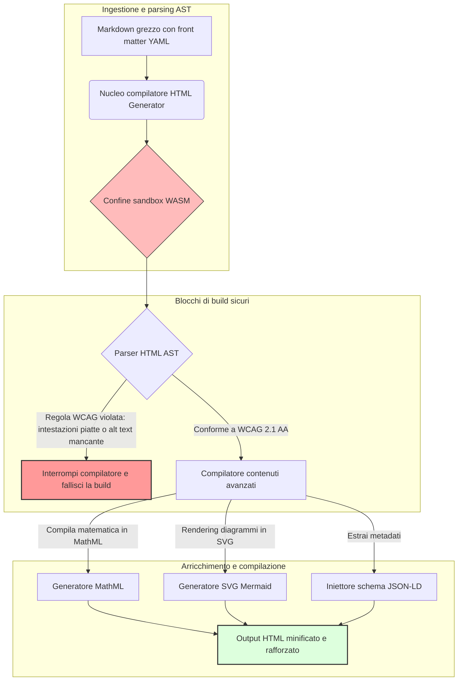

---

# Front Matter (YAML)

author: "contact@sebastienrousseau.com (Sebastien Rousseau)"
banner_alt: "Geometria architettonica sotto luce strutturata — simbolo del ruolo di HTML Generator come pipeline Markdown-to-HTML con controllo compilativo per una pubblicazione accessibile, ottimizzata per SEO e in ambiente sandbox"
banner_height: "1597"
banner_width: "2584"
banner: "https://cloudcdn.pro/stocks/images/ricardo-gomez-angel-IGPmtHvbe2g-unsplash.webp"
cdn: "https://cloudcdn.pro"
charset: "UTF-8"
cname: "sebastienrousseau.com"
copyright: "© Copyright 2025 - 2026 - Sebastien Rousseau. All rights reserved."
date: "June 20, 2026"
description: "HTML Generator è una libreria Rust che converte Markdown in HTML conforme a WCAG, ottimizzato per SEO e arricchito con JSON-LD — accessibilità-as-code, supporto MathML e Mermaid, esecuzione in sandbox WebAssembly per la pubblicazione enterprise in sicurezza."
format-detection: "telephone=no"
hreflang: "it"
icon: "https://cloudcdn.pro/clients/sebastienrousseau/v1/logos/sebastienrousseau.svg"
id: "https://sebastienrousseau.com/2026-06-20-html-generator-accessible-seo-structured-markdown-rust-2026"
image_alt: "Ritratto in bianco e nero di Sebastien Rousseau"
image_height: "162"
image_width: "162"
image: "https://cloudcdn.pro/stocks/images/sebastien-rousseau.png"
keywords: "html-generator, Rust Markdown in HTML, accessibilità as code, WCAG 2.1 AA, HTML ottimizzato SEO, JSON-LD, MathML, Mermaid, WebAssembly, EAA, DORA, ADA Title III, pubblicazione accessibile, parsing in sandbox, open source"
language: "it-IT"
last_reviewed: "2026-06-20"
layout: "report"
locale: "it_IT"
logo_alt: "Logo di Sebastien Rousseau"
logo_height: "44"
logo_width: "44"
logo: "https://cloudcdn.pro/clients/sebastienrousseau/v1/logos/sebastienrousseau.svg"
menu: ""
measurementID: "G-169G4ET5HQ"
name: "Sebastien Rousseau"
permalink: "https://sebastienrousseau.com/2026-06-20-html-generator-accessible-seo-structured-markdown-rust-2026"
rating: "general"
referrer: "no-referrer"
robots: "index, follow"
schema: "FAQPage, Article"
seo_title: "Accessibilità-as-Code: da Markdown a HTML AAA con Rust nel 2026"
short_name: "sebastienrousseau"
subtitle: "Trasformare la pubblicazione web aziendale, la documentazione di prodotto e i portali clienti da file di testo non accessibili in asset digitali altamente strutturati, conformi e in ambiente sandbox."
tags: "html-generator, Rust, Markdown, accessibilità, WCAG, SEO, JSON-LD, MathML, Mermaid, WebAssembly, EAA, DORA, ADA, AI-discovery, RAG, open source, infrastruttura bancaria"
theme-color: "0, 83, 191"
title: "Convertire Markdown in HTML Accessibile, SEO-Ready e Strutturato con Rust nel 2026"
url: "https://sebastienrousseau.com/2026-06-20-html-generator-accessible-seo-structured-markdown-rust-2026"
viewport: "width=device-width, initial-scale=1, shrink-to-fit=no"

# RSS - The RSS feed front matter (YAML).
atom_link: "https://sebastienrousseau.com/2026-06-20-html-generator-accessible-seo-structured-markdown-rust-2026/rss.xml"
category: "Technology"
docs: https://validator.w3.org/feed/docs/rss2.html
generator: "Static Site Generator (SSG) (version 0.0.40)"
item_description: "HTML Generator è una libreria Rust che converte Markdown in HTML conforme a WCAG, ottimizzato per SEO e arricchito con JSON-LD — accessibilità-as-code, supporto MathML e Mermaid, esecuzione in sandbox WebAssembly per la pubblicazione enterprise in sicurezza."
item_guid: "https://sebastienrousseau.com/2026-06-20-html-generator-accessible-seo-structured-markdown-rust-2026/rss.xml"
item_link: "https://sebastienrousseau.com/2026-06-20-html-generator-accessible-seo-structured-markdown-rust-2026/rss.xml"
item_pub_date: "Sat, 20 Jun 2026 06:06:06 +0000"
item_title: "Convertire Markdown in HTML Accessibile, SEO-Ready e Strutturato con Rust nel 2026"
last_build_date: "Sat, 20 Jun 2026 06:06:06 +0000"
managing_editor: "contact@sebastienrousseau.com (Sebastien Rousseau)"
pub_date: "Sat, 20 Jun 2026 06:06:06 +0000"
ttl: "60"
type: "article"
webmaster: "contact@sebastienrousseau.com"

# Apple - The Apple front matter (YAML).
apple_mobile_web_app_orientations: "portrait"
apple_touch_icon_sizes: "192x192"
apple-mobile-web-app-capable: "yes"
apple-mobile-web-app-status-bar-inset: "black"
apple-mobile-web-app-status-bar-style: "black-translucent"
apple-mobile-web-app-title: "Da Markdown a HTML AAA con Rust"
apple-touch-fullscreen: "yes"

# MS Application - The MS Application front matter (YAML).

msapplication-navbutton-color: "0, 83, 191"

# Twitter Card - The Twitter Card front matter (YAML).

twitter_card: "summary_large_image"
twitter_creator: "@wwdseb"
twitter_description: "HTML Generator è una libreria Rust che converte Markdown in HTML conforme a WCAG, ottimizzato per SEO e arricchito con JSON-LD — accessibilità-as-code, supporto MathML e Mermaid, esecuzione in sandbox WebAssembly per la pubblicazione enterprise in sicurezza."
twitter_image: "https://cloudcdn.pro/clients/sebastienrousseau/v1/logos/sebastienrousseau.svg"
twitter_image_alt: "Logo di Sebastien Rousseau"
twitter_site: "@wwdseb"
twitter_title: "Accessibilità-as-Code: da Markdown a HTML AAA con Rust"
twitter_url: "https://sebastienrousseau.com/2026-06-20-html-generator-accessible-seo-structured-markdown-rust-2026"

# Humans.txt - The Humans.txt front matter (YAML).
author_website: "https://sebastienrousseau.com"
author_twitter: "@wwdseb"
author_location: "London, UK"
thanks: "Grazie per la lettura!"
site_last_updated: "2026-06-20"
site_standards: "HTML5, CSS3, RSS, Atom, JSON, XML, YAML, Markdown, TOML"
site_components: "Kaishi, Kaishi Builder, Kaishi CLI, Kaishi Templates, Kaishi Themes"
site_software: "Static Site Generator, Rust"

---

# Convertire Markdown in HTML Accessibile, SEO-Ready e Strutturato con Rust nel 2026

<!-- lead-start -->
<aside class="post-lead" aria-label="Sintesi dell'articolo">

<strong>TL;DR.</strong> HTML Generator è un compilatore Markdown-to-HTML in puro Rust che impone WCAG 2.1 AA in fase di compilazione, inietta JSON-LD conforme agli schemi, esegue il rendering nativo di MathML e SVG Mermaid, e isola il parsing in una sandbox WebAssembly — trasformando la pubblicazione in un piano di controllo compilativo per accessibilità, SEO e sicurezza ICT.

<strong>Punti chiave</strong>

<ul class="post-lead-takeaways">
  <li><strong>Risposta rapida.</strong> Cos'è HTML Generator in una frase?</li>
  <li><strong>Sintesi esecutiva.</strong> Il rendering Markdown sembra banale; produrre HTML di qualità editoriale è un problema di conformità.</li>
  <li><strong>01. Perché un compilatore HTML accessibility-first è rilevante nel 2026.</strong> EAA e ADA Title III hanno spostato l'accessibilità dall'igiene ingegneristica alla responsabilità fiduciaria.</li>
  <li><strong>02. La visione architetturale di HTML Generator nel 2026.</strong> Una pipeline multi-stadio con controllo compilativo dal Markdown grezzo all'output HTML rafforzato.</li>
</ul>

<strong>Letture correlate:</strong> <a href="https://sebastienrousseau.com/2026-06-18-noyalib-safe-yaml-rust-ai-mcp-financial-infrastructure-2026">Perché YAML richiede uno stack Rust più sicuro per AI, MCP e infrastruttura finanziaria nel 2026</a>, <a href="https://sebastienrousseau.com/2026-06-17-static-site-generator-secure-default-ai-era-publishing-2026">Un Static Site Generator sicuro per impostazione predefinita per la pubblicazione nell'era AI nel 2026</a>, <a href="https://sebastienrousseau.com/2026-06-11-cloudcdn-open-source-blueprint-ai-native-edge-2026">CloudCDN: un modello open source per l'edge AI-native nel 2026</a>.

</aside>
<!-- lead-end -->

Nel 2026, i contenuti web vengono consumati tanto da crawler di ricerca AI, motori di ricerca basati su LLM e pipeline di Retrieval-Augmented Generation (RAG) quanto dai lettori umani. L'HTML piatto o malformato compromette la leggibilità automatica, mentre il mancato rispetto di normative globali stringenti come l'[European Accessibility Act (EAA)](https://www.accessibility-act.eu/) e l'[US ADA Title III](https://www.ada.gov/topics/title-iii/) costituisce oggi una responsabilità civile inequivocabile. [HTML Generator](https://github.com/sebastienrousseau/html-generator) è una libreria Rust ad alte prestazioni progettata per colmare queste lacune — a livello di compilatore, non con patch post-deployment.

## Risposta rapida

**Cos'è HTML Generator in una frase?** HTML Generator è un compilatore Markdown-to-HTML open source in puro Rust che impone [WCAG 2.1 AA](https://www.w3.org/TR/WCAG21/) in fase di compilazione, genera automaticamente landmark semantici e attributi ARIA, inietta metadati [JSON-LD](https://json-ld.org/) conformi agli schemi a partire da front matter YAML, esegue il rendering di diagrammi Mermaid e formule matematiche in SVG accessibile e MathML, e opera all'interno di una sandbox [WebAssembly](https://webassembly.org/) — trasformando la pubblicazione aziendale in un piano di controllo compilativo di livello fiduciario.

## Sintesi esecutiva

Il rendering Markdown sembra banale. L'HTML di qualità editoriale è un problema di conformità. Nel giugno 2026, ogni touchpoint aziendale — portali per le relazioni con gli investitori, comunicazioni regolamentari, documentazione clienti, riferimenti API, estate di marketing — viene analizzato sia da esseri umani sia da macchine. Due pressioni si scontrano su ogni pagina: [EAA](https://www.accessibility-act.eu/) e [ADA Title III](https://www.ada.gov/topics/title-iii/) rendono l'accessibilità un'esposizione legale a livello di consiglio di amministrazione, mentre l'ingestione AI e le pipeline RAG premiano l'output strutturato e leggibile dalle macchine. Le librerie Markdown standard producono HTML piatto che non supera nessuno dei due controlli. HTML Generator tratta la generazione di documenti come una pipeline con controllo compilativo: la validazione WCAG è un errore di build, il JSON-LD proviene dal front matter YAML senza annotazioni manuali, MathML e Mermaid eseguono il rendering in modo accessibile, e l'intero motore viene distribuito come target WebAssembly così che il parsing di documenti non attendibili resti isolato dall'host.

## Punti chiave

- **L'accessibilità-as-code è il nuovo standard di base.** L'EAA impone l'accessibilità per i servizi digitali destinati ai consumatori. HTML Generator valuta l'albero del documento in fase di compilazione, generando automaticamente landmark semantici e attributi ARIA — meno correzioni post-deployment, meno budget di remediation, nessun testo alternativo mancante in produzione.
- **Dati strutturati per la scoperta AI.** La ricerca moderna e le pipeline RAG dipendono da metadati leggibili dalle macchine. Il compilatore analizza il front matter YAML e inietta [JSON-LD conforme a Schema.org](https://schema.org/) direttamente nell'intestazione del documento, rendendo i contenuti pienamente interpretabili da [Google Rich Results](https://developers.google.com/search/docs/appearance/structured-data/intro-structured-data), [Bing Webmaster](https://www.bing.com/webmasters) e crawler basati su LLM.
- **Eccellenza nei contenuti tecnici.** La pubblicazione tecnica non è testo piatto. HTML Generator compila le estensioni matematiche Markdown grezze in [MathML](https://www.w3.org/Math/) accessibile ed esegue il rendering dei diagrammi [Mermaid.js](https://mermaid.js.org/) in SVG responsivo — preservando entrambi la struttura conforme a WCAG anziché degradarsi a immagini opache.
- **Sandbox WebAssembly.** Il parsing di Markdown non attendibile è un rischio di sicurezza. Puntando a [WASM](https://webassembly.org/), HTML Generator esegue all'interno di una sandbox isolata che impedisce l'esecuzione arbitraria di codice e protegge il sistema host — soddisfacendo direttamente gli obblighi di sicurezza ICT previsti dall'[articolo 6 di DORA](https://eur-lex.europa.eu/legal-content/EN/TXT/?uri=CELEX%3A32022R2554).
- **Protezione fiduciaria per i consigli di amministrazione.** La non conformità tecnica è entrata nelle sale del consiglio. Standardizzare su un motore HTML con controllo compilativo protegge amministratori e alta dirigenza dall'esposizione civile e regolamentare personale ai sensi di DORA, EAA e ADA Title III.

**Letture correlate:** [Perché YAML richiede uno stack Rust più sicuro per AI, MCP e infrastruttura finanziaria nel 2026](https://sebastienrousseau.com/2026-06-18-noyalib-safe-yaml-rust-ai-mcp-financial-infrastructure-2026/), [Un Static Site Generator sicuro per impostazione predefinita per la pubblicazione nell'era AI nel 2026](https://sebastienrousseau.com/2026-06-17-static-site-generator-secure-default-ai-era-publishing-2026/), [CloudCDN: un modello open source per l'edge AI-native nel 2026](https://sebastienrousseau.com/2026-06-11-cloudcdn-open-source-blueprint-ai-native-edge-2026/).

## 01. Perché un Compilatore HTML Accessibility-First è Rilevante nel 2026

Le estate web aziendali, le librerie di documentazione e i centri di assistenza ai prodotti sono touchpoint digitali critici. Sono ora soggetti a due pressioni intense e convergenti.

La prima è l'**ingestione AI e la scopribilità**. I contenuti vengono sempre più elaborati da modelli linguistici di grandi dimensioni e pipeline di Retrieval-Augmented Generation. L'HTML piatto o malformato genera confusione nell'analisi dei crawler, rendendo la ricerca aziendale e la documentazione invisibili ai paradigmi di ricerca moderni — inclusi [Google Search Generative Experience](https://blog.google/products/search/generative-ai-search/), la navigazione di [ChatGPT](https://chat.openai.com/) e gli agenti RAG enterprise.

La seconda è la **normativa globale sull'accessibilità**. Ai sensi dell'[European Accessibility Act](https://www.accessibility-act.eu/) (pienamente applicabile dal giugno 2025) e dell'[US ADA Title III](https://www.ada.gov/topics/title-iii/), le piattaforme di pubblicazione aziendale devono garantire l'accessibilità digitale completa. Il mancato rispetto di [WCAG 2.1 AA](https://www.w3.org/TR/WCAG21/) non è più una mancanza ingegneristica; è una responsabilità civile e regolamentare che ha generato accordi extragiudiziali da milioni di dollari.

[HTML Generator](https://github.com/sebastienrousseau/html-generator) risponde direttamente a entrambe le pressioni. È una libreria Rust thread-safe progettata per trasformare Markdown in HTML accessibile, ottimizzato per SEO e strutturato. Trattando la generazione di documenti come una pipeline con controllo compilativo, il motore produce un elevato **Return on Resilience (RoR)** — proteggendo i bilanci dai contenziosi sull'accessibilità e massimizzando la leggibilità automatica per la scoperta AI.

## 02. La Visione Architetturale di HTML Generator nel 2026

Il framework è progettato come una pipeline di compilazione sicura e multi-stadio che converte testo Markdown grezzo in asset statici altamente accessibili e verificati crittograficamente.

### Tabella 1: livelli architetturali di HTML Generator e mitigazione del rischio

| Livello | Decisione progettuale | Perché è rilevante | Rischio in caso di gestione inadeguata |
| ---- | ---- | ---- | ---- |
| **Livello di input** | Parser Markdown con front matter YAML | Incontra i redattori nel loro ambiente naturale; separa la prosa dai metadati strutturali. | Metadati incoerenti, sitemap non funzionanti, lacune nell'indicizzazione. |
| **Livello strutturale** | Sommario automatico e landmark semantici con tag ARIA | Produce alberi documentali navigabili e accessibili per costruzione. | HTML piatto che compromette i lettori di schermo e viola WCAG. |
| **Livello contenuti avanzati** | Rendering nativo MathML e SVG Mermaid.js | Compila formule e diagrammi in SVG accessibile e MathML. | Ritardo di rendering JS lato client e output non funzionante per le tecnologie assistive. |
| **Livello SEO e dati** | Generazione integrata JSON-LD e metadati strutturati | Inietta JSON-LD conforme a [Schema.org](https://schema.org/) direttamente nell'intestazione. | Motori di ricerca e crawler AI che fraintendono autore, contesto e licenza. |
| **Livello runtime** | Compilatore Rust nativo con target WebAssembly | Abilita l'esecuzione sicura e in sandbox su server, nodi edge e browser. | Esecuzione arbitraria di codice durante il parsing di Markdown non attendibile. |

## 03. Segnali Chiave di Sicurezza Web e Accessibilità

Per verificare che gli asset di pubblicazione pubblici soddisfino i requisiti normativi e di sicurezza moderni, i responsabili tecnologici senior devono monitorare metriche specifiche e quantificabili.

### Tabella 2: segnali di sicurezza web e accessibilità

| Segnale | Metrica / benchmark operativo | Riferimento EAA / DORA / W3C | Implementazione tecnica |
| ---- | ---- | ---- | ---- |
| **Conformità accessibilità** | 100% delle pagine compilate validate rispetto alle regole WCAG 2.1 AA. | [EAA](https://www.accessibility-act.eu/) e [ADA Title III](https://www.ada.gov/topics/title-iii/) | Parser HTML in fase di build che valuta tag alt delle immagini e landmark semantici. |
| **Sandbox di esecuzione WASM** | 100% degli input Markdown non attendibili compilati in un runtime WebAssembly isolato. | [Articolo 6 DORA](https://eur-lex.europa.eu/legal-content/EN/TXT/?uri=CELEX%3A32022R2554) (sicurezza ICT) | Isolamento dell'ambiente di parsing dal server host. |
| **Copertura metadati strutturati** | 100% degli articoli pubblicati con intestazioni JSON-LD valide e conformi agli schemi. | Specifiche [Schema.org](https://schema.org/) | Parsing automatico del front matter e conversione in oggetti JSON-LD. |
| **Throughput di compilazione** | Target pagine al secondo superiore a 10.000 su hardware commodity. | Return on Resilience (RoR) | Compilatore Rust AST altamente parallelizzato. |
| **Verifica rich snippet** | Zero errori di parsing su [Google Rich Results](https://search.google.com/test/rich-results) e [Schema validator](https://validator.schema.org/). | Linee guida Google Search | Validazione strutturale del JSON-LD generato durante la pipeline di build. |

## 04. Il Mito del Semplice Rendering Markdown

Un malinteso comune tra i responsabili tecnologici è che la conversione da Markdown a HTML sia un semplice esercizio di sostituzione testuale. Molte librerie standard traducono la formattazione Markdown in HTML piatto e non strutturato. L'output viene visualizzato correttamente da un utente vedente nel browser, ma rappresenta una trappola di conformità.

L'HTML piatto tipicamente manca di tre elementi.

1. **Gerarchie di intestazioni corrette.** Il Markdown standard non impone l'ordine delle intestazioni. Passare da un `<h1>` a un `<h4>` viola WCAG 2.1 AA e compromette la navigazione del documento per i lettori di schermo.
2. **Semantica esplicita delle tabelle.** Le tabelle Markdown standard raramente vengono rese con gli attributi `<th>` scope e `<tbody>` corretti richiesti per il parsing accessibile.
3. **Metadati leggibili dalle macchine.** L'HTML standard manca degli hook JSON-LD da cui dipendono i moderni motori di ricerca AI e i sistemi di ingestione RAG.

HTML Generator risolve questo problema analizzando il Markdown in un **Abstract Syntax Tree (AST)**. Il motore valuta la struttura del documento prima di emettere HTML, convalidando la gerarchia delle intestazioni, iniettando gli attributi ARIA appropriati e verificando che ogni asset multimediale rechi testo alternativo — trasformando l'accessibilità da un controllo manuale in un invariante garantito in fase di compilazione.

## 05. Progettare una Pipeline di Build Accessibilità-as-Code

Per evitare che asset non accessibili o non indicizzabili raggiungano mai il deployment pubblico, l'accessibilità deve essere un blocco di compilazione rigoroso. La pipeline seguente mostra come HTML Generator valuta il Markdown, esegue la validazione isolata in WebAssembly ed emette HTML rafforzato e strutturato.

## 06. Il Playbook per il Consiglio di Amministrazione e la Responsabilità Fiduciaria

La conformità in materia di accessibilità e sicurezza web sono questioni imprescindibili per i consigli di amministrazione. L'alta dirigenza deve affrontare l'infrastruttura di pubblicazione attraverso la lente del rischio legale, della salvaguardia finanziaria e dell'esposizione regolamentare.

- **L'European Accessibility Act (EAA).** Impone mandati di conformità legalmente vincolanti sui portali digitali pubblici e privati. La non conformità può produrre gravi sanzioni finanziarie, contenziosi civili e il ritiro immediato dell'asset dal mercato europeo. Integrando l'accessibilità-as-code, i consigli possono certificare che il codice non conforme non può essere distribuito — convertendo la remediation reattiva in uno scudo legale strutturale.
- **Articolo 6 DORA (Ambienti ICT sicuri).** Stabilisce regole stringenti per la sicurezza degli ambienti ICT. Isolando la compilazione Markdown all'interno di una sandbox WebAssembly, le organizzazioni garantiscono che il parsing della documentazione caricata da clienti o di feed partner non possa esporre i server host a esecuzioni arbitrarie di codice, proteggendo i portali bancari critici.
- **Riduzione dei costi di conformità.** La conformità tradizionale all'accessibilità si basa su costosi audit retrospettivi post-deployment — decine di migliaia di euro all'anno per sito. Implementare la validazione WCAG come blocco in fase di compilazione elimina tali costi retrospettivi, spostando il budget di conformità dalla difesa all'innovazione.

## 07. Implicazioni per Tipo di Banca e Impresa

### Global Systemically Important Banks (G-SIB)

Le G-SIB gestiscono estate pubbliche multilingue di grandi dimensioni che pubblicano migliaia di ricerche, comunicazioni regolamentari e documenti per le relazioni con gli investitori in più giurisdizioni. La loro sfida è la scala e la parità multilingue. Il target WebAssembly di HTML Generator e il motore Rust ad alto throughput consentono di aggiornare, compilare e distribuire globalmente librerie di ricerca localizzate su vasta scala in pochi secondi — senza ritardi di rendering né regressioni di accessibilità.

### Banche di Transazione e Aziendali

Per le banche di transazione, i portali clienti, gli hub di documentazione e le guide per le API dei developer sono touchpoint digitali critici. Compilare tali asset attraverso HTML Generator significa che i canali rivolti ai clienti non presentano esposizioni XSS, vettori di dependency hijack né deficit di accessibilità — preservando la fiducia istituzionale e riducendo la superficie di contenzioso.

### Banche Regionali e Fintech

Le banche regionali e le fintech agili competono sull'esperienza digitale senza i budget ingegneristici delle G-SIB. HTML Generator fornisce a questi team una pipeline di pubblicazione di livello enterprise già pronta all'uso, consentendo alle estate più piccole di distribuire asset accessibili, ottimizzati per SEO e in sandbox che resistono al vaglio sia dei regolatori sia dei potenziali clienti aziendali.

## 08. La Roadmap per l'Infrastruttura di Pubblicazione

Le estate web aziendali pubbliche sono una componente fondamentale della resilienza operativa. Affidarsi a motori web lenti, vulnerabili dinamicamente e basati su database — o ad asset statici non firmati — è un rischio aziendale inaccettabile.

Per proteggere i touchpoint digitali pubblici e salvaguardare i bilanci dai contenziosi sull'accessibilità, i responsabili tecnologici e della sicurezza senior devono eseguire una roadmap chiara.

1. **Transizione verso architetture statiche.** Dismettere le piattaforme CMS dinamiche legacy per estate di ricerca, marketing e documentazione. Spostare i contenuti in pipeline con controllo compilativo come HTML Generator.
2. **Imporre l'accessibilità in fase di compilazione.** Implementare l'accessibilità-as-code. Interrompere automaticamente le pipeline di compilazione per qualsiasi violazione WCAG 2.1 AA.
3. **Isolare il parsing in WebAssembly.** Isolare in sandbox tutto il parsing di documenti e contenuti all'interno di un runtime WASM in modo che gli input non attendibili non tocchino mai i sistemi host.
4. **Iniettare metadati JSON-LD strutturati.** Garantire che ogni asset pubblicato rechi intestazioni JSON-LD conformi agli schemi per massimizzare la scopribilità AI.

## 09. Domande Frequenti

**Come impone HTML Generator l'accessibilità?**

Analizza l'Abstract Syntax Tree HTML generato in fase di build, valutando il documento rispetto alle regole [WCAG 2.1 AA](https://www.w3.org/TR/WCAG21/). Se una regola viene violata — un attributo alt mancante, un salto di intestazione, un controllo di modulo senza etichetta — il compilatore interrompe la build, trattando l'accessibilità come un invariante in fase di compilazione anziché come un'attività di audit post-deployment.

**Perché l'isolamento WebAssembly è importante?**

[WebAssembly](https://webassembly.org/) consente al motore di parsing Markdown di eseguire all'interno di una sandbox isolata, segregata dal server host. Anche quando un attore ostile carica un documento Markdown artefatto progettato per sfruttare vulnerabilità del parser, l'esecuzione viene contenuta — proteggendo i sistemi host e soddisfacendo gli obblighi di sicurezza ICT previsti dall'articolo 6 DORA.

**In che modo JSON-LD migliora la scopribilità nella ricerca nel 2026?**

[JSON-LD](https://json-ld.org/) fornisce metadati strutturati e leggibili dalle macchine nell'intestazione del documento. [Google Rich Results](https://developers.google.com/search/docs/appearance/structured-data/intro-structured-data), i crawler Bing e gli agenti di ricerca basati su LLM identificano immediatamente autore, licenza, data di pubblicazione e contesto semantico — bypassando l'ambiguità dell'HTML standard e aumentando la visibilità nella scoperta guidata da AI.

**A chi è destinato HTML Generator?**

Costruttori di siti statici, team di documentazione, redattori tecnici, sviluppatori Rust e ingegneri di piattaforma che distribuiscono estate critiche per l'accessibilità o destinate a regolatori. È anche un livello di elaborazione dei contenuti valido all'interno di pipeline di pubblicazione sicura più ampie come [Static Site Generator (SSG)](https://github.com/sebastienrousseau/static-site-generator).

## 10. Riferimenti

- World Wide Web Consortium (W3C), 2024. [Linee guida per l'accessibilità dei contenuti web (WCAG) 2.1 ⧉](https://www.w3.org/TR/WCAG21/ "Web Content Accessibility Guidelines 2.1").
- Schema.org, 2026. [Specifiche dati strutturati Schema.org ⧉](https://schema.org/ "Schema.org structured-data specifications").
- Parlamento europeo e Consiglio dell'Unione europea, 2022. [Regolamento (UE) 2022/2554 sulla resilienza operativa digitale del settore finanziario (DORA) ⧉](https://eur-lex.europa.eu/legal-content/EN/TXT/?uri=CELEX%3A32022R2554 "DORA Regulation").
- Commissione europea, 2025. [European Accessibility Act ⧉](https://www.accessibility-act.eu/ "European Accessibility Act").
- Dipartimento di Giustizia degli Stati Uniti, 2024. [ADA Title III ⧉](https://www.ada.gov/topics/title-iii/ "ADA Title III").
- WebAssembly Community Group, 2026. [Specifica WebAssembly ⧉](https://webassembly.org/ "WebAssembly").
- GitHub, 2026. [Repository HTML Generator ⧉](https://github.com/sebastienrousseau/html-generator "HTML Generator open-source repository").

<!-- enrich-start -->
<aside class="author-card" aria-label="Informazioni sull'autore"><strong class="author-card-name"><a href="/about/index.html">Sebastien Rousseau</a></strong>Tecnologo bancario senior con specializzazione in AI applicata, infrastrutture di pagamento, moneta tokenizzata, ISO 20022, sicurezza post-quantistica, servizi finanziari cloud-native, infrastruttura open source e mercati digitali regolamentati.Oltre 20 anni di esperienza tra HSBC Commercial &amp; Investment Bank, PayPal, Barclays, Shazam, AKQA, Virgin Group. <a href="/about/index.html">Profilo completo</a> &middot; <a href="https://www.linkedin.com/in/sebastienrousseau/" rel="external noopener">LinkedIn</a> &middot; <a href="https://github.com/sebastienrousseau" rel="external noopener">GitHub</a></aside>

Ultima revisione <time datetime="2026-06-20">2026-06-20</time>.

<!-- enrich-end -->
