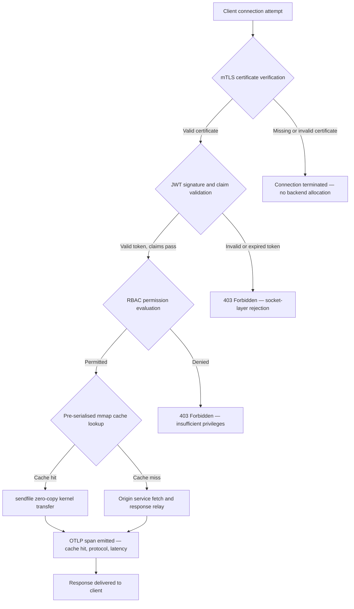

---

# Front Matter (YAML)

author: "contact@sebastienrousseau.com (Sebastien Rousseau)"
banner_alt: "Paesaggio urbano astratto a circuiti stampati di notte — che visualizza il margine bancario dove i trasferimenti zero-copy a livello kernel, gli handshake mTLS e la validazione JWT convergono in un singolo binario collegato staticamente"
banner_height: "1597"
banner_width: "2584"
banner: "https://cloudcdn.pro/stocks/images/bit-cloud-GlqbGLCPnQ4.webp"
cdn: "https://cloudcdn.pro"
charset: "UTF-8"
cname: "sebastienrousseau.com"
copyright: "© Copyright 2025 - 2026 - Sebastien Rousseau. All rights reserved."
date: "June 20, 2026"
description: "http-handle è un binario Rust collegato staticamente che eroga 180.000 richieste al secondo al margine bancario con zero dipendenze runtime, validazione mTLS e JWT integrata, HTTP/2 e HTTP/3 negoziati da ALPN, e osservabilità OTLP — colmando le lacune di sicurezza e resilienza che Nginx ed Envoy lasciano aperte."
format-detection: "telephone=no"
hreflang: "it"
icon: "https://cloudcdn.pro/clients/sebastienrousseau/v1/logos/sebastienrousseau.svg"
id: "https://sebastienrousseau.com/2026-06-20-http-handle-zero-dependency-edge-ingress-banking-rust-2026"
image_alt: "Ritratto in bianco e nero di Sebastien Rousseau"
image_height: "162"
image_width: "162"
image: "https://cloudcdn.pro/stocks/images/sebastienrousseau.webp"
keywords: "http-handle, ingress edge Rust, proxy senza dipendenze, infrastruttura bancaria, mTLS JWT, sendfile zero-copy, ALPN HTTP3, conformità DORA, Basilea III, osservabilità OTLP, binario statico, banking ARM64, zero trust banking, ingress leggero, sicurezza banking Rust"
language: "it-IT"
last_reviewed: "2026-06-20"
layout: "report"
locale: "it_IT"
logo_alt: "Logo di Sebastien Rousseau"
logo_height: "44"
logo_width: "44"
logo: "https://cloudcdn.pro/clients/sebastienrousseau/v1/logos/sebastienrousseau.svg"
menu: ""
measurementID: "G-169G4ET5HQ"
name: "Sebastien Rousseau"
permalink: "https://sebastienrousseau.com/2026-06-20-http-handle-zero-dependency-edge-ingress-banking-rust-2026"
rating: "general"
referrer: "no-referrer"
robots: "index, follow"
schema: "FAQPage, Article"
seo_title: "http-handle: Ingress Rust Senza Dipendenze per il Banking a 180k req/s"
short_name: "sebastienrousseau"
subtitle: "Come un singolo binario Rust collegato staticamente eroga 180.000 richieste al secondo con mTLS, JWT e ALPN al margine bancario — e cosa significa per la conformità DORA e Basilea III."
tags: "http-handle, Rust, banking, edge-ingress, mTLS, JWT, ALPN, HTTP3, DORA, Basel-III, zero-copy, sendfile, ARM64, zero-trust, OTLP, observability, open-source, infrastructure"
theme-color: "0, 83, 191"
title: "http-handle: Ingress Edge ad Alta Prestazione Senza Dipendenze per il Banking nel 2026"
url: "https://sebastienrousseau.com/2026-06-20-http-handle-zero-dependency-edge-ingress-banking-rust-2026"
viewport: "width=device-width, initial-scale=1, shrink-to-fit=no"

# RSS - The RSS feed front matter (YAML).
atom_link: "https://sebastienrousseau.com/2026-06-20-http-handle-zero-dependency-edge-ingress-banking-rust-2026/rss.xml"
category: "Technology"
docs: https://validator.w3.org/feed/docs/rss2.html
generator: "Static Site Generator (SSG) (version 0.0.40)"
item_description: "http-handle è un binario Rust collegato staticamente che eroga 180.000 richieste al secondo al margine bancario con zero dipendenze runtime, validazione mTLS e JWT integrata, HTTP/2 e HTTP/3 negoziati da ALPN, e osservabilità OTLP — colmando le lacune di sicurezza e resilienza che Nginx ed Envoy lasciano aperte."
item_guid: "https://sebastienrousseau.com/2026-06-20-http-handle-zero-dependency-edge-ingress-banking-rust-2026/rss.xml"
item_link: "https://sebastienrousseau.com/2026-06-20-http-handle-zero-dependency-edge-ingress-banking-rust-2026/rss.xml"
item_pub_date: "Sat, 20 Jun 2026 07:07:07 +0000"
item_title: "http-handle: Ingress Edge ad Alta Prestazione Senza Dipendenze per il Banking nel 2026"
last_build_date: "Sat, 20 Jun 2026 07:07:07 +0000"
managing_editor: "contact@sebastienrousseau.com (Sebastien Rousseau)"
pub_date: "Sat, 20 Jun 2026 07:07:07 +0000"
ttl: "60"
type: "article"
webmaster: "contact@sebastienrousseau.com"

# Apple - The Apple front matter (YAML).
apple_mobile_web_app_orientations: "portrait"
apple_touch_icon_sizes: "192x192"
apple-mobile-web-app-capable: "yes"
apple-mobile-web-app-status-bar-inset: "black"
apple-mobile-web-app-status-bar-style: "black-translucent"
apple-mobile-web-app-title: "Margine Bancario Senza Dipendenze"
apple-touch-fullscreen: "yes"

# MS Application - The MS Application front matter (YAML).

msapplication-navbutton-color: "0, 83, 191"

# Twitter Card - The Twitter Card front matter (YAML).

twitter_card: "summary_large_image"
twitter_creator: "@wwdseb"
twitter_description: "http-handle è un binario Rust collegato staticamente che eroga 180.000 richieste al secondo al margine bancario con zero dipendenze runtime, mTLS, JWT e osservabilità OTLP."
twitter_image: "https://cloudcdn.pro/clients/sebastienrousseau/v1/logos/sebastienrousseau.svg"
twitter_image_alt: "Logo of Sebastien Rousseau"
twitter_site: "@wwdseb"
twitter_title: "http-handle: Ingress Rust Senza Dipendenze per il Banking a 180k req/s"
twitter_url: "https://sebastienrousseau.com/2026-06-20-http-handle-zero-dependency-edge-ingress-banking-rust-2026"

# Humans.txt - The Humans.txt front matter (YAML).
author_website: "https://sebastienrousseau.com"
author_twitter: "@wwdseb"
author_location: "London, UK"
thanks: "Thanks for reading!"
site_last_updated: "2026-06-20"
site_standards: "HTML5, CSS3, RSS, Atom, JSON, XML, YAML, Markdown, TOML"
site_components: "Kaishi, Kaishi Builder, Kaishi CLI, Kaishi Templates, Kaishi Themes"
site_software: "Static Site Generator, Rust"

excerpt: "Il margine bancario ha un problema di dipendenze. Ogni istanza Nginx o Envoy che instrada il traffico tra un client e un servizio bancario centrale porta con sé un albero di dipendenze: build OpenSSL, moduli Lua, librerie gRPC e livelli container…"
---

# http-handle: Ingress Edge ad Alta Prestazione Senza Dipendenze per il Banking nel 2026

<!-- lead-start -->
<aside class="post-lead" aria-label="Sintesi dell'articolo">

<strong>TL;DR.</strong> http-handle è un binario Rust collegato staticamente che eroga 180.000 richieste al secondo al margine bancario con zero dipendenze runtime, validazione mTLS e JWT integrata, HTTP/2 e HTTP/3 negoziati da ALPN, e osservabilità OTLP — colmando le lacune di sicurezza e resilienza che Nginx ed Envoy lasciano aperte.

<strong>Punti chiave</strong>

<ul class="post-lead-takeaways">
  <li><strong>Risposta rapida.</strong> Cos'è http-handle in una frase?</li>
  <li><strong>Sintesi esecutiva.</strong> Le banche hanno utilizzato Nginx ed Envoy al loro margine per un decennio.</li>
  <li><strong>01. Il Problema del Proxy Pesante nel Banking.</strong> Nginx ed Envoy hanno costruito il margine di internet moderno.</li>
  <li><strong>02. La Lente Architetturale di http-handle 2026.</strong> Il binario è strutturato in cinque livelli interdipendenti, ciascuno progettato per eliminare una categoria specifica di rischio che le architetture proxy tradizionali accumulano.</li>
</ul>

<strong>Letture correlate:</strong> <a href="https://sebastienrousseau.com/2023-11-19-crystals-kyber-the-safeguarding-algorithm-in-a-quantum-age/index.html">CRYSTALS-Kyber: L'Algoritmo di Protezione nell'Era Quantistica</a>, <a href="https://sebastienrousseau.com/2026-06-20-html-generator-accessible-seo-structured-markdown-rust-2026">Trasformare Markdown in HTML Strutturato, Accessibile e SEO-Ready con Rust nel 2026</a>, <a href="https://sebastienrousseau.com/2026-06-12-kyberlib-post-quantum-banking-migration-standards-code-2026">KyberLib e la Migrazione Bancaria Post-Quantistica nel 2026: Dagli Standard al Codice</a>.

</aside>
<!-- lead-end -->

Il margine bancario ha un problema di dipendenze. Ogni istanza Nginx o Envoy che instrada il traffico tra un client e un servizio bancario centrale porta con sé un albero di dipendenze: build OpenSSL, moduli Lua, librerie gRPC e livelli container — ciascuno un potenziale CVE, ciascuno che richiede un ciclo di patching dedicato, ciascuno che aggiunge varianza di latenza che complica la misurazione degli SLA. Ai sensi del [Digital Operational Resilience Act (DORA)](https://eur-lex.europa.eu/eli/reg/2022/2554/oj), questa complessità è ora una responsabilità normativa tanto quanto operativa.

[http-handle](https://github.com/sebastienrousseau/http-handle) adotta un approccio diverso. È un singolo binario Rust collegato staticamente con zero dipendenze runtime oltre a `libc`. Eroga 180.000 richieste al secondo su nodi ARM64, applica TLS reciproco e autenticazione JWT al livello del socket di rete, e negozia HTTP/2 e HTTP/3 automaticamente — tutto in un'impronta di deployment inferiore a 20 MB di RAM.

## Risposta rapida

**Cos'è http-handle in una frase?** http-handle è un binario Rust open-source collegato staticamente che sostituisce i container proxy pesanti al margine bancario, erogando 180.000 req/s su ARM64 tramite trasferimenti kernel zero-copy Linux `sendfile(2)`, applicando mTLS, JWT e RBAC al livello socket prima che qualsiasi risorsa backend venga toccata, ed emettendo metriche [OpenTelemetry](https://opentelemetry.io/) native — con zero dipendenze di libreria runtime oltre a `libc`.

## Sintesi esecutiva

Le banche hanno utilizzato Nginx ed Envoy al loro margine per un decennio. Entrambi sono capaci; nessuno dei due è stato progettato per l'ambiente normativo del 2026. Le immagini container cariche di dipendenze generano code di CVE che i team di conformità non riescono a smaltire abbastanza rapidamente, e ogni aggiornamento di versione di libreria porta rischi di regressione. Gli Articoli 5 e 6 di DORA richiedono che il rischio ICT sia gestito per progettazione, non rattoppato dopo la scoperta. I framework di rischio operativo di Basilea III penalizzano le architetture dove i punti di guasto si moltiplicano con la complessità del sistema.

http-handle elimina il problema delle dipendenze alla fonte. Il binario è compilato una volta, staticamente, senza requisiti di libreria esterna a runtime. La superficie di attacco si riduce alla libreria standard Rust più `libc`. L'applicazione della sicurezza — verifica del certificato mTLS, validazione del claim JWT e controllo degli accessi basato sui ruoli — viene eseguita al socket di rete prima di qualsiasi allocazione backend, riducendo il perimetro Zero Trust alla sua espressione più piccola possibile. Le prestazioni seguono dall'architettura: i blocchi cache pre-serializzati mappati in memoria combinati con i trasferimenti kernel `sendfile(2)` rimuovono completamente i dati dal percorso di copia CPU-memoria, mantenendo 180.000 req/s su hardware ARM64. Il risultato è un livello di ingress che soddisfa i requisiti di resilienza DORA, supporta gli argomenti di riduzione del rischio operativo di Basilea III, e fornisce ai responsabili IT senior sotto SM&CR una catena di responsabilità verificabile a componente singolo per l'infrastruttura edge.

## Punti chiave

- **Binari più piccoli, code CVE più piccole.** Un singolo binario collegato staticamente ha un pacchetto da patchare, una release da validare e un artefatto da auditare. Nginx con un set di moduli standard viene distribuito con più di 30 dipendenze di librerie condivise; ciascuna porta il proprio ciclo di vita delle vulnerabilità.
- **Lo zero-copy non è un'ottimizzazione — è un vincolo di progettazione.** A 180.000 req/s, qualsiasi copia di dati nello user-space introduce varianza di latenza misurabile. `sendfile(2)` trasferisce i contenuti del descrittore di file al socket di rete interamente nello spazio kernel. Combinato con blocchi di cache di risposta fissati in mmap, la CPU non tocca mai il percorso dei dati per le risposte memorizzate nella cache.
- **Il perimetro di sicurezza appartiene al socket.** Validare JWT e certificati mTLS nel middleware applicativo significa che il backend ha già allocato thread e memoria prima che la richiesta venga rifiutata. La validazione a livello socket garantisce che le richieste non autenticate non consumino alcuna risorsa backend.
- **OTLP rimuove il gap di osservabilità.** L'integrazione OpenTelemetry nativa significa che ogni richiesta, ogni decisione di autenticazione e ogni negoziazione di protocollo produce telemetria strutturata senza un agente sidecar. I dashboard bancari esistenti ingeriscono direttamente i trace OTLP.

**Letture correlate:** [Perché YAML ha Bisogno di uno Stack Rust più Sicuro per AI, MCP e Infrastruttura Finanziaria nel 2026](https://sebastienrousseau.com/2026-06-18-noyalib-safe-yaml-rust-ai-mcp-financial-infrastructure-2026/), [CloudCDN: Un Blueprint Open-Source per l'Edge AI-Native nel 2026](https://sebastienrousseau.com/2026-06-11-cloudcdn-open-source-blueprint-ai-native-edge-2026/), [Migliore Architettura di Infrastruttura Cloud per Banche e Istituzioni Finanziarie nel 2026](https://sebastienrousseau.com/2026-05-16-best-cloud-infrastructure-architecture-2026/).

## 01. Il Problema del Proxy Pesante nel Banking

Nginx ed Envoy hanno costruito il margine di internet moderno. Sono configurabili, testati in battaglia e supportati da grandi community. Sono anche scelte architetturali fatte prima che DORA esistesse, prima che i framework di rischio operativo di Basilea III richiedessero una riduzione quantificabile della complessità, e prima che i nodi cloud ARM64 cambiassero l'economia del calcolo ad alto throughput.

La conseguenza pratica è un divario tra ciò di cui le banche hanno bisogno e ciò che i container proxy pesanti erogano.

**Superficie delle dipendenze.** Un deployment Envoy standard tira OpenSSL, Abseil, Protobuf, gRPC, Lua e dozzine di librerie secondarie. Ciascuna porta un ciclo CVE indipendente. Quando il National Vulnerability Database pubblica un advisory OpenSSL critico, ogni istanza Envoy nell'estate diventa un orologio di conformità: valuta, patcha, testa, ridistribuisci e ri-certifica — in ogni ambiente dove il binario è in esecuzione. Ai sensi dell'Articolo 6 di DORA, le banche devono dimostrare che i processi di gestione del rischio ICT sono proporzionati, documentati e verificabili. Un albero di dipendenze multi-libreria rende questa dimostrazione costosa da mantenere.

**Overhead di memoria.** Un processo worker Nginx configurato minimamente consuma 40–80 MB di memoria residente sotto carico moderato. Su scala — centinaia di nodi ingress tra sistemi di trading, API di pagamento e portali rivolti ai clienti — quell'overhead si accumula in un costo infrastrutturale misurabile senza alcun beneficio di prestazioni corrispondente rispetto a un'alternativa a binario singolo ben ingegnerizzata.

**Velocità di patching.** Le supply chain delle immagini container introducono un ritardo di più giorni tra la pubblicazione di un CVE e un patch validato che raggiunge la produzione. L'immagine base deve essere ricostruita, il livello applicativo ri-layerato, l'intera matrice di test rieseguita e la pipeline di deployment rieseguita. Per i sistemi bancari critici che operano sotto le finestre di segnalazione degli incidenti DORA, questo ciclo è un rischio strutturale.

http-handle affronta tutti e tre. Un binario. Una superficie CVE. Un artefatto da patchare. Meno di 20 MB di RAM per un nodo ingress di produzione.

## 02. La Lente Architetturale di http-handle 2026

Il binario è strutturato in cinque livelli interdipendenti, ciascuno progettato per eliminare una categoria specifica di rischio che le architetture proxy tradizionali accumulano.

### Tabella 1: Livelli architetturali di http-handle e mitigazione dei rischi

| Livello | Decisione di progettazione | Perché è importante | Rischio se mal gestito |
| ---- | ---- | ---- | ---- |
| **Core server** | Singolo binario Rust, collegato staticamente, zero dipendenze oltre a `libc` | Un artefatto da patchare; elimina la propagazione CVE delle librerie nell'estate | Attacchi di dependency confusion; accumulo di vulnerabilità delle librerie |
| **Motore di accelerazione** | Blocchi cache mmap pre-serializzati e trasferimenti kernel zero-copy `sendfile(2)` | 180.000 req/s su ARM64 con overhead proxy inferiore al millisecondo; nessun dato entra nello user space per le risposte memorizzate nella cache | Perdite di memory-mapping; colli di bottiglia nel kernel-space sotto invalidazione della cache |
| **Sicurezza crittografica** | mTLS nativo con supporto hot-reload dei certificati e negoziazione ALPN | Garantisce integrità dei dati e compatibilità del protocollo; rotazione dei certificati senza interruzioni delle connessioni | Scadenza del certificato che causa interruzioni del servizio; impostazioni predefinite della suite di cifratura deboli |
| **Piano dei criteri di accesso** | Validazione JWT a livello socket e valutazione dei claim RBAC | Le richieste non autenticate non consumano risorse backend; Zero Trust applicato al confine del kernel | Attacchi di algorithm confusion JWT; errori di configurazione RBAC che concedono accesso con privilegi eccessivi |
| **Osservabilità** | Integrazione [OpenTelemetry (OTLP)](https://opentelemetry.io/docs/specs/otlp/) nativa | Telemetria strutturata senza agenti sidecar; ingestione diretta negli estate di monitoraggio bancario esistenti | Punti ciechi durante le interruzioni; audit trail incompleti per la segnalazione degli incidenti DORA |

## 03. Segnali Chiave di Prestazione e Sicurezza

Le banche che operano http-handle al margine devono strumentare cinque segnali quantificabili per soddisfare i requisiti di segnalazione operativa DORA e la governance degli SLA interni.

### Tabella 2: Benchmark operativi e riferimenti normativi

| Segnale | Benchmark | Riferimento normativo | Implementazione tecnica |
| ---- | ---- | ---- | ---- |
| **Throughput** | ≥ 180.000 req/s su nodi ARM64 a P99 ≤ 1 ms overhead proxy | Basilea III rischio operativo — riduzione della complessità del sistema | `sendfile(2)` + blocchi cache pre-serializzati mmap; nessuna copia di dati nello user-space per i cache hit |
| **Superficie di attacco** | Zero dipendenze di libreria runtime; un artefatto binario per release | [Articolo 6 DORA](https://eur-lex.europa.eu/eli/reg/2022/2554/oj) — gestione del rischio ICT by design | Compilazione statica con `cargo build --release --target aarch64-unknown-linux-musl` |
| **Latenza di autenticazione** | Handshake mTLS + validazione JWT completati prima del primo byte della risposta backend | [Articolo 5 DORA](https://eur-lex.europa.eu/eli/reg/2022/2554/oj) — protezione della sicurezza ICT | Intercettazione a livello socket; valutazione del claim JWT in Rust adiacente al kernel prima del routing backend |
| **Disponibilità dei certificati** | Hot-reload dei certificati mTLS con zero connessioni interrotte durante la rotazione | Responsabilità del senior management SM&CR per la disponibilità del margine | Watcher dei certificati basato su inotify; swap atomico del file-descriptor durante il reload |
| **Copertura dell'osservabilità** | 100% delle richieste che producono span OTLP con esito dell'autenticazione, versione del protocollo e stato della cache | Articolo 17 DORA — rilevamento e segnalazione degli incidenti | Esportatore OTLP nativo; nessun sidecar richiesto; trasporto gRPC o HTTP/Protobuf configurabile |

## 04. Il Motore Zero-Copy: mmap e sendfile(2)

Le prestazioni di rete nel banking ad alta frequenza — pagamenti in tempo reale, API di dati di mercato, servizi di token di autenticazione — sono limitate da un vincolo più di qualsiasi altro: il costo di spostare i byte dall'archiviazione al socket di rete.

I server HTTP convenzionali leggono i contenuti dei file in un buffer nello user-space, quindi scrivono quel buffer nel socket. Quella sequenza richiede due copie di memoria e due context switch tra user space e kernel space per ogni risposta. A 180.000 richieste al secondo, l'overhead accumulato è sostanziale.

http-handle elimina entrambe le copie.

**Blocchi cache mappati in memoria.** Quando il servizio si avvia, serializza i contenuti di risposta statici in regioni mappate in memoria usando `mmap(2)`. Queste regioni sono fissate nella page cache del kernel. Quando arriva una richiesta per una risorsa memorizzata nella cache, la risposta è già mappata in memoria kernel — nessuna lettura da disco, nessuna allocazione di buffer.

**Trasferimento kernel `sendfile(2)`.** La system call Linux `sendfile(2)` trasferisce i dati direttamente da un file descriptor — o da una regione mappata in memoria — a un file descriptor del socket di rete, interamente all'interno del kernel. Nessun byte entra nello user space. Il ruolo della CPU si riduce all'emissione della system call e alla gestione dell'evento di completamento. Su nodi ARM64 con questa architettura, http-handle mantiene 180.000 req/s con overhead proxy inferiore al millisecondo sotto carico sostenuto.

Per le banche che eseguono riconciliazione batch di fine mese, reporting della liquidità infragiornaliera o traffico API di scoring antifrode in tempo reale, la conseguenza ingegneristica è diretta: meno nodi ARM64 per livello di traffico, costi infrastrutturali inferiori e rischio di resilienza DORA più piccolo da carenze di capacità.

## 05. Il Piano dei Criteri di Accesso mTLS e JWT

Nel banking, l'autenticazione al margine non è una funzionalità — è un requisito normativo. DORA impone che i controlli di sicurezza ICT siano proporzionati, documentati e verificabili. SM&CR pone la responsabilità personale per le decisioni di sicurezza dell'infrastruttura su senior manager nominati. La domanda non è se autenticare al margine, ma a quale livello.

http-handle applica una policy Zero Trust in tre fasi prima che qualsiasi risorsa backend venga allocata.

**Fase 1: Verifica del certificato client mTLS.** Durante l'handshake TLS, http-handle richiede e valida il certificato client rispetto a un trust store configurabile. Le connessioni senza un certificato valido terminano all'handshake. Nessun thread applicativo viene avviato, nessun pool di memoria viene allocato. Il backend non vede mai la richiesta.

**Fase 2: Validazione del claim JWT.** Per le connessioni che superano mTLS, http-handle estrae e valida il JSON Web Token dall'header `Authorization` al livello socket. La verifica della firma, i controlli di scadenza e la validazione dell'issuer avvengono prima che la richiesta raggiunga il livello di routing. Gli attacchi di algorithm confusion — dove un server accetta un algoritmo simmetrico quando ci si aspetta una chiave asimmetrica — sono bloccati dall'allow-listing esplicito degli algoritmi nella configurazione.

**Fase 3: Valutazione del claim RBAC.** I claim JWT validati vengono mappati su una tabella di ruoli in memoria. Le richieste che portano permessi insufficienti ricevono una risposta 403 nel piano dei criteri di accesso. Il servizio backend non viene mai invocato per il traffico non autorizzato.

Questa sequenza è importante operativamente. Nel modello tradizionale — dove l'autenticazione viene eseguita nel middleware applicativo — un attaccante può esaurire i pool di thread backend con richieste non autenticate prima che venga emesso un singolo rifiuto. L'autenticazione a livello socket collassa completamente quel vettore di attacco.

## 06. Routing ALPN e la Catena di Fallback HTTP/3

Il traffico bancario arriva su condizioni di rete diverse: fibra aziendale per i trading desk, 5G per i client di mobile banking, connettività satellitare per le operazioni remote e proxy di ispezione TLS in ambienti regolamentati. Un ingress a protocollo singolo crea un vincolo del minimo comune denominatore.

http-handle usa [Application-Layer Protocol Negotiation (ALPN)](https://www.rfc-editor.org/rfc/rfc7301) per selezionare automaticamente il protocollo ottimale per ogni connessione.

**HTTP/2** è il default per il traffico browser e API su TCP. I flussi multiplexati su una singola connessione eliminano il blocco head-of-line che HTTP/1.1 introduce sotto pattern di richieste concorrenti.

**HTTP/3 (QUIC)** si attiva quando la rete supporta UDP e il client annuncia `h3` nella sua estensione ALPN. Il multiplexing di flussi indipendente di QUIC e la migrazione delle connessioni lo rendono materialmente migliore per i client di mobile banking su reti cellulari congestionate dove le connessioni TCP cadono e si riconnettono frequentemente.

**Fallback graceful.** Se la negoziazione ALPN fallisce — perché un proxy intermedio rimuove l'estensione o un client legacy la omette — http-handle cade su HTTP/1.1 mantenendo tutti gli header di sicurezza, l'applicazione mTLS e la validazione JWT. Nessuna proprietà di sicurezza degrada durante il fallback del protocollo.

## 07. Il Ciclo di Vita della Richiesta Zero-Copy

Il diagramma seguente mostra il percorso completo della richiesta dalla connessione client alla consegna della risposta, inclusi i gate di autenticazione e i punti di emissione dell'osservabilità.

Il percorso critico per le risposte cache-hit attraversa tre gate di sicurezza e una system call. Nessun buffer nello user-space viene allocato per il corpo della risposta. Lo span OTLP cattura l'esito dell'autenticazione, la versione del protocollo negoziata da ALPN, lo stato della cache e la latenza end-to-end in un singolo record strutturato.

## 08. Allineamento Normativo: DORA, Basilea III e SM&CR

### Articoli 5 e 6 DORA — Gestione e protezione del rischio ICT

L'[Articolo 5 DORA](https://eur-lex.europa.eu/eli/reg/2022/2554/oj) richiede agli enti finanziari di mantenere framework di gestione del rischio ICT. L'Articolo 6 richiede loro di implementare misure di protezione e prevenzione proporzionate al profilo di rischio dei loro sistemi ICT.

Un singolo binario collegato staticamente soddisfa entrambi i requisiti in modo più efficiente di uno stack container multi-libreria. La superficie di attacco è quantificabile — un artefatto, una dipendenza (`libc`), una superficie CVE — e le misure di protezione sono strutturali piuttosto che procedurali: l'applicazione di mTLS e JWT non può essere aggirata da una configurazione errata perché viene eseguita a livello socket prima che qualsiasi logica applicativa configurabile venga eseguita.

### Basilea III — Requisiti di capitale per il rischio operativo

Il [framework di rischio operativo di Basilea III](https://www.bis.org/bcbs/basel3.htm) collega i requisiti di capitale regolatorio a una riduzione del rischio dimostrabile. Le banche che possono documentare una diminuzione misurabile della complessità del sistema e del numero di punti di guasto ICT hanno un argomento quantificabile per una riduzione dell'allocazione del capitale per il rischio operativo. Sostituire un'estate proxy multi-container con nodi ingress a binario singolo è esattamente il tipo di riduzione della complessità che supporta questo argomento — a condizione che il team di ingegneria possa produrre la documentazione di attestazione.

Gli artefatti di release auditabili di http-handle — build riproducibili, manifest di dipendenze compatibili SBOM e log operativi basati su OTLP — supportano la catena di documentazione che le discussioni sul capitale di Basilea III richiedono.

### SM&CR — Responsabilità dei senior manager

Il [Senior Managers and Certification Regime (SM&CR)](https://www.fca.org.uk/firms/senior-managers-certification-regime) pone la responsabilità personale su senior manager nominati per il posture di sicurezza ICT dei sistemi sotto la loro accountability. Un ingress a binario singolo che esegue hot-reload dei certificati senza interruzioni del servizio, produce log di audit strutturati tramite OTLP e ha un artefatto con versione fissata per deployment dà al senior manager nominato una catena di sicurezza verificabile e documentabile. Uno stack container multi-libreria no.

## 09. Cosa Significa per Ruolo

### Consiglio di amministrazione e amministratori delegati

L'ottimizzazione del capitale regolatorio sotto i framework di rischio operativo di Basilea III dipende da una riduzione della complessità dimostrabile. Sostituire Nginx o Envoy con un singolo binario collegato staticamente riduce il numero di punti di guasto ICT in un modo che è auditabile e presentabile ai regolatori prudenziali. La riduzione della superficie CVE supporta anche la rinegoziazione dei premi assicurativi cyber — le assicurazioni prezzano sulle metriche della superficie di attacco dimostrabili, e un binario ingress a singola dipendenza è un punto dati concreto.

### Chief information security officer e chief risk officer

La conformità DORA richiede che le misure di protezione ICT siano proporzionate e verificabili. L'applicazione di mTLS e JWT a livello socket fornisce un gate di autenticazione verificabile e non aggirabile al margine. Il hot-reload della rotazione dei certificati elimina il rischio della finestra di servizio che gli aggiornamenti tradizionali dei certificati comportano. Il modello di compilazione senza dipendenze significa che quando viene pubblicato un advisory `libc` critico, l'intera estate può essere ricostruita, testata e ridistribuita da un singolo artefatto sorgente Rust in ore anziché giorni.

### Gestione ingegneristica e IT

180.000 req/s su un nodo ARM64 standard cambia la conversazione sul dimensionamento dell'infrastruttura per le API di pagamento e i servizi di autenticazione. L'integrazione OTLP nativa rimuove la necessità di esportatori Prometheus, agenti sidecar o log shipper personalizzati. Il modello di deployment Kubernetes è un pod standard — meno di 20 MB di RAM, nessun permesso container privilegiato, nessun accesso alla rete host. Il hot-reload dei certificati opera senza overhead di rolling-restart di Kubernetes.

## FAQ

**Come gestisce http-handle la rotazione dei certificati sotto carico?**
Il binario monitora i percorsi dei file di certificato usando un watcher inotify. Quando vengono rilevati nuovi file di certificato e chiave, esegue uno swap atomico del contesto TLS attivo — le connessioni esistenti vengono completate usando il certificato precedente mentre le nuove connessioni usano immediatamente quello ruotato. Nessuna connessione viene interrotta. Non è richiesta alcuna finestra di servizio.

**Può http-handle essere eseguito all'interno di un cluster Kubernetes come ingress controller?**
Sì. Il binario viene eseguito come pod standalone con un'annotazione di servizio ingress standard. I requisiti di risorse sono inferiori a 20 MB di RAM al throughput pieno, senza permessi container privilegiati e senza requisiti di accesso alla rete host. Può anche essere eseguito come sidecar in service mesh dove è preferita l'applicazione mTLS al livello sidecar rispetto all'autenticazione centralizzata del gateway.

**Qual è il contributo di latenza misurabile del proxy stesso?**
Per le risposte cache-hit, l'overhead del proxy — dall'accettazione del socket al completamento di `sendfile(2)` — è inferiore al millisecondo su hardware ARM64. Per le risposte cache-miss che richiedono un fetch upstream, l'overhead è la stessa cifra inferiore al millisecondo più il tempo di risposta dell'origine. Il proxy stesso non aggiunge latenza di accodamento perché l'autenticazione avviene in modo sincrono al livello socket senza allocazione di thread-pool prima che la validazione delle credenziali sia completata.

**Come si inserisce http-handle in un'architettura Zero Trust accanto a un gateway API esistente?**
http-handle opera al confine del livello OSI 4/7: applica mTLS a livello di trasporto e valida JWT a livello applicativo prima di instradare verso i servizi upstream. Può essere posizionato davanti a un gateway API completo — assorbendo il traffico non autenticato prima che raggiunga il livello di elaborazione più costoso del gateway — o sostituire completamente il gateway per i servizi la cui policy di accesso è esprimibile interamente in claim JWT.

**L'output binario è riproducibile per scopi di audit della supply chain?**
Sì. La build è riproducibile con una versione del toolchain Rust fissata e `Cargo.lock` bloccato. La generazione di SBOM tramite `cargo cyclonedx` produce un bill of materials conforme CycloneDX per ogni release. Entrambi gli artefatti sono pubblicabili nella toolchain interna di analisi della composizione del software della banca e soddisfano i requisiti di documentazione del rischio della supply chain DORA.

## Conclusione

Il margine bancario non ha bisogno di più funzionalità — ha bisogno di meno componenti, ciascuno che fa meno e lo fa in modo verificabile. http-handle riduce il livello ingress al suo minimo irriducibile: un singolo binario Rust che applica l'autenticazione al socket, trasferisce i dati senza copiarli e riporta tutto ciò che fa in telemetria strutturata. Per le banche che navigano le scadenze di conformità DORA, le revisioni di ottimizzazione del capitale Basilea III e i requisiti di responsabilità SM&CR, quella semplicità non è una preferenza ingegneristica — è un argomento normativo.

Il [codice sorgente di http-handle](https://github.com/sebastienrousseau/http-handle) è disponibile con licenza duale MIT e Apache 2.0.

---

*Riferimenti*

Basel Committee on Banking Supervision (2011). *Basel III: A global regulatory framework for more resilient banks and banking systems*. Bank for International Settlements. Available at: [https://www.bis.org/publ/bcbs189.pdf](https://www.bis.org/publ/bcbs189.pdf)

European Parliament and Council (2022). Regulation (EU) 2022/2554 on digital operational resilience for the financial sector (DORA). Available at: [https://eur-lex.europa.eu/legal-content/EN/TXT/?uri=CELEX:32022R2554](https://eur-lex.europa.eu/legal-content/EN/TXT/?uri=CELEX:32022R2554)

Financial Conduct Authority (2015). *Senior Managers and Certification Regime (SM&CR)*. Available at: [https://www.fca.org.uk/firms/senior-managers-certification-regime](https://www.fca.org.uk/firms/senior-managers-certification-regime)

Internet Engineering Task Force (2014). *RFC 7301: Transport Layer Security (TLS) Application-Layer Protocol Negotiation Extension*. Available at: [https://www.rfc-editor.org/rfc/rfc7301](https://www.rfc-editor.org/rfc/rfc7301)

OpenTelemetry Authors (2024). *OpenTelemetry Protocol Specification (OTLP)*. Available at: [https://opentelemetry.io/docs/specs/otlp/](https://opentelemetry.io/docs/specs/otlp/)

<!-- enrich-start -->
<aside class="author-card" aria-label="Informazioni sull'autore"><strong class="author-card-name"><a href="/about/index.html">Sebastien Rousseau</a></strong>Tecnologo bancario senior che scrive di AI applicata, migrazione ISO 20022, crittografia post-quantistica per i servizi finanziari e la trasformazione strutturale dei pagamenti all'ingrosso.20+ anni tra HSBC Commercial &amp; Investment Bank, PayPal, Barclays, Shazam, AKQA, Virgin Group. <a href="/about/index.html">Profilo completo</a> &middot; <a href="https://www.linkedin.com/in/sebastienrousseau/" rel="external noopener">LinkedIn</a> &middot; <a href="https://github.com/sebastienrousseau" rel="external noopener">GitHub</a></aside>

Ultima revisione <time datetime="2026-06-20">2026-06-20</time>.

<aside class="related-posts" aria-labelledby="related-heading">
<h2 id="related-heading" class="related-heading">Letture correlate</h2>

<article class="related-card"><footer class="related-body"><h3><a href="https://sebastienrousseau.com/2023-11-19-crystals-kyber-the-safeguarding-algorithm-in-a-quantum-age/index.html">CRYSTALS-Kyber: L'Algoritmo di Protezione nell'Era Quantistica</a></h3>
<time datetime="2023-11-19">2023-11-19</time>
</footer></article>
<article class="related-card"><footer class="related-body"><h3><a href="https://sebastienrousseau.com/2026-06-20-html-generator-accessible-seo-structured-markdown-rust-2026">Trasformare Markdown in HTML Strutturato, Accessibile e SEO-Ready con Rust nel 2026</a></h3>
<time datetime="2026-06-20">2026-06-20</time>
</footer></article>
<article class="related-card"><footer class="related-body"><h3><a href="https://sebastienrousseau.com/2026-06-12-kyberlib-post-quantum-banking-migration-standards-code-2026">KyberLib e la Migrazione Bancaria Post-Quantistica nel 2026: Dagli Standard al Codice</a></h3>
<time datetime="2026-06-12">2026-06-12</time>
</footer></article>

</aside>
<!-- enrich-end -->
