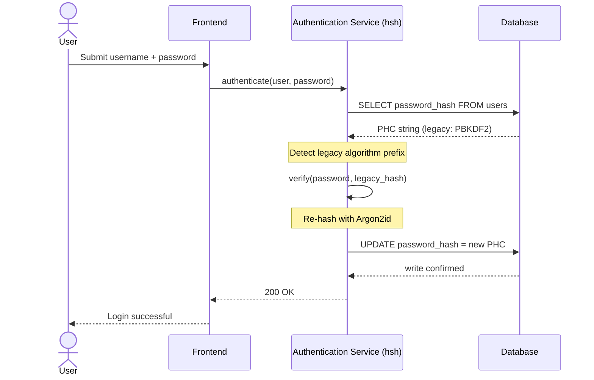
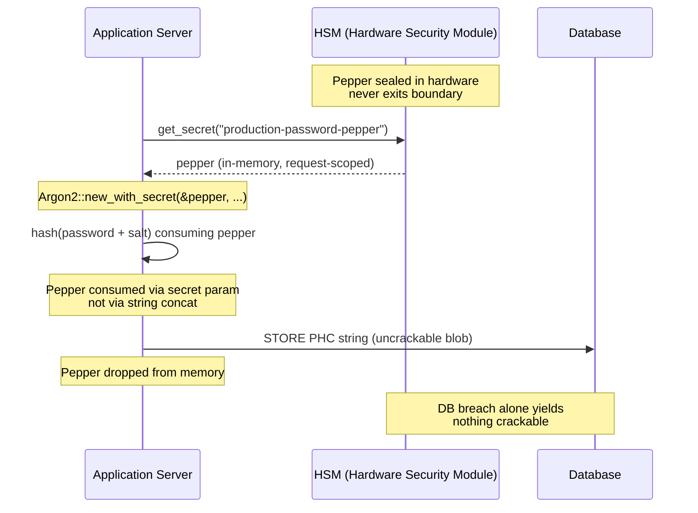

---
# Front Matter (YAML)
author: "contact@sebastienrousseau.com (Sebastien Rousseau)"
banner_alt: "Primo piano di un terminale di sviluppatore che scorre l'output del compilatore Rust — la disciplina visibile di un substrato crittografico memory-safe e auditabile sotto un parco di autenticazione bancaria enterprise"
banner_height: "1597"
banner_width: "2584"
banner: "https://cloudcdn.pro/stocks/images/rustlogs.webp"
cdn: "https://cloudcdn.pro"
charset: "UTF-8"
cname: "sebastienrousseau.com"
copyright: "© Copyright 2025 - 2026 - Sebastien Rousseau. Tutti i diritti riservati."
date: "22 giugno 2026"
description: "hsh è un framework crittografico puro Rust che permette alle banche di Tier-1 di migrare gli hash di password legacy ad Argon2id senza downtime, integrando il peppering HSM ed eliminando le vulnerabilità di memoria del FFI in C, per soddisfare i mandati DORA."
format-detection: "telephone=no"
hreflang: "it"
icon: "https://cloudcdn.pro/clients/sebastienrousseau/v1/logos/sebastienrousseau.svg"
id: "https://sebastienrousseau.com/2026-06-22-hsh-zero-downtime-cryptographic-stewardship-rust-banking-2026"
image_alt: "Ritratto in bianco e nero di Sebastien Rousseau"
image_height: "162"
image_width: "162"
image: "https://cloudcdn.pro/stocks/images/sebastien-rousseau.png"
keywords: "hsh, crittografia Rust, hashing password, Argon2id, sicurezza bancaria, interlock HSM, conformità DORA, Basel III, migrazione zero-downtime, memory safety, PBKDF2, scrypt, cyber recovery"
language: "it-IT"
last_reviewed: "2026-06-22"
layout: "report"
locale: "it_IT"
logo_alt: "Logo di Sebastien Rousseau"
logo_height: "44"
logo_width: "44"
logo: "https://cloudcdn.pro/clients/sebastienrousseau/v1/logos/sebastienrousseau.svg"
measurementID: "G-169G4ET5HQ"
name: "Sebastien Rousseau"
permalink: "https://sebastienrousseau.com/2026-06-22-hsh-zero-downtime-cryptographic-stewardship-rust-banking-2026"
rating: "general"
referrer: "no-referrer"
robots: "index, follow"
schema: "FAQPage, Article"
seo_title: "hsh: stewardship crittografica zero-downtime in Rust per le banche"
short_name: "sebastienrousseau"
subtitle: "Come un framework crittografico puro Rust permette alle banche di aggiornare gli hash di password legacy ad Argon2id con interlock HSM — e cosa significa per la conformità DORA e Basel III."
tags: "hsh, Rust, banking, crittografia, Argon2id, HSM, DORA, Basel-III, sicurezza, open-source, resilienza-operativa"
theme-color: "0, 83, 191"
title: "Gestire le password nel banking enterprise: hashing multi-algoritmo e upgrade con hsh"
url: "https://sebastienrousseau.com/2026-06-22-hsh-zero-downtime-cryptographic-stewardship-rust-banking-2026"
viewport: "width=device-width, initial-scale=1, shrink-to-fit=no"

# RSS
atom_link: "https://sebastienrousseau.com/2026-06-22-hsh-zero-downtime-cryptographic-stewardship-rust-banking-2026/rss.xml"
category: "Technology"
generator: "Static Site Generator (SSG) (version 0.0.40)"
item_description: "hsh è un framework crittografico puro Rust che permette alle banche di Tier-1 di migrare gli hash di password legacy ad Argon2id senza downtime, integrando il peppering HSM ed eliminando le vulnerabilità di memoria del FFI in C, per soddisfare i mandati DORA."
item_pub_date: "Mon, 22 Jun 2026 07:07:07 +0000"
item_title: "Gestire le password nel banking enterprise: hashing multi-algoritmo e upgrade con hsh"
pub_date: "Mon, 22 Jun 2026 07:07:07 +0000"
type: "article"

# Twitter Card
twitter_card: "summary_large_image"
twitter_creator: "@wwdseb"
twitter_description: "hsh permette alle banche di Tier-1 di migrare gli hash di password legacy ad Argon2id con zero downtime, interlock HSM e Rust memory-safe."
twitter_image: "https://cloudcdn.pro/clients/sebastienrousseau/v1/logos/sebastienrousseau.svg"
twitter_title: "hsh: stewardship crittografica zero-downtime in Rust"
twitter_url: "https://sebastienrousseau.com/2026-06-22-hsh-zero-downtime-cryptographic-stewardship-rust-banking-2026"

excerpt: "Nell'era della decifratura accelerata via GPU e dei mandati DORA, la decadenza crittografica è un rischio sistemico. Ogni hash PBKDF2 o scrypt legacy che giace in un database bancario è un conto alla rovescia verso la compromissione. hsh introduce upgrade zero-downtime, memory-safe..."

# Added by fix_hsh_frontmatter.py (template completeness)
apple_mobile_web_app_orientations: "portrait"
apple_touch_icon_sizes: "192x192"
apple-mobile-web-app-capable: "yes"
apple-mobile-web-app-status-bar-inset: "black"
apple-mobile-web-app-status-bar-style: "black-translucent"
apple-touch-fullscreen: "yes"
author_location: "London, United Kingdom"
author_twitter: "@wwdseb"
author_website: "https://sebastienrousseau.com"
docs: https://validator.w3.org/feed/docs/rss2.html
item_guid: "https://sebastienrousseau.com/2026-06-22-hsh-zero-downtime-cryptographic-stewardship-rust-banking-2026/rss.xml"
item_link: "https://sebastienrousseau.com/2026-06-22-hsh-zero-downtime-cryptographic-stewardship-rust-banking-2026/rss.xml"
last_build_date: "Mon, 22 Jun 2026 06:06:06 +0000"
managing_editor: "contact@sebastienrousseau.com (Sebastien Rousseau)"
menu: "active"
msapplication-navbutton-color: "0, 83, 191"
site_components: "Kaishi, Kaishi Builder, Kaishi CLI, Kaishi Templates, Kaishi Themes"
site_last_updated: "2023-07-05"
site_software: "Static Site Generator, Rust"
site_standards: "HTML5, CSS3, RSS, Atom, JSON, XML, YAML, Markdown, TOML"
ttl: "60"
twitter_site: "@wwdseb"
webmaster: "contact@sebastienrousseau.com"
apple-mobile-web-app-title: "hsh: Rust password hashing"
thanks: "Grazie per la lettura!"
twitter_image_alt: "Ritratto in bianco e nero di Sebastien Rousseau"
---

# Gestire le password nel banking enterprise: hashing multi-algoritmo e upgrade con hsh

<!-- lead-start: manual -->
<aside class="post-lead" aria-label="Sintesi dell'articolo">
<p class="post-lead-tldr"><strong>In sintesi.</strong> <a href="https://github.com/sebastienrousseau/hsh">hsh</a> è un framework crittografico open source, puro Rust, che permette alle banche di Tier-1 di migrare gli hash di password legacy verso standard moderni come Argon2id senza alcuna interruzione del servizio. Integrando il peppering tramite HSM e imponendo una rigorosa memory safety senza wrapper FFI in C, chiude le vulnerabilità di decadenza crittografica che minacciano direttamente la conformità a DORA e Basel III.</p>
<p class="post-lead-heading"><strong>Punti chiave</strong></p>
<ul class="post-lead-takeaways">
  <li><strong>Il problema della decadenza crittografica.</strong> Gli algoritmi legacy come PBKDF2 si indeboliscono in modo esponenziale man mano che l'hardware accelera, ampliando la superficie d'attacco per credential-stuffing e campagne di brute-force offline.</li>
  <li><strong>Migrazione zero-downtime.</strong> Il pattern <code>verify_and_upgrade</code> riapplica l'hash alle credenziali utente in modo trasparente durante i normali eventi di login, eliminando il rischio operativo delle migrazioni massive di database.</li>
  <li><strong>Interlock hardware e peppering.</strong> Gli hash vengono incapsulati tramite Hardware Security Module (HSM) o architetture cloud KMS, garantendo che la sola violazione del database non produca password candidate decifrabili.</li>
  <li><strong>Memory safety come baseline regolamentare.</strong> Riscritto interamente in Rust sicuro e protetto da una rigorosa igiene delle dipendenze, hsh elimina i rischi di buffer overflow e supply chain insiti nelle librerie crittografiche legacy in C.</li>
</ul>
<p class="post-lead-related"><strong>Letture correlate:</strong> <a href="https://sebastienrousseau.com/2026-06-20-http-handle-zero-dependency-edge-ingress-banking-rust-2026">http-handle: Ingress Edge ad Alta Prestazione Senza Dipendenze per il Banking nel 2026</a>, <a href="https://sebastienrousseau.com/2026-06-07-autonomous-treasury-index-programmable-liquidity-tokenised-deposits-2026/index.html">Autonomous Treasury Index 2026: tesoreria agentica, liquidità programmabile e depositi tokenizzati</a>.</p>
</aside>
<!-- lead-end -->

> **Sintesi esecutiva.** L'autenticazione bancaria costruita contro un modello di minaccia del 2018 non è più adeguata sotto il regime regolamentare del 2026. Il cracking accelerato da GPU, la densità ASIC e l'orizzonte post-quantistico ormai prossimo hanno azzerato il margine di sicurezza di PBKDF2 e di scrypt con parametri iniziali; l'Articolo 5 di DORA ha trasformato quella decadenza in una responsabilità di livello board. hsh, framework open-source puro Rust, affronta il problema su tre livelli in parallelo: un dispatcher `verify_and_upgrade` che ri-applica l'hash a una credenziale memorizzata secondo i parametri Argon2id correnti a ogni login riuscito senza finestra di manutenzione; uno strato di peppering interlocked con HSM o KMS che fa sì che la sola violazione del database non produca nulla di decifrabile; e una supply chain memory-safe che elimina la superficie d'attacco delle Foreign Function Interface insita nelle librerie crittografiche basate su C. Il risultato è un substrato che soddisfa DORA, la disciplina di rischio operativo di Basel III, l'accountability dei senior manager sotto SM&CR e l'orizzonte di migrazione post-quantistica di NIST IR 8547 — senza il programma di reset massivo storicamente richiesto per aggiornare un parco di autenticazione.

Gran parte dell'autenticazione nel banking enterprise poggia ancora su uno strato di password indurito secondo un modello di minaccia del 2018. L'hardware che lo infrange è andato avanti. Con la scalabilità delle GPU farm e l'avvicinarsi di computer quantistici crittograficamente rilevanti (CRQC), l'hashing legacy — PBKDF2, scrypt iniziale — si degrada a ogni ora di calcolo che gli attaccanti dedicano alla coda di cracking offline. Il degrado è silenzioso: nulla nel database di produzione segnala che l'hash robusto ieri non lo è più.

Sotto il [Digital Operational Resilience Act (DORA)](https://eur-lex.europa.eu/eli/reg/2022/2554/oj "Regolamento (UE) 2022/2554 — Digital Operational Resilience Act"), lasciare in produzione asset crittografici legacy non ruotati non è più debito tecnico. È responsabilità regolamentare nominale.

[hsh](https://github.com/sebastienrousseau/hsh "hsh — framework di password hashing puro Rust") chiude il divario. Framework puro Rust, gestisce più formati di hash affiancati e aggiorna in volo le credenziali deboli durante le sessioni di login attive. L'infrastruttura di autenticazione si allinea ai mandati di resilienza del 2026 senza una finestra di manutenzione, senza un reset forzato, senza un solo secondo di downtime.

## 01. Il problema della decadenza crittografica nel banking

Per comprendere la necessità di un framework come hsh, bisogna capire il ciclo di vita di un hash di password. Gli algoritmi non invecchiano con grazia: si degradano in funzione dell'hardware disponibile per infrangerli.

**Il divario di accelerazione ASIC/GPU.** Algoritmi come PBKDF2 sono stati progettati per essere computazionalmente onerosi per le CPU. Oggi gli attaccanti utilizzano GPU altamente parallelizzate per eseguire attacchi a dizionario offline. Un hash legacy generato nel 2018 è notevolmente più debole contro un avversario del 2026.

**Il rischio della migrazione big-bang.** Quando un CISO decide di aggiornare da PBKDF2 a un algoritmo memory-hard come Argon2id, non può invertire gli hash per ri-cifrarli. Le soluzioni tradizionali — imporre il reset password a milioni di utenti — generano attriti enormi per la clientela e rischio operativo.

**La supply chain delle librerie C.** Storicamente, il middleware bancario si è basato su librerie come `argonautica` o su binding C grezzi per l'hashing. Queste librerie portano con sé un rischio di supply chain nascosto: un singolo buffer overflow nel modulo di autenticazione può condurre all'esecuzione di codice remoto (RCE) nello strato più privilegiato dello stack bancario.

### Confronto fra algoritmi — resistenza hardware e superficie di tuning

I tre algoritmi che una banca incontra realisticamente in un corpus di migrazione differiscono meno nella scelta della primitiva crittografica e più nel modo in cui invecchiano sotto pressione hardware. La tabella seguente sintetizza la postura pratica.

| Algorithm | Memory-hard | GPU / ASIC resistance | Tuning surface | 2026 status |
| ---- | ---- | ---- | ---- | ---- |
| **PBKDF2** | No | Bassa — si vettorializza su GPU; sotto il millisecondo per tentativo su hardware commodity. | Solo conteggio iterazioni. | Legacy. Accettabile solo come fallback lato verifica durante la migrazione. |
| **scrypt** | Sì (moderato) | Media — il costo in memoria sconfigge le semplici GPU farm; ammortizzabile su ASIC su larga scala. | `N` (CPU/memoria), `r` (dimensione blocco), `p` (parallelismo). | Deprecato per nuovi progetti. Attivo nei corpus di migrazione. |
| **Argon2id** | Sì (elevato) | Alta — memory- e time-hard; resiste agli attacchi side-channel e TMTO. | Costo memoria (`m`), costo tempo (`t`), parallelismo (`p`), segreto (pepper). | Default raccomandato. OWASP, bozza NIST SP 800-63B-4, FedRAMP. |

L'indicazione per il piano di migrazione è netta: PBKDF2 è uno stato *lato verifica*, non una destinazione *lato scrittura*. Ogni login riuscito su un record PBKDF2 dovrebbe produrre in uscita un record Argon2id.

## 02. La lente architetturale di hsh 2026

Il framework si struttura su cinque livelli centrali, ciascuno progettato per mitigare una categoria specifica di rischio operativo.

### Tabella 1: livelli architetturali di hsh e mitigazione del rischio

| Livello | Decisione di design | Perché conta | Rischio in caso di gestione errata |
| ---- | ---- | ---- | ---- |
| **Primitive crittografiche** | Formato unificato PHC String che supporta Argon2id, scrypt e PBKDF2 | Offre la migliore resistenza agli attacchi GPU mantenendo la retrocompatibilità. | Silos di dati; algoritmi deboli che permettono oltre 100 miliardi di tentativi/secondo offline. |
| **Motore di policy** | Dispatch `verify_and_upgrade` | Automatizza la transizione dalle policy legacy a quelle moderne in modo dinamico al login. | Decadenza di sicurezza; utenti attivi che restano su tipi di hash legacy facilmente decifrabili. |
| **Interlock hardware** | Capacità di "peppering" su HSM e Cloud KMS | Garantisce che la sola violazione del database non esponga password candidate. | Attacchi brute-force offline che riescono dopo una violazione via SQL injection. |
| **Igiene di sicurezza** | Enforcement `deny.toml` e Rust puro | Blocca interamente FFI insicuro e dipendenze C esterne non fidate. | Attacchi catastrofici alla supply chain e CVE da corruzione di memoria. |

## 03. Il percorso di rehash zero-downtime

Il pattern `verify_and_upgrade` risolve la migrazione dei dati tramite un sistema di dispatch intelligente e consapevole dello stato che non richiede alcun downtime del database.

Quando un utente invia le proprie credenziali, hsh legge la stringa Password Hashing Competition (PHC) memorizzata. Se contiene un hash legacy (ad esempio una configurazione PBKDF2 obsoleta), il sistema esegue il seguente flusso:

1. **Identificazione:** analizza l'algoritmo legacy e i relativi parametri specifici.
2. **Verifica:** valida la password candidata contro l'hash legacy.
3. **Upgrade in tempo reale:** in caso di corrispondenza riuscita, prende la password candidata in chiaro in memoria e calcola immediatamente un nuovo hash usando la policy Argon2id ad alta sicurezza.
4. **Persistenza:** restituisce la nuova stringa PHC all'applicazione bancaria, che sovrascrive il record legacy nel database.

Il processo è completamente trasparente per l'utente finale. Di fatto migra al livello di sicurezza più alto gli account più attivi dal primo giorno, riducendo in modo significativo e organico la superficie d'attacco della banca nel tempo.

La sequenza seguente mostra cosa accade durante un singolo evento di login quando il record memorizzato si trova su un algoritmo legacy. L'utente non percepisce alcuna differenza; il parco di autenticazione della banca si rafforza di un record.



### Pattern di implementazione — dispatch `verify_and_upgrade`

La superficie di integrazione all'interno di un servizio di autenticazione è ridotta. Il percorso di codice legacy resta come fallback; il nuovo percorso è il dispatcher.

```rust
use hsh::{Hasher, UpgradeResult};

struct UserRecord {
    username: String,
    password_hash: String, // PHC string
}

async fn authenticate(user: UserRecord, password_attempt: &str) -> Result<bool, AuthError> {
    let hasher = Hasher::new();
    match hasher.verify_and_upgrade(password_attempt, &user.password_hash) {
        Ok(UpgradeResult::Verified(is_valid)) => Ok(is_valid),
        Ok(UpgradeResult::Upgraded(new_hash)) => {
            db::update_user_hash(&user.username, new_hash).await?;
            Ok(true)
        }
        Err(_) => Err(AuthError::InvalidCredentials),
    }
}
```

Tre proprietà sono rilevanti:

- **Consapevolezza dello stato.** `verify_and_upgrade` ispeziona il prefisso della stringa PHC. Se il marker dell'algoritmo è legacy, il framework attiva automaticamente il re-hash secondo la policy Argon2id configurata. Nessuna logica di branching nel codice chiamante.
- **Atomicità.** Il re-hash avviene solo dopo che la verifica legacy ha avuto successo, all'interno dello stesso evento di autenticazione. Non c'è un job batch separato, nessuna finestra di migrazione pianificata, nessuna migrazione massiva distruttiva da annullare.
- **Persistenza.** La variante `UpgradeResult::Upgraded` trasporta la nuova stringa PHC. L'applicazione la persiste attraverso lo stesso percorso dati già esistente per il record legacy — nessuna superficie di scrittura parallela, nessun protocollo di scrittura a due fasi.

**Modalità di fallimento.** Se la scrittura sul database fallisce o il KMS è momentaneamente irraggiungibile durante la scrittura dell'upgrade, la sessione ha comunque successo contro l'hash legacy e il record resta sull'algoritmo precedente. Il login riuscito successivo riprova l'upgrade. Non c'è uno stato a metà migrazione e nessun fallimento visibile all'utente — la migrazione è monotona attraverso gli eventi di login, e il costo per record di un upgrade fallito è esattamente un retry aggiuntivo al login successivo.

## 04. Hash "peppered" tramite interlock HSM / KMS

L'hashing standard delle password protegge dalle violazioni dirette del database, ma se un attaccante ottiene sia il database (hash e salt), può eseguire cracking offline.

hsh introduce un robusto strato di sicurezza "peppered". Integrandosi con Hardware Security Module (HSM) o servizi cloud-native di Key Management (KMS), l'output finale di Argon2id viene incapsulato crittograficamente con una chiave ad alta entropia che non lascia mai il confine hardware sicuro. Se il database utenti viene esfiltrato, l'attaccante possiede solo blob cifrati. Non può iniziare a decifrare le password senza violare anche l'infrastruttura HSM fisicamente isolata della banca.

Il diagramma di architettura sottostante traccia il percorso del segreto. Il pepper non finisce mai nel database; il database non conserva mai nulla di indirizzabile da solo. I due store possono guastarsi in modo indipendente — il sistema perde la riservatezza solo se entrambi cedono insieme.



### Pattern di implementazione — Argon2id peppered con HSM

Il pepper viene prelevato dall'HSM al momento della richiesta, non da un file di configurazione. `Argon2::new_with_secret` lo consuma attraverso il parametro segreto dell'algoritmo, non tramite concatenazione di stringhe.

```rust
use argon2::{
    Argon2, Algorithm, Version, Params,
    PasswordHasher, PasswordVerifier,
    password_hash::{PasswordHash, SaltString, rand_core::OsRng},
};

async fn authenticate_with_hsm(
    user: UserRecord,
    password_attempt: &str,
) -> Result<bool, AuthError> {
    let pepper = hsm::client::get_secret("production-password-pepper").await?;
    let hasher = Argon2::new_with_secret(
        &pepper,
        Algorithm::Argon2id,
        Version::V0x13,
        Params::default(),
    )
    .map_err(|_| AuthError::Internal)?;

    let parsed = PasswordHash::new(&user.password_hash)
        .map_err(|_| AuthError::InvalidCredentials)?;
    if hasher.verify_password(password_attempt.as_bytes(), &parsed).is_ok() {
        if is_legacy_hash(&user.password_hash) {
            let new_hash = hasher
                .hash_password(
                    password_attempt.as_bytes(),
                    &SaltString::generate(&mut OsRng),
                )
                .map_err(|_| AuthError::Internal)?
                .to_string();
            db::update_user_hash(&user.username, new_hash).await?;
        }
        return Ok(true);
    }
    Err(AuthError::InvalidCredentials)
}
```

Da questa forma discendono tre conseguenze allineate a DORA:

- **Rotazione delle chiavi come problema di key-management.** Il pepper vive dietro il confine HSM/KMS, non nel database. La rotazione diventa un cambio di key-management, non una campagna di re-hash su tutto il parco utenti. I nuovi hash si legano alla versione corrente del pepper; gli hash precedenti si verificano sotto la versione a cui sono legati finché non vengono aggiornati in modo naturale.
- **Separazione dei compiti.** L'identità di servizio che legge il pepper deve essere auditabile e a privilegio minimo. Un'esfiltrazione completa del database senza il corrispondente grant HSM non produce nulla di decifrabile. Una compromissione del grant HSM senza il database non produce nulla di indirizzabile. Il raggio d'impatto di entrambi i singoli fallimenti è limitato.
- **Evitare bug di length extension e di concatenazione.** Usare il parametro segreto di Argon2 invece della concatenazione di stringhe rimuove dall'implementazione un'intera classe di insidie crittografiche — length-extension, concatenazione UTF-8 mal tipata, errori di ordinamento salt/pepper.

## 05. Allineamento regolamentare: DORA, Basel III e SM&CR

- **DORA Articoli 5 e 6:** richiedono alle entità finanziarie di mantenere framework di gestione del rischio ICT. Una strategia che si affida a hash di password vecchi di un decennio e non ruotati viola questi principi. hsh fornisce un meccanismo documentato e automatizzato per innalzare in modo continuo le protezioni crittografiche.
- **Basel III:** collega il capitale regolamentare alla probabilità e gravità degli eventi di perdita. Implementando Argon2id con interlock HSM, la gravità di una violazione del database si riduce drasticamente, sostenendo argomentazioni quantificabili per una minore allocazione di capitale per il rischio operativo.
- **Accountability SM&CR:** approvare un'architettura che rimedia attivamente alla decadenza crittografica fornisce ai senior manager nominati una catena verificabile e documentabile di riduzione del rischio.

## Domande frequenti

**hsh è pronto per la produzione su un percorso di autenticazione bancaria Tier-1?**
La libreria è open-source, documentata ed esercita Argon2id attraverso lo stesso crate `argon2` che sostiene l'ecosistema di password-hashing di RustCrypto. L'adozione Tier-1 segue la due diligence della banca: revisione indipendente del codice, attestazione di build riproducibili, pinning dell'albero delle dipendenze, test di integrazione con vendor HSM e sign-off dell'Operational Risk. hsh fornisce il substrato; la banca certifica il deployment.

**Come fa `verify_and_upgrade` a evitare il rischio di migrazione massiva?**
Il verifier ispeziona la stringa PHC al parsing, esegue l'algoritmo legacy per validare la password e — se l'algoritmo memorizzato o il set di parametri è sotto la soglia corrente — ri-applica l'hash al testo in chiaro sotto Argon2id con il pepper HSM legato e riscrive atomicamente la nuova stringa PHC. L'utente vive un login normale. Il parco si rafforza di un record per ogni autenticazione riuscita. Nessuna campagna di reset, nessuna finestra di manutenzione, nessun evento di rischio operativo.

**Cosa succede agli account dormienti che non eseguono mai il login?**
I record che non si autenticano mai non vengono mai ri-cifrati. Le banche affrontano la questione con due policy complementari: una soglia di dormienza documentata (spesso 18–24 mesi) oltre la quale l'account viene ruotato amministrativamente con una campagna di reset controllata, e un re-hash sintetico durante la manutenzione pianificata per coorti definite (alto valore, privilegio elevato, regolamentati). Entrambe sono policy, non comportamenti della libreria; hsh registra la decisione di dispatch nella telemetria di audit affinché il responsabile operativo possa dimostrare la copertura.

**Il pepper HSM introduce un single point of failure sul percorso di autenticazione?**
Lo stesso HSM che firma i messaggi di pagamento e ruota le chiavi KMS è sul percorso. Il rischio è identico alla postura esistente della banca; hsh lo eredita anziché introdurlo. Le mitigazioni sono standard: coppie HSM in HA, regioni KMS hot-spare, recupero pepper request-scoped con circuit-breaker fall-back a modalità sola lettura e un runbook operativo esplicito per l'indisponibilità HSM. Il pepper è il parametro segreto di `argon2`, consumato in-process e rimosso dalla memoria dopo l'uso.

**Dove si colloca hsh rispetto alla migrazione post-quantistica?**
hsh è un framework di hashing di password e segreti, non una primitiva di key-encapsulation o di firma. La transizione PQC documentata in [NIST IR 8547](https://csrc.nist.gov/pubs/ir/8547/ipd "Transition to Post-Quantum Cryptography Standards") riguarda lo scambio di chiavi (ML-KEM, FIPS 203) e le firme (ML-DSA, FIPS 204; SLH-DSA, FIPS 205). Lo strato di hashing che hsh copre è largamente ortogonale a quella migrazione. I due convergono a livello di substrato — entrambi vogliono una supply chain crittografica memory-safe, auditabile e con build riproducibili — che è esattamente la postura che hsh abilita oggi.

## Conclusione

L'hashing delle password "installa-e-dimentica" è finito. DORA ha spostato la passività crittografica dal debito tecnico alla responsabilità regolamentare nominale, e la curva dell'hardware si fa più ripida ogni anno. Il contributo di hsh non è un algoritmo più robusto — Argon2id è disponibile da anni. Il contributo è la macchina operativa per migrarvi senza pianificare downtime, senza forzare reset agli utenti, senza affidare a shim FFI in C il percorso di autenticazione della banca.

Il [codice sorgente di hsh](https://github.com/sebastienrousseau/hsh "hsh — framework di password hashing puro Rust, doppia licenza MIT e Apache 2.0") è disponibile sotto doppia licenza MIT e Apache 2.0.

## Riferimenti

Basel Committee on Banking Supervision (2011). *Basel III: A global regulatory framework for more resilient banks and banking systems*. Bank for International Settlements. Disponibile presso: [https://www.bis.org/publ/bcbs189.pdf](https://www.bis.org/publ/bcbs189.pdf "Basel III: A global regulatory framework for more resilient banks and banking systems")

Biryukov, A., Dinu, D., Khovratovich, D., e Josefsson, S. (2021). *RFC 9106: Argon2 Memory-Hard Function for Password Hashing and Proof-of-Work Applications*. Internet Engineering Task Force. Disponibile presso: [https://datatracker.ietf.org/doc/html/rfc9106](https://datatracker.ietf.org/doc/html/rfc9106 "RFC 9106 — Argon2 Memory-Hard Function for Password Hashing")

Parlamento europeo e Consiglio (2022). *Regolamento (UE) 2022/2554 sulla resilienza operativa digitale per il settore finanziario (DORA)*. Disponibile presso: [https://eur-lex.europa.eu/eli/reg/2022/2554/oj](https://eur-lex.europa.eu/eli/reg/2022/2554/oj "Regolamento (UE) 2022/2554 — DORA")

Financial Conduct Authority (2015). *Senior Managers and Certification Regime (SM&CR)*. Disponibile presso: [https://www.fca.org.uk/firms/senior-managers-certification-regime](https://www.fca.org.uk/firms/senior-managers-certification-regime "Senior Managers and Certification Regime")

National Institute of Standards and Technology (2024). *Initial Public Draft — Transition to Post-Quantum Cryptography Standards (NIST IR 8547)*. Disponibile presso: [https://csrc.nist.gov/pubs/ir/8547/ipd](https://csrc.nist.gov/pubs/ir/8547/ipd "NIST IR 8547 — Transition to Post-Quantum Cryptography Standards")

OWASP Foundation (2024). *Password Storage Cheat Sheet*. Disponibile presso: [https://cheatsheetseries.owasp.org/cheatsheets/Password_Storage_Cheat_Sheet.html](https://cheatsheetseries.owasp.org/cheatsheets/Password_Storage_Cheat_Sheet.html "OWASP Password Storage Cheat Sheet")

<!-- enrich-start -->
<aside class="author-card" aria-label="Informazioni sull'autore"><span class="author-card-body"><strong class="author-card-name"><a href="/about/index.html">Sebastien Rousseau</a></strong><span class="author-card-bio">Senior banking technologist che scrive di AI applicata, migrazione a ISO 20022, crittografia post-quantistica per i servizi finanziari e trasformazione strutturale dei pagamenti wholesale.</span><span class="author-credentials">Oltre 20 anni in HSBC Commercial & Investment Bank, PayPal, Barclays, Shazam. <a href="https://www.linkedin.com/in/sebastienrousseau/" rel="external noopener">LinkedIn</a> &middot; <a href="https://github.com/sebastienrousseau" rel="external noopener">GitHub</a></span></span></aside>
<p class="post-reviewed">Ultima revisione <time datetime="2026-06-22">2026-06-22</time>.</p>
<!-- enrich-end -->
