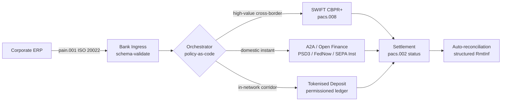

---

# Front Matter (YAML)

author: "contact@sebastienrousseau.com (Sebastien Rousseau)"
banner_alt: "Nave portacontainer in un porto in acque profonde all'alba — emblema del movimento multi-rail e transfrontaliero del valore aziendale attraverso ISO 20022, open finance e reti di regolamento su depositi tokenizzati nel 2026"
banner_height: "1597"
banner_width: "2584"
banner: "https://cloudcdn.pro/stocks/images/viktor-forgacs-KxVRDiFdTVo.webp"
cdn: "https://cloudcdn.pro"
charset: "UTF-8"
cname: "sebastienrousseau.com"
copyright: "© Copyright 2025 - 2026 - Sebastien Rousseau. Tutti i diritti riservati."
date: "June 24, 2026"
description: "Come ISO 20022, A2A, open finance ai sensi di PSD3/FiDA e i depositi tokenizzati stanno ridisegnando il treasury aziendale transfrontaliero accanto a SWIFT nel 2026."
format-detection: "telephone=no"
hreflang: "it"
icon: "https://cloudcdn.pro/clients/sebastienrousseau/v1/logos/sebastienrousseau.svg"
id: "https://sebastienrousseau.com/2026-06-24-cross-border-iso-20022-open-finance-tokenised-deposits-treasury-2026"
image_alt: "Ritratto in bianco e nero di Sebastien Rousseau"
image_height: "162"
image_width: "162"
image: "https://cloudcdn.pro/stocks/images/sebastienrousseau.webp"
keywords: "pagamenti transfrontalieri, ISO 20022, open finance, PSD3, FiDA, depositi tokenizzati, stablecoin, A2A, treasury, CIB, Nexi, Mastercard, multi-rail, pacs.008, pain.001, SWIFT, FedNow, SEPA Instant, RTP, CBPR+"
language: "it-IT"
last_reviewed: "2026-06-24"
layout: "report"
locale: "it_IT"
logo_alt: "Logo di Sebastien Rousseau"
logo_height: "44"
logo_width: "44"
logo: "https://cloudcdn.pro/clients/sebastienrousseau/v1/logos/sebastienrousseau.svg"
menu: ""
measurementID: "G-169G4ET5HQ"
name: "Sebastien Rousseau"
permalink: "https://sebastienrousseau.com/2026-06-24-cross-border-iso-20022-open-finance-tokenised-deposits-treasury-2026"
rating: "general"
referrer: "no-referrer"
robots: "index, follow"
schema: "FAQPage, Article"
seo_title: "Cross-Border 2026: ISO 20022, open finance, rail tokenizzati"
short_name: "sebastienrousseau"
subtitle: "Il treasury aziendale transfrontaliero nel 2026 si regge su una meccanica multi-rail — ISO 20022 come grammatica comune, A2A e open finance come rail rivolto al cliente, depositi tokenizzati come gamba di regolamento wholesale, con SWIFT che ancora la coda lunga."
tags: "pagamenti transfrontalieri, ISO 20022, open finance, PSD3, FiDA, depositi tokenizzati, A2A, treasury, CIB, multi-rail, pacs.008, pain.001, SWIFT, FedNow, SEPA Instant, RTP, CBPR+"
theme-color: "0, 83, 191"
title: "Cross-Border 2026: ISO 20022, open finance e depositi tokenizzati nel treasury aziendale"
url: "https://sebastienrousseau.com/2026-06-24-cross-border-iso-20022-open-finance-tokenised-deposits-treasury-2026"
viewport: "width=device-width, initial-scale=1, shrink-to-fit=no"

# RSS - The RSS feed front matter (YAML).
atom_link: "https://sebastienrousseau.com/2026-06-24-cross-border-iso-20022-open-finance-tokenised-deposits-treasury-2026/rss.xml"
category: "Technology"
docs: https://validator.w3.org/feed/docs/rss2.html
generator: "Static Site Generator (SSG) (version 0.0.26)"
item_description: "Come ISO 20022, A2A, open finance ai sensi di PSD3/FiDA e i depositi tokenizzati stanno ridisegnando il treasury aziendale transfrontaliero accanto a SWIFT nel 2026."
item_guid: "https://sebastienrousseau.com/2026-06-24-cross-border-iso-20022-open-finance-tokenised-deposits-treasury-2026/rss.xml"
item_link: "https://sebastienrousseau.com/2026-06-24-cross-border-iso-20022-open-finance-tokenised-deposits-treasury-2026/rss.xml"
item_pub_date: "Wed, 24 Jun 2026 07:07:07 +0000"
item_title: "Cross-Border 2026: ISO 20022, open finance e depositi tokenizzati nel treasury aziendale"
last_build_date: "Wed, 24 Jun 2026 06:06:06 +0000"
managing_editor: "contact@sebastienrousseau.com (Sebastien Rousseau)"
pub_date: "Wed, 24 Jun 2026 07:07:07 +0000"
ttl: "60"
type: "article"
webmaster: "contact@sebastienrousseau.com"

# Apple - The Apple front matter (YAML).
apple_mobile_web_app_orientations: "portrait"
apple_touch_icon_sizes: "192x192"
apple-mobile-web-app-capable: "yes"
apple-mobile-web-app-status-bar-inset: "black"
apple-mobile-web-app-status-bar-style: "black-translucent"
apple-mobile-web-app-title: "Cross-Border 2026: ISO 20022, open finance, rail tokenizzati"
apple-touch-fullscreen: "yes"

# MS Application - The MS Application front matter (YAML).

msapplication-navbutton-color: "0, 83, 191"

# Twitter Card - The Twitter Card front matter (YAML).

twitter_card: "summary_large_image"
twitter_creator: "@wwdseb"
twitter_description: "Come ISO 20022, A2A, open finance ai sensi di PSD3/FiDA e i depositi tokenizzati stanno ridisegnando il treasury aziendale transfrontaliero accanto a SWIFT nel 2026."
twitter_image: "https://cloudcdn.pro/clients/sebastienrousseau/v1/logos/sebastienrousseau.svg"
twitter_image_alt: "Logo di Sebastien Rousseau"
twitter_site: "@wwdseb"
twitter_title: "Cross-Border 2026: ISO 20022, open finance, rail tokenizzati"
twitter_url: "https://sebastienrousseau.com/2026-06-24-cross-border-iso-20022-open-finance-tokenised-deposits-treasury-2026"

excerpt: "Il treasury aziendale transfrontaliero nel 2026 è un problema di ingegneria multi-rail. ISO 20022 è la grammatica comune, A2A e open finance ai sensi di PSD3/FiDA sono il rail rivolto al cliente, i depositi tokenizzati gestiscono la gamba di regolamento wholesale e SWIFT continua ad ancorare la coda lunga. Il lavoro interessante è nel livello di orchestrazione, non nel modello."

# Humans.txt - The Humans.txt front matter (YAML).
author_website: "https://sebastienrousseau.com"
author_twitter: "@wwdseb"
author_location: "London, UK"
thanks: "Grazie per la lettura!"
site_last_updated: "2026-06-24"
site_standards: "HTML5, CSS3, RSS, Atom, JSON, XML, YAML, Markdown, TOML"
site_components: "Kaishi, Kaishi Builder, Kaishi CLI, Kaishi Templates, Kaishi Themes"
site_software: "Static Site Generator, Rust"

---

# Cross-Border 2026: ISO 20022, open finance e depositi tokenizzati nel treasury aziendale

<!-- lead-start -->
<aside class="post-lead" aria-label="Sintesi dell'articolo">

<strong>TL;DR.</strong> Il treasury aziendale transfrontaliero nel 2026 gira su quattro rail in parallelo — SWIFT CBPR+, A2A istantaneo ai sensi di PSD3/FiDA, depositi tokenizzati e rail su stablecoin — cuciti insieme da ISO 20022 come grammatica comune. Il lavoro per i team CIB e treasury aziendale è l'orchestrazione, non la scelta del rail.

<strong>Punti chiave</strong>

<ul class="post-lead-takeaways">
  <li><strong>Il multi-rail è il default.</strong> Nessun rail singolo regola ogni corridoio, ogni taglio di ticket, ogni cut-off. Il treasury sceglie il rail per pagamento, non per banca.</li>
  <li><strong>ISO 20022 è la lingua franca.</strong> pacs.008, pacs.009 e pain.001 oggi trasportano dati di rimessa su RTGS, rail istantanei, A2A e depositi tokenizzati — rendendo le decisioni di routing guidate dai dati invece che vincolate al rail.</li>
  <li><strong>L'open finance allarga il perimetro.</strong> PSD3 e FiDA spingono il modello open banking dentro pensioni, assicurazioni e dati di treasury; Nexi e Mastercard stanno costruendo il livello di orchestrazione che le aziende consumano.</li>
  <li><strong>I depositi tokenizzati sono la gamba wholesale.</strong> I depositi tokenizzati emessi dalle banche e i rail su stablecoin integrati si collocano sotto al rail istantaneo rivolto al cliente e regolano la gamba wholesale in tempi prossimi a T+0.</li>
</ul>

<strong>Letture correlate:</strong> <a href="https://sebastienrousseau.com/2026-06-07-autonomous-treasury-index-programmable-liquidity-tokenised-deposits-2026">The Autonomous Treasury Index 2026: liquidità programmabile e depositi tokenizzati</a>, <a href="https://sebastienrousseau.com/2026-06-15-pacs008-automation-iso-20022-interbank-payments-2026">Automazione di pacs.008: pagamenti interbancari ISO 20022 nel 2026</a>.

</aside>
<!-- lead-end -->

> **Sintesi esecutiva.** Il treasury aziendale transfrontaliero nel 2026 è un problema di ingegneria multi-rail prima di essere un problema di gestione della relazione. PSD3 e il regolamento Financial Data Access (FiDA) allargano il perimetro dell'open banking ai dati di treasury aziendale; il cut-over SWIFT MT/MX di novembre 2026 rende il pacs.008 conforme a CBPR+ l'unico formato interbancario transfrontaliero praticabile; depositi tokenizzati e rail su stablecoin regolamentate gestiscono la gamba di regolamento wholesale in tempi prossimi a T+0 dentro reti permissioned. Il CIB che vince in questo ciclo non è quello che sceglie un singolo rail; è quello che progetta il livello di orchestrazione che li unisce. Questo articolo percorre l'architettura a quattro rail (A2A ai sensi di PSD3, SWIFT CBPR+, depositi tokenizzati emessi dalle banche, stablecoin regolamentate) — cosa fa bene ciascun rail, dove cadono i confini di esposizione di credito e cosa il livello di orchestrazione policy-as-code soprastante deve imporre affinché l'azienda veda un solo pagamento e il supervisore veda una sola traccia auditabile.

Un'azienda industriale europea paga un fornitore brasiliano EUR 4,2 milioni un mercoledì mattina. La workstation di treasury non sceglie una banca. Sceglie un rail — una sequenza di rail. L'istruzione rivolta al cliente atterra su un messaggio A2A pain.001 instradato attraverso un provider di open finance ai sensi di PSD3. La banca regola il tratto su due giurisdizioni corrispondenti mediante depositi tokenizzati all'interno di una rete privata CIB. La coda lunga — una pulizia fattura in USD 80.000 verso un sub-fornitore privo di relazione su depositi tokenizzati — viaggia ancora su SWIFT CBPR+ come pacs.008. Il cliente vede un pagamento. L'architettura vede quattro rail. ISO 20022 è l'unico motivo per cui regge.

Questo è il modello operativo che Mastercard descrive quando parla dell'[evoluzione dall'open banking all'open finance](https://www.mastercard.com/us/en/news-and-trends/Insights/2026/open-banking-to-open-finance-the-evolution-of-financial-data.html "Mastercard: dall'open banking all'open finance, l'evoluzione dei dati finanziari") — dati e pagamenti fusi in un unico livello di orchestrazione, con il rail scelto dal sistema, non dal cliente. La domanda interessante per i senior banking technologist non è quale rail vinca. È come il livello di orchestrazione viene progettato, governato e riconciliato.

## 01. Dalle carte all'A2A — il passaggio all'open finance

I rail su carte non stanno scomparendo. Vengono riformulati.

Lungo il 2025 e dentro il 2026, [PSD3 e il regolamento Financial Data Access (FiDA)](https://www.consultancy.uk/news/42202/orchestrating-open-banking-for-platform-growth-2026-outlook "Consultancy.uk: orchestrare l'open banking per la crescita delle piattaforme, outlook 2026") hanno esteso l'obbligo di open banking oltre i conti di pagamento verso pensioni, mutui, risparmi, assicurazioni e dati di treasury aziendale. L'implicazione per il treasury aziendale è diretta: un relationship manager CIB ora consuma il quadro completo di liquidità di un'azienda su più banche attraverso un singolo contratto API, su istruzione dell'azienda.

Due operatori stanno costruendo in modo visibile il livello di orchestrazione che le aziende consumeranno. Nexi ha esteso il proprio footprint di acquiring all'iniziazione A2A su SEPA Instant e sui corridoi RTGS paneuropei, nativamente ISO 20022 end-to-end. La piattaforma di open finance di Mastercard — costruita sull'acquisizione di Aiia e Finicity — fornisce sotto il livello di aggregazione dati e consenso, con l'iniziazione di pagamento che emerge sullo stesso estate API che prima serviva le autorizzazioni su carta.

Il passaggio conta per tre ragioni:

1. **Economia unitaria.** L'A2A iniziato ai sensi di PSD3 toglie l'interchange dal pagamento. Per i flussi B2B ad alto ticket il risparmio è materiale; per i flussi consumer a basso ticket lo stack di costi del merchant collassa.
2. **Qualità dei dati.** L'A2A ai sensi di ISO 20022 trasporta dati di rimessa strutturati che le carte non hanno mai potuto trasportare. Tassi di auto-riconciliazione sopra il 95% sono ormai requisito di ingresso.
3. **Modello di rischio.** L'A2A è un bonifico, non un'autorizzazione su carta. La superficie di frode, il modello di chargeback e quello di dispute sono tutti diversi. I team di treasury aziendale devono capire che il livello di tutela del cliente viene ricostruito, non ereditato.

Il CIB che vende una proposizione multi-rail nel 2026 vende orchestrazione — non accesso. L'accesso è ormai regolamentato.

## 02. ISO 20022 come lingua franca tra i rail

Il motivo per cui il multi-rail è praticabile è che il formato del messaggio è ormai consistente tra rail.

Il Comitato BIS sui sistemi di pagamento e di regolamento (CPMI) ha enunciato chiaramente il caso architetturale nei suoi [requisiti di armonizzazione ISO 20022 per migliorare i pagamenti transfrontalieri](https://www.bis.org/cpmi/publ/d230.pdf "BIS CPMI: requisiti di armonizzazione ISO 20022 per migliorare i pagamenti transfrontalieri"). Il cut-over di novembre 2025 verso CBPR+ ha chiuso l'era MT103 / MT202 della messaggistica interbancaria transfrontaliera. Da quel momento ogni rail di rilievo — SWIFT, FedNow, SEPA Instant, RTP e i principali sistemi di pagamento istantaneo in Asia e America Latina — parla la stessa grammatica pacs.008 / pacs.009 / pain.001.

Le conseguenze pratiche per il treasury aziendale:

- **Il routing è guidato dai dati.** La workstation di treasury legge un pain.001 una sola volta e decide il rail per pagamento sulla base di corridoio, taglio di ticket, cut-off e relazione con la controparte — senza rimappare il messaggio.
- **I dati di rimessa sopravvivono al salto.** I campi di rimessa strutturati (`<RmtInf><Strd>`) attraversano le tratte corrispondenti senza troncamenti. I tassi di auto-riconciliazione salgono perché il dato non si perde più al confine del rail.
- **Lo screening sanzioni diventa auditabile.** I campi strutturati `<Dbtr>` / `<Cdtr>` / `<DbtrAgt>` / `<CdtrAgt>` con riferimenti LEI sostituiscono lo screening in testo libero dei nomi. I tassi di hit calano. Le code di indagine si riducono.

Il diagramma seguente traccia un singolo pain.001 attraverso l'ingress della banca, dentro l'orchestratore policy-as-code e fuori verso il rail che corridoio e taglio di ticket impongono — un messaggio, molti rail, nessuna rimappatura.

Il prezzo di questa consistenza è la disciplina ingegneristica. ISO 20022 è permissivo. Due banche possono essere pienamente conformi a CBPR+ e produrre comunque messaggi pacs.008 che differiscono per uso dei campi, set di caratteri e struttura dei dati di rimessa. Il CIB che vince sul transfrontaliero nel 2026 impone un profilo di messaggio più stretto di quanto lo standard richieda — e rigetta in fase di parse, non in fase di regolamento.

## 03. Depositi tokenizzati e rail stabili

La gamba di regolamento wholesale è dove la storia dei rail diventa interessante.

Il quadro 2026, ben catturato nell'[analisi di Trade Treasury Payments su automazione, rail di contingenza, ISO 20022 e stablecoin](https://tradetreasurypayments.com/articles/automation-contingency-rails-iso-20022-and-stablecoins-the-2026-trends-reshaping-corporate-finance-and-b2b-payments "Trade Treasury Payments: automazione, rail di contingenza, ISO 20022 e stablecoin, i trend 2026 che ridisegnano corporate finance e pagamenti B2B"), divide il livello di regolamento wholesale in due modelli strutturalmente diversi.

**Depositi tokenizzati emessi dalle banche.** Una banca commerciale emette una passività tokenizzata su un ledger permissioned — JPM Coin, il deposito tokenizzato HSBC legato a Orion, gli equivalenti dei principali CIB europei. Il token è un credito diretto sulla banca emittente. Il regolamento è prossimo a T+0 dentro la rete. La conformità è responsabilità della banca emittente. Il rail è pienamente regolamentato, pienamente tracciabile e ristretto ai partecipanti che l'emittente ha onboardato.

**Rail su stablecoin integrati.** Una stablecoin regolamentata — pienamente riservata, sottoposta ad audit e operante ai sensi di MiCA o del regime regionale equivalente — regola un corridoio dove i depositi tokenizzati emessi dalle banche ancora non arrivano. Il token è un credito sulla riserva, non sul bilancio di una banca. La conformità è condivisa fra emittente, on-ramp e off-ramp.

I due modelli non sono in concorrenza. Sono impilati. Un prodotto CIB transfrontaliero nel 2026 usa tipicamente depositi tokenizzati emessi dalle banche per la tratta in-rete e una stablecoin regolamentata per il corridoio dove il rail in-rete termina. L'azienda vede un solo pagamento ISO 20022. La storia di regolamento sottostante è multi-token.

La domanda di livello board è la stessa che i comitati di rischio operativo si pongono dai primi pilot di liquidità programmabile: chi porta l'esposizione di credito sul token, e per quanto tempo? I depositi tokenizzati offrono una risposta pulita — la banca emittente, fino al burn. I rail su stablecoin integrati ne danno una più sfumata — la riserva, soggetta al ciclo di audit e alla garanzia di rimborso. Un team di treasury che non documenta la risposta per rail e per corridoio porta in bilancio un rischio di credito non misurato.

## 04. Lo stack autonomo del treasury

Sopra il livello dei rail si trova il livello di orchestrazione. Sopra il livello di orchestrazione si trova il livello degli agenti.

Ho descritto l'architettura in dettaglio in [The Autonomous Treasury Index 2026: liquidità programmabile e depositi tokenizzati](https://sebastienrousseau.com/2026-06-07-autonomous-treasury-index-programmable-liquidity-tokenised-deposits-2026 "Sebastien Rousseau: The Autonomous Treasury Index 2026"). In sintesi: il treasury agentico nel 2026 è il livello di orchestrazione, espresso come policy-as-code, con agenti delimitati che vi eseguono al suo interno.

Lo stack è:

1. **Livello rail.** SWIFT CBPR+, A2A istantaneo, depositi tokenizzati, stablecoin regolamentate. Ciascun rail ha un profilo pubblicato, una tabella di cut-off, una curva di costo e un modello di finalità del regolamento.
2. **Livello di orchestrazione.** ISO 20022 in ingresso, ISO 20022 in uscita. Decisione del rail per pagamento sulla base di corridoio, ticket, cut-off, relazione con la controparte e policy. La policy è versionata, firmata e auditabile.
3. **Livello degli agenti.** Agenti di treasury delimitati eseguono la policy di orchestrazione con confini sulle chiamate a strumenti, log di audit e interruttori di emergenza. L'agente non sceglie il rail. La policy sceglie il rail. L'agente esegue la policy.
4. **Livello di riconciliazione.** I messaggi ISO 20022 pacs.008 / pacs.002 / camt.054 si riconciliano contro l'istruzione pain.001 originale, con dati di rimessa strutturati che chiudono il loop senza intervento manuale.

Il CIB che vende questo stack nel 2026 vende quattro cose insieme — e le prezza separatamente. L'azienda che lo acquista compra opzionalità tra i rail, con un solo standard di messaggio, un solo livello di policy, un solo flusso di riconciliazione. Questo è il cambiamento architetturale. Tutto il resto è dettaglio di implementazione.

## Domande frequenti

**L'"open finance" è solo open banking riverniciato?**
No. L'open banking ai sensi di PSD2 copriva i conti di pagamento. PSD3 e il regolamento Financial Data Access (FiDA) estendono l'obbligo di condivisione dati a pensioni, mutui, risparmi, assicurazioni e dati di treasury aziendale. L'implicazione per il treasury aziendale è diretta: un relationship manager CIB ora consuma il quadro completo di liquidità di un'azienda su più banche attraverso un singolo contratto API, su istruzione dell'azienda, non solo lo storico del conto di pagamento.

**Perché il livello di orchestrazione è il focus architetturale e non il rail?**
Perché i rail si stanno commoditizzando. SWIFT CBPR+ pacs.008, A2A ai sensi di PSD3, depositi tokenizzati e stablecoin regolamentate trasportano tutti la stessa grammatica ISO 20022 a livello di messaggio. Ciò che differenzia un CIB nel 2026 è il motore policy-as-code che seleziona il rail per pagamento sulla base di corridoio, taglio di ticket, requisito di finalità del regolamento e relazione con la controparte — e che registra la scelta nella telemetria di audit che il supervisore chiederà. Senza quel motore, il multi-rail è solo opzionalità senza governance.

**Dove cade il confine di esposizione di credito sulla gamba di un deposito tokenizzato?**
I depositi tokenizzati emessi dalle banche su un ledger permissioned sono un credito diretto sulla banca emittente — l'esposizione di credito termina al burn. I rail su stablecoin regolamentate (sotto vigilanza MiCA nell'UE, il regime del discussion paper della Bank of England nel Regno Unito, equivalenti altrove) sono un credito sulla riserva, con la finestra di esposizione soggetta al ciclo di audit e ai termini di garanzia di rimborso. Un team di treasury che non documenta la risposta per rail e per corridoio porta in bilancio un rischio di credito non misurato.

**Che cosa succede a SWIFT in questa architettura?**
SWIFT non scompare — ancora la coda lunga. I corridoi dove i depositi tokenizzati emessi dalle banche ancora non arrivano (la maggior parte delle relazioni sub-fornitori nei mercati emergenti, la maggior parte dei flussi transfrontalieri a bassa frequenza e basso ticket), e i corridoi in cui l'azienda o la banca richiedono la traccia di audit del correspondent banking CBPR+, continuano su SWIFT pacs.008. L'architettura 2026 è "SWIFT + nuovi rail", non "nuovi rail al posto di SWIFT".

**Cosa compra l'azienda quando compra questo stack?**
Opzionalità tra i rail, con un solo standard di messaggio (ISO 20022), un solo livello di policy (il motore di orchestrazione) e un solo flusso di riconciliazione (status pacs.002 + conferma camt.054 + estratti camt.053 strutturati). L'azienda non paga quattro connessioni rail separate. Paga il livello di orchestrazione che fa comportare i quattro rail come uno solo sul piano operativo — e la traccia di audit che le permette di rispondere "su quale rail è viaggiato quel pagamento da EUR 4,2 milioni, e perché?" la mattina dopo la prossima richiesta del supervisore.

## Conclusione

Il treasury aziendale transfrontaliero nel 2026 è un problema di ingegneria multi-rail. ISO 20022 è la grammatica che rende il multi-rail trattabile. PSD3 e FiDA allargano il perimetro dei dati e impongono l'open finance dentro il workflow del treasury aziendale. Depositi tokenizzati e stablecoin regolamentate gestiscono la gamba di regolamento wholesale. SWIFT continua ad ancorare la coda lunga.

Il CIB che vince è quello che costruisce il livello di orchestrazione — non quello che sceglie un singolo rail e ci scommette la franchise. Il team di treasury aziendale che vince è quello che documenta l'esposizione di credito per rail e per corridoio, impone un profilo ISO 20022 più stretto di quanto richiesto dal regolatore e tratta la scelta del rail come policy, non come giudizio per singolo pagamento.

Il lavoro interessante è nel livello di orchestrazione. Costruitelo con cura.

## Riferimenti

Bank for International Settlements, Committee on Payments and Market Infrastructures (2023). *Harmonised ISO 20022 data requirements for enhancing cross-border payments* (CPMI Papers No. 230). Disponibile su: [https://www.bis.org/cpmi/publ/d230.htm](https://www.bis.org/cpmi/publ/d230.htm "BIS CPMI 230 — Requisiti dati ISO 20022 armonizzati")

Bank for International Settlements (2024). *Project Agorá: cross-border payments with tokenised commercial bank deposits and central bank money*. BIS Innovation Hub. Disponibile su: [https://www.bis.org/about/bisih/topics/fmis/agora.htm](https://www.bis.org/about/bisih/topics/fmis/agora.htm "BIS Project Agorá")

Bank of England (2023). *Regulatory regime for systemic payment systems using stablecoins and related service providers — Discussion Paper*. Disponibile su: [https://www.bankofengland.co.uk/paper/2023/dp/regulatory-regime-for-systemic-payment-systems-using-stablecoins-and-related-service-providers](https://www.bankofengland.co.uk/paper/2023/dp/regulatory-regime-for-systemic-payment-systems-using-stablecoins-and-related-service-providers "Bank of England — Discussion paper sul regime regolamentare per le stablecoin")

European Commission (2023). *Proposal for a Directive on payment services and electronic money services (PSD3)*. Disponibile su: [https://finance.ec.europa.eu/regulation-and-supervision/financial-services-legislation/implementing-and-delegated-acts/payment-services-directive_en](https://finance.ec.europa.eu/regulation-and-supervision/financial-services-legislation/implementing-and-delegated-acts/payment-services-directive_en "Commissione europea — Proposta sulla Payment Services Directive")

European Parliament and Council (2023). *Regulation (EU) 2023/1114 on markets in crypto-assets (MiCA)*. Disponibile su: [https://eur-lex.europa.eu/eli/reg/2023/1114/oj](https://eur-lex.europa.eu/eli/reg/2023/1114/oj "Regolamento (UE) 2023/1114 — Markets in Crypto-Assets (MiCA)")

Financial Action Task Force (2023). *International standards on combating money laundering and the financing of terrorism — Recommendation 16 on wire transfers*. Disponibile su: [https://www.fatf-gafi.org/en/publications/Fatfrecommendations/Fatf-recommendations.html](https://www.fatf-gafi.org/en/publications/Fatfrecommendations/Fatf-recommendations.html "Raccomandazioni FATF")

International Organization for Standardization (2020). *ISO 17442 Financial services — Legal entity identifier (LEI)*. Disponibile su: [https://www.gleif.org/en/about-lei/iso-17442-the-lei-code-structure](https://www.gleif.org/en/about-lei/iso-17442-the-lei-code-structure "ISO 17442 — Legal Entity Identifier")

SWIFT (2024). *Cross-Border Payments and Reporting Plus (CBPR+) usage guidelines*. Disponibile su: [https://www.swift.com/standards/iso-20022/iso-20022-programme](https://www.swift.com/standards/iso-20022/iso-20022-programme "SWIFT — Linee guida CBPR+")

<!-- enrich-start -->
<aside class="author-card" aria-label="Informazioni sull'autore"><strong class="author-card-name"><a href="/about/index.html">Sebastien Rousseau</a></strong>Senior banking technologist che scrive di AI applicata, migrazione a ISO 20022, crittografia post-quantistica per i servizi finanziari e trasformazione strutturale dei pagamenti wholesale.Oltre 20 anni in HSBC Commercial &amp; Investment Bank, PayPal, Barclays, Shazam, AKQA, Virgin Group. <a href="/about/index.html">Profilo completo</a> &middot; <a href="https://www.linkedin.com/in/sebastienrousseau/" rel="external noopener">LinkedIn</a> &middot; <a href="https://github.com/sebastienrousseau" rel="external noopener">GitHub</a></aside>

Ultima revisione <time datetime="2026-06-24">2026-06-24</time>.

<!-- enrich-end -->
