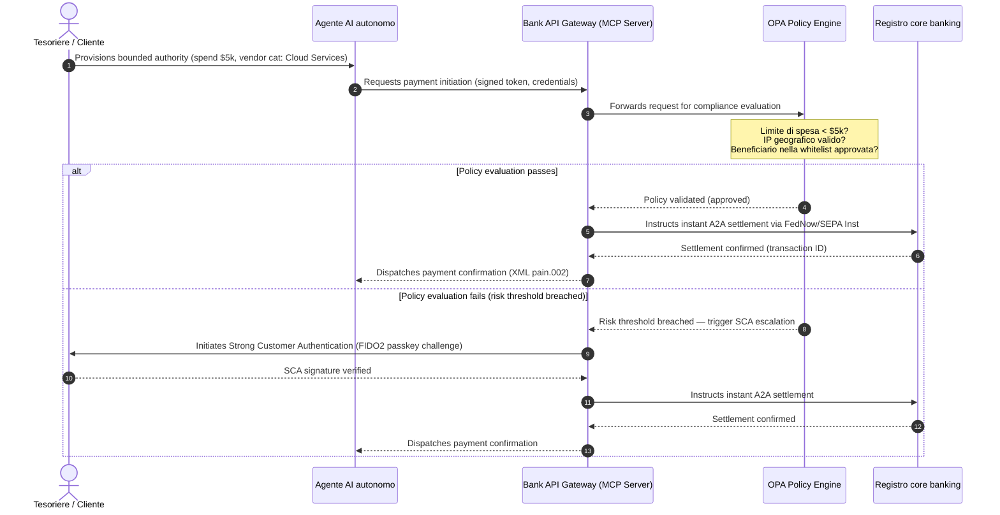

# Outlook dei Pagamenti Globali 2026: Modello Operativo, Rischio e Ricavi in un Mondo Agentico, Invisibile e in Tempo Reale

Il ciclo dei pagamenti globali 2026 è definito da tre forze convergenti — commercio agentico, pagamenti invisibili integrati ed esecuzione in tempo reale — che poggiano su un registro unificato tokenizzato nell'ambito di Project Agorá e su una migrazione SWIFT degli indirizzi strutturati con scadenza tassativa a novembre 2026.

<!-- lead-start -->
<aside class="post-lead" aria-label="Article summary">

<strong>In sintesi.</strong> Il panorama dei pagamenti 2026 è passato dalla migrazione dei messaggi a un modello operativo multidimensionale in cui rischio e ricavi sono dettati dall'esecuzione in tempo reale. L'articolo sintetizza gli outlook 2026 di J.P. Morgan, Global Payments, HSBC e Payments Association in un piano operativo G-SIB a quattro pilastri, che copre il commercio agentico iniziato da modelli, le API di tesoreria sempre attive, i registri unificati tokenizzati nell'ambito di BIS Project Agorá e la scadenza SWIFT degli indirizzi strutturati del 14 novembre 2026.

<strong>Punti chiave</strong>

<ul class="post-lead-takeaways">
  <li><strong>Il commercio agentico apre una frontiera di responsabilità delegata.</strong> Si stima che gli agenti AI autonomi mediano $3-$5 trillion di commercio annuo entro il 2030. Le banche devono definire il gatekeeping MCP, la delega SCA nell'ambito di PSD3/PSR e la titolarità di KYC/AML all'interno delle catene di pagamento multi-agente.</li>
  <li><strong>La liquidità sempre attiva è ora una base operativa e regolamentare.</strong> Le API di tesoreria 24/7 e i conti virtuali riducono al minimo la liquidità immobilizzata e alzano l'asticella della resilienza. Nell'ambito di DORA, i prodotti di liquidità in tempo reale devono poggiare su un'infrastruttura geo-ridondata e active-active con disponibilità del 99.999%.</li>
  <li><strong>La tokenizzazione è passata a registri unificati regolamentati.</strong> Project Agorá è il più ampio quadro pubblico-privato per i depositi tokenizzati delle banche commerciali e le riserve delle banche centrali. Le banche necessitano di un percorso di tokenizzazione in cinque passi, con un trattamento prudenziale esplicito.</li>
  <li><strong>La migrazione agli indirizzi strutturati del 14 novembre 2026 ha una data fissa.</strong> I campi di indirizzo postale non strutturati nei messaggi CBPR+ e SEPA innescheranno respingimenti immediati. Serve una governance dei dati pulita tra team di prodotto, tecnologia e compliance.</li>
</ul>

<strong>Letture correlate:</strong> <a href="https://sebastienrousseau.com/2026-06-23-iso-20022-pain001-programmable-liquidity-autonomic-treasury-2026">Da Pain.001 alla liquidità programmabile: ISO 20022 come sistema nervoso autonomo della tesoreria nel 2026</a>, <a href="https://sebastienrousseau.com/2026-06-24-cross-border-iso-20022-open-finance-tokenised-deposits-treasury-2026">Transfrontaliero 2026: ISO 20022, open finance e depositi tokenizzati nella tesoreria aziendale</a>, <a href="https://sebastienrousseau.com/2026-06-25-quantum-dawn-cib-kyberlib-quantum-resilient-payments-stack-2026">Alba quantistica per il CIB: da KyberLib a uno stack di pagamenti resiliente al quantum</a>.

</aside>
<!-- lead-end -->

Per le transaction bank globali, il ciclo 2026-2028 è una finestra strutturale. L'infrastruttura di pagamento moderna non è più un'utility amministrativa — è il nucleo della strategia tecnologica di livello bancario. All'interno delle G-SIB e delle principali istituzioni regionali, tecnologia, regolamentazione e aspettative dei clienti sono convergute su un unico piano operativo.

Tre forze definiscono questo ciclo, e ciascuna mappa direttamente su una preoccupazione del comitato esecutivo.

- **Commercio agentico** — distribuzione di canale, design di prodotto, attribuzione delle responsabilità e Model Risk Management sotto vigilanza supervisoria.
- **Pagamenti invisibili** — esperienza cliente, con rischio di disintermediazione laddove le banche non riescano a integrare il proprio registro nei front-end di imprese e commercianti.
- **Esecuzione in tempo reale** — velocità del capitale, con conseguente cambiamento nella gestione della liquidità, nel rischio di credito, nella resilienza operativa e nella difesa dalle frodi.

La posta finanziaria in gioco è rilevante. La frode cresce in velocità e sofisticazione; le scadenze regolamentari sono inderogabili; e le banche che modernizzano proattivamente i propri sistemi core sbloccano sostanziali opportunità di ricavi da commissioni. Il costo dell'inazione è opposto: respingimenti immediati delle transazioni, colli di bottiglia operativi, sanzioni regolamentari e rapida erosione della quota di mercato.

## La convergenza delle autorità globali dei pagamenti

Questo report sintetizza gli outlook 2026 su pagamenti e commercio di quattro voci autorevoli del settore — [J.P. Morgan Payments](https://www.jpmorgan.com/payments/newsroom/payments-outlook-2026-trends-report-released "J.P. Morgan Payments — Outlook 2026"), [Global Payments](https://investors.globalpayments.com/news-events/press-releases/detail/497/global-payments-releases-its-2026-commerce-and-payment "Global Payments — 2026 Commerce and Payment Trends Report"), HSBC e The Payments Association — e li triangola con la [G20 Roadmap per il miglioramento dei pagamenti transfrontalieri](https://www.fsb.org/2026/03/fsb-kicks-off-new-implementation-phase-to-enhance-cross-border-payments-through-public-private-partnership/ "FSB — fase di implementazione dei pagamenti transfrontalieri, marzo 2026").

Ogni organizzazione approccia l'ecosistema da un'angolazione di mercato diversa, ma i risultati convergono su tre invarianti.

1. **I rail istantanei e API-driven sono la base.** I modelli legacy di elaborazione batch sono marginalizzati per i flussi transfrontalieri e di importo elevato; la velocità delle transazioni in tali segmenti è dettata dalla messaggistica sempre attiva, in tempo reale.
2. **L'AI è al contempo minaccia e difesa.** Gli strumenti generativi e i deepfake amplificano la frode sulle transazioni, rendendo necessarie contro-difese in tempo reale, multi-stratificate e basate su machine learning.
3. **La tokenizzazione è infrastruttura pronta alla produzione.** I registri si stanno unificando per ospitare passività commerciali tokenizzate e valute digitali wholesale delle banche centrali.

| Report | Pubblico primario | Focus | Pilastro chiave | Implicazione per le banche |
| --- | --- | --- | --- | --- |
| **J.P. Morgan Payments** | Corporate treasurers, G-SIBs | Real-time liquidity, fraud | APIs, AI biometrics | Rebuild liquidity, FX, and risk systems for continuous 365-day settlement. |
| **Global Payments** | Merchants, e-commerce | POS evolution, omnichannel | Agentic commerce, frictionless checkout | Build secure, API-gated merchant payment corridors for autonomous AI agents. |
| **HSBC Insights** | Multinational corporates | ERP integrations (SAP/Oracle), real-time cash | Treasury-as-a-Service, cash visibility | Monetise transactional API suites and embed real-time cash ledger reporting at source. |
| **The Payments Association** | Fintechs, payment institutions | Stablecoins, tokenisation, global regulation | Regulated digital assets, policy compliance | Prepare balance sheets for tokenised deposits and navigate PSD3/PSR liability structures. |

I quattro outlook definiscono di fatto lo stack operativo del settore privato che gira sopra l'infrastruttura di policy pubblica del G20, traducendo le intenzioni regolatorie in decisioni concrete su liquidità, tokenizzazione, dati e controllo delle frodi all'interno delle banche.

## Pilastro 1 — Commercio agentico e pagamenti invisibili

Il commercio agentico è la transizione dal checkout click-to-buy guidato dall'uomo all'inizio di transazione autonomo, model-driven. Le previsioni di settore convergono su $3-$5 trillion di commercio annuo mediato da agenti autonomi entro il 2030 — una quota a singola cifra bassa del volume globale dei pagamenti eseguita senza che un umano clicchi 'compra'.

L'ecosistema retail e commerciale presenta una lacuna corrispondente. Una netta maggioranza dei consumatori si aspetta ormai pagamenti quasi senza attriti, eppure meno della metà dei commercianti ha dato priorità al checkout one-click o ai cataloghi prodotto accessibili via API. Gli agenti AI non possono navigare le schermate di checkout multi-pagina legacy progettate per gli occhi umani; necessitano di handshake API strutturati, machine-to-machine.

### Priorità bancarie e impatto operativo

- **Titolarità di KYC e AML.** Le banche devono definire chi detiene l'obbligo di conformità all'interno di una catena di transazione agentica. Se l'agente AI personale di un consumatore avvia una transazione tramite il checkout agentico di un commerciante, la banca deve verificare che l'autorità delegata originante sia crittograficamente vincolata al titolare primario del conto.
- **Ridisegno di responsabilità e storno.** I circuiti carta e i rail A2A sono stati progettati intorno all'autorizzazione umana. Quando un agente AI effettua un acquisto erroneo — ad esempio approvvigionando scorte industriali errate a causa di un errore di parsing dei dati — le banche devono allocare la responsabilità in modo chiaro tra consumatore, fornitore dell'agente e commerciante.
- **Risk-rating dei flussi agentici.** I motori di routing dei pagamenti devono assegnare dinamicamente un rating di rischio ai pagamenti agentici, applicando requisiti di riserva più elevati o tassi di interchange ai pagamenti non avviati da umani fino a quando non esiste uno storico stabile di regolamento.

### Azione delimitata e autorità delimitata

Per mitigare l'"azione non delimitata" — un agente di approvvigionamento aziendale che esegue un ciclo di acquisto ricorsivo infinito a causa di un bug software — le banche devono adottare **gate API ad autorità delimitata**. I gate impongono limiti a livello di policy su tre dimensioni.

1. **Limiti finanziari a fasce** — la spesa dell'agente è limitata per dimensione della transazione, valore cumulativo giornaliero e categoria del commerciante.
2. **Salvaguardie context-aware** — segnali secondari (ora del giorno, geolocalizzazione IP, frequenza delle transazioni) valutati prima che il registro rilasci i fondi.
3. **Escalation con human-in-the-loop** — l'autorizzazione umana obbligatoria è innescata tramite Strong Customer Authentication (SCA) nell'ambito di PSD3 / PSR ogni volta che una transazione supera le soglie di rischio.

La sequenza Mermaid sottostante mostra l'architettura target che molte banche riconosceranno come il flusso di pagamento agentico ad autorità delimitata.

### Il Model Context Protocol (MCP)

Per collegare i modelli AI localizzati ai livelli di esecuzione governati dalla banca, il settore si sta standardizzando attorno al [Model Context Protocol (MCP)](https://modelcontextprotocol.io "Model Context Protocol — standard aperto per l'integrazione di strumenti LLM") — un protocollo aperto che consente agli LLM di chiamare strumenti e API chiaramente delimitati e auditabili senza accesso diretto ai sistemi core.

Avvolgere le API bancarie (avvio del pagamento, interrogazione del saldo, verifica della controparte) all'interno di un server MCP tiene gli LLM lontani dalle tabelle del database e dai controlli di root del sistema. Il modello interagisce con il registro solo attraverso endpoint strutturati, auditati e rate-limited — sicurezza imposta al confine dell'esecuzione degli strumenti agentici anziché incorporata nel modello.

## Pilastro 2 — Trasformazione della tesoreria e liquidità ripensata

La velocità del transaction banking nel 2026 è scandita dal passaggio dall'elaborazione batch di fine giornata alle operazioni di tesoreria in tempo reale, sempre attive. Le multinazionali non tollerano più la liquidità immobilizzata — liquidità inattiva in conti locali nei weekend o nei giorni festivi perché i sistemi di regolamento sono chiusi.

### Il caso economico della liquidità in tempo reale

Sia J.P. Morgan sia HSBC riportano che le imprese con capacità avanzate di cash e dati in tempo reale hanno probabilità materialmente più alte di sovraperformare i pari su crescita dei ricavi ed efficienza del capitale, principalmente riducendo la liquidità immobilizzata e ottimizzando i cicli del capitale circolante.

Per catturare quel valore, le banche distribuiscono **prodotti API Treasury-as-a-Service (TaaS)** che consentono agli ERP aziendali (SAP, Oracle) di collegarsi direttamente al registro della banca.

- **API di saldo in tempo reale** basate sullo schema `camt.052` — sostituiscono i protocolli di trasferimento file con reporting di posizione di cassa istantaneo, event-driven.
- **API di avvio pagamenti in massa** basate su `pain.001` — esecuzione diretta, straight-through, di batch di pagamenti ai fornitori dal registro ERP.
- **API FX continue** — i motori di tesoreria bloccano tassi di cambio algoritmici in tempo reale per il regolamento transfrontaliero, eliminando il rischio di gap di mercato notturno.
- **API di conti virtuali** — le imprese aprono e dismettono dinamicamente migliaia di sotto-conti per la riconciliazione automatica dei crediti e la separazione del registro.

### Resilienza operativa e DORA

Offrire liquidità sempre attiva trasforma il profilo di rischio della banca. La piattaforma deve mantenere **disponibilità operativa del 99.999%** sotto carico continuo, in tempo reale.

Nell'ambito del [Digital Operational Resilience Act (DORA)](https://eur-lex.europa.eu/legal-content/EN/TXT/?uri=CELEX%3A32022R2554 "Regolamento (UE) 2022/2554 — Digital Operational Resilience Act"), non si tratta di un KPI IT — è un requisito regolamentare rigoroso. I supervisori si aspettano che le banche dimostrino che la superficie API della tesoreria in tempo reale e il database del registro siano in grado di assorbire cyber-attacchi gravi-ma-plausibili, interruzioni di rete e disservizi degli hyperscaler senza interrompere pagamenti critici né compromettere la liquidità sistemica. Ciò richiede architetture database multi-cloud geo-ridondate e active-active, livelli di rilevamento minacce in tempo reale e failover automatizzato — visibili nella voce di costo del cambiamento, non solo nel dossier di audit.

### FX continui e innovazione transfrontaliera

La tesoreria in tempo reale non può vivere all'interno di un perimetro mono-valuta. Le G-SIB stanno dispiegando un'infrastruttura FX continua — la piattaforma [Wire 365](https://www.jpmorgan.com/insights/payments/fx-cross-border/wire-365-global-clearing "J.P. Morgan — Wire 365 global clearing reinvented") di J.P. Morgan elabora pagamenti transfrontalieri e conversioni FX qualunque giorno dell'anno, oltre i tradizionali orari RTGS delle banche centrali. Quel livello si incastra direttamente con i sistemi di depositi tokenizzati e di registro unificato discussi nel Pilastro 3.

## Pilastro 3 — Depositi tokenizzati e il registro unificato

La tokenizzazione è passata da pilot isolati di proof-of-concept a infrastruttura monetaria di livello bancario, scalata. Il focus si è spostato dalle stablecoin private e dai cryptoasset speculativi ai **depositi tokenizzati delle banche commerciali** e alle **valute digitali wholesale delle banche centrali (wCBDC)** che girano su registri unificati programmabili.

Il quadro di riferimento è [Project Agorá](https://www.bis.org/about/bisih/topics/fmis/agora.htm "BIS Project Agorá — tokenizzazione dei pagamenti wholesale transfrontalieri") — una rilevante collaborazione pubblico-privata convocata da BIS e IIF, che coinvolge sette banche centrali e oltre 40 istituzioni finanziarie private. Il progetto esplora come i depositi tokenizzati delle banche commerciali si integrino con le CBDC wholesale tokenizzate su un registro programmabile condiviso per eliminare l'attrito di regolamento transfrontaliero, coordinare i controlli di compliance e abilitare la finalità atomica 24/7.

### Il percorso di tokenizzazione in cinque passi

Per le G-SIB e le principali banche regionali, la tokenizzazione è un percorso a tappe dall'ottimizzazione interna all'interoperabilità di mercato aperto.

1. **Liquidità di tesoreria interna** — tokenizzare i saldi di cassa aziendali interni (es. JPM Coin o registri privati bancari equivalenti) per abilitare trasferimenti e netting transfrontaliero istantanei, 24/7, tra le filiali della banca stessa.
2. **Corridoi multi-banca delimitati** — consorzi chiusi e regolamentati (la sandbox di Project Agorá) per testare il regolamento interbancario e lo stato condiviso del registro tra istituzioni distinte.
3. **FX programmabile continuo** — gli smart contract sul registro unificato eseguono FX Payment-versus-Payment (PvP) istantaneo, eliminando il rischio di regolamento tra fusi orari.
4. **Asset reali tokenizzati (RWA)** — la gamba di cassa tokenizzata si integra con registri di titoli, debito o trade tokenizzati per la finalità Delivery-versus-Payment (DvP) istantanea, riducendo il blocco di capitale da giorni a millisecondi.
5. **Interoperabilità pubblica/ibrida regolamentata** — gateway wrapper sicuri consentono alla liquidità istituzionale di interagire in modo sicuro con reti pubbliche aperte.

### Implicazioni prudenziali e di bilancio

La cassa tokenizzata va navigata con cautela attraverso i quadri prudenziali. I supervisori sottolineano che un deposito tokenizzato deve essere economicamente equivalente a un tradizionale deposito di banca commerciale — vale a dire una passività non garantita nel bilancio della banca con la stessa copertura assicurativa sui depositi.

Sul piano operativo, i depositi tokenizzati introducono rischi che i modelli classici di stress di liquidità non erano stati costruiti per simulare. Gli smart contract eseguono prelievi programmabili a velocità e volumi che le assunzioni legacy non catturano. Nell'ambito di Basel III, le banche devono garantire che il motore di rischio possa modellare run-off di cassa programmabili e che il registro tokenizzato interoperi in modo pulito con i sistemi RTGS legacy lungo il ciclo di liquidità giornaliero.

### Stablecoin vs depositi tokenizzati — una posizione sfumata

Le stablecoin private a riserva piena (USDC, ecc.) continuano a guadagnare quota di mercato nelle rimesse transfrontaliere retail e nel commercio decentralizzato, ma mancano della capacità di creazione del credito e della finalità di regolamento del sistema bancario commerciale.

Anziché competere sui rail retail, le transaction bank stanno costituendo servizi di custodia, emettendo i propri strumenti di passività tokenizzati regolamentati e costruendo gateway on-/off-ramp sicuri. I clienti aziendali ottengono flessibilità di programmazione mantenendo il capitale all'interno del perimetro regolamentato.

### Domande che un board dovrebbe porsi sulla moneta tokenizzata

- **Partecipazione al registro unificato.** Qual è la nostra roadmap strategica attiva per partecipare alle iniziative di registro unificato wholesale pubblico-private come Project Agorá?
- **Bilancio e modellazione del rischio.** I nostri motori di rischio e i quadri di adeguatezza patrimoniale hanno aggiornato gli stress test per tenere conto della velocità dei run-off di token innescati da smart contract?
- **Segmenti di clientela first-mover.** Quali tra i nostri segmenti di tesoreria aziendale e di commercial banking trarrebbero beneficio immediato dal regolamento programmabile, tokenizzato, DvP/PvP?

## Pilastro 4 — Dati strutturati e difesa dalle frodi

La conformità infrastrutturale nel 2026 è dominata dalla **migrazione agli indirizzi strutturati del 14 novembre 2026** stabilita nell'ambito della [SWIFT Standards Release (SR) 2026](https://www.swift.com/standards/iso-20022/removal-unstructured-address "SWIFT — Rimozione dell'indirizzo non strutturato, novembre 2026"). Da quella data, le reti di pagamento CBPR+ e SEPA smettono di accettare blocchi di indirizzo postale interamente non strutturati, a testo libero (`<AdrLine>`) nei messaggi di pagamento. Qualsiasi messaggio transfrontaliero o domestico che trasporti un indirizzo non strutturato dove sono attesi elementi strutturati sarà ritardato o respinto dalla rete.

La maggior parte delle istituzioni conosce la data. Molte la trattano come un esercizio di mappatura superficiale al livello di interfaccia. La realtà è una sfida più profonda di qualità e governance dei dati. Per evitare tassi di respinta catastrofici, le operations dei pagamenti necessitano di un quadro di governance cross-funzionale chiaro.

- **Prodotto e operations.** Cattura dei dati alla sorgente. I portali digitali rivolti al cliente, le interfacce di onboarding e i campi di input degli ERP aziendali devono imporre campi di indirizzo strutturati (`<StrtNm>`, `<PstCd>`, `<TwnNm>`, `<Ctry>`) al punto di avvio del pagamento.
- **Tecnologia.** Parsing, mappatura, validazione dello schema. I motori di validazione bloccano i file legacy prima che raggiungano l'interfaccia SWIFT. I modelli di machine learning distribuiti localmente effettuano il parsing dei blocchi legacy di indirizzo non strutturato in tag XML conformi sotto `<PstlAdr>`.
- **Compliance e rischio.** Lo screening sanzioni, il transaction monitoring e la logica AML sono aggiornati per ingerire i campi XML strutturati — abbattendo i tassi di falsi positivi e le investigazioni manuali.

### Il business case dei dati strutturati

Trattato come un costo di compliance, il programma sui dati strutturati è costoso. Trattato come un abilitatore di ricavi, si ripaga da solo.

1. **Decisioni di credito avanzate.** I dati strutturati di fattura, remittance e debitore ultimo consentono alle banche di costruire programmi automatizzati e precisi di finanziamento del capitale circolante e di factoring delle fatture di filiera per i clienti aziendali.
2. **Riconciliazione automatica dei crediti.** Esporre identificatori strutturati di controparte e fattura supporta prodotti premium di riconciliazione di cassa e pooling di conti virtuali, generando nuovi ricavi da commissioni di transazione.
3. **Analytics di transazione monetizzabili.** Le banche confezionano e vendono dashboard granulari di analytics in tempo reale su liquidità e pattern di acquisto a CFO e tesorieri aziendali.

### Una difesa antifrode AI stratificata

Man mano che le velocità di transazione accelerano al tempo reale, le tecniche di frode si sono scalate. Ricerche recenti indicano che i deepfake rappresentano circa il 40 % dei tentativi di frode biometrica, con i media sintetici utilizzati sempre più per aggirare i controlli di riconoscimento vocale e facciale nei flussi di onboarding e pagamento.

La difesa è un **modello antifrode AI a tre livelli**.

1. **Livello identità.** Passkey [FIDO2](https://fidoalliance.org/fido2/ "FIDO Alliance — specifica FIDO2") verificate biometricamente, binding hardware del dispositivo firmato crittograficamente e wallet di ID digitale decentralizzati per mettere in sicurezza l'accesso al pagamento.
2. **Livello comportamentale.** Biometria comportamentale continua — ritmo di navigazione della sessione, cadenza di digitazione, orientamento del dispositivo — per rilevare esecuzione automatizzata da bot o tentativi di session-hijack.
3. **Livello transazione.** I campi strutturati di ISO 20022 alimentano motori di rischio di machine learning in tempo reale, incrociando i metadati di transazione con l'intelligence consorzio a livello di rete per identificare transazioni sospette entro millisecondi dall'avvio.

Per soddisfare i supervisori, i modelli AI del livello transazione incorporano rigorosi **parametri di spiegabilità** e operano nell'ambito di un programma dedicato di Model Risk Management (MRM). I regolatori si aspettano che le banche spieghino i punti dati specifici e la logica algoritmica che hanno innescato un blocco automatizzato o un alert di frode, in linea con [US Federal Reserve SR 11-7](https://www.federalreserve.gov/frrs/guidance/supervisory-guidance-on-model-risk-management.htm "US Federal Reserve — Supervisory Guidance on Model Risk Management, SR 11-7") e con la [PRA SS1/23](https://www.bankofengland.co.uk/prudential-regulation/publication/2023/may/model-risk-management-principles-for-banks-ss "Bank of England PRA SS1/23 — Model Risk Management principles for banks") della Bank of England.

## Agenda di consiglio 2026-2028

Per eseguire lungo i quattro pilastri, i corpi di gestione delle G-SIB e delle banche regionali dovrebbero organizzare gli investimenti operativi e tecnologici lungo una roadmap chiara a tre orizzonti.

### Orizzonte 1 — Conformità immediata e hardening del core (0-12 mesi)

- **Focus.** Standardizzare la qualità dei dati ISO 20022 e mettere in sicurezza i percorsi di transazione di base in tempo reale.
- **Indicatore di successo (KPI).** Zero respingimenti per indirizzo non strutturato su SWIFT e SEPA dopo la migrazione del 14 novembre 2026.
- **Owner esecutivo.** Chief Operating Officer / Head of Payment Operations.
- **Tipo di deliverable.** Mossa senza rimpianti. Aggiornamenti dello schema del database core e il motore di validazione SWIFT SR 2026.

### Orizzonte 2 — Automazione e safeguard agentici (12-24 mesi)

- **Focus.** Gate API agentici delimitati e architettura di difesa antifrode continua.
- **Indicatore di successo (KPI).** 100 % delle transazioni API machine-to-machine e iniziate da AI validate tramite binding hardware FIDO2 e motori di policy ad autorità delimitata.
- **Owner esecutivo.** Chief Information Officer / Chief Risk Officer.
- **Tipo di deliverable.** Mossa senza rimpianti (difesa antifrode) più opzione strategica (commercio agentico). Rollout MCP e antifrode AI a tre livelli.

### Orizzonte 3 — Tokenizzazione di piattaforma e registri unificati (24-36 mesi)

- **Focus.** Far transitare gli asset di tesoreria verso depositi tokenizzati e partecipare a registri transfrontalieri condivisi.
- **Indicatore di successo (KPI).** Almeno il 15 % del volume di regolamento di tesoreria aziendale di importo elevato processato nativamente tramite strumenti di deposito tokenizzati o accordi di registro unificato (es. i corridoi di Project Agorá).
- **Owner esecutivo.** Group Treasurer / Head of Transaction Banking.
- **Tipo di deliverable.** Opzione strategica. Infrastruttura di registro programmabile, regole di liquidità basate su smart contract, adattatori di regolamento DvP/PvP.

## FAQ

**Il commercio agentico raggiungerà davvero $3-$5 trillion entro il 2030?**
La baseline McKinsey indica $5 trillion in vendite di commercio agentico entro il 2030, con un range di previsioni indipendenti che si concentra tra $3 trillion e $5 trillion. La varianza riflette quanto aggressivamente i commercianti rilascino API di checkout leggibili da macchine e quanto rapidamente le banche consentano agli agenti di transare nell'ambito della delega SCA — il collo di bottiglia è dal lato banca e commerciante, non sulla capacità dell'agente.

**La migrazione SWIFT del 14 novembre 2026 si applica anche ai flussi SEPA domestici?**
Sì. Il requisito di indirizzo strutturato si applica al transfrontaliero CBPR+ e ai messaggi di pagamento SEPA. Le banche che operano su entrambi i rail necessitano di un unico schema canonico di indirizzo a monte dell'interfaccia SWIFT, non di due mappature parallele.

**Un deposito tokenizzato è lo stesso di una stablecoin?**
No. Un deposito tokenizzato è una passività non garantita nel bilancio di una banca regolamentata, con la stessa copertura assicurativa sui depositi di un deposito tradizionale. Una stablecoin è tipicamente uno strumento a riserva piena emesso da un non-banca, senza capacità di creazione del credito. Il design di Project Agorá assume che i depositi tokenizzati coesistano con le CBDC wholesale su un registro programmabile condiviso; le stablecoin non figurano nella gamba di regolamento wholesale.

**Come si relaziona Project Agorá ai pilot wCBDC esistenti?**
Agorá è il quadro integratore. Gli esperimenti nazionali su wCBDC coprono la gamba di moneta della banca centrale; Agorá porta i depositi commerciali tokenizzati sullo stesso registro programmabile, in modo che il regolamento transfrontaliero sia atomico tra entrambi i tipi di moneta. Le sette banche centrali partecipanti e oltre 40 istituzioni private ne fanno il più ampio terreno di progettazione pubblico-privato per l'architettura di moneta tokenizzata wholesale.

**Qual è la postura minima di conformità DORA per un'API TaaS?**
Deployment geo-ridondato active-active, scenari cyber gravi-ma-plausibili documentati con titolari nominati nell'ambito di SM&CR (UK), e un failover testato che non interrompa pagamenti critici. Senza ciò, il prodotto TaaS è una passività regolamentare prima di essere una linea di ricavo.

## Riferimenti

- Bank for International Settlements (BIS) Innovation Hub. (2026). *Project Agorá: exploring tokenisation of wholesale cross-border payments*. [BIS Project Agorá](https://www.bis.org/about/bisih/topics/fmis/agora.htm).
- Deutsche Bank. (2026). *Digital Money: a perspective on stablecoins, tokenised deposits and CBDCs*. [Deutsche Bank Flow](https://flow.db.com/publications/flow-white-papers-and-guides/digital-money-a-perspective-on-stablecoins-tokenised-deposits-and-cbdcs).
- European Parliament and Council. (2022). *Regulation (EU) 2022/2554 on Digital Operational Resilience (DORA)*. [DORA Regulation](https://eur-lex.europa.eu/legal-content/EN/TXT/?uri=CELEX%3A32022R2554).
- Financial Stability Board. (2026). *FSB kicks off new implementation phase to enhance cross-border payments*. [FSB statement](https://www.fsb.org/2026/03/fsb-kicks-off-new-implementation-phase-to-enhance-cross-border-payments-through-public-private-partnership/).
- Global Payments. (2025). *2026 Commerce and Payment Trends Report — press release*. [Global Payments press release](https://investors.globalpayments.com/news-events/press-releases/detail/497/global-payments-releases-its-2026-commerce-and-payment).
- J.P. Morgan Payments. (2026). *Payments Outlook 2026 Trends Report Released*. [J.P. Morgan Newsroom](https://www.jpmorgan.com/payments/newsroom/payments-outlook-2026-trends-report-released).
- J.P. Morgan Insights. (2026). *5 Payment Trends to Watch for in 2026*. [J.P. Morgan Trends](https://www.jpmorgan.com/insights/payments/trends-innovation/five-payment-trends-in-2026).
- J.P. Morgan FX & Cross-Border. (2026). *Wire 365: Global Clearing Reinvented*. [J.P. Morgan FX Wire 365](https://www.jpmorgan.com/insights/payments/fx-cross-border/wire-365-global-clearing).
- SWIFT. (2026). *ISO 20022 milestone for November 2026: unstructured addresses to be removed*. [SWIFT ISO 20022 Milestone](https://www.swift.com/news-events/news/iso-20022-milestone-november-2026-unstructured-addresses-be-removed).
- SWIFT Standards. (2026). *Removal of unstructured address*. [SWIFT Standards](https://www.swift.com/standards/iso-20022/removal-unstructured-address).
- Bank of England. (2023). *Supervisory Statement (SS1/23) — Model Risk Management principles for banks*. [Bank of England PRA SS1/23](https://www.bankofengland.co.uk/prudential-regulation/publication/2023/may/model-risk-management-principles-for-banks-ss).
- US Federal Reserve. (2011). *Supervisory Guidance on Model Risk Management (SR 11-7)*. [SR 11-7](https://www.federalreserve.gov/frrs/guidance/supervisory-guidance-on-model-risk-management.htm).
- McKinsey & Company. (2025). *McKinsey forecast: $5 trillion in agentic commerce sales by 2030* (via Digital Commerce 360). [McKinsey agentic forecast](https://www.digitalcommerce360.com/2025/10/20/mckinsey-forecast-5-trillion-agentic-commerce-sales-2030/).
- HSBC Business. (2026). *HSBC Business Insights*. [HSBC Insights](https://www.business.hsbc.com/en-gb/insights).
- Bright Defense. (2026). *Deepfake Statistics: A Growing Security Concern*. [Deepfake fraud statistics](https://www.brightdefense.com/resources/deepfake-statistics/).
- European Banking Authority. (2019). *Guidelines on outsourcing arrangements (EBA/GL/2019/02)*. [EBA Outsourcing Guidelines](https://www.eba.europa.eu/regulation-and-policy/internal-governance/guidelines-on-outsourcing-arrangements).

<!-- enrich-start -->
<aside class="author-card" aria-label="About the author"><strong class="author-card-name"><a href="/about/index.html">Sebastien Rousseau</a></strong>Senior banking technologist che scrive su AI applicata, migrazione ISO 20022, crittografia post-quantum per i servizi finanziari e la trasformazione strutturale dei pagamenti wholesale.Oltre 20 anni in HSBC Commercial &amp; Investment Bank, PayPal, Barclays, Shazam, AKQA, Virgin Group. <a href="/about/index.html">Profilo completo</a> &middot; <a href="https://www.linkedin.com/in/sebastienrousseau/" rel="external noopener">LinkedIn</a> &middot; <a href="https://github.com/sebastienrousseau" rel="external noopener">GitHub</a></aside>

Ultima revisione <time datetime="2026-06-25">2026-06-25</time>.

<!-- enrich-end -->
