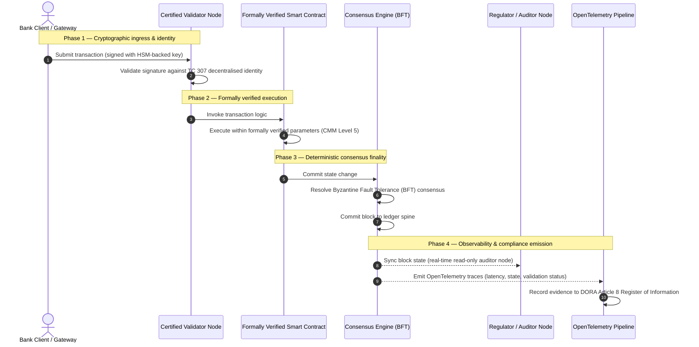

# Dalla prova alla verità: perché le blockchain certificate definiranno la prossima era della fiducia bancaria

## Sintesi strategica (in breve)

Il banking all'ingrosso e le transazioni globali si trovano, nel 2026, a un punto di svolta storico. Mentre i servizi finanziari migrano verso reti di compensazione nativamente digitali e in tempo reale, e mentre l'intelligenza artificiale introduce un non determinismo probabilistico, i modelli di assurance tradizionali — analogici e retrospettivi (come gli audit statici basati sull'entità) — non soddisfano più le moderne esigenze di gestione del rischio e di responsabilità fiduciaria.

Il Comitato Tecnico ISO/IEC TC 307 ha stabilito una base normalizzata per le tecnologie di registro distribuito. Tuttavia, una vera adozione istituzionale richiede il passaggio da un orientamento descrittivo a un'assurance della blockchain prescrittiva e certificabile in modo indipendente. Valutando la governance del registro, l'integrità del consenso, la sicurezza degli smart contract e l'agilità crittografica rispetto a un rigoroso Modello di Maturità delle Capacità (CMM) a cinque livelli, le banche possono passare da ipotesi disomogenee e specifiche di ciascun fornitore a una verità finanziaria certificabile e verificabile dal consiglio.

## Punti chiave

* **Il divario di attrito fiduciario**: oggi sappiamo certificare la banca (Basilea III), il cloud (ISO 27001) e i sistemi di governance dell'IA (ISO 42001), ma non sappiamo ancora certificare il registro distribuito che sempre più determina ciò che è vero. Questa asimmetria è una vulnerabilità operativa di primo piano.  
* **DORA impone una responsabilità fiduciaria diretta**: ai sensi dell'articolo 5 di DORA, i consigli di amministrazione delle banche assumono una responsabilità personale diretta e non delegabile per la resilienza operativa di tutti i deployment di terze parti e di registro, con severe sanzioni personali nell'ambito del regime SM&CR in caso di inadempienza.  
* **La spina dorsale di audit dell'IA**: laddove il machine learning produce risultati probabilistici e non riproducibili, una blockchain certificata fornisce un'acquisizione deterministica dello stato. Registrare on-chain le versioni dei modelli, gli input e le decisioni di validazione soddisfa la ISO 42001 e gli standard di gestione del rischio di modello.  
* **L'Indice delle Blockchain Certificate**: questo indice formalizza governance, consenso, smart contract e osservabilità in una scorecard verificabile e pronta per l'audit, su una scala CMM da 0 a 5, traducendo metriche ingegneristiche in dichiarazioni di propensione al rischio approvate dal consiglio.

## 01. Il divario di attrito fiduciario nel banking digitale

Nel banking classico, la fiducia è relazionale, istituzionale e retrospettiva. Dipende da revisori terzi indipendenti che esaminano lo stato finanziario in istanti fissi, riconciliando le discrepanze tra silos di registri bilaterali. Nei mercati in tempo reale e guidati dalle API del 2026, questo modello introduce latenze proibitive e rischi strutturali.

Quando le transazioni si regolano istantaneamente, le riserve di liquidità infragiornaliera sono gestite dinamicamente da gateway di API e la proprietà degli asset è tokenizzata su registri condivisi, gli audit retrospettivi diventano esercizi forensi anziché controlli preventivi. I fiduciari non possono più limitarsi a certificare l'entità giuridica. Devono certificare il substrato digitale stesso.

Attualmente, le banche operano in un'evidente asimmetria architetturale:

1. **Infrastruttura cloud certificata**: i nodi hardware, i container virtualizzati e i data center fisici sono validati rispetto ai controlli ISO/IEC 27001 e SOC 2 Type II.  
2. **Processi di gestione certificati**: le politiche di rischio operativo, i piani di continuità operativa e i deployment algoritmici sono governati da rigorosi framework di rischio.  
3. **Motori di registro non certificati**: i meccanismi di consenso distribuito, le catene di fornitura dei nodi validatori, i confini degli smart contract e i modelli di governance della rete sono lasciati a ipotesi non certificate, su misura o specifiche del consorzio.

Questa asimmetria è un punto di guasto critico. Una banca può eseguire un'applicazione validata all'interno di un container cloud sicuro e certificato ISO 27001, ma se quel container scrive su un registro distribuito con controllo centralizzato dei validatori, parametri di consenso vulnerabili o smart contract non verificati, l'integrità della transazione è compromessa. Per colmare questo divario, il motore di registro stesso deve diventare un oggetto di assurance certificabile.

## 02. La base di normalizzazione ISO/IEC TC 307

Il lavoro fondamentale necessario a normalizzare i registri distribuiti è svolto dal Comitato Tecnico ISO/IEC TC 307 (Tecnologie di blockchain e di registro distribuito). Anziché trattare la blockchain come un protocollo tecnico isolato, il TC 307 la affronta come un'infrastruttura di fiducia istituzionale, organizzando il proprio lavoro attorno a cinque pilastri fondamentali:

1. **Tassonomia e vocabolario (ISO 22739)**: stabilisce una nomenclatura comune, garantendo definizioni giuridiche e operative coerenti tra giurisdizioni, schemi finanziari e istituzioni.  
2. **Architettura di riferimento (ISO/TR 23245)**: definisce i confini, gli strati, i flussi di dati e i componenti funzionali di un sistema di registro distribuito conforme.  
3. **Sicurezza, privacy e smart contract (ISO/TR 23244 / ISO 23613)**: stabilisce linee guida di sicurezza di base per i sistemi di asset digitali e dettaglia le migliori pratiche per la mitigazione delle vulnerabilità degli smart contract e la governance del loro ciclo di vita.  
4. **Framework di interoperabilità**: affronta i meccanismi di scambio di dati e asset tra reti di registro eterogenee, prevenendo la formazione di silos tokenizzati isolati.  
5. **Identità decentralizzata e ancore di fiducia**: integra gli identificatori crittografici basati sul registro con infrastrutture a chiave pubblica (PKI) formali e registri autorizzati dallo Stato.

Nel complesso, il TC 307 segna il passaggio della DLT da una scelta ingegneristica su misura a una disciplina architetturale normalizzata. Tuttavia, il TC 307 resta essenzialmente descrittivo. Definisce come appare l'eccellenza (orientamento), ma non fornisce il protocollo di verifica prescrittivo (assurance) di cui i responsabili del rischio e i supervisori hanno bisogno per autorizzare i deployment in produzione di funzioni critiche o importanti (CIF).

## 03. Orientamento contro assurance: la distinzione fiduciaria

I partecipanti ai mercati finanziari non adottano una tecnologia perché è innovativa o elegante; la adottano quando può essere governata, verificata, difesa e riconciliata con i requisiti di riserva di capitale. Per questo la normalizzazione bancaria si risolve naturalmente in due strati:

* **Orientamento (il framework)**: delinea le migliori pratiche, gli obiettivi di riferimento e le linee guida architetturali (ad es. ISO/IEC TC 307, framework del NIST).  
* **Assurance (la prova)**: fornisce evidenze indipendenti, continue e verificabili da terzi che il framework è implementato e funziona come previsto (ad es. certificazione ISO 27001, audit SOC 2, esami regolamentari).

Affidarsi a un consenso di registro non certificato mentre si certifica l'infrastruttura cloud è una lacuna regolamentare critica. Una blockchain "immutabile" non è necessariamente "istituzionalmente affidabile". L'immutabilità garantisce solo che il dato inserito resti invariato; non verifica che i nodi validatori siano sicuri, che il protocollo di consenso sia resiliente alla collusione, che la logica degli smart contract sia matematicamente solida o che la gestione delle chiavi crittografiche rispetti i mandati post-quantistici.

Per colmare questo divario, l'Indice delle Blockchain Certificate 2026 formalizza questi requisiti in un Modello di Maturità delle Capacità (CMM) quantificabile, mappato sulle normative bancarie mondiali.

## 04. L'Indice delle Blockchain Certificate 2026

Per consentire all'alta dirigenza di valutare e certificare le proprie piattaforme di registro, questo indice struttura l'infrastruttura di registro distribuito in cinque strati operativi verificabili, valutati su una scala CMM da 0 a 5.

## Tabella 1: l'architettura dell'Indice delle Blockchain Certificate

| Strato dell'indice | Livello di maturità (CMM) | Metrica tecnica e operativa | Riferimento di controllo regolamentare / fiduciario |
| ---- | ---- | ---- | ---- |
| **Governance del registro** | **Livello 0**: consorzio ad hoc**Livello 3**: verifica e rotazione automatizzate dei validatori**Livello 5**: ancoraggio dell'identità crittografica decentralizzato e multiparte | % di nodi validatori gestiti da entità finanziarie verificate; tempo medio di risoluzione delle controversie tra validatori; distribuzione geografica dei nodi | **DORA articolo 5** (Governance e organizzazione); **CPMI-IOSCO PFMI Principio 2** (Governance) e **Principio 3** (Quadro per la gestione integrale dei rischi) |
| **Integrità del consenso** | **Livello 0**: nodo singolo o PoW opaco**Livello 3**: BFT verificato con finalità deterministica**Livello 5**: consenso multi-giurisdizionale, formalmente verificato, con monitoraggio continuo della latenza | latenza di consenso massima tollerabile; soglia di resistenza alla collusione; SLA di disponibilità in caso di partizione simulata dei nodi | **DORA articolo 6** (Quadro di gestione del rischio ICT); **CPMI-IOSCO PFMI Principio 8** (Definitività del regolamento) |
| **Identità e crittografia** | **Livello 0**: chiavi RSA / ECDSA deboli**Livello 3**: multi-firma con gestione delle chiavi supportata da HSM**Livello 5**: chiavi ibride resistenti al quantum (FIPS 203 ML-KEM) e gate di privacy a conoscenza zero | % di transazioni del registro firmate con chiavi supportate da HSM; punteggio di prontezza alla migrazione PQC; latenza delle prove ZK | **NIST FIPS 203 / 204**; **ISO/IEC 27001** (Gestione della sicurezza delle informazioni) |
| **Assurance degli smart contract** | **Livello 0**: script Solidity non verificati**Livello 3**: validazione automatizzata del compilatore e audit esterno**Livello 5**: smart contract immutabili e formalmente verificati, con aggiornamenti a interruttore | % di smart contract con verifica formale matematica; numero di avvisi del compilatore; copertura delle scansioni di vulnerabilità | **Linee guida EBA sull'esternalizzazione** (paragrafi 81, 113-117); **DORA articolo 30** (Clausole contrattuali minime) |
| **Audit e osservabilità** | **Livello 0**: estrazione manuale dei log**Livello 3**: tracce OTel strutturate e nodi revisori in sola lettura**Livello 5**: riconciliazione automatizzata e continua con il registro dell'articolo 8 | % di transazioni coperte da tracce OpenTelemetry; latenza dal commit del blocco alla sincronizzazione del nodo revisore | **BCBS 239** (Aggregazione dei dati di rischio); **DORA articolo 8** (Registro delle informazioni / schemi ITS) |

## Tabella 2: segnali di fiducia chiave mappati sugli standard bancari mondiali

| Segnale / benchmark | Metrica | Impatto sulle piattaforme bancarie | Fonte regolamentare |
| ---- | ---- | ---- | ---- |
| **Progressi ISO/IEC TC 307** | Passaggio dai rapporti tecnici ISO/TR a schemi di certificazione formali | Stabilisce il primo framework normalizzato per certificare i motori di registro distribuito | **ISO/IEC JTC 1 / SC 44** (Tecnologie di registro distribuito) |
| **Fase prototipo del Progetto Agorá** | Oltre 40 banche commerciali partecipanti; test di un registro unificato di depositi tokenizzati | Sposta la compensazione transfrontaliera dalla messaggistica (SWIFT) al regolamento atomico tokenizzato | **Innovation Hub della Banca dei Regolamenti Internazionali (BRI)** |
| **Audit di terze parti DORA articolo 30** | 100 % dei fornitori di nodi e degli host di infrastruttura verificati secondo criteri di sicurezza | Elimina i "nodi validatori ombra"; impone la totale trasparenza della catena di fornitura | **Autorità europee di vigilanza (AEV)** |
| **ISO/IEC 42001 (governance dell'IA)** | Log dei modelli e dell'addestramento dell'IA resi immutabili crittograficamente on-chain | Impiega la blockchain come registro probatorio immutabile ("spina dorsale di audit") per il machine learning | **ISO/IEC 42001:2023** (Tecnologia dell'informazione — Intelligenza artificiale) |
| **Adeguatezza patrimoniale Basilea III** | Riduzione dei buffer di capitale per rischio operativo basata su una riduzione documentata della complessità | I framework normalizzati di rischio operativo riconoscono direttamente la resilienza verificata del registro | **Comitato di Basilea per la vigilanza bancaria (BCBS)** |

## 05. La "spina dorsale di audit" dell'IA: intelligenza probabilistica su infrastruttura deterministica

Uno dei ruoli strategici più potenti di una blockchain certificata nel 2026 è agire come **"spina dorsale di audit"** dei deployment di intelligenza artificiale. I sistemi finanziari moderni sono sempre più probabilistici. Il credit scoring, il rilevamento delle frodi in tempo reale, il trading algoritmico e le interazioni autonome con i clienti sono guidati da modelli di machine learning che evolvono, derivano e si adattano nel tempo. Questi modelli sono non deterministici: dato lo stesso input in due momenti diversi, possono produrre output differenti a causa di pesi dinamici e di un addestramento continuo.

Questo non determinismo pone una profonda sfida di governance ai sensi della **ISO/IEC 42001 (governance dell'IA)** e degli standard di gestione del rischio di modello (MRM) (come la **SR 11-7 della Federal Reserve statunitense** e la **SS1/23 della PRA britannica**): *come si verificano, spiegano e difendono decisioni che non sono strettamente riproducibili?*

Un registro distribuito certificato fornisce il contrappeso deterministico. Laddove i modelli di IA operano in modo probabilistico, la blockchain certificata ne registra i parametri in modo deterministico, stabilendo una spina dorsale probatoria inalterabile:

* **Versionamento dei modelli e ancoraggio dei pesi**: ogni versione del modello distribuita, i pesi associati e i checksum dei dati di addestramento vengono sottoposti a hash e scritti sul registro al momento della build, soddisfacendo i requisiti di catena di fornitura **SLSA Level 3**.  
* **Registrazione contestuale degli input**: quando un modello di IA esegue una decisione critica (ad es. approvare un prestito o segnalare una transazione), gli input contestuali esatti e gli hash del modello vengono scritti sul registro, creando uno storico a prova di manomissione.  
* **Verificabilità senza accesso al codice**: se un'autorità di vigilanza chiede "perché il vostro modello ha respinto questa domanda di credito il 3 giugno?", la banca non deve esporre il proprio codice proprietario né tentare di ricreare lo stato esatto del modello. Presenta il record on-chain, firmato crittograficamente, degli input, dei pesi e dello stato di validazione.

Ancorando le decisioni probabilistiche dei modelli di machine learning al consenso deterministico di una blockchain certificata, l'istituzione crea una cronologia delle azioni automatizzate difendibile, ricostruibile e verificabile in modo indipendente.

## 06. Visualizzare la pipeline certificata dal consenso all'audit

Il seguente diagramma di sequenza illustra il ciclo di vita di una transazione che attraversa una piattaforma blockchain certificata, mostrando come i gate di validazione, l'integrità del consenso, l'esecuzione degli smart contract e l'emissione di telemetria si intreccino per produrre evidenze regolamentari pronte per il consiglio:

Il percorso critico di questa sequenza transazionale richiede che ogni fase di validazione, esecuzione e consenso sia firmata crittograficamente, garantendo una provenienza end-to-end. Il nodo revisore dell'autorità di vigilanza sincronizza lo stato dei blocchi in tempo reale, eliminando la necessità di riconciliazione finanziaria manuale e retrospettiva.

## 07. Il manuale del consiglio per i dirigenti

Per gestire con successo la transizione dalla fiducia organizzativa alla fiducia infrastrutturale, i dirigenti e l'alta direzione delle banche dovrebbero eseguire immediatamente quattro direttive chiave:

1. **Rendere obbligatori gli audit del registro nella gestione del rischio d'impresa (ERM)**: imporre una politica secondo cui nessuna piattaforma di registro distribuito — privata, pubblica o consortile — possa essere distribuita per funzioni critiche o importanti (CIF) senza essere stata verificata rispetto all'**architettura dell'Indice delle Blockchain Certificate** a cinque strati (CMM Livello 3 minimo).  
2. **Integrare le blockchain come spina dorsale probatoria dell'IA ISO 42001**: incaricare il Chief Risk Officer e l'architetto capo dell'IA di integrare tutti i modelli di machine learning ad alto impatto con una blockchain certificata, creando un registro di audit a prova di manomissione di versioni dei modelli, pesi, input e decisioni.  
3. **Verificare la catena di fornitura dei nodi validatori (DORA articolo 30)**: richiedere alla divisione acquisti di verificare tutte le entità terze che ospitano nodi validatori o gestiscono l'hosting cloud per le reti DLT, imponendo gli stessi standard di cybersicurezza e resilienza operativa applicati ai nodi cloud interni della banca.  
4. **Allineare le architetture di registro a CPMI-IOSCO e BCBS 239**: incaricare il team di ingegneria della piattaforma di allineare la telemetria di output del registro direttamente ai requisiti di reporting dei dati **BCBS 239** e di garantire che i parametri di consenso e di finalità del regolamento rispettino rigorosamente i **Principi 8 e 9 di CPMI-IOSCO**.

## 08. Domande frequenti

**La ISO/IEC TC 307 è uno standard di certificazione?**  
No. La ISO/IEC TC 307 è un comitato tecnico che stabilisce vocabolario, architetture di riferimento e linee guida di sicurezza. Pur definendo "come appare l'eccellenza" (orientamento), il settore deve rendere operativi questi documenti in schemi di certificazione formali e verificabili (assurance) per soddisfare i supervisori bancari.

**In che modo una blockchain certificata supporta la conformità a DORA?**  
Ai sensi dell'articolo 5 di DORA, i consigli delle banche assumono una responsabilità personale diretta per la resilienza tecnologica. Una blockchain certificata fornisce evidenze crittografiche e verificabili dell'integrità del consenso, del controllo della catena di fornitura dei validatori e della sicurezza degli smart contract, dando ai membri del consiglio le "misure ragionevoli" documentabili necessarie per difendersi dalle contestazioni di responsabilità personale nell'ambito del SM&CR.

Qual è la differenza tra un audit di registro tradizionale e un audit di blockchain certificata?  
Un audit tradizionale è retrospettivo: verifica registrazioni manuali e file statici dopo che le transazioni sono state regolate. Un audit di blockchain certificata è continuo e in tempo reale; i nodi validatori, il motore di consenso BFT e gli smart contract formalmente verificati sono certificati per eseguire le transazioni in modo deterministico, emettendo telemetria strutturata (OpenTelemetry) che valida continuamente lo stato di salute del sistema.

Le blockchain pubbliche possono essere certificate per l'uso bancario?  
Nella maggior parte delle giurisdizioni, le blockchain pubbliche puramente permissionless non soddisfano le normative bancarie per l'assenza di verifica dell'identità dei validatori, per costi di transazione imprevedibili e per una finalità non deterministica (ad es. fork probabilistici proof-of-work/stake). Le blockchain certificate nel banking utilizzano tipicamente architetture aziendali permissioned o ibride pubbliche fortemente regolamentate, in cui gli operatori dei nodi validatori sono entità finanziarie identificate e verificate.

## 09. Riferimenti

* Comitato di Basilea per la vigilanza bancaria (BCBS), 2013. *Principles for effective risk data aggregation and reporting (BCBS 239)*. Basilea: Banca dei Regolamenti Internazionali. Disponibile su: [https://www.bis.org/publ/bcbs239.pdf](https://www.bis.org/publ/bcbs239.pdf).  
* Committee on Payments and Market Infrastructures e Technical Committee of the International Organization of Securities Commissions (CPMI-IOSCO), 2012. *Principles for financial market infrastructures*. Basilea: Banca dei Regolamenti Internazionali. Disponibile su: [https://www.bis.org/cpmi/publ/d101a.pdf](https://www.bis.org/cpmi/publ/d101a.pdf).  
* Autorità bancaria europea (ABE), 2019. *EBA/GL/2019/02 — Guidelines on outsourcing arrangements*. Parigi: ABE. Disponibile su: [https://www.eba.europa.eu/regulation-and-policy/internal-governance/guidelines-on-outsourcing-arrangements](https://www.eba.europa.eu/regulation-and-policy/internal-governance/guidelines-on-outsourcing-arrangements).  
* Parlamento europeo e Consiglio dell'Unione europea, 2022. *Regolamento (UE) 2022/2554 sulla resilienza operativa digitale del settore finanziario (DORA)*. Bruxelles: Gazzetta ufficiale dell'Unione europea. Disponibile su: [https://eur-lex.europa.eu/legal-content/IT/TXT/?uri=CELEX%3A32022R2554](https://eur-lex.europa.eu/legal-content/IT/TXT/?uri=CELEX%3A32022R2554).  
* ISO/IEC JTC 1/SC 42, 2023. *ISO/IEC 42001:2023 — Information technology — Artificial intelligence — Management system*. Ginevra: Organizzazione internazionale per la normazione. Disponibile su: [https://www.iso.org/standard/81230.html](https://www.iso.org/standard/81230.html).  
* Comitato Tecnico ISO/IEC 307, 2020. *ISO/IEC 22739:2020 — Blockchain and distributed ledger technologies — Vocabulary*. Ginevra: Organizzazione internazionale per la normazione. Disponibile su: [https://www.iso.org/standard/73771.html](https://www.iso.org/standard/73771.html).  
* National Institute of Standards and Technology (NIST), 2026. *First Three Finalized Post-Quantum Encryption Standards (FIPS 203, 204, and 205)*. Gaithersburg: U.S. Department of Commerce. Disponibile su: [https://www.nist.gov/news-events/news/2024/08/nist-releases-first-3-finalized-post-quantum-encryption-standards](https://www.nist.gov/news-events/news/2024/08/nist-releases-first-3-finalized-post-quantum-encryption-standards).
