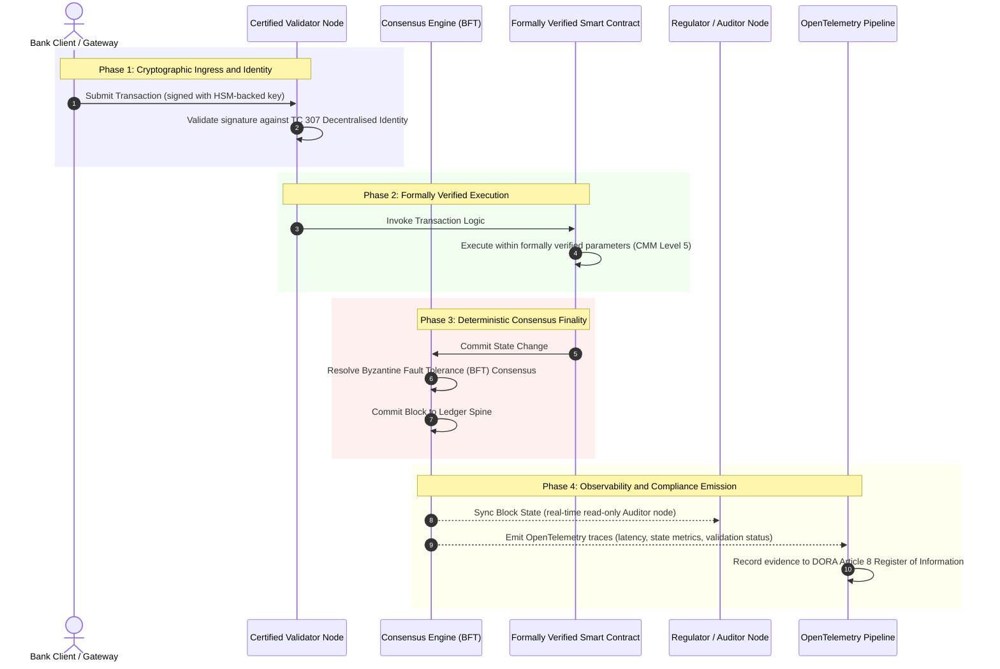

# Dalla prova alla verità: perché le blockchain certificate definiranno la prossima era della fiducia bancaria

**Immutabile non significa affidabile.** Mentre il wholesale banking passa al regolamento in tempo reale e all'IA probabilistica, il registro che decide cosa è vero è diventato l'unico strato che le banche ancora non riescono a certificare. Certificano l'entità secondo Basel III, il cloud secondo ISO 27001 e la loro IA secondo ISO 42001, ma il registro distribuito, la sua governance, il consenso, la crittografia e gli smart contract, resta affidato a ipotesi specifiche del fornitore. Questo report sostiene che colmare quella lacuna fiduciaria richiede di passare dalle linee guida ISO/IEC TC 307 a una garanzia prescrittiva: valutare il registro rispetto a un Certified Blockchain Index a 5 livelli che trasforma le metriche ingegneristiche in una verità verificabile dal consiglio e difendibile secondo DORA.

<!-- lead-start -->
<aside class="post-lead" aria-label="Sintesi dell'articolo">

<strong>In sintesi.</strong> Le banche certificano l'entità, il cloud e la loro IA, ma non il registro che determina sempre più cosa è vero. ISO/IEC TC 307 fornisce linee guida, non garanzia. Un Certified Blockchain Index a 5 livelli valuta governance del registro, integrità del consenso, identità e crittografia, garanzia degli smart contract e osservabilità rispetto a un Capability Maturity Model, colmando la lacuna fiduciaria e dando all'IA probabilistica una dorsale di audit deterministica.

<strong>Punti chiave</strong>

<ul class="post-lead-takeaways">
  <li><strong>La lacuna fiduciaria di attrito.</strong> La banca (Basel III), il cloud (ISO 27001) e il sistema di governance dell'IA (ISO 42001) possono essere certificati; il registro distribuito che decide cosa è vero ancora no. Quell'asimmetria è una vulnerabilità operativa concreta.</li>
  <li><strong>DORA lo rende personale.</strong> Secondo DORA Article 5, i consigli di amministrazione delle banche portano una responsabilità diretta e non delegabile per la resilienza delle implementazioni di terze parti e dei registri, con sanzioni personali SM&amp;CR in caso di inadempienza.</li>
  <li><strong>La dorsale di audit per l'IA.</strong> Il machine learning non è riproducibile; una blockchain certificata registra versioni dei modelli, input e decisioni di validazione in modo deterministico on-chain, soddisfacendo ISO 42001 e gli standard di gestione del rischio dei modelli.</li>
  <li><strong>Il Certified Blockchain Index.</strong> Governance, consenso, crittografia, smart contract e osservabilità diventano una scorecard CMM da 0 a 5 che traduce le metriche ingegneristiche in Risk Appetite Statement approvati dal consiglio.</li>
</ul>

<strong>Letture correlate:</strong> <a href="https://sebastienrousseau.com/2026-07-02-certified-blockchains-banking-trust-tc307-assurance-2026">Blockchain certificate e fiducia bancaria: la garanzia TC 307</a>, <a href="https://sebastienrousseau.com/2026-07-24-global-payments-outlook-operating-model-risk-revenue">Il Global Payments Outlook 2026</a>.

</aside>
<!-- lead-end -->

> **Sintesi esecutiva**
>
> - **Il wholesale banking è a un punto di svolta.** La compensazione in tempo reale e l'IA probabilistica scardinano il modello di garanzia analogico e retrospettivo: gli audit statici, basati sull'entità, non soddisfano più le esigenze moderne di gestione del rischio o fiduciarie.
> - **TC 307 è una linea di base, non un certificato.** ISO/IEC TC 307 ha standardizzato il vocabolario, l'architettura di riferimento e le linee guida di sicurezza per i registri distribuiti, ma è descrittivo. Definisce come dovrebbe essere fatto bene; non fornisce la verifica prescrittiva di cui i risk officer e i supervisori hanno bisogno per autorizzare l'implementazione in produzione.
> - **Garanzia significa valutare il registro.** Governance, integrità del consenso, sicurezza degli smart contract e agilità crittografica, valutate rispetto a un rigoroso Capability Maturity Model a 5 livelli, spostano le banche da un'ipotesi frammentaria e specifica del fornitore a una verità finanziaria certificabile e verificabile dal consiglio.
> - **Il registro è la dorsale di audit per l'IA.** Ancorare versioni dei modelli, input e decisioni di validazione a un consenso deterministico dà al machine learning non riproducibile un record probatorio difendibile e ricostruibile secondo ISO 42001, SR 11-7 e PRA SS1/23.

## La lacuna fiduciaria di attrito nel banking digitale

Nel banking classico, la fiducia è relazionale, istituzionale e retrospettiva. Dipende da revisori indipendenti di terze parti che esaminano lo stato finanziario in momenti statici nel tempo, riconciliando le discrepanze tra silos di registri bilaterali. Nei mercati in tempo reale e guidati dalle API del 2026, questo modello introduce latenze proibitive e rischi strutturali.

Quando le transazioni si regolano istantaneamente, i pool di liquidità infragiornaliera sono gestiti dinamicamente da gateway API e la proprietà degli asset è tokenizzata su registri condivisi, gli audit retrospettivi diventano esercizi forensi anziché controlli preventivi. I fiduciari non possono più affidarsi soltanto alla certificazione dell'entità aziendale. Devono certificare il substrato digitale stesso.

Attualmente, le banche operano sotto una palese asimmetria architetturale:

1. **Infrastruttura cloud certificata**: nodi hardware, container virtualizzati e datacenter fisici sono validati rispetto ai controlli ISO/IEC 27001 e SOC 2 Type II.  
2. **Processi di gestione certificati**: le politiche di rischio operativo, i piani di continuità operativa e le implementazioni algoritmiche sono governati secondo rigorosi framework di rischio.  
3. **Motori di registro non certificati**: i meccanismi centrali di consenso distribuito, le catene di fornitura dei nodi validatori, i confini degli smart contract e i modelli di governance della rete sono lasciati a ipotesi non certificate, personalizzate o specifiche del consorzio.

Questa asimmetria è un punto di cedimento importante. Una banca può eseguire un'applicazione validata all'interno di un container cloud sicuro e certificato ISO 27001, ma se quel container scrive su un registro distribuito con controllo centralizzato dei validatori, parametri di consenso vulnerabili o smart contract non sottoposti ad audit, l'integrità della transazione è compromessa. Per colmare questa lacuna, il motore di registro stesso deve diventare un oggetto di garanzia certificabile.

## La linea di base di standardizzazione ISO/IEC TC 307

Il lavoro fondamentale necessario per standardizzare i registri distribuiti è in via di definizione da parte del Comitato Tecnico ISO/IEC 307 (TC 307\) (Blockchain and distributed ledger technologies). Anziché trattare la blockchain come un protocollo tecnico isolato, il TC 307 la affronta come un'infrastruttura di fiducia istituzionale, organizzando il proprio lavoro attorno a cinque pilastri fondamentali:

1. **Tassonomia e vocabolario (ISO 22739\)**: stabilisce una nomenclatura comune, garantendo definizioni legali e operative coerenti tra diverse giurisdizioni, schemi finanziari e istituzioni.  
2. **Architettura di riferimento (ISO/TR 23245\)**: definisce i confini, gli strati, i flussi di dati e i componenti funzionali di un sistema di registro distribuito conforme.  
3. **Sicurezza, privacy e smart contract (ISO/TR 23244 / ISO 23613\)**: stabilisce linee guida di sicurezza di base per i sistemi di asset digitali e dettaglia le migliori pratiche per la mitigazione delle vulnerabilità degli smart contract e la governance del ciclo di vita.  
4. **Framework di interoperabilità**: affronta i meccanismi di scambio di dati e asset tra reti di registri eterogenee, prevenendo la formazione di silos tokenizzati isolati.  
5. **Identità decentralizzata e trust anchor**: integra gli identificatori crittografici basati su registro con infrastrutture formali a chiave pubblica (PKI) e registri autorizzati dallo Stato.

Nel complesso, il TC 307 segnala il passaggio della DLT da scelta ingegneristica personalizzata a disciplina architetturale standardizzata. Tuttavia, il TC 307 resta principalmente descrittivo. Definisce come dovrebbe essere fatto bene (linee guida), ma non fornisce il protocollo di verifica prescrittiva (garanzia) di cui i risk officer e i supervisori hanno bisogno per autorizzare le implementazioni in produzione di funzioni critiche o importanti (CIFs).

## Linee guida vs. garanzia: la distinzione fiduciaria

I partecipanti ai mercati finanziari non adottano una tecnologia perché è innovativa o elegante; la adottano quando può essere governata, sottoposta ad audit, difesa e riconciliata con i requisiti di riserva di capitale. Per questo la standardizzazione nel banking si risolve naturalmente in due strati:

* **Linee guida (il framework)**: delineano le migliori pratiche, i target di riferimento e le linee guida architetturali (ad es. ISO/IEC TC 307, framework NIST).  
* **Garanzia (la prova)**: fornisce prove indipendenti, continue e verificabili da terze parti che il framework è implementato e funziona come progettato (ad es. certificazione ISO 27001, audit SOC 2, esami regolamentari).

Affidarsi a un consenso di registro non certificato mentre si certifica l'infrastruttura cloud è una lacuna regolamentare critica. Una blockchain "immutabile" non è necessariamente "affidabile a livello istituzionale". L'immutabilità garantisce soltanto che i dati inseriti restino invariati; non verifica che i nodi validatori siano sicuri, che il protocollo di consenso sia resiliente alla collusione, che la logica degli smart contract sia matematicamente solida o che la gestione delle chiavi crittografiche sia conforme ai mandati post-quantistici.

Per colmare questa lacuna, il Certified Blockchain Index 2026 formalizza questi requisiti in un Capability Maturity Model (CMM) quantificabile mappato sulle normative bancarie globali.

## Il Certified Blockchain Index 2026

Per consentire all'alta dirigenza di valutare e certificare le proprie piattaforme di registro, questo indice struttura l'infrastruttura del registro distribuito in cinque strati operativi verificabili, valutati su una scala CMM da 0 a 5.

### Tabella 1: L'architettura del Certified Blockchain Index

| Strato dell'indice | Livello di maturità (CMM) | Metrica tecnica e operativa | Riferimento di controllo regolamentare / fiduciario |
| ---- | ---- | ---- | ---- |
| **Governance del registro** | **Level 0**: Consorzio ad hoc**Level 3**: Vetting e rotazione automatizzati dei validatori**Level 5**: Ancoraggio decentralizzato dell'identità crittografica multi-parte | % di nodi validatori gestiti da entità finanziarie verificate; tempo medio di risoluzione delle controversie tra validatori; distribuzione geografica dei nodi | **DORA Article 5** (Governance e organizzazione); **CPMI-IOSCO PFMI Principle 2** (Governance) e **Principle 3** (Framework per la gestione complessiva dei rischi) |
| **Integrità del consenso** | **Level 0**: Nodo singolo o POW opaco**Level 3**: BFT sottoposto ad audit con definitività deterministica**Level 5**: Consenso multi-giurisdizionale, formalmente verificato, con monitoraggio continuo della latenza | Latenza massima tollerabile del consenso; soglia di resistenza alla collusione; SLA di uptime sotto partizione simulata dei nodi | **DORA Article 6** (Framework di gestione del rischio ICT); **CPMI-IOSCO PFMI Principle 8** (Settlement Finality) |
| **Identità e crittografia** | **Level 0**: Chiavi RSA / ECDSA deboli**Level 3**: Multi-sig con gestione delle chiavi supportata da HSM**Level 5**: Chiavi ibride quantum-safe (FIPS 203 ML-KEM) e gate di privacy a conoscenza zero | % di transazioni del registro firmate con chiavi supportate da HSM; punteggio di prontezza alla migrazione PQC; latenza delle prove ZK | **NIST FIPS 203 / 204**; **ISO/IEC 27001** (Gestione della sicurezza delle informazioni) |
| **Garanzia degli smart contract** | **Level 0**: Script solidity non sottoposti ad audit**Level 3**: Validazione automatizzata del compilatore e audit esterno**Level 5**: Smart contract formalmente verificati e immutabili con upgrade a circuit-breaker | % di smart contract con verifica formale matematica; conteggio degli avvisi del compilatore; copertura della scansione delle vulnerabilità | **EBA Guidelines on Outsourcing Arrangements** (Paragrafi 81, 113-117); **DORA Article 30** (Clausole contrattuali minime) |
| **Audit e osservabilità** | **Level 0**: Scraping manuale dei log**Level 3**: Trace OTel strutturate e nodi auditor in sola lettura**Level 5**: Riconciliazione automatizzata e continua al registro Article 8 | % di transazioni coperte da trace OpenTelemetry; latenza dal block-commit del registro alla sincronizzazione del nodo auditor | **BCBS 239** (Aggregazione dei dati di rischio); **DORA Article 8** (Register of Information / Schemi ITS) |

### Tabella 2: Segnali di fiducia chiave mappati sugli standard bancari globali

| Segnale / Benchmark | Metrica | Impatto sulle piattaforme bancarie | Fonte regolamentare |
| ---- | ---- | ---- | ---- |
| **Avanzamento ISO/IEC TC 307** | Passaggio dai technical report ISO/TR a schemi di certificazione formali | Stabilisce il primo framework standardizzato per certificare i motori di registro distribuito | **ISO/IEC JTC 1 / SC 44** (Distributed Ledger Technologies) |
| **Fase prototipo del Project Agorá** | Oltre 40 banche commerciali partecipanti; test di registro unificato dei depositi tokenizzati | Sposta la compensazione transfrontaliera dalla messaggistica (SWIFT) al regolamento atomico tokenizzato | **Bank for International Settlements (BIS) Innovation Hub** |
| **Audit di terze parti DORA Article 30** | 100% dei fornitori di nodi e degli host di infrastruttura sottoposti ad audit rispetto a criteri di sicurezza | Elimina i "nodi validatori ombra"; impone una totale trasparenza della catena di fornitura | **European Supervisory Authorities (ESA)** |
| **ISO/IEC 42001 (Governance dell'IA)** | Log dei modelli e di addestramento dell'IA resi crittograficamente immutabili on-chain | Impiega la blockchain come registro probatorio immutabile ("dorsale di audit") per il machine learning | **ISO/IEC 42001:2023** (Information technology, Artificial intelligence) |
| **Adeguatezza patrimoniale Basel III** | Riduzione delle riserve di capitale per il rischio operativo in base a una riduzione documentata della complessità | I framework standardizzati di rischio operativo riconoscono direttamente la resilienza verificata del registro | **Basel Committee on Banking Supervision (BCBS)** |

## La "dorsale di audit" per l'IA: intelligenza probabilistica su infrastruttura deterministica

Uno dei ruoli strategici più potenti per una blockchain certificata nel 2026 è quello di fungere da **"dorsale di audit"** per le implementazioni di intelligenza artificiale. I sistemi finanziari moderni sono sempre più probabilistici. Il credit scoring, il rilevamento delle frodi in tempo reale, il trading algoritmico e le interazioni autonome con i clienti sono guidati da modelli di machine learning che evolvono, derivano e si adattano nel tempo. Questi modelli sono non deterministici: dato lo stesso input in due momenti diversi, possono produrre output diversi a causa di pesi dinamici e addestramento continuo.

Questa non determinatezza introduce una profonda sfida di governance secondo gli standard **ISO/IEC 42001 (Governance dell'IA)** e di **Model Risk Management (MRM)** (come **US Federal Reserve SR 11-7** e **UK PRA SS1/23**): *come si sottopongono ad audit, si spiegano e si difendono decisioni che non sono strettamente riproducibili?*

Un registro distribuito certificato fornisce il contrappeso deterministico. Mentre i modelli di IA operano in modo probabilistico, la blockchain certificata registra i loro parametri in modo deterministico, stabilendo una dorsale probatoria inalterabile:

* **Versioning dei modelli e ancoraggio dei pesi**: ogni versione di modello implementata, i pesi associati e i checksum dei dati di addestramento vengono sottoposti a hash e scritti sul registro in fase di build, soddisfacendo i requisiti di catena di fornitura **SLSA Level 3**.  
* **Logging contestuale degli input**: quando un modello di IA esegue una decisione critica (ad es. l'approvazione di un prestito o la segnalazione di una transazione), gli esatti input contestuali e gli hash del modello vengono scritti sul registro, creando una cronologia a prova di manomissione.  
* **Verificabilità senza accesso al codice**: se un regolatore chiede "perché il vostro modello ha respinto questa richiesta di credito il 3 giugno?", la banca non deve esporre codice proprietario né tentare di ricreare l'esatto stato del modello. Presenta il record del registro on-chain, firmato crittograficamente, degli input, dei pesi e dello stato di validazione.

Ancorando le decisioni probabilistiche dei modelli di machine learning al consenso deterministico di una blockchain certificata, l'istituzione crea una linea temporale delle azioni automatizzate difendibile, ricostruibile e verificabile in modo indipendente.

## Visualizzare la pipeline certificata dal consenso all'audit

Il seguente diagramma di sequenza illustra il ciclo di vita di una transazione che attraversa una piattaforma blockchain certificata, mostrando come i gate di validazione, l'integrità del consenso, l'esecuzione degli smart contract e l'emissione di telemetria si integrino per produrre prove regolamentari pronte per il consiglio:

Il percorso critico di questa sequenza transazionale richiede che ogni passaggio di validazione, esecuzione e consenso sia firmato crittograficamente, garantendo la provenienza end-to-end. Il nodo auditor del regolatore sincronizza lo stato dei blocchi in tempo reale, eliminando la necessità di una riconciliazione finanziaria manuale e retrospettiva.

## Il playbook per il consiglio destinato ai senior manager

Per gestire con successo il passaggio dalla fiducia organizzativa a quella infrastrutturale, i dirigenti e i senior manager delle banche dovrebbero eseguire immediatamente quattro direttive chiave:

1. **Imporre gli audit del registro nell'Enterprise Risk Management (ERM)**: applicare una politica secondo cui nessuna piattaforma di registro distribuito, privata, pubblica o di consorzio, possa essere implementata per funzioni critiche o importanti (CIFs) se non è stata sottoposta ad audit rispetto all'**architettura del Certified Blockchain Index** a 5 strati (CMM Level 3 minimo).  
2. **Integrare le blockchain come dorsale probatoria dell'IA ISO 42001**: incaricare il Chief Risk Officer e il Lead AI Architect di integrare tutti i modelli di machine learning ad alto impatto con una blockchain certificata, creando un registro di audit a prova di manomissione di versioni dei modelli, pesi, input e decisioni.  
3. **Sottoporre ad audit la catena di fornitura dei nodi validatori (DORA Article 30\)**: richiedere alla divisione approvvigionamenti di sottoporre ad audit tutte le entità di terze parti che ospitano nodi validatori o gestiscono l'hosting cloud per le reti DLT, imponendo la conformità agli stessi standard di cybersecurity e resilienza operativa applicati ai nodi cloud interni della banca.  
4. **Allineare le architetture di registro con CPMI-IOSCO e BCBS 239**: incaricare il team di platform engineering di allineare la telemetria in uscita dal registro direttamente ai requisiti di reportistica dei dati **BCBS 239** e garantire che i parametri di consenso e definitività del regolamento siano rigorosamente conformi ai **CPMI-IOSCO Principle 8 e 9**.

## Domande frequenti

**ISO/IEC TC 307 è uno standard di certificazione?**  
No. ISO/IEC TC 307 è un comitato tecnico che stabilisce vocabolario, architetture di riferimento e linee guida di sicurezza. Sebbene definisca "come dovrebbe essere fatto bene" (linee guida), il settore deve rendere operativi questi documenti in schemi di certificazione formali e verificabili (garanzia) per soddisfare i supervisori bancari.

**In che modo una blockchain certificata supporta la conformità DORA?**  
Secondo DORA Article 5, i consigli di amministrazione delle banche portano una responsabilità diretta e personale per la resilienza tecnologica. Una blockchain certificata fornisce prove crittografiche verificabili dell'integrità del consenso, del controllo della catena di fornitura dei validatori e della sicurezza degli smart contract, dando ai membri del consiglio i documentabili "passi ragionevoli" necessari per difendersi dalle richieste di responsabilità personale SM\&CR.

**Qual è la differenza tra un audit tradizionale del registro e un audit di una blockchain certificata?**  
Un audit tradizionale è retrospettivo e verifica le voci manuali e i file statici dopo che le transazioni si sono regolate. Un audit di una blockchain certificata è continuo e in tempo reale; i nodi validatori, il motore di consenso BFT e gli smart contract formalmente verificati sono certificati per eseguire le transazioni in modo deterministico, emettendo telemetria strutturata (OpenTelemetry) che convalida continuamente lo stato di salute del sistema.

**Le blockchain pubbliche possono essere certificate per l'uso bancario?**  
Nella maggior parte delle giurisdizioni, le blockchain pubbliche puramente permissionless non soddisfano le normative bancarie a causa della mancata verifica dell'identità dei validatori, dei costi di gas/transazione imprevedibili e della definitività non deterministica (ad es. fork probabilistici proof-of-work/stake). Le blockchain certificate nel banking utilizzano tipicamente architetture enterprise permissioned o pubbliche ibride altamente regolamentate, in cui gli operatori dei nodi validatori sono entità finanziarie identificate e sottoposte ad audit.

## Riferimenti

* Basel Committee on Banking Supervision (BCBS), 2013\. *Principles for effective risk data aggregation and reporting (BCBS 239\)*. Basel: Bank for International Settlements. Available at: [Basel Committee on Banking Supervision (BCBS), 2013\.](https://www.bis.org/publ/bcbs239.pdf "Basel Committee on Banking Supervision (BCBS), 2013\.").  
* Committee on Payments and Market Infrastructures and Technical Committee of the International Organisation of Securities Commissions (CPMI-IOSCO), 2012\. *Principles for financial market infrastructures*. Basel: Bank for International Settlements. Available at: [Committee on Payments and Market Infrastructures and Technical Committee of the International Organisation of Securities Commissions (CPMI-IOSCO), 2012\.](https://www.bis.org/cpmi/publ/d101a.pdf "Committee on Payments and Market Infrastructures and Technical Committee of the International Organisation of Securities Commissions (CPMI-IOSCO), 2012\.").  
* European Banking Authority (EBA), 2019\. *EBA/GL/2019/02, Guidelines on outsourcing arrangements*. Paris: EBA. Available at: [European Banking Authority (EBA), 2019\.](https://www.eba.europa.eu/regulation-and-policy/internal-governance/guidelines-on-outsourcing-arrangements "European Banking Authority (EBA), 2019\.").  
* European Parliament and Council of the European Union, 2022\. *Regulation (EU) 2022/2554 on digital operational resilience for the financial sector (DORA)*. Brussels: Official Journal of the European Union. Available at: [European Parliament and Council of the European Union, 2022\.](https://eur-lex.europa.eu/legal-content/EN/TXT/?uri=CELEX%3A32022R2554 "European Parliament and Council of the European Union, 2022\.").  
* ISO/IEC JTC 1/SC 42, 2023\. *ISO/IEC 42001:2023, Information technology, Artificial intelligence, Management system*. Geneva: International Organisation for Standardisation. Available at: [ISO/IEC JTC 1/SC 42, 2023\.](https://www.iso.org/standard/81230.html "ISO/IEC JTC 1/SC 42, 2023\.").  
* ISO/IEC Technical Committee 307, 2020\. *ISO/IEC 22739:2020, Blockchain and distributed ledger technologies, Vocabulary*. Geneva: International Organisation for Standardisation. Available at: [ISO/IEC Technical Committee 307, 2020\.](https://www.iso.org/standard/73771.html "ISO/IEC Technical Committee 307, 2020\.").  
* National Institute of Standards and Technology (NIST), 2026\. *First Three Finalised Post-Quantum Encryption Standards (FIPS 203, 204, and 205\)*. Gaithersburg: U.S. Department of Commerce. Available at: [National Institute of Standards and Technology (NIST), 2026\.](https://www.nist.gov/news-events/news/2024/08/nist-releases-first-3-finalised-post-quantum-encryption-standards "National Institute of Standards and Technology (NIST), 2026\.").
