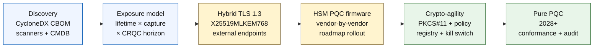

# 2026 年の量子セーフ銀行インデックス: ポスト量子暗号、QKD、クリプト・アジリティ、HNDL リスク

<!-- lead-start: manual -->
<aside class="post-lead" aria-label="記事の要約">

<strong>要旨。</strong> 2026 年の量子セーフ銀行業務は、2 本の曲線が交差する地点で期限が決まる実行プログラムです。1 本目は機関が今日保有するデータの機密性ライフタイム、もう 1 本は暗号学的に重要な量子コンピュータ (CRQC) の到来見通しです。NIST FIPS 203 / 204 / 205 は 2024 年 8 月以降に確定し、CNSA 2.0 は米国連邦の最終形を 2033 年に設定しています。harvest-now-decrypt-later (収集して後で復号) は長期保全データに対してすでに発生しています。取締役会レベル量子スコアカードは 4 つの精緻なパーセンテージ、すなわちインベントリ完全性、HNDL エクスポージャ、NIST 移行進捗、クリプト・アジリティ準備度を追跡します。

<strong>主要ポイント</strong>

<ul class="post-lead-takeaways">
  <li><strong>アルゴリズム選定の議論は 2024 年 8 月 13 日に終結しました。</strong> ML-KEM (FIPS 203)、ML-DSA (FIPS 204)、SLH-DSA (FIPS 205) が解答です。「勝者を選ぶ」ための内部評価をまだ実施している銀行は、18 か月遅れています。</li>
  <li><strong>HNDL はすでに適用される脅威です。</strong> 信頼に足る CRQC 到来時点を超えた機密性ライフタイムを持つ資産、すなわち 30 年住宅ローン、生命保険のアンダーライティング、MiFID II / GDPR の取引記録、M&amp;A の長期保管アーカイブはいずれも、CRQC が発表されてからではなく今すぐにハイブリッド量子セーフ鍵カプセル化へ移行する必要があります。</li>
  <li><strong>インベントリが成熟度のゲートです。</strong> 暗号部品表 (CBOM) は、プロトコル、ライブラリ、証明書、HSM パーティション、ベンダー依存関係、アプリケーションオーナー、データ分類ライフタイムを束ねるもので、他のすべての前提条件です。カバレッジではなく鮮度を追跡してください。</li>
  <li><strong>ハイブリッド TLS 1.3 が 2026 年の配備形態です。</strong> X25519MLKEM768 ハイブリッド鍵共有は、Chrome / Firefox / Cloudflare / Akamai が現に交換しているものです。純粋な ML-KEM の TLS は HSM ファームウェアと CA の準備を待つ段階にあります。</li>
  <li><strong>クリプト・アジリティが持続的な成果物です。</strong> PKCS#11 抽象化、ラベル付き鍵、業務サービスと許可アルゴリズム集合を対応づけるポリシーレジストリ。これらが無ければ、次のアルゴリズム移行もまた数年がかりのプログラムになります。</li>
</ul>
</aside>
<!-- lead-end -->

2026 年の量子セーフ銀行業務は、運用上の移行に関する課題であり、思弁の対象ではありません。NIST は最初の 3 つのポスト量子暗号標準を確定済みで、銀行は RSA、ECC、TLS、署名、HSM、証明書、決済チャネル、アーカイブ、長期保全の機密データに依存するシステムを今、特定する必要があります。インデックスの問いは単純です。脅威が運用上の現実となる前に、機関は暗号を入れ替えられるか。

---

> **エグゼクティブサマリー / 主要ポイント**
>
> - **NIST 標準は具体的なものとなりました。** FIPS 203 は鍵カプセル化のための ML-KEM を、FIPS 204 は署名のための ML-DSA を、FIPS 205 はステートレスなハッシュベース署名標準として SLH-DSA を定義します。
> - **インベントリが最初の成熟度ゲートです。** 銀行は見つけられない資産を移行できません。証明書、鍵、プロトコル、アプリケーション、ベンダー、HSM、API、アーカイブ、組み込みシステムを網羅的に対応づける必要があります。
> - **クリプト・アジリティが持続的な目標です。** 目標は一度きりのアルゴリズム差し替えではなく、アプリケーション全体を再設計せずに暗号プリミティブを変更できる能力です。
> - **長期保全データが緊急度を変えます。** HNDL リスクとは、今日取得されたデータが、十分に価値を保つ限り、後に読み取り可能になり得ることを指します。
> - **QKD は特殊用途の補完です。** 量子鍵配送は最も価値の高いチャネルでは妥当ですが、機関全体の PQC 移行を代替するものではありません。
>
---

## なぜ 2026 年がこのインデックスにとって重要なのか

2024 年から 2025 年にかけての 3 つの変化が、量子セーフを研究上の注視対象ではなく、測定可能な銀行プログラムに変えました。第 1 に、NIST が 2024 年 8 月 13 日に主要なポスト量子標準、すなわち [FIPS 203 (ML-KEM) ⧉](https://nvlpubs.nist.gov/nistpubs/FIPS/NIST.FIPS.203.pdf "FIPS 203 — 格子ベース鍵カプセル化メカニズム")、[FIPS 204 (ML-DSA) ⧉](https://nvlpubs.nist.gov/nistpubs/FIPS/NIST.FIPS.204.pdf "FIPS 204 — 格子ベース電子署名標準")、[FIPS 205 (SLH-DSA) ⧉](https://nvlpubs.nist.gov/nistpubs/FIPS/NIST.FIPS.205.pdf "FIPS 205 — ステートレスハッシュベース電子署名標準") を確定しました。アルゴリズム選定の議論はその日に終結しました。2026 年になっても「どの方式が勝つか」を内部で検討しているワークストリームは 18 か月遅れています。

第 2 に、[NSA の CNSA 2.0 ⧉](https://media.defense.gov/2022/Sep/07/2003071834/-1/-1/0/CSA_CNSA_2.0_ALGORITHMS_.PDF "Commercial National Security Algorithm Suite 2.0") は米国連邦の最終形を 2033 年と定め、その中間期限として 2027 年にソフトウェア・ファームウェア署名、2030 年にブラウザと OS を区切っています。米国連邦のカウンターパーティ・エクスポージャ、すなわち FedNow、財務省オペレーション、連邦顧客口座を抱える銀行は、連邦データに触れるシステムについてはその境界線の内側にいます。時計はもはや抽象的な存在ではありません。

第 3 に、[Harvest-Now-Decrypt-Later (HNDL) ⧉](https://csrc.nist.gov/Projects/post-quantum-cryptography "NIST ポスト量子暗号プログラム") が緊急性の論拠の主柱です。高度な攻撃者は、主要金融センターで TLS 保護下の決済メッセージ、SWIFT エンベロープ、KYC 書類、長期保全アーカイブの暗号文をすでに収集しています。2026 年に取得されたデータは、復号の時点で機密性が残っていれば足ります。30 年住宅ローン、生命保険のアンダーライティング、MiFID II / GDPR の取引記録、M&A の長期保管アーカイブにとって、その窓は CRQC に関するあらゆる現実的な見積もりをはるかに超えて延びます。攻撃者は今日量子コンピュータを必要としません。データが価値を失う前に手に入れれば足ります。

量子セーフ銀行インデックスは、その交点が到来する前に、機関が移行を完遂できるかを測ります。論点はもはや移行するか否かではなく、防御可能なタイムラインで移行を完了させられるか否かです。

## 2026 年インデックスのアーキテクチャ

| インデックス階層 | 2026 年の方向性 | 準備度メトリクス | 取り扱いを誤った場合のリスク |
|---|---|---|---|
| **インベントリ** | 暗号資産、プロトコル、証明書、ベンダー、データクラスを対応づける | エステート全体に占めるインベントリ化済みの割合 | 量子脆弱性の所在が不明な依存関係 |
| **エクスポージャ** | 機密性ライフタイムと取引上の重要度でシステムを分類する | 価値とライフタイムによる高リスク資産 | 優先順位を誤った移行 |
| **移行** | NIST 標準に整合したハイブリッドおよび PQC 対応パターンを採用する | ML-KEM および ML-DSA の準備度 | 期限直前の緊急リプラットフォーミング |
| **クリプト・アジリティ** | アプリケーションロジックと暗号プリミティブを分離する | ポリシー制御下の暗号カバレッジ | エステート全体に散在するハードコードされたアルゴリズム |
| **アシュアランス** | 相互運用性、性能、HSM サポート、証明書、ベンダー準備度を検証する | テスト合格率と例外バックログ | チャネル断や脆弱なフォールバック制御 |

### 取締役会レベル量子スコアカード

信頼に足る量子準備度スコアカードには、プロジェクトステータスではなく精緻なパーセンテージの追跡が求められます。

1. **インベントリ完全性:** 完全に対応づけられた暗号部品表 (CBOM) を備えた Tier-1 アプリケーションの割合。
2. **HNDL エクスポージャ:** ハイブリッド量子セーフ鍵カプセル化を伴わずにネットワーク上を流れる、長期保全の機密データ (PII、トレードシークレットなど) の量。
3. **NIST 移行進捗:** FIPS 203 (ML-KEM) および FIPS 204 (ML-DSA) 標準へ移行済みの非対称暗号鍵と電子署名の割合。
4. **クリプト・アジリティ準備度:** コード再コンパイルなしに、中央のポリシーから暗号アルゴリズムをローテーションできるクリティカルシステムの割合。

## 追跡すべき現在のシグナル

| シグナル | 銀行にとっての意味 | 出典 |
|---|---|---|
| **FIPS 203 ML-KEM** | 汎用の暗号鍵確立に関する NIST 標準の中核 | [NIST ⧉](https://www.nist.gov/news-events/news/2024/08/nist-releases-first-3-finalized-post-quantum-encryption-standards "確定した最初の 3 つのポスト量子暗号標準") |
| **FIPS 204 ML-DSA** | 電子署名に関する NIST 標準の中核 | [NIST ⧉](https://www.nist.gov/news-events/news/2024/08/nist-releases-first-3-finalized-post-quantum-encryption-standards "確定した最初の 3 つのポスト量子暗号標準") |
| **FIPS 205 SLH-DSA** | ハッシュベース署名の代替・バックアップ設計 | [NIST ⧉](https://www.nist.gov/news-events/news/2024/08/nist-releases-first-3-finalized-post-quantum-encryption-standards "確定した最初の 3 つのポスト量子暗号標準") |
| **即時の統合が推奨される** | 完全統合には時間を要するため、NIST は管理者に標準の組み込みを開始するよう明示している | [NIST ⧉](https://www.nist.gov/news-events/news/2024/08/nist-releases-first-3-finalized-post-quantum-encryption-standards "確定した最初の 3 つのポスト量子暗号標準") |
| **銀行の量子プログラムは拡大中** | 主要銀行は PQC への移行準備と並行して量子技術を検討している | [Quantum Insider ⧉](https://thequantuminsider.com/2026/03/27/15-plus-global-banks-probing-the-wonderful-world-of-quantum-technologies/ "量子技術を検討する世界の銀行の概観") |

## 移行は暗号の台帳から始まる

移行の順序は、現時点では十分理解されています。各ゲートは次のゲートを駆動するエビデンスを生み出します。ゲートを飛ばす、あるいは圧縮することが、インデックスアーキテクチャの失敗欄に現れる緊急リプラットフォーミングリスクを生みます。

最初の成果物は新たなアルゴリズムではなく、暗号部品表 (CBOM) です。銀行は業務サービスをアルゴリズム、ライブラリ、証明書、鍵長、HSM、データライフタイム、ベンダー、運用オーナーへ接続する生きたインベントリを必要とします。その台帳が無ければ、量子セーフ移行は推測作業となります。

CBOM のレコードセットは、各暗号プリミティブについて次を捕捉すべきです。プロトコルまたはインタフェース (TLS 1.3、IPsec、SSH、独自決済メッセージフォーマット)、アルゴリズムとパラメータセット (RSA-2048、ECDH P-256、ML-KEM-768、ML-DSA-65)、ライブラリとバージョン (OpenSSL 3.4、BoringSSL のコミットハッシュ、ベンダー SDK のビルド)、ハードウェア境界 (HSM パーティション、TPM、セキュアエンクレーブ、または無し)、該当する場合の証明書 ID、アプリケーションオーナー、データ分類ライフタイム。2025 年から 2026 年に本番投入されるツール群、すなわち IBM Quantum Safe Inventory、オープンソースの [CycloneDX CBOM 仕様 ⧉](https://cyclonedx.org/capabilities/cbom/ "CycloneDX 暗号部品表")、CryptoNext / Sandbox / PQShield のエンタープライズスキャナは、既存の CMDB パイプラインに統合されます。これらのいずれも単独では完結しません。ベンダーツールと専任要員を投入しても、CBOM の構築サイクルには 12 か月から 18 か月を見込んでください。

追跡すべきメトリクスはカバレッジではなく鮮度です。2 か月古い CBOM は、移行済み対象についてセキュリティチームに誤った安心感を与えるため、CBOM が無い状態より悪化します。

## ハイブリッド先行、常にアジャイル

ほとんどの銀行は一斉切り替えを行いません。現実的なパターンは、古典と PQC の機構を並走させながら、ベンダー、プロトコル、証明書、運用ツールが成熟していくのを待つハイブリッド配備です。長期目標はクリプト・アジリティ、すなわち業務アプリケーションの再構築なしに変更可能な、ポリシー制御下の暗号選択です。

[インタラクティブコンポーネント挿入: Harvest-Now-Decrypt-Later (HNDL) リスク計算ツール。経営層がデータの保全期間と推定量子タイムラインをスライダーで入力し、エクスポージャの窓を可視化します。]

> **キーインサイト:** データを 10 年間機密に保つ必要があり、暗号学的に重要な量子コンピュータ (CRQC) が 7 年先にあるなら、あなたの移行期限は 7 年後ではなく、3 年前に過ぎています。

実装としては、外部公開エンドポイントでハイブリッド `X25519MLKEM768` 鍵共有を備えた TLS 1.3 (Chrome / Firefox / Cloudflare / Akamai が現在対応) と、HSM および CA 基盤が追随するまでの古典署名チェーン、そして業務アプリケーションを再コンパイルせずにポリシーレジストリからアルゴリズムをローテーションできる PKCS#11 抽象化レイヤを意味します。クリプト・アジリティこそが、次のアルゴリズム移行 (時期の問題で、起こることは確実) が 6 週間のローテーションで済むのか、再び 7 年がかりのプログラムになるのかを決めます。

## QKD の位置づけ

量子鍵配送は、特に金融市場インフラ、中央銀行接続、極めて機微な機関フローにおける高感度チャネルの選択肢として、このインデックスに位置づけられます。PQC の代替ではなく補完として扱うべきであり、機関全体の移行を遅らせる口実にすべきではありません。

## 銀行類型別の意味

### グローバルなシステム上重要な銀行

難題はスケールです。数万単位の TLS エンドポイント、数百単位の HSM パーティション、数十単位の内部認証局、暗号プリミティブを組み込んだ数百単位の業務アプリケーション、そして銀行側で改変できないベンダー SDK が並びます。投資対象は新たなパイロットではなく、CBOM ツーリング、すべての新規ビルドに組み込まれる PKCS#11 抽象化レイヤ、PQC ファームウェアで先導する 1 ベンダーを定めその他は数年がかりのテイルを許容する HSM 集約計画、そして FIPS 203 / 204 / 205 移行の完了後も持続するクリプト・アジリティ面となるポリシーレジストリです。

### トランザクション・コーポレートバンク

移行スコープは G-SIB 帯より狭いものの、HNDL エクスポージャは深刻です。SWIFT のクロスボーダー・メッセージング、企業カウンターパーティ PII を載せた構造化決済データ、貿易金融書類を保持する文書交換プラットフォーム、長期保全のレポーティングアーカイブが対象です。すべての顧客接点エンドポイントでハイブリッド TLS、保管アーカイブで保存時 PQC を優先してください。HSM ベンダーのアカウンタビリティを押し出す。コーポレートバンキング・プラットフォームチームは、ホールセール・テクノロジーチームには無いことの多い直接の調達レバレッジを持ちます。

### リージョナルバンク

クリプト・アジリティの基盤がすでに備わっているベンダースタックを購入してください。CBOM を公表し、ML-KEM / ML-DSA 対応のタイムラインをコミットする勘定系プラットフォームを選ぶ。ベンダーの HSM ロードマップが銀行の移行期限に整合しているか検証する。クリプト・アジリティをゼロから構築するために必要な技術者キャパシティは数年がかりですが、ベンダーは多数の顧客にまたがってそのコストを払い、銀行は便益を継承します。バリデーション作業、すなわちベンダーの主張が機関の MRM プロセスを通過するかの検証が、正当な内部スコープです。

### フィンテック、PSP、インフラ提供者

2026 年に銀行へ販売するベンダーが直面する競争上の問いは「PQC に対応しているか」ではありません。「自社プラットフォームの CycloneDX CBOM、HSM ベンダーのサポート行列、文書化されたアルゴリズム・ローテーション SLA を提示できるか」です。これに「はい」と答えられるベンダーは 2026 年から 2027 年にかけて Tier-1 の調達ゲートを通過します。答えられないベンダーは、対応可能な競合に更新サイクルを奪われます。

## 結論

2026 年の量子セーフ銀行業務は研究上の注視対象ではなく、2 本の曲線、すなわち機関が今日保有するデータの機密性ライフタイムと暗号学的に重要な量子コンピュータの到来見通しが交差する地点で期限が決まる実行プログラムです。2030 年に規制当局およびカウンターパーティから信頼に足ると見なされる機関は、2024 年に CBOM 構築を開始し、2026 年末までにすべての外部エンドポイントでハイブリッド TLS を配備し、初日からすべての新規ビルドにクリプト・アジリティを組み込んだ機関です。そうしなかった機関は、攻撃者が今日収集しているデータについて、移行の窓がすでに閉じていたかどうかをこれから知ることになります。

移行はあらゆる運用プログラムと同様に計測すべきです。スコープは把握済みか、順序は優先付けされているか、期限はコミットされているか、例外台帳は正直か。自分のエステートを厳しく見れば見るほど、移行の窓は狭く感じられます。

## よくある質問

**銀行は何から最初にインベントリ化すべきか。**

外部に露出した TLS、決済チャネル、顧客認証、銀行間接続、HSM 裏付けのサービス、長期アーカイブ、機密データを長い有効期間で扱うシステムから始めてください。

**PQC はサイバーセキュリティだけの問題か。**

違います。決済、ID、法的証跡、取引署名、顧客信頼、データ保全、ベンダーマネジメント、オペレーショナルレジリエンスに影響します。

**クリプト・アジリティとは何か。**

クリプト・アジリティとは、ハードコードされたアプリケーションの変更ではなく、ポリシーとプラットフォーム制御を通じて暗号プリミティブを変更できる能力を指します。

**銀行はさらなる標準を待つべきか。**

待つべきではありません。完全な統合には時間がかかるため、NIST は最初の確定標準の組み込みを開始するよう管理者に推奨しています。

## 参考文献

- NIST, (2026). [確定した最初の 3 つのポスト量子暗号標準 ⧉](https://www.nist.gov/news-events/news/2024/08/nist-releases-first-3-finalized-post-quantum-encryption-standards "First three finalized post-quantum encryption standards").

<!-- enrich-start -->
<aside class="author-card" aria-label="著者について"><strong class="author-card-name"><a href="/about/index.html">Sebastien Rousseau</a></strong>応用 AI、決済インフラ、トークン化マネー、ISO 20022、ポスト量子セキュリティ、クラウドネイティブ金融サービス、規制対象のデジタル市場について執筆するシニア銀行テクノロジスト。HSBC コマーシャル&amp;インベストメントバンク、PayPal、Barclays、Shazam、AKQA、Virgin Group を横断する 20 年以上の経験。<a href="/about/index.html">プロフィール全体</a> &middot; <a href="https://www.linkedin.com/in/sebastienrousseau/" rel="external noopener">LinkedIn</a> &middot; <a href="https://github.com/sebastienrousseau" rel="external noopener">GitHub</a></aside>

最終レビュー <time datetime="2026-06-04">2026-06-04</time>。

<!-- enrich-end -->
