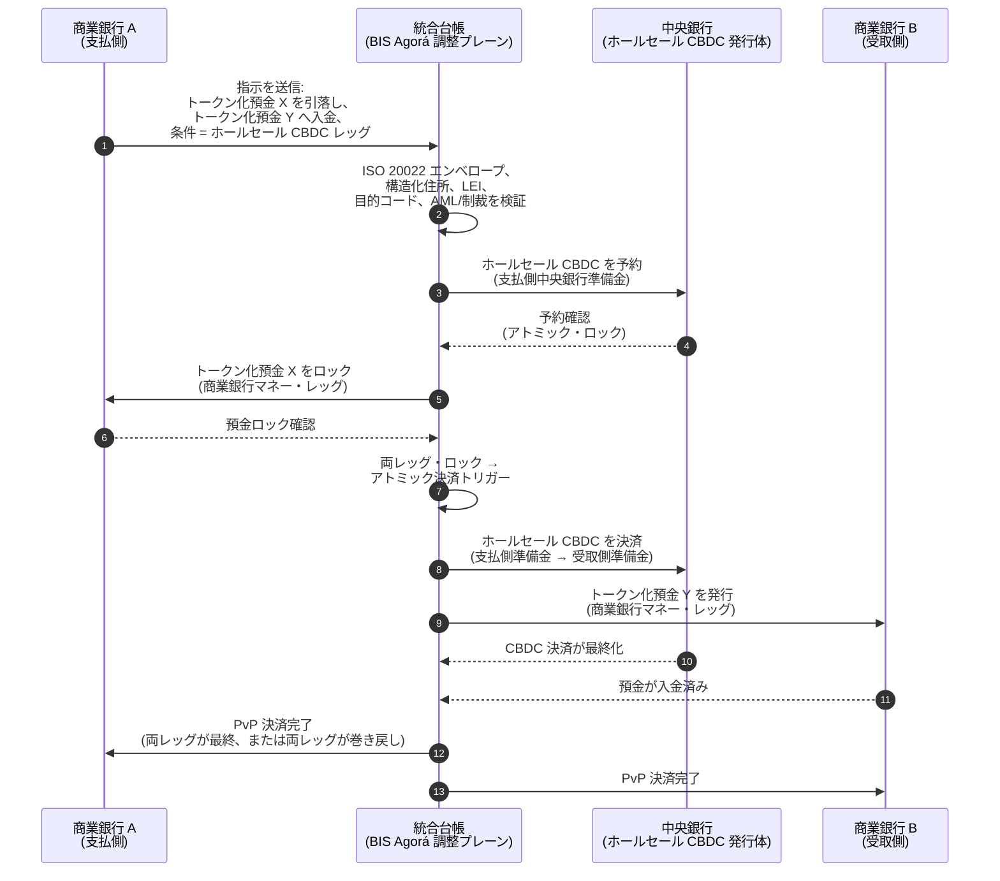

<!-- lead-start: manual -->
<aside class="post-lead" aria-label="記事サマリー">

<strong>要旨。</strong> 2026 年のホールセール決済は、2 つの構造的シフトの交点に位置します。ISO 20022 が構造化された決済データを業務モデルへ強制的に組み込み、トークン化預金と BIS Project Agorá が国境を越えた決済をアトミックかつプログラマブルで常時稼働のレールへ移行させています。2026 年に銀行が問うべきは「メッセージを移行したか」ではなく「決済オペレーションは計測可能で、ルーティングされ、監督可能か」です。本指数はこれを 4 つの正確な百分率に分解します:構造化データ完備率、レール経路選択の最適度、決済の最終性ラグ、Agorá コリドー被覆率です。

<strong>主要な要点</strong>

<ul class="post-lead-takeaways">
  <li><strong>2026 年 11 月は厳格な期限であり、指針ではありません。</strong> SWIFT は SR 2026 で非構造化住所のサポートを撤廃します。指定フィールドに都市と国が含まれない決済はクリアリングを停止します。修正コスト、リジェクト率、オペレーション容量はすべて「メトリック」から「監督当局可視の姿勢」へ移ります。</li>
  <li><strong>規制対象のホールセールではトークン化預金がステーブルコインに勝ります。</strong> 銀行・預金者関係と中央銀行決済資産を保持しつつ、プログラマビリティを露出します。ステーブルコインは周縁に役割を保ち、トークン化預金はコアを支えます。</li>
  <li><strong>BIS Project Agorá はコリドーの参照点です。</strong> 銀行の国境を越えた商品が 2027 年までに Agorá コリドー内で稼働できないなら、市場の他者がすでに退出しているレール上で競争していることになります。</li>
  <li><strong>リアルタイムレール・オーケストレーションが業務モデルです。</strong> 2026 年のマルチレール意思決定(FedNow / RTP / TIPS / SEPA Inst / オンチェーン)は「どのレール」ではなく、決済ごとにレールを選択するポリシーレジスター、流動性プロファイル、ルーティングエンジンの問題です。</li>
  <li><strong>計測するか、計測される側になるか。</strong> 構造化データ完備率、レール経路選択の最適度、決済の最終性ラグ、Agorá コリドー被覆率の 4 つの百分率が、2026/27 年の監査ウィンドウに先立ち決済姿勢を監督対応可能な証跡へ変換します。</li>
</ul>
</aside>
<!-- lead-end -->

# 2026 年ホールセール決済指数:ISO 20022、トークン化預金、リアルタイムレール、国境を越えた決済

2026 年のホールセール決済は、2 つの同時シフトによって再構成されています:構造化された決済データと、プログラマブル決済です。SWIFT の 2026 年 11 月構造化住所マイルストーンはデータ品質を業務モデルへ強制的に組み込み、BIS Project Agorá とトークン化預金は国境を越えた決済がよりアトミックで透明性が高く常時稼働になり得るかを検証しています。

---

> **エグゼクティブサマリー / 主要な要点**
>
> - **2026 年 11 月は厳格なデータマイルストーンです。** SWIFT は SR 2026 変更以後、非構造化住所を含む決済はサポートされなくなると述べています。
> - **構造化データはプロダクトインフラになります。** 都市と国は少なくとも指定フィールドに格納される必要があり、決済データ品質はクライアント、オペレーション、コンプライアンスの課題となります。
> - **トークン化預金はホールセール設計の選択肢です。** Project Agorá はトークン化された商業銀行預金とトークン化された中央銀行準備金を統合台帳モデルで検証しています。
> - **本指数は速度だけでなく決済品質を計測すべきです。** 最終性、透明性、修正率、流動性使用、コンプライアンスデータ、クライアント可視性は、即時実行と同程度に重要です。
> - **国境を越えた決済は引き続き官民共同のアジェンダです。** FSB は実装フェーズを通じて G20 ロードマップを推進し、公共部門と民間部門の調整を継続しています。
>
---

## なぜ 2026 年がこの指数の重要な年なのか

Stanford AI Index が有用なのは、急速に進化する技術分野を計測可能な対象として扱うためです。研究成果、技術的性能、責任ある展開、経済、セクター採用、政策、世論を単一のフレームに収めます([Stanford HAI ⧉](https://hai.stanford.edu/ai-index/2026-ai-index-report "The 2026 AI Index Report"))。銀行および金融機関は、いまやインフラに対して同じ規律を必要としています。エージェント型 AI、量子安全セキュリティ、クラウドネイティブのレジリエンス、ホールセール決済は、もはや別個のイノベーション軌道ではありません。1 つの業務モデルへ収束しています。

銀行にとっての実務的な問いは、各領域が重要かどうかではありません。問いは、機関がそれら全てにわたるレディネスを同時に計測できるかどうかです。銀行はエージェント型 AI を展開しても、暗号が移行対応でなければ脆弱です。クラウドプラットフォームを近代化しても、決済データが非構造化のままでは失敗します。トークン化のパイロットを走らせても、決済・流動性・アイデンティティ・監査の各レイヤーが一体設計されていなければシステミックリスクを生み出します。

## 2026 年指数アーキテクチャ

| 指数レイヤー | 2026 年の方向性 | レディネス・メトリック | 取り扱いを誤った場合のリスク |
|---|---|---|---|
| **ISO 20022 データ** | 非構造化テキストから統制された構造化フィールドへ移行 | 構造化住所のレディネスとリジェクト率 | 決済のリジェクトと手動修正 |
| **レール・オーケストレーション** | RTGS、即時、コルレス、ステーブルコイン、トークン化されたレールにわたり経路選択 | コスト、速度、最終性、法域認識ルーティング | 統制が重複した分断レール |
| **トークン化された決済** | フリクションを削減する場面でトークン化預金と中央銀行マネーを使用 | DvP、PvP、アトミック決済の被覆 | 業務ワークフロー価値のないパイロット資産 |
| **流動性** | 日中流動性、滞留資金、決済ウィンドウを最適化 | 節減された流動性と決済失敗の削減 | 流動性の流出加速 |
| **コンプライアンス** | AML、制裁、FATF、監査要件を決済データに組み込み | ストレートスルーのコンプライアンスと説明可能性 | より豊富なデータがあっても統制は強化されない |

## グローバル優先事項に対応づけた主要ホールセール決済シグナル

2026 年のシグナル群は研究アジェンダではありません。銀行のチーフ・ペイメンツ・オフィサーが既に評価対象とされているデリバリー・チェックリストです。是正作業が現れる場所は 3 つあります:メッセージ・エンベロープ、レール・オーケストレーション層、決済台帳です。

| シグナル | G20 / SWIFT / BIS 出典 | 技術プラットフォーム実装 |
|---|---|---|
| **決済メッセージの 65% が依然として非構造化住所を含む** | [SWIFT SR 2026 — 構造化住所マイルストーン、2026 年 11 月 ⧉](https://www.swift.com/news-events/news/iso-20022-milestone-november-2026-unstructured-addresses-be-removed "ISO 20022 November 2026 structured address milestone") | メッセージが SWIFTNet アダプターに到達する前に決済ミドルウェアでスキーマ検証を実施します。コーポレートチャネルおよびコルレス銀行入口で住所の自動解析を行います。 |
| **FSB G20 目標:2027 年までに国境を越えた決済の 75% を 1 時間以内に完了** | [FSB 国境を越えた決済ロードマップ、2026 年実装フェーズ ⧉](https://www.fsb.org/2026/03/fsb-kicks-off-new-implementation-phase-to-enhance-cross-border-payments-through-public-private-partnership/ "FSB cross-border payments implementation phase") | 事前合意済みの流動性ウィンドウを備えたリアルタイム FX 換算ゲートウェイ、クライアントポータルへ接続する T+0 確認フック、1 時間の封筒を満たせないコリドーを除外するレール・ルーティング・エンジンを実装します。 |
| **FSB G20 目標:国境を越えた取引の平均コストを 1% 未満、リテールは 3% 未満に** | [FSB G20 定量的目標 ⧉](https://www.fsb.org/2026/03/fsb-kicks-off-new-implementation-phase-to-enhance-cross-border-payments-through-public-private-partnership/ "FSB cross-border payments implementation phase") | すべてのコリドーに対するコスト配賦テレメトリ(FX スプレッド、コルレス手数料、リフティング・コスト)、見積もり前に非準拠の価格設定を可視化するマージン・ポリシー・レジスターを整備します。 |
| **BIS Project Agorá が 7 中央銀行 + 41 商業銀行のプロトタイプ段階に入る** | [BIS Project Agorá ⧉](https://www.bis.org/about/bisih/topics/fmis/agora.htm "Project Agorá") | 統合台帳の連携仕様:トークン化預金台帳ノード + ホールセール CBDC 決済プレーン + KYC/AML フック。銀行のコリドー・シェアに合わせて規模設定したオンチェーン流動性プールを構築します。 |
| **Deutsche Bank の「デジタルマネー」枠組みがクライアント・アーキテクチャで結晶化** | [Deutsche Bank — Digital Money: stablecoins, tokenised deposits and CBDCs ⧉](https://flow.db.com/publications/flow-white-papers-and-guides/digital-money-a-perspective-on-stablecoins-tokenised-deposits-and-cbdcs "Digital Money: stablecoins, tokenised deposits and CBDCs") | 決済ごとにステーブルコイン / トークン化預金 / CBDC の選択を抽象化するウォレット非依存の決済 API を提供します。プログラマブルな条件は、クライアントではなく銀行のポリシーレジスターに対して評価されます。 |

## 決済データの変曲点

ISO 20022 はメッセージングフォーマットのプロジェクトからデータ品質の業務モデルへ移りました。受益者、債務者、債権者、エージェント、都市、国、目的、当事者データが脆弱であれば、銀行はリジェクト、修正、制裁関連のフリクション、クライアントの不満、分析の弱さに直面します。

**SR 2026 はこれを助言ではなく厳格な契約に変えます。** SWIFT Standards Release 2026(2026 年 11 月)は構造化住所ルールをネットワーク層で強制します。`<PstlAdr>` 要素に `<TwnNm>` と `<Ctry>` を含まないメッセージは、修正のためにフラグ付与されるのではなく、受信時に SWIFTNet 検証スタックで拒否されます。修正キューはバックオフィスのコストラインではなくなり、クライアントから見える遅延を伴う決済失敗イベントになります。SR 2026 を「より厳しいガイダンス」として扱ってきたオペレーションチームは、誤ったランブックで作業していることになります。

### ISO 20022 における構造化決済データ・コンプライアンス

是正対象範囲は狭く明確に定義されています。以下の XML 要素は、2026 年 11 月の SWIFTNet 検証スタックが実際にメッセージを拒否する箇所です。これ以外はすべて下流の波及効果に過ぎません。

| データ要素 | ISO 20022 XML タグ | 2026 年 11 月 SWIFT 要件 | 技術的是正戦略 |
|---|---|---|---|
| **構造化住所** | `<PstlAdr>` に `<TwnNm>` + `<Ctry>` を含むこと | 必須。非構造化の `<AdrLine>` テキストは受信側 SWIFTNet アダプターでネットワーク拒否を発生させます。 | 決済開始時に住所を自動解析します。コーポレートチャネルのフォームを書き換えます。次回引落し前にすべてのカウンターパーティで過去データをクレンジングします。 |
| **法人識別子(LEI)** | `<OrgId>` 配下の `<Id>` | 法人系金融カウンターパーティ検証に強く推奨。複数の CBPR+ コリドーでは必須。 | コーポレート・オンボーディング時に LEI ルックアップ + GLEIF クロスチェックを実施します。レファレンスデータサービスを通じて過去のカウンターパーティを自動補完します。 |
| **決済目的コード** | `<Purp>` に `<Cd>` を含むこと | 複数地域のリアルタイム・コリドー(CBPR+、SEPA Inst、TIPS)で自動 AML / 制裁スクリーニングのため必須。 | 銀行内部のレガシー取引コードを標準 ISO 20022 ExternalPurposeCode リストへ対応づけます。コーポレートチャネル UI で目的の選択肢を露出します。未知コードはデフォルト拒否とします。 |
| **究極当事者** | `<UltmtDbtr>` / `<UltmtCdtr>` | G20 FATF トラベル・ルール + 制裁パラメーターを満たすため究極受益者コンテキストを露出。一部の決済タイプコードでは必須。 | 台帳のサブ口座からエンド・ツー・エンドの当事者名を抽出します。KYC グラフに対して照合します。確認書ごとに究極当事者を表示します。 |
| **構造化レミッタンス情報** | `<RmtInf><Strd>` に `<RfrdDocInf>` を含むこと | CBPR+ Phase 2 配下で照合可能な請求書連動コーポレート決済に必須。 | コーポレートポータルの見積もり時点で構造化レミッタンスを取得します。高額フローでは自由テキスト・フォールバックを拒否します。 |

## トークン化預金とホールセール CBDC

トークン化預金は商業銀行マネーのモデルを保持しつつプログラマビリティを付加します。ホールセール中央銀行マネーは決済の最終性を保持します。興味深い設計パターンはその組み合わせです:クライアント関係と信用仲介には商業銀行マネー、最終決済とシステミック信頼には中央銀行マネー、という構成です。

Project Agorá はその組み合わせを具現化します。以下のアーキテクチャは、商業銀行預金台帳とホールセール CBDC 決済プレーンの双方を統合台帳で調整する、アトミックでペイメント対ペイメント(PvP)の国境を越えた決済に関する BIS リファレンス・パターンです。

決済は構造上アトミックです:両レッグがコミットされるか、両レッグがロールバックされます。ホールセール CBDC レッグでの決済の最終性により、商業銀行のトークン化預金移転はコルレス・リスクなしで有効となります。統合台帳は調整プレーンであり、それ自体は決済システムではありません。中央銀行が依然として決済資産を発行し、商業銀行が依然として預金負債を計上します。

## 新しいホールセール決済プロダクト

プロダクトはもはや単なる決済ではありません。実行、データ、流動性、コンプライアンス、追跡可能性、例外管理のバンドルです。それらの能力を API とクライアントダッシュボードを通じて露出できる銀行は、インフラのコンプライアンスをクライアント価値へ転換します。

## 銀行タイプ別の意味

### グローバルなシステム上重要な銀行

グローバル銀行は本指数を企業アーキテクチャのスコアカードとして扱うべきです。優先事項は新たな概念実証ではありません。自律ワークフロー、暗号移行、クラウド依存、決済近代化が単一のリスクと価値のシステムとして統治できる証跡です。

### トランザクションバンクおよびコーポレートバンク

トランザクションバンクはホールセール決済、構造化データ、流動性、トークン化預金、エージェント型のトレジャリーサービスに集中すべきです。最も価値あるクライアント提案は単なる資金移動の高速化ではありません。調査件数を削減し、運転資本の可視性を高める、説明可能で監査可能でプログラマブルな資金移動です。

### リージョナルバンク

リージョナルバンクは本指数を活用してプログラムの過大化を回避すべきです。すべての最前線をリードする必要はありませんが、AI ガバナンス、ポスト量子インベントリ、クラウド出口エビデンス、決済データのレディネスについて信頼に足るポジションは必要です。

### フィンテック、PSP、インフラプロバイダー

フィンテックとインフラプロバイダーは、計測可能な銀行のレディネスへプロダクト・ロードマップを整合させるべきです。最良の提案は統合リスクを削減し、エビデンスを強化し、複雑なインフラを銀行が統治しやすくします。

## 結論

指数形式レポートの価値は、断片化された技術アジェンダを計測可能な業務モデルへ変換する点にあります。2026 年、金融インフラにおける勝者は最も多くのパイロットを持つ機関ではありません。自律、セキュリティ、レジリエンス、決済、経済、ガバナンスにわたるレディネスを同時に証明できる機関です。

## よくある質問

**ISO 20022 はなぜ 2026 年でも論点なのか?**

決済データが構造化・統制され、ソースで捕捉され、チャネル・クライアント・市場インフラを横断して使用可能になるまで移行は完了しないためです。

**トークン化預金とは何か?**

トークン化預金は商業銀行マネーのデジタル表現で、銀行・預金者関係を保持しつつプログラマブル決済を可能にするよう設計されたものです。

**トークン化預金はステーブルコインを置き換えるのか?**

どこでもというわけではありません。ステーブルコインは一部のデジタル資産・国境を越えた文脈で有用であり得ますが、トークン化預金は規制対象のホールセール銀行業務に対して構造的に魅力的です。

**銀行は何を計測すべきか?**

構造化データのレディネス、決済リジェクト、修正コスト、決済時間、流動性使用、レール経路選択の成果、クライアント可視性を計測してください。

## 参考文献

- SWIFT, (2026). [ISO 20022 November 2026 structured address milestone ⧉](https://www.swift.com/news-events/news/iso-20022-milestone-november-2026-unstructured-addresses-be-removed "ISO 20022 November 2026 structured address milestone").
- BIS Innovation Hub, (2026). [Project Agorá ⧉](https://www.bis.org/about/bisih/topics/fmis/agora.htm "Project Agorá").
- FSB, (2026). [Cross-border payments implementation phase ⧉](https://www.fsb.org/2026/03/fsb-kicks-off-new-implementation-phase-to-enhance-cross-border-payments-through-public-private-partnership/ "Cross-border payments implementation phase").
- Deutsche Bank, (2026). [Digital Money: stablecoins, tokenised deposits and CBDCs ⧉](https://flow.db.com/publications/flow-white-papers-and-guides/digital-money-a-perspective-on-stablecoins-tokenised-deposits-and-cbdcs "Digital Money: stablecoins, tokenised deposits and CBDCs").

<!-- enrich-start -->
<aside class="author-card" aria-label="著者について"><strong class="author-card-name"><a href="/about/index.html">Sebastien Rousseau</a></strong>応用 AI、決済インフラ、トークン化マネー、ISO 20022、ポスト量子セキュリティ、クラウドネイティブ金融サービス、規制対象のデジタル市場について執筆するシニア銀行テクノロジスト。HSBC コマーシャル&amp;インベストメントバンク、PayPal、Barclays、Shazam、AKQA、Virgin Group を横断する 20 年以上の経験。<a href="/about/index.html">プロフィール全体</a> &middot; <a href="https://www.linkedin.com/in/sebastienrousseau/" rel="external noopener">LinkedIn</a> &middot; <a href="https://github.com/sebastienrousseau" rel="external noopener">GitHub</a></aside>

最終レビュー <time datetime="2026-06-06">2026-06-06</time>。

<!-- enrich-end -->
