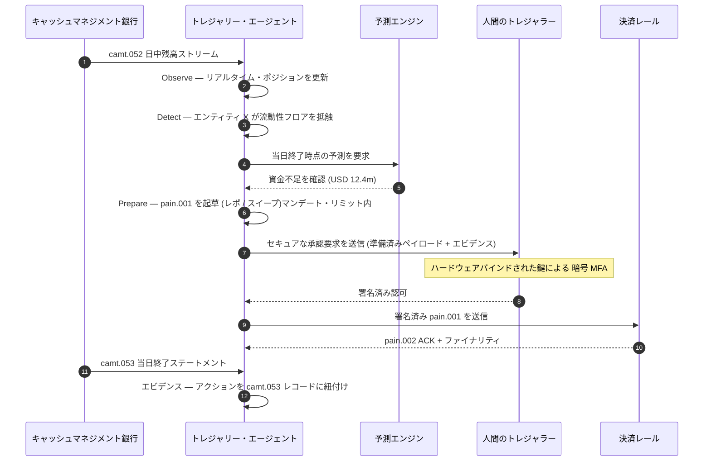

# 2026 年の自律トレジャリー指数:エージェント型トレジャリー、プログラマブル流動性、トークン化預金、リアルタイムキャッシュ管理

<!-- lead-start -->
<aside class="post-lead" aria-label="記事の要約">

<strong>要点。</strong>2026 年の自律トレジャリー指数 — エージェント型ワークフロー、プログラマブル流動性のカバレッジ、トークン化預金の統合、リアルタイム決済のオーケストレーション、自動キャッシュ管理を、ひとつのオペレーティングモデルとして測定します。

<strong>主要なポイント</strong>

<ul class="post-lead-takeaways">
  <li><strong>トレジャリーはリアルタイムなオペレーティングシステムへ進化しています。</strong>静的な資金繰り予測やバッチ処理によるスイープはもはや測定の単位ではなく、リアルタイムデータ上で動くエージェント型ワークフローがその役割を担います。</li>
  <li><strong>プログラマブル流動性は実用段階に入りました。</strong>トークン化預金とリアルタイム決済レールの組み合わせにより、イベント単位の流動性供給は四半期単位のイニシアチブではなく、ワークフローのプリミティブとなります。</li>
  <li><strong>トレジャラーにとってトークン化預金が望ましいデジタルマネーです。</strong>銀行マネーの経済性、プログラマビリティ、日中の確実性を備えつつ、ステーブルコインに付随する発行体リスクや準備資産の論点を回避できます。</li>
  <li><strong>コントロールプレーンは新しい監査面です。</strong>マンデート、リミット、オーバーライドの経路、取消エビデンスは、個別アクションごとの手作業承認ではなく、プラットフォームのプリミティブとして稼働する必要があります。</li>
  <li><strong>CFO のスコアカードは四半期単位ではなく意思決定単位です。</strong>資金コスト、日中流動性バッファの削減、FX 効率、予測精度は、ワークフローの速度で測定されます。</li>
</ul>

<strong>関連記事:</strong> <a href="https://sebastienrousseau.com/2026-05-25-programmable-liquidity-ai-tokenised-deposits-real-time-treasury-2026/index.html">2026 年のプログラマブル流動性:AI、トークン化預金、リアルタイム・トレジャリー・オーケストレーション</a>、<a href="https://sebastienrousseau.com/2026-05-21-tokenised-deposits-banking-services-status-2026/index.html">2026 年のトークン化預金:銀行サービス、ステーブルコインとの競争、プログラマブルな商業銀行マネーの現在地</a>。

</aside>
<!-- lead-end -->

自律トレジャリーは、エージェント型 AI、ホールセール決済、トークン化預金、リアルタイム流動性が自然に交わる接点です。2026 年における優れたトレジャリー・アーキテクチャは、単に資金を予測するだけでなく、口座、通貨、レール、決済資産を横断して、制限付きの流動性アクションを推奨し、説明し、最終的には実行できるものとなります。

---

> **取締役会向けサマリー / 主要なポイント**
>
> - **トレジャリーはレポーティングから統制へとシフトしています。**リアルタイムの残高、予測、決済ステータス、流動性の動きが、ひとつのワークフローの一部となりつつあります。
> - **エージェント型 AI は新しいトレジャリー・インターフェースを生み出します。**エージェントは、ポジションを監視し、異常を可視化し、資金調達アクションを準備し、定められたマンデート内で意思決定をエスカレーションできます。
> - **プログラマブル・マネーがキャッシュ・レッグを変革します。**トークン化預金とホールセール CBDC の実証は、アトミック決済、条件付き決済、常時稼働の流動性に新たな可能性をもたらします。
> - **指数は権限を測定する必要があります。**問いは、エージェントがアクションを提案できるか否かではなく、権限、リミット、承認、エビデンスが明確であるか否かです。
> - **トレジャリーの価値は測定可能です。**節約された流動性、削減された手作業による調査、回避された決済失敗、解放された運転資本によって、成功は定義されるべきです。
>
---

## なぜ 2026 年がこの指数を必要とする年なのか

Stanford AI Index が有用であるのは、急速に進化するテクノロジー分野を測定可能な対象として扱い、研究成果、技術性能、責任ある展開、経済性、産業導入、政策、世論を単一のフレームにまとめている点にあります([Stanford HAI ⧉](https://hai.stanford.edu/ai-index/2026-ai-index-report "2026 年 AI Index レポート"))。銀行および金融機関は、インフラに対しても同じ規律を適用する必要があります。エージェント型 AI、量子安全セキュリティ、クラウドネイティブのレジリエンス、ホールセール決済は、もはや別個のイノベーション・トラックではなく、ひとつのオペレーティングモデルへと収斂しつつあります。

銀行にとって実務的な問いは、それぞれの領域が重要かどうかではありません。すべての領域における準備態勢を同時に測定できるかどうかです。ある銀行はエージェント型 AI を展開しながらも、暗号資産が移行対応となっていなければ脆弱なままです。クラウドプラットフォームを刷新しても、決済データが非構造化のままであれば失敗します。トークン化のパイロットを進めても、決済、流動性、アイデンティティ、監査の各層を一体で設計しなければ、システミックリスクを生み出します。

## 2026 年指数のアーキテクチャ

| 指数レイヤー | 2026 年の方向性 | 準備態勢の指標 | 誤処理時のリスク |
|---|---|---|---|
| **可視性** | 口座、決済、流動性、エクスポージャー・データを統合する | リアルタイム資金ポジションのカバレッジ | 資金可視性の断片化 |
| **予測** | AI を活用し残高、フロー、資金調達ニーズを予測する | 予測精度と例外発生率 | 弱いデータに対する誤った自信 |
| **自律性** | エージェントに推奨と実行のための制限付き権限を付与する | マンデートのカバレッジと承認の質 | 無権限または説明不能なアクション |
| **プログラマビリティ** | 価値があればトークン化預金とスマート条件を活用する | 条件付き決済とアトミック決済のユースケース | テクノロジー主導のトレジャリー・パイロット |
| **統制** | リミット、制裁、FX、流動性、監査統制を組み込む | トレジャリー・アクションごとの統制エビデンス | 実行後の手作業によるガバナンス |

## 注視すべき現在のシグナル

| シグナル | 銀行にとっての意味 | 出典 |
|---|---|---|
| **金融サービスにおける 52% のエージェント型 AI 導入** | トレジャリーはガバナンスされたプラットフォーム経由でエージェント型ワークフローを取り込めるようになりました | [Cambridge CCAF ⧉](https://www.jbs.cam.ac.uk/faculty-research/centres/alternative-finance/publications/2026-global-ai-in-financial-services-report/ "2026 年金融サービスにおけるグローバル AI レポート") |
| **Project Agorá の条件付き決済** | トークン化は条件付きかつ常時稼働の決済機能を可能にする可能性があります | [BIS ⧉](https://www.bis.org/about/bisih/topics/fmis/agora.htm "Project Agorá") |
| **Bank of England Digital Securities Sandbox** | DLT で発行された債券および株式は、DvP(証券・資金同時受渡)基準で決済されます — 資産レッグと資金レッグ(ホールセール CBDC またはトークン化された商業銀行預金)が同一のアトミック・トランザクション内で決済されるため、元本カウンターパーティ・リスクが排除されます | [Bank of England ⧉](https://www.bankofengland.co.uk/financial-stability/digital-securities-sandbox "Digital Securities Sandbox") |
| **SWIFT の構造化住所の期限** | トレジャリーデータはソースの段階で正しく取得される必要があります | [SWIFT ⧉](https://www.swift.com/news-events/news/iso-20022-milestone-november-2026-unstructured-addresses-be-removed "ISO 20022 2026 年 11 月の構造化住所マイルストーン") |
| **大手金融機関は AI 価値の測定に苦戦** | トレジャリーの自動化には堅固な経済指標が必要です | [Cambridge CCAF ⧉](https://www.jbs.cam.ac.uk/faculty-research/centres/alternative-finance/publications/2026-global-ai-in-financial-services-report/ "2026 年金融サービスにおけるグローバル AI レポート") |

## トレジャリー・エージェントのマンデート

トレジャリー・エージェントは汎用アシスタントとして設計されるべきではありません。マンデートが必要です。すなわち、口座を観察し、例外を検出し、資金不足を予測し、アクションを準備し、承認を申請し、リミット内で実行し、エビデンスを生成する、という一連の役割です。各ステップには異なる権限モデルが適用されるべきです。

制御ループは、Observe(観察)→ Detect(検出)→ Forecast(予測)→ Prepare(準備)→ Request Approval(承認申請)の順で実行され、そこで止まります。エージェントが単独で暗号学的な認可境界を越えることはありません。以下の図は、1 サイクル全体の流れを示しています。数百万ドル規模の日中流動性不足が `camt.052` テレメトリ上で顕在化し、エージェントが当日終了時点のポジションを予測し、レポまたは社内スイープを完全な形の `pain.001` として準備し、ハードウェアバインドされた鍵による多要素暗号署名のために人間のトレジャラーへ引き渡します。エージェントはその後、署名済みペイロードを送信します。ファイナリティは `pain.002` の ACK として確定し、続いて記録としての `camt.053` が到着します。

境界線こそが要点です — 実際の資金を動かすすべてのアクションは、エージェント単独では満たすことのできない暗号学的ゲートの背後に置かれます。

## プログラマブル流動性

プログラマブル流動性とは、条件下で価値を移動させる能力です。たとえば、しきい値が抵触した場合、担保が適格である場合、カウンターパーティがスクリーニングを通過した場合、決済ファイナリティが得られている場合、または日中流動性バッファが過小である場合などです。トークン化預金とホールセール決済プラットフォームにより、こうしたパターンの実装がより現実的になります。

プログラマブルであることは、標準を外れることを意味しません。実行経路は `pain.001` — ISO 20022 の Customer Credit Transfer Initiation — です。エージェントが準備したアクションは、完全な形の `pain.001` ペイロードであり、企業 ERP が利用するのと同じチャネルを通じて銀行へルーティングされ、同じスキーマに対してバリデーションされ、同じ不正検知および制裁スクリーニングのエンジンによりスコアリングされ、同じ `pain.002` ステータス・レポート上で承認されます。条件付与のレイヤー(しきい値、担保適格性、ファイナリティの可用性、バッファ・フロア)はメッセージの上位に位置します — それは `pain.001` を「送信するか否か」をゲートするものであり、メッセージの「形そのもの」を決定するものではありません。条件を表現するために独自ペイロードを発明するトレジャリー・プラットフォームは、銀行が消費可能な経路から外れ、バイラテラル統合の領域へと押し戻されることになります。

## トレジャリー・コントロールルーム

オペレーティングモデルはコントロールルームのような構成であるべきです。すなわち、ポジション、予測、決済ステータス、リミット使用率、例外、承認、エビデンスを単一のインターフェースに集約する形です。指数においては、メール、スプレッドシート、銀行ポータル、断絶したダッシュボードをチームが手作業で繋ぎ合わせる必要があるトレジャリー・スタックは減点されるべきです。

そのインターフェースの背後にあるデータ・プレーンは、ISO 20022 のキャッシュマネジメントです。日中ポジションは `camt.052` — Bank-to-Customer Account Report — であり、銀行が公表する頻度(ティア 1 の GTB プロバイダーであれば分単位、ロングテール側ではサイクル終了時)で、すべてのキャッシュマネジメント銀行からエージェントの観察レイヤーへとストリームされます。当日終了の照合は `camt.053` — Bank-to-Customer Statement — であり、翌朝、エージェントの予測がそれを基準として評価される監査可能な記録となります。PDF ステートメントを読み込む、または銀行ポータルをスクリーン・スクレイピングするトレジャリー・プラットフォームは、本指数のレベル4を満たすことはできません。予測ループが実行可能なタイミングで閉じるためには、日中テレメトリが構造化された `camt.052` として到着する必要があります。

## 銀行タイプ別の意味

### グローバル・システム上重要銀行

グローバル銀行はこの指数を全社アーキテクチャのスコアカードとして扱うべきです。優先事項はもう一つの概念実証ではなく、自律ワークフロー、暗号移行、クラウド依存、決済モダナイゼーションが単一のリスクおよび価値システムとしてガバナンス可能であることのエビデンスです。

### トランザクションバンクとコーポレートバンク

トランザクションバンクは、ホールセール決済、構造化データ、流動性、トークン化預金、エージェント型トレジャリー・サービスに注力すべきです。顧客にとって最も価値ある提案は、単に速い資金移動だけではなく、説明可能で監査可能、かつプログラマブルな資金移動であり、調査件数が少なく、運転資本の可視性が高いものです。

### 地域銀行

地域銀行はプログラム拡散を回避するためにこの指数を活用すべきです。すべてのフロンティアをリードする必要はありませんが、AI ガバナンス、ポスト量子インベントリ、クラウド出口戦略のエビデンス、決済データの準備態勢において、信頼に足るポジションを持つ必要があります。

### フィンテック、PSP、インフラ・プロバイダー

フィンテックおよびインフラ・プロバイダーは、自社の製品ロードマップを測定可能な銀行の準備態勢に整合させるべきです。最良の提案は、統合リスクを削減し、エビデンスを強化し、銀行が複雑なインフラをガバナンスしやすくするものです。

## 結論

指数形式のレポートの価値は、断片化したテクノロジー課題を測定可能なオペレーティングモデルへと転換できる点にあります。2026 年の金融インフラにおける勝者は、最も多くのパイロットを抱える機関ではありません。自律性、セキュリティ、レジリエンス、決済、経済性、ガバナンスの全領域における準備態勢を同時に証明できる機関です。

## よくある質問

**自律トレジャリーとは何ですか?**

自律トレジャリーとは、AI エージェント、リアルタイムデータ、プログラマブル決済を活用し、定められた統制の下でトレジャリー・アクションを監視、推奨、必要に応じて実行することを指します。

**トレジャリー・エージェントに決済の実行を許可すべきですか?**

限定的なマンデート、強固なリミット、明示的な承認、完全な監査可能性のもとでのみ許可すべきです。実行権限は成熟度を通じて獲得されるべきものです。

**トークン化預金はトレジャリーにどのように寄与しますか?**

商業銀行マネーの関係を維持しながら、プログラマブル決済、アトミック実行、より優れた日中流動性管理の可能性を提供します。

**最初の実装ステップは何ですか?**

自律性を付与する前に、リアルタイムの可視性とデータ品質を構築することです。エージェントは、正確に把握できない資金を安全に最適化することはできません。

## 参考文献

- Cambridge Centre for Alternative Finance, (2026). [2026 年金融サービスにおけるグローバル AI レポート ⧉](https://www.jbs.cam.ac.uk/faculty-research/centres/alternative-finance/publications/2026-global-ai-in-financial-services-report/ "2026 年金融サービスにおけるグローバル AI レポート").
- SWIFT, (2026). [ISO 20022 2026 年 11 月の構造化住所マイルストーン ⧉](https://www.swift.com/news-events/news/iso-20022-milestone-november-2026-unstructured-addresses-be-removed "ISO 20022 2026 年 11 月の構造化住所マイルストーン").
- BIS Innovation Hub, (2026). [Project Agorá ⧉](https://www.bis.org/about/bisih/topics/fmis/agora.htm "Project Agorá").
- Bank of England, (2026). [英国のデジタル金融の未来を形づくる ⧉](https://www.bankofengland.co.uk/speech/2025/january/sasha-mills-speech-at-the-tokenisation-summit "英国のデジタル金融の未来を形づくる").

<!-- enrich-start -->
<aside class="author-card" aria-label="著者について"><strong class="author-card-name"><a href="/about/index.html">Sebastien Rousseau</a></strong>応用 AI、決済インフラ、トークン化マネー、ISO 20022、ポスト量子セキュリティ、クラウドネイティブな金融サービス、規制対象デジタル市場について執筆するシニア銀行テクノロジスト。HSBC コマーシャル&amp;インベストメントバンク、PayPal、Barclays、Shazam、AKQA、Virgin Group を横断する 20 年以上の経験。<a href="/about/index.html">プロフィール全体</a> &middot; <a href="https://www.linkedin.com/in/sebastienrousseau/" rel="external noopener">LinkedIn</a> &middot; <a href="https://github.com/sebastienrousseau" rel="external noopener">GitHub</a></aside>

最終確認 <time datetime="2026-06-07">2026-06-07</time>。

<!-- enrich-end -->
