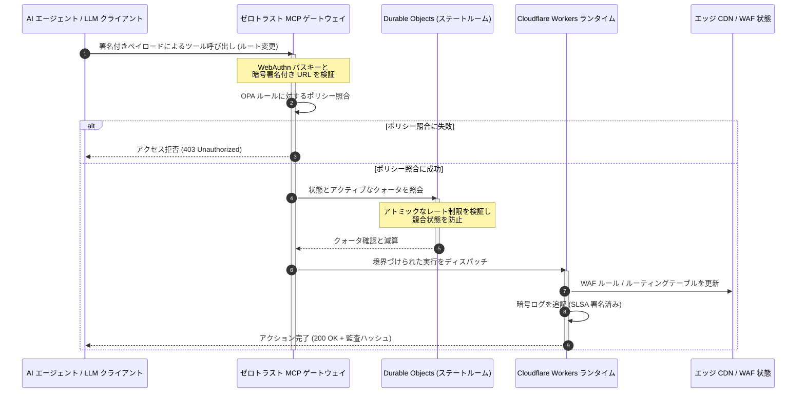

# CloudCDN:2026 年 AIネイティブ・エッジのオープンソース・ブループリント

<!-- lead-start: manual -->
<aside class="post-lead" aria-label="記事の要約">

<strong>要点。</strong>2026 年のエンタープライズ・テクノロジーは、グローバルに分散したサーバーレス実行とエージェント型 AI の収斂によって定義されます。静的ファイルのキャッシュと基本的なトラフィック・ルーティングのために構築された標準的な CDN は、アクティブでリアルタイムなデータ・オーケストレーションの時代において構造的に時代遅れです。CloudCDN は、エッジをアクティブなコントロールプレーンへと転用するオープンソースのブループリントです。サーバーレス・ランタイム、Cloudflare Durable Objects によるステートフルな協調、そして自律型 AI エージェントが境界づけられ暗号学的に保護された運用エンベロープの内側で Web インフラを操作できるようにする、ゼロトラストの Model Context Protocol(MCP)ゲートウェイで構成されます。

<strong>主要なポイント</strong>

<ul class="post-lead-takeaways">
  <li><strong>静的キャッシュから境界づけられたコントロールプレーンへ。</strong>CloudCDN は運用境界をエッジへ移し、CDN ノードを、ミリ秒未満でセキュリティ、ルーティング、アクセス制御の判断を実行するアクティブなポリシーゲートへと転換します。</li>
  <li><strong>ステートフルなエッジ協調。</strong>Cloudflare Durable Objects がアトミックでリアルタイムなレート制限と状態協調をグローバルに強制します — 分散した競合状態も、エッジリージョンを横断する組織的なクォータ濫用も発生させません。</li>
  <li><strong>MCP による安全なエージェント型インフラ管理。</strong>ゼロトラスト・ゲートウェイが 42 個の専用 MCP ツールを公開し、AI エージェントが暗号署名された境界の下でインフラを検査、構成、運用できるようにします。</li>
  <li><strong>パイプラインの成果物としてのサプライチェーン・セキュリティ。</strong>Sigstore/Cosign による SLSA Level 3 のビルド来歴と、すべてのリリースにおける 3,185 件のユニットテスト(100% カバレッジ)。</li>
  <li><strong>ダッシュボードではなく、取締役会レベルのエビデンス。</strong>エッジのテレメトリーは、DORA 第5条の取締役会の説明責任、BCBS 239 のリスク報告、Basel III のオペレーショナル・リスク資本規則に直接マッピングされます。</li>
</ul>

<strong>関連記事:</strong> <a href="/2026-05-16-best-cloud-infrastructure-architecture-2026/">2026年の最良のクラウドインフラストラクチャアーキテクチャ:金融サービスのためのAIネイティブ・マルチクラウド・量子対応設計図</a> · <a href="/2026-06-05-cloud-native-banking-index-dora-resilience-platform-engineering-2026/">2026 年クラウドネイティブバンキング指標:DORA、プラットフォームエンジニアリング、ソブリンクラウド、運用レジリエンス</a> · <a href="/2026-06-03-agentic-ai-index-banks-autonomy-governance-auditability-2026/">銀行向けエージェント型AIインデックス 2026:自律性・ガバナンス・監査可能性・ビジネスインパクトの測定</a>

</aside>
<!-- lead-end -->

CDN を巡る議論は決着しました。エッジはもはやキャッシュではなく、AIネイティブ・ソフトウェアのコントロールプレーンです。エージェントがツールを呼び出し、データを移動し、キャッシュをパージし、署名付きURL を要求し、ワークフローを協調させるなかで、不透明なダッシュボードと独自仕様のコントロールプレーンという旧来のモデルは、不便にとどまらず規制上の責任問題になります。CloudCDN が主張するのは異なるモデルです。セキュリティ、アクセシビリティ、パフォーマンス、監査可能性を、ベンダーの約束ではなく強制可能なデフォルトとして扱う、オープンで、検査可能で、エージェント制御可能なエッジプラットフォームです。

本稿のオープンソース・リファレンスは [cloudcdn.pro ⧉](https://github.com/sebastienrousseau/cloudcdn.pro "cloudcdn.pro") です。このリポジトリは、エンドツーエンドで読み解け、独立してデプロイできるマルチテナントの AIネイティブ CDN です。Cloudflare PoP 全域で 100ms 未満の TTFB、MCP 制御、Durable Objects によるレート制限、WCAG-AA アクセシビリティ、署名付きURL、パスキー、SLSA Level 3、そして 3,185 件のテストを 100% カバレッジで備えています。

---

> **取締役会向けサマリー / 主要なポイント**
>
> - **エッジが運用境界になります。**CloudCDN は標準的な CDN ノードを、ミリ秒未満のセキュリティ、ルーティング、アクセス制御を実行するアクティブなポリシーゲートへと転換します。
> - **Durable Objects がレート制限をアトミックにします。**リアルタイムでグローバルに一貫したクォータ強制が、結果整合性型のリミッターが攻撃者や誤動作するエージェントに開け放している競合状態の窓を閉じます。
> - **エージェントは境界づけられた 42 個の MCP ツールを通じてインフラを操作します。**すべての呼び出しは、実行前に WebAuthn パスキー、署名付きペイロード、OPA ポリシーに対して検証されます。
> - **サプライチェーンはプロダクトの一部です。**Sigstore/Cosign による SLSA Level 3 の来歴が、すべてのリリースを監査済みソースへ暗号学的に結び付けます。
> - **テレメトリーはコンプライアンス・エビデンスです。**エッジの運用は、事後報告を介さず直接に、DORA 第5条、BCBS 239、Basel III のオペレーショナル・リスク資本へマッピングされます。
>
---

## なぜこのオープンソース・プロジェクトが 2026 年に重要なのか

2026 年のエンタープライズ IT は、静的なインフラ・プロビジョニングから、リアルタイムでイベント駆動のデータ・オーケストレーションへと移行しました。この転換を駆動する市場の力は 2 つあります。

第一に、エージェント型 AI の急速な普及です。自律型モデルとソフトウェアエージェントは、自動化された脅威の緩和、ルーティングの判断、リアルタイムの台帳バランシングといった複雑な業務タスクをいまや遂行しています。これらはダッシュボードを使いません。ツールを呼び出します。

第二に、[デジタル・オペレーショナル・レジリエンス法(DORA) ⧉](https://eur-lex.europa.eu/legal-content/EN/TXT/?uri=CELEX%3A32022R2554 "金融セクターのデジタル・オペレーショナル・レジリエンスに関する規則 (EU) 2022/2554")の能動的な執行です。銀行機関はもはや、不透明で独自仕様のサードパーティ CDN に依存できません。規制当局は、ソフトウェア・サプライチェーンへの完全な可視性、検証可能な撤退能力、改ざん不能な暗号監査証跡を要求しています。

中央集権的なサーバー・アーキテクチャは、リアルタイム・オーケストレーションが吸収できないレイテンシのペナルティを課します。独自仕様の CDN は、金融機関を、目視もエビデンス化もできないサプライチェーン侵害にさらすブラックボックスとして機能します。CloudCDN は、エッジをアクティブなコントロールプレーンへと転換する、透明でゼロトラストなオープンソースのブループリントによってこのギャップを閉じます。テクノロジー経営層にとって、これは議論をコンプライアンスのコストから Return on Resilience(レジリエンスへの投資対効果)へと移します。すなわち、自動化された監査対応可能なオペレーション・パイプラインによって保全される資本です。

## アーキテクチャ・レンズ

CloudCDN のアーキテクチャは 5 つのレイヤーで構成され、中央集権的なミドルウェアをローカライズされたステートフルなエッジ・プリミティブで置き換えます:

| レイヤー | 設計上の決定 | 重要である理由 | 誤処理時のリスク |
|---|---|---|---|
| **エッジランタイム** | Cloudflare Workers と Pages | 中央集権的な VM のレイテンシを排除し、ミリ秒未満のポリシーをグローバルに実行 | ポリシー規律なきパフォーマンス向上は無秩序なエッジドリフトを生む |
| **状態の協調** | Durable Objects | レート制限と共有状態について、リージョンを横断したアトミックでリアルタイムな整合性を保証 | 分散した競合状態、API リソースの濫用、境界クォータのバイパス |
| **エージェント・インターフェース** | ゼロトラスト MCP ゲートウェイ | 42 個の専用 MCP ツールを公開し、AI エージェントがガバナンスされた境界の下でインフラを運用 | 無制限なツール呼び出しと無許可の構成変更 |
| **アクセス制御** | WebAuthn パスキーと署名付きURL | 静的なパスワードを、監査可能な操作のための暗号署名で置き換え | 帰属の弱い変更、認証情報の窃取による境界侵害 |
| **品質ゲート** | SLSA Level 3 と 100% テストカバレッジ | ビルドソースを数学的に検証し、悪意ある依存関係の注入をブロック | ソフトウェア・サプライチェーン経由で混入する悪意あるコード |

## 注視すべきオペレーション・シグナル

エッジの準備態勢は測定可能です。以下は、意図ではなく実行能力を立証する定量的指標です:

| シグナル | 指標 / ベンチマーク | 規制上の参照 | プラットフォーム実装 |
|---|---|---|---|
| **42 個の MCP ツール** | 自動管理のための境界づけられたツールレジストリ数 | COBIT 2019 (BAI06) | エージェント署名を OPA ポリシーに対して検証する MCP ゲートウェイ |
| **Durable Objects** | リークゼロ、ミリ秒未満のアトミックなクォータ強制 | DORA 第6条 | グローバルな API クォータ状態を追跡する Durable Objects |
| **パスキーと署名付きURL** | 管理セッションの 100% を FIDO2 WebAuthn で検証 | DORA 第30条 | エッジルーターに組み込まれた暗号署名チェック |
| **SLSA Level 3** | 暗号署名されたビルドマニフェスト(Sigstore) | DORA 第30条 | 署名済みビルドメタデータを生成する GitHub Actions パイプライン |
| **3,185 件のユニットテスト** | 100% カバレッジ、すべてのリリースでリグレッションゲート | NIST CSF 2.0 (PR.DS-01) | テスト失敗時にデプロイを停止する CI パイプライン |

## CDN がアクティブなコントロールプレーンになる

従来の CDN は、受動的で静的なコンテンツ・アクセラレーションを中心に設計されていました。CloudCDN はこのモデルを再定義します。Cloudflare Workers と Durable Objects を統合することで、エッジはアクティブでステートフルなポリシーゲートとして機能します。

AI エージェントや自動化プロセスがインフラの構成変更やルーティング調整を要求するとき、それらは脆弱で中央集権的なデータベースと対話するのではありません。リクエストは最寄りのエッジノードで捕捉され、何かが実行される前に、ID、ポリシー、クォータの各チェックを順に通過します:

このシーケンスのすべてのステップが、帰属可能で署名されたレコードを生成します。これこそが、コンテンツを高速化するだけの CDN と、ガバナンス可能なコントロールプレーンとの違いです。

## オープンソースが信頼モデルを変える理由

最高情報セキュリティ責任者(CISO)にとって、不透明な独自仕様 CDN は複利的に増大するリスクです。クローズドソースのエッジネットワークはブラックボックスであり、ベンダーが内部侵害を受けた場合、銀行は侵害が公表されるまで一切の可視性を持ちません。

CloudCDN はこの非対称性を、3 つのメカニズムの上に構築された、完全に監査可能なオープンソースの信頼モデルで置き換えます:

1. **数学的なビルド来歴。**SLSA Level 3 の下では、すべてのリリースがオープンソースの GitHub リポジトリへ暗号学的に結び付けられます。CISO は、Cloudflare のグローバルなエッジノードで稼働するバイナリが監査済みソースコードと厳密に一致することを — 契約上ではなく数学的に — 検証できます。
2. **継続的かつ公開のセキュリティ監査。**コードベースは、自動スキャン、公開の脆弱性開示、ピアレビューによるコード監査の対象です。隠蔽は統制ではありません。レビューこそが統制です。
3. **ベンダーロックインの不在(DORA 第28条)。**DORA は、重要なサードパーティ・プロバイダーからの明確でテスト済みの撤退戦略の立証を銀行に求めます。CloudCDN はオープンソースであり、標準的なサーバーレス・プリミティブの上に構築されているため、金融機関はエッジ構成を Cloudflare から他のサーバーレス・ランタイムやプライベートな Kubernetes クラスターへ移行でき、その能力を規制当局にエビデンスとして示せます。

## 銀行グレードのエッジパターン

CloudCDN は、グローバル金融セクターのコンプライアンス基準を満たすよう設計されており、技術的なエッジ運用を、監督当局が実際に審査するフレームワークへ直接マッピングします:

- **モデルリスク管理([米 FRB SR 11-7 ⧉](https://web.archive.org/web/20260414150921/https://www.federalreserve.gov/supervisionreg/srletters/sr1107.htm "モデルリスク管理に関する監督ガイダンス") / 英 PRA SS1/23)。**業務タスクを実行する自律型モデルは、モデルリスク・ガバナンスの対象です。CloudCDN の MCP ゲートウェイは、エージェント型ツールを定量モデルとして扱います。厳格なポリシー境界、リアルタイムのロギング、そして影響の大きいアクションに対する必須のヒューマン・イン・ザ・ループによるオーバーライドです。
- **BCBS 239(リスクデータ集計)。**トランザクション・データをエッジで捕捉、タグ付け、構造化することにより、オペレーション指標がリアルタイムに生成され、データの完全性、適時性、規制上のトレーサビリティに関する BCBS 239 の要件に適合します。
- **DORA 第5条(取締役会の説明責任)。**取締役会は、オペレーショナル・レジリエンスについて最終的な個人責任を負います。CloudCDN は、エッジのテレメトリーを、非技術系の取締役が個人責任監査に持ち込める、定量化され検証可能なエビデンスへと変換します。
- **Basel III のオペレーショナル・リスク資本。**銀行はオペレーショナル・リスクに対して規制資本を保有します。自動化された DR フェイルオーバーと SLSA Level 3 の来歴は、金融機関のオペレーショナル・リスク・プロファイルを低減します。監査を満たすだけでなく、バランスシート上の資本を保全するのです。

## 銀行タイプ別の意味

### グローバルなシステム上重要な銀行(G-SIB)

G-SIB は、複数の法域にまたがる膨大なトランザクション量を処理しています。優先事項は、断片化したレガシーな境界統制を、単一の統合されたエッジプレーンで置き換えることです。CloudCDN パターンを導入することで、G-SIB はセキュリティポリシー、API ゲートウェイ、エージェント・ガバナンスをグローバルに標準化し、DORA 準拠のエビデンス・パイプラインを、四半期ごとの突貫作業ではなく運用の副産物として生成できます。

### トランザクション・バンクと法人向け銀行

トランザクション・バンクにとって、顧客向けプロダクトとは、実行速度、セキュリティ、データ透明性の束です。CloudCDN パターンにより、これらの銀行は、セキュアな API ダッシュボードとリアルタイムの資金トラッキング・サービスを法人財務担当者に提供できます。エンタープライズ預金を防衛する、レジリエントなエッジ態勢です。

### 地域銀行および中小銀行

地域銀行は、G-SIB と同じ脅威アクターに、同等のエンジニアリング予算なしで直面します。オープンソースの銀行グレード・エッジ・ブループリントは、統制をすぐに使える形で提供します。独自ライセンスのコストなしに即時の規制整合を実現し、それを証明するソースコードも備わっています。

## 取締役会のプレイブック

オペレーショナル・レジリエンスは、もはや見えないバックオフィスの IT 指標ではありません。個人責任を伴う取締役会の優先事項です。2026 年に規制当局、顧客、株主の信頼を保つ機関は、テクノロジーを検証可能で観測可能な資産として扱います。

シニア・テクノロジー・リーダーのためのロードマップは簡潔です:

1. **エビデンスをプロダクトとして義務付ける。**エッジにおける自動化された自己文書化パイプラインに予算を割り当てます。監査人のために組み立てるのではなく、運用によって生成されるエビデンスです。
2. **ステートフルなエッジ制御へ移行する。**レート制限、WAF、ID 検証を、中央集権的なサーバーからアトミックなエッジ・プリミティブへ移します。
3. **暗号学的なエージェント境界を確立する。**すべての自動ツール呼び出しに対して、パスキーと OPA 検証を備えたゼロトラスト MCP ゲートウェイを強制します。
4. **オープンソースのビルド監査を要求する。**SLSA Level 3 のビルド来歴を、努力目標ではなくデプロイの条件とします。

## よくある質問

**CloudCDN は DORA 監査に対応できますか?**

はい。CloudCDN は、情報登録簿の ITS テンプレート(RT.01 から RT.15)と DORA 第30条の契約条項に直接マッピングされる、自動化されたコンプライアンス・エビデンスを生成するよう設計されています。

**レート制限に Durable Objects を使う利点は何ですか?**

従来の分散型レートリミッターは結果整合性に依存しており、攻撃者や誤動作するエージェントが悪用できるレイテンシの窓を残します。Durable Objects は即時かつアトミックな整合性をグローバルに保証し、競合状態の窓を完全に閉じます。

**何が CloudCDN を AIネイティブにするのですか?**

MCP 制御の運用とエージェント認識型の制御モデルです。インフラは、暗号学的な ID とポリシー境界を備えた 42 個のガバナンスされたツールを通じて運用され、人間のダッシュボードのみならず、自律的なワークフローのために設計されています。

**オープンソースのコードはゼロデイ攻撃のリスクを高めますか?**

いいえ。独自仕様のクローズドソース CDN は、隠蔽によるセキュリティに依存しています。CloudCDN のコードベースは、自動テスト、公開のピアレビュー、SLSA Level 3 の検証を継続的に受けており、検証可能な形でより高い信頼の閾値を備えています。

## 参考文献

- European Parliament and Council of the European Union, (2022). [金融セクターのデジタル・オペレーショナル・レジリエンスに関する規則 (EU) 2022/2554(DORA) ⧉](https://eur-lex.europa.eu/legal-content/EN/TXT/?uri=CELEX%3A32022R2554 "金融セクターのデジタル・オペレーショナル・レジリエンスに関する規則 (EU) 2022/2554(DORA)"). Brussels: Official Journal of the European Union.
- Basel Committee on Banking Supervision (BCBS), (2013). [実効的なリスクデータ集計とリスク報告に関する諸原則(BCBS 239) ⧉](https://www.bis.org/publ/bcbs239.htm "実効的なリスクデータ集計とリスク報告に関する諸原則(BCBS 239)"). Basel: Bank for International Settlements.
- Board of Governors of the Federal Reserve System, (2011). [モデルリスク管理に関する監督ガイダンス(SR Letter 11-7) ⧉](https://web.archive.org/web/20260414150921/https://www.federalreserve.gov/supervisionreg/srletters/sr1107.htm "モデルリスク管理に関する監督ガイダンス(SR Letter 11-7)"). Washington D.C.: Federal Reserve.
- Cloudflare, (2026). [Durable Objects ドキュメント:ステートフルなエッジ協調 ⧉](https://developers.cloudflare.com/durable-objects/ "Durable Objects ドキュメント"). San Francisco: Cloudflare.
- Cloudflare, (2026). [MCP、認証、Durable Objects による AI エージェントの構築 ⧉](https://blog.cloudflare.com/building-ai-agents-with-mcp-authn-authz-and-durable-objects/ "MCP、認証、Durable Objects による AI エージェントの構築").
- GitHub, (2026). [cloudcdn.pro リポジトリ ⧉](https://github.com/sebastienrousseau/cloudcdn.pro "cloudcdn.pro リポジトリ").

<!-- enrich-start -->
<aside class="author-card" aria-label="著者について"><strong class="author-card-name"><a href="/about/index.html">Sebastien Rousseau</a></strong>応用 AI、決済インフラ、トークン化マネー、ISO 20022、ポスト量子セキュリティ、クラウドネイティブな金融サービス、オープンソース・インフラ、規制対象デジタル市場について執筆するシニア銀行テクノロジスト。HSBC コマーシャル&amp;インベストメントバンク、PayPal、Barclays、Shazam、AKQA、Virgin Group を横断する 20 年以上の経験。<a href="/about/index.html">プロフィール全体</a> &middot; <a href="https://www.linkedin.com/in/sebastienrousseau/" rel="external noopener">LinkedIn</a> &middot; <a href="https://github.com/sebastienrousseau" rel="external noopener">GitHub</a></aside>

最終確認 <time datetime="2026-06-11">2026-06-11</time>。

<!-- enrich-end -->
