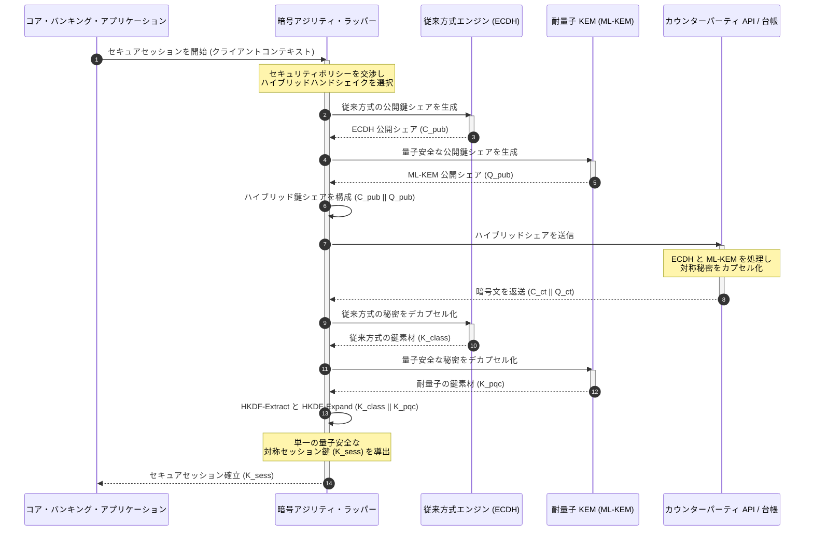

# KyberLib と 2026 年銀行の耐量子移行:規格からコードへ

<!-- lead-start: manual -->
<aside class="post-lead" aria-label="記事の要約">

<strong>要点。</strong>2026 年の銀行インフラは、終着点の判明している構造的脅威に直面しています。量子規模の計算は、今日の通信中データを守る RSA と ECC の鍵交換を破ります。連邦規格と監督当局の方針文書は認識を高めましたが、技術的な実行は依然として分断されたままです。<a href="https://github.com/sebastienrousseau/kyberlib">KyberLib</a> は、耐量子の議論を具体的でメモリ安全な Rust コードへと移すオープンソースの工学的ブループリントです。NIST が規格化した ML-KEM(FIPS 203)を暗号アジリティの抽象化境界の背後に実装し、「Store Now, Decrypt Later」攻撃がアーカイブに到達する前に、金融機関がトランスポート・セキュリティと鍵カプセル化を更新できるようにします。

<strong>主要なポイント:</strong>

<ul class="post-lead-takeaways">
  <li><strong>方針から検査可能なコードへ。</strong>KyberLib は耐量子計算機暗号を、抽象的な戦略ロードマップから、具体的で高性能かつ監査可能な Rust 実装へと移します。</li>
  <li><strong>規格化された FIPS 203 ML-KEM の実行。</strong>本ライブラリは、NIST FIPS 203 で最終化された鍵共有アルゴリズム ML-KEM を実装し、グローバルな規制上の期待に適合性を整合させます。</li>
  <li><strong>設計段階からの暗号アジリティ。</strong>安定した抽象化境界により、銀行アプリケーションは高コストでエラーの起きやすい書き直しなしに暗号プリミティブを差し替えられます。</li>
  <li><strong>Rust によるメモリ安全性。</strong>コンパイル時の所有権ルールが、レガシーな C 系暗号ライブラリを蝕むバッファオーバーフローとメモリリークを、ゼロコスト抽象化の速度のまま根絶します。</li>
  <li><strong>受託者責任リスクの低減。</strong>観測可能でテスト可能な移行エビデンスは、DORA 第 5 条の個人責任監査が求める「合理的措置」の記録を取締役に与えます。</li>
</ul>

<strong>関連記事:</strong> <a href="/2026-05-18-quantum-cryptography-standards-developments-2026/">2026 年の量子暗号リセット — PQC 規格、QKD 保証、銀行が先送りできない移行作業</a>、<a href="/2026-05-28-dora-ai-act-data-sovereignty-banking-compliance-stack-2026/">DORA + AI Act コンプライアンス・スタック</a>、<a href="/2026-05-20-cloud-native-banking-financial-institutions-2026/">クラウドネイティブ銀行</a>。

</aside>
<!-- lead-end -->

耐量子移行は、計画段階の演習ではなくなりました。2026 年において、それは進行中の運用要件であり、規制の意図と工学的実行のギャップこそが、いまリスクの所在です。[KyberLib ⧉](https://github.com/sebastienrousseau/kyberlib "kyberlib") はそのギャップの一部を埋めます。最終化された FIPS 203 のパラメータどおりに ML-KEM を実装し、銀行のトランザクション資産が実際に必要とする暗号アジリティの境界でそれを包んだ、本番運用志向でメモリ安全な Rust ライブラリです。

---

> **取締役会向けサマリー / 主要なポイント**
>
> - **脅威はすでに運用段階にあります。**攻撃者は今日「Store Now, Decrypt Later」型の収集を実行しています。暗号学的に意味のある量子コンピュータが到来した日に、データの機密性は遡及的に破られます。
> - **規格は最終化されています。**NIST FIPS 203(ML-KEM)と FIPS 204(ML-DSA)は、監査委員会に明確で検証可能な基準を与えました。「規格待ち」という弁明はもはや成立しません。
> - **KyberLib は工学的ブループリントです。**メモリ安全な Rust、HSM やスマートカード向けの `no_std` コンパイル、そして従来方式との相互運用性を保つハイブリッドハンドシェイクのパターンを備えます。
> - **暗号アジリティこそ持続的な目標です。**安定した抽象化境界により、アプリケーションを書き直さずにプリミティブを変更できます — 個々のアルゴリズムより長く生きる教訓です。
> - **責任は取締役会が負います。**DORA 第 5 条は取締役個人に責任を課します。検査可能で観測可能な移行コードこそ、それを満たすエビデンスです。
>
---

## なぜ 2026 年にこのオープンソース・プロジェクトが重要なのか

非対称暗号が陳腐化に近づくなか、脅威は暗号学的に意味のある量子コンピュータの完成を待ちません。攻撃者はいま、**「Store Now, Decrypt Later」(SNDL)** 攻撃を実行しています。法人向け銀行取引、営業秘密、機関間通信の暗号化された通信ストリームを収集し、量子能力が成熟した時点で復号する意図です。銀行にとって、今日ネットワーク上を流れるすべての従来方式ハンドシェイクは、起爆が先送りされた機密性侵害にほかなりません。

規制当局は具体的な義務で応じています。

1. **DORA 第 6 条(ICT リスク管理)**は、暗号資産全域 — 誰も棚卸ししていないミドルウェアに埋もれた非対称鍵交換を含む — の脆弱性のマッピング、特定、低減を金融機関に求めます。
2. **NIST FIPS 203 および 204** は、鍵カプセル化(ML-KEM)とデジタル署名(ML-DSA)の公式な耐量子規格を確立し、移行の進捗を測る規格化された基準を監査委員会に与えます。

稼働中の業務を止めずにこの移行を実行するには、方針文書を超えて、**検査可能なオープンソースの暗号インフラ**へと進む必要があります。[KyberLib ⧉](https://github.com/sebastienrousseau/kyberlib "kyberlib") はまさにそれを提供します。FIPS 203 に準拠したメモリ安全な Rust ライブラリであり、耐量子移行を計測可能で検証可能な工学パイプラインへと転換し、技術投資の議論を具体的な「レジリエンスへのリターン」へと向け直します。

## アーキテクチャの視座

KyberLib は安定した API 境界の背後に位置し、低レベル暗号プリミティブの変更から銀行の中核トランザクション・アプリケーションを隔離します。

| レイヤー | 設計上の意思決定 | 重要な理由 | 誤処理時のリスク |
|---|---|---|---|
| **プリミティブ** | FIPS 203 ML-KEM 鍵カプセル化 | 従来方式の Diffie-Hellman および RSA 鍵交換を格子ベース構造で置換 | 最終化された FIPS 203 パラメータへの不適合によるコンプライアンス監査の不合格 |
| **言語** | メモリ安全な Rust 実装 | C/C++ に固有のメモリ破壊脆弱性(バッファオーバーフロー、解放後使用)を排除 | 依存関係の肥大化によるビルドチェーン完全性の毀損 |
| **抽象化** | 安定した暗号アジリティ境界 | 規格の進化に応じ、統一インタフェースの背後でアルゴリズムを切替可能 | プリミティブのハードコードにより将来のすべての移行で手作業の書き直しが発生 |
| **展開** | ハイブリッド暗号化ハンドシェイク | 耐量子 KEM と従来方式アルゴリズムを二重ラップのエンベロープで併用 | レガシー相互運用性の喪失、または静かな設定ドリフト |
| **保証** | SLSA Level 3 の来歴と検査可能なテスト | コードの出所と来歴を保証し、サンプルを 1 行ずつ監査可能 | セキュリティ演劇 — 実装エラーが本番で露見するブラックボックス・ライブラリ |

## 追跡すべき運用シグナル

監督委員会と規制当局に耐量子コンプライアンスを示すには、具体的で定量化可能な指標の追跡が必要です。

| シグナル | 指標 | 規制上の参照 | プラットフォーム実装 |
|---|---|---|---|
| **FIPS 203 ML-KEM 適合性** | 最終化パラメータ(ML-KEM-512/768/1024)への 100% 準拠 | NIST FIPS 203 | KyberLib モジュール内にコンパイルされたパラメータ検証済みの格子暗号 |
| **暗号インベントリ** | 全システム横断での非対称鍵交換利用の完全な棚卸し | NIST SP 1800-38 | 稼働中の暗号スイートを中央レジストリに記録する自動スキャン・エージェント |
| **ハイブリッド鍵交換** | ハイブリッド・エンベロープで実行されるトランスポート層ハンドシェイクの比率 | DORA 第 6 条 | 従来方式の TLS 1.3 ハンドシェイクを PQC カプセル化で包むネットワーク・プロキシ |
| **`no_std` コンパイル** | 制約されたターゲット向けに Rust 標準ライブラリなしでコンパイルできる能力 | DORA 第 30 条 | Hardware Security Module 向けの KyberLib における条件付き `no_std` コンパイル |
| **暗号アジリティ指数** | API ゲートウェイ全域で暗号プリミティブを差し替えるのに要する時間(分) | 英国 PRA SS1/23 | 実行時変数でアルゴリズム割当を管理する抽象化されたルーティング・レジストリ |

## なぜ Rust が耐量子計算機暗号に重要なのか

ML-KEM のような耐量子アルゴリズムの実装には、多項式環上の複雑で低レベルな数学的演算が必要です。歴史的に、これを本番速度で動かすには手書きの C/C++ かアセンブリが必要でした — 銀行が最も誤りを許容できないコードの中に、メモリ破壊の巨大な攻撃対象面を抱えることを意味します。

Rust は、暗号エンジニアリングのセキュリティ態勢を 3 つの具体的な点で変えます。

1. **コンパイル時のメモリ安全性。**Rust の所有権モデルは、バッファオーバーフロー、二重解放、解放後使用をコンパイル時に防止することを保証します。鍵やシファーテキストのサイズが従来方式より大幅に大きい耐量子ライブラリでは、この点が決定的に重要です。
2. **決定的でゼロコストの抽象化。**Rust はガベージコレクタなしでネイティブの機械語にコンパイルされるため、安全性を保ったまま、実行速度とメモリフットプリントは C 系ライブラリと同等以上です。
3. **`no_std` 互換性。**KyberLib は Rust の標準ライブラリなしでコンパイルできるため、制約されたベアメタル環境 — Hardware Security Module やスマートカードを含む — で動作し、銀行品質の暗号を物理的セキュリティ境界の内側に保ちます。

## 暗号アジリティを備えたアーキテクチャの設計

暗号移行における古典的な失敗モードはハードコードです。アルゴリズム固有の前提がアプリケーション・ロジックに直接埋め込まれ、移行のたびに痛みを伴って再発見されます。2026 年の持続的な目標は**暗号アジリティ**です。アルゴリズムを安定したインタフェースの背後で差し替え可能なモジュールとして扱う抽象化層を整え、次の移行を資産全域の書き直しではなく設定変更にとどめることです。

以下のシーケンスは、KyberLib の暗号アジリティ・ラッパーがハイブリッド(従来方式 + 耐量子)鍵交換ハンドシェイクをどう調整するかを示します。

運用上の核心はハイブリッド・エンベロープにあります。耐量子プリミティブが本番での精査を年単位で積み上げるまで、セッション鍵は従来方式と耐量子の両方の秘密から導出されます。攻撃者はチャネルを復元するために ECDH **と** ML-KEM の両方を破らなければなりません。未移行のカウンターパーティは引き続き接続でき、移行済みのカウンターパーティは直ちに格子ベースの保護を得ます。

## 取締役会のプレイブック

耐量子セキュリティはバックオフィスの暗号化の問題ではありません。個人の責任が懸かる取締役会レベルのガバナンス課題です。経営幹部は、この移行を受託者責任の枠組みで捉えるべきです。

- **DORA 第 5 条(ガバナンスと組織)**は、ICT セキュリティに対する個人責任を取締役会に課します。オープンソースで観測可能なテストは、個人責任監査が求める直接のエビデンスです。「検査可能な FIPS 203 実装を選定し、その適合性テストの実行記録がここにある」は防御可能な回答ですが、「ベンダーが保証してくれた」はそうではありません。
- **モデルリスク管理(米 FRB SR 11-7 / 英 PRA SS1/23)**は、プライシング・モデルと同様に暗号ラッパー・アーキテクチャにも適用されます。抽象化層は、極端な障害シナリオ下での性能を含め、MRM の検証を通過すべきです。
- **Basel III のオペレーショナルリスク資本**は、実証された統制の成熟度に報います。テスト済みのハイブリッドハンドシェイクは長期的なオペレーショナルリスク・プロファイルを下げ、資本の上乗せを削減し、財務部門の積極運用のためのバランスシート余力を解放します。

## 銀行類型別の含意

### グローバルなシステム上重要な銀行(G-SIB)

G-SIB はレガシーの重いトランザクション資産を運用しており、その制約条件は発見にあります。非対称鍵交換が実際にどこで行われているかを知ることです。NIST SP 1800-38 のガイダンスに基づく継続的な暗号インベントリが先行し、その後、インベントリが洗い出したすべての現代的ノードで耐量子鍵カプセル化を実行するための、規格化されたメモリ安全ライブラリを KyberLib が提供します。

### トランザクションバンク・コーポレートバンク

決済レール全域の機密性こそが事業の核心です。KyberLib はベアメタルの `no_std` ターゲットにコンパイルできるため、トランザクションバンクはアプリケーション層だけでなく、エッジの決済ルーティングや流動性管理のハードウェアの内部に直接、耐量子ハンドシェイクを展開できます。

### 地域銀行・中小銀行

地域金融機関は、G-SIB の研究予算なしに同じ国家支援型の収集攻撃に直面します。検査可能なオープンソースの Rust 実装は、ブラックボックスなベンダー・ロードマップを交渉することなく、NIST FIPS 203 適合への即時のターンキー経路を与えます。

## ロードマップからコンパイルされるコードへ

耐量子移行は進行中の工学タスクです。2026 年を通じて監督当局、カウンターパーティ、企業財務担当者の信頼を保つ金融機関は、抽象的なロードマップから観測可能でコンパイルされるコードへと進む機関です。経営への指示はそこから直接導かれます。レガシーの鍵交換ポイントを監査し、最も価値の高いチャネルにハイブリッドハンドシェイクを展開し、将来のあらゆるプリミティブ差し替えを定型作業にする安定した抽象化境界を構築することです。KyberLib は、これらの各ステップをスライド上の公約ではなく、計測可能な運用能力にします。

## よくある質問

**KyberLib は最終化された NIST 規格に準拠していますか?**

はい。KyberLib は FIPS 203 で最終化された ML-KEM のパラメータを中心に設計されており、コンパイルされたライブラリを連邦およびグローバルな規制上の期待に整合させます。

**耐量子ライブラリには専用ハードウェアが必要ですか?**

いいえ。KyberLib の Rust 実装は標準的なシステム・アーキテクチャにコンパイルされます。さらに `no_std` 対応により、鍵の物理的管理が求められる専用の Hardware Security Module やスマートカード上でも動作します。

**「Store Now, Decrypt Later」は現在のコンプライアンスにどう影響しますか?**

トランスポート層が従来方式の RSA や ECC に依存している場合、攻撃者は今日トラフィックを収集し、量子能力が成熟した時点で復号できます。いま展開するハイブリッド鍵交換が、収集済みデータを格子ベースの保護の内側に保ちます。

**なぜ耐量子プリミティブへ直行せず、ハイブリッドハンドシェイクなのですか?**

ハイブリッド・エンベロープは従来方式と耐量子の両方の秘密からセッション鍵を導出するため、両方が破られない限りセキュリティは保たれます。これにより、新しいプリミティブが本番での精査を積み上げる間も、未移行のカウンターパーティとの相互運用性が維持されます。

## 参考文献

- National Institute of Standards and Technology, (2024). [FIPS 203: モジュール格子ベース鍵カプセル化メカニズム規格 ⧉](https://www.nist.gov/news-events/news/2024/08/nist-releases-first-3-finalized-post-quantum-encryption-standards "NIST FIPS 203 発表").
- Board of Governors of the Federal Reserve System, (2011). [モデルリスク管理に関する監督ガイダンス(SR Letter 11-7) ⧉](https://www.federalreserve.gov/supervisionreg/srletters/sr1107.htm "Federal Reserve SR 11-7").
- European Parliament and Council of the European Union, (2022). [金融セクターのデジタル・オペレーショナル・レジリエンスに関する規則 (EU) 2022/2554(DORA) ⧉](https://eur-lex.europa.eu/legal-content/EN/TXT/?uri=CELEX%3A32022R2554 "DORA 規則").
- NIST National Cybersecurity Center of Excellence, (2025). [耐量子計算機暗号への移行(NIST SP 1800-38) ⧉](https://www.nccoe.nist.gov/projects/migration-post-quantum-cryptography "NIST SP 1800-38").
- GitHub, (2026). [kyberlib オープンソース・リポジトリ ⧉](https://github.com/sebastienrousseau/kyberlib "kyberlib リポジトリ").

<!-- enrich-start -->
<aside class="author-card" aria-label="著者について"><strong class="author-card-name"><a href="/about/index.html">Sebastien Rousseau</a></strong>応用 AI、決済インフラ、トークン化マネー、ISO 20022、ポスト量子セキュリティ、クラウドネイティブな金融サービス、オープンソース・インフラ、規制対象デジタル市場について執筆するシニア銀行テクノロジスト。HSBC コマーシャル&amp;インベストメントバンク、PayPal、Barclays、Shazam、AKQA、Virgin Group を横断する 20 年以上の経験。<a href="/about/index.html">プロフィール全体</a> &middot; <a href="https://www.linkedin.com/in/sebastienrousseau/" rel="external noopener">LinkedIn</a> &middot; <a href="https://github.com/sebastienrousseau" rel="external noopener">GitHub</a></aside>

最終確認 <time datetime="2026-06-12">2026-06-12</time>。

<!-- enrich-end -->
