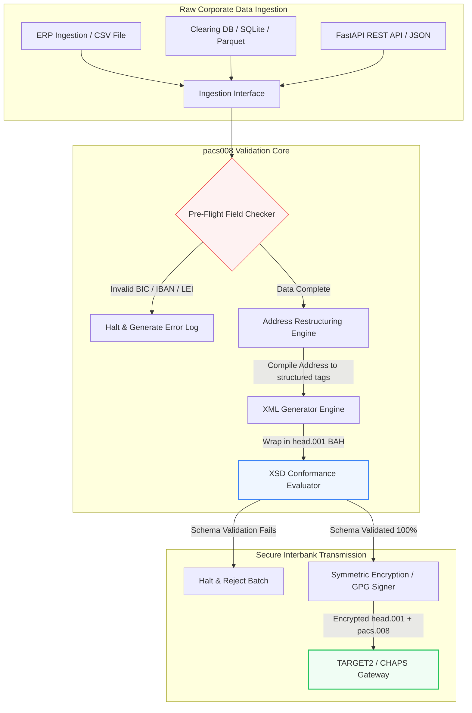

---

# Front Matter (YAML)

author: "contact@sebastienrousseau.com (Sebastien Rousseau)"
banner_alt: "音声アシスタントとラップトップで作業するオフィスワーカー — pacs.008 自動化がプログラム可能にする、構造化され機械可読な銀行間決済メッセージを象徴する"
banner_height: "1597"
banner_width: "2584"
banner: "https://cloudcdn.pro/stocks/images/tyler-prahm-lmV3gJSAgbo.webp"
cdn: "https://cloudcdn.pro"
charset: "UTF-8"
cname: "sebastienrousseau.com"
copyright: "© Copyright 2025 - 2026 - Sebastien Rousseau. All rights reserved."
date: "June 15, 2026"
description: "pacs008 は、ISO 20022 pacs.008 FI-to-FI 顧客送金の生成と検証を自動化するオープンソース Python ライブラリです。構造化アドレス、BAH head.001 ラッピング、BIC/LEI/IBAN チェックサム、OpenTelemetry による UETR トレーシングを備え、2026 年 11 月の SWIFT カットオーバーに合わせて構築されています。"
format-detection: "telephone=no"
hreflang: "ja"
icon: "https://cloudcdn.pro/clients/sebastienrousseau/v1/logos/sebastienrousseau.svg"
id: "https://sebastienrousseau.com/2026-06-15-pacs008-automation-iso-20022-interbank-payments-2026"
image_alt: "Sebastien Rousseau の白黒ポートレート"
image_height: "162"
image_width: "162"
image: "https://cloudcdn.pro/stocks/images/sebastien-rousseau.png"
keywords: "pacs008, ISO 20022 pacs.008, FI-to-FI 顧客送金, 構造化アドレス, SWIFT CBPR+, BAH head.001, TARGET2, CHAPS, Fedwire, DORA, BCBS 239, Basel III, UETR, LEI 検証, SEPA VoP"
language: "ja-JP"
last_reviewed: "2026-06-15"
layout: "report"
locale: "ja_JP"
logo_alt: "Sebastien Rousseau のロゴ"
logo_height: "44"
logo_width: "44"
logo: "https://cloudcdn.pro/clients/sebastienrousseau/v1/logos/sebastienrousseau.svg"
menu: ""
measurementID: "G-169G4ET5HQ"
name: "Sebastien Rousseau"
permalink: "https://sebastienrousseau.com/2026-06-15-pacs008-automation-iso-20022-interbank-payments-2026"
rating: "general"
referrer: "no-referrer"
robots: "index, follow"
schema: "FAQPage, Article"
seo_title: "ISO 20022 時代の pacs.008 自動化"
short_name: "sebastienrousseau"
subtitle: "pacs.008 メッセージは、銀行間決済データ、構造化アドレス、コンプライアンス、ルーティング、決済オペレーションが交わる場所です。"
tags: "pacs008, ISO 20022, 銀行間決済, ホールセール決済, Python"
theme-color: "0, 83, 191"
title: "2026 年 ISO 20022 銀行間時代の pacs.008 自動化構築"
url: "https://sebastienrousseau.com/2026-06-15-pacs008-automation-iso-20022-interbank-payments-2026"
viewport: "width=device-width, initial-scale=1, shrink-to-fit=no"

# RSS - The RSS feed front matter (YAML).
atom_link: "https://sebastienrousseau.com/2026-06-15-pacs008-automation-iso-20022-interbank-payments-2026/rss.xml"
category: "Finance"
docs: https://validator.w3.org/feed/docs/rss2.html
generator: "Static Site Generator (SSG) (version 0.0.26)"
item_description: "pacs008 は、銀行間決済時代の ISO 20022 FI-to-FI 顧客送金メッセージを自動化するための、オープンソース Python 基盤を提供します。"
item_guid: "https://sebastienrousseau.com/2026-06-15-pacs008-automation-iso-20022-interbank-payments-2026/rss.xml"
item_link: "https://sebastienrousseau.com/2026-06-15-pacs008-automation-iso-20022-interbank-payments-2026/rss.xml"
item_pub_date: "Mon, 15 Jun 2026 06:06:06 +0000"
item_title: "2026 年 ISO 20022 銀行間時代の pacs.008 自動化構築"
last_build_date: "Mon, 15 Jun 2026 06:06:06 +0000"
managing_editor: "contact@sebastienrousseau.com (Sebastien Rousseau)"
pub_date: "Mon, 15 Jun 2026 06:06:06 +0000"
ttl: "60"
type: "article"
webmaster: "contact@sebastienrousseau.com"

# Apple - The Apple front matter (YAML).
apple_mobile_web_app_orientations: "portrait"
apple_touch_icon_sizes: "192x192"
apple-mobile-web-app-capable: "yes"
apple-mobile-web-app-status-bar-inset: "black"
apple-mobile-web-app-status-bar-style: "black-translucent"
apple-mobile-web-app-title: "ISO 20022 時代の pacs.008 自動化"
apple-touch-fullscreen: "yes"

# MS Application - The MS Application front matter (YAML).

msapplication-navbutton-color: "0, 83, 191"

# Twitter Card - The Twitter Card front matter (YAML).

twitter_card: "summary_large_image"
twitter_creator: "@wwdseb"
twitter_description: "pacs008 は、銀行間決済時代の ISO 20022 FI-to-FI 顧客送金メッセージを自動化するための、オープンソース Python 基盤を提供します。"
twitter_image: "https://cloudcdn.pro/clients/sebastienrousseau/v1/logos/sebastienrousseau.svg"
twitter_image_alt: "Sebastien Rousseau のロゴ"
twitter_site: "@wwdseb"
twitter_title: "ISO 20022 時代の pacs.008 自動化"
twitter_url: "https://sebastienrousseau.com/2026-06-15-pacs008-automation-iso-20022-interbank-payments-2026"

excerpt: "pacs008 は、ISO 20022 FI-to-FI 顧客送金メッセージをプログラム可能にするオープンソース Python ツールキットです — 構造化アドレス、検証、ルーティング、コンプライアンス・フック、SWIFT 2026 年 11 月期限がデフォルトとして組み込まれています。"

# Humans.txt - The Humans.txt front matter (YAML).
author_website: "https://sebastienrousseau.com"
author_twitter: "@wwdseb"
author_location: "London, UK"
thanks: "ご精読ありがとうございました!"
site_last_updated: "2026-06-15"
site_standards: "HTML5, CSS3, RSS, Atom, JSON, XML, YAML, Markdown, TOML"
site_components: "Kaishi, Kaishi Builder, Kaishi CLI, Kaishi Templates, Kaishi Themes"
site_software: "Static Site Generator, Rust"

---

# 2026 年にオープンソース Python で ISO 20022 pacs.008 銀行間決済を自動化する

<!-- lead-start -->
<aside class="post-lead" aria-label="記事の要約">

<strong>要点。</strong> SWIFT CBPR+ ガイドラインのもと、2026 年 11 月 14 日の「構造化アドレス・クリフ」によって、TARGET2、CHAPS、Fedwire、Lynx、SEPA 全域で非構造化の郵便アドレスは廃止されます。pacs008 はオープンソースの Python ライブラリであり、ISO 20022 FI-to-FI 顧客送金(pacs.008)メッセージの生成と検証を自動化し、Business Application Header(BAH head.001)で決済を包み込み、メッセージが清算ネットワークに渡る前のデータ経路上で構造化アドレス遵守を組み込みます。

<strong>主要なポイント</strong>

<ul class="post-lead-takeaways">
  <li><strong>構造化アドレス期限は絶対です。</strong> 2026 年 11 月 14 日以降、非構造化アドレス・ブロックは廃止されます。pacs008 はデータ・コンパイル時に構造化郵便アドレス要素(<code>&lt;TwnNm&gt;</code>、<code>&lt;Ctry&gt;</code>、<code>&lt;PstCd&gt;</code>)を強制し、境界での拒絶を防ぎます。</li>
  <li><strong>統合的メッセージ・オーケストレーション。</strong> pacs.008 のコア決済ペイロードを準拠 Business Application Header(head.001)エンベロープで包み、標準的なラウンドトリップ処理モデルを提供します。</li>
  <li><strong>アルゴリズム整合性。</strong> ISO 7064 Modulo 97-10 のチェックサム計算を用いた BIC および Legal Entity Identifier(LEI)向けの組み込みバリデーター。</li>
  <li><strong>DORA グレードのトレーサビリティ。</strong> Unique End-to-End Transaction Reference(UETR)をキーとする OpenTelemetry の完全計装により、リアルタイム監査ログと暗号学的監査署名を実現します。</li>
  <li><strong>取締役会レベルの受託者責任保全。</strong> 銀行間メッセージ精度を DORA 第 5 条、BCBS 239 報告、Basel III オペレーショナル・リスク資本節約と整合させます。</li>
</ul>

<strong>関連記事:</strong> <a href="https://sebastienrousseau.com/2026-05-19-global-wholesale-payments-economics-2026">2026 年のグローバル・ホールセール決済:ISO 20022、RTGS 刷新、相互運用性の経済学</a>、<a href="https://sebastienrousseau.com/2026-05-27-ai-operating-system-payments-fraud-routing-resilience-compliance-2026">決済のオペレーティングシステムとしての AI:2026 年の不正検知、ルーティング、レジリエンス、コンプライアンス</a>、<a href="https://sebastienrousseau.com/2026-05-12-iso-20022-pacs008-structured-address-deadline">2026 年 11 月の pacs.008 構造化アドレス期限:6 か月の視点</a>。

</aside>
<!-- lead-end -->

レガシーな金融データと構造化された銀行間メッセージングの間を、監査可能でスキーマ検証された Python パイプラインで橋渡しします。

本記事のオープンソース基準点は [pacs008 ⧉](https://github.com/sebastienrousseau/pacs008 "pacs008 — オープンソース Python ライブラリ") です。リポジトリは、ISO 20022 pacs.008 FI-to-FI 顧客送金 XML メッセージを自動化する Python ライブラリとして位置付けられています。

## なぜこのオープンソース・プロジェクトが 2026 年に重要なのか

世界の銀行間決済清算インフラは、半世紀近くで最も深い近代化を経験しています。

2026 年 6 月、金融サービス業界は **2026 年 11 月 14 日の SWIFT 構造化アドレス・クリフ** に急速に近づいています。この日以降、SWIFT CBPR+ ガイドライン、ならびに TARGET2、CHAPS、Fedwire、カナダの Lynx は、非構造化の郵便アドレス行(`<PstlAdr>` ブロック内で `<AdrLine>` のみを使用するもの)を正式に廃止します。参加するすべての金融機関は、ハイブリッド形式(構造化された `<TwnNm>` および `<Ctry>` に、残余詳細用の `<AdrLine>` 要素を最大 2 つ)または完全構造化形式(街路名、建物番号、郵便番号の個別要素)のいずれかでアドレスを送信する必要があります。この基準を満たさないメッセージはネットワーク境界で拒絶されます。

金融機関にとって、この移行は深刻な運用上の制約を生み出します。

1. **境界拒絶の罰則。** 構造化アドレス基準を満たさない決済は即時のネットワーク拒絶に直面し、取引遅延、流動性閉塞、オペレーション滞留を引き起こします。
2. **SEPA Verification of Payee(VoP)。** SEPA 圏内のすべての Payment Service Provider(PSP)に対し、送金実行前に受取人名と IBAN の一致確認を義務付け、メッセージ起票にもう 1 つの検証ゲートを追加します。

[Pacs008](https://github.com/sebastienrousseau/pacs008) はこの問題を解決します。生の金融データを完全に検証されスキーマ準拠した ISO 20022 pacs.008 銀行間顧客送金メッセージへと自動変換する、軽量なオープンソース Python ライブラリです。レガシーから構造化データへのギャップを埋めることで、pacs008 は高い Return on Resilience(RoR)を実現し、運転資本を保全しつつ、世界中のレールでリアルタイム実行を確保します。

## pacs008 2026 アーキテクチャ・レンズ

pacs008 ライブラリは、絶縁された検証および生成エンジンとして構築されており、生の入力が体系的に解析、エンリッチされ、標準エンベロープで包まれることを保証します。

| レイヤー | 設計上の意思決定 | なぜ重要か | 誤処理時のリスク |
|---|---|---|---|
| **入力レイヤー** | CSV、JSON、SQLite、Parquet の取り込み | 銀行統合チームが既に使用しているデータの場所に対応し、プラットフォーム移行を回避します。 | 生の、未検証、または破損したデータ・ペイロードの取り込み。 |
| **検証レイヤー** | 公式 XSD スキーマおよびカスタム・ビジネス・ルールに対する事前検証 | 決済ファイルが清算ネットワークに送信される前に実行を停止し、エラーを通知します。 | 即時のネットワーク拒絶と清算遅延を招く無効な XML ファイル。 |
| **BAH エンベロープ・レイヤー** | Business Application Header(head.001)による自動ラッピング | `<MsgDefIdr>` タグに基づくメッセージのディスパッチおよびルーティングを標準化します。 | 必要な外側エンベロープなしに生 pacs.008 ペイロードを送信し、システム拒絶を引き起こすこと。 |
| **シリアライゼーション・レイヤー** | 標準 XML および ISO 準拠 JSON(TS 23029)サポート | XML と JSON ペイロード間の直接翻訳を可能にし、最新の REST API と Kafka ストリーミングをサポートします。 | 公式 ISO ガイドラインに違反する断片化されたデータ表現。 |
| **観測性レイヤー** | UETR をキーとする OpenTelemetry トレーシング | 詳細な実行パスとログを捕捉し、リアルタイム監査可能性を提供します。 | 運用上の可視性と監査をブロックするトレーシングの欠落。 |

## 主要な銀行間シグナルと規制マイルストーン

トランザクションのオペレーショナル・レジリエンスを実証するため、シニア・テクノロジーおよびリスク・マネージャーは、定量化可能な具体的コンプライアンス指標を追跡する必要があります。

| シグナル | 指標 / 運用ベンチマーク | G20 / SWIFT / DORA リファレンス | 技術的プラットフォーム実装 |
|---|---|---|---|
| **構造化アドレス遵守** | 指定された `<TwnNm>` および `<Ctry>` を含む完全構造化 `<PstlAdr>` フィールドを利用する pacs.008 メッセージの割合。 | SWIFT SR 2026 期限 | pacs008 内の事前スキーマ・チェックが非構造化アドレス行を拒絶。 |
| **SEPA Verification of Payee** | メッセージ実行前の受取人名と IBAN の一致検証。 | SEPA VoP 規則 | IBAN/BIC の事前検証クエリを実行する組み込み VoP ヘルパー・クラス。 |
| **BAH head.001 統合** | Business Application Header で正常に包まれた送信決済ペイロードの割合。 | TARGET2 / CBPR+ ガイドライン | 外側 XML エンベロープを自動的にコンパイルする BAH ラッピング・サブシステム。 |
| **LEI Modulo チェックサム** | 債務者および債権者の `<LEI>` ブロックに対する ISO 7064 Modulo 97-10 チェックディジット検証。 | Bank of England 義務 | 20 文字の識別子の整合性を確認するアルゴリズミック・チェッカー。 |
| **UETR トラッキング精度** | 生成される決済の 100% に有効な Unique End-to-End Transaction Reference を注入。 | SWIFT UETR 仕様 | 36 文字の UUIDv4 リファレンス・コードの自動生成とトレーシング。 |

## なぜ Python が銀行間自動化の理想的なオンランプなのか

2026 年の最新決済ハブおよびトレジャリー・オペレーション・チームは、データ変換、財務モデリング、ERP データベース統合に Python を多用しています。

オープンソース Python ライブラリを活用することで、金融機関は大きな利点を獲得します。

1. **低い認知負荷と高い相互運用性。** Python は一貫性のある架け橋として機能します。開発者はレガシー・データベースから生の支払指図を取得し、複雑な国際銀行ルールに対して検証し、単一の統一ワークフロー内で準拠 XML を出力する単純なスクリプトを書けます。
2. **「ブラックボックス」型の不透明な翻訳器の排除。** 独自の銀行ポータルは、カスタム決済ファイル翻訳器に高額なライセンス料を課すことが多いです。これらの翻訳器は独自仕様のブラックボックスであり、セキュリティ・チームがデータの処理方法や鍵の保管場所を監査することは不可能です。pacs008 のような検査可能なオープンソース・ライブラリは、コードの完全な透明性を保証します。
3. **シームレスな CI/CD 統合。** pacs008 は継続的インテグレーションおよびデプロイメント・パイプラインに直接統合され、開発者は標準的なソフトウェア・デリバリー・ライフサイクルの一部として決済ファイル・テストを自動化できます。

## 境界づけられた銀行間パイプラインの設計

銀行間清算の主要な脆弱性は「制御されていないバッチ生成」 — 明確で境界づけられた検証ループなしにファイルを生成することです。pacs008 は、厳密に制御された多段階トランザクション・パイプライン内のコア検証エンジンとして動作するよう設計されています。

以下の運用フローは、生のトランザクション・データが pacs008 パイプラインを通過し、BAH エンベロープで包まれた暗号学的にセキュアでスキーマ準拠の pacs.008 ファイルを生成する方法を示します。

## 取締役会プレイブックと受託者責任

銀行間決済自動化は取締役会レベルのリスク管理およびコーポレート・ガバナンスの課題です。シニア・マネージャーは、受託者責任とオペレーショナル・リスク低減の観点からトランザクション・データ品質に取り組まなければなりません。

- **DORA 第 5 条(取締役会説明責任)。** 機関の ICT オペレーションのレジリエンスとセキュリティに対し、取締役会メンバーに直接的かつ個人的な責任を課します。銀行間清算は重要な企業機能であるため、取締役会は、オペレーション中断や決済遅延を防ぐ堅牢で検証済みかつ自動化されたトランザクション統制を実装していることを実証しなければなりません。
- **BCBS 239(リスクデータ集計および報告)。** 金融取引報告が正確、完全であり、リアルタイムで生成されることを要求します。pacs008 は、決済データがソースで構造化され検証されることを保証することにより、レガシー・スプレッドシートに付き物のデータ・ギャップや手動照合エラーを排除し、機関が BCBS 239 遵守を達成するのを支援します。
- **オペレーショナル・リスク資本賦課の軽減(Basel III)。** Basel III ガイドラインのもと、決済エラー率の高さや手動介入のオーバーヘッドは銀行のオペレーショナル・リスク資本要件を引き上げ、本来は融資や投資に振り向けられる資本を縛り付けます。決済パイプラインの自動化はこれらの資本プレミアムを直接的に最小化し、バランスシート価値を保全します。

## 銀行類型別の意味合い

### グローバルなシステム上重要な銀行(G-SIB)

G-SIB は巨大なクロスボーダー法人取引量を管理します。彼らの主要な課題は、清算ネットワークに到達する前の非構造化レガシー・データの是正です。pacs008 を法人銀行ゲートウェイに統合することで、G-SIB は法人顧客に自動検証ユーティリティを提供でき、手動決済修復のオーバーヘッドを削減し、SWIFT ネットワーク全域でリアルタイム実行を確保できます。

### トランザクション銀行および法人銀行

トランザクション銀行にとって、決済データ品質は競争上の差別化要因です。pacs008 のような検査可能でオープンソースの検証ツールを法人トレジャリー顧客に提供することにより、これらの銀行はオンボーディングを加速し、決済ファイル拒絶を最小化し、優れたストレートスルー処理率を通じて顧客信頼を構築できます。

### 地域銀行および小規模銀行

地域銀行は、G-SIB のような巨額のテクノロジー予算なしに国際決済標準への遵守を維持しなければなりません。pacs008 は軽量、低コストかつ完全準拠の Python ベースのソリューションを提供し、高価な独自ミドルウェア・ライセンスなしに、より小規模な機関が現代的で構造化された決済起票機能を提供できるようにします。

## 結論:銀行間清算ロードマップ

2026 年 11 月の SWIFT 構造化アドレス期限は、法人トレジャリー・オペレーションにとっての硬い境界を意味します。レガシー・スプレッドシート、手動データ入力、非構造化決済ファイルへの依存は、現に進行しているビジネス・リスクです。

トランザクション継続性を確保し、運用オーバーヘッドを最小化するため、シニア・テクノロジーおよびファイナンス・マネージャーは、本日、明確な清算ロードマップを実行すべきです。

1. **ソースでの検証を強制する。** すべての支払指図が、法人 ERP の境界を出る前に、公式 ISO 20022 XSD スキーマに従って検証され、フォーマットされることを義務付けます。
2. **データ・パイプラインを監査する。** 手動スプレッドシート処理から脱却し、pacs008 を使用した自動化された検査可能な Python ベースのワークフローを実装します。
3. **ハイブリッド・セキュリティを実装する。** 生成された決済ファイルが、ゼロトラスト・ネットワーク期待値を満たすため、送信前に暗号学的に署名され、暗号化されることを保証します。
4. **受託者優先事項と整合させる。** 決済自動化およびデータ品質メトリクスを取締役会に正式に報告し、投資を DORA 下の重要なオペレーショナル・リスク低減プログラムとして位置付けます。

## よくある質問

**pacs008 は来たる SWIFT SR 2026 アドレス・ルールに準拠していますか?**

はい。pacs008 は厳格な SWIFT 2026 年 11 月構造化アドレス・マイルストーンをサポートするよう設計されており、郵便アドレス要素(町、国、郵便番号)の所定 ISO 20022 XML フィールドへの分離を強制します。

**pacs008 は決済ペイロードを Business Application Header で包むことができますか?**

はい。pacs008 はネイティブに Business Application Header(BAH head.001)ラッピングをサポートしているため、TARGET2、CHAPS、CBPR+ ネットワークが要求する外側エンベロープを自動的にコンパイルします。

**なぜ独自のファイル翻訳器ではなくオープンソース・ライブラリが好ましいのですか?**

独自の翻訳器は不透明なブラックボックスであり、セキュリティ監査が不可能です。pacs008 のようなオープンソースでピアレビュー済みのライブラリは完全なコード透明性を提供し、セキュリティ・チームが処理中に機密の決済データが露出していないことを検証できるようにします。

**pacs008 はどのような識別子を検証しますか?**

pacs008 は、ISO 7064 Modulo 97-10 チェックサム計算を用いた Bank Identifier Code(BIC)および Legal Entity Identifier(LEI)向けの組み込みバリデーター、加えて IBAN チェックディジット検証と UETR 一意性チェックを備えて出荷されています。

## 参考文献

- SWIFT, (2024). *ISO 20022 November 2026 Structured Address Milestone*. La Hulpe: SWIFT. 参照先: [SWIFT ISO 20022 マイルストーン ⧉](https://www.swift.com/standards/iso-20022/iso-20022-bytes/call-action-november-2026 "SWIFT ISO 20022 マイルストーン")。
- Basel Committee on Banking Supervision (BCBS), (2013). *Principles for effective risk data aggregation and risk reporting (BCBS 239)*. Basel: Bank for International Settlements. 参照先: [BCBS 239 原則 ⧉](https://www.bis.org/publ/bcbs239.htm "BCBS 239 原則")。
- European Parliament and Council of the European Union, (2022). *Regulation (EU) 2022/2554 on digital operational resilience for the financial sector (DORA)*. Brussels: Official Journal of the European Union. 参照先: [DORA 規則 ⧉](https://eur-lex.europa.eu/legal-content/EN/TXT/?uri=CELEX%3A32022R2554 "DORA 規則")。
- GitHub, (2026). *pacs008 オープンソース・リポジトリ*. 参照先: [pacs008 リポジトリ ⧉](https://github.com/sebastienrousseau/pacs008 "pacs008 リポジトリ")。

<!-- enrich-start -->
<aside class="author-card" aria-label="著者について"><strong class="author-card-name"><a href="/about/index.html">Sebastien Rousseau</a></strong>応用 AI、ISO 20022 移行、金融サービス向けポスト量子暗号、ホールセール決済の構造的変革について執筆するシニア銀行テクノロジスト。HSBC コマーシャル&amp;インベストメントバンク、PayPal、Barclays、Shazam、AKQA、Virgin Group を横断する 20 年以上の経験。<a href="/about/index.html">プロフィール全体</a> &middot; <a href="https://www.linkedin.com/in/sebastienrousseau/" rel="external noopener">LinkedIn</a> &middot; <a href="https://github.com/sebastienrousseau" rel="external noopener">GitHub</a></aside>

最終確認 <time datetime="2026-06-15">2026-06-15</time>。

<aside class="related-posts" aria-labelledby="related-heading">
<h2 id="related-heading" class="related-heading">関連記事</h2>

<article class="related-card"><footer class="related-body"><h3><a href="https://sebastienrousseau.com/2026-05-19-global-wholesale-payments-economics-2026">2026 年のグローバル・ホールセール決済:ISO 20022、RTGS 刷新、相互運用性の経済学</a></h3>
<time datetime="2026-05-19">2026-05-19</time>
</footer></article>
<article class="related-card"><footer class="related-body"><h3><a href="https://sebastienrousseau.com/2026-05-27-ai-operating-system-payments-fraud-routing-resilience-compliance-2026">決済のオペレーティングシステムとしての AI:2026 年の不正検知、ルーティング、レジリエンス、コンプライアンス</a></h3>
<time datetime="2026-05-27">2026-05-27</time>
</footer></article>
<article class="related-card"><footer class="related-body"><h3><a href="https://sebastienrousseau.com/2026-05-12-iso-20022-pacs008-structured-address-deadline">2026 年 11 月の pacs.008 構造化アドレス期限:6 か月の視点</a></h3>
<time datetime="2026-05-12">2026-05-12</time>
</footer></article>

</aside>
<!-- enrich-end -->
