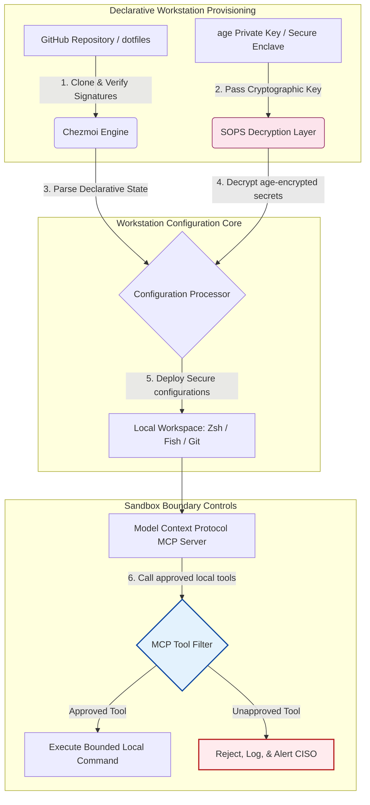

---

# Front Matter (YAML)

author: "contact@sebastienrousseau.com (Sebastien Rousseau)"
banner_alt: "薄暗い照明下の開発者ワークステーション — MCP サーバー、SLSA 署名、age/SOPS シークレット、マルチシェル互換性に対応した AI 認識・再現性・セキュアな dotfiles を象徴"
banner_height: "1597"
banner_width: "2584"
banner: "https://cloudcdn.pro/stocks/images/almas-salakhov-Vq2ap8aFFEs.webp"
cdn: "https://cloudcdn.pro"
charset: "UTF-8"
cname: "sebastienrousseau.com"
copyright: "© Copyright 2025 - 2026 - Sebastien Rousseau. All rights reserved."
date: "June 16, 2026"
description: "AI 認識 dotfiles は、MCP 時代におけるセキュアで再現性のあるワークステーションのパターンです。Chezmoi による宣言的構成、SOPS/age シークレット、SLSA レベル 3 来歴、マルチシェル互換性、そしてローカル AI エージェントのための境界制御されたサンドボックス境界を備えます。"
format-detection: "telephone=no"
hreflang: "ja"
icon: "https://cloudcdn.pro/clients/sebastienrousseau/v1/logos/sebastienrousseau.svg"
id: "https://sebastienrousseau.com/2026-06-16-ai-aware-dotfiles-secure-reproducible-workstation-2026"
image_alt: "セバスチャン・ルソーのモノクロ・ポートレート"
image_height: "162"
image_width: "162"
image: "https://cloudcdn.pro/stocks/images/sebastienrousseau.webp"
keywords: "dotfiles, Chezmoi, MCP, Model Context Protocol, SLSA, SOPS, age 暗号化, 宣言的構成, 開発者ワークステーション, DORA 第5条, NIST CSF 2.0, サプライチェーン・セキュリティ, エージェント型 AI, マルチシェル互換性, Zsh, Fish, Nushell"
language: "ja-JP"
last_reviewed: "2026-06-16"
layout: "report"
locale: "ja_JP"
logo_alt: "セバスチャン・ルソーのロゴ"
logo_height: "44"
logo_width: "44"
logo: "https://cloudcdn.pro/clients/sebastienrousseau/v1/logos/sebastienrousseau.svg"
menu: ""
measurementID: "G-169G4ET5HQ"
name: "Sebastien Rousseau"
permalink: "https://sebastienrousseau.com/2026-06-16-ai-aware-dotfiles-secure-reproducible-workstation-2026"
rating: "general"
referrer: "no-referrer"
robots: "index, follow"
schema: "FAQPage, Article"
seo_title: "AI 認識 dotfiles:セキュアな開発者ワークステーション構築"
short_name: "sebastienrousseau"
subtitle: "開発者ワークステーションは AI サプライチェーンの一部となりました。dotfiles にはセキュリティ、再現性、シークレット衛生、MCP 認識ワークフローが求められます。"
tags: "dotfiles, 開発者ツール, MCP, SLSA, セキュアワークステーション, chezmoi, macOS, Linux, WSL"
theme-color: "0, 83, 191"
title: "2026 年の AI 認識 dotfiles:MCP・SLSA・マルチシェル互換性に対応したセキュアで再現性のある開発者ワークステーション構築"
url: "https://sebastienrousseau.com/2026-06-16-ai-aware-dotfiles-secure-reproducible-workstation-2026"
viewport: "width=device-width, initial-scale=1, shrink-to-fit=no"

# RSS - The RSS feed front matter (YAML).
atom_link: "https://sebastienrousseau.com/2026-06-16-ai-aware-dotfiles-secure-reproducible-workstation-2026/rss.xml"
category: "Technology"
docs: https://validator.w3.org/feed/docs/rss2.html
generator: "Static Site Generator (SSG) (version 0.0.26)"
item_description: "macOS、Linux、WSL を横断するセキュアで再現性のある開発者ワークステーション向けに、MCP 認識、SLSA、age、SOPS、マルチシェル互換性を備えた宣言的 dotfiles を解説します。"
item_guid: "https://sebastienrousseau.com/2026-06-16-ai-aware-dotfiles-secure-reproducible-workstation-2026/rss.xml"
item_link: "https://sebastienrousseau.com/2026-06-16-ai-aware-dotfiles-secure-reproducible-workstation-2026/rss.xml"
item_pub_date: "Tue, 16 Jun 2026 06:06:06 +0000"
item_title: "2026 年の AI 認識 dotfiles:MCP・SLSA・マルチシェル互換性に対応したセキュアで再現性のある開発者ワークステーション構築"
last_build_date: "Tue, 16 Jun 2026 06:06:06 +0000"
managing_editor: "contact@sebastienrousseau.com (Sebastien Rousseau)"
pub_date: "Tue, 16 Jun 2026 06:06:06 +0000"
ttl: "60"
type: "article"
webmaster: "contact@sebastienrousseau.com"

# Apple - The Apple front matter (YAML).
apple_mobile_web_app_orientations: "portrait"
apple_touch_icon_sizes: "192x192"
apple-mobile-web-app-capable: "yes"
apple-mobile-web-app-status-bar-inset: "black"
apple-mobile-web-app-status-bar-style: "black-translucent"
apple-mobile-web-app-title: "AI 認識 dotfiles:セキュアな開発者ワークステーション"
apple-touch-fullscreen: "yes"

# MS Application - The MS Application front matter (YAML).

msapplication-navbutton-color: "0, 83, 191"

# Twitter Card - The Twitter Card front matter (YAML).

twitter_card: "summary_large_image"
twitter_creator: "@wwdseb"
twitter_description: "macOS、Linux、WSL を横断するセキュアで再現性のある開発者ワークステーション向けに、MCP 認識、SLSA、age、SOPS、マルチシェル互換性を備えた宣言的 dotfiles を解説します。"
twitter_image: "https://cloudcdn.pro/clients/sebastienrousseau/v1/logos/sebastienrousseau.svg"
twitter_image_alt: "セバスチャン・ルソーのロゴ"
twitter_site: "@wwdseb"
twitter_title: "AI 認識 dotfiles:セキュアな開発者ワークステーション"
twitter_url: "https://sebastienrousseau.com/2026-06-16-ai-aware-dotfiles-secure-reproducible-workstation-2026"

excerpt: "2026 年の AI 認識 dotfiles は、開発者ワークステーションをサプライチェーン基盤として扱います。Chezmoi 管理の宣言的構成、MCP 認識、SLSA 署名リリース、age/SOPS シークレット、サブ秒起動、macOS/Linux/WSL の互換性を備えます。"

# Humans.txt - The Humans.txt front matter (YAML).
author_website: "https://sebastienrousseau.com"
author_twitter: "@wwdseb"
author_location: "London, UK"
thanks: "ご一読ありがとうございます。"
site_last_updated: "2026-06-16"
site_standards: "HTML5, CSS3, RSS, Atom, JSON, XML, YAML, Markdown, TOML"
site_components: "Kaishi, Kaishi Builder, Kaishi CLI, Kaishi Templates, Kaishi Themes"
site_software: "Static Site Generator, Rust"

---

# 2026 年の AI 認識 dotfiles:MCP・SLSA・マルチシェル互換性に対応したセキュアで再現性のある開発者ワークステーション構築

<!-- lead-start -->
<aside class="post-lead" aria-label="記事の要約">

<strong>要点。</strong>開発者ワークステーションはもはや単なる端末ではありません。ソフトウェアサプライチェーンの能動的な参加者であり、ローカル AI 制御プレーンへの直接的なインターフェースです。ターミナル型 AI アシスタントと <a href="https://modelcontextprotocol.io">Model Context Protocol (MCP)</a> サーバーは、ローカルシェルコマンドを実行し、リポジトリを検査し、機微な構成ファイルを直接読み取ります。<a href="https://github.com/sebastienrousseau/dotfiles">Sebastien Rousseau の Dotfiles</a> は、macOS、Linux、Windows Subsystem for Linux (WSL) を横断してセキュアで再現性のあるワークステーションを構築する宣言的なオープンソース・フレームワークです。<a href="https://www.chezmoi.io/">Chezmoi</a>、<a href="https://github.com/getsops/sops">SOPS、age</a>、SLSA レベル 3 ビルド来歴を統合し、メモリ安全なシークレット分離と、ローカル AI モデル向けの境界制御された実行経路を提供します。

<strong>主要なポイント</strong>

<ul class="post-lead-takeaways">
  <li><strong>ワークステーションはサプライチェーン基盤です。</strong>開発者環境の構成は本番サーバー展開と同等の宣言的厳密性で扱い、手動構成のドリフトを排除しなければなりません。</li>
  <li><strong>AI 制御プレーンの課題。</strong>ターミナル型 AI モデルと MCP ツールはローカルディレクトリにアクセスできます。dotfiles は境界制御されたサンドボックス境界、厳格なツール権限リスト、改ざん不能なローカルログを強制し、データ漏洩を防がねばなりません。</li>
  <li><strong>完全なクロスプラットフォーム互換性。</strong>macOS、Linux (Zsh、Fish、Nushell)、WSL を横断して同一かつサブ秒のシェル性能とセキュリティプロファイルを実現し、開発者のオンボーディング時間を数週間から数分へ短縮します。</li>
  <li><strong>暗号学的に安全なシークレット分離。</strong>SOPS と age ファイル暗号化により、ハードコードされた認証情報 (GitHub トークン、クラウドアクセスキー) が Git にコミットされたり、ローカル LLM に読み取られたりすることを阻止します。</li>
  <li><strong>取締役会レベルの受託者価値。</strong>ワークステーション構成のコンプライアンスを明確な取締役会の優先事項へ転換し、DORA 第 5 条、NIST CSF 2.0 のエンドポイント標準、バーゼル III オペレーショナルリスクの低減を支えます。</li>
</ul>

<strong>関連記事:</strong> <a href="https://sebastienrousseau.com/2026-05-23-agentic-payments-banking-consent-liability-new-payment-ux-2026">銀行におけるエージェント型ペイメント:同意、責任、2026 年の新たな決済 UX</a>、<a href="https://sebastienrousseau.com/2024-03-12-revolutionising-real-time-speech-recognition-on-macos-with-openai-whisper/index.html">macOS 上の高速リアルタイム音声認識:OpenAI Whisper</a>、<a href="https://sebastienrousseau.com/2024-02-26-google-gemma-ai-transforming-open-source-ai-development/index.html">Google Gemma AI:オープンソース AI 開発の刷新</a>。

</aside>
<!-- lead-end -->

宣言的なワークステーション構成と、ローカル AI モデルおよびエージェント型開発者ツールの時代におけるセキュアなソフトウェアサプライチェーンとの間のギャップを埋めます。

本稿のオープンソースの参照点は [dotfiles ⧉](https://github.com/sebastienrousseau/dotfiles "dotfiles — 宣言的ワークステーション構成") です。本リポジトリは、macOS、Linux、WSL 向けの宣言的 dotfiles として位置付けられており、マルチシェル互換性、サブ秒起動、SLSA 署名リリース、AI/MCP 認識構成を提供します。

## なぜこのオープンソース・プロジェクトが 2026 年に重要なのか

2026 年 6 月時点で、開発者ワークステーションはソフトウェアサプライチェーンにおける最弱のリンクであり、洗練された国家支援型および犯罪型サイバー組織にとっての高価値ターゲットです。

開発環境のセキュリティ状況は、ターミナル型 AI コーディングアシスタント (Claude Code など) の台頭と Model Context Protocol (MCP) の採用により、根本的に変化しました。ローカルの開発者ターミナルは現在、次の能力を持つ能動的かつ自律的な AI エージェントをホストしています。

- ローカルソースファイルの読み取りと編集。
- ローカル CLI ツール (`git`、`npm`、`aws`、`kubectl`) の呼び出し。
- シェル環境変数、ローカルデータベース、構成設定の検査。

開発者のローカル環境に厳格な境界がなければ、これらの自律型 AI ツールは不用意に機微な個人データを読み取ったり、クラウド認証情報を公開 LLM API へ漏洩させたり、自動ビルド中に悪意あるパッケージを実行したりする可能性があります。

デジタルオペレーショナル・レジリエンス法 (DORA) と NIST サイバーセキュリティフレームワーク (CSF) 2.0 のもとで、金融機関はソフトウェアサプライチェーンにアクセスするすべてのデバイスの来歴とセキュリティ完全性を法的に検証する必要があります。「スノーフレーク・ラップトップ」 — 手動構成され、監査されず、ドリフトする構成 — はもはや世界的な銀行業標準には適合しません。

[Sebastien Rousseau の Dotfiles](https://github.com/sebastienrousseau/dotfiles) はこの問題を解決します。これは、セキュアで再現性のある開発者ワークステーションを確立する、オープンソースの宣言的ワークステーション管理フレームワークです。標準化された監査可能な構成ベースラインを強制することで、本プロジェクトは高いレジリエンス投資効果 (RoR) を実現し、開発者のオンボーディング時間を数週間から数時間へ削減し、機微な金融サプライチェーンをエンドポイント脆弱性から保護します。

## 2026 年 AI 認識ワークステーションのアーキテクチャ視点

本 dotfiles フレームワークは、セキュアな宣言的環境マネージャーとして機能します。すべてのローカルシェル、ツール、シークレットは体系的に管理、監査、分離されます。

| 層 | 設計上の決定 | 重要性 | 不適切な扱いの場合のリスク |
|---|---|---|---|
| **プロビジョニング層** | Chezmoi による宣言的構成管理 | macOS、Linux、WSL を横断して完全に再現可能なワークステーションを構築し、ドリフトを排除します。 | 監査されない脆弱なローカル状態を持つスノーフレーク構成。 |
| **シェル層** | マルチシェル互換性 (Zsh、Fish、Nushell) | 異なる環境を横断して同一かつサブ秒の起動と一貫したエイリアス挙動を保証します。 | シェルコマンドの不整合により予期しないスクリプト結果が発生。 |
| **シークレット層** | SOPS と age によるファイル暗号化 | ハードコードされた認証情報や生の鍵が Git にコミットされたり、ローカル LLM に露出したりすることを防ぎます。 | 公開リポジトリ履歴への認証情報漏洩、またはローカルエージェントによる侵害。 |
| **AI/MCP 層** | Model Context Protocol 境界制御 | ローカル AI エージェントを承認済みツールの特定リストに限定し、すべてのローカル実行をログ記録します。 | 境界のない AI エージェントが暴走または破壊的なコマンドをローカルで実行。 |
| **サプライチェーン層** | SLSA 署名リリースと Sigstore 検証 | ブートストラップスクリプトと構成ファイルの真正性を暗号学的に証明します。 | 侵害されたセットアップスクリプトが開発者環境に悪意あるバックドアを注入。 |

## 主要なワークステーション・セキュリティと自動化のシグナル

開発資産全体で完全なセキュリティを維持するため、最高情報セキュリティ責任者 (CISO) およびテクノロジー責任者は、特定の定量可能な運用指標を追跡しなければなりません。

| シグナル | 指標 / 運用ベンチマーク | NIST CSF / DORA 参照 | 技術プラットフォーム実装 |
|---|---|---|---|
| **ワークステーション再現性** | 構成ドリフトなしに宣言的 dotfile リポジトリ経由で完全管理されている開発者ラップトップの割合。 | NIST CSF 2.0 (PR.DS-01) | ターミナル起動時に自動実行される Chezmoi ドリフト検出監査。 |
| **認証情報衛生** | ローカル構成ファイル全体で平文保存される暗号化されていないシークレットや鍵がゼロであること。 | DORA 第 6 条 (ICT セキュリティ) | 暗号化されていないファイルを拒否する Git プリコミットフックとローカルスキャン。 |
| **ビルド来歴** | 暗号学的に署名されたマニフェストで検証されたワークステーション・ブートストラップ・ユーティリティが 100% であること。 | DORA 第 30 条 (サプライチェーン) | セットアップパイプラインに組み込まれた Sigstore と SLSA レベル 3 検証。 |
| **開発者オンボーディング時間** | 生のハードウェア配備から、完全に構成され適合する開発ワークスペースまでの経過時間。 | レジリエンス投資効果 (RoR) | 15 分以内に環境を構築する自動化された宣言的セットアップスクリプト。 |
| **AI エージェント境界アクセス** | ローカル AI ツールが定義されたディレクトリ制限内で読み取り専用既定値で動作することの検証。 | モデルリスク管理 | エージェントのツールカタログを承認済み操作に制限する MCP 構成プロファイル。 |

## なぜ宣言的構成がワークステーション・セキュリティの中核なのか

開発者ワークステーションのセットアップに対する従来のアプローチは高度に手動的であり、「スノーフレーク・ラップトップ」 — 開発者がカスタムツールをインストールし、変数を調整し、ローカルスクリプトを変更するにつれて、構成が時間とともにドリフトする環境 — を生み出します。このドリフトは複数の重大な脆弱性を生み出します。

1. **追跡されないシャドー構成。**ドリフトしたラップトップは、企業のセキュリティツールを迂回する古く脆弱なソフトウェアパッケージやローカルスクリプトをしばしば実行します。
2. **シークレット漏洩。**開発者は頻繁に API キー、GitHub トークン、AWS 認証情報を平文スクリプトやシェルプロファイルに直接ハードコードし、これらは盗難に対して非常に脆弱となります。
3. **非効率なオンボーディング。**新規開発者ワークステーションを手動でセットアップすると最大 2 週間のエンジニアリング時間を要し、チームの速度に影響を与えます。

Chezmoi を用いた宣言的かつモデル駆動の構成へ移行することで、開発者ワークスペース全体がバージョン管理された再現可能な記録システムとなります。すべての変更、エイリアス、パッケージ依存関係、セキュリティ既定値が Git に文書化され、組織のコンプライアンスポリシーに対して検証され、物理ラップトップに適用される前に暗号学的に検証されます。

## 境界制御された AI 開発者環境の設計

ローカル AI エージェントと MCP ツールがローカル資産への境界のないアクセスを獲得することを防ぐため、ワークステーションは境界制御された実行プレーンとして動作しなければなりません。

以下の運用フローは、本 dotfiles フレームワークが Chezmoi、SOPS、age を協調させてセキュアな dotfiles を復号・展開しながら、MCP ツールを呼び出すローカル AI エージェントに対して分離されたサンドボックス実行境界を維持する仕組みを示します。

## 取締役会向けプレイブックと受託者責任

開発者ワークステーションのセキュリティとサプライチェーンの完全性は、取締役会の重要な優先事項です。シニアマネージャーは、受託者責任、規制コンプライアンス、事業価値の保全という観点から開発者環境リスクに対処しなければなりません。

- **DORA 第 5 条 (取締役会の説明責任)。**経営機関 (取締役会) が機関の ICT リスク管理に対する最終責任を負うことを義務付けています。開発者ワークステーションがソフトウェアサプライチェーンへのゲートウェイであるため、取締役は、規制監査を満たすべく、エンドポイントがセキュアで、完全に監査可能で、厳格かつ再現可能な構成フレームワークの下で管理されていることを検証しなければなりません。
- **NIST CSF 2.0 適合 (エンドポイントセキュリティ)。**標準化されたセキュアな構成で稼働する、承認・検証済みのデバイスのみが企業ネットワークとリポジトリにアクセスできることを要求します。宣言的 dotfiles により、セキュリティチームはすべての開発者環境が組織のセキュリティ・ベースラインに適合していることを数学的に証明でき、監査されない「スノーフレーク」セットアップのリスクを排除します。
- **バランスシート価値の保全。**侵害された開発者認証情報やサプライチェーン侵害が 1 件発生するだけで、機関は是正、規制罰金、評判毀損で数百万ドルのコストを負担しうます。セキュアな宣言的開発者環境へ移行することは、このリスクを直接最小化し、バランスシート価値を保全し、顧客の信頼を保護します。

## 銀行類型別の意味

### グローバルなシステム上重要な銀行 (G-SIBs)

G-SIBs は複数の大陸と規制管轄区域にわたり数千の開発者ワークステーションを管理します。彼らの主要課題は、巨大なエンジニアリングチームを横断して構成の一貫性を維持し、認証情報の漏洩を防ぐことです。Chezmoi を用いた宣言的でオープンソースの dotfiles モデルを採用することで、G-SIBs はエンドポイントセキュリティを標準化し、コンプライアンス監査を自動化し、グローバル組織全体で開発者のオンボーディング時間を数週間から数分へ短縮できます。

### トランザクションバンクおよびコーポレートバンク

トランザクションバンクは機微なペイメントゲートウェイとホールセール・クリアリング基盤を運用します。これらの本番環境に展開されるコードの絶対的な完全性を証明することは、譲歩の余地のない規制要求です。セキュアで SLSA 適合の dotfiles フレームワークの下で開発者ワークステーションを標準化することで、ソフトウェアサプライチェーンが完全に監査され、ローカル開発者エンドポイントの脆弱性から保護されることを保証します。

### 地域銀行および中小銀行

地域銀行は、G-SIBs のような大規模なセキュリティ予算を持たずに高いサイバーセキュリティ基準を維持しなければなりません。このオープンソース dotfiles フレームワークは、軽量で費用対効果が高く、極めてセキュアな Python と Rust に適したソリューションを提供し、高額な独自ソフトウェアライセンスなしに、中小規模機関がエンタープライズグレードのエンドポイントセキュリティとサプライチェーン保護を実装することを可能にします。

## 結論:開発者ワークステーションのロードマップ

開発者ワークステーションはもはや周辺デバイスではありません。ソフトウェアサプライチェーンにおける重要な制御プレーンです。手動構成された監査されない「スノーフレーク・ラップトップ」が企業資産にアクセスすることを許容するのは、深刻な運用リスクと規制リスクです。

ソフトウェアサプライチェーンを保護し、ローカル AI エージェントの脆弱性からエンドポイントを保護するため、シニアテクノロジーおよびセキュリティ責任者は本日、明確な開発ロードマップを実行すべきです。

1. **宣言的プロビジョニングを義務化する。**手動かつ文書主導のセットアッププロセスを段階的に廃止し、すべての開発者環境を Chezmoi を用いて宣言的にプロビジョニングすることを義務付けます。
2. **シークレット衛生を強制する。**厳格なプリコミットフックとスキャンユーティリティを強制し、ローカルワークステーション構成全体で生の認証情報、鍵、API トークンが平文で保存されることがゼロであることを保証します。
3. **AI サンドボックス境界を確立する。**セキュアで境界制御された MCP 構成プロファイルを実装し、ローカル AI コーディングアシスタントとエージェントを承認済みの読み取り専用ツールとディレクトリに制限します。
4. **サプライチェーンを保護する。**すべてのブートストラップスクリプトと環境構成が展開前に SLSA レベル 3 来歴を用いて暗号学的に検証されることを保証します。

## よくある質問

**Chezmoi とは何ですか。なぜ dotfiles に使うのですか。**

Chezmoi はオープンソースでセキュアな宣言的 dotfile マネージャーです。開発者がローカル構成をバージョン管理されたリポジトリとして管理することを可能にし、異なるオペレーティングシステム (macOS、Linux、WSL) を横断する絶対的な一貫性と再現性を保証します。

**本フレームワークはどのようにシークレットを保護しますか。**

本フレームワークは SOPS (Secrets Operations) と age ファイル暗号化を用いて、機微な認証情報 (GitHub トークンやクラウドアクセスキーなど) を dotfile リポジトリ内で直接暗号化します。これにより、鍵が平文でコミットされたり、未認可のローカル AI エージェントに読み取られたりすることを防ぎます。

**Model Context Protocol (MCP) とは何ですか。セキュリティにどう影響しますか。**

MCP は、AI モデルがローカルツールを安全に実行しファイルにアクセスすることを可能にするオープン標準です。本 dotfiles フレームワークは厳格な MCP 構成ファイルを実装し、ローカル AI ツールとエージェントを承認済みのディレクトリとコマンドに制限します。

**本フレームワークはどのシェルをサポートしますか。**

Bash、Zsh、Fish、Nushell、PowerShell です。macOS、Linux、WSL を横断する互換性により、開発者がどのターミナルを開いてもコマンド挙動は同一に保たれます。

## 参考文献

- Open Source Security Foundation (OpenSSF), (2024). *Supply-chain Levels for Software Artifacts (SLSA)*. 入手先: [SLSA フレームワーク ⧉](https://slsa.dev/ "SLSA フレームワーク").
- NIST, (2024). *NIST Cybersecurity Framework 2.0*. Gaithersburg: National Institute of Standards and Technology. 入手先: [NIST CSF 2.0 ⧉](https://www.nist.gov/cyberframework "NIST サイバーセキュリティフレームワーク 2.0").
- European Parliament and Council of the European Union, (2022). *Regulation (EU) 2022/2554 on digital operational resilience for the financial sector (DORA)*. Brussels: Official Journal of the European Union. 入手先: [DORA 規則 ⧉](https://eur-lex.europa.eu/legal-content/EN/TXT/?uri=CELEX%3A32022R2554 "DORA 規則").
- GitHub, (2026). *dotfiles オープンソース・リポジトリ*. 入手先: [dotfiles リポジトリ ⧉](https://github.com/sebastienrousseau/dotfiles "dotfiles リポジトリ").

<!-- enrich-start -->
<aside class="author-card" aria-label="著者について"><strong class="author-card-name"><a href="/about/index.html">Sebastien Rousseau</a></strong>応用 AI、ISO 20022 移行、金融サービス向けポスト量子暗号、ホールセール決済の構造変革について執筆するシニア銀行テクノロジスト。HSBC コマーシャル&amp;インベストメント・バンク、PayPal、Barclays、Shazam、AKQA、Virgin Group での 20 年以上の経験。<a href="/about/index.html">プロフィール詳細</a> &middot; <a href="https://www.linkedin.com/in/sebastienrousseau/" rel="external noopener">LinkedIn</a> &middot; <a href="https://github.com/sebastienrousseau" rel="external noopener">GitHub</a></aside>

最終確認日 <time datetime="2026-06-16">2026-06-16</time>。

<aside class="related-posts" aria-labelledby="related-heading">
<h2 id="related-heading" class="related-heading">関連記事</h2>

<article class="related-card"><footer class="related-body"><h3><a href="https://sebastienrousseau.com/2026-05-23-agentic-payments-banking-consent-liability-new-payment-ux-2026">銀行におけるエージェント型ペイメント:同意、責任、2026 年の新たな決済 UX</a></h3>
<time datetime="2026-05-23">2026-05-23</time>
</footer></article>
<article class="related-card"><footer class="related-body"><h3><a href="https://sebastienrousseau.com/2024-03-12-revolutionising-real-time-speech-recognition-on-macos-with-openai-whisper/index.html">macOS 上の高速リアルタイム音声認識:OpenAI Whisper</a></h3>
<time datetime="2024-03-12">2024-03-12</time>
</footer></article>
<article class="related-card"><footer class="related-body"><h3><a href="https://sebastienrousseau.com/2024-02-26-google-gemma-ai-transforming-open-source-ai-development/index.html">Google Gemma AI:オープンソース AI 開発の刷新</a></h3>
<time datetime="2024-02-26">2024-02-26</time>
</footer></article>

</aside>
<!-- enrich-end -->
