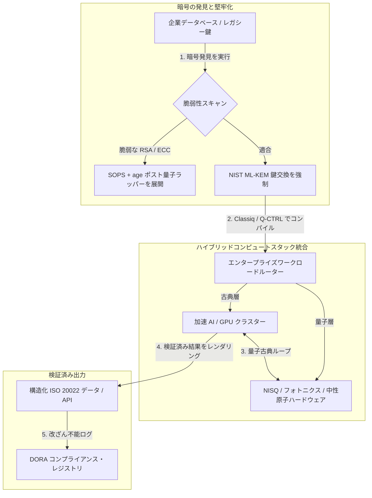

---

# Front Matter (YAML)

author: "contact@sebastienrousseau.com (Sebastien Rousseau)"
banner_alt: "ロンドンで開催された Economist Impact 第 5 回年次 Commercialising Quantum Global 2026 サミットのステージビュー — 量子技術が物理学研究からエンタープライズ対応ワークフローへ移行することを象徴"
banner_height: "1597"
banner_width: "2584"
banner: "https://cloudcdn.pro/stocks/images/sebastien-rousseau-20260617-5th-commercialising-quantum-2.webp"
cdn: "https://cloudcdn.pro"
charset: "UTF-8"
cname: "sebastienrousseau.com"
copyright: "© Copyright 2025 - 2026 - Sebastien Rousseau. All rights reserved."
date: "June 17, 2026"
description: "Economist Impact 第 5 回年次 Commercialising Quantum Global 2026 サミットからの取締役会向け要点 — 13 億ドルの資金調達の急増、ノーリグレットなハイブリッドスタック、ポスト量子暗号への移行の緊急性、量子センシングの商業化、そして待機は自滅的なミスであるとする HSBC の指針を整理します。"
format-detection: "telephone=no"
hreflang: "ja"
icon: "https://cloudcdn.pro/clients/sebastienrousseau/v1/logos/sebastienrousseau.svg"
id: "https://sebastienrousseau.com/2026-06-17-economist-commercialising-quantum-summit-2026"
image_alt: "セバスチャン・ルソーのモノクロ・ポートレート"
image_height: "162"
image_width: "162"
image: "https://cloudcdn.pro/stocks/images/sebastienrousseau.webp"
keywords: "Commercialising Quantum Global 2026, Economist Impact サミット, ポスト量子暗号, NIST ML-KEM, harvest-now decrypt-later, SNDL, HSBC 量子, Philip Intallura, 量子センシング, GPS 非依存ナビゲーション, NQCC, EU 量子法, Quantcore, qBIG 賞, Lord Vallance, ハイブリッド量子古典, DORA 第 6 条"
language: "ja-JP"
last_reviewed: "2026-06-17"
layout: "report"
locale: "ja_JP"
logo_alt: "セバスチャン・ルソーのロゴ"
logo_height: "44"
logo_width: "44"
logo: "https://cloudcdn.pro/clients/sebastienrousseau/v1/logos/sebastienrousseau.svg"
menu: ""
measurementID: "G-169G4ET5HQ"
name: "Sebastien Rousseau"
permalink: "https://sebastienrousseau.com/2026-06-17-economist-commercialising-quantum-summit-2026"
rating: "general"
referrer: "no-referrer"
robots: "index, follow"
schema: "FAQPage, Article"
seo_title: "Commercialising Quantum 2026:取締役会向け要点"
short_name: "sebastienrousseau"
subtitle: "量子は投機的な実験室科学からハイブリッドなエンタープライズワークフローへと越境しました。取締役会は、2026 年に流入した 13 億ドル、即時のポスト量子移行、そして待機を止めよとする HSBC の指針に応答しなければなりません。"
tags: "量子, ポスト量子暗号, NIST ML-KEM, harvest-now decrypt-later, 量子センシング, HSBC, Economist Impact, ハイブリッドコンピュート, DORA, EU 量子法, NQCC, サミット要点"
theme-color: "0, 83, 191"
title: "量子ビットから収益へ:Economist 第 5 回年次 Commercialising Quantum Global 2026 サミットからの戦略的要点"
url: "https://sebastienrousseau.com/2026-06-17-economist-commercialising-quantum-summit-2026"
viewport: "width=device-width, initial-scale=1, shrink-to-fit=no"

# RSS - The RSS feed front matter (YAML).
atom_link: "https://sebastienrousseau.com/2026-06-17-economist-commercialising-quantum-summit-2026/rss.xml"
category: "Technology"
docs: https://validator.w3.org/feed/docs/rss2.html
generator: "Static Site Generator (SSG) (version 0.0.26)"
item_description: "Economist Impact 第 5 回年次 Commercialising Quantum Global 2026 サミットからの取締役会向け要点 — 13 億ドルの資金調達の急増、ノーリグレットなハイブリッドスタック、ポスト量子暗号への移行の緊急性、量子センシングの商業化、そして待機は自滅的なミスであるとする HSBC の指針を整理します。"
item_guid: "https://sebastienrousseau.com/2026-06-17-economist-commercialising-quantum-summit-2026/rss.xml"
item_link: "https://sebastienrousseau.com/2026-06-17-economist-commercialising-quantum-summit-2026/rss.xml"
item_pub_date: "Wed, 17 Jun 2026 06:06:06 +0000"
item_title: "量子ビットから収益へ:Economist 第 5 回年次 Commercialising Quantum Global 2026 サミットからの戦略的要点"
last_build_date: "Wed, 17 Jun 2026 06:06:06 +0000"
managing_editor: "contact@sebastienrousseau.com (Sebastien Rousseau)"
pub_date: "Wed, 17 Jun 2026 06:06:06 +0000"
ttl: "60"
type: "article"
webmaster: "contact@sebastienrousseau.com"

# Apple - The Apple front matter (YAML).
apple_mobile_web_app_orientations: "portrait"
apple_touch_icon_sizes: "192x192"
apple-mobile-web-app-capable: "yes"
apple-mobile-web-app-status-bar-inset: "black"
apple-mobile-web-app-status-bar-style: "black-translucent"
apple-mobile-web-app-title: "Commercialising Quantum 2026:取締役会向け要点"
apple-touch-fullscreen: "yes"

# MS Application - The MS Application front matter (YAML).

msapplication-navbutton-color: "0, 83, 191"

# Twitter Card - The Twitter Card front matter (YAML).

twitter_card: "summary_large_image"
twitter_creator: "@wwdseb"
twitter_description: "Economist Impact 第 5 回年次 Commercialising Quantum Global 2026 サミットからの取締役会向け要点 — 13 億ドルの資金調達の急増、ノーリグレットなハイブリッドスタック、ポスト量子暗号への移行の緊急性、量子センシングの商業化、そして待機は自滅的なミスであるとする HSBC の指針を整理します。"
twitter_image: "https://cloudcdn.pro/clients/sebastienrousseau/v1/logos/sebastienrousseau.svg"
twitter_image_alt: "セバスチャン・ルソーのロゴ"
twitter_site: "@wwdseb"
twitter_title: "Commercialising Quantum 2026:取締役会向け要点"
twitter_url: "https://sebastienrousseau.com/2026-06-17-economist-commercialising-quantum-summit-2026"

excerpt: "Economist Impact 第 5 回年次 Commercialising Quantum Global 2026 サミットは、量子のエンタープライズワークフローへの転換を確認しました。5 カ月で 13 億ドルを調達し、ポスト量子暗号は SNDL ハーベスティング下で取締役会の受託者課題となり、量子センシングは GPS 非依存ナビゲーションとして本日出荷され、HSBC の Philip Intallura は耐故障ハードウェアを待つことが自滅的なミスであるとの指針を示しました。"

# Humans.txt - The Humans.txt front matter (YAML).
author_website: "https://sebastienrousseau.com"
author_twitter: "@wwdseb"
author_location: "London, UK"
thanks: "ご一読ありがとうございます。"
site_last_updated: "2026-06-17"
site_standards: "HTML5, CSS3, RSS, Atom, JSON, XML, YAML, Markdown, TOML"
site_components: "Kaishi, Kaishi Builder, Kaishi CLI, Kaishi Templates, Kaishi Themes"
site_software: "Static Site Generator, Rust"

---

# 量子ビットから収益へ:Economist 第 5 回年次 Commercialising Quantum Global 2026 サミットからの戦略的要点

エンタープライズ対応、ポスト量子暗号への移行、ハイブリッドコンピュートスタック、そして量子センシングと量子ネットワーキングが拓く新たな商業地勢を概観します。

**要点。**Economist Impact が 2026 年 6 月 16 〜 17 日にロンドンの Business Design Centre で開催した第 5 回年次 Commercialising Quantum Global 2026 会議には、エンタープライズ、金融、政策、研究の各分野から 1,100 名超のグローバルリーダーが参集しました。中心テーマは明確な構造的転換を示しました。量子技術は投機的な実験室科学から、実用的でハイブリッドなエンタープライズワークフローへと移行したのです。2026 年の最初の 5 カ月だけで 13 億ドルのベンチャーキャピタルが投じられたことを背景に、取締役会の議論はもはや物理量子ビット数を数えることではなく、「ノーリグレット」なハイブリッドコンピュートスタックの確立、「harvest-now, decrypt-later」(SNDL) 暗号脅威に対するデジタル資産の保護、そして GPS 非依存ナビゲーション向け近未来型量子センシングシステムの展開に置かれています。

## 主要な要点

- **エンタープライズの実用ワークフローへの転換。**業界リーダー (HorizonX の [Steve Suarez](https://www.linkedin.com/in/stevesuarez)、HSBC の [Phil Intallura](https://www.linkedin.com/in/intallura)) は、量子の統合がもはや物理学の課題ではなく、運用の課題であることを強調しました。銀行と企業は、人材を準備し稼働中のワークロードを最適化するため、ハイブリッド量子古典型パイロットを展開しています。
- **ポスト量子暗号 (PQC) は取締役会の優先事項。**セキュリティおよび法律の専門家 (CMS UK、Microsoft の [Joanne Miller](https://www.linkedin.com/in/joanne-miller-nso)、EY の [Craig Farrell](https://www.linkedin.com/in/craig-farrell)) は、組織が PQC 展開のために耐故障ハードウェアを待つことはできないと警告しました。「harvest-now, decrypt-later」のハーベスティングは現在進行形で発生しており、NIST ML-KEM 標準への移行は即時の受託者課題となっています。
- **量子センシングは近未来の収益化を主導。**耐故障コンピューティングは数年先のままですが、量子センシング (Infleqtion の [Matthew Kinsella](https://www.linkedin.com/in/matthewkinsella)) は急速に拡大しています。量子時計と慣性センサーは、GPS 非依存ナビゲーション、国家安全保障、超安定型電力網に展開されています。
- **主権、クラスター、政策の緊急性。**英国科学相 [Lord Vallance](https://www.linkedin.com/in/patrick-vallance) と [Lord William Hague](https://www.linkedin.com/in/williamhague) は、研究を産業規模の「スーパークラスター」へ転換し、National Quantum Computing Centre (NQCC) と連携させる国家ミッションを示しました。間近に迫る EU Quantum Act は、主権的なコンピュート能力を巡る地政学的競争をさらに浮き彫りにしています。
- **Quantcore が qBIG 賞を受賞。**University of Glasgow のスピンアウトである Quantcore は、ニオブベースの超伝導コンポーネントの画期的成果により IOP qBIG 賞を獲得しました。本コンポーネントは従来材料より高温で動作し、極低温インフラの間接費を大幅に削減します。

**関連記事:** [KyberLib と 2026 年のポスト量子銀行業移行:標準からコードへ](https://sebastienrousseau.com/2026-06-12-kyberlib-post-quantum-banking-migration-standards-code-2026/)、[2026 年の銀行レジリエンス指数:AI、クラウド、量子、ペイメント、サードパーティ集中リスク](https://sebastienrousseau.com/2026-06-08-banking-resilience-index-ai-cloud-quantum-payments-third-party-risk-2026/)、[2026 年のクラウドネイティブ銀行業指数:DORA、プラットフォームエンジニアリング、ソブリンクラウド、オペレーショナル・レジリエンス](https://sebastienrousseau.com/2026-06-05-cloud-native-banking-index-dora-resilience-platform-engineering-2026/)。

## 01. 2026 年サミットが取締役会にとって重要な理由

Economist の 2026 年版 Commercialising Quantum Global サミットは、企業世界がディープテックを評価する方法における恒久的な転換を示しました。

歴史的に、量子コンピューティングは数十年にわたる科学的取り組みとして R&D 部門に押し込められてきました。2026 年 6 月時点で、この見方は陳腐化しています。組織は「物理学中心」の好奇心から「ビジネス中心」の実装へと移行しなければなりません。理由は二つあります。

1. **量子・AI の収斂。**ハイパフォーマンスコンピューティング (HPC) スタックは、古典、加速 AI、NISQ (Noisy Intermediate-Scale Quantum) ノードを単一の統合コンピュート層へと融合させつつあります。量子対応アプリケーションの構築を遅らせる組織は、戦略的優位を獲得する窓が予想以上に速く閉じることを発見することになります。
2. **地政学的および受託者上の緊急性。**英国のミッション主導型量子プログラムと間近に迫る EU Quantum Act により、量子能力は国家主権と企業継続性の問題となりました。

さらに、ポスト量子サイバーセキュリティはもはや将来のコンプライアンス要件ではありません。敵対的な「store now, decrypt later」(SNDL) 攻撃の脅威は、今日傍受された企業データが商用量子システムの拡張時に復号されることを意味し、デジタル・オペレーショナル・レジリエンス法 (DORA) のような世界的オペレーショナル・レジリエンス義務の下で即時の責任を生じさせます。

## 02. Commercialising Quantum 2026 戦略レンズ

エンタープライズの技術リーダーは、量子の成熟度を 5 つの異なる運用層にマッピングし、タイムラインの地平とバランスシートのリスクを評価しなければなりません。

### 表 1:Commercialising Quantum 2026 戦略レンズ

| 層 | 企業の焦点 | タイムライン / 地平 | 主要な企業リスク |
| ---- | ---- | ---- | ---- |
| **ハードウェアおよびコンパイラ** | 競合するアプローチ (超伝導、トラップドイオン、中性原子、フォトニクス) の選択 | 3 〜 5 年 (耐故障性) | 行き止まりのアーキテクチャに固定化される、または単一プラットフォームに早すぎる時期に賭けるリスク。 |
| **暗号の堅牢化** | 暗号依存関係の発見とインベントリ、NIST ML-KEM への移行 | 即時 (能動的移行) | DORA および NIST CSF 2.0 下での体系的データ侵害およびコンプライアンス違反。 |
| **量子センシング** | GPS 非依存ナビゲーション、超安定型時計、重力計の展開 | 1 〜 2 年 (即時商業化) | GPS ジャミングによる物流、海運、電力網の運用障害。 |
| **システム統合** | 量子ハードウェアを既存の古典 HPC およびスーパーコンピューティング・データセンターへ接続 | 1 〜 3 年 (ハイブリッド期) | 高遅延、データ転送のボトルネック、断片化したコンピュート・サイロ。 |
| **エンタープライズソフトウェア** | 高レベルの抽象化層と API (Classiq、Q-CTRL) を通じた量子アルゴリズムの公開 | 即時 (スキル構築) | 実際のエンジニアリング実行から人材とワークフローが乖離する。 |

## 03. 主要な量子シグナルと取締役会のトリガー

技術リーダーは、量子投資を導くため、特定の定量可能な市場および規制指標を監視しなければなりません。

### 表 2:主要な量子シグナルと取締役会のトリガー

| シグナル | 定量指標 | 規制 / 政策参照 | 実行可能なプラットフォーム優先事項 |
| ---- | ---- | ---- | ---- |
| **量子資金調達の急増** | 2026 年の最初の 5 カ月で世界的に 13 億ドルを調達 | レジリエンス投資効果 (RoR) | 投機的パイロットから「ノーリグレット」なハイブリッド量子古典型ワークロードへ予算を移行。 |
| **データ復号エクスポージャー** | 公衆チャネル上で送信される暗号化データの 100% が SNDL ハーベスティングに曝されている | DORA 第 6 条 (ICT セキュリティ) | 資産全体で脆弱な RSA / ECC 鍵を特定するため暗号発見ツールを実装。 |
| **主権インフラ** | 英国国家量子戦略への 25 億ポンドの配分 | UK Quantum Missions / Lord Vallance | NQCC のような国家スーパークラスターと地域パートナーシップを確立。 |
| **コンプライアンス期限** | 2026 年 11 月 14 日 SWIFT 構造化アドレス切替 | SWIFT SR 2026 指令 | 構造化 XML 仕様に適合するよう銀行間データベースを整備・フォーマット。 |

## 04. コアサミットテーマの詳細分析

### 量子は投資のティッピングポイントに到達

ベンチャーキャピタルの資金調達は著しい加速を経験し、2026 年の最初の 5 カ月だけで **13 億ドル**を調達しました。過去の投機的なハイプサイクルとは異なり、現在の資本の波は実世界の近未来型ワークロードに裏付けられています。Classiq と IBM Quantum Platform の登壇者は、ソフトウェア抽象化層と自動コンパイラにより、専門外の開発者チームが今日の古典インフラ上でハイブリッド量子古典型アルゴリズムを実行できる仕組みを示しました。この「ノーリグレット」戦略により、組織は量子対応の人材とワークフローを即座に構築できます。

### 「harvest now, decrypt later」に関する法務・規制の警告

法律パートナーとサイバーセキュリティ責任者は、データリスクの即時性を巡って大きな議論を喚起しました。スポンサー法律事務所 CMS UK の代表者と Microsoft CSO [Joanne Miller](https://www.linkedin.com/in/joanne-miller-nso) は、上級経営陣に対し、*ポスト量子暗号の展開前に耐故障ハードウェアの到来を待つことは、重大な受託者責任違反である*という厳しい警告を発しました。

「store now, decrypt later」(SNDL) パラダイムの下、敵対的アクターは暗号学的に意義のある量子コンピュータが登場し次第復号する意図を持ち、今日も能動的に暗号化された企業データをハーベスティングしています。組織は、長期保存される機微データセット、知的財産、過去の顧客記録を保護するため、ポスト量子保護 (NIST ML-KEM など) を即時に展開しなければなりません。

### 「量子センシング」のハイプ再調整

耐故障量子コンピューティングは数年先のままですが、サミットは量子センシングを実世界展開における真に収益性のある最初の波として浮かび上がらせました。Infleqtion の Chief Executive である [Matthew Kinsella](https://www.linkedin.com/in/matthewkinsella) は、量子時計、慣性センサー、無線周波数システムが複数業界で急速にスケールしている状況を詳述しました。

これらの技術はサブ原子精度で物理定数を測定するため、**GPS 非依存ナビゲーション**、超安定型電力網、深宇宙通信を可能にします。これらのアプリケーションは、増大する GPS ジャミング脅威に直面する航空、海上輸送、国防システムにとって極めて重要です。

### エコシステムとクラスターの協働

英国の量子エコシステムは、ロンドンサミットを国内のイノベーション・スーパークラスターを披露する場として活用しました。National Quantum Computing Centre (NQCC) と Digital Catapult からのライブアップデートでは、初期段階のディープテック・スピンアウトが量子ハードウェアを古典スーパーコンピューティング・データセンターへ直接統合することで「技術の断絶」を架橋できる仕組みが説明されました。

スコットランドの量子スタートアップ Quantcore の共同創業者 [Wridhdhisom Karar](https://www.linkedin.com/in/wridhdhisomkarar) は、同社のニオブベースの超伝導コンポーネントに対し、権威ある Institute of Physics (IOP) Quantum Business Innovation and Growth (qBIG) 賞を受領しました。これらのコンポーネントは従来材料より高温で動作し、量子プロセッサのスケーリングに必要な極低温インフラの間接費を大幅に削減します。

### HSBC ケーススタディ:量子を待つことが「自滅的なミス」である理由

Economist 第 5 回年次 Commercialising Quantum Event (2026) における [**Philip Intallura, Ph.D.**](https://www.linkedin.com/in/intallura) (HSBC Global Head of Quantum Technologies、英国政府アドバイザー、取締役会アドバイザー) の知見は、力強い取締役会向け指針を提示しました。*「耐故障量子を待ってから始めることは自滅的なミスです」*

Dr Intallura は、金融機関の間で一般的な「様子見」アプローチが、3 つの誤った仮定に基づくオウンゴールであると論じました。

- **近未来型 ROI は現実です。**実証検証において、HSBC は本番稼働中のモデルを上回り、量子業務を事業の他部門と接続し、最大級の顧客との関係深化に量子を活用し、**HSBC Innovation Banking** へ重要な新規ビジネスを呼び込みました。
- **量子は急峻な採用曲線です。**高度に規制された組織内で能力を構築し、戦略を策定し、資金を確保し、実験サイクルを回すことは決して短期の取り組みではありません。プロセスは本技術向けに体系的に検証・適応されなければなりません。
- **量子はエコシステムです。**単独で到達できるプレイヤーは存在しません。HSBC が実行したすべての研究論文、PoC、パイロットは、量子プロバイダーとの緊密な協働の下で行われました — そして場合によっては、学界、規制当局、政府にまで協働が及びます。

**締めくくりの取締役会指針:***「耐故障性の初日に必要となる能力は、今構築している能力です」*

## 05. 企業の量子統合と暗号パイプライン

量子対応を構築しながらデジタル資産を保護するため、企業は明確な統合パイプラインを確立しなければなりません。

## 06. 取締役会プレイブック:実行可能な指針

Commercialising Quantum Global 2026 サミットの知見を即時のビジネス価値へ転換するため、上級経営陣は以下の 4 段階の取締役会プレイブックを実行すべきです。

1. **暗号発見を義務化する。**最高情報セキュリティ責任者 (CISO) に対し、すべての暗号資産を目録化し、ポスト量子移行に備えて企業全体のすべてのレガシー RSA および ECC 鍵をマッピングすることを指示します。
2. **「ノーリグレット」なハイブリッド戦略を展開する。**完璧なハードウェアを待たないでください。量子インスパイアド・ソフトウェアとハイブリッド古典量子型パイロットに投資し、社内人材を育成し、複雑な物流やリスクポートフォリオを今日最適化します。
3. **物流向けに量子センシングを評価する。**組織がグローバルサプライチェーン、海運、または重要インフラに依存している場合、地政学的混乱リスクを軽減するため、量子センシングシステム (GPS 非依存ナビゲーションなど) を能動的に評価します。
4. **6 月 30 日の Insight Hour に登録する。**技術リーダーが、企業リスク管理と人材配分戦略の追跡を継続するため、2026 年 6 月 30 日午後 3 時 BST に開催される仮想 **Commercialising Quantum Global Insight Hour** (IonQ 提供) に登録するよう確保します。

## 07. よくある質問

**「harvest now, decrypt later」(SNDL) とは何ですか。なぜ本日重要なのですか。**
SNDL とは、暗号学的に意義のある量子コンピュータが利用可能となり次第復号する意図を持ち、本日暗号化データを傍受・保存する慣行です。長期保存される機微データセット — 知的財産、顧客記録、政府通信 — はすでに標的となっています。NIST ML-KEM への移行は、取締役会が先送りできない受託者決定です。

**なぜコンピューティングではなく量子センシングが最初の商業の波なのですか。**
量子センサーは、量子コンピューティングが必要とする耐故障ハードウェアを要さず、サブ原子精度で物理定数を測定します。量子時計、重力計、慣性センサーは、GPS 非依存ナビゲーション、超安定型電力網、深宇宙通信向けにすでにパイロット展開段階にあります。

**HSBC の量子業務は単なる R&D ですか、それとも測定可能なリターンを生み出していますか。**
サミットでの Philip Intallura によれば、HSBC は本番稼働中のモデルを上回り、量子を最大級の顧客との関係深化に活用し、HSBC Innovation Banking へ重要な新規ビジネスを呼び込みました。本業務は研究から運用統合へと移行しています。

## 08. 参考文献

- **Economist Impact, (2026).** *5th Annual Commercialising Quantum Global 2026.* ライブカンファレンス議事録、2026 年 6 月 16 〜 17 日。ロンドン:Business Design Centre。入手先:[Economist Impact](https://events.economist.com/commercialising-quantum/)。
- **National Institute of Standards and Technology (NIST), (2024).** *First Three Finalized Post-Quantum Encryption Standards (FIPS 203, 204, and 205).* Gaithersburg:U.S. Department of Commerce。入手先:[NIST Standards](https://www.nist.gov/news-events/news/2024/08/nist-releases-first-3-finalized-post-quantum-encryption-standards)。
- **European Parliament and Council of the European Union, (2022).** *Regulation (EU) 2022/2554 on digital operational resilience for the financial sector (DORA).* Brussels:Official Journal of the European Union。入手先:[DORA Regulation](https://eur-lex.europa.eu/legal-content/EN/TXT/?uri=CELEX%3A32022R2554)。
- **SWIFT, (2024).** *ISO 20022 November 2026 Structured Address Milestone.* La Hulpe:SWIFT。入手先:[SWIFT ISO 20022 milestone](https://www.swift.com/standards/iso-20022/iso-20022-bytes/call-action-november-2026)。
