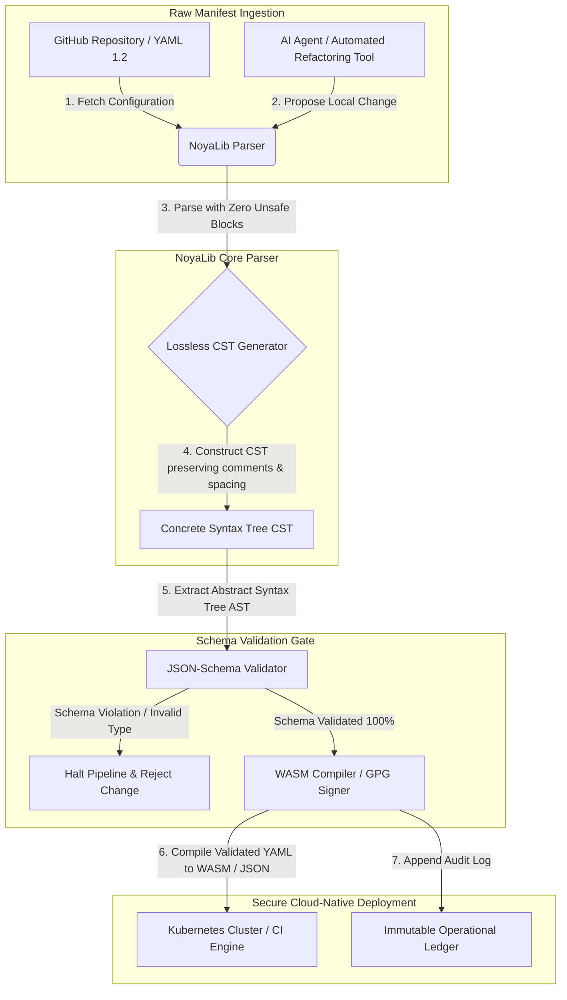

---

# Front Matter (YAML)

author: "contact@sebastienrousseau.com (Sebastien Rousseau)"
banner_alt: "劇的な光の下の建築幾何学 — CI、Kubernetes、MCP、および金融サービス構成の下で荷重を支える安全な Rust YAML パーサーとしての NoyaLib の役割を象徴"
banner_height: "1597"
banner_width: "2584"
banner: "https://cloudcdn.pro/stocks/images/ken-cheung-KonWFWUaAuk.webp"
cdn: "https://cloudcdn.pro"
charset: "UTF-8"
cname: "sebastienrousseau.com"
copyright: "© Copyright 2025 - 2026 - Sebastien Rousseau. All rights reserved."
date: "June 18, 2026"
description: "NoyaLib は、406/406 仕様適合、JSON Schema 検証、ロスレス CST、MCP/WASM バインディングを備えるゼロ unsafe な Rust YAML 1.2 パーサーです。"
format-detection: "telephone=no"
hreflang: "ja"
icon: "https://cloudcdn.pro/clients/sebastienrousseau/v1/logos/sebastienrousseau.svg"
id: "https://sebastienrousseau.com/2026-06-18-noyalib-safe-yaml-rust-ai-mcp-financial-infrastructure-2026"
image_alt: "セバスチャン・ルソーのモノクロ・ポートレート"
image_height: "162"
image_width: "162"
image: "https://cloudcdn.pro/stocks/images/sebastien-rousseau.png"
keywords: "より安全な Rust YAML パーサー, NoyaLib, YAML 1.2 仕様適合, ゼロ unsafe Rust, JSON Schema 検証, ロスレス CST, MCP, Model Context Protocol, WebAssembly, Kubernetes マニフェスト, CI/CD 構成, DORA 第 5 条, BCBS 239, Basel III オペレーショナルリスク, 金融インフラ, 構成セキュリティ, ソフトウェアサプライチェーン"
language: "ja-JP"
last_reviewed: "2026-06-18"
layout: "report"
locale: "ja_JP"
logo_alt: "セバスチャン・ルソーのロゴ"
logo_height: "44"
logo_width: "44"
logo: "https://cloudcdn.pro/clients/sebastienrousseau/v1/logos/sebastienrousseau.svg"
menu: ""
measurementID: "G-169G4ET5HQ"
name: "Sebastien Rousseau"
permalink: "https://sebastienrousseau.com/2026-06-18-noyalib-safe-yaml-rust-ai-mcp-financial-infrastructure-2026"
rating: "general"
referrer: "no-referrer"
robots: "index, follow"
schema: "FAQPage, Article"
seo_title: "AI、MCP、金融向けのより安全な Rust YAML パーサー"
short_name: "sebastienrousseau"
subtitle: "より安全な Rust YAML スタックである NoyaLib は、YAML 1.2 を利便性のためのマークアップから、AI エージェント、MCP、Kubernetes、金融サービスインフラ向けの暗号学的に安全で仕様適合の構成コントロールプレーンへと転換します。"
tags: "より安全な Rust YAML パーサー, NoyaLib, YAML 1.2, ゼロ unsafe Rust, JSON Schema, MCP, WebAssembly, Kubernetes, DORA, BCBS 239, Basel III, 金融インフラ, サプライチェーンセキュリティ"
theme-color: "0, 83, 191"
title: "なぜ YAML には 2026 年の AI、MCP、金融インフラ向けにより安全な Rust スタックが必要なのか"
url: "https://sebastienrousseau.com/2026-06-18-noyalib-safe-yaml-rust-ai-mcp-financial-infrastructure-2026"
viewport: "width=device-width, initial-scale=1, shrink-to-fit=no"

# RSS - The RSS feed front matter (YAML).
atom_link: "https://sebastienrousseau.com/2026-06-18-noyalib-safe-yaml-rust-ai-mcp-financial-infrastructure-2026/rss.xml"
category: "Technology"
docs: https://validator.w3.org/feed/docs/rss2.html
generator: "Static Site Generator (SSG) (version 0.0.26)"
item_description: "NoyaLib は、406/406 仕様適合、JSON Schema 検証、ロスレス CST、MCP/WASM バインディングを備えるゼロ unsafe な Rust YAML 1.2 パーサーです。"
item_guid: "https://sebastienrousseau.com/2026-06-18-noyalib-safe-yaml-rust-ai-mcp-financial-infrastructure-2026/rss.xml"
item_link: "https://sebastienrousseau.com/2026-06-18-noyalib-safe-yaml-rust-ai-mcp-financial-infrastructure-2026/rss.xml"
item_pub_date: "Thu, 18 Jun 2026 06:06:06 +0000"
item_title: "なぜ YAML には 2026 年の AI、MCP、金融インフラ向けにより安全な Rust スタックが必要なのか"
last_build_date: "Thu, 18 Jun 2026 06:06:06 +0000"
managing_editor: "contact@sebastienrousseau.com (Sebastien Rousseau)"
pub_date: "Thu, 18 Jun 2026 06:06:06 +0000"
ttl: "60"
type: "article"
webmaster: "contact@sebastienrousseau.com"

# Apple - The Apple front matter (YAML).
apple_mobile_web_app_orientations: "portrait"
apple_touch_icon_sizes: "192x192"
apple-mobile-web-app-capable: "yes"
apple-mobile-web-app-status-bar-inset: "black"
apple-mobile-web-app-status-bar-style: "black-translucent"
apple-mobile-web-app-title: "AI、MCP、金融向けのより安全な Rust YAML パーサー"
apple-touch-fullscreen: "yes"

# MS Application - The MS Application front matter (YAML).

msapplication-navbutton-color: "0, 83, 191"

# Twitter Card - The Twitter Card front matter (YAML).

twitter_card: "summary_large_image"
twitter_creator: "@wwdseb"
twitter_description: "NoyaLib は、406/406 仕様適合、JSON Schema 検証、ロスレス CST、MCP/WASM バインディングを備えるゼロ unsafe な Rust YAML 1.2 パーサーです。"
twitter_image: "https://cloudcdn.pro/clients/sebastienrousseau/v1/logos/sebastienrousseau.svg"
twitter_image_alt: "セバスチャン・ルソーのロゴ"
twitter_site: "@wwdseb"
twitter_title: "AI、MCP、金融向けのより安全な Rust YAML パーサー"
twitter_url: "https://sebastienrousseau.com/2026-06-18-noyalib-safe-yaml-rust-ai-mcp-financial-infrastructure-2026"

excerpt: "NoyaLib は、より安全な Rust YAML スタックです — ゼロ unsafe ブロック、406/406 の YAML 1.2 仕様適合、ロスレス CST、JSON Schema (Draft 2020-12) 検証、MCP/WASM バインディングを備え、AI エージェント、Kubernetes、CI/CD、金融インフラを支える構成コントロールプレーンのために設計されています。"

# Humans.txt - The Humans.txt front matter (YAML).
author_website: "https://sebastienrousseau.com"
author_twitter: "@wwdseb"
author_location: "London, UK"
thanks: "ご一読ありがとうございます。"
site_last_updated: "2026-06-18"
site_standards: "HTML5, CSS3, RSS, Atom, JSON, XML, YAML, Markdown, TOML"
site_components: "Kaishi, Kaishi Builder, Kaishi CLI, Kaishi Templates, Kaishi Themes"
site_software: "Static Site Generator, Rust"

---

# なぜ YAML には 2026 年の AI、MCP、金融インフラ向けにより安全な Rust スタックが必要なのか

より安全な Rust YAML スタックが重要である理由は、YAML が現在、CI/CD パイプライン、Kubernetes マニフェスト、[Open Policy Agent](https://www.openpolicyagent.org/) ルール、Model Context Protocol (MCP) ツールレジストリを担っているからです。たった一つの曖昧なパースが、清算システムを停止させ、セキュリティグループを誤設定し、ローカル AI エージェントに誤った権限を与えかねません。[NoyaLib](https://github.com/sebastienrousseau/noyalib) は、そのインフラを既定で安全にするために設計された、ピュア Rust でゼロ unsafe の [YAML 1.2](https://yaml.org/spec/1.2.2/) パースおよび検証エコシステムです。

## クイックアンサー

**NoyaLib とは一言で何ですか。**NoyaLib は、`unsafe` コードゼロ、公式 406 テストの YAML スイート全体で 100% の仕様適合、ロスレス CST、リアルタイムの [JSON Schema](https://json-schema.org/) 検証を備える、オープンソースのピュア Rust YAML 1.2 パーサーおよび検証エコシステムです。AI エージェント、MCP、Kubernetes、金融インフラの構成を既定で安全にするように設計されています。

## エグゼクティブサマリー

YAML は、曖昧なパースや Schema 違反が数十億ドル規模の本番清算システムを停止させるまでは控えめに見えます。2026 年において YAML は、[CI/CD](https://docs.github.com/en/actions/learn-github-actions/workflow-syntax-for-github-actions) パイプライン、[Kubernetes](https://kubernetes.io/docs/concepts/configuration/overview/) マニフェスト、[Open Policy Agent](https://www.openpolicyagent.org/) ルール、Model Context Protocol (MCP) ツールレジストリの事実上の標準です。メモリ脆弱性と破壊的パースを伴う不透明なレガシーパーサーは、受け入れがたいセキュリティリスクです。NoyaLib は、ピュア Rust でゼロ unsafe な YAML 1.2 エコシステムであり、公式スイートの 406 テスト全てで 100% の仕様適合、コメントと空白を保持するロスレス CST、組み込みの JSON Schema 検証を備えます。その結果、YAML は監査可能かつ安全で、エージェントからアクセス可能な構成コントロールプレーンとして再構成されます。

## 主要な要点

- **構成は本番コードである。**たった一つの不正な YAML ファイルが、クラウドネイティブのセキュリティグループや AI エージェントの権限を誤設定し得ます。NoyaLib は YAML を重要インフラとして扱います。
- **ゼロ unsafe な設計。**NoyaLib は、安全な Rust のみで構築され、`unsafe` ブロックがゼロです。コアパース層におけるメモリ安全性の脆弱性 — バッファオーバーフローやリモートコード実行 — を排除します。
- **絶対的な 406/406 仕様適合。**構成構造を数学的に検証し、ステージングと本番環境の間のパースの差異や構造的ドリフトを排除します。
- **ロスレス CST。**コメントと書式を破棄するレガシーパーサーとは異なり、NoyaLib は空白と注釈を保持し、AI エージェントによる安全なラウンドトリップ型の自動リファクタリングを可能にします。
- **取締役会レベルの受託者価値。**構成完全性を [DORA 第 5 条](https://eur-lex.europa.eu/legal-content/EN/TXT/?uri=CELEX%3A32022R2554) および [Basel III](https://www.bis.org/bcbs/publ/d424.htm) のオペレーショナルリスク自己資本指標と接続し、上級経営陣を個人責任から直接的に保護します。

**関連記事:** [KyberLib と 2026 年のポスト量子銀行業移行:標準からコードへ](https://sebastienrousseau.com/2026-06-12-kyberlib-post-quantum-banking-migration-standards-code-2026/)、[2026 年のクラウドネイティブ銀行業指数:DORA、プラットフォームエンジニアリング、ソブリンクラウド、オペレーショナル・レジリエンス](https://sebastienrousseau.com/2026-06-05-cloud-native-banking-index-dora-resilience-platform-engineering-2026/)、[2026 年の AI 対応ドットファイル:MCP、SLSA、マルチシェル等価性のための安全で再現可能な開発者ワークステーションの構築](https://sebastienrousseau.com/2026-06-16-ai-aware-dotfiles-secure-reproducible-workstation-2026/)。

## 01. なぜ 2026 年により安全な Rust YAML スタックが重要なのか

2026 年 6 月時点で、エンタープライズ IT インフラは高度に分散化され、自動化が一段と進んでいます。

YAML は、ソフトウェアエンジニアリングスタック全体の荷重を支える構成言語として静かに台頭しました。本番成果物をコンパイルする継続的インテグレーション (CI) ワークフローを担い、グローバルなクラウドネイティブクラスターをオーケストレートする [Kubernetes](https://kubernetes.io/docs/concepts/overview/) マニフェストを担い、ローカル AI エージェントにローカル操作の実行権限を付与する [Model Context Protocol](https://modelcontextprotocol.io/) (MCP) サーバー Schema を担っています。

レガシーの YAML パーサー — [PyYAML](https://pyyaml.org/)、[yaml-cpp](https://github.com/jbeder/yaml-cpp)、[libyaml](https://github.com/yaml/libyaml) — は、2 つの構造的リスクを抱えています。

1. **型強制脆弱性 (「ノルウェー問題」)。**レガシーパーサーは、引用符のない文字列を頻繁に強制変換します (国コード `NO` をブール `false` に、`yes`/`no` も同様)。[YAML 1.1 と 1.2 のブールタグ](https://yaml.org/type/bool.html) を参照してください。これにより、重大なシステム障害や、暗黙のセキュリティ誤設定が発生します。
2. **メモリ安全性エクスプロイト。**C/C++ で記述された不透明なパーサーは、メモリリークやバッファオーバーフローのエクスプロイトに苦しんでおり、コアビルドサーバー上のリモートコード実行 (RCE) を招き得ます。

[NoyaLib](https://github.com/sebastienrousseau/noyalib) はこれらの課題を解決します。ピュア Rust でゼロ unsafe な YAML 1.2 パースおよび検証エコシステムです。絶対的な 406/406 仕様適合を達成し、パース時に厳格な JSON Schema 検証を強制することで、NoyaLib は高い **Return on Resilience (RoR)** を実現します — 構成起因のダウンタイムを防ぎ、金融グレードのソフトウェアサプライチェーンを保護します。

## 02. NoyaLib 2026 アーキテクチャレンズ

NoyaLib エコシステムは、安全でロスレスな構成パーサーとして動作します。すべてのローカルおよびクラウドのマニフェストは、最下位の実行層において構造的に検証され保護されます。

### 表 1:NoyaLib アーキテクチャ層とリスク低減

| 層 | 設計上の意思決定 | なぜ重要か | 誤った扱いの場合のリスク |
| ---- | ---- | ---- | ---- |
| **パーサー層** | YAML 1.2 適合、`unsafe` ブロックゼロのピュア Rust パーサー | 最下位の実行層でメモリ安全性脆弱性とバッファオーバーフローを排除。 | コアビルドサーバー上のリモートコード実行 (RCE)。 |
| **適合層** | 公式 YAML 1.2 スイート 406/406 で 100% 適合 | ステージングと本番の間のパース差異と型強制ドリフトを排除。 | セキュリティグループを無効化する「ノルウェー問題」型強制エラー。 |
| **構文木層** | ロスレス CST | ラウンドトリップ型のパースとプログラム的リファクタリングの最中、コメント、空白、順序を保持。 | 自動 AI リファクタリングが開発者の注釈を破壊。 |
| **検証層** | パース時の [JSON Schema (Draft 2020-12)](https://json-schema.org/draft/2020-12/release-notes) 検証 | 構成ファイルが本番クラスターへ到達する前に、厳格なデータモデルを強制。 | 不正な構成ファイルがクラウドネイティブクラスターのクラッシュを誘発。 |
| **インタフェース層** | WebAssembly (WASM) および MCP バインディング | ブラウザ、エッジノード、ローカルエージェントツールキット内で直接、構成検証を実行可能。 | エッジデバイス上で検証を実行できないツーリングのサイロ。 |

## 03. 主要なワークステーションおよび構成セキュリティシグナル

開発および運用資産全体で絶対的なセキュリティを維持するため、最高情報セキュリティ責任者 (CISO) は、特定の定量可能な指標を監視しなければなりません。

### 表 2:ワークステーションおよび構成セキュリティシグナル

| シグナル | 指標 / 運用ベンチマーク | NIST CSF / DORA 参照 | 技術プラットフォームの実装 |
| ---- | ---- | ---- | ---- |
| **パーサー適合** | 公式 YAML 1.2 テストスイート全体で 100% 合格率 (406/406 テスト)。 | [DORA 第 6 条](https://eur-lex.europa.eu/legal-content/EN/TXT/?uri=CELEX%3A32022R2554) (ICT セキュリティ) | CI 実行前にすべてのマニフェストを検証する NoyaLib パーサーコア。 |
| **メモリ安全性プロファイル** | パーサーおよびシリアライザー依存関係内で `unsafe` Rust ブロックがゼロ。 | DORA 第 30 条 (サプライチェーン) | cargo ビルドにおける自動コンパイラチェック ([`forbid(unsafe_code)`](https://doc.rust-lang.org/reference/attributes/diagnostics.html#the-forbid-attribute))。 |
| **Schema 検証** | パース済み構成ファイルの 100% が有効な [JSON Schema](https://json-schema.org/) モデルに対して検証済み。 | [NIST CSF 2.0](https://www.nist.gov/cyberframework) (PR.DS-01) | Schema 違反時にビルドパイプラインを停止するリアルタイム検証ゲート。 |
| **構成ドリフト** | ローカル構成ファイルを git で版管理された状態へリアルタイムに検出・回復。 | Return on Resilience (RoR) | すべてのローカルファイル変更を記録する継続的テレメトリ。 |
| **エージェントアクセス制御** | MCP 構成を通じて動作するローカル AI ツールへの境界付き読み取り専用権限。 | モデルリスク管理 ([SR 11-7](https://www.federalreserve.gov/supervisionreg/srletters/sr1107.htm)) | エージェント操作を承認済みディレクトリに制限する MCP サーバー境界。 |

## 04. 不透明な構成パースの誤謬

クラウドネイティブ運用における主要な脆弱性は、*不透明なパース* — すなわち、コンパイル中に構造的メタデータ (コメント、空白、ドキュメント順序) を破棄したり、暗黙裡に型を強制したりするパーサーの利用 — です。この挙動は 2 つの深刻なセキュリティリスクをもたらします。

1. **破壊的リファクタリング。**AI コーディングアシスタントや自動リファクタリングツールがデプロイメントマニフェストを更新する際、従来のパーサーは開発者のコメントと書式を破棄し、人間によるレビューやインシデント後のフォレンジックに必要なコンテキストを破壊します。
2. **パース差異。**ステージング環境が Python ベースのパーサーを利用し、本番が C ベースのパーサーで稼働している場合、YAML 1.2 仕様適合の僅かな差異により、有効なステージングマニフェストが本番で失敗または異なる挙動を示し、隠れたセキュリティ脆弱性を生み出します。

NoyaLib の **ロスレス CST** はこれを解決します。パースとシリアライズのループ中に、すべての空白、コメント、ドキュメント行を保持します。自動 AI アシスタントは、人間が書いた注釈を 100% 保持したまま、構成ファイルを編集、リファクタリング、コミットできます — 絶対的な監査証跡です。

## 05. 境界付き AI 構成パイプラインの設計

悪意ある構成変更が本番環境へ到達することを防ぐため、組織は厳格に境界付けされ、Schema 検証された構成パイプラインを実装しなければなりません。

以下の運用フローは、NoyaLib が生の YAML をパースし、ロスレス CST を構築し、AST を JSON Schema モデルに対して検証し、ブラウザまたはエッジ環境向けに WebAssembly バインディングをコンパイルする様子を示します。

## 06. 取締役会プレイブックと受託者責任

構成セキュリティとソフトウェアサプライチェーンの完全性は、取締役会の重要優先事項です。上級経営陣は、受託者義務とオペレーショナル・レジリエンスのレンズを通して構成管理に取り組まなければなりません。

- **DORA 第 5 条 (取締役会のアカウンタビリティ)。**取締役会が、機関の ICT リスク管理について最終的かつ委任不可能な責任を負うことを定めています。構成ファイルは、重要なクラウドネイティブのセキュリティグループとペイメントルーティング経路を制御するため、取締役会は、これらのマニフェストをパースするシステムがメモリ安全であり、完全に仕様適合していることを検証して、規制監査を満たさなければなりません。([Regulation (EU) 2022/2554](https://eur-lex.europa.eu/legal-content/EN/TXT/?uri=CELEX%3A32022R2554))
- **BCBS 239 (リスクデータ集計と報告)。**リスクレポーティングとインフラ指標が正確かつ完全であり、厳格なデータ品質管理の下で生成されることを要求します。NoyaLib は、構成ファイルを起点で厳格な Schema に対してパースおよび検証することにより BCBS 239 を支援し、暗黙のデータ漏洩や誤設定起因の障害を防ぎます。([BCBS 239 standard](https://www.bis.org/publ/bcbs239.htm))
- **オペレーショナルリスク自己資本賦課の低減 (Basel III)。**構成起因の障害は、Basel III の下でオペレーショナルリスク自己資本賦課を直接押し上げ、バランスシート資本を拘束します。NoyaLib のような安全でピュア Rust のパーサーで企業構成スタックを標準化することは、このリスクを最小化し、資本を温存し、顧客の信頼を守ります。([Basel III standards](https://www.bis.org/bcbs/publ/d424.htm))

## 07. 銀行類型別の意味合い

### グローバルなシステム上重要な銀行 (G-SIB)

G-SIB は、複数の管轄区域にまたがる数千のマイクロサービスとデプロイメントパイプラインを管理しています。主たる課題は、巨大なクラウドネイティブ資産全体で構成の一貫性を維持し、セキュリティドリフトを防ぐことです。NoyaLib のようなより安全な Rust YAML スタックで標準化することは、すべての Kubernetes マニフェスト、CI/CD パイプライン、セキュリティポリシーが、統一されたメモリ安全なフレームワークの下でパースおよび検証されることを保証します — 監査されていない「スノーフレーク」構成のリスクを排除します。

### トランザクションおよびコーポレートバンク

トランザクションバンクは、機微なペイメントゲートウェイとホールセール清算インフラを運用しています。これらの本番環境へデプロイされるコードと構成の絶対的な安全性を証明することは、譲歩できない規制要求です。NoyaLib の統合は、ソフトウェアサプライチェーンが完全に監査され、ロスレスで、パース脆弱性から保護されていることを保証します — DORA 第 6 条および [PCI DSS v4.0](https://www.pcisecuritystandards.org/document_library/) セクション 6 に明確にマッピングされる管理策です。

### 地域および中小銀行

地域銀行は、G-SIB 規模のテクノロジー予算なしに高いサイバーセキュリティ基準を維持しなければなりません。オープンソースの NoyaLib フレームワークは、軽量、コスト効率的、かつ高いセキュリティを備える Rust 親和性の高い解決策を提供します。中小機関がプロプライエタリなライセンス料なしに、エンタープライズグレードの構成セキュリティとサプライチェーン保護を実装できるようにします。

## 08. 結論:構成セキュリティのロードマップ

開発者ワークステーションとクラウドネイティブインフラの構成は、ソフトウェアサプライチェーンにおける重要なコントロールプレーンです。監査されていない、曖昧な、または安全でない構成ファイルが企業資産へ到達することを許容することは、受け入れがたい運用および規制上のリスクです。

ソフトウェアサプライチェーンを保護し、構成脆弱性からエンドポイントを守るため、上級技術およびセキュリティマネージャーは、本日明確な開発ロードマップを実行すべきです。

1. **宣言型構成を義務化する。**手動かつ監査されていない構成調整を段階的に廃止し、すべてのマニフェストを版管理された宣言型の記録システムとして管理することを義務化します。
2. **Schema 検証を強制する。**厳格な事前コミットフックとスキャンユーティリティを強制し、すべての構成ファイルがデプロイ前に有効な JSON Schema モデルに対して検証されることを確実にします。
3. **ロスレスなラウンドトリップを実装する。**すべての自動 AI コーディングアシスタントとリファクタリングツールが、コメント、空白、開発者のコンテキストを保持するためにロスレスなパースを利用することを確実にします。
4. **サプライチェーンを保護する。**実行前に、すべての構成セットアップとパースユーティリティが、NoyaLib のようなピュア Rust でゼロ unsafe なライブラリを用いて暗号学的に検証されることを確実にします。([SLSA framework](https://slsa.dev/))

## 09. よくある質問

**NoyaLib とは何ですか。なぜ YAML パースに使うのですか。**
NoyaLib は、オープンソースのピュア Rust でゼロ unsafe な YAML 1.2 パーサーです。公式の 406 テストスイート全体で 100% の仕様適合を達成し、パース時に厳格な [JSON Schema](https://json-schema.org/) 検証を強制し、WASM および [MCP](https://modelcontextprotocol.io/) バインディングを公開します — AI エージェント、Kubernetes、金融インフラ向けのより安全な Rust YAML スタックとなります。

**なぜ構成パースにゼロ unsafe な設計が重要なのですか。**
C/C++ で記述されたレガシーパーサー内のメモリ安全性脆弱性 — バッファオーバーフロー、解放後利用 — は、コアビルドサーバー上のリモートコード実行を招き得ます。NoyaLib の [`#![forbid(unsafe_code)]`](https://doc.rust-lang.org/reference/attributes/diagnostics.html#the-forbid-attribute) を伴うピュア Rust 設計は、これらの脆弱性をコンパイル時に数学的に排除します。

**ロスレス CST とは何ですか。なぜ重要ですか。**
従来のパーサーはコメントと書式を破棄するため、AI エージェントによる自動編集は破壊的になります。NoyaLib のロスレス CST は、すべてのコメント、空白、ドキュメント行を保持します — AI アシスタントは、開発者のコンテキスト、インシデント後のフォレンジック、監査証跡を損なうことなく、構成ファイルを安全に編集およびリファクタリングできます。

**NoyaLib は DORA、BCBS 239、Basel III へどのようにマッピングされますか。**
DORA 第 5 条は ICT リスクのアカウンタビリティを取締役会に課し、BCBS 239 はリスクレポーティングのデータ品質管理を要求し、Basel III はオペレーショナルリスク資本に課税します。NoyaLib は、これらの規制が構成・アズ・コードに求める Schema 検証済みでメモリ安全なパース層を供給します — 規制マッピングを明快にし、オペレーショナルリスク自己資本賦課を縮小します。

## 10. 参考文献

- **YAML, (2026).** *YAML 1.2 specification*。入手先:[YAML 1.2 spec](https://yaml.org/spec/1.2.2/)。
- **JSON Schema, (2026).** *JSON Schema Draft 2020-12 release notes*。入手先:[JSON Schema Draft 2020-12](https://json-schema.org/draft/2020-12/release-notes)。
- **European Parliament and Council of the European Union, (2022).** *Regulation (EU) 2022/2554 on digital operational resilience for the financial sector (DORA)*。Brussels:Official Journal of the European Union。入手先:[DORA regulation](https://eur-lex.europa.eu/legal-content/EN/TXT/?uri=CELEX%3A32022R2554)。
- **Basel Committee on Banking Supervision, (2013).** *Principles for effective risk data aggregation and risk reporting (BCBS 239)*。Basel:Bank for International Settlements。入手先:[BCBS 239 standard](https://www.bis.org/publ/bcbs239.htm)。
- **Basel Committee on Banking Supervision, (2017).** *Basel III: finalising post-crisis reforms*。Basel:Bank for International Settlements。入手先:[Basel III standards](https://www.bis.org/bcbs/publ/d424.htm)。
- **Anthropic, (2025).** *Model Context Protocol (MCP) specification*。入手先:[Model Context Protocol](https://modelcontextprotocol.io/)。
- **GitHub, (2026).** *noyalib open-source repository*。入手先:[NoyaLib repository](https://github.com/sebastienrousseau/noyalib)。
