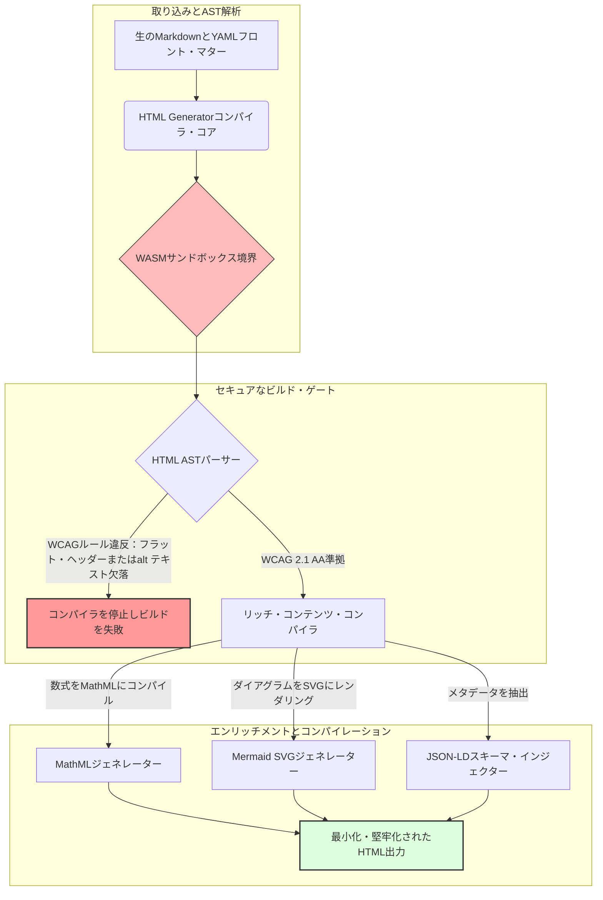

---

# Front Matter (YAML)

author: "contact@sebastienrousseau.com (Sebastien Rousseau)"
banner_alt: "構造化された光の下の建築的幾何学 — アクセシブルでSEO対応のサンドボックス型パブリッシング・インフラのために、コンパイル制御型Markdown-to-HTMLパイプラインとしてのHTML Generatorの役割を象徴しています"
banner_height: "1597"
banner_width: "2584"
banner: "https://cloudcdn.pro/api/transform?url=/stocks/images/markus-winkler-IrRbSND5EUc-unsplash.webp&w=1200&format=webp&q=80"
cdn: "https://cloudcdn.pro"
charset: "UTF-8"
cname: "sebastienrousseau.com"
copyright: "© Copyright 2025 - 2026 - Sebastien Rousseau. All rights reserved."
date: "June 20, 2026"
description: "HTML GeneratorはRust製のMarkdown-to-HTMLコンパイラです。WCAG準拠のアクセシビリティをビルド時に強制し、JSON-LDメタデータを自動注入し、MathML・MermaidをネイティブでレンダリングするWebAssemblyサンドボックス実行を提供します。"
format-detection: "telephone=no"
hreflang: "ja"
icon: "https://cloudcdn.pro/clients/sebastienrousseau/v1/logos/sebastienrousseau.svg"
id: "https://sebastienrousseau.com/2026-06-20-html-generator-accessible-seo-structured-markdown-rust-2026"
image_alt: "Sebastien Rousseauのモノクローム・ポートレート"
image_height: "162"
image_width: "162"
image: "https://cloudcdn.pro/stocks/images/sebastien-rousseau.png"
keywords: "html-generator, Rust Markdown to HTML, アクセシビリティ・アズ・コード, WCAG 2.1 AA, SEO対応HTML, JSON-LD, MathML, Mermaid, WebAssembly, EAA, DORA, ADA Title III, アクセシブル・パブリッシング, サンドボックス型パーシング, オープンソース"
language: "ja-JP"
last_reviewed: "2026-06-20"
layout: "report"
locale: "ja_JP"
logo_alt: "Sebastien Rousseauのロゴ"
logo_height: "44"
logo_width: "44"
logo: "https://cloudcdn.pro/clients/sebastienrousseau/v1/logos/sebastienrousseau.svg"
menu: ""
measurementID: "G-169G4ET5HQ"
name: "Sebastien Rousseau"
permalink: "https://sebastienrousseau.com/2026-06-20-html-generator-accessible-seo-structured-markdown-rust-2026"
rating: "general"
referrer: "no-referrer"
robots: "index, follow"
schema: "FAQPage, Article"
seo_title: "アクセシビリティ・アズ・コード：Rustで実現するMarkdownからAAA準拠HTMLへの変換（2026年）"
short_name: "sebastienrousseau"
subtitle: "企業のWebパブリッシング、製品ドキュメント、クライアント・ポータルを、アクセス不可能なテキスト・ファイルから、高度に構造化されたコンプライアンス対応のサンドボックス型デジタル資産へと変換します。"
tags: "html-generator, Rust, Markdown, アクセシビリティ, WCAG, SEO, JSON-LD, MathML, Mermaid, WebAssembly, EAA, DORA, ADA, AIディスカバリー, RAG, オープンソース, バンキング・インフラ"
theme-color: "0, 83, 191"
title: "Rustで実現する2026年のMarkdownからアクセシブルなSEO対応構造化HTMLへの変換"
url: "https://sebastienrousseau.com/2026-06-20-html-generator-accessible-seo-structured-markdown-rust-2026"
viewport: "width=device-width, initial-scale=1, shrink-to-fit=no"

# RSS - The RSS feed front matter (YAML).
atom_link: "https://sebastienrousseau.com/2026-06-20-html-generator-accessible-seo-structured-markdown-rust-2026/rss.xml"
category: "Technology"
docs: https://validator.w3.org/feed/docs/rss2.html
generator: "Static Site Generator (SSG) (version 0.0.40)"
item_description: "HTML GeneratorはRust製のMarkdown-to-HTMLコンパイラです。WCAG準拠のアクセシビリティをビルド時に強制し、JSON-LDメタデータを自動注入し、MathML・MermaidをネイティブでレンダリングするWebAssemblyサンドボックス実行を提供します。"
item_guid: "https://sebastienrousseau.com/2026-06-20-html-generator-accessible-seo-structured-markdown-rust-2026/rss.xml"
item_link: "https://sebastienrousseau.com/2026-06-20-html-generator-accessible-seo-structured-markdown-rust-2026/rss.xml"
item_pub_date: "Sat, 20 Jun 2026 06:06:06 +0000"
item_title: "Rustで実現する2026年のMarkdownからアクセシブルなSEO対応構造化HTMLへの変換"
last_build_date: "Sat, 20 Jun 2026 06:06:06 +0000"
managing_editor: "contact@sebastienrousseau.com (Sebastien Rousseau)"
pub_date: "Sat, 20 Jun 2026 06:06:06 +0000"
ttl: "60"
type: "article"
webmaster: "contact@sebastienrousseau.com"

# Apple - The Apple front matter (YAML).
apple_mobile_web_app_orientations: "portrait"
apple_touch_icon_sizes: "192x192"
apple-mobile-web-app-capable: "yes"
apple-mobile-web-app-status-bar-inset: "black"
apple-mobile-web-app-status-bar-style: "black-translucent"
apple-mobile-web-app-title: "RustでMarkdownをAAA準拠HTMLに変換"
apple-touch-fullscreen: "yes"

# MS Application - The MS Application front matter (YAML).

msapplication-navbutton-color: "0, 83, 191"

# Twitter Card - The Twitter Card front matter (YAML).

twitter_card: "summary_large_image"
twitter_creator: "@wwdseb"
twitter_description: "HTML GeneratorはRust製のMarkdown-to-HTMLコンパイラです。WCAG準拠のアクセシビリティをビルド時に強制し、JSON-LDメタデータを自動注入し、MathML・MermaidをネイティブでレンダリングするWebAssemblyサンドボックス実行を提供します。"
twitter_image: "https://cloudcdn.pro/clients/sebastienrousseau/v1/logos/sebastienrousseau.svg"
twitter_image_alt: "Sebastien Rousseauのロゴ"
twitter_site: "@wwdseb"
twitter_title: "アクセシビリティ・アズ・コード：RustでMarkdownをAAA準拠HTMLに変換"
twitter_url: "https://sebastienrousseau.com/2026-06-20-html-generator-accessible-seo-structured-markdown-rust-2026"

# Humans.txt - The Humans.txt front matter (YAML).
author_website: "https://sebastienrousseau.com"
author_twitter: "@wwdseb"
author_location: "London, UK"
thanks: "お読みいただきありがとうございます！"
site_last_updated: "2026-06-20"
site_standards: "HTML5, CSS3, RSS, Atom, JSON, XML, YAML, Markdown, TOML"
site_components: "Kaishi, Kaishi Builder, Kaishi CLI, Kaishi Templates, Kaishi Themes"
site_software: "Static Site Generator, Rust"

---

# Rustで実現する2026年のMarkdownからアクセシブルなSEO対応構造化HTMLへの変換

<!-- lead-start -->
<aside class="post-lead" aria-label="記事の概要">

<strong>TL;DR.</strong> HTML GeneratorはピュアRust製のMarkdown-to-HTMLコンパイラです。ビルド時にWCAG 2.1 AAを強制し、スキーマ準拠のJSON-LDを自動注入し、MathMLとMermaid SVGをネイティブでレンダリングし、パーシングをWebAssemblyサンドボックス内で実行します。これにより、パブリッシングをアクセシビリティ、SEO、ICTセキュリティのためのコンパイル制御型コントロール・プレーンに変えます。

<strong>主なポイント</strong>

<ul class="post-lead-takeaways">
  <li><strong>クイック・アンサー。</strong> HTML Generatorを一文で説明するとは？</li>
  <li><strong>エグゼクティブ・サマリー。</strong> Markdownのレンダリングは一見単純に見えますが、パブリッシング・グレードのHTMLはコンプライアンス上の課題です。</li>
  <li><strong>01. 2026年にアクセシビリティ・ファーストのHTMLコンパイラが重要な理由。</strong> EAAとADA Title IIIにより、アクセシビリティはエンジニアリングの衛生管理から受託者責任上の義務へと移行しました。</li>
  <li><strong>02. HTML Generator 2026年のアーキテクチャ概観。</strong> 生のMarkdownから堅牢化されたHTML出力までの、マルチステージ・コンパイラ制御型パイプライン。</li>
</ul>

<strong>関連記事：</strong> <a href="https://sebastienrousseau.com/2026-06-18-noyalib-safe-yaml-rust-ai-mcp-financial-infrastructure-2026">2026年のAI、MCP、金融インフラにYAMLが安全なRustスタックを必要とする理由</a>、<a href="https://sebastienrousseau.com/2026-06-17-static-site-generator-secure-default-ai-era-publishing-2026">AI時代のパブリッシングにおけるセキュア・バイ・デフォルトの静的サイトジェネレーター（2026年）</a>、<a href="https://sebastienrousseau.com/2026-06-11-cloudcdn-open-source-blueprint-ai-native-edge-2026">CloudCDN：2026年のAIネイティブ・エッジのためのオープンソース・ブループリント</a>。

</aside>
<!-- lead-end -->

2026年、ウェブ・コンテンツは人間の読者と同様に、AIサーチ・クローラー、LLMベースの検索エンジン、Retrieval-Augmented Generation（RAG）パイプラインによっても処理されています。フラットまたは不正形式のHTMLはマシンによる発見可能性を損ない、[欧州アクセシビリティ法（EAA）](https://www.accessibility-act.eu/)や[米国ADA Title III](https://www.ada.gov/topics/title-iii/)のような厳格なグローバル規制への不準拠は、明確な民事上の責任を生じさせます。[HTML Generator](https://github.com/sebastienrousseau/html-generator)は、こうしたギャップをデプロイ後のパッチではなくコンパイラの段階でふさぐために設計された、高性能なRustライブラリです。

## クイック・アンサー

**HTML Generatorを一文で説明すると？** HTML GeneratorはオープンソースのピュアなRust製Markdown-to-HTMLコンパイラです。ビルド時に[WCAG 2.1 AA](https://www.w3.org/TR/WCAG21/)を強制し、セマンティック・ランドマークとARIA属性を自動生成し、YAMLフロント・マターからスキーマ準拠の[JSON-LD](https://json-ld.org/)メタデータを注入し、Mermaidダイアグラムと数式をアクセシブルなSVGとMathMLにレンダリングし、[WebAssembly](https://webassembly.org/)サンドボックス内で実行します。これにより企業のパブリッシングをコンパイル制御型の、受託者責任グレードのコントロール・プレーンへと変えます。

## エグゼクティブ・サマリー

Markdownのレンダリングは一見単純に見えます。しかしパブリッシング・グレードのHTMLはコンプライアンス上の課題です。2026年6月現在、あらゆる企業のタッチポイント——投資家向け情報ポータル、規制当局への申告書、顧客ドキュメント、APIリファレンス、マーケティング資産——は人間とマシンの両方によって解析されています。すべてのページで二つの圧力が衝突しています。[EAA](https://www.accessibility-act.eu/)と[ADA Title III](https://www.ada.gov/topics/title-iii/)はアクセシビリティを取締役会レベルの法的リスクとし、AIの取り込みとRAGパイプラインは構造化されたマシン可読な出力を優遇します。標準的なMarkdownライブラリは両方のゲートを通過できないフラットなHTMLを生成します。HTML Generatorはドキュメント生成をコンパイル制御型パイプラインとして扱います。WCAGバリデーションはビルド・エラーとして処理され、JSON-LDはYAMLフロント・マターから自動生成され、MathMLとMermaidはアクセシブルにレンダリングされ、エンジン全体がWebAssemblyターゲットとして提供されることで、信頼されていないドキュメントのパーシングがホストからサンドボックス化されます。

## 主なポイント

- **アクセシビリティ・アズ・コードが新たな基準です。** EAAはコンシューマー向けデジタル・サービスのアクセシビリティを義務付けています。HTML Generatorはコンパイル時にドキュメント・ツリーを評価し、セマンティック・ランドマークとARIA属性を自動生成します。デプロイ後の修正が減り、改善予算が削減され、alt テキストの欠落が本番環境に出ることはありません。
- **AIディスカバリーのための構造化データ。** モダンな検索とRAGはマシン可読なメタデータに依存します。コンパイラはYAMLフロント・マターを解析し、[Schema.org準拠のJSON-LD](https://schema.org/)をドキュメントのヘッドに直接注入することで、[Google Rich Results](https://developers.google.com/search/docs/appearance/structured-data/intro-structured-data)、[Bing Webmaster](https://www.bing.com/webmasters)、LLMベースのクローラーがコンテンツを完全に解釈できるようにします。
- **テクニカル・コンテンツの卓越性。** 技術系のパブリッシングはフラット・テキストではありません。HTML GeneratorはMarkdownの数式拡張をアクセシブルな[MathML](https://www.w3.org/Math/)にコンパイルし、[Mermaid.js](https://mermaid.js.org/)ダイアグラムをレスポンシブなSVGにレンダリングします。どちらも不透明な画像に退化することなく、WCAG準拠の構造を維持します。
- **WebAssemblyサンドボックス化。** 信頼されていないMarkdownのパーシングはセキュリティ上のリスクです。[WASM](https://webassembly.org/)をターゲットとすることで、HTML Generatorはホスト・システムから分離されたサンドボックス内で実行され、任意のコード実行を防止します。これは[DORA Article 6](https://eur-lex.europa.eu/legal-content/EN/TXT/?uri=CELEX%3A32022R2554)のICTセキュリティ要件を直接満たします。
- **取締役会のための受託者的保護。** 技術的な不準拠は取締役会レベルの問題となっています。コンパイラ制御型のHTMLエンジンを標準化することで、DORA、EAA、ADA Title IIIの下での取締役および上級管理職の個人的な民事・規制上のリスクを軽減します。

**関連記事：** [2026年のAI、MCP、金融インフラにYAMLが安全なRustスタックを必要とする理由](https://sebastienrousseau.com/2026-06-18-noyalib-safe-yaml-rust-ai-mcp-financial-infrastructure-2026/)、[AI時代のパブリッシングにおけるセキュア・バイ・デフォルトの静的サイトジェネレーター（2026年）](https://sebastienrousseau.com/2026-06-17-static-site-generator-secure-default-ai-era-publishing-2026/)、[CloudCDN：2026年のAIネイティブ・エッジのためのオープンソース・ブループリント](https://sebastienrousseau.com/2026-06-11-cloudcdn-open-source-blueprint-ai-native-edge-2026/)。

## 01. 2026年にアクセシビリティ・ファーストのHTMLコンパイラが重要な理由

企業のウェブ資産、ドキュメント・ライブラリ、製品ヘルプ・センターは重要なデジタル・タッチポイントです。現在、これらは二つの強力で交錯する圧力にさらされています。

一つ目は**AIの取り込みと発見可能性**です。コンテンツはますます大規模言語モデルとRetrieval-Augmented Generationパイプラインによって処理されるようになっています。フラットまたは不正形式のHTMLはクローラーのパーシングを混乱させ、企業のリサーチやドキュメントがモダンな検索——[Google Search Generative Experience](https://blog.google/products/search/generative-ai-search/)、[ChatGPT](https://chat.openai.com/)のブラウジング、エンタープライズRAGエージェントを含む——に対して不可視となります。

二つ目は**厳格なグローバル・アクセシビリティ法**です。[欧州アクセシビリティ法](https://www.accessibility-act.eu/)（2025年6月より完全適用）および[米国ADA Title III](https://www.ada.gov/topics/title-iii/)の下で、企業のパブリッシング・プラットフォームは完全なデジタル・アクセシビリティを保証しなければなりません。[WCAG 2.1 AA](https://www.w3.org/TR/WCAG21/)への不適合はもはやエンジニアリング上の見落としではありません。数百万ドル規模の和解を生んできた民事・規制上の責任です。

[HTML Generator](https://github.com/sebastienrousseau/html-generator)はこれらの圧力に直接対処します。Markdownをアクセシブルでアクセシビリティ・ファーストのSEO対応構造化HTMLに変換するために設計された、スレッドセーフなRustライブラリです。ドキュメント生成をコンパイラ制御型パイプラインとして扱うことで、エンジンは高い**レジリエンスへのリターン（RoR）**を実現します。アクセシビリティ訴訟からバランスシートを守りながら、AIディスカバリーのためのマシン可読性を最大化します。

## 02. HTML Generator 2026年のアーキテクチャ概観

このフレームワークは、生のMarkdownテキストを暗号的に検証された高アクセシビリティの静的資産に変換する、セキュアなマルチステージ・コンパイレーション・パイプラインとして設計されています。

### 表1：HTML Generatorのアーキテクチャ・レイヤーとリスク軽減

| レイヤー | 設計上の決定 | 重要な理由 | 誤処理時のリスク |
| ---- | ---- | ---- | ---- |
| **入力レイヤー** | MarkdownとYAMLフロント・マターのパーサー | ライターの作業場所を尊重し、散文と構造的メタデータを分離する。 | 不整合なメタデータ、壊れたサイトマップ、インデックスのギャップ。 |
| **構造レイヤー** | ARIAタグを持つ自動化された目次とセマンティック・ランドマーク | 構造的にナビゲーション可能でアクセシブルなドキュメント・ツリーを生成する。 | スクリーン・リーダーを破壊しWCAGに違反するフラットなHTML。 |
| **リッチ・コンテンツ・レイヤー** | ネイティブのMathMLとMermaid.js SVGレンダリング | 数式とダイアグラムをアクセシブルなSVGとMathMLにコンパイルする。 | クライアントサイドのJSレンダリング遅延と壊れた支援技術出力。 |
| **SEOおよびデータ・レイヤー** | 統合されたJSON-LDと構造化メタデータの生成 | [Schema.org](https://schema.org/)準拠のJSON-LDをヘッドに直接注入する。 | 検索エンジンとAIクローラーが著者、コンテキスト、ライセンスを誤読する。 |
| **ランタイム・レイヤー** | ネイティブRustコンパイラとWebAssemblyターゲット | サーバー、エッジ・ノード、ブラウザでのセキュアなサンドボックス実行を可能にする。 | 信頼されていないMarkdownのパーシング中の任意のコード実行。 |

## 03. 主要なウェブ・セキュリティとアクセシビリティのシグナル

公開パブリッシング資産がモダンな規制・セキュリティ監査を満たすことを確認するために、上級技術責任者は特定の定量的なメトリクスを監視しなければなりません。

### 表2：ウェブ・セキュリティとアクセシビリティのシグナル

| シグナル | メトリクス／運用上のベンチマーク | EAA／DORA／W3C参照 | 技術的実装 |
| ---- | ---- | ---- | ---- |
| **アクセシビリティ適合** | コンパイルされた全ページのWCAG 2.1 AAルール100%バリデーション。 | [EAA](https://www.accessibility-act.eu/)および[ADA Title III](https://www.ada.gov/topics/title-iii/) | 画像のaltタグとセマンティック・ランドマークを評価するビルド時HTMLパーサー。 |
| **WASMサンドボックス実行** | 信頼されていない全Markdown入力が隔離されたWebAssemblyランタイムでコンパイルされる100%。 | [DORA Article 6](https://eur-lex.europa.eu/legal-content/EN/TXT/?uri=CELEX%3A32022R2554)（ICTセキュリティ） | パーシング環境のホスト・サーバーからの隔離。 |
| **構造化メタデータ・カバレッジ** | 公開された全記事にスキーマ準拠の有効なJSON-LDヘッダーが注入される100%。 | [Schema.org](https://schema.org/)仕様 | フロント・マターの自動パーシングとJSON-LDオブジェクトへの変換。 |
| **コンパイルのスループット** | 汎用ハードウェアで毎秒10,000ページ超のターゲット。 | レジリエンスへのリターン（RoR） | 高度に並列化されたRustのASTコンパイラ。 |
| **リッチ・スニペット検証** | [Google Rich Results](https://search.google.com/test/rich-results)および[Schema validator](https://validator.schema.org/)実行でのパーシング・エラーゼロ。 | Googleサーチ・ガイドライン | ビルド・パイプライン中の生成JSON-LDの構造バリデーション。 |

## 04. 単純なMarkdownレンダリングという神話

技術管理者の間でよくある誤解は、MarkdownをHTMLに変換することは単純なテキスト置換の作業だというものです。多くの標準ライブラリはMarkdownのフォーマットをフラットで非構造化なHTMLに変換します。出力はブラウザで視覚的に表示されますが、それはコンプライアンス上の罠です。

フラットなHTMLには通常、三つのものが欠けています。

1. **正しい見出し階層。** 標準のMarkdownは見出しの順序を強制しません。`<h1>`から`<h4>`に飛ぶことはWCAG 2.1 AAに違反し、スクリーン・リーダーのドキュメント・ナビゲーションを壊します。
2. **明示的なテーブル・セマンティクス。** 標準のMarkdownテーブルは、アクセシブルなパーシングに必要な正しい`<th>`スコープと`<tbody>`属性とともにレンダリングされることはほとんどありません。
3. **マシン可読なメタデータ。** 標準的なHTMLには、モダンなAI検索プラットフォームとRAG取り込みシステムが依存するJSON-LDフックがありません。

HTML GeneratorはMarkdownを**抽象構文木（AST）**に解析することでこの問題を解決します。エンジンはHTMLを出力する前にドキュメント構造を評価し、見出しのネストをバリデートし、適切なARIA属性を注入し、すべてのメディア資産に代替テキストがあることを確認します。これにより、アクセシビリティは手動監査から保証されたコンパイル時の不変条件へと変わります。

## 05. アクセシビリティ・アズ・コードのビルド・パイプラインの設計

アクセスできない、またはインデックスされていない資産が公開デプロイメントに届くことを防ぐために、アクセシビリティは厳格なコンパイラ・ゲートでなければなりません。以下のパイプラインは、HTML GeneratorがMarkdownを評価し、WebAssembly隔離バリデーションを実行し、堅牢化された構造化HTMLを出力する方法を示しています。

## 06. 取締役会のプレイブックと受託者責任

モダンなアクセシビリティとウェブ・セキュリティのコンプライアンスは、交渉の余地のない取締役会レベルの問題です。上級管理職は、法的リスク、財務保全、規制上のリスクというレンズを通してパブリッシング・インフラにアプローチしなければなりません。

- **欧州アクセシビリティ法（EAA）。** 公的・民間のデジタル・ポータルに直接法的拘束力のあるコンプライアンス義務を課します。不準拠は深刻な財務上のペナルティ、民事訴訟、EU市場からの資産の即時撤退を招く可能性があります。アクセシビリティ・アズ・コードを統合することで、取締役会は非準拠コードが出荷されないことを証明できます。反応的な改善を構造的な法的盾に変えることができます。
- **DORA Article 6（セキュアなICT環境）。** ICT環境セキュリティの厳格なルールを定めています。Markdownのコンパイルをへ 「WebAssemblyサンドボックス内で隔離することで、顧客がアップロードしたドキュメントやパートナー・フィードのパーシングがホスト・サーバーを任意のコード実行にさらすことができないことを保証し、重要なバンキング・ポータルを保護します。
- **コンプライアンス監査のコスト削減。** 従来のアクセシビリティ・コンプライアンスは、コストのかかる事後的なデプロイ後の監査に依存しています——サイトごとに年間数万ドルです。WCAGバリデーションをコンパイル時のブロックとして実装することで、そうした事後的なコストを排除し、コンプライアンス予算を防衛からイノベーションへとシフトします。

## 07. 銀行・企業タイプ別の意味合い

### グローバルなシステム上重要な銀行（G-SIB）

G-SIBは、複数の法域にわたって何千もの調査論文、規制当局への開示文書、投資家向け情報ドキュメントを公開する、大規模で多言語の公開資産を運営しています。課題はスケールと多言語間のパリティです。HTML GeneratorのWebAssemblyターゲットと高スループットなRustエンジンにより、大規模なローカライズされた調査ライブラリを世界的に数秒以内に更新・コンパイル・デプロイできます——レンダリング遅延やアクセシビリティの退行なしに。

### トランザクション・バンクとコーポレート・バンク

トランザクション・バンクにとって、顧客ポータル、ドキュメント・ハブ、開発者APIガイドは重要なデジタル・タッチポイントです。これらの資産をHTML Generatorを通じてコンパイルすることで、クライアント向けチャネルにXSSリスク、依存関係ハイジャックのベクター、アクセシビリティの欠陥がないことを意味します——機関への信頼を維持し、訴訟リスクを低減します。

### 地域銀行とフィンテック

地域銀行とアジャイルなフィンテックはG-SIBのエンジニアリング予算なしにデジタル体験で競争しています。HTML Generatorはこれらのチームにすぐに使えるエンタープライズ・グレードのパブリッシング・パイプラインを提供し、小規模な資産でも規制当局と法人顧客候補の両方からの精査に耐えるアクセシブルでSEO対応のサンドボックス化された資産を出荷できるようにします。

## 08. パブリッシング・インフラのロードマップ

企業の公開ウェブ資産は運用レジリエンスの中核コンポーネントです。低速で動的に脆弱なデータベース・バックドのウェブ・エンジン——または未署名の静的資産——に依存することは、許容できないビジネス・リスクです。

公開デジタル・タッチポイントを保護しアクセシビリティ訴訟からバランスシートを守るために、上級技術・セキュリティ管理者は明確なロードマップを実行する必要があります。

1. **静的アーキテクチャへの移行。** リサーチ、マーケティング、ドキュメント資産のレガシーな動的CMSプラットフォームを段階的に廃止します。コンテンツをHTML Generatorのようなコンパイラ制御型パイプラインに移行します。
2. **ビルド時のアクセシビリティ強制。** アクセシビリティ・アズ・コードを実装します。WCAG 2.1 AAに違反した場合にコンパイレーション・パイプラインを自動的に失敗させます。
3. **WebAssemblyでのパーシングの隔離。** すべてのドキュメントおよびコンテンツのパーシングをWASMランタイム内でサンドボックス化し、信頼されていない入力がホスト・システムに触れないようにします。
4. **リッチなJSON-LDメタデータの注入。** 公開されるすべての資産がスキーマ準拠のJSON-LDヘッダーを持つことを確認し、AIの発見可能性を最大化します。

## 09. よくある質問

**HTML Generatorはどのようにアクセシビリティをこなしますか？**

ビルド時に生成されたHTMLの抽象構文木を解析し、[WCAG 2.1 AA](https://www.w3.org/TR/WCAG21/)ルールに対してドキュメントを評価します。ルールが違反された場合——altタグの欠落、見出しのスキップ、ラベルのないフォーム・コントロール——コンパイラはビルドを停止し、アクセシビリティをコンパイル時の不変条件として扱います。デプロイ後の監査作業ではありません。

**WebAssemblyの隔離が重要な理由は？**

[WebAssembly](https://webassembly.org/)により、Markdownパーシング・エンジンがホスト・サーバーから分離された隔離サンドボックス内で実行できます。攻撃者がパーサーの脆弱性を悪用するために設計された悪意のあるMarkdownドキュメントをアップロードしても、実行はトラップされ、ホスト・システムを保護し、DORA Article 6のICTセキュリティ義務を満たします。

**2026年においてJSON-LDはサーチの発見可能性にどう貢献しますか？**

[JSON-LD](https://json-ld.org/)はドキュメントのヘッドに構造化されたマシン可読なメタデータを提供します。[Google Rich Results](https://developers.google.com/search/docs/appearance/structured-data/intro-structured-data)、Bingクローラー、LLMベースの検索エージェントは著者、ライセンス、公開日、セマンティック・コンテキストを即座に識別します——標準的なHTMLの曖昧さを回避し、AI駆動のディスカバリーでのサーフェス・エリアを拡大します。

**HTML Generatorの対象者は？**

静的サイトの構築者、ドキュメント・チーム、テクニカル・ライター、Rust開発者、アクセシビリティが重要または規制当局向けの資産を出荷するプラットフォーム・エンジニアです。[Static Site Generator (SSG)](https://github.com/sebastienrousseau/static-site-generator)のような大規模なセキュア・パブリッシング・パイプライン内のコンテンツ処理レイヤーとしても適しています。

## 10. 参考文献

- World Wide Web Consortium (W3C), 2024. [ウェブ・コンテンツ・アクセシビリティ・ガイドライン（WCAG）2.1 ⧉](https://www.w3.org/TR/WCAG21/ "Web Content Accessibility Guidelines 2.1")。
- Schema.org, 2026. [Schema.org構造化データ仕様 ⧉](https://schema.org/ "Schema.org structured-data specifications")。
- European Parliament and Council of the European Union, 2022. [金融セクターのデジタル運用レジリエンスに関する規則（EU）2022/2554（DORA） ⧉](https://eur-lex.europa.eu/legal-content/EN/TXT/?uri=CELEX%3A32022R2554 "DORA Regulation")。
- European Commission, 2025. [欧州アクセシビリティ法 ⧉](https://www.accessibility-act.eu/ "European Accessibility Act")。
- US Department of Justice, 2024. [ADA Title III ⧉](https://www.ada.gov/topics/title-iii/ "ADA Title III")。
- WebAssembly Community Group, 2026. [WebAssembly仕様 ⧉](https://webassembly.org/ "WebAssembly")。
- GitHub, 2026. [HTML Generatorリポジトリ ⧉](https://github.com/sebastienrousseau/html-generator "HTML Generator open-source repository")。

<!-- enrich-start -->
<aside class="author-card" aria-label="著者について"><strong class="author-card-name"><a href="/about/index.html">Sebastien Rousseau</a></strong>応用AI、決済インフラ、トークン化マネー、ISO 20022、ポスト量子セキュリティ、クラウドネイティブ金融サービス、オープンソース・インフラ、規制デジタル市場について執筆するシニア・バンキング・テクノロジスト。HSBC商業・投資銀行、PayPal、Barclays、Shazam、AKQA、Virgin Groupにわたる20年以上の経験。 <a href="/about/index.html">フルプロフィール</a> &middot; <a href="https://www.linkedin.com/in/sebastienrousseau/" rel="external noopener">LinkedIn</a> &middot; <a href="https://github.com/sebastienrousseau" rel="external noopener">GitHub</a></aside>

最終レビュー日 <time datetime="2026-06-20">2026-06-20</time>。

<!-- enrich-end -->
