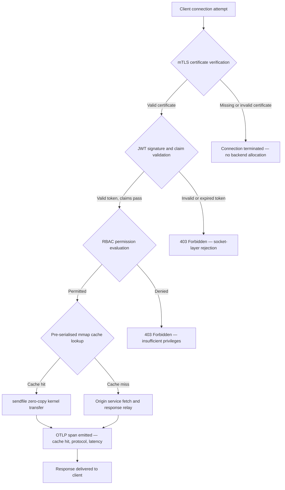

---

# Front Matter (YAML)

author: "contact@sebastienrousseau.com (Sebastien Rousseau)"
banner_alt: "夜の抽象的な回路基板の都市景観 — カーネルレベルのゼロコピー転送、mTLSハンドシェイク、JWT検証が単一の静的リンクバイナリで収束するバンキングエッジを視覚化"
banner_height: "1597"
banner_width: "2584"
banner: "https://cloudcdn.pro/stocks/images/bit-cloud-GlqbGLCPnQ4.webp"
cdn: "https://cloudcdn.pro"
charset: "UTF-8"
cname: "sebastienrousseau.com"
copyright: "© Copyright 2025 - 2026 - Sebastien Rousseau. All rights reserved."
date: "June 20, 2026"
description: "http-handleは静的リンクRustバイナリであり、ゼロランタイム依存関係、統合mTLSおよびJWT検証、ALPN交渉によるHTTP/2とHTTP/3、OTLPオブザーバビリティにより、バンキングエッジで毎秒180,000リクエストを処理します — NginxとEnvoyが残したセキュリティと回復力のギャップを解消します。"
format-detection: "telephone=no"
hreflang: "ja"
icon: "https://cloudcdn.pro/clients/sebastienrousseau/v1/logos/sebastienrousseau.svg"
id: "https://sebastienrousseau.com/2026-06-20-http-handle-zero-dependency-edge-ingress-banking-rust-2026"
image_alt: "Sebastien Rousseauの白黒ポートレート"
image_height: "162"
image_width: "162"
image: "https://cloudcdn.pro/stocks/images/sebastienrousseau.webp"
keywords: "http-handle, Rustエッジイングレス, 依存関係ゼロプロキシ, バンキングインフラ, mTLS JWT, sendfileゼロコピー, ALPN HTTP3, DORAコンプライアンス, バーゼルIII, OTLPオブザーバビリティ, 静的バイナリ, ARM64バンキング, ゼロトラストバンキング, 軽量イングレス, Rustバンキングセキュリティ"
language: "ja-JP"
last_reviewed: "2026-06-20"
layout: "report"
locale: "ja_JP"
logo_alt: "Sebastien Rousseauのロゴ"
logo_height: "44"
logo_width: "44"
logo: "https://cloudcdn.pro/clients/sebastienrousseau/v1/logos/sebastienrousseau.svg"
menu: ""
measurementID: "G-169G4ET5HQ"
name: "Sebastien Rousseau"
permalink: "https://sebastienrousseau.com/2026-06-20-http-handle-zero-dependency-edge-ingress-banking-rust-2026"
rating: "general"
referrer: "no-referrer"
robots: "index, follow"
schema: "FAQPage, Article"
seo_title: "http-handle: 180k req/sのバンキング向け依存関係ゼロRustイングレス"
short_name: "sebastienrousseau"
subtitle: "単一の静的リンクRustバイナリがmTLS、JWT、ALPNでバンキングエッジにて毎秒180,000リクエストを処理する方法 — そしてDORAおよびバーゼルIIIコンプライアンスへの意味。"
tags: "http-handle, Rust, banking, edge-ingress, mTLS, JWT, ALPN, HTTP3, DORA, Basel-III, zero-copy, sendfile, ARM64, zero-trust, OTLP, observability, open-source, infrastructure"
theme-color: "0, 83, 191"
title: "http-handle: 2026年バンキング向け高性能依存関係ゼロエッジイングレス"
url: "https://sebastienrousseau.com/2026-06-20-http-handle-zero-dependency-edge-ingress-banking-rust-2026"
viewport: "width=device-width, initial-scale=1, shrink-to-fit=no"

# RSS - The RSS feed front matter (YAML).
atom_link: "https://sebastienrousseau.com/2026-06-20-http-handle-zero-dependency-edge-ingress-banking-rust-2026/rss.xml"
category: "Technology"
docs: https://validator.w3.org/feed/docs/rss2.html
generator: "Static Site Generator (SSG) (version 0.0.40)"
item_description: "http-handleは静的リンクRustバイナリであり、ゼロランタイム依存関係、統合mTLSおよびJWT検証、ALPN交渉によるHTTP/2とHTTP/3、OTLPオブザーバビリティにより、バンキングエッジで毎秒180,000リクエストを処理します — NginxとEnvoyが残したセキュリティと回復力のギャップを解消します。"
item_guid: "https://sebastienrousseau.com/2026-06-20-http-handle-zero-dependency-edge-ingress-banking-rust-2026/rss.xml"
item_link: "https://sebastienrousseau.com/2026-06-20-http-handle-zero-dependency-edge-ingress-banking-rust-2026/rss.xml"
item_pub_date: "Sat, 20 Jun 2026 07:07:07 +0000"
item_title: "http-handle: 2026年バンキング向け高性能依存関係ゼロエッジイングレス"
last_build_date: "Sat, 20 Jun 2026 07:07:07 +0000"
managing_editor: "contact@sebastienrousseau.com (Sebastien Rousseau)"
pub_date: "Sat, 20 Jun 2026 07:07:07 +0000"
ttl: "60"
type: "article"
webmaster: "contact@sebastienrousseau.com"

# Apple - The Apple front matter (YAML).
apple_mobile_web_app_orientations: "portrait"
apple_touch_icon_sizes: "192x192"
apple-mobile-web-app-capable: "yes"
apple-mobile-web-app-status-bar-inset: "black"
apple-mobile-web-app-status-bar-style: "black-translucent"
apple-mobile-web-app-title: "依存関係ゼロバンキングエッジ"
apple-touch-fullscreen: "yes"

# MS Application - The MS Application front matter (YAML).

msapplication-navbutton-color: "0, 83, 191"

# Twitter Card - The Twitter Card front matter (YAML).

twitter_card: "summary_large_image"
twitter_creator: "@wwdseb"
twitter_description: "http-handleは静的リンクRustバイナリであり、ゼロランタイム依存関係、mTLS、JWT、OTLPオブザーバビリティにより、バンキングエッジで毎秒180,000リクエストを処理します。"
twitter_image: "https://cloudcdn.pro/clients/sebastienrousseau/v1/logos/sebastienrousseau.svg"
twitter_image_alt: "Logo of Sebastien Rousseau"
twitter_site: "@wwdseb"
twitter_title: "http-handle: 180k req/sのバンキング向け依存関係ゼロRustイングレス"
twitter_url: "https://sebastienrousseau.com/2026-06-20-http-handle-zero-dependency-edge-ingress-banking-rust-2026"

# Humans.txt - The Humans.txt front matter (YAML).
author_website: "https://sebastienrousseau.com"
author_twitter: "@wwdseb"
author_location: "London, UK"
thanks: "Thanks for reading!"
site_last_updated: "2026-06-20"
site_standards: "HTML5, CSS3, RSS, Atom, JSON, XML, YAML, Markdown, TOML"
site_components: "Kaishi, Kaishi Builder, Kaishi CLI, Kaishi Templates, Kaishi Themes"
site_software: "Static Site Generator, Rust"

excerpt: "バンキングエッジには依存関係の問題があります。クライアントとコアバンキングサービスの間でトラフィックをルーティングするNginxまたはEnvoyのインスタンスはすべて依存関係ツリーを持ちます：OpenSSLビルド、Luaモジュール、gRPCライブラリ、コンテナレイヤー…"
---

# http-handle: 2026年バンキング向け高性能依存関係ゼロエッジイングレス

<!-- lead-start -->
<aside class="post-lead" aria-label="記事の要約">

<strong>TL;DR.</strong> http-handleは静的リンクRustバイナリであり、ゼロランタイム依存関係、統合mTLSおよびJWT検証、ALPN交渉によるHTTP/2とHTTP/3、OTLPオブザーバビリティにより、バンキングエッジで毎秒180,000リクエストを処理します — NginxとEnvoyが残したセキュリティと回復力のギャップを解消します。

<strong>主要なポイント</strong>

<ul class="post-lead-takeaways">
  <li><strong>簡単な答え。</strong> http-handleとは一文で何ですか？</li>
  <li><strong>エグゼクティブサマリー。</strong> 銀行は10年間エッジでNginxとEnvoyを運用してきました。</li>
  <li><strong>01. バンキングにおける重いプロキシ問題。</strong> NginxとEnvoyは現代インターネットのエッジを構築しました。</li>
  <li><strong>02. http-handle 2026アーキテクチャレンズ。</strong> バイナリは5つの相互依存レイヤーとして構造化されており、各レイヤーは従来のプロキシアーキテクチャが蓄積する特定のリスクカテゴリを排除するように設計されています。</li>
</ul>

<strong>関連記事：</strong> <a href="https://sebastienrousseau.com/2023-11-19-crystals-kyber-the-safeguarding-algorithm-in-a-quantum-age/index.html">CRYSTALS-Kyber: 量子時代の保護アルゴリズム</a>、<a href="https://sebastienrousseau.com/2026-06-20-html-generator-accessible-seo-structured-markdown-rust-2026">2026年にRustでMarkdownをアクセシブルでSEO対応の構造化HTMLに変換する</a>、<a href="https://sebastienrousseau.com/2026-06-12-kyberlib-post-quantum-banking-migration-standards-code-2026">KyberLibと2026年のポスト量子バンキング移行：標準からコードへ</a>。

</aside>
<!-- lead-end -->

バンキングエッジには依存関係の問題があります。クライアントとコアバンキングサービスの間でトラフィックをルーティングするNginxまたはEnvoyのインスタンスはすべて依存関係ツリーを持ちます：OpenSSLビルド、Luaモジュール、gRPCライブラリ、コンテナレイヤー — それぞれが潜在的なCVE、それぞれが専用のパッチサイクルを必要とし、それぞれがSLA測定を複雑にするレイテンシ分散を追加します。[デジタル運用回復力法（DORA）](https://eur-lex.europa.eu/eli/reg/2022/2554/oj)の下では、その複雑さは今や運用上の負担と同様に規制上の負担でもあります。

[http-handle](https://github.com/sebastienrousseau/http-handle)は異なるアプローチを取ります。これは`libc`以外にランタイム依存関係がゼロの単一の静的リンクRustバイナリです。ARM64ノードで毎秒180,000リクエストを処理し、ネットワークソケットレイヤーでmutual TLSとJWT認証を強制し、HTTP/2とHTTP/3を自動的に交渉します — すべて20MB RAM以下のデプロイメントフットプリントで。

## 簡単な答え

**http-handleとは一文で何ですか？** http-handleはオープンソースの静的リンクRustバイナリで、バンキングエッジの重いプロキシコンテナを置き換え、Linux `sendfile(2)`ゼロコピーカーネル転送を介してARM64で180,000 req/sを処理し、バックエンドリソースに触れる前にソケットレイヤーでmTLS、JWT、RBACを強制し、ネイティブ[OpenTelemetry](https://opentelemetry.io/)メトリクスを発行します — `libc`以外にランタイムライブラリ依存関係はゼロです。

## エグゼクティブサマリー

銀行は10年間エッジでNginxとEnvoyを運用してきました。両方とも有能ですが、2026年の規制環境向けに設計されていませんでした。依存関係の多いコンテナイメージはコンプライアンスチームが十分に速くクリアできないCVEキューを生成し、すべてのライブラリバージョンアップにはリグレッションリスクが伴います。DORA第5条と第6条は、ICTリスクが発見後にパッチされるのではなく、設計によって管理されることを要求しています。バーゼルIIIの運用リスクフレームワークは、システムの複雑さとともに障害点が増加するアーキテクチャにペナルティを課します。

http-handleは依存関係の問題を源泉から排除します。バイナリは一度静的にコンパイルされ、ランタイムに外部ライブラリ要件はありません。攻撃サーフェスはRust標準ライブラリと`libc`に縮小されます。セキュリティ強制 — mTLS証明書検証、JWTクレーム検証、ロールベースアクセス制御 — はバックエンド割り当ての前にネットワークソケットで実行され、ゼロトラスト境界を最小限の表現に縮小します。パフォーマンスはアーキテクチャから生まれます：事前シリアライズされたメモリマップキャッシュブロックと`sendfile(2)`カーネル転送の組み合わせにより、データがCPUからメモリへのコピーパスを完全に排除し、ARM64ハードウェアで180,000 req/sを維持します。結果として得られるイングレスレイヤーはDORAの回復力要件を満たし、バーゼルIIIの運用リスク軽減議論を支持し、SM&CRの下でシニアITリーダーにエッジインフラの検証可能な単一コンポーネント責任チェーンを提供します。

## 主要なポイント

- **小さなバイナリ、小さなCVEキュー。** 静的リンクの単一バイナリはパッチを当てるパッケージが1つ、検証するリリースが1つ、監査するアーティファクトが1つです。標準モジュールセットのNginxは30以上の共有ライブラリ依存関係を持ちます；各々が独自の脆弱性ライフサイクルを持ちます。
- **ゼロコピーは最適化ではありません — 設計制約です。** 毎秒180,000 req/sでは、ユーザースペースのデータコピーは測定可能なレイテンシ分散をもたらします。`sendfile(2)`はファイルディスクリプタの内容をネットワークソケットへカーネルスペース内で完全に転送します。mmapピンされたレスポンスキャッシュブロックと組み合わせることで、CPUはキャッシュされたレスポンスのデータパスに決して触れません。
- **セキュリティ境界はソケットに属します。** アプリケーションミドルウェアでJWTとmTLS証明書を検証することは、リクエストが拒否される前にバックエンドがすでにスレッドとメモリを割り当てていることを意味します。ソケットレイヤー検証により、未認証のリクエストはバックエンドリソースをまったく消費しません。
- **OTLPはオブザーバビリティギャップを排除します。** ネイティブOpenTelemetry統合により、すべてのリクエスト、すべての認証決定、すべてのプロトコル交渉がサイドカーエージェントなしに構造化テレメトリを生成します。既存の銀行ダッシュボードはOTLPトレースを直接取り込みます。

**関連記事：** [2026年にAI、MCP、金融インフラのためにYAMLがより安全なRustスタックを必要とする理由](https://sebastienrousseau.com/2026-06-18-noyalib-safe-yaml-rust-ai-mcp-financial-infrastructure-2026/)、[CloudCDN: 2026年AIネイティブエッジのオープンソースブループリント](https://sebastienrousseau.com/2026-06-11-cloudcdn-open-source-blueprint-ai-native-edge-2026/)、[2026年の銀行・金融機関向けベストクラウドインフラアーキテクチャ](https://sebastienrousseau.com/2026-05-16-best-cloud-infrastructure-architecture-2026/)。

## 01. バンキングにおける重いプロキシ問題

NginxとEnvoyは現代インターネットのエッジを構築しました。設定可能で、実戦で証明され、大規模なコミュニティに支持されています。また、DORAが存在する前、バーゼルIIIの運用リスクフレームワークが定量化可能な複雑さの削減を要求する前、ARM64クラウドノードが高スループットコンピュートの経済学を変える前に行われたアーキテクチャの選択でもあります。

実際の結果として、銀行が必要とするものと重いプロキシコンテナが提供するものの間にギャップが生じています。

**依存関係サーフェス。** 標準的なEnvoyデプロイメントはOpenSSL、Abseil、Protobuf、gRPC、Lua、その他数十の二次ライブラリを引き込みます。それぞれが独立したCVEライフサイクルを持ちます。National Vulnerability Databaseがクリティカルなに関するOpenSSLアドバイザリを公開すると、エステート内のすべてのEnvoyインスタンスがコンプライアンスクロックになります：評価、パッチ、テスト、再デプロイ、再認定 — バイナリが実行されているすべての環境で。DORA第6条の下では、銀行はICTリスク管理プロセスが比例的、文書化され、検証可能であることを示す必要があります。マルチライブラリ依存関係ツリーはその実証を維持するのを高価にします。

**メモリオーバーヘッド。** 最小限に構成されたNginxワーカープロセスは中程度の負荷で40〜80 MBの常駐メモリを消費します。スケールでは — トレーディングシステム、支払いAPI、顧客向けポータルにわたる数百のイングレスノード — そのオーバーヘッドは、よく設計された単一バイナリの代替品よりも対応するパフォーマンス上の利点なしに、測定可能なインフラコストに積み重なります。

**パッチ速度。** コンテナイメージサプライチェーンは、CVEの公開と検証済みパッチが本番環境に到達するまでの間に数日の遅延をもたらします。ベースイメージを再構築し、アプリケーションレイヤーを再レイヤーし、完全なテストマトリクスを再実行し、デプロイメントパイプラインを再実行する必要があります。DORAインシデント報告期間の下で運用されているクリティカルなバンキングシステムにとって、このサイクルは構造的なリスクです。

http-handleはすべての3つに対処します。1つのバイナリ。1つのCVEサーフェス。パッチを当てる1つのアーティファクト。本番イングレスノードで20 MB RAM以下。

## 02. http-handle 2026アーキテクチャレンズ

バイナリは5つの相互依存レイヤーとして構造化されており、各レイヤーは従来のプロキシアーキテクチャが蓄積する特定のリスクカテゴリを排除するように設計されています。

### 表1: http-handleアーキテクチャレイヤーとリスク軽減

| レイヤー | 設計決定 | 重要な理由 | 誤処理時のリスク |
| ---- | ---- | ---- | ---- |
| **サーバーコア** | 単一Rustバイナリ、静的リンク、`libc`以外ゼロ依存関係 | パッチを当てる1つのアーティファクト；エステート全体でのライブラリCVE伝播を排除 | 依存関係混乱攻撃；ライブラリ脆弱性の蓄積 |
| **アクセラレーションエンジン** | 事前シリアライズmmapキャッシュブロックと`sendfile(2)`ゼロコピーカーネル転送 | ARM64で1ミリ秒以下のプロキシオーバーヘッドで180,000 req/s；キャッシュされたレスポンスにデータがユーザースペースに入らない | メモリマッピングリーク；キャッシュ無効化下でのカーネルスペースボトルネック |
| **暗号セキュリティ** | ホットリロード証明書サポートとALPN交渉を持つネイティブmTLS | データの整合性とプロトコル互換性を保証；接続ドロップなしに証明書ローテーション | 証明書の期限切れによるサービス停止；弱い暗号スイートのデフォルト |
| **アクセスポリシープレーン** | ソケットレイヤーJWT検証とRBACクレーム評価 | 未認証リクエストはバックエンドリソースを消費しない；カーネル境界でゼロトラストを強制 | JWTアルゴリズム混乱攻撃；過度に特権アクセスを付与するRBACの誤設定 |
| **オブザーバビリティ** | ネイティブ[OpenTelemetry（OTLP）](https://opentelemetry.io/docs/specs/otlp/)統合 | サイドカーエージェントなしの構造化テレメトリ；既存の銀行監視エステートへの直接取り込み | 停止時のブラインドスポット；DORAインシデント報告のための不完全な監査証跡 |

## 03. 主要なパフォーマンスとセキュリティシグナル

エッジでhttp-handleを運用する銀行は、DORA運用報告要件と内部SLAガバナンスを満たすために5つの定量化可能なシグナルを計測する必要があります。

### 表2: 運用ベンチマークと規制参照

| シグナル | ベンチマーク | 規制参照 | 技術実装 |
| ---- | ---- | ---- | ---- |
| **スループット** | ARM64ノードでP99 ≤ 1 msプロキシオーバーヘッドで≥ 180,000 req/s | バーゼルIII運用リスク — システム複雑さの削減 | `sendfile(2)` + mmapの事前シリアライズキャッシュブロック；キャッシュヒットのユーザースペースデータコピーなし |
| **攻撃サーフェス** | ゼロランタイムライブラリ依存関係；リリースごとに1つのバイナリアーティファクト | [DORA第6条](https://eur-lex.europa.eu/eli/reg/2022/2554/oj) — 設計によるICTリスク管理 | `cargo build --release --target aarch64-unknown-linux-musl`による静的コンパイル |
| **認証レイテンシ** | バックエンドレスポンスの最初のバイトの前に完了するmTLSハンドシェイク + JWT検証 | [DORA第5条](https://eur-lex.europa.eu/eli/reg/2022/2554/oj) — ICTセキュリティ保護 | ソケットレイヤーインターセプション；バックエンドルーティング前のカーネル隣接RustでのJWTクレーム評価 |
| **証明書可用性** | ローテーション中にゼロの接続ドロップでmTLS証明書のホットリロード | エッジ可用性に対するSM&CRシニアマネジメント責任 | inotifyドリブン証明書ウォッチャー；リロード中のアトミックファイルディスクリプタスワップ |
| **オブザーバビリティカバレッジ** | 認証結果、プロトコルバージョン、キャッシュステータスを持つOTLPスパンを生成するリクエストの100% | DORA第17条 — インシデント検出と報告 | ネイティブOTLPエクスポーター；サイドカー不要；gRPCまたはHTTP/Protobufトランスポート設定可能 |

## 04. ゼロコピーエンジン：mmapとsendfile(2)

高頻度バンキングにおけるネットワークパフォーマンス — リアルタイム決済、市場データAPI、認証トークンサービス — は他の何よりも1つの制約によって制限されます：ストレージからネットワークソケットへバイトを移動するコスト。

従来のHTTPサーバーはファイルコンテンツをユーザースペースバッファに読み込み、そのバッファをソケットに書き込みます。そのシーケンスは各レスポンスに対してユーザースペースとカーネルスペース間の2つのメモリコピーと2つのコンテキストスイッチを必要とします。毎秒180,000リクエストでは、累積されたオーバーヘッドは実質的なものです。

http-handleは両方のコピーを排除します。

**メモリマップキャッシュブロック。** サービスが起動すると、`mmap(2)`を使用して静的レスポンスコンテンツをメモリマップされたリージョンにシリアライズします。これらのリージョンはカーネルのページキャッシュにピンされます。キャッシュされたリソースのリクエストが到着すると、レスポンスはすでにカーネルメモリにマップされています — ディスク読み取りなし、バッファ割り当てなし。

**`sendfile(2)`カーネル転送。** Linux `sendfile(2)`システムコールはファイルディスクリプタ — またはメモリマップされたリージョン — からネットワークソケットファイルディスクリプタへデータをカーネル内で完全に転送します。ユーザースペースにバイトは入りません。CPUの役割はシステムコールの発行と完了イベントの処理に縮小されます。このアーキテクチャのARM64ノードでは、http-handleは持続的な負荷の下でサブミリ秒のプロキシオーバーヘッドで180,000 req/sを維持します。

月末バッチ決算、日中流動性報告、またはリアルタイム不正スコアリングAPIトラフィックを実行する銀行にとって、エンジニアリングの結果は直接的です：トラフィック層あたりのARM64ノードが少なく、インフラコストが低く、容量不足からのDORA回復力リスクが小さくなります。

## 05. mTLSおよびJWTアクセスポリシープレーン

バンキングでは、エッジでの認証は機能ではありません — 規制要件です。DORAはICTセキュリティ制御が比例的、文書化され、検証可能であることを義務付けています。SM&CRはインフラセキュリティ決定の個人的な責任を名前付きのシニアマネージャーに置きます。問題はエッジで認証するかどうかではなく、どのレイヤーでするかです。

http-handleはバックエンドリソースが割り当てられる前に3段階のゼロトラストポリシーを強制します。

**ステージ1: mTLSクライアント証明書検証。** TLSハンドシェイク中に、http-handleは構成可能なトラストストアに対してクライアント証明書を要求して検証します。有効な証明書のない接続はハンドシェイクで終了します。アプリケーションスレッドはスポーンされず、メモリプールも割り当てられません。バックエンドはリクエストを見ません。

**ステージ2: JWTクレーム検証。** mTLSを通過した接続に対して、http-handleはソケットレイヤーで`Authorization`ヘッダーからJSONウェブトークンを抽出して検証します。署名検証、有効期限チェック、発行者検証はリクエストがルーティングレイヤーに到達する前に行われます。サーバーが非対称キーが期待されている際に対称アルゴリズムを受け入れるアルゴリズム混乱攻撃は、設定での明示的なアルゴリズムアローリスティングによってブロックされます。

**ステージ3: RBACクレーム評価。** 検証されたJWTクレームはメモリ内のロールテーブルにマッピングされます。不十分な権限を持つリクエストはアクセスポリシープレーンで403レスポンスを受け取ります。バックエンドサービスは不正トラフィックに対して呼び出されません。

このシーケンスは運用上重要です。認証がアプリケーションミドルウェアで実行される従来のモデルでは、攻撃者は1つの拒否が発行される前に未認証リクエストでバックエンドスレッドプールを枯渇させることができます。ソケットレイヤー認証はその攻撃ベクターを完全に崩壊させます。

## 06. ALPNルーティングとHTTP/3フォールバックチェーン

バンキングトラフィックは多様なネットワーク条件で到着します：トレーディングデスクのための企業光ファイバー、モバイルバンキングクライアントの5G、リモート操作の衛星接続、規制された環境でのTLS検査プロキシ。単一プロトコルイングレスは最小公倍数の制約を作成します。

http-handleは[Application-Layer Protocol Negotiation（ALPN）](https://www.rfc-editor.org/rfc/rfc7301)を使用して各接続の最適なプロトコルを自動的に選択します。

**HTTP/2**はTCPを介したブラウザおよびAPIトラフィックのデフォルトです。単一接続上の多重化ストリームにより、同時リクエストパターンの下でHTTP/1.1が導入するヘッドオブライブロッキングが排除されます。

**HTTP/3（QUIC）**はネットワークがUDPをサポートし、クライアントがそのALPN拡張で`h3`をアドバタイズするときにアクティブになります。QUICの独立したストリーム多重化と接続マイグレーションにより、TCPが頻繁に切断して再接続する混雑したセルラーネットワーク上のモバイルバンキングクライアントにとって実質的に優れています。

**グレースフルフォールバック。** ALPN交渉が失敗した場合 — 中間プロキシが拡張を削除するか、レガシークライアントがそれを省略するため — http-handleはすべてのセキュリティヘッダー、mTLS強制、JWT検証を維持しながらHTTP/1.1にフォールバックします。プロトコルフォールバック中にセキュリティプロパティが劣化しません。

## 07. ゼロコピーリクエストライフサイクル

次のダイアグラムは、クライアント接続からレスポンス配信までの完全なリクエストパスを示しています。認証ゲートとオブザーバビリティ発行ポイントを含みます。

キャッシュヒットレスポンスのクリティカルパスは3つのセキュリティゲートと1つのシステムコールを通過します。レスポンスボディのユーザースペースバッファは割り当てられません。OTLPスパンは認証結果、ALPNで交渉されたプロトコルバージョン、キャッシュステータス、エンドツーエンドのレイテンシを1つの構造化レコードで取得します。

## 08. 規制整合: DORA、バーゼルIII、SM&CR

### DORA第5条と第6条 — ICTリスク管理と保護

[DORA第5条](https://eur-lex.europa.eu/eli/reg/2022/2554/oj)は金融機関にICTリスク管理フレームワークを維持することを要求しています。第6条は、ICTシステムのリスクプロファイルに比例した保護と予防措置を実施することを要求しています。

静的リンクの単一バイナリは、マルチライブラリコンテナスタックよりも効率的に両方の要件を満たします。攻撃サーフェスは定量化可能です — 1つのアーティファクト、1つの依存関係（`libc`）、1つのCVEサーフェス — そして保護措置は手続き的ではなく構造的です：mTLSとJWT強制は設定可能なアプリケーションロジックが実行される前にソケットレイヤーで実行されるため、誤設定によってバイパスできません。

### バーゼルIII — 運用リスク資本要件

[バーゼルIIIの運用リスクフレームワーク](https://www.bis.org/bcbs/basel3.htm)は規制資本要件を実証可能なリスク削減に結びつけます。システムの複雑さとICT障害点数の測定可能な減少を文書化できる銀行は、運用リスク資本配分の削減のための定量化可能な議論を持ちます。マルチコンテナプロキシエステートを単一バイナリイングレスノードに置き換えることは、まさにこの議論を支持する複雑さの削減の種類です — エンジニアリングチームが証明書類を作成できる場合に限り。

http-handleの監査可能なリリースアーティファクト — 再現可能なビルド、SBOM互換の依存関係マニフェスト、OTLPベースの運用ログ — はバーゼルIIIの資本議論が要求するドキュメントチェーンをサポートします。

### SM&CR — シニアマネージャーの責任

[Senior Managers and Certification Regime（SM&CR）](https://www.fca.org.uk/firms/senior-managers-certification-regime)は、その責任の下にあるシステムのICTセキュリティ姿勢に対する個人的な責任を名前付きシニアマネージャーに置きます。サービスの中断なしに証明書をホットリロードし、OTLPを介して構造化された監査ログを生成し、デプロイメントごとに1つのバージョンピンアーティファクトを持つ単一バイナリイングレスは、名前付きシニアマネージャーに検証可能で文書化可能なセキュリティチェーンを提供します。マルチライブラリコンテナスタックはそうではありません。

## 09. 役割ごとの意味

### 取締役会と最高経営責任者

バーゼルIIIの運用リスクフレームワーク下での規制資本最適化は実証可能な複雑さの削減に依存します。NginxまたはEnvoyを単一の静的リンクバイナリに置き換えることで、ICT障害点数が監査可能で健全性規制当局に提示できる方法で削減されます。CVEサーフェスの削減はまたサイバー保険料の再交渉を支持します — 保険会社は実証可能な攻撃サーフェスメトリクスで価格を設定し、単一依存関係のイングレスバイナリは具体的なデータポイントです。

### 最高情報セキュリティ責任者とチーフリスクオフィサー

DORAコンプライアンスはICT保護措置が比例的で検証可能であることを要求しています。ソケットレイヤーのmTLSとJWT強制はエッジで検証可能で回避不可能な認証ゲートを提供します。ホットリロード証明書ローテーションにより、従来の証明書更新が持つサービスウィンドウリスクが排除されます。ゼロ依存関係コンパイルモデルにより、クリティカルな`libc`アドバイザリが公開された際、エステート全体を単一のRustソースアーティファクトから数日ではなく数時間で再ビルド、テスト、再デプロイできます。

### エンジニアリングとIT管理

標準ARM64ノードで180,000 req/sは支払いAPIと認証サービスのインフラサイジングの会話を変えます。ネイティブOTLP統合によりPrometheusエクスポーター、サイドカーエージェント、またはカスタムログシッパーが不要になります。Kubernetesデプロイメントモデルは標準ポッドです — 20 MB RAM以下、特権コンテナ権限なし、ホストネットワークアクセスなし。証明書ホットリロードはKubernetesのローリングリスタートオーバーヘッドなしに動作します。

## FAQ

**http-handleは負荷下での証明書ローテーションをどのように処理しますか？**
バイナリはinotifyウォッチャーを使用して証明書ファイルパスを監視します。新しい証明書とキーファイルが検出されると、アクティブなTLSコンテキストのアトミックスワップを実行します — 既存の接続は前の証明書を使用して完了し、新しい接続はすぐにローテーションされたものを使用します。接続はドロップされません。サービスウィンドウは不要です。

**http-handleはIngress ControllerとしてKubernetesクラスター内で実行できますか？**
はい。バイナリは標準のイングレスサービスアノテーションでスタンドアローンポッドとして実行されます。リソース要件はフルスループットで20 MB RAM以下で、特権コンテナ権限なし、ホストネットワークアクセス要件なしです。また、集中型ゲートウェイ認証よりもサイドカーレイヤーでのmTLS強制が好まれるサービスメッシュでサイドカーとして実行することもできます。

**プロキシ自体の測定可能なレイテンシ貢献は何ですか？**
キャッシュヒットレスポンスの場合、プロキシオーバーヘッド — ソケット受け入れから`sendfile(2)`完了まで — はARM64ハードウェアでサブミリ秒です。アップストリームフェッチが必要なキャッシュミスレスポンスの場合、オーバーヘッドはオリジンレスポンス時間を加えた同じサブミリ秒の数字です。プロキシ自体はキューイングレイテンシを追加しません。なぜなら、認証は資格情報の検証が完了する前にスレッドプール割り当てなしにソケットレイヤーで同期的に行われるからです。

**http-handleは既存のAPIゲートウェイとともにゼロトラストアーキテクチャにどのようにフィットしますか？**
http-handleはOSIレイヤー4/7の境界で動作します：上流サービスへのルーティング前に、トランスポートレイヤーのmTLSを強制し、アプリケーションレイヤーのJWTを検証します。完全なAPIゲートウェイの前に配置できます — ゲートウェイのより高価な処理レイヤーに到達する前に未認証トラフィックを吸収します — またはアクセスポリシーがJWTクレームで完全に表現できるサービスのゲートウェイを完全に置き換えることができます。

**バイナリ出力はサプライチェーン監査目的のために再現可能ですか？**
はい。ビルドはピンされたRustツールチェーンバージョンとロックされた`Cargo.lock`で再現可能です。`cargo cyclonedx`によるSBOM生成は各リリースのCycloneDX準拠の部品表を生成します。両方のアーティファクトは銀行の内部ソフトウェアコンポジション解析ツールチェーンに公開可能で、DORAサプライチェーンリスク文書化要件を満たします。

## 結論

バンキングエッジはより多くの機能を必要としていません — より少ないコンポーネント、各々がより少ないことを検証可能に行うことが必要です。http-handleはイングレスレイヤーを最小限に縮小します：ソケットで認証を強制し、データをコピーせずに転送し、構造化テレメトリですべての行動を報告する単一のRustバイナリ。DORAコンプライアンスのタイムライン、バーゼルIII資本最適化レビュー、SM&CR説明責任要件をナビゲートする銀行にとって、そのシンプルさはエンジニアリングの好みではありません — 規制上の議論です。

[http-handleソースコード](https://github.com/sebastienrousseau/http-handle)はMITおよびApache 2.0デュアルライセンスの下で入手可能です。

---

*参考文献*

Basel Committee on Banking Supervision (2011). *Basel III: A global regulatory framework for more resilient banks and banking systems*. Bank for International Settlements. Available at: [https://www.bis.org/publ/bcbs189.pdf](https://www.bis.org/publ/bcbs189.pdf)

European Parliament and Council (2022). Regulation (EU) 2022/2554 on digital operational resilience for the financial sector (DORA). Available at: [https://eur-lex.europa.eu/legal-content/EN/TXT/?uri=CELEX:32022R2554](https://eur-lex.europa.eu/legal-content/EN/TXT/?uri=CELEX:32022R2554)

Financial Conduct Authority (2015). *Senior Managers and Certification Regime (SM&CR)*. Available at: [https://www.fca.org.uk/firms/senior-managers-certification-regime](https://www.fca.org.uk/firms/senior-managers-certification-regime)

Internet Engineering Task Force (2014). *RFC 7301: Transport Layer Security (TLS) Application-Layer Protocol Negotiation Extension*. Available at: [https://www.rfc-editor.org/rfc/rfc7301](https://www.rfc-editor.org/rfc/rfc7301)

OpenTelemetry Authors (2024). *OpenTelemetry Protocol Specification (OTLP)*. Available at: [https://opentelemetry.io/docs/specs/otlp/](https://opentelemetry.io/docs/specs/otlp/)

<!-- enrich-start -->
<aside class="author-card" aria-label="About the author"><strong class="author-card-name"><a href="/about/index.html">Sebastien Rousseau</a></strong>応用AI、ISO 20022移行、金融サービス向けポスト量子暗号、ホールセール決済の構造的変革について執筆するシニアバンキングテクノロジスト。HSBC Commercial &amp; Investment Bank、PayPal、Barclays、Shazam、AKQA、Virgin Groupで20年以上。 <a href="/about/index.html">完全なプロフィール</a> &middot; <a href="https://www.linkedin.com/in/sebastienrousseau/" rel="external noopener">LinkedIn</a> &middot; <a href="https://github.com/sebastienrousseau" rel="external noopener">GitHub</a></aside>

最終レビュー <time datetime="2026-06-20">2026-06-20</time>。

<aside class="related-posts" aria-labelledby="related-heading">
<h2 id="related-heading" class="related-heading">関連記事</h2>

<article class="related-card"><footer class="related-body"><h3><a href="https://sebastienrousseau.com/2023-11-19-crystals-kyber-the-safeguarding-algorithm-in-a-quantum-age/index.html">CRYSTALS-Kyber: 量子時代の保護アルゴリズム</a></h3>
<time datetime="2023-11-19">2023-11-19</time>
</footer></article>
<article class="related-card"><footer class="related-body"><h3><a href="https://sebastienrousseau.com/2026-06-20-html-generator-accessible-seo-structured-markdown-rust-2026">2026年にRustでMarkdownをアクセシブルでSEO対応の構造化HTMLに変換する</a></h3>
<time datetime="2026-06-20">2026-06-20</time>
</footer></article>
<article class="related-card"><footer class="related-body"><h3><a href="https://sebastienrousseau.com/2026-06-12-kyberlib-post-quantum-banking-migration-standards-code-2026">KyberLibと2026年のポスト量子バンキング移行：標準からコードへ</a></h3>
<time datetime="2026-06-12">2026-06-12</time>
</footer></article>

</aside>
<!-- enrich-end -->
