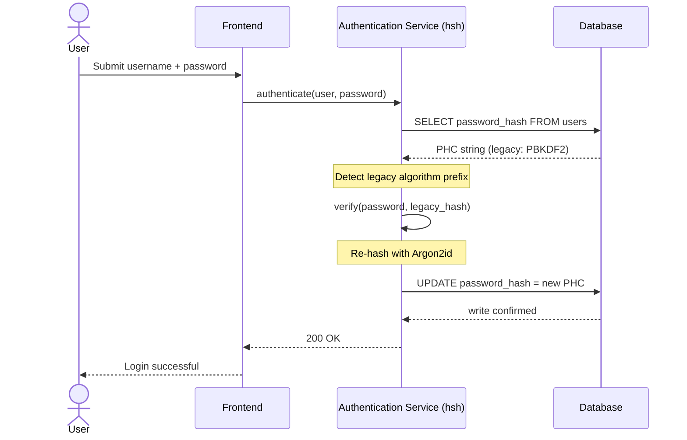
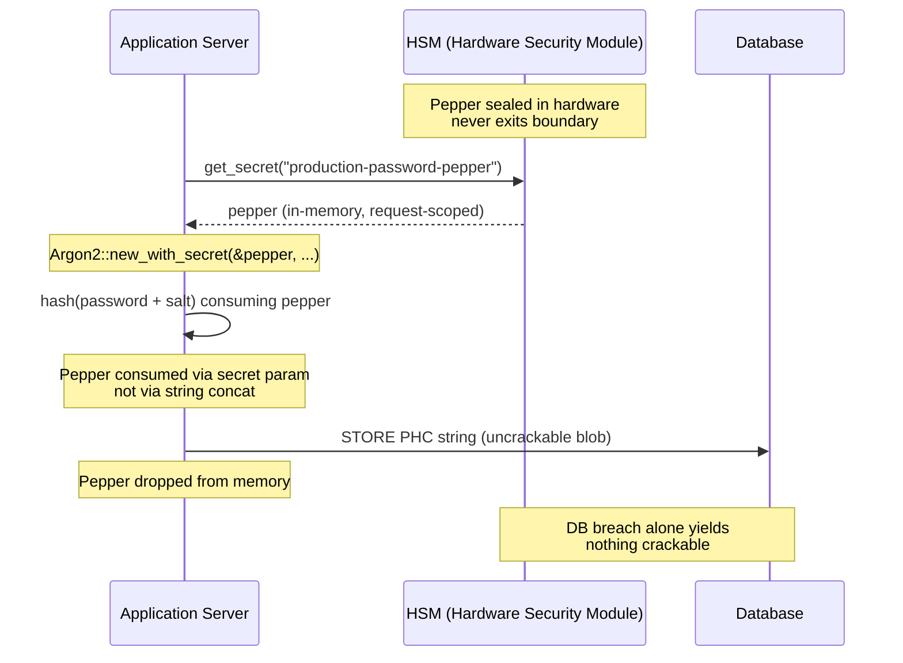

---
# Front Matter (YAML)
author: "contact@sebastienrousseau.com (Sebastien Rousseau)"
banner_alt: "Rust コンパイラ出力をスクロールする開発者ターミナルのクローズアップ — エンタープライズ銀行業の認証基盤の下層にある、メモリ安全で監査可能な暗号サブストレートの可視化された規律"
banner_height: "1597"
banner_width: "2584"
banner: "https://cloudcdn.pro/stocks/images/rustlogs.webp"
cdn: "https://cloudcdn.pro"
charset: "UTF-8"
cname: "sebastienrousseau.com"
copyright: "© Copyright 2025 - 2026 - Sebastien Rousseau. All rights reserved."
date: "2026年6月22日"
description: "hsh は、ティア 1 銀行がレガシーなパスワードハッシュをゼロダウンタイムで Argon2id へ移行することを可能にするピュア Rust の暗号フレームワークで、HSM ペッパリングを統合し、C 由来の FFI メモリ脆弱性を排除して DORA レジリエンス義務に応えます。"
format-detection: "telephone=no"
hreflang: "ja"
icon: "https://cloudcdn.pro/clients/sebastienrousseau/v1/logos/sebastienrousseau.svg"
id: "https://sebastienrousseau.com/2026-06-22-hsh-zero-downtime-cryptographic-stewardship-rust-banking-2026"
image_alt: "セバスチャン・ルソーのモノクロ・ポートレート"
image_height: "162"
image_width: "162"
image: "https://cloudcdn.pro/stocks/images/sebastien-rousseau.png"
keywords: "hsh, Rust 暗号, パスワードハッシュ, Argon2id, 銀行セキュリティ, HSM インターロック, DORA 適合, Basel III, ゼロダウンタイム移行, メモリ安全性, PBKDF2, scrypt, サイバーリカバリ"
language: "ja-JP"
last_reviewed: "2026-06-22"
layout: "report"
locale: "ja_JP"
logo_alt: "セバスチャン・ルソーのロゴ"
logo_height: "44"
logo_width: "44"
logo: "https://cloudcdn.pro/clients/sebastienrousseau/v1/logos/sebastienrousseau.svg"
measurementID: "G-169G4ET5HQ"
name: "Sebastien Rousseau"
permalink: "https://sebastienrousseau.com/2026-06-22-hsh-zero-downtime-cryptographic-stewardship-rust-banking-2026"
rating: "general"
referrer: "no-referrer"
robots: "index, follow"
schema: "FAQPage, Article"
seo_title: "hsh:銀行向け Rust によるゼロダウンタイム暗号運用"
short_name: "sebastienrousseau"
subtitle: "ピュア Rust の暗号フレームワークが、HSM インターロックとともにレガシーパスワードを Argon2id へシームレスにアップグレードする方法 — そして、それが DORA と Basel III 適合に何を意味するか。"
tags: "hsh, Rust, 銀行, 暗号, Argon2id, HSM, DORA, Basel-III, セキュリティ, オープンソース, オペレーショナル・レジリエンス"
theme-color: "0, 83, 191"
title: "エンタープライズ銀行業におけるパスワード管理の保護:hsh によるマルチアルゴリズムハッシュとアップグレード"
url: "https://sebastienrousseau.com/2026-06-22-hsh-zero-downtime-cryptographic-stewardship-rust-banking-2026"
viewport: "width=device-width, initial-scale=1, shrink-to-fit=no"

# RSS
atom_link: "https://sebastienrousseau.com/2026-06-22-hsh-zero-downtime-cryptographic-stewardship-rust-banking-2026/rss.xml"
category: "Technology"
generator: "Static Site Generator (SSG) (version 0.0.40)"
item_description: "hsh は、ティア 1 銀行がレガシーなパスワードハッシュをゼロダウンタイムで Argon2id へ移行することを可能にするピュア Rust の暗号フレームワークで、HSM ペッパリングを統合し、C 由来の FFI メモリ脆弱性を排除して DORA レジリエンス義務に応えます。"
item_pub_date: "Mon, 22 Jun 2026 07:07:07 +0000"
item_title: "エンタープライズ銀行業におけるパスワード管理の保護:hsh によるマルチアルゴリズムハッシュとアップグレード"
pub_date: "Mon, 22 Jun 2026 07:07:07 +0000"
type: "article"

# Twitter Card
twitter_card: "summary_large_image"
twitter_creator: "@wwdseb"
twitter_description: "hsh は、ティア 1 銀行がゼロダウンタイム、HSM インターロック、メモリ安全な Rust で、レガシーなパスワードハッシュを Argon2id へ移行できるようにします。"
twitter_image: "https://cloudcdn.pro/clients/sebastienrousseau/v1/logos/sebastienrousseau.svg"
twitter_title: "hsh:Rust によるゼロダウンタイム暗号運用"
twitter_url: "https://sebastienrousseau.com/2026-06-22-hsh-zero-downtime-cryptographic-stewardship-rust-banking-2026"

excerpt: "GPU 加速による復号と DORA 義務の時代、暗号の劣化はシステミックリスクです。銀行データベースに留まる古い PBKDF2 や scrypt のハッシュはすべて、侵害までのカウントダウンです。hsh は、ゼロダウンタイムでメモリ安全なアップグレードによってその構図を変えます…"

# Added by fix_hsh_frontmatter.py (template completeness)
apple_mobile_web_app_orientations: "portrait"
apple_touch_icon_sizes: "192x192"
apple-mobile-web-app-capable: "yes"
apple-mobile-web-app-status-bar-inset: "black"
apple-mobile-web-app-status-bar-style: "black-translucent"
apple-touch-fullscreen: "yes"
author_location: "London, United Kingdom"
author_twitter: "@wwdseb"
author_website: "https://sebastienrousseau.com"
docs: https://validator.w3.org/feed/docs/rss2.html
item_guid: "https://sebastienrousseau.com/2026-06-22-hsh-zero-downtime-cryptographic-stewardship-rust-banking-2026/rss.xml"
item_link: "https://sebastienrousseau.com/2026-06-22-hsh-zero-downtime-cryptographic-stewardship-rust-banking-2026/rss.xml"
last_build_date: "Mon, 22 Jun 2026 06:06:06 +0000"
managing_editor: "contact@sebastienrousseau.com (Sebastien Rousseau)"
menu: "active"
msapplication-navbutton-color: "0, 83, 191"
site_components: "Kaishi, Kaishi Builder, Kaishi CLI, Kaishi Templates, Kaishi Themes"
site_last_updated: "2023-07-05"
site_software: "Static Site Generator, Rust"
site_standards: "HTML5, CSS3, RSS, Atom, JSON, XML, YAML, Markdown, TOML"
ttl: "60"
twitter_site: "@wwdseb"
webmaster: "contact@sebastienrousseau.com"
apple-mobile-web-app-title: "hsh: Rust password hashing"
thanks: "お読みいただきありがとうございました!"
twitter_image_alt: "セバスチャン・ルソーのモノクロ・ポートレート"
---

# エンタープライズ銀行業におけるパスワード管理の保護:hsh によるマルチアルゴリズムハッシュとアップグレード

<!-- lead-start: manual -->
<aside class="post-lead" aria-label="記事の概要">
<p class="post-lead-tldr"><strong>要旨。</strong> <a href="https://github.com/sebastienrousseau/hsh">hsh</a> は、ティア 1 銀行がレガシーなパスワードハッシュを Argon2id のような現代的な標準へサービス中断なしに移行できるようにする、オープンソースのピュア Rust 暗号フレームワークです。HSM 由来のペッパリングを統合し、C ベースの FFI ラッパーに依存せず厳格なメモリ安全性を強制することで、DORA および Basel III 適合を直接脅かす暗号の劣化脆弱性を塞ぎます。</p>
<p class="post-lead-heading"><strong>主要な要点</strong></p>
<ul class="post-lead-takeaways">
  <li><strong>暗号劣化の問題。</strong>PBKDF2 のようなレガシーアルゴリズムは、ハードウェアの高速化に伴い指数関数的に弱体化し、クレデンシャル・スタッフィングおよびオフライン総当たり攻撃の攻撃面を拡大します。</li>
  <li><strong>ゼロダウンタイム移行。</strong><code>verify_and_upgrade</code> パターンは、標準的なログインイベント中に透過的にユーザークレデンシャルを再ハッシュし、データベース一括移行のオペレーショナルリスクを排除します。</li>
  <li><strong>ハードウェアインターロックとペッパリング。</strong>ハッシュは Hardware Security Module (HSM) またはクラウド KMS アーキテクチャを用いてラップされ、データベース単独の侵害ではクラック可能な候補パスワードが得られないことを保証します。</li>
  <li><strong>規制ベースラインとしてのメモリ安全性。</strong>安全な Rust で全面的に書き直され、厳格な依存関係衛生によって強制されることで、hsh はレガシー C ベースの暗号ライブラリに内在するバッファオーバーフローおよびサプライチェーンリスクを排除します。</li>
</ul>
<p class="post-lead-related"><strong>関連記事:</strong> <a href="https://sebastienrousseau.com/2026-06-20-http-handle-zero-dependency-edge-ingress-banking-rust-2026">http-handle:2026 年銀行業向けの高性能ゼロ依存エッジ・イングレス</a>、<a href="https://sebastienrousseau.com/2026-06-07-autonomous-treasury-index-programmable-liquidity-tokenised-deposits-2026/index.html">2026 年の自律トレジャリー指数</a>。</p>
</aside>
<!-- lead-end -->

> **エグゼクティブサマリー.** 2018 年の脅威モデルに合わせて構築された銀行認証は、もはや 2026 年の規制環境下では目的に適いません。GPU 加速によるクラック、ASIC 密度の向上、そして接近しつつあるポスト量子地平線は、PBKDF2 および初期パラメータの scrypt の安全余裕を消し去り、DORA 第 5 条はその劣化を取締役会レベルで責任を問われる負債へ転化させました。オープンソースのピュア Rust フレームワークである hsh は、この問題を 3 つの層で並行して対処します:メンテナンスウィンドウなしに、ログイン成功のたびに保存済みクレデンシャルを現行 Argon2id パラメータへ再ハッシュする `verify_and_upgrade` ディスパッチャ;データベース単独の侵害ではクラック可能なものを何も得られない HSM または KMS インターロックされたペッパリング層;そして C 由来の暗号ライブラリに内在する外部関数インターフェースの攻撃面を排除する、メモリ安全なサプライチェーン。その結果は、DORA、Basel III のオペレーショナルリスク規律、SM&CR の上級管理者アカウンタビリティ、そして NIST IR 8547 のポスト量子移行地平線を — 認証基盤のアップグレードに歴史的に必要とされた一括リセットプログラムなしに — 満たすサブストレートです。

エンタープライズ銀行業の認証の大半は、いまだ 2018 年の脅威モデルに合わせて堅牢化されたパスワード層の上に立っています。それを破るハードウェアの方は先に進みました。GPU ファームが規模を拡大し、暗号関連量子計算機 (CRQC) が近づくにつれ、レガシーハッシュ — PBKDF2、初期の scrypt — は、攻撃者がオフラインのクラック待ち行列に費やすあらゆる計算時間の中で劣化します。劣化は静かに進行します。本番データベースは、昨日まで強固だったハッシュが今日はもうそうでないことを何も告げません。

[Digital Operational Resilience Act (DORA)](https://eur-lex.europa.eu/eli/reg/2022/2554/oj "規則 (EU) 2022/2554 — デジタル・オペレーショナル・レジリエンス法") の下では、ローテーションされていないレガシーな暗号資産を本番に残すことは、もはや技術的負債ではありません。明示された規制上の責任です。

[hsh](https://github.com/sebastienrousseau/hsh "hsh — ピュア Rust パスワードハッシュフレームワーク") はこの空隙を塞ぎます。ピュア Rust のフレームワークとして、複数のハッシュ形式を並行して管理し、アクティブなログインセッション中に弱いクレデンシャルをその場でアップグレードします。認証インフラは、メンテナンスウィンドウなし、強制リセットなし、1 秒のダウンタイムもなしに、2026 年のレジリエンス義務へ整合します。

## 01. 銀行業における暗号劣化の問題

hsh のようなフレームワークの必要性を理解するには、パスワードハッシュのライフサイクルを理解しなければなりません。アルゴリズムは優雅に老いません。破るために利用可能なハードウェアに対して相対的に劣化します。

**ASIC/GPU 加速ギャップ。**PBKDF2 のようなアルゴリズムは、CPU に対して計算的に高コストであるよう設計されました。今日、攻撃者は高度に並列化された GPU を用いてオフラインの辞書攻撃を実行します。2018 年に生成されたレガシーハッシュは、2026 年の敵対者に対しては大幅に弱いのです。

**ビッグバン型移行のリスク。**CISO が PBKDF2 から Argon2id のようなメモリハードアルゴリズムへのアップグレードを決定する際、ハッシュを逆変換して再暗号化することはできません。従来の解決策 — 数百万のユーザーに対してパスワードリセットを強制する — は、莫大な顧客フリクションとオペレーショナルリスクを引き起こします。

**C ライブラリのサプライチェーン。**歴史的に、銀行ミドルウェアはハッシュ用に `argonautica` のようなライブラリや生の C バインディングに依存してきました。これらのライブラリには隠れたサプライチェーンリスクが潜んでいます。認証モジュール内のたった一つのメモリバッファオーバーフローが、銀行スタックの最も特権的な層でリモートコード実行 (RCE) を招き得ます。

### アルゴリズム比較 — ハードウェア耐性とチューニング面

銀行が移行コーパスで現実的に遭遇する三つのアルゴリズムは、暗号プリミティブの選択というより、ハードウェア圧力下でどのように老いるかという点で違いがあります。下表は実務的な姿勢をまとめたものです。

| Algorithm | メモリハード | GPU / ASIC 耐性 | チューニング面 | 2026 年の状況 |
| ---- | ---- | ---- | ---- | ---- |
| **PBKDF2** | いいえ | 低 — GPU 上でベクトル化され、コモディティハードウェアでは推測あたりサブミリ秒。 | 反復回数のみ。 | レガシー。移行期間中の検証側フォールバックとしてのみ許容。 |
| **scrypt** | はい (中程度) | 中 — メモリコストが単純な GPU ファームを退ける。大規模では ASIC 償却可能。 | `N` (CPU/メモリ)、`r` (ブロックサイズ)、`p` (並列度)。 | グリーンフィールドでは非推奨。移行コーパスでは現役。 |
| **Argon2id** | はい (高) | 高 — メモリハードかつタイムハード。サイドチャネルおよび TMTO 攻撃に耐性。 | メモリコスト (`m`)、時間コスト (`t`)、並列度 (`p`)、シークレット (ペッパー)。 | 推奨デフォルト。OWASP、NIST SP 800-63B-4 ドラフト、FedRAMP。 |

移行計画にとっての要点は明快です。PBKDF2 は*検証側*の状態であって、*書き込み側*の終点ではありません。PBKDF2 レコード上で成功したすべてのログインは、退出時に Argon2id レコードを生成すべきです。

## 02. hsh 2026 アーキテクチャレンズ

このフレームワークは 5 つのコア層にまたがって構成され、それぞれが特定のカテゴリのオペレーショナルリスクを低減するよう設計されています。

### 表 1:hsh アーキテクチャ層とリスク低減

| 層 | 設計上の意思決定 | なぜ重要か | 誤った扱いの場合のリスク |
| ---- | ---- | ---- | ---- |
| **暗号プリミティブ** | Argon2id、scrypt、PBKDF2 をサポートする統一 PHC 文字列形式 | 後方互換性を維持しつつ、GPU 攻撃に対するクラス最高の耐性を提供。 | データサイロ。弱いアルゴリズムが毎秒 1000 億回超のオフライン推測を許容。 |
| **ポリシーエンジン** | `verify_and_upgrade` ディスパッチ | ログイン時に動的にレガシーから現代的ポリシーへの移行を自動化。 | 暗号の劣化。アクティブユーザーが容易にクラックされるレガシーなハッシュタイプに残留。 |
| **ハードウェアインターロック** | HSM およびクラウド KMS「ペッパリング」機能 | データベース単独の侵害が候補パスワードを露出しないことを保証。 | SQL インジェクション侵害後のオフライン総当たり攻撃の成功。 |
| **セキュリティ衛生** | `deny.toml` の強制とピュア Rust | 不安全な FFI と信頼されない外部 C 依存関係を完全に遮断。 | 壊滅的なサプライチェーン攻撃とメモリ破壊系 CVE。 |

## 03. ゼロダウンタイムの再ハッシュ経路

`verify_and_upgrade` パターンは、データベースのダウンタイムをゼロにしたまま、状態認識型のインテリジェントなディスパッチシステムを通じてデータ移行を解決します。

ユーザーがクレデンシャルを送信すると、hsh は保存された Password Hashing Competition (PHC) 文字列を読み取ります。それがレガシーハッシュ (例:時代遅れの PBKDF2 構成) を含む場合、システムは以下のフローを実行します。

1. **識別:**レガシーアルゴリズムとその固有パラメータをパースします。
2. **検証:**候補パスワードをレガシーハッシュに対して検証します。
3. **リアルタイムアップグレード:**マッチが成功すると、メモリ内の平文候補パスワードを取得し、ただちに高度に安全な Argon2id ポリシーで新しいハッシュを計算します。
4. **永続化:**新しい PHC 文字列を銀行アプリケーションへ返却し、アプリケーションがデータベース内のレガシーレコードを上書きします。

このプロセスはエンドユーザーに対して完全に透過的です。最もアクティブなアカウントを初日に最高セキュリティ層へ効果的に移行し、銀行の攻撃面を時間とともに有機的かつ劇的に縮小します。

以下のシーケンスは、保存されたレコードがレガシーアルゴリズム上にある状態で単一のログインイベントが発生したときに何が起きるかを示しています。ユーザーには何の変化も見えませんが、銀行の認証基盤はレコード 1 件分だけ強化されます。



### 実装パターン — `verify_and_upgrade` ディスパッチ

認証サービス内部での統合面は小さく済みます。レガシーのコード経路はフォールバックとしてそのまま残り、新しいコード経路がディスパッチャとして機能します。

```rust
use hsh::{Hasher, UpgradeResult};

struct UserRecord {
    username: String,
    password_hash: String, // PHC string
}

async fn authenticate(user: UserRecord, password_attempt: &str) -> Result<bool, AuthError> {
    let hasher = Hasher::new();
    match hasher.verify_and_upgrade(password_attempt, &user.password_hash) {
        Ok(UpgradeResult::Verified(is_valid)) => Ok(is_valid),
        Ok(UpgradeResult::Upgraded(new_hash)) => {
            db::update_user_hash(&user.username, new_hash).await?;
            Ok(true)
        }
        Err(_) => Err(AuthError::InvalidCredentials),
    }
}
```

重要な性質は三点です。

- **状態認識性。**`verify_and_upgrade` は PHC 文字列のプレフィックスを検査します。アルゴリズム標識がレガシーであれば、フレームワークは設定済みの Argon2id ポリシーに対して再ハッシュを自動的にトリガーします。呼び出し側のコードに分岐は不要です。
- **アトミック性。**再ハッシュはレガシー検証の成功後、同一の認証イベント内でのみ発生します。別のバッチジョブも、スケジュール化された移行ウィンドウも、ロールバックすべき破壊的な一括移行もありません。
- **永続化。**`UpgradeResult::Upgraded` バリアントは新しい PHC 文字列を保持します。アプリケーションは、レガシーレコードに対してすでに存在するのと同じデータ経路を通じてそれを永続化します — 並行書き込み面も、二相書き込みプロトコルもありません。

**失敗モード。**アップグレード書き込み中にデータベース書き込みが失敗するか、KMS が一時的に到達不能になった場合でも、セッションはレガシーハッシュに対して成功し、レコードは旧アルゴリズムに留まります。次回の成功ログインがアップグレードを再試行します。半移行状態もユーザーに見える失敗もありません — 移行はログインイベント全体で単調進行し、失敗したアップグレード 1 件あたりのコストは、次回ログイン時のちょうど 1 回の追加リトライに収まります。

## 04. HSM / KMS インターロックを介したペッパリング済みハッシュ

標準的なパスワードハッシュは直接的なデータベース漏洩から保護しますが、攻撃者がデータベース (ハッシュおよびソルト) を入手すれば、オフラインクラックを実行できます。

hsh は堅牢な「ペッパリング」セキュリティ層を導入します。Hardware Security Module (HSM) またはクラウドネイティブな Key Management Service (KMS) と統合することで、最終的な Argon2id の出力は、安全なハードウェア境界から決して離れない高エントロピー鍵で暗号学的にラップされます。ユーザーデータベースが流出しても、攻撃者が手にするのは暗号化された塊だけです。銀行の物理的に隔離された HSM インフラを併せて侵害しない限り、パスワードのクラックを開始することはできません。

以下のアーキテクチャ図は秘密情報の経路を辿るものです。ペッパーはデータベースに着地することはなく、データベースは単独でアドレス可能なものを一切保持しません。両ストアは独立して障害となり得ます — システムが機密性を失うのは、両者が同時に侵害された場合に限られます。



### 実装パターン — HSM 由来のペッパリング済み Argon2id

ペッパーはリクエスト時に HSM から取得され、設定ファイルから取得されるわけではありません。`Argon2::new_with_secret` は文字列連結ではなく、アルゴリズムのシークレットパラメータを通じてそれを消費します。

```rust
use argon2::{
    Argon2, Algorithm, Version, Params,
    PasswordHasher, PasswordVerifier,
    password_hash::{PasswordHash, SaltString, rand_core::OsRng},
};

async fn authenticate_with_hsm(
    user: UserRecord,
    password_attempt: &str,
) -> Result<bool, AuthError> {
    let pepper = hsm::client::get_secret("production-password-pepper").await?;
    let hasher = Argon2::new_with_secret(
        &pepper,
        Algorithm::Argon2id,
        Version::V0x13,
        Params::default(),
    )
    .map_err(|_| AuthError::Internal)?;

    let parsed = PasswordHash::new(&user.password_hash)
        .map_err(|_| AuthError::InvalidCredentials)?;
    if hasher.verify_password(password_attempt.as_bytes(), &parsed).is_ok() {
        if is_legacy_hash(&user.password_hash) {
            let new_hash = hasher
                .hash_password(
                    password_attempt.as_bytes(),
                    &SaltString::generate(&mut OsRng),
                )
                .map_err(|_| AuthError::Internal)?
                .to_string();
            db::update_user_hash(&user.username, new_hash).await?;
        }
        return Ok(true);
    }
    Err(AuthError::InvalidCredentials)
}
```

この形から、DORA と整合する三つの帰結が導かれます。

- **鍵ローテーションは鍵管理問題として扱える。**ペッパーは HSM/KMS 境界の内側に置かれ、データベースには置かれません。ローテーションはユーザー全体に対する再ハッシュ作戦ではなく、鍵管理上の変更になります。新規ハッシュは現行のペッパーバージョンに紐づき、旧ハッシュは自然なアップグレードまで紐づくバージョン下で検証されます。
- **職務分離。**ペッパーを読み取るサービス ID は監査可能かつ最小権限でなければなりません。対応する HSM の付与権限を伴わないデータベースの完全な流出からは、クラック可能なものは何も得られません。データベースを伴わない HSM 付与権限の侵害からは、アドレス可能なものは何も得られません。いずれの単一障害も、その被害半径は限定されます。
- **長さ拡張および連結バグの回避。**文字列連結ではなく Argon2 のシークレットパラメータを使用することで、暗号上の落とし穴のクラス一式 — 長さ拡張、誤った型付けの UTF-8 連結、ソルト/ペッパー順序のバグ — が実装面から取り除かれます。

## 05. 規制整合:DORA、Basel III、SM&CR

- **DORA 第 5 条および第 6 条:**金融事業者に ICT リスク管理フレームワークの維持を要求します。ローテーションされていない十年前のパスワードハッシュに依拠する戦略は、これらの原則に違反します。hsh は、暗号防護を継続的に引き上げる、文書化され自動化されたメカニズムを提供します。
- **Basel III:**規制資本を損失事象の確率および深刻度に結び付けます。HSM インターロックを伴う Argon2id を実装することで、データベース侵害の深刻度は劇的に低減され、オペレーショナルリスク資本配分の引き下げに向けた定量可能な議論を支えます。
- **SM&CR のアカウンタビリティ:**暗号劣化を能動的に是正するアーキテクチャの承認は、指名された上級管理者に対し、検証可能で文書化可能なリスク低減の連鎖を提供します。

## よくある質問

**hsh はティア 1 銀行の認証経路で本番運用に耐えますか?**
このライブラリはオープンソースで、文書化されており、RustCrypto パスワードハッシュエコシステムを支えるのと同じ `argon2` クレートを介して Argon2id を実行します。ティア 1 での採用は、銀行自身のデューデリジェンスに従います:独立したコードレビュー、再現可能ビルドの証跡、依存関係ツリーのピン留め、HSM ベンダーとの統合テスト、そしてオペレーショナルリスクのサインオフ。hsh はサブストレートを提供し、デプロイの認証は銀行が行います。

**`verify_and_upgrade` は一括移行リスクをどう回避しますか?**
検証器はパース時に PHC 文字列を検査し、レガシーアルゴリズムを実行してパスワードを検証し、保存されたアルゴリズムまたはパラメータセットが現行の基準を下回る場合は、紐づく HSM ペッパーを伴って平文を Argon2id 下で再ハッシュし、新しい PHC 文字列をアトミックに書き戻します。ユーザーは通常のログインを体験します。基盤は認証成功 1 件あたり 1 レコード分強化されます。リセット作戦も、メンテナンスウィンドウも、オペレーショナルリスク事象もありません。

**ログインしない休眠アカウントはどうなりますか?**
認証されないレコードは再ハッシュされません。銀行は二つの補完的な方針でこれに対処します:文書化された休眠閾値 (多くは 18〜24 か月) を超えたら、管理的に統制されたリセット作戦の下でアカウントをローテーションする方針と、定義済みコホート (高価値、高権限、規制対象) のアカウントに対してスケジュール化されたメンテナンス時間中に合成的な再ハッシュを実行する方針です。いずれもポリシーであってライブラリの挙動ではありません。hsh はディスパッチ判断を監査テレメトリに記録するため、オペレーショナル責任者が網羅性を証明できます。

**HSM ペッパーは認証経路に単一障害点を持ち込みませんか?**
決済メッセージに署名し、KMS 由来の鍵をローテーションするのと同じ HSM が経路上にあります。リスクは銀行の既存姿勢と同一であり、hsh はそれを継承するのであって持ち込むのではありません。緩和策は標準的なものです:HA HSM ペア、ホットスペアの KMS リージョン、リクエストスコープのペッパー取得とサーキットブレーカーによる読み取り専用モードへのフォールバック、そして HSM 利用不能時の明示的なオペレーショナルランブック。ペッパーは `argon2` のシークレットパラメータであり、プロセス内で消費され、使用後にメモリから破棄されます。

**hsh はポスト量子移行に対してどこに位置しますか?**
hsh はパスワードおよびシークレットのハッシュフレームワークであって、鍵カプセル化や署名のプリミティブではありません。[NIST IR 8547](https://csrc.nist.gov/pubs/ir/8547/ipd "ポスト量子暗号標準への移行") に文書化された PQC 移行は、鍵確立 (ML-KEM、FIPS 203) および署名 (ML-DSA、FIPS 204;SLH-DSA、FIPS 205) を対象とします。hsh が担うハッシュ層はその移行に対してほぼ直交です。両者はサブストレートのレベルで収束します — 両者ともメモリ安全で監査可能、再現可能ビルドの暗号サプライチェーンを必要としており、それはまさに hsh が今日可能にしている姿勢です。

## 結論

「導入して忘れる」型のパスワードハッシュは終わりました。DORA は暗号面の受動性を技術的負債から明示的な規制上の責任へ押し上げ、ハードウェアの曲線は年々急峻になっています。hsh の貢献はより強力なアルゴリズムではありません — Argon2id は何年も前から利用可能でした。貢献は、ダウンタイムをスケジューリングすることなく、ユーザーリセットを強いることなく、銀行の認証経路を C ベースの FFI シムに信託することもなく、そこへ移行するためのオペレーショナル機構です。

[hsh のソースコード](https://github.com/sebastienrousseau/hsh "hsh — ピュア Rust パスワードハッシュフレームワーク、MIT および Apache 2.0 のデュアルライセンス") は MIT および Apache 2.0 のデュアルライセンスの下で利用可能です。

## 参考文献

バーゼル銀行監督委員会 (2011)。*Basel III:より強靱な銀行および銀行システムのためのグローバル規制フレームワーク*。国際決済銀行。入手先: [https://www.bis.org/publ/bcbs189.pdf](https://www.bis.org/publ/bcbs189.pdf "Basel III: A global regulatory framework for more resilient banks and banking systems")

Biryukov, A., Dinu, D., Khovratovich, D., および Josefsson, S. (2021)。*RFC 9106: Argon2 Memory-Hard Function for Password Hashing and Proof-of-Work Applications*。Internet Engineering Task Force。入手先: [https://datatracker.ietf.org/doc/html/rfc9106](https://datatracker.ietf.org/doc/html/rfc9106 "RFC 9106 — Argon2 Memory-Hard Function for Password Hashing")

欧州議会および欧州理事会 (2022)。*金融セクターのデジタル・オペレーショナル・レジリエンスに関する規則 (EU) 2022/2554 (DORA)*。入手先: [https://eur-lex.europa.eu/eli/reg/2022/2554/oj](https://eur-lex.europa.eu/eli/reg/2022/2554/oj "Regulation (EU) 2022/2554 — DORA")

英国金融行動監視機構 (2015)。*シニアマネージャーおよび認証制度 (SM&CR)*。入手先: [https://www.fca.org.uk/firms/senior-managers-certification-regime](https://www.fca.org.uk/firms/senior-managers-certification-regime "Senior Managers and Certification Regime")

米国国立標準技術研究所 (2024)。*Initial Public Draft — ポスト量子暗号標準への移行 (NIST IR 8547)*。入手先: [https://csrc.nist.gov/pubs/ir/8547/ipd](https://csrc.nist.gov/pubs/ir/8547/ipd "NIST IR 8547 — Transition to Post-Quantum Cryptography Standards")

OWASP Foundation (2024)。*Password Storage Cheat Sheet*。入手先: [https://cheatsheetseries.owasp.org/cheatsheets/Password_Storage_Cheat_Sheet.html](https://cheatsheetseries.owasp.org/cheatsheets/Password_Storage_Cheat_Sheet.html "OWASP Password Storage Cheat Sheet")

<!-- enrich-start -->
<aside class="author-card" aria-label="著者について"><span class="author-card-body"><strong class="author-card-name"><a href="/about/index.html">Sebastien Rousseau</a></strong><span class="author-card-bio">応用 AI、ISO 20022 移行、金融サービス向けポスト量子暗号、ホールセール決済の構造変革について執筆するシニア銀行テクノロジスト。</span><span class="author-credentials">HSBC コマーシャル&インベストメントバンク、PayPal、Barclays、Shazam での 20 年超の経験。<a href="https://www.linkedin.com/in/sebastienrousseau/" rel="external noopener">LinkedIn</a> &middot; <a href="https://github.com/sebastienrousseau" rel="external noopener">GitHub</a></span></span></aside>
<p class="post-reviewed">最終レビュー <time datetime="2026-06-22">2026-06-22</time>。</p>
<!-- enrich-end -->