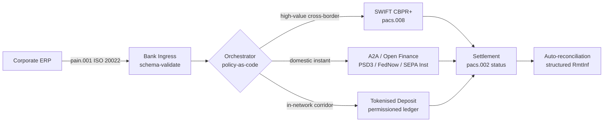

---

# Front Matter (YAML)

author: "contact@sebastienrousseau.com (Sebastien Rousseau)"
banner_alt: "夜明けの深水港に停泊するコンテナ船 — 2026 年における ISO 20022、オープンファイナンス、トークン化預金決済ネットワーク全体での企業価値のマルチレール、クロスボーダー移動を象徴"
banner_height: "1597"
banner_width: "2584"
banner: "https://cloudcdn.pro/stocks/images/viktor-forgacs-KxVRDiFdTVo.webp"
cdn: "https://cloudcdn.pro"
charset: "UTF-8"
cname: "sebastienrousseau.com"
copyright: "© Copyright 2025 - 2026 - Sebastien Rousseau. All rights reserved."
date: "2026年6月24日"
description: "ISO 20022、A2A、PSD3/FiDA 下のオープンファイナンス、トークン化預金が、2026 年に SWIFT と並んでクロスボーダー企業財務をどう再構築しているか。"
format-detection: "telephone=no"
hreflang: "ja"
icon: "https://cloudcdn.pro/clients/sebastienrousseau/v1/logos/sebastienrousseau.svg"
id: "https://sebastienrousseau.com/2026-06-24-cross-border-iso-20022-open-finance-tokenised-deposits-treasury-2026"
image_alt: "セバスチャン・ルソーのモノクロ・ポートレート"
image_height: "162"
image_width: "162"
image: "https://cloudcdn.pro/stocks/images/sebastienrousseau.webp"
keywords: "クロスボーダー決済, ISO 20022, オープンファイナンス, PSD3, FiDA, トークン化預金, ステーブルコイン, A2A, トレジャリー, CIB, Nexi, Mastercard, マルチレール, pacs.008, pain.001, SWIFT, FedNow, SEPA Instant, RTP, CBPR+"
language: "ja-JP"
last_reviewed: "2026-06-24"
layout: "report"
locale: "ja_JP"
logo_alt: "セバスチャン・ルソーのロゴ"
logo_height: "44"
logo_width: "44"
logo: "https://cloudcdn.pro/clients/sebastienrousseau/v1/logos/sebastienrousseau.svg"
menu: ""
measurementID: "G-169G4ET5HQ"
name: "Sebastien Rousseau"
permalink: "https://sebastienrousseau.com/2026-06-24-cross-border-iso-20022-open-finance-tokenised-deposits-treasury-2026"
rating: "general"
referrer: "no-referrer"
robots: "index, follow"
schema: "FAQPage, Article"
seo_title: "クロスボーダー 2026:ISO 20022、オープンファイナンス、トークン化レール"
short_name: "sebastienrousseau"
subtitle: "2026 年のクロスボーダー企業財務はマルチレールの仕組みで動きます — ISO 20022 を共通文法とし、A2A とオープンファイナンスを顧客対面レール、トークン化預金を大口決済レッグとし、SWIFT が依然としてロングテールを支えます。"
tags: "クロスボーダー決済, ISO 20022, オープンファイナンス, PSD3, FiDA, トークン化預金, A2A, トレジャリー, CIB, マルチレール, pacs.008, pain.001, SWIFT, FedNow, SEPA Instant, RTP, CBPR+"
theme-color: "0, 83, 191"
title: "クロスボーダー 2026:企業財務における ISO 20022、オープンファイナンス、トークン化預金"
url: "https://sebastienrousseau.com/2026-06-24-cross-border-iso-20022-open-finance-tokenised-deposits-treasury-2026"
viewport: "width=device-width, initial-scale=1, shrink-to-fit=no"

# RSS - The RSS feed front matter (YAML).
atom_link: "https://sebastienrousseau.com/2026-06-24-cross-border-iso-20022-open-finance-tokenised-deposits-treasury-2026/rss.xml"
category: "Technology"
docs: https://validator.w3.org/feed/docs/rss2.html
generator: "Static Site Generator (SSG) (version 0.0.26)"
item_description: "ISO 20022、A2A、PSD3/FiDA 下のオープンファイナンス、トークン化預金が、2026 年に SWIFT と並んでクロスボーダー企業財務をどう再構築しているか。"
item_guid: "https://sebastienrousseau.com/2026-06-24-cross-border-iso-20022-open-finance-tokenised-deposits-treasury-2026/rss.xml"
item_link: "https://sebastienrousseau.com/2026-06-24-cross-border-iso-20022-open-finance-tokenised-deposits-treasury-2026/rss.xml"
item_pub_date: "Wed, 24 Jun 2026 07:07:07 +0000"
item_title: "クロスボーダー 2026:企業財務における ISO 20022、オープンファイナンス、トークン化預金"
last_build_date: "Wed, 24 Jun 2026 06:06:06 +0000"
managing_editor: "contact@sebastienrousseau.com (Sebastien Rousseau)"
pub_date: "Wed, 24 Jun 2026 07:07:07 +0000"
ttl: "60"
type: "article"
webmaster: "contact@sebastienrousseau.com"

# Apple - The Apple front matter (YAML).
apple_mobile_web_app_orientations: "portrait"
apple_touch_icon_sizes: "192x192"
apple-mobile-web-app-capable: "yes"
apple-mobile-web-app-status-bar-inset: "black"
apple-mobile-web-app-status-bar-style: "black-translucent"
apple-mobile-web-app-title: "クロスボーダー 2026:ISO 20022、オープンファイナンス、トークン化レール"
apple-touch-fullscreen: "yes"

# MS Application - The MS Application front matter (YAML).

msapplication-navbutton-color: "0, 83, 191"

# Twitter Card - The Twitter Card front matter (YAML).

twitter_card: "summary_large_image"
twitter_creator: "@wwdseb"
twitter_description: "ISO 20022、A2A、PSD3/FiDA 下のオープンファイナンス、トークン化預金が、2026 年に SWIFT と並んでクロスボーダー企業財務をどう再構築しているか。"
twitter_image: "https://cloudcdn.pro/clients/sebastienrousseau/v1/logos/sebastienrousseau.svg"
twitter_image_alt: "セバスチャン・ルソーのロゴ"
twitter_site: "@wwdseb"
twitter_title: "クロスボーダー 2026:ISO 20022、オープンファイナンス、トークン化レール"
twitter_url: "https://sebastienrousseau.com/2026-06-24-cross-border-iso-20022-open-finance-tokenised-deposits-treasury-2026"

excerpt: "2026 年のクロスボーダー企業財務はマルチレールのエンジニアリング問題です。ISO 20022 が共通文法、PSD3/FiDA 下の A2A とオープンファイナンスが顧客対面レール、トークン化預金が大口決済レッグを担い、SWIFT が依然としてロングテールを支えます。本質的な仕事はオーケストレーション層にあり、モデルではありません。"

# Humans.txt - The Humans.txt front matter (YAML).
author_website: "https://sebastienrousseau.com"
author_twitter: "@wwdseb"
author_location: "London, UK"
thanks: "ご一読ありがとうございます。"
site_last_updated: "2026-06-24"
site_standards: "HTML5, CSS3, RSS, Atom, JSON, XML, YAML, Markdown, TOML"
site_components: "Kaishi, Kaishi Builder, Kaishi CLI, Kaishi Templates, Kaishi Themes"
site_software: "Static Site Generator, Rust"

---

# クロスボーダー 2026:企業財務における ISO 20022、オープンファイナンス、トークン化預金

<!-- lead-start -->
<aside class="post-lead" aria-label="記事の概要">

<strong>TL;DR.</strong> 2026 年のクロスボーダー企業財務は、4 つのレールを並行して動かします — SWIFT CBPR+、PSD3/FiDA 下の即時 A2A、トークン化預金、ステーブルコインレール — これらを ISO 20022 が共通文法として縫合します。CIB と企業財務チームの仕事は、レール選定ではなくオーケストレーションです。

<strong>主要な要点</strong>

<ul class="post-lead-takeaways">
  <li><strong>マルチレールがデフォルトです。</strong>あらゆるコリドー、あらゆる取引サイズ、あらゆるカットオフを単独でカバーするレールは存在しません。財務は銀行単位ではなく、決済単位でレールを選びます。</li>
  <li><strong>ISO 20022 が共通言語です。</strong>pacs.008、pacs.009、pain.001 は、RTGS、即時、A2A、トークン化預金レール全体で送金データを運び、ルーティング判断をレールに固定するのではなくデータ駆動にします。</li>
  <li><strong>オープンファイナンスが周辺領域を広げます。</strong>PSD3 と FiDA はオープンバンキングモデルを年金、保険、財務データへと押し広げます。Nexi と Mastercard は企業が消費するオーケストレーション層を構築しています。</li>
  <li><strong>トークン化預金が大口レッグです。</strong>銀行発行のトークン化預金と統合型ステーブルコインレールが、顧客対面の即時レールの下に位置し、大口レッグを T+0 近傍で決済します。</li>
</ul>

<strong>関連する読み物:</strong> <a href="https://sebastienrousseau.com/2026-06-07-autonomous-treasury-index-programmable-liquidity-tokenised-deposits-2026">自律型トレジャリー指数 2026:プログラマブル流動性とトークン化預金</a>、<a href="https://sebastienrousseau.com/2026-06-15-pacs008-automation-iso-20022-interbank-payments-2026">pacs.008 自動化:2026 年の ISO 20022 銀行間決済</a>。

</aside>
<!-- lead-end -->

> **エグゼクティブサマリー.** 2026 年のクロスボーダー企業財務は、リレーションシップマネジメントの問題である前に、マルチレールのエンジニアリング問題です。PSD3 と Financial Data Access (FiDA) 規制はオープンバンキングの周辺領域を企業財務データへと広げます。2026 年 11 月の SWIFT MT/MX 移行により、CBPR+ 準拠の pacs.008 がクロスボーダー銀行間の唯一実行可能なフォーマットとなります。トークン化預金と規制対象ステーブルコインレールは、許可型ネットワーク内で大口決済レッグを T+0 近傍で処理します。このサイクルで勝つ CIB は、単一レールを選ぶ CIB ではありません。それらを束ねるオーケストレーション層を設計する CIB です。本記事は 4 レールアーキテクチャ (PSD3 下の A2A、SWIFT CBPR+、銀行発行トークン化預金、規制対象ステーブルコイン) をたどり、各レールが得意とすること、信用エクスポージャの境界がどこにあるのか、そしてその上のポリシー・アズ・コード・オーケストレーション層が何を強制すべきかを — 企業には一つの決済として、監督当局には一つの監査可能な軌跡として見えるよう — 整理します。

ある欧州の産業系企業が、水曜の朝にブラジルのサプライヤーへ 420 万ユーロを支払います。トレジャリーワークステーションは銀行を選びません。レールを選びます — レールの連鎖です。顧客対面の指示は、PSD3 下のオープンファイナンスプロバイダー経由でルーティングされた A2A の pain.001 メッセージに着地します。銀行はそれを 2 つのコルレス管轄を跨いで、CIB のプライベートネットワーク内でトークン化預金により処理します。ロングテール — トークン化預金の関係を持たないサブサプライヤーへの 8 万米ドルの請求書クリーンアップ — は、依然として SWIFT CBPR+ 上を pacs.008 として流れます。顧客には一つの決済に見えます。アーキテクチャには 4 つのレールが見えます。それが成立する唯一の理由が、ISO 20022 です。

これは Mastercard が[オープンバンキングからオープンファイナンスへの進化](https://www.mastercard.com/us/en/news-and-trends/Insights/2026/open-banking-to-open-finance-the-evolution-of-financial-data.html "Mastercard:オープンバンキングからオープンファイナンスへ、金融データの進化")について語るときに描く運用モデルです — データと決済が一つのオーケストレーション層に融合され、レールは顧客ではなくシステムが選ぶ。シニア銀行テクノロジストにとっての本質的な問いは、どのレールが勝つかではありません。オーケストレーション層がどう設計され、統治され、消し込まれるかです。

## 01. カードから A2A へ — オープンファイナンスへのシフト

カードレールはなくなりません。再フレーム化されています。

2025 年から 2026 年にかけて、[PSD3 と Financial Data Access (FiDA) 規制](https://www.consultancy.uk/news/42202/orchestrating-open-banking-for-platform-growth-2026-outlook "Consultancy.uk:プラットフォーム成長のためのオープンバンキングのオーケストレーション、2026 年展望")は、オープンバンキング義務を決済口座を超えて年金、住宅ローン、貯蓄、保険、企業財務データへと拡張しました。企業財務への含意は直接的です — CIB のリレーションシップマネージャーは、企業の指示に基づき、複数銀行にまたがる完全な流動性像を一つの API 契約で受け取れます。

二つのオペレーターが、企業が消費するオーケストレーション層を明示的に構築しています。Nexi はそのアクワイアリングの足場を、SEPA Instant および汎欧州 RTGS コリドー全体での A2A 起票へと、ISO 20022 ネイティブのエンドツーエンドで拡張しました。Mastercard のオープンファイナンスプラットフォームは、Aiia と Finicity の買収を軸に、データ集約と同意レイヤーを下支えし、決済起票は以前カード認証を提供していたのと同じ API 群を通じて表面化します。

このシフトは三つの理由で重要です:

1. **ユニットエコノミクス。**PSD3 下で起票される A2A は、決済からインターチェンジを剥がします。高額の B2B 取引では削減は実質的、低額の消費者取引ではマーチャントコスト構造が崩れます。
2. **データ品質。**ISO 20022 下の A2A は、カードでは決して運べなかった構造化送金データを運びます。95% を超える自動消し込み率がもはや前提条件です。
3. **リスクモデル。**A2A はクレジットトランスファーであり、カード認証ではありません。詐欺面、チャージバックモデル、紛争モデルはすべて異なります。企業財務チームは、顧客保護レイヤーが継承ではなく再構築されていることを理解する必要があります。

2026 年にマルチレール提案を売る CIB が売っているのは、オーケストレーションです — アクセスではありません。アクセスは今や規制されています。

## 02. レール横断の共通文法としての ISO 20022

マルチレールが機能する唯一の理由は、メッセージフォーマットがレール全体で一貫しているからです。

BIS 決済・市場インフラ委員会 (CPMI) は、[クロスボーダー決済を強化するための ISO 20022 ハーモナイゼーション要件](https://www.bis.org/cpmi/publ/d230.pdf "BIS CPMI:クロスボーダー決済を強化するための ISO 20022 ハーモナイゼーション要件")でこのアーキテクチャの論拠を明確にしました。2025 年 11 月の CBPR+ への移行は、クロスボーダー銀行間メッセージングにおける MT103 / MT202 時代を閉じました。それ以降、主要レールはすべて — SWIFT、FedNow、SEPA Instant、RTP、アジアとラテンアメリカの主要即時決済システム — 同じ pacs.008 / pacs.009 / pain.001 の文法を話します。

企業財務にとっての実務的帰結:

- **ルーティングはデータ駆動です。**トレジャリーワークステーションは pain.001 を一度読むだけで、コリドー、取引サイズ、カットオフ、相手方関係に基づき、決済単位でレールを決定できます — メッセージを再マッピングすることなく。
- **送金データはホップを生き残ります。**構造化された送金フィールド (`<RmtInf><Strd>`) はコルレスレッグを切り詰めなく通過します。データがレール境界で失われなくなるため、自動消し込み率が上昇します。
- **制裁スクリーニングは監査可能になります。**LEI 参照付きの構造化された `<Dbtr>` / `<Cdtr>` / `<DbtrAgt>` / `<CdtrAgt>` フィールドが、フリーテキスト名スクリーニングを置き換えます。ヒット率は下がります。調査キューは縮みます。

以下の図は、銀行のイングレスから policy-as-code オーケストレーターを経て、コリドーと取引サイズが要求するレールへと一本の pain.001 をたどります — 一つのメッセージ、複数のレール、再マッピングなしです。

この一貫性のコストはエンジニアリング規律です。ISO 20022 は寛容です。二つの銀行が完全に CBPR+ 準拠でありながら、フィールド利用、文字セット、送金データ構造が異なる pacs.008 メッセージを生成し得ます。2026 年にクロスボーダーで勝つ CIB は、標準が要求するよりも厳格なメッセージプロファイルを強制し、決済時ではなくパース時に拒否します。

## 03. トークン化預金と安定的なレール

大口決済レッグこそ、レール物語が興味深くなる場所です。

[Trade Treasury Payments による自動化、コンティンジェンシーレール、ISO 20022、ステーブルコインの分析](https://tradetreasurypayments.com/articles/automation-contingency-rails-iso-20022-and-stablecoins-the-2026-trends-reshaping-corporate-finance-and-b2b-payments "Trade Treasury Payments:自動化、コンティンジェンシーレール、ISO 20022、ステーブルコイン、2026 年に企業金融と B2B 決済を再構築するトレンド")がうまく捉えた 2026 年の構図は、大口決済レイヤーを構造的に異なる二つのモデルに分けます。

**銀行発行のトークン化預金。**商業銀行が許可型台帳上にトークン化された負債を発行します — JPM Coin、HSBC の Orion 連動預金トークン、欧州主要 CIB の同等品。トークンは発行銀行に対する直接の請求権です。決済はネットワーク内で T+0 近傍です。コンプライアンスは発行銀行の責任です。レールは完全に規制され、完全に追跡可能で、発行体がオンボードした参加者に限定されます。

**統合型ステーブルコインレール。**規制対象のステーブルコイン — 完全準備、監査済み、MiCA または地域同等のレジーム下で運用 — が、銀行発行のトークン化預金がまだ届かないコリドーを決済します。トークンは銀行のバランスシートではなく準備金に対する請求権です。コンプライアンスは発行体、オンランプ、オフランプの間で分担されます。

二つのモデルは競合していません。スタックされています。2026 年の CIB クロスボーダー商品は通常、ネットワーク内レッグに銀行発行のトークン化預金を、ネットワーク内レールが終端するコリドーに規制対象ステーブルコインを用います。企業には一つの ISO 20022 決済に見えます。その下の決済物語はマルチトークンです。

取締役会レベルの問いは、最初のプログラマブル流動性パイロット以来オペレーショナルリスク委員会が問い続けてきたものと同じです — 誰がトークンの信用エクスポージャを負い、いつまで負うのか。トークン化預金は明快な答えを与えます — 発行銀行が、バーンまで。統合型ステーブルコインレールはより微妙な答えを与えます — 準備金が、監査サイクルと償還保証に従って。レール単位コリドー単位で答えを文書化していない財務チームは、バランスシート上に計測されていない信用リスクを抱えています。

## 04. 自律型トレジャリースタック

レール層の上にオーケストレーション層が乗ります。オーケストレーション層の上にエージェント層が乗ります。

アーキテクチャの詳細は[自律型トレジャリー指数 2026:プログラマブル流動性とトークン化預金](https://sebastienrousseau.com/2026-06-07-autonomous-treasury-index-programmable-liquidity-tokenised-deposits-2026 "セバスチャン・ルソー:自律型トレジャリー指数 2026")で述べました。短く言えば — 2026 年のエージェント型トレジャリーは、ポリシー・アズ・コードとして表現されたオーケストレーション層であり、その中で境界付きエージェントが実行します。

スタックは:

1. **レール層。**SWIFT CBPR+、即時 A2A、トークン化預金、規制対象ステーブルコイン。各レールには公表されたプロファイル、カットオフ表、コストカーブ、決済ファイナリティモデルがあります。
2. **オーケストレーション層。**ISO 20022 イン、ISO 20022 アウト。コリドー、取引サイズ、カットオフ、相手方関係、ポリシーに基づく決済単位のレール判断。ポリシーはバージョン管理され、署名され、監査可能です。
3. **エージェント層。**境界付きトレジャリーエージェントが、ツール呼び出し境界、監査ログ、キルスイッチを伴ってオーケストレーションポリシーを実行します。エージェントはレールを選びません。ポリシーがレールを選びます。エージェントはポリシーを動かします。
4. **消し込み層。**ISO 20022 の pacs.008 / pacs.002 / camt.054 メッセージが元の pain.001 指示に対して消し込まれ、構造化された送金データが手動介入なしにループを閉じます。

2026 年にこのスタックを売る CIB は、一度に四つを売り — それぞれを個別に値付けします。これを買う企業が買っているのは、レール横断のオプショナリティであり、一つのメッセージ標準、一つのポリシー層、一つの消し込みフィードを伴います。それがアーキテクチャ上のシフトです。それ以外はすべて実装の詳細です。

## よくある質問

**「オープンファイナンス」とは結局のところオープンバンキングの言い換えにすぎないのですか？**
いいえ。PSD2 下のオープンバンキングが対象としていたのは決済口座です。PSD3 と Financial Data Access (FiDA) 規制は、データ共有義務を年金、住宅ローン、貯蓄、保険、企業財務データへと拡張します。企業財務への含意は直接的です — CIB のリレーションシップマネージャーは、企業の指示に基づき、決済口座履歴だけでなく、複数銀行にまたがる完全な流動性像を一つの API 契約で受け取れるようになります。

**なぜレールではなくオーケストレーション層がアーキテクチャ上の焦点なのですか？**
レールがコモディティ化しているからです。SWIFT CBPR+ pacs.008、PSD3 下の A2A、トークン化預金、規制対象ステーブルコインはすべて、メッセージ層では同じ ISO 20022 文法を運びます。2026 年の CIB を差別化するのは、コリドー、取引サイズ、決済ファイナリティ要件、相手方関係に基づいて決済単位でレールを選択し、その選択を監督当局が要求する監査テレメトリに記録するポリシー・アズ・コード・エンジンです。そのエンジンがなければ、マルチレールはガバナンスを伴わない単なるオプショナリティにすぎません。

**トークン化預金レッグでは信用エクスポージャの境界はどこに落ちますか？**
許可型台帳上の銀行発行トークン化預金は発行銀行に対する直接の請求権であり、信用エクスポージャはバーンで終わります。規制対象ステーブルコインレール (EU では MiCA 監督下、英国ではイングランド銀行のディスカッションペーパー体制、その他地域でも類似のもの) は準備金に対する請求権であり、エクスポージャ期間は監査サイクルと償還保証条件に従います。レール単位コリドー単位で答えを文書化していない財務チームは、バランスシート上に計測されていない信用リスクを抱えています。

**このアーキテクチャの中で SWIFT はどうなるのですか？**
SWIFT は消えません — ロングテールを支えます。銀行発行トークン化預金がまだ届かないコリドー (大半の新興国サブサプライヤー関係、大半の低頻度・低額クロスボーダー取引)、また企業や銀行が CBPR+ コルレスバンキング監査軌跡を必要とするコリドーは、引き続き SWIFT pacs.008 を流れます。2026 年のアーキテクチャは「SWIFT の代わりに新レール」ではなく「SWIFT に加えて新レール」です。

**このスタックを買うとき、企業は何を買っているのですか？**
レール横断のオプショナリティであり、一つのメッセージ標準 (ISO 20022)、一つのポリシー層 (オーケストレーションエンジン)、一つの消し込みフィード (pacs.002 ステータス + camt.054 確認 + 構造化された camt.053 報告) を伴います。企業は四つの別個のレール接続にお金を払っているのではありません。四つのレールを運用上一つとして振る舞わせるオーケストレーション層、そして次の監督当局からの要請の翌朝に「あの 420 万ユーロの決済はどのレールに乗り、なぜそうしたのか」に答えられる監査軌跡にお金を払っているのです。

## 結論

2026 年のクロスボーダー企業財務はマルチレールのエンジニアリング問題です。ISO 20022 がマルチレールを扱える文法です。PSD3 と FiDA はデータの周辺領域を広げ、オープンファイナンスを企業財務ワークフローに押し込みます。トークン化預金と規制対象ステーブルコインが大口決済レッグを担います。SWIFT は依然としてロングテールを支えます。

勝つ CIB は、オーケストレーション層を構築する CIB です — 単一レールを選んでフランチャイズを賭ける CIB ではありません。勝つ企業財務チームは、レール単位コリドー単位で信用エクスポージャを文書化し、規制当局が要求するよりも厳格な ISO 20022 プロファイルを強制し、レール判断を決済単位の裁量ではなくポリシーとして扱うチームです。

本質的な仕事はオーケストレーション層にあります。慎重に構築してください。

## 参考文献

Bank for International Settlements, Committee on Payments and Market Infrastructures (2023). *Harmonised ISO 20022 data requirements for enhancing cross-border payments* (CPMI Papers No. 230). 入手先: [https://www.bis.org/cpmi/publ/d230.htm](https://www.bis.org/cpmi/publ/d230.htm "BIS CPMI 230 — Harmonised ISO 20022 data requirements")

Bank for International Settlements (2024). *Project Agorá: cross-border payments with tokenised commercial bank deposits and central bank money*. BIS Innovation Hub. 入手先: [https://www.bis.org/about/bisih/topics/fmis/agora.htm](https://www.bis.org/about/bisih/topics/fmis/agora.htm "BIS Project Agorá")

Bank of England (2023). *Regulatory regime for systemic payment systems using stablecoins and related service providers — Discussion Paper*. 入手先: [https://www.bankofengland.co.uk/paper/2023/dp/regulatory-regime-for-systemic-payment-systems-using-stablecoins-and-related-service-providers](https://www.bankofengland.co.uk/paper/2023/dp/regulatory-regime-for-systemic-payment-systems-using-stablecoins-and-related-service-providers "Bank of England — Regulatory regime for stablecoins discussion paper")

European Commission (2023). *Proposal for a Directive on payment services and electronic money services (PSD3)*. 入手先: [https://finance.ec.europa.eu/regulation-and-supervision/financial-services-legislation/implementing-and-delegated-acts/payment-services-directive_en](https://finance.ec.europa.eu/regulation-and-supervision/financial-services-legislation/implementing-and-delegated-acts/payment-services-directive_en "European Commission — Payment Services Directive proposal")

European Parliament and Council (2023). *Regulation (EU) 2023/1114 on markets in crypto-assets (MiCA)*. 入手先: [https://eur-lex.europa.eu/eli/reg/2023/1114/oj](https://eur-lex.europa.eu/eli/reg/2023/1114/oj "Regulation (EU) 2023/1114 — Markets in Crypto-Assets (MiCA)")

Financial Action Task Force (2023). *International standards on combating money laundering and the financing of terrorism — Recommendation 16 on wire transfers*. 入手先: [https://www.fatf-gafi.org/en/publications/Fatfrecommendations/Fatf-recommendations.html](https://www.fatf-gafi.org/en/publications/Fatfrecommendations/Fatf-recommendations.html "FATF Recommendations")

International Organization for Standardization (2020). *ISO 17442 Financial services — Legal entity identifier (LEI)*. 入手先: [https://www.gleif.org/en/about-lei/iso-17442-the-lei-code-structure](https://www.gleif.org/en/about-lei/iso-17442-the-lei-code-structure "ISO 17442 — Legal Entity Identifier")

SWIFT (2024). *Cross-Border Payments and Reporting Plus (CBPR+) usage guidelines*. 入手先: [https://www.swift.com/standards/iso-20022/iso-20022-programme](https://www.swift.com/standards/iso-20022/iso-20022-programme "SWIFT CBPR+ usage guidelines")

<!-- enrich-start -->
<aside class="author-card" aria-label="著者について"><strong class="author-card-name"><a href="/about/index.html">Sebastien Rousseau</a></strong>応用 AI、ISO 20022 移行、金融サービス向けポスト量子暗号、ホールセール決済の構造的転換について執筆するシニア銀行テクノロジスト。HSBC コマーシャル＆インベストメントバンク、PayPal、Barclays、Shazam、AKQA、Virgin Group を横断する 20 年超の経験。<a href="/about/index.html">フルプロフィール</a> &middot; <a href="https://www.linkedin.com/in/sebastienrousseau/" rel="external noopener">LinkedIn</a> &middot; <a href="https://github.com/sebastienrousseau" rel="external noopener">GitHub</a></aside>

最終レビュー <time datetime="2026-06-24">2026-06-24</time>。

<!-- enrich-end -->
