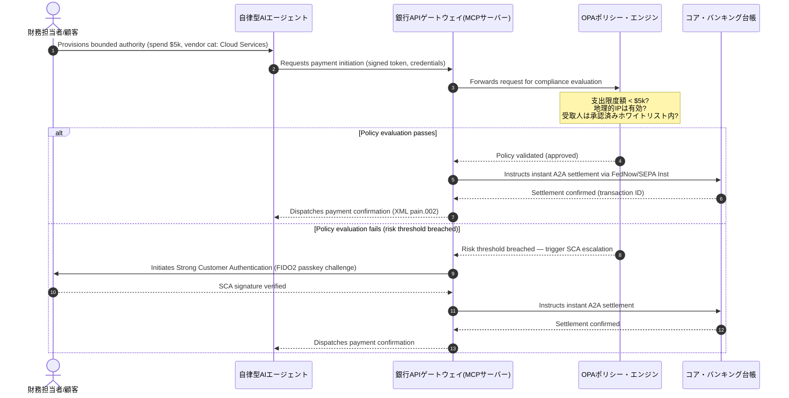

# 2026年世界決済展望:エージェント型・不可視・リアルタイム時代のオペレーティング・モデル、リスク、収益

2026年の世界決済サイクルは、3つの収斂する力 — エージェント型コマース、不可視の組み込み型決済、リアルタイム実行 — によって定義されます。これらはProject Agorá下のトークン化された統一台帳の上に成り立ち、2026年11月のSWIFT構造化アドレス・カットオーバーという確定期限に直面しています。

<!-- lead-start -->
<aside class="post-lead" aria-label="Article summary">

<strong>TL;DR.</strong> 2026年の決済領域は、メッセージング移行から、リアルタイム実行がリスクと収益を規定する多次元のオペレーティング・モデルへと移行しました。本稿はJ.P. Morgan、Global Payments、HSBC、Payments Associationの2026年展望を統合し、モデル起点のエージェント型コマース、常時稼働の財務API、BIS Project Agorá下のトークン化統一台帳、2026年11月14日／15日のSWIFTおよびSEPA構造化アドレス期限を網羅する、4つの柱からなるG-SIBオペレーティング・プランを提示します（Swift CBPR+は2026年11月14日から非構造化`<AdrLine>`ブロックを削除します。EPC SEPAルールブックは2026年11月15日まで非構造化アドレスを許容します）。

<strong>主な要点</strong>

<ul class="post-lead-takeaways">
  <li><strong>エージェント型コマースは委任責任の新たな領域を切り開きます。</strong>自律型AIエージェントは2030年までに年間3〜5兆ドルの商取引を媒介すると予測されています。銀行はMCPによるゲートキーピング、PSD3/PSR下のSCA委任、そしてマルチエージェント決済チェーン内でのKYC/AMLの帰属を定義する必要があります。</li>
  <li><strong>常時稼働の流動性は、運用および規制上のベースラインとなりました。</strong>24/7の財務APIと仮想口座が滞留資金を最小化し、レジリエンスの基準を引き上げます。システム的に重要なリアルタイム・トレジャリーAPIにとって、ファイブ・ナイン（99.999 %）の可用性は、銀行が監督当局にDORA水準のレジリエンスを示すために自ら設定する内部エンジニアリング目標になりつつあります。DORA自体は普遍的なファイブ・ナイン要件を定めていません。ICTリスク管理、インシデント報告、レジリエンステスト、第三者リスク、重要ICTプロバイダーの監督を対象としています。</li>
  <li><strong>トークン化は規制下の統一台帳へと進化しました。</strong>Project Agoráはトークン化された商業銀行預金と中央銀行準備金に関する最大規模の官民協働フレームワークです。銀行は明示的なプルーデンシャル取扱いを伴う、5段階のトークン化ジャーニーを必要とします。</li>
  <li><strong>2026年11月14日／15日の構造化アドレス・カットオーバーは確定期限です。</strong>Swift CBPR+は2026年11月14日から非構造化`<AdrLine>`ブロックを削除します。EPC SEPAルールブックは2026年11月15日まで非構造化アドレスを許容します。いずれもカットオーバー後は拒絶を引き起こします。プロダクト、テクノロジー、コンプライアンスの各チームにまたがる、整然としたデータ・ガバナンスが求められます。</li>
</ul>

<strong>関連記事:</strong> <a href="https://sebastienrousseau.com/2026-06-23-iso-20022-pain001-programmable-liquidity-autonomic-treasury-2026">Pain.001からプログラマブル流動性へ:2026年の財務における自律神経系としてのISO 20022</a>、<a href="https://sebastienrousseau.com/2026-06-24-cross-border-iso-20022-open-finance-tokenised-deposits-treasury-2026">クロスボーダー2026:法人財務におけるISO 20022、オープン・ファイナンス、トークン化預金</a>、<a href="https://sebastienrousseau.com/2026-06-25-quantum-dawn-cib-kyberlib-quantum-resilient-payments-stack-2026">CIBの量子の夜明け:KyberLibから量子耐性決済スタックへ</a>。

</aside>
<!-- lead-end -->

グローバル・トランザクション・バンクにとって、2026〜2028年のサイクルは構造的な転機となる窓です。現代の決済インフラはもはや事務処理上のユーティリティではなく、銀行水準のテクノロジー戦略の中核を成します。G-SIBおよび主要な地域金融機関の内部では、テクノロジー、規制、顧客の期待が単一のオペレーティング平面へと収斂しています。

このサイクルを定義する3つの力があり、それぞれが経営幹部レベルの懸念事項に直結します。

- **エージェント型コマース** — チャネル流通、プロダクト設計、責任配分、そして監督当局の精査下にあるモデル・リスク管理。
- **不可視の決済** — 顧客体験。銀行が自行の台帳を法人および加盟店のフロントエンドに組み込めない場合、ディスインターメディエーション(中抜き)のリスクを伴います。
- **リアルタイム実行** — 資本の回転速度。これに伴い、流動性管理、信用リスク、オペレーショナル・レジリエンス、不正対策に変化が生じます。

経済的なステークは大きいです。詐欺は速度と巧妙さで規模を拡大し、規制上の期限は確定的であり、コア・システムを能動的に近代化する銀行は実質的な手数料収益機会を解き放ちます。一方、不作為のコストは正反対です — 即時のトランザクション拒絶、運用上のボトルネック、規制上の罰則、急速な市場シェアの侵食です。

## 確実性のはしご — 期日があるもの、規制されるもの、予測のもの

本レポートのすべての項目が同じ確実性を有するわけではありません。取締役会レベルの問いは、どのデルタが期日であり、どれが監督上の期待であり、どれがいまだ市場予測であるかです — 答え次第で予算の議論が変わるためです。

| カテゴリ | 例 |
| --- | --- |
| **確定期日** | Swift CBPR+構造化アドレス・カットオーバー（2026年11月14日）。EPC SEPAルールブック（2026年11月15日） |
| **規制上の義務** | DORA ICTリスク＋レジリエンステスト＋第三者リスク監督（EU）。PSD3／PSR下のSCA委任。SR 11-7およびPRA SS1/23下のMRM |
| **蓋然性の高い市場シフト** | リアルタイム・トレジャリーAPI、AI主導の不正対策、APIベースの流動性、ディープフェイク主導の生体認証詐欺 |
| **戦略オプション** | トークン化預金、Project Agorá下の統一台帳、エージェント型コマース回廊、継続的FX（Wire 365） |
| **予測** | 2030年までのエージェント型コマース年間フロー`$3-$5 trillion`（McKinseyベースライン） |

上位2行はコンプライアンス事実として扱ってください — 銀行がアップサイドを捕捉するか否かに関わらず予算ラインを規定します。下位2行は戦略オプションとして扱ってください — 方向性は高い確信を持てますが、実行のタイミングは規制当局のカレンダー項目ではなく取締役会の選択です。

## 世界の決済オーソリティの収斂

本レポートは、業界の権威ある4つの声 — [J.P. Morgan Payments](https://www.jpmorgan.com/payments/newsroom/payments-outlook-2026-trends-report-released "J.P. Morgan Payments — Outlook 2026")、[Global Payments](https://investors.globalpayments.com/news-events/press-releases/detail/497/global-payments-releases-its-2026-commerce-and-payment "Global Payments — 2026 Commerce and Payment Trends Report")、HSBC、The Payments Association — による2026年の決済・コマース展望を統合し、[G20クロスボーダー決済強化ロードマップ](https://www.fsb.org/2026/03/fsb-kicks-off-new-implementation-phase-to-enhance-cross-border-payments-through-public-private-partnership/ "FSB — cross-border payments implementation phase, March 2026")と三角測量します。

各組織はそれぞれ異なる市場の角度からエコシステムにアプローチしますが、その知見は3つの不変項に収斂します。

1. **即時かつAPI駆動のレールがベースラインです。** クロスボーダーおよび高額フローについては、レガシーなバッチ処理モデルは周縁化されつつあります。これらのセグメントにおけるトランザクション速度は、常時稼働のリアルタイム・メッセージングによって規定されます。
2. **AIは脅威であると同時に防御でもあります。** 生成系ツールとディープフェイクが取引詐欺の規模を拡大させ、リアルタイムかつ多層的な機械学習による対抗防御が必要となります。
3. **トークン化は本番稼働可能なインフラです。** 台帳は、トークン化された商業銀行債務およびホールセール中央銀行デジタル通貨をホストするために統合されつつあります。

| レポート | 主要対象 | フォーカス | 主軸となる柱 | 銀行への含意 |
| --- | --- | --- | --- | --- |
| **J.P. Morgan Payments** | Corporate treasurers, G-SIBs | Real-time liquidity, fraud | APIs, AI biometrics | Rebuild liquidity, FX, and risk systems for continuous 365-day settlement. |
| **Global Payments** | Merchants, e-commerce | POS evolution, omnichannel | Agentic commerce, frictionless checkout | Build secure, API-gated merchant payment corridors for autonomous AI agents. |
| **HSBC Insights** | Multinational corporates | ERP integrations (SAP/Oracle), real-time cash | Treasury-as-a-Service, cash visibility | Monetise transactional API suites and embed real-time cash ledger reporting at source. |
| **The Payments Association** | Fintechs, payment institutions | Stablecoins, tokenisation, global regulation | Regulated digital assets, policy compliance | Prepare balance sheets for tokenised deposits and navigate PSD3/PSR liability structures. |

4つの展望は実質的に、公共部門のG20政策インフラの上で稼働する民間部門のオペレーティング・スタックを定義し、政策意図を銀行内部における流動性、トークン化、データ、不正対策に関する具体的な意思決定へと翻訳します。

## 柱1 — エージェント型コマースと不可視の決済

エージェント型コマースは、人間主導のクリック型チェックアウトから、自律的でモデル主導の取引開始への移行を意味します。業界予測は、2030年までに自律型エージェントが媒介する商取引が年間3〜5兆ドルに達するという点で収斂しています — これは、人間が「購入」をクリックすることなく実行される、世界の決済ボリュームの一桁前半シェアに相当します。

リテールおよび商業エコシステムには、これに対応するギャップが存在します。消費者の明確な多数派が現在、ほぼ摩擦のない決済を期待していますが、ワンクリック・チェックアウトやAPIアクセス可能な製品カタログを優先している加盟店は半数未満です。AIエージェントは、人間の目向けに設計されたレガシーな複数ページのチェックアウト画面をナビゲートできません — 構造化された機械対機械のAPIハンドシェイクを必要とします。

### 銀行の優先事項とオペレーション上の影響

- **KYCとAMLの帰属。** 銀行は、エージェント型取引チェーン内部で誰がコンプライアンス義務を負うかを定義する必要があります。消費者の個人AIエージェントが加盟店のエージェント型チェックアウト経由で取引を開始した場合、銀行は起点となる委任権限が主たる口座保有者に暗号学的に紐付けられていることを検証する必要があります。
- **責任とチャージバックの再設計。** カード・スキームおよびA2Aレールは、人間による認可を前提に設計されています。例えばデータ・パースのエラーにより不適切な工業在庫を調達するなど、AIエージェントが誤った購買を行った場合、銀行は消費者、エージェント・プロバイダー、加盟店の間で責任を明確に配分する必要があります。
- **エージェント型フローのリスク格付け。** 決済ルーティング・エンジンは、エージェント型決済を動的にリスク格付けし、安定した決済実績が確立されるまで、人間起点でないトランザクションに対してより高い準備金要件またはインターチェンジ・レートを適用する必要があります。

### 制限付き行動と制限付き権限

「無制限の行動」 — 例えばソフトウェアの不具合により無限再帰購買ループを実行する企業調達エージェント — を軽減するため、銀行は**制限付き権限APIゲート**を展開する必要があります。これらのゲートは、3つの次元にわたるポリシー水準の制限を強制します。

1. **段階的な金額制限** — エージェントの支出を取引サイズ、日次累計額、加盟店カテゴリーで制限します。
2. **コンテキスト認識セーフガード** — 台帳が資金をリリースする前に、二次的シグナル(時間帯、IPジオロケーション、取引頻度)を評価します。
3. **ヒューマン・イン・ザ・ループのエスカレーション** — 取引がリスク閾値を超えるたびに、PSD3/PSR下の強力な顧客認証(SCA)を介して必須の人間による認可をトリガーします。

以下のMermaidシーケンスは、多くの銀行が制限付き権限エージェント型決済フローとして認識するであろうターゲット・アーキテクチャを示します。

### Model Context Protocol(MCP)

ローカライズされたAIモデルを銀行が統制する実行レイヤーへ接続するため、業界は[Model Context Protocol(MCP)](https://modelcontextprotocol.io "Model Context Protocol — open standard for LLM tool integration")を中心に標準化を進めています — これは、LLMがコア・システムへの生のアクセスなしに、明確にスコープされた監査可能なツールおよびAPIを呼び出すことを可能にするオープン・プロトコルです。

銀行のAPI(決済開始、残高照会、当事者検証)をMCPサーバー内にラップすることで、LLMをデータベース・テーブルおよびシステム・ルート権限から隔離します。モデルは構造化され、監査され、レート制限されたエンドポイントを介してのみ台帳と対話します — セキュリティはモデル内部に埋め込まれるのではなく、エージェント型ツール実行の境界で強制されます。

## 柱2 — 財務変革と再構想された流動性

2026年のトランザクション・バンキングの速度は、日次バッチ処理から常時稼働のリアルタイム財務オペレーションへの移行によって規定されます。多国籍企業は、決済システムが閉鎖されているために週末や祝日にローカル口座でアイドル状態となる流動性 — 滞留資金 — をもはや許容しません。

### リアルタイム流動性の経済合理性

J.P. MorganおよびHSBCは、高度なリアルタイム・キャッシュおよびデータ機能を有する法人が、滞留資金の削減と運転資本サイクルの最適化を主因として、収益成長および資本効率において同業他社を実質的に上回る可能性が高いと報告しています。

その価値を捕捉するため、銀行は法人ERP(SAP、Oracle)が直接銀行の台帳に接続できる**Treasury-as-a-Service(TaaS) APIプロダクト**を提供します。

- **リアルタイム残高API** — `camt.052`スキーマを使用し、ファイル転送プロトコルを即時かつイベント駆動のキャッシュ・ポジション報告に置き換えます。
- **一括決済開始API** — `pain.001`を使用し、ERP台帳からベンダー決済バッチを直接ストレート・スルー実行します。
- **継続的FX API** — 財務エンジンがクロスボーダー決済向けにリアルタイムかつアルゴリズミックな外国為替レートをロックし、オーバーナイトの市場ギャップ・リスクを排除します。
- **仮想口座API** — 法人が自動売掛金マッチングおよび台帳分離のために、数千のサブ口座を動的に立ち上げ・廃止します。

### オペレーショナル・レジリエンスとDORA

常時稼働の流動性を提供することは、銀行のリスク・プロファイルを変容させます。システム的に重要なリアルタイム・トレジャリーAPIにとって、ファイブ・ナイン（99.999 %）の可用性は、銀行が監督当局にDORA水準のレジリエンスを示すために自ら設定する内部エンジニアリング目標になりつつあります。DORA自体は普遍的なファイブ・ナイン要件を定めていません。ICTリスク管理、インシデント報告、レジリエンステスト、第三者リスク、重要ICTプロバイダーの監督を対象としています。

[デジタル・オペレーショナル・レジリエンス法(DORA)](https://eur-lex.europa.eu/legal-content/EN/TXT/?uri=CELEX%3A32022R2554 "Regulation (EU) 2022/2554 — Digital Operational Resilience Act")の下では、監督当局は、リアルタイム財務APIサーフェスおよび台帳データベースが、深刻だが起こり得るサイバー攻撃、ネットワーク障害、ハイパースケーラーの障害を吸収し、クリティカルな決済を中断させたり、システミックな流動性を毀損したりすることがないことを銀行が立証することを期待しています。これには、地理的に冗長化されたアクティブ・アクティブのマルチクラウド・データベース・アーキテクチャ、リアルタイムの脅威検知レイヤー、自動フェイルオーバーが必要であり — これは監査資料だけではなく、変更コスト・ラインに可視化されます。

### 継続的FXとクロスボーダー・イノベーション

リアルタイム財務は単一通貨の境界内には収まりません。G-SIBは継続的FXインフラを展開しており — J.P. Morganの[Wire 365](https://www.jpmorgan.com/insights/payments/fx-cross-border/wire-365-global-clearing "J.P. Morgan — Wire 365 global clearing reinvented")プラットフォームは、伝統的な中央銀行のRTGS稼働時間を超えて、年間の任意の日にクロスボーダー決済とFX換算を処理します。このレイヤーは、柱3で論じるトークン化預金および統一台帳システムと直接連動します。

## 柱3 — トークン化預金と統一台帳

トークン化は、孤立した概念実証パイロットから、スケールした銀行水準のマネタリー・インフラへと進化しました。焦点は、私的なステーブルコインや投機的な暗号資産から、プログラマブルな統一台帳上で稼働する**トークン化された商業銀行預金**および**ホールセール中央銀行デジタル通貨(wCBDC)**へと移行しました。

参照フレームワークは[Project Agorá](https://www.bis.org/about/bisih/topics/fmis/agora.htm "BIS Project Agorá — tokenisation of wholesale cross-border payments")です — BISおよびIIFが招集する主要な官民協働で、**8つの中央銀行**と40を超える民間金融機関が参加しています（BIS Agoráページに基づく、2026年5月27日更新）。本プロジェクトは、トークン化された商業銀行預金が共有プログラマブル台帳上でトークン化されたホールセールCBDCとどのように統合され、クロスボーダー決済の摩擦を排除し、コンプライアンス・チェックを調整し、24/7のアトミック・ファイナリティを可能にするかを探求します。

### 5段階のトークン化ジャーニー

G-SIBおよび主要な地域銀行にとって、トークン化は内部最適化からオープン市場の相互運用性へと至る段階的なジャーニーです。

1. **行内財務流動性** — 行内法人キャッシュ残高(例:JPM Coinまたは同等の私的銀行台帳)をトークン化し、自行支店間で即時かつ24/7のクロスボーダー振替およびネッティングを可能にします。
2. **制限付きマルチバンク回廊** — クローズドで規制下のコンソーシアム(Project Agoráサンドボックス)で、異なる金融機関にまたがる銀行間決済と共有台帳状態をテストします。
3. **継続的プログラマブルFX** — 統一台帳上のスマート・コントラクトが即時のPayment-versus-Payment(PvP) FXを実行し、タイムゾーン間の決済リスクを排除します。
4. **トークン化された実物資産(RWA)** — トークン化されたキャッシュ・レッグがトークン化された証券、債務、または貿易台帳と統合され、即時のDelivery-versus-Payment(DvP)ファイナリティを実現し、資本拘束を日単位からミリ秒単位へと削減します。
5. **規制下のパブリック/ハイブリッド相互運用性** — セキュアなゲートウェイ・ラッパーにより、機関流動性がオープンなパブリック・ネットワークと安全に相互作用します。

### プルーデンシャル上およびバランスシート上の含意

トークン化キャッシュは、プルーデンシャル・フレームワークを慎重に通過させる必要があります。監督当局は、トークン化預金が伝統的な商業銀行預金と経済的に等価であるべきこと — すなわち、同一の預金保険の補償を伴う、銀行のバランスシート上の無担保債務であること — を強調しています。

オペレーション上、トークン化預金は、古典的な流動性ストレス・モデルがシミュレートするために構築されていないリスクを導入します。スマート・コントラクトは、レガシーな前提が捉えていない速度とボリュームでプログラマブルな引き出しを実行します。バーゼルIII下では、銀行はリスク・エンジンがプログラマブルなキャッシュ・ランオフをモデル化でき、トークン化台帳が日次の流動性サイクルを通じてレガシーなRTGSシステムと整然と相互運用できることを確保する必要があります。

### ステーブルコイン対トークン化預金 — ニュアンスのある立場

私的な完全準備型ステーブルコイン(USDC等)は、リテール・クロスボーダー送金および分散型コマースで市場シェアを獲得し続けていますが、商業銀行システムが有する信用創造能力および決済ファイナリティを欠いています。

リテール・レール上で競合するのではなく、トランザクション・バンクはカストディを確立し、自行が規制下のトークン化負債商品を発行し、セキュアなオン/オフランプ・ゲートウェイを構築しています。法人顧客は、規制対象の境界内に資本を留めつつ、プログラミングの柔軟性を獲得します。

### 取締役会がトークン化マネーについて問うべき質問

- **統一台帳への参加。** Project Agoráのようなホールセールの官民統一台帳イニシアチブに参加するための、当行の能動的かつ戦略的なロードマップは何ですか。
- **バランスシートおよびリスク・モデリング。** 当行のリスク・エンジンおよび資本適合性フレームワークは、スマート・コントラクト起動のトークン・ランオフの速度を考慮するよう、ストレス・テストを更新していますか。
- **先行者となる顧客セグメント。** 当行の法人財務および商業銀行顧客セグメントのうち、プログラマブルなトークン化DvP/PvP決済から即座に便益を得るのはどのセグメントですか。

## 柱4 — 構造化データと不正対策

2026年のインフラ・コンプライアンスは、**2026年11月14日／15日の構造化アドレス・カットオーバー**に支配されます — クロスボーダーおよびEU域内レールにまたがって非構造化アドレス経路を閉じる、隣接する2つの期限です。[SWIFT Standards Release(SR) 2026](https://www.swift.com/standards/iso-20022/removal-unstructured-address "SWIFT — Removal of unstructured address, November 2026")の下で、Swift CBPR+は**2026年11月14日**から非構造化`<AdrLine>`ブロックを削除します。2025年EPC SEPAルールブックの下で、非構造化アドレス形式は**2026年11月15日**まで許容されます。カットオーバー後は、構造化要素が期待される箇所に非構造化アドレスを含むクロスボーダーまたは国内メッセージは、ネットワークによって遅延または拒絶されます。

ほとんどの金融機関は期日を認識しています。多くはこれをインターフェース・レイヤーでの表面的なマッピング作業として扱います。実態はより深いデータ品質およびデータ・ガバナンスの課題です。壊滅的な拒絶率を回避するため、決済オペレーションには明確なクロスファンクショナル・ガバナンス・フレームが必要です。

- **プロダクトおよびオペレーション。** ソースでのデータ取得。顧客向けデジタル・ポータル、オンボーディング・インターフェース、法人ERP入力フィールドは、決済開始時点で構造化アドレス・フィールド(`<StrtNm>`、`<PstCd>`、`<TwnNm>`、`<Ctry>`)を強制する必要があります。
- **テクノロジー。** パース、マッピング、スキーマ検証。検証エンジンが、SWIFTインターフェースに到達する前にレガシー・ファイルをブロックします。ローカルに展開された機械学習モデルが、レガシーな非構造化アドレス・ブロックを`<PstlAdr>`下のXML準拠タグへとパースします。
- **コンプライアンスおよびリスク。** 制裁スクリーニング、トランザクション・モニタリング、AMLロジックを更新し、構造化XMLフィールドを取り込みます — これにより誤検知率および手動調査が低減します。

### 構造化データのビジネス・ケース

コンプライアンス・コストとして扱われる場合、構造化データ・プログラムは高価です。収益のイネーブラーとして扱われる場合、それは自らを賄います。

1. **高度な与信判断。** 構造化された請求書、送金、最終債務者データにより、銀行は法人顧客向けに自動化され精密な運転資本ファイナンスおよびサプライチェーン請求書ファクタリング・プログラムを構築できます。
2. **自動化された売掛金マッチング。** 構造化された当事者および請求書識別子の公開により、プレミアムなキャッシュ照合および仮想口座プーリング・プロダクトがサポートされ、新たなトランザクション手数料収益が生み出されます。
3. **マネタイズ可能な取引アナリティクス。** 銀行は、粒度の細かいリアルタイム流動性および購買パターンのアナリティクス・ダッシュボードをパッケージ化し、法人CFOおよび財務担当者に販売します。

### 多層的AI不正対策

トランザクション速度がリアルタイムへと加速するなか、不正手法も規模を拡大しました。[Entrust 2026 Identity Fraud Report](https://www.entrust.com/resources/reports/identity-fraud-report "Entrust 2026 Identity Fraud Report")は、ディープフェイクを**生体認証詐欺の5件に1件**と位置づけています。それ以前のEntrustの分析では、ディープフェイクは**ビデオ生体認証詐欺の40 %**を占めていました。いずれの枠組みにおいても、合成メディアは、オンボーディングおよび決済フローにおける音声・顔認証コントロールを突破するための実質的なチャネルとなっています。

防御は**3層AI不正モデル**です。

1. **アイデンティティ層。** バイオメトリックに検証された[FIDO2](https://fidoalliance.org/fido2/ "FIDO Alliance — FIDO2 specification")パスキー、暗号学的に署名されたハードウェア・デバイス・バインディング、決済アクセスを保護するための分散型デジタルIDウォレット。
2. **行動層。** 継続的な行動バイオメトリクス — セッション・ナビゲーションのペース、タイピング・ケイデンス、デバイス向き — により、自動化されたボット実行またはセッション・ハイジャック試行を検知します。
3. **取引層。** ISO 20022の構造化フィールドがリアルタイムの機械学習リスク・エンジンに供給され、取引メタデータをネットワーク水準で共有されるコンソーシアム・インテリジェンスと相互参照し、開始からミリ秒以内に疑わしい取引を識別します。

監督当局を満足させるため、取引層のAIモデルは厳格な**説明可能性パラメータ**を組み込み、専用のモデル・リスク管理(MRM)プログラム下で運用されます。監督当局は、銀行が自動ブロックまたは不正アラートをトリガーした具体的なデータ・ポイントとアルゴリズミック・ロジックを、[米国連邦準備制度SR 11-7](https://www.federalreserve.gov/frrs/guidance/supervisory-guidance-on-model-risk-management.htm "US Federal Reserve — Supervisory Guidance on Model Risk Management, SR 11-7")およびイングランド銀行の[PRA SS1/23](https://www.bankofengland.co.uk/prudential-regulation/publication/2023/may/model-risk-management-principles-for-banks-ss "Bank of England PRA SS1/23 — Model Risk Management principles for banks")に整合する形で説明することを期待しています。

## 2026〜2028年取締役会アジェンダ

4つの柱にわたって実行するため、G-SIBおよび地域銀行の経営機関は、明確な3つのホライズンのロードマップに沿って運用およびテクノロジー投資を組織化すべきです。

### ホライズン1 — 即時のコンプライアンスとコア強化(0〜12か月)

- **フォーカス。** ISO 20022のデータ品質を標準化し、基本的なリアルタイム取引パスを確保します。
- **成功指標(KPI)。** 2026年11月14日／15日のカットオーバー以降、SWIFTおよびSEPAにおける非構造化アドレスの拒絶ゼロ（Swift CBPR+は2026年11月14日から非構造化`<AdrLine>`ブロックを削除します。EPC SEPAルールブックは2026年11月15日まで非構造化アドレスを許容します）。
- **エグゼクティブ・オーナー。** 最高執行責任者/決済オペレーション部門長。
- **デリバラブルの種別。** 後悔のない一手。コア・データベース・スキーマの更新およびSWIFT SR 2026検証エンジン。

### ホライズン2 — 自動化とエージェント型セーフガード(12〜24か月)

- **フォーカス。** 制限付きエージェント型APIゲートと継続的な不正対策アーキテクチャ。
- **成功指標(KPI)。** 機械対機械およびAI開始のAPIトランザクションの100%が、FIDO2ハードウェア・バインディングおよび制限付き権限ポリシー・エンジンを通じて検証されること。
- **エグゼクティブ・オーナー。** 最高情報責任者/最高リスク責任者。
- **デリバラブルの種別。** 後悔のない一手(不正対策)に加え、戦略オプション(エージェント型コマース)。MCPロールアウトおよび3層不正AI。

### ホライズン3 — プラットフォームのトークン化と統一台帳(24〜36か月)

- **フォーカス。** 財務資産をトークン化預金へ移行し、共有クロスボーダー台帳に参加します。
- **成功指標(KPI)。** 高額法人財務決済ボリュームの少なくとも15%が、トークン化預金商品または統一台帳アレンジメント(例:Project Agorá回廊)を介してネイティブに処理されること。
- **エグゼクティブ・オーナー。** グループ・トレジャラー/トランザクション・バンキング部門長。
- **デリバラブルの種別。** 戦略オプション。プログラマブル台帳インフラ、スマート・コントラクト流動性ルール、DvP/PvP決済アダプター。

## 月曜朝にすべきこと — 銀行向け6項目チェックリスト

3つのホライズンのロードマップはサイクル全体の計画です。以下のチェックリストは、プログラムの残余がどの成熟度にあろうとも、CIO、COO、トランザクション・バンキング部門長が翌週末までに机上に揃えられる項目です。

1. **非構造化アドレスのエクスポージャーをチャネル別・メッセージ種別別に棚卸しします。** いまだフリーテキストの`<AdrLine>`を排出するすべてのレガシー・ファイル経路、レガシーAPIエンドポイント、法人ERPを対象とします。アウトプット：ソースごとの件数、オーナー、是正期日。
2. **エージェント型決済のリスク・タクソノミーを確立します。** 非人間起点フローを、開始方法（消費者エージェント、加盟店エージェント、企業調達エージェント）、カウンターパーティ種別、レール別に分類します。アウトプット：1ページのタクソノミーとルーティング・エンジンのチケット。
3. **AI起点決済向けに委任権限のポリシー上限を定義します。** チケット規模、加盟店カテゴリー、地理別の段階的上限とします。アウトプット：OPAエンジンが強制可能なポリシー・アズ・コード仕様のドラフト。
4. **DORA上クリティカルなトレジャリーAPIおよび第三者依存関係をマップします。** 深刻だが起こり得るシナリオ目録に入るAPI、それらが依存する第三者、DORA Article 28の要件を既に充足する契約を特定します。アウトプット：API単位の重要ICT第三者レジスター行。
5. **測定可能な財務価値を伴うトークン化預金のユースケースを2件特定します。** 行内クロスブランチ・ネッティングと、Project Agoráに隣接する単一回廊が、現実的な最初の2件です。アウトプット：それぞれサイジングされたビジネスケース、オーナー、90日以内の意思決定期日。
6. **不正対策およびエージェント型意思決定のモデル・リスク管理フレームを構築します。** 不正対策およびエージェント型決済経路上のすべてのMLモデルを、SR 11-7／PRA SS1/23の期待事項にマップします — 文書化された目的、データ系統、説明可能性、モニタリング、オーバーライド経路です。アウトプット：モデル単位の1ページMRM統制マトリクス。

このリストの趣旨は、いずれかが新規であることではありません。趣旨は、今週中に着手できる程度に小さく、次回の経営委員会で追跡可能な程度に観測可能であり、4つの柱と構造的に整合しているため、初期作業がプログラムと競合せずに供給される点にあります。

## FAQ

**エージェント型コマースは本当に2030年までに3〜5兆ドルに到達するのですか。**
McKinseyのベースラインは2030年までにエージェント型コマース売上5兆ドルを指し示しており、独立した予測群は3兆ドルから5兆ドルの範囲に集中しています。この分散は、加盟店が機械可読のチェックアウトAPIをどれだけ積極的に提供するか、また銀行がSCA委任の下でエージェントによる取引をどれだけ迅速に許容するかを反映しています — ボトルネックは銀行および加盟店側にあり、エージェントの能力側にはありません。

**2026年11月14日／15日のカットオーバーは、国内SEPAフローにも適用されますか。**
はい。構造化アドレス要件は、CBPR+のクロスボーダーおよびSEPA決済メッセージに適用されます（Swift CBPR+は2026年11月14日から非構造化`<AdrLine>`ブロックを削除します。EPC SEPAルールブックは2026年11月15日まで非構造化アドレスを許容します）。両方のレールを運用する銀行は、SWIFTインターフェースの上流に単一の正規アドレス・スキーマを必要とし、2つの並行するマッピングを必要としません。

**トークン化預金はステーブルコインと同じものですか。**
いいえ。トークン化預金は、規制対象銀行のバランスシート上の無担保債務であり、伝統的預金と同一の預金保険の補償を伴います。ステーブルコインは通常、信用創造能力を持たない、ノンバンクが発行する完全準備型商品です。Project Agoráの設計は、トークン化預金が共有プログラマブル台帳上でホールセールCBDCと並存することを前提としており、ステーブルコインはホールセール決済レッグには含まれません。

**Project Agoráは既存のwCBDCパイロットとどのように関係しますか。**
Agoráは統合のフレームです。各国のwCBDC実験は中央銀行マネー・レッグをカバーします。Agoráはトークン化された商業銀行預金を同じプログラマブル台帳上にもたらし、両方のマネー・タイプにまたがってクロスボーダー決済がアトミックに完結するようにします。**8つの参加中央銀行**と40を超える民間機関により（BIS Agoráページに基づく、2026年5月27日更新）、これはホールセール・トークン化マネー・アーキテクチャに関する最大規模の官民設計の場となっています。

**TaaS APIに対するDORAコンプライアンスの最低限の姿勢は何ですか。**
地理的冗長性を伴うアクティブ・アクティブ展開、SM&CR(英国)の下で名前付きオーナーが文書化した深刻だが起こり得るサイバー・シナリオ、そしてクリティカルな決済を中断しないテスト済みフェイルオーバー。これらがなければ、TaaSプロダクトは収益ラインとなる前に規制上の負債となります。

## 参考文献

- Bank for International Settlements (BIS) Innovation Hub. (2026). *Project Agorá: exploring tokenisation of wholesale cross-border payments*. [BIS Project Agorá](https://www.bis.org/about/bisih/topics/fmis/agora.htm).
- Deutsche Bank. (2026). *Digital Money: a perspective on stablecoins, tokenised deposits and CBDCs*. [Deutsche Bank Flow](https://flow.db.com/publications/flow-white-papers-and-guides/digital-money-a-perspective-on-stablecoins-tokenised-deposits-and-cbdcs).
- European Parliament and Council. (2022). *Regulation (EU) 2022/2554 on Digital Operational Resilience (DORA)*. [DORA Regulation](https://eur-lex.europa.eu/legal-content/EN/TXT/?uri=CELEX%3A32022R2554).
- Financial Stability Board. (2026). *FSB kicks off new implementation phase to enhance cross-border payments*. [FSB statement](https://www.fsb.org/2026/03/fsb-kicks-off-new-implementation-phase-to-enhance-cross-border-payments-through-public-private-partnership/).
- Global Payments. (2025). *2026 Commerce and Payment Trends Report — press release*. [Global Payments press release](https://investors.globalpayments.com/news-events/press-releases/detail/497/global-payments-releases-its-2026-commerce-and-payment).
- J.P. Morgan Payments. (2026). *Payments Outlook 2026 Trends Report Released*. [J.P. Morgan Newsroom](https://www.jpmorgan.com/payments/newsroom/payments-outlook-2026-trends-report-released).
- J.P. Morgan Insights. (2026). *5 Payment Trends to Watch for in 2026*. [J.P. Morgan Trends](https://www.jpmorgan.com/insights/payments/trends-innovation/five-payment-trends-in-2026).
- J.P. Morgan FX & Cross-Border. (2026). *Wire 365: Global Clearing Reinvented*. [J.P. Morgan FX Wire 365](https://www.jpmorgan.com/insights/payments/fx-cross-border/wire-365-global-clearing).
- SWIFT. (2026). *ISO 20022 milestone for November 2026: unstructured addresses to be removed*. [SWIFT ISO 20022 Milestone](https://www.swift.com/news-events/news/iso-20022-milestone-november-2026-unstructured-addresses-be-removed).
- SWIFT Standards. (2026). *Removal of unstructured address*. [SWIFT Standards](https://www.swift.com/standards/iso-20022/removal-unstructured-address).
- Bank of England. (2023). *Supervisory Statement (SS1/23) — Model Risk Management principles for banks*. [Bank of England PRA SS1/23](https://www.bankofengland.co.uk/prudential-regulation/publication/2023/may/model-risk-management-principles-for-banks-ss).
- US Federal Reserve. (2011). *Supervisory Guidance on Model Risk Management (SR 11-7)*. [SR 11-7](https://www.federalreserve.gov/frrs/guidance/supervisory-guidance-on-model-risk-management.htm).
- McKinsey & Company. (2025). *McKinsey forecast: $5 trillion in agentic commerce sales by 2030* (via Digital Commerce 360). [McKinsey agentic forecast](https://www.digitalcommerce360.com/2025/10/20/mckinsey-forecast-5-trillion-agentic-commerce-sales-2030/).
- HSBC Business. (2026). *HSBC Business Insights*. [HSBC Insights](https://www.business.hsbc.com/en-gb/insights).
- Bright Defense. (2026). *Deepfake Statistics: A Growing Security Concern*. [Deepfake fraud statistics](https://www.brightdefense.com/resources/deepfake-statistics/).
- European Banking Authority. (2019). *Guidelines on outsourcing arrangements (EBA/GL/2019/02)*. [EBA Outsourcing Guidelines](https://www.eba.europa.eu/regulation-and-policy/internal-governance/guidelines-on-outsourcing-arrangements).

<!-- enrich-start -->
<aside class="author-card" aria-label="About the author"><strong class="author-card-name"><a href="/about/index.html">Sebastien Rousseau</a></strong>応用AI、ISO 20022移行、金融サービス向けポスト量子暗号、ホールセール決済の構造変革を執筆する、シニア・バンキング・テクノロジスト。HSBC Commercial &amp; Investment Bank、PayPal、Barclays、Shazam、AKQA、Virgin Groupにて20年以上の経験。<a href="/about/index.html">フル・プロフィール</a> &middot; <a href="https://www.linkedin.com/in/sebastienrousseau/" rel="external noopener">LinkedIn</a> &middot; <a href="https://github.com/sebastienrousseau" rel="external noopener">GitHub</a></aside>

最終レビュー <time datetime="2026-06-25">2026-06-25</time>。

<!-- enrich-end -->
