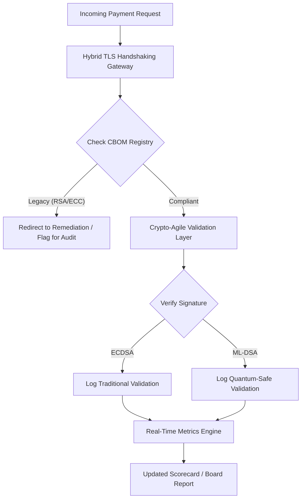

# 2026 年版ポスト量子セキュリティ・スコアカード:受託者としての暗号アジリティを担保する取締役会レベルの指標フレームワーク

<aside class="post-lead" aria-label="記事の要約">

<strong>要約。</strong>2026 年 6 月時点で、ポスト量子暗号 (PQC) は実験的な技術的関心事から第一級の受託者義務へと移行しました。取締役会は今や、DORA の下での体系的・運用的なリスクを軽減するため、レガシー暗号化を NIST FIPS 203 および 204 規格へと移行する作業を監督しなければなりません。

<strong>主要な要点</strong>

<ul class="post-lead-takeaways">
  <li><strong>G20 整合と確定期限。</strong>国際的な規制当局は量子安全への移行の確定期限を 2020 年代後半に設定しており、各機関に定量化された移行進捗の提示を求めています。</li>
  <li><strong>暗号部品表 (CBOM)。</strong>ソフトウェア BOM と同様に、CBOM はあらゆる暗号資産のライブで自動化されたインベントリであり、サプライチェーン全体での可視性を確保するために不可欠です。</li>
  <li><strong>Harvest-Now-Decrypt-Later (HNDL) エクスポージャー。</strong>攻撃者は現在、暗号化された高価値の卸売決済データを傍受・保存しています。これを軽減するには、ハイブリッド PQC アーキテクチャの即時展開が必要です。</li>
  <li><strong>暗号アジリティによる受託者ガバナンス。</strong>暗号アジリティは測定可能なガバナンス指標です。中核システムを再エンジニアリングせずに暗号プリミティブを差し替える能力 (KyberLib のようなライブラリを用いて) は、SM&CR の下で取締役会レベルのアカウンタビリティとなっています。</li>
</ul>

<strong>関連記事:</strong> <a href="https://sebastienrousseau.com/2026-06-12-kyberlib-post-quantum-banking-migration-standards-code-2026">KyberLib と 2026 年のポスト量子銀行業移行</a>、<a href="https://sebastienrousseau.com/2023-11-19-crystals-kyber-the-safeguarding-algorithm-in-a-quantum-age/index.html">CRYSTALS-Kyber:量子時代の守護アルゴリズム</a>。

</aside>
ポスト量子セキュリティはもはや研究プロジェクトではありません。「監督上の時計」は 2020 年代後半の執行期限へと刻一刻と進んでいます。[NIST FIPS 203 (ML-KEM)](https://csrc.nist.gov/pubs/fips/203/final) および [NIST FIPS 204 (ML-DSA)](https://csrc.nist.gov/pubs/fips/204/final) の確定により、鍵カプセル化およびデジタル署名の標準が成文化されました。

規制当局は今や、Tier-1 銀行がパイロットプログラムの段階を超えて進むことを期待しています。2026 年において焦点はこれらの規格の産業化に移りました。明確な移行経路を提示できない場合、[Digital Operational Resilience Act (DORA)](https://eur-lex.europa.eu/eli/reg/2022/2554/oj) の下で重大な規制上の罰則を招き、量子による予見可能な復号化の脅威を無視した取締役には個人責任が及ぶ可能性があります。

## 01. 取締役会レベルの量子スコアカード

以下の指標は、商業銀行および投資銀行 (CIB) 領域全体で量子準備性と暗号の健全性を評価するため、取締役会向けに標準化されたフレームワークを提供します。

### 表 1:PQC スコアカードの指標と許容値

| 指標 | 数学的算式 | 取締役会承認許容値 | 許容値を外れた場合のリスク |
| ---- | ---- | ---- | ---- |
| **インベントリ完全性比率 (ICP)** | (識別済み暗号資産 / 推定総資産) × 100 | > 98% | シャドー暗号化、および高価値クリアリングデータ経路における盲点。 |
| **HNDL エクスポージャー率 (HER)** | (レガシー暗号上の長期保存データ / 長期保存データ総量) × 100 | < 5% | 営業秘密、ソブリン債台帳、卸売決済記録の恒久的な侵害。 |
| **NIST 移行進捗率 (MPR)** | (FIPS 203/204 稼働システム / 重要システム総数) × 100 | > 60% (2026 年末まで) | 規制不適合、および G20 整合の取引相手からの除外。 |
| **暗号アジリティ準備指数 (CARI)** | (暗号レイヤーを抽象化したアプリ / 中核アプリ総数) × 100 | > 85% | 深刻な技術的負債、および将来のアルゴリズム廃止に対応できない事態。 |

## 02. 暗号部品表 (CBOM)

ICP 指標は、包括的な **CBOM ディスカバリーフェーズ** を通じてベースライン化されます。これは、企業内のあらゆる暗号エンドポイントを識別する自動化されたプロセスです。

- **エンドポイント・ディスカバリー:**内部およびクラウドネットワークをスキャンし、稼働中の TLS セッションからレガシー RSA または ECC の使用を識別する。
- **鍵インベントリ:**公開鍵・秘密鍵のペアをそれぞれの所有者にマッピングし、正確な有効期限を対応付ける。
- **依存関係マッピング:**廃止予定のアルゴリズムに依存するサードパーティ・ライブラリおよび API を識別する。

このディスカバリーフェーズは単一の信頼源を作り出し、CISO が暗号の健全性を財務業績と同じ粒度で報告できるようにします。

## 03. 卸売決済における HNDL エクスポージャーの排除

攻撃者は卸売決済と長期保存される法人データベースを積極的に標的にしています。これらの「Harvest-Now-Decrypt-Later」(HNDL) 攻撃は、現在の暗号化トラフィックを傍受しアーカイブする手口です。

暗号学的に意味のある量子コンピューター (CRQC) が今日存在しないとしても、現在傍受されたデータは将来脆弱になります。これを軽減するには、長期保存データ (例:本人確認記録、30 年物社債契約、法的アーカイブ) の優先移行が必要であり、これは HER 指標を直接的に低減します。決済チャネルをハイブリッド PQC・伝統的暗号化 (X25519 と並列での ML-KEM 利用) に高度化することで、アーカイブ型の脅威に対する即時の防御を提供します。

## 04. 適切に設計されたインターフェイスによる暗号アジリティの運用化

暗号アジリティは、エンジニアリングの抽象化を通じて実現されます。[KyberLib](https://sebastienrousseau.com/2026-06-12-kyberlib-post-quantum-banking-migration-standards-code-2026) のような現代的ライブラリは、開発者がアプリケーションスタック全体を書き直すことなく、量子安全なモジュールをいかに実装できるかを示しています。

- **抽象化されたラッパー:**アプリケーションは、アルゴリズム固有のルーチンではなく汎用的な `encrypt()` または `sign()` 関数を呼び出す。
- **ランタイム差し替え:**複雑なコードデプロイメントではなく構成変更を通じて、基盤となるモジュールを ECDSA から ML-DSA へ差し替えることができる。

このアーキテクチャは、将来特定の PQC アルゴリズムが侵害された場合に、組織が数年ではなく数時間で方向転換できることを担保します。

## 05. 量子安全なインバウンド検証ワークフロー

以下の図は、量子アジャイルな銀行環境においてセキュア境界に入ってくるデータのライフサイクルを示しています。

## 結論

Tier-1 銀行の暗号資産はもはや CISO の関心事ではありません。受託者インフラそのものです。NIST FIPS 203 および 204 がアルゴリズムを定め、DORA 第 5 条がアカウンタビリティの範囲を定め、SM&CR がそれを特定の上級経営者に紐づけます。上記のスコアカード — インベントリ完全性、HNDL エクスポージャー、移行進捗、暗号アジリティ — は、暗号コードを読まずともその資産を統治するために取締役会が必要とする 4 つの数字を提供します。

最も重要な数字は HNDL エクスポージャーです。今日の卸売決済アーカイブに保管されているレガシー暗号化された記録のすべては、最初の暗号学的に意味のある量子コンピューターが出荷される日に解読可能となります。カウントダウンは静かで非対称です — 防御者は保有するデータにしか対応できないのに対し、攻撃者は何年も前にすでに窃取したデータに対して行動できます。2024 年に RSA-2048 で暗号化された 30 年物の社債契約は、CRQC が稼働した日に機密性保証を失う契約です。

[KyberLib](https://sebastienrousseau.com/2026-06-12-kyberlib-post-quantum-banking-migration-standards-code-2026) とその同類は、これを複数年にわたるプラットフォームの書き直しから構成変更へと転換します。取締役会の仕事はコードを書くことではありません。取締役会の仕事は、暗号アジリティ準備指数 — 抽象化された暗号インターフェイスの背後にある中核アプリケーションの割合 — が 12 か月以内に 85 % を超えて推移するよう要求し、四半期ごとのスコアカードを読むことです。

<aside class="author-card" aria-label="著者について"><strong class="author-card-name"><a href="/about/index.html">Sebastien Rousseau</a></strong>応用 AI、ISO 20022 移行、金融サービス向けポスト量子暗号、卸売決済の構造的変革について執筆する上級銀行テクノロジスト。HSBC 商業・投資銀行、PayPal、Barclays、Shazam で 20 年以上の経験。<a href="https://www.linkedin.com/in/sebastienrousseau/" rel="external noopener">LinkedIn</a> &middot; <a href="https://github.com/sebastienrousseau" rel="external noopener">GitHub</a></aside>

最終レビュー <time datetime="2026-06-29">2026-06-29</time>。

