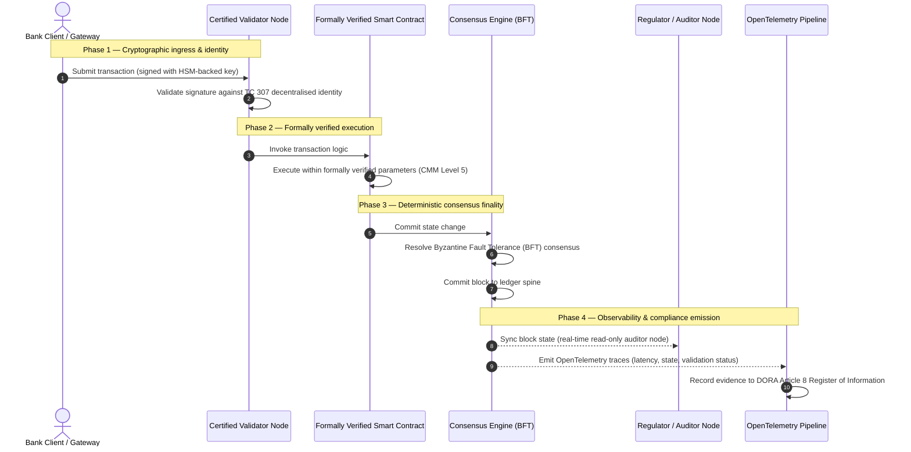

# 証拠から真実へ：なぜ認証済みブロックチェーンが銀行信頼の次の時代を定義するのか

## 戦略的サマリー（要点）

ホールセール・バンキングとグローバル取引は、2026年に歴史的な転換点に立っている。金融サービスがネイティブにデジタルなリアルタイム清算ネットワークへ移行し、人工知能が確率的な非決定性をもたらすなか、従来のアナログで遡及的な保証モデル（静的な事業体ベースの監査など）は、現代のリスク管理と受託者責任の要求をもはや満たせない。

ISO/IEC専門委員会TC 307は、分散型台帳技術のための標準化された基盤を確立した。しかし、真の機関導入には、記述的なガイダンスから、規範的で独立して認証可能なブロックチェーン保証への移行が必要である。台帳ガバナンス、コンセンサスの完全性、スマートコントラクトの安全性、暗号アジリティを、厳格な5段階の能力成熟度モデル（CMM）に照らして採点することで、銀行は断片的でベンダー固有の仮定から、認証可能で取締役会が監査可能な財務的真実へと移行できる。

## 主な要点

* **受託者上の摩擦ギャップ**：現在、私たちは銀行（Basel III）、クラウド（ISO 27001）、AIガバナンスシステム（ISO 42001）を認証できるが、何が真実かをますます決定づける分散型台帳をまだ認証できない。この非対称性は重大な運用上の脆弱性である。  
* **DORAは直接的な受託者責任を課す**：DORA第5条の下、銀行の取締役会はすべての第三者・台帳の展開の運用レジリエンスについて、直接的かつ委任不可能な個人責任を負い、不履行にはSM&CR体制の下で厳しい個人的制裁が科される。  
* **AIの監査バックボーン**：機械学習が再現不可能で確率的な結果を生む一方、認証済みブロックチェーンは決定論的な状態の取得を提供する。モデルのバージョン、入力、検証判断をチェーン上に記録することは、ISO 42001およびモデルリスク管理基準を満たす。  
* **認証済みブロックチェーン指数**：この指数は、ガバナンス、コンセンサス、スマートコントラクト、可観測性を、0から5のCMMスケールで検証可能かつ監査対応可能なスコアカードへと形式化し、エンジニアリング指標を取締役会承認のリスクアペタイト・ステートメントへと翻訳する。

## 01. デジタル・バンキングにおける受託者上の摩擦ギャップ

古典的な銀行業では、信頼は関係的、機関的、遡及的である。それは、独立した第三者監査人が固定された時点で財務状態を精査し、二者間台帳サイロ間の不一致を照合することに依存する。2026年のリアルタイムでAPI駆動の市場では、このモデルは法外なレイテンシと構造的リスクをもたらす。

取引が即座に決済され、日中の流動性プールがAPIゲートウェイによって動的に管理され、資産の所有権が共有台帳上でトークン化されると、遡及的監査は予防的統制ではなくフォレンジック演習と化す。受託者はもはや法人格の認証のみに依拠できない。デジタル基盤そのものを認証しなければならない。

現在、銀行は明白なアーキテクチャ上の非対称性の下で運営されている：

1. **認証済みクラウド・インフラ**：ハードウェアノード、仮想化コンテナ、物理データセンターは、ISO/IEC 27001およびSOC 2 Type IIの統制に照らして検証される。  
2. **認証済み管理プロセス**：オペレーショナルリスク方針、事業継続計画、アルゴリズム展開は、厳格なリスクフレームワークの下で統治される。  
3. **未認証の台帳エンジン**：分散コンセンサス機構、バリデータノードのサプライチェーン、スマートコントラクトの境界、ネットワークガバナンスモデルは、未認証で独自またはコンソーシアム固有の仮定に委ねられている。

この非対称性は重大な障害点である。銀行は、安全でISO 27001認証済みのクラウドコンテナ内で検証済みのアプリケーションを実行できるが、そのコンテナが集中的なバリデータ統制、脆弱なコンセンサスパラメータ、または未監査のスマートコントラクトを持つ分散型台帳に書き込む場合、取引の完全性は損なわれる。このギャップを埋めるには、台帳エンジンそのものが認証可能な保証対象とならなければならない。

## 02. ISO/IEC TC 307標準化の基盤

分散型台帳の標準化に必要な基礎作業は、ISO/IEC専門委員会TC 307（ブロックチェーンおよび分散型台帳技術）によって確立されつつある。ブロックチェーンを孤立した技術プロトコルとして扱うのではなく、TC 307はそれを機関的な信頼インフラとして捉え、その作業を5つの中核的な柱の周りに編成する：

1. **分類法と用語（ISO 22739）**：共通の命名法を確立し、異なる法域、金融スキーム、機関にわたって一貫した法的・運用上の定義を保証する。  
2. **参照アーキテクチャ（ISO/TR 23245）**：準拠した分散型台帳システムの境界、レイヤー、データフロー、機能コンポーネントを定義する。  
3. **セキュリティ、プライバシー、スマートコントラクト（ISO/TR 23244 / ISO 23613）**：デジタル資産システムの基本的なセキュリティガイドラインを確立し、スマートコントラクトの脆弱性緩和とライフサイクルガバナンスのベストプラクティスを詳述する。  
4. **相互運用性フレームワーク**：異種の台帳ネットワーク間のデータ・資産交換機構に対処し、孤立したトークン化サイロの形成を防ぐ。  
5. **分散型アイデンティティと信頼アンカー**：台帳ベースの暗号識別子を、正式な公開鍵基盤（PKI）および国家認可のレジストリと統合する。

総じて、TC 307はDLTがカスタムなエンジニアリング上の選択から標準化されたアーキテクチャ規律へと移行することを示唆する。しかし、TC 307は主として記述的なままである。それは卓越性がどのようなものかを定義する（ガイダンス）が、リスク責任者や監督者が重要または重大な機能（CIF）の本番展開を承認するために必要とする規範的な検証プロトコル（保証）を提供しない。

## 03. ガイダンス対保証：受託者上の区別

金融市場参加者は、技術が革新的または洗練されているという理由で導入するのではない。それが統治可能で、監査可能で、防御可能で、資本準備要件と照合可能なときに導入する。だからこそ、銀行業における標準化は自然に2つの層に分解される：

* **ガイダンス（フレームワーク）**：ベストプラクティス、参照目標、アーキテクチャ指針を概説する（例：ISO/IEC TC 307、NISTフレームワーク）。  
* **保証（証明）**：フレームワークが実装され、設計どおりに機能していることの独立した、継続的で、第三者検証可能な証拠を提供する（例：ISO 27001認証、SOC 2監査、規制検査）。

クラウド・インフラを認証しながら未認証の台帳コンセンサスに依拠することは、重大な規制上のギャップである。「不変」なブロックチェーンが必ずしも「機関的に信頼される」わけではない。不変性は入力されたデータが変更されないことのみを保証する。バリデータノードが安全か、コンセンサスプロトコルが共謀に対して強靭か、スマートコントラクトのロジックが数学的に健全か、暗号鍵管理がポスト量子の義務に準拠しているかは検証しない。

このギャップを埋めるため、2026年認証済みブロックチェーン指数は、これらの要件を、グローバル銀行規制にマッピングされた定量化可能な能力成熟度モデル（CMM）へと形式化する。

## 04. 2026年認証済みブロックチェーン指数

上級管理職が自社の台帳プラットフォームを評価・認証できるように、この指数は分散型台帳インフラを、0から5のCMMスケールで採点される5つの監査可能な運用層に構造化する。

## 表1：認証済みブロックチェーン指数のアーキテクチャ

| 指数の層 | 成熟度レベル（CMM） | 技術的・運用的指標 | 規制上／受託者上の統制参照 |
| ---- | ---- | ---- | ---- |
| **台帳ガバナンス** | **レベル0**：アドホックなコンソーシアム**レベル3**：自動化されたバリデータ審査とローテーション**レベル5**：分散型・多者間の暗号アイデンティティ・アンカリング | 審査済み金融事業体が運営するバリデータノードの割合；バリデータ紛争解決の平均時間；ノードの地理的分布 | **DORA第5条**（ガバナンスと組織）；**CPMI-IOSCO PFMI原則2**（ガバナンス）と**原則3**（包括的リスク管理の枠組み） |
| **コンセンサスの完全性** | **レベル0**：単一ノードまたは不透明なPoW**レベル3**：決定論的ファイナリティを備えた監査済みBFT**レベル5**：継続的レイテンシ監視を伴う多法域・形式検証済みコンセンサス | 許容可能な最大コンセンサスレイテンシ；共謀耐性のしきい値；シミュレートされたノード分断下での可用性SLA | **DORA第6条**（ICTリスク管理の枠組み）；**CPMI-IOSCO PFMI原則8**（決済ファイナリティ） |
| **アイデンティティと暗号** | **レベル0**：脆弱なRSA／ECDSA鍵**レベル3**：HSM支援の鍵管理を伴うマルチシグ**レベル5**：量子安全なハイブリッド鍵（FIPS 203 ML-KEM）とゼロ知識プライバシーゲート | HSM支援鍵で署名された台帳取引の割合；PQC移行準備度スコア；ZK証明のレイテンシ | **NIST FIPS 203 / 204**；**ISO/IEC 27001**（情報セキュリティ管理） |
| **スマートコントラクト保証** | **レベル0**：未監査のSolidityスクリプト**レベル3**：自動化されたコンパイラ検証と外部監査**レベル5**：サーキットブレーカー更新を備えた形式検証済み・不変のスマートコントラクト | 数学的形式検証を備えたスマートコントラクトの割合；コンパイラ警告の件数；脆弱性スキャンのカバレッジ | **アウトソーシングに関するEBAガイドライン**（第81、113-117項）；**DORA第30条**（最低契約条項） |
| **監査と可観測性** | **レベル0**：手動ログスクレイピング**レベル3**：構造化されたOTelトレースと読み取り専用の監査人ノード**レベル5**：第8条レジスタとの自動化された継続的照合 | OpenTelemetryトレースでカバーされる取引の割合；ブロックコミットから監査人ノード同期までのレイテンシ | **BCBS 239**（リスクデータ集計）；**DORA第8条**（情報レジスタ／ITSスキーマ） |

## 表2：グローバル銀行基準にマッピングされた主要な信頼シグナル

| シグナル／ベンチマーク | 指標 | 銀行プラットフォームへの影響 | 規制上の出典 |
| ---- | ---- | ---- | ---- |
| **ISO/IEC TC 307の進展** | ISO/TR技術報告書から正式な認証スキームへの移行 | 分散型台帳エンジンを認証する最初の標準化された枠組みを確立 | **ISO/IEC JTC 1 / SC 44**（分散型台帳技術） |
| **Agoráプロジェクトのプロトタイプ段階** | 40以上の参加商業銀行；トークン化預金の統合台帳テスト | クロスボーダー清算をメッセージング（SWIFT）からアトミックなトークン化決済へ移行 | **国際決済銀行（BIS）イノベーション・ハブ** |
| **DORA第30条の第三者監査** | ノードプロバイダーとインフラホストの100%がセキュリティ基準に照らして監査済み | 「シャドウ・バリデータノード」を排除；完全なサプライチェーンの透明性を義務化 | **欧州監督当局（ESA）** |
| **ISO/IEC 42001（AIガバナンス）** | AIモデルと訓練ログをチェーン上で暗号的に不変化 | ブロックチェーンを機械学習の不変な証拠レジスタ（「監査バックボーン」）として活用 | **ISO/IEC 42001:2023**（情報技術 — 人工知能） |
| **Basel III自己資本充実度** | 文書化された複雑性削減に基づくオペレーショナルリスク資本バッファの削減 | 標準化されたオペレーショナルリスクの枠組みが、検証済みの台帳レジリエンスを直接に評価 | **バーゼル銀行監督委員会（BCBS）** |

## 05. AIの「監査バックボーン」：決定論的インフラ上の確率的知能

2026年における認証済みブロックチェーンの最も強力な戦略的役割の一つは、人工知能展開のための**「監査バックボーン」**として機能することである。現代の金融システムはますます確率的になっている。信用スコアリング、リアルタイム不正検知、アルゴリズム取引、自律的な顧客対応は、時間とともに進化し、ドリフトし、適応する機械学習モデルによって駆動される。これらのモデルは非決定論的である：同じ入力を異なる2つの時点で与えても、動的な重みと継続的な訓練により、異なる出力を生む可能性がある。

この非決定性は、**ISO/IEC 42001（AIガバナンス）**およびモデルリスク管理（MRM）基準（**米連邦準備制度のSR 11-7**や**英PRAのSS1/23**など）の下で、深刻なガバナンス上の課題を提起する：*厳密に再現可能ではない判断を、どのように監査し、説明し、防御するのか？*

認証済み分散型台帳は決定論的なカウンターウェイトを提供する。AIモデルが確率的に動作する一方、認証済みブロックチェーンはそのパラメータを決定論的に記録し、改変不能な証拠バックボーンを確立する：

* **モデルのバージョン管理と重みのアンカリング**：展開された各モデルバージョン、その関連する重み、および訓練データのチェックサムは、ビルド時にハッシュ化されて台帳に書き込まれ、**SLSA Level 3**のサプライチェーン要件を満たす。  
* **コンテキスト入力のロギング**：AIモデルが重要な判断（融資の承認や取引のフラグ付けなど）を実行するとき、正確なコンテキスト入力とモデルハッシュが台帳に書き込まれ、改ざん耐性のある履歴が作成される。  
* **コードアクセスなしの監査可能性**：規制当局が「なぜあなたのモデルは6月3日にこの与信申請を却下したのか？」と尋ねた場合、銀行は独自コードを開示する必要も、正確なモデル状態を再現しようとする必要もない。入力、重み、検証状態の暗号署名されたオンチェーン記録を提示する。

機械学習モデルの確率的判断を認証済みブロックチェーンの決定論的コンセンサスにアンカリングすることで、機関は防御可能で、再構築可能で、独立に検証可能な自動化行動のタイムラインを作り出す。

## 06. 認証済みコンセンサス・トゥ・監査パイプラインの可視化

以下のシーケンス図は、認証済みブロックチェーン・プラットフォームを通過する取引のライフサイクルを示し、検証ゲート、コンセンサスの完全性、スマートコントラクトの実行、テレメトリの放出がどのように連動して、取締役会対応の規制上の証拠を生成するかを示す：

この取引シーケンスのクリティカルパスは、すべての検証、実行、コンセンサスのステップが暗号署名されることを要求し、エンドツーエンドの来歴を保証する。規制当局の監査人ノードはブロック状態をリアルタイムで同期し、遡及的で手動の財務照合の必要性を排除する。

## 07. 上級管理職のための取締役会プレイブック

組織的信頼からインフラ的信頼への移行をうまく乗り切るため、銀行の経営幹部と上級管理職は、直ちに4つの主要指令を実行すべきである：

1. **エンタープライズ・リスク管理（ERM）で台帳監査を義務化する**：いかなる分散型台帳プラットフォーム（プライベート、パブリック、コンソーシアムを問わず）も、5層の**認証済みブロックチェーン指数アーキテクチャ**（最低CMMレベル3）に照らして監査されない限り、重要または重大な機能（CIF）に展開されないという方針を強制する。  
2. **ブロックチェーンをISO 42001のAI証拠バックボーンとして統合する**：最高リスク責任者と主席AIアーキテクトに、すべての高影響な機械学習モデルを認証済みブロックチェーンと統合し、モデルのバージョン、重み、入力、判断の改ざん耐性のある監査レジスタを作成するよう指示する。  
3. **バリデータノードのサプライチェーンを監査する（DORA第30条）**：調達部門に、バリデータノードをホストするか、DLTネットワークのクラウドホスティングを管理するすべての第三者事業体を監査させ、銀行の内部クラウドノードに適用されるのと同じサイバーセキュリティおよび運用レジリエンス基準を義務付ける。  
4. **台帳アーキテクチャをCPMI-IOSCOおよびBCBS 239と整合させる**：プラットフォーム・エンジニアリング・チームに、台帳の出力テレメトリを**BCBS 239**のデータ報告要件と直接整合させ、コンセンサスおよび決済ファイナリティのパラメータが**CPMI-IOSCO原則8および9**に厳格に準拠することを保証するよう指示する。

## 08. よくある質問

**ISO/IEC TC 307は認証基準か？**  
いいえ。ISO/IEC TC 307は、用語、参照アーキテクチャ、セキュリティガイドラインを確立する専門委員会である。それは「卓越性がどのようなものか」を定義する（ガイダンス）が、業界は銀行監督者を満足させるため、これらの文書を正式で監査可能な認証スキーム（保証）へと運用化しなければならない。

**認証済みブロックチェーンはどのようにDORA準拠を支えるのか？**  
DORA第5条の下、銀行の取締役会は技術的レジリエンスについて直接的な個人責任を負う。認証済みブロックチェーンは、コンセンサスの完全性、バリデータ・サプライチェーンの統制、スマートコントラクトの安全性について検証可能な暗号的証拠を提供し、取締役会メンバーにSM&CRの下での個人責任の主張に対して防御するために必要な、文書化可能な「合理的な措置」を与える。

従来の台帳監査と認証済みブロックチェーン監査の違いは何か？  
従来の監査は遡及的である：取引が決済された後に手動記入と静的ファイルを検証する。認証済みブロックチェーン監査は継続的かつリアルタイムである；バリデータノード、BFTコンセンサスエンジン、形式検証済みスマートコントラクトは取引を決定論的に実行するよう認証されており、システムの健全性を継続的に検証する構造化されたテレメトリ（OpenTelemetry）を放出する。

パブリック・ブロックチェーンは銀行利用のために認証できるか？  
ほとんどの法域では、純粋に許可不要なパブリック・ブロックチェーンは、バリデータのアイデンティティ検証の欠如、予測不可能な取引コスト、非決定論的なファイナリティ（確率的なproof-of-work／stakeフォークなど）のため、銀行規制を満たさない。銀行における認証済みブロックチェーンは通常、バリデータノードの運営者が識別され監査された金融事業体である、エンタープライズの許可制アーキテクチャ、または厳格に規制されたパブリック・ハイブリッド・アーキテクチャを用いる。

## 09. 参考文献

* バーゼル銀行監督委員会（BCBS）, 2013. *Principles for effective risk data aggregation and reporting (BCBS 239)*. バーゼル：国際決済銀行. 入手先：[https://www.bis.org/publ/bcbs239.pdf](https://www.bis.org/publ/bcbs239.pdf).  
* Committee on Payments and Market Infrastructures および Technical Committee of the International Organization of Securities Commissions (CPMI-IOSCO), 2012. *Principles for financial market infrastructures*. バーゼル：国際決済銀行. 入手先：[https://www.bis.org/cpmi/publ/d101a.pdf](https://www.bis.org/cpmi/publ/d101a.pdf).  
* 欧州銀行監督機構（EBA）, 2019. *EBA/GL/2019/02 — Guidelines on outsourcing arrangements*. パリ：EBA. 入手先：[https://www.eba.europa.eu/regulation-and-policy/internal-governance/guidelines-on-outsourcing-arrangements](https://www.eba.europa.eu/regulation-and-policy/internal-governance/guidelines-on-outsourcing-arrangements).  
* 欧州議会および欧州連合理事会, 2022. *金融セクターのデジタル・オペレーショナル・レジリエンスに関する規則（EU）2022/2554（DORA）*. ブリュッセル：欧州連合官報. 入手先：[https://eur-lex.europa.eu/legal-content/EN/TXT/?uri=CELEX%3A32022R2554](https://eur-lex.europa.eu/legal-content/EN/TXT/?uri=CELEX%3A32022R2554).  
* ISO/IEC JTC 1/SC 42, 2023. *ISO/IEC 42001:2023 — Information technology — Artificial intelligence — Management system*. ジュネーブ：国際標準化機構. 入手先：[https://www.iso.org/standard/81230.html](https://www.iso.org/standard/81230.html).  
* 専門委員会 ISO/IEC 307, 2020. *ISO/IEC 22739:2020 — Blockchain and distributed ledger technologies — Vocabulary*. ジュネーブ：国際標準化機構. 入手先：[https://www.iso.org/standard/73771.html](https://www.iso.org/standard/73771.html).  
* National Institute of Standards and Technology (NIST), 2026. *First Three Finalized Post-Quantum Encryption Standards (FIPS 203, 204, and 205)*. ゲイザースバーグ：U.S. Department of Commerce. 入手先：[https://www.nist.gov/news-events/news/2024/08/nist-releases-first-3-finalized-post-quantum-encryption-standards](https://www.nist.gov/news-events/news/2024/08/nist-releases-first-3-finalized-post-quantum-encryption-standards).
