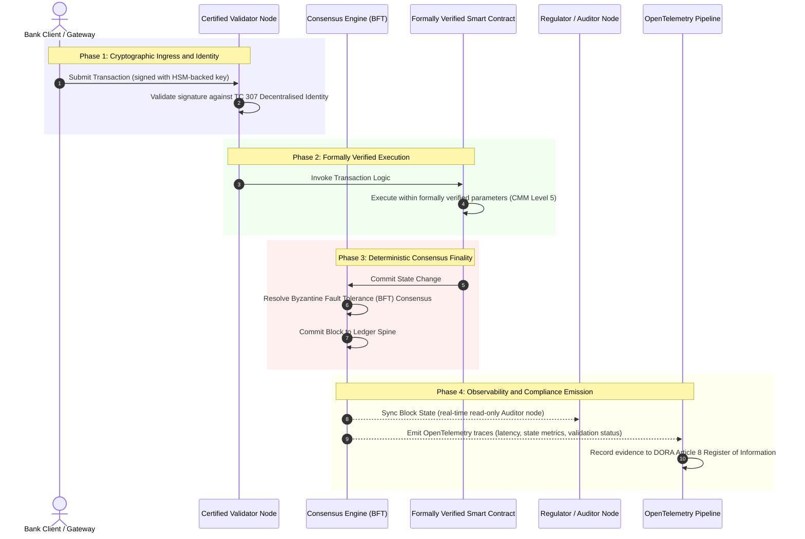

# 証拠から真実へ:なぜ認証済みブロックチェーンが銀行の信頼の次の時代を定義するのか

**不変であることは、信頼されていることと同じではありません。** ホールセールバンキングがリアルタイム決済と確率的AIへ移行するにつれ、何が真実かを決める台帳は、銀行がいまだ認証できない唯一の層になっています。銀行はBasel IIIのもとで事業体を、ISO 27001のもとでクラウドを、ISO 42001のもとで自社のAIを認証しますが、分散型台帳、すなわちそのガバナンス、コンセンサス、暗号、スマートコントラクトは、ベンダー固有の前提に委ねられたままです。本レポートは、その受託者責任のギャップを埋めるには、ISO/IEC TC 307のガイダンスから規範的なアシュアランスへ移行する必要があると論じます。すなわち、エンジニアリング上の指標を、取締役会が監査可能でDORAに対して弁護可能な真実へと変える、5段階の認証済みブロックチェーン指標に照らして台帳を採点することです。

<!-- lead-start -->
<aside class="post-lead" aria-label="記事の要約">

<strong>要点。</strong> 銀行は事業体、クラウド、自社のAIを認証しますが、何が真実かをますます決定づける台帳は認証しません。ISO/IEC TC 307が与えるのはガイダンスであり、アシュアランスではありません。5段階の認証済みブロックチェーン指標は、台帳ガバナンス、コンセンサスの完全性、アイデンティティと暗号、スマートコントラクトのアシュアランス、可観測性を能力成熟度モデルに照らして採点し、受託者責任のギャップを埋め、確率的AIに決定論的な監査スパインを与えます。

<strong>重要なポイント</strong>

<ul class="post-lead-takeaways">
  <li><strong>受託者責任の摩擦ギャップ。</strong> 銀行(Basel III)、クラウド(ISO 27001)、AIガバナンスシステム(ISO 42001)は認証できますが、何が真実かを決める分散型台帳はまだ認証できません。その非対称性は、現に存在するオペレーショナルな脆弱性です。</li>
  <li><strong>DORAはこれを個人の問題にします。</strong> DORA Article 5のもとで、銀行の取締役会は、サードパーティおよび台帳の展開のレジリエンスに対して、委任できない直接の責任を負い、不履行にはSM&amp;CRによる個人への罰則が科されます。</li>
  <li><strong>AIの監査スパイン。</strong> 機械学習は再現不可能です。認証済みブロックチェーンは、モデルのバージョン、入力、検証上の判断を決定論的にオンチェーンで記録し、ISO 42001およびモデルリスク管理の基準を満たします。</li>
  <li><strong>認証済みブロックチェーン指標。</strong> ガバナンス、コンセンサス、暗号、スマートコントラクト、可観測性は、エンジニアリング上の指標を、取締役会が承認したリスクアペタイト・ステートメントへと変換する、0から5のCMMスコアカードになります。</li>
</ul>

<strong>関連する読み物:</strong> <a href="https://sebastienrousseau.com/2026-07-02-certified-blockchains-banking-trust-tc307-assurance-2026">認証済みブロックチェーンと銀行の信頼:TC 307のアシュアランス</a>、<a href="https://sebastienrousseau.com/2026-07-24-global-payments-outlook-operating-model-risk-revenue">2026年グローバル決済アウトルック</a>。

</aside>
<!-- lead-end -->

> **エグゼクティブサマリー**
>
> - **ホールセールバンキングは転換点にあります。** リアルタイムのクリアリングと確率的AIは、アナログで遡及的なアシュアランスのモデルを壊します。静的で事業体を基盤とする監査は、もはや現代のリスク管理や受託者責任の要求を満たしません。
> - **TC 307はベースラインであり、証明書ではありません。** ISO/IEC TC 307は、分散型台帳の語彙、参照アーキテクチャ、セキュリティのガイダンスを標準化してきましたが、それは記述的です。何が良いかを定義するものの、リスク担当役員や監督当局が本番展開を承認するために必要な、規範的な検証は提供しません。
> - **アシュアランスとは台帳を採点することです。** ガバナンス、コンセンサスの完全性、スマートコントラクトの安全性、暗号の俊敏性を、厳格な5段階の能力成熟度モデルに照らして採点することで、銀行は継ぎはぎでベンダー固有の前提から、認証可能で取締役会が監査できる財務上の真実へと移行します。
> - **台帳はAIの監査スパインです。** モデルのバージョン、入力、検証上の判断を決定論的なコンセンサスに固定することで、再現不可能な機械学習に、ISO 42001、SR 11-7、PRA SS1/23のもとで弁護可能かつ再構築可能な証拠記録を与えます。

## デジタルバンキングにおける受託者責任の摩擦ギャップ

従来の銀行業では、信頼は関係的であり、制度的であり、遡及的です。信頼は、独立したサードパーティの監査人が静的な時点で財務状態を確認し、相対型の台帳サイロ間の不一致を照合することに依存しています。2026年のリアルタイムでAPI駆動の市場では、このモデルは許容できない遅延と構造的なリスクをもたらします。

取引が即座に決済され、日中の流動性プールがAPIゲートウェイによって動的に管理され、資産の所有権が共有台帳を横断してトークン化されると、遡及的な監査は予防的な統制ではなく事後的な検証作業になります。受託者はもはや、法人という事業体を認証することだけに依拠することはできません。デジタルな基盤そのものを認証しなければなりません。

現在、銀行は明白なアーキテクチャ上の非対称性のもとで運営されています。

1. **認証済みのクラウドインフラ**:ハードウェアノード、仮想化されたコンテナ、物理的なデータセンターは、ISO/IEC 27001およびSOC 2 Type IIの統制に照らして検証されています。  
2. **認証済みの管理プロセス**:オペレーショナルリスクのポリシー、事業継続計画、アルゴリズムの展開は、厳格なリスクフレームワークのもとで管理されています。  
3. **未認証の台帳エンジン**:中核となる分散コンセンサスの仕組み、バリデータノードのサプライチェーン、スマートコントラクトの境界、ネットワークガバナンスのモデルは、未認証で独自の、あるいはコンソーシアム固有の前提に委ねられています。

この非対称性は重大な障害点です。銀行は、安全でISO 27001認証済みのクラウドコンテナ内で検証済みのアプリケーションを実行できますが、そのコンテナが、中央集権的なバリデータ管理、脆弱なコンセンサスパラメータ、あるいは未監査のスマートコントラクトを持つ分散型台帳へ書き込むなら、取引の完全性は損なわれます。このギャップを埋めるには、台帳エンジンそのものが認証可能なアシュアランスの対象とならなければなりません。

## ISO/IEC TC 307による標準化のベースライン

分散型台帳を標準化するために必要な基礎的な作業は、ISO/IEC専門委員会307(TC 307\)(ブロックチェーンおよび分散型台帳技術)によって整備されつつあります。TC 307は、ブロックチェーンを孤立した技術プロトコルとして扱うのではなく、制度的な信頼のインフラとして位置づけ、その作業を5つの中核的な柱にわたって構成しています。

1. **分類と語彙(ISO 22739\)**:共通の名称体系を確立し、さまざまな法域、金融スキーム、機関にわたって一貫した法的・運用上の定義を保証します。  
2. **参照アーキテクチャ(ISO/TR 23245\)**:準拠する分散型台帳システムの境界、レイヤー、データフロー、機能コンポーネントを定義します。  
3. **セキュリティ、プライバシー、スマートコントラクト(ISO/TR 23244 / ISO 23613\)**:デジタル資産システムのベースラインとなるセキュリティガイドラインを確立し、スマートコントラクトの脆弱性緩和とライフサイクルガバナンスのベストプラクティスを詳述します。  
4. **相互運用性のフレームワーク**:異種の台帳ネットワーク間のデータおよび資産の交換メカニズムに対応し、孤立したトークン化サイロの形成を防ぎます。  
5. **分散型アイデンティティとトラストアンカー**:台帳ベースの暗号識別子を、正式な公開鍵基盤(PKI)や国家が認可した登記簿と統合します。

総じてTC 307は、DLTが独自のエンジニアリング上の選択から、標準化されたアーキテクチャの規律へと移行しつつあることを示しています。しかしTC 307は、依然として主に記述的です。何が良いか(ガイダンス)を定義するものの、リスク担当役員や監督当局が重要または重大な機能(CIFs)の本番展開を承認するために求める、規範的な検証プロトコル(アシュアランス)は提供しません。

## ガイダンス対アシュアランス:受託者責任の区別

金融市場の参加者は、技術が革新的だから、あるいは洗練されているからという理由で導入するのではありません。統治でき、監査でき、弁護でき、資本準備要件と照合できるときに導入します。だからこそ、銀行業における標準化は自然と2つの層に分かれます。

* **ガイダンス(フレームワーク)**:ベストプラクティス、参照目標、アーキテクチャのガイドラインを概説します(例:ISO/IEC TC 307、NISTのフレームワーク)。  
* **アシュアランス(証明)**:フレームワークが設計どおりに実装され運用されているという、独立し、継続的で、サードパーティが検証可能な証拠を提供します(例:ISO 27001認証、SOC 2監査、規制当局による検査)。

クラウドインフラを認証しながら未認証の台帳コンセンサスに依拠することは、重大な規制上のギャップです。「不変」であるブロックチェーンが、必ずしも「制度的に信頼されている」わけではありません。不変性が保証するのは、入力されたデータが変更されないことだけです。バリデータノードが安全であること、コンセンサスプロトコルが共謀に対して強靭であること、スマートコントラクトのロジックが数学的に健全であること、暗号鍵の管理がポスト量子の要件に準拠していることは検証しません。

このギャップを埋めるため、2026年の認証済みブロックチェーン指標は、これらの要件を、グローバルな銀行規制に対応づけた定量的な能力成熟度モデル(CMM)へと形式化します。

## 2026年 認証済みブロックチェーン指標

上級管理職が自社の台帳プラットフォームを評価し認証できるように、本指標は分散型台帳のインフラを、0から5のCMMスケールで採点される、監査可能な5つの運用層へと構造化します。

### 表1:認証済みブロックチェーン指標のアーキテクチャ

| 指標の層 | 能力成熟度レベル(CMM) | 技術的・運用上の指標 | 規制上/受託者責任上の統制の参照 |
| ---- | ---- | ---- | ---- |
| **台帳ガバナンス** | **レベル0**:場当たり的なコンソーシアム**レベル3**:バリデータの自動審査とローテーション**レベル5**:分散型のマルチパーティ暗号アイデンティティ固定 | 審査済みの金融機関が運用するバリデータノードの割合、バリデータ紛争の平均解決時間、ノードの地理的分布 | **DORA Article 5**(ガバナンスと組織)、**CPMI-IOSCO PFMI Principle 2**(ガバナンス)および**Principle 3**(リスクの包括的管理のフレームワーク) |
| **コンセンサスの完全性** | **レベル0**:単一ノードまたは不透明なPOW**レベル3**:決定論的な最終性を備えた監査済みBFT**レベル5**:継続的なレイテンシ監視を伴う、複数法域にまたがる形式検証済みのコンセンサス | 許容できるコンセンサスレイテンシの上限、共謀耐性のしきい値、ノード分断のシミュレーション下での稼働率SLA | **DORA Article 6**(ICTリスク管理フレームワーク)、**CPMI-IOSCO PFMI Principle 8**(決済の最終性) |
| **アイデンティティと暗号** | **レベル0**:脆弱なRSA / ECDSA鍵**レベル3**:HSMを基盤とする鍵管理を備えたマルチシグ**レベル5**:量子安全なハイブリッド鍵(FIPS 203 ML-KEM)とゼロ知識のプライバシーゲート | HSMを基盤とする鍵で署名された台帳取引の割合、PQC移行の準備度スコア、ZK証明のレイテンシ | **NIST FIPS 203 / 204**、**ISO/IEC 27001**(情報セキュリティ管理) |
| **スマートコントラクトのアシュアランス** | **レベル0**:未監査のsolidityスクリプト**レベル3**:自動コンパイラ検証と外部監査**レベル5**:サーキットブレーカー方式のアップグレードを備えた、形式検証済みで不変のスマートコントラクト | 数学的な形式検証を経たスマートコントラクトの割合、コンパイラ警告の件数、脆弱性スキャンのカバレッジ | **EBA Guidelines on Outsourcing Arrangements**(第81項、第113〜117項)、**DORA Article 30**(最低限の契約条項) |
| **監査と可観測性** | **レベル0**:手作業のログ収集**レベル3**:構造化されたOTelトレースと読み取り専用の監査人ノード**レベル5**:Article 8の登記簿への自動かつ継続的な照合 | OpenTelemetryトレースがカバーする取引の割合、台帳のブロックコミットから監査人ノードへの同期までのレイテンシ | **BCBS 239**(リスクデータ集約)、**DORA Article 8**(情報登録簿 / ITSスキーマ) |

### 表2:グローバルな銀行基準に対応づけた主要な信頼シグナル

| シグナル / ベンチマーク | 指標 | 銀行プラットフォームへの影響 | 規制上の出典 |
| ---- | ---- | ---- | ---- |
| **ISO/IEC TC 307の進展** | ISO/TR技術報告書から正式な認証スキームへの移行 | 分散型台帳エンジンを認証するための、初の標準化されたフレームワークを確立する | **ISO/IEC JTC 1 / SC 44**(分散型台帳技術) |
| **Project Agoráプロトタイプ段階** | 40行超の商業銀行が参加、トークン化預金の統一台帳テスト | クロスボーダーのクリアリングを、メッセージング(SWIFT)からアトミックなトークン化決済へと移行する | **Bank for International Settlements (BIS) Innovation Hub** |
| **DORA Article 30 サードパーティ監査** | ノードプロバイダーとインフラホストの100%をセキュリティ基準に照らして監査 | 「シャドーバリデータノード」を排除し、サプライチェーン全体の透明性を義務づける | **European Supervisory Authorities (ESA)** |
| **ISO/IEC 42001(AIガバナンス)** | 暗号的に不変化されたAIモデルと学習ログをオンチェーンに | 機械学習のための不変の証拠台帳(「監査スパイン」)としてブロックチェーンを用いる | **ISO/IEC 42001:2023**(情報技術、人工知能) |
| **Basel III 自己資本の充実度** | 文書化された複雑性の低減に基づく、オペレーショナルリスク資本バッファの削減 | 標準化されたオペレーショナルリスクのフレームワークが、検証済みの台帳レジリエンスを直接評価する | **Basel Committee on Banking Supervision (BCBS)** |

## AIの「監査スパイン」:決定論的インフラ上の確率的知能

2026年における認証済みブロックチェーンの最も強力な戦略的役割の一つは、人工知能の展開に対する**「監査スパイン」**として機能することです。現代の金融システムは、ますます確率的になっています。信用スコアリング、リアルタイムの不正検知、アルゴリズム取引、自律的な顧客対応は、時とともに進化し、ドリフトし、適応する機械学習モデルによって駆動されます。これらのモデルは非決定論的です。二つの異なる時点で同じ入力を与えても、動的な重みと継続的な学習により、異なる出力を返すことがあります。

この非決定論性は、**ISO/IEC 42001(AIガバナンス)**および**モデルリスク管理(MRM)**の基準(**US Federal Reserve SR 11-7**や**UK PRA SS1/23**など)のもとで、根深いガバナンス上の課題をもたらします。*厳密には再現できない判断を、どのように監査し、説明し、弁護するのでしょうか。*

認証済みの分散型台帳は、決定論的な釣り合いをもたらします。AIモデルが確率的に動作する一方で、認証済みブロックチェーンはそのパラメータを決定論的に記録し、変更不能な証拠のスパインを確立します。

* **モデルのバージョン管理と重みの固定**:展開されたすべてのモデルバージョン、それに紐づく重み、学習データのチェックサムは、ビルド時にハッシュ化されて台帳に書き込まれ、**SLSA Level 3**のサプライチェーン要件を満たします。  
* **文脈的な入力のロギング**:AIモデルが重要な判断(例:融資の承認や取引のフラグ付け)を実行するとき、正確な文脈的入力とモデルのハッシュが台帳に書き込まれ、改ざんが検知可能な履歴を作ります。  
* **コードへのアクセスなしの監査可能性**:規制当局が「なぜあなたのモデルは6月3日にこの与信申請を却下したのか」と尋ねたとき、銀行は独自のコードを開示したり、正確なモデルの状態を再現しようとしたりする必要はありません。入力、重み、検証状態について、暗号署名されたオンチェーンの台帳記録を提示します。

機械学習モデルの確率的な判断を、認証済みブロックチェーンの決定論的なコンセンサスに固定することで、金融機関は、弁護可能で、再構築可能で、独立して検証可能な、自動化された行動のタイムラインを作り上げます。

## 認証済みのコンセンサスから監査までのパイプラインを可視化する

次のシーケンス図は、認証済みブロックチェーンプラットフォームを通過する取引のライフサイクルを示し、検証ゲート、コンセンサスの完全性、スマートコントラクトの実行、テレメトリの出力がどのように連動して、取締役会に提示できる規制上の証拠を生み出すかを表しています。

この取引シーケンスのクリティカルパスでは、あらゆる検証、実行、コンセンサスのステップが暗号署名されることが求められ、エンドツーエンドの来歴が保証されます。規制当局の監査人ノードはブロックの状態をリアルタイムで同期し、遡及的で手作業による財務照合の必要をなくします。

## 上級管理職のための取締役会プレイブック

組織への信頼からインフラへの信頼への移行をうまく管理するために、銀行の経営陣と上級管理職は、直ちに4つの重要な指示を実行すべきです。

1. **エンタープライズリスク管理(ERM)における台帳監査を義務づける**:プライベート、パブリック、コンソーシアム型のいずれであっても、5層の**認証済みブロックチェーン指標のアーキテクチャ**(最低でもCMMレベル3)に照らして監査されていない限り、いかなる分散型台帳プラットフォームも重要または重大な機能(CIFs)に展開できないというポリシーを徹底します。  
2. **ブロックチェーンをISO 42001のAI証拠スパインとして統合する**:最高リスク責任者と主任AIアーキテクトに対し、影響度の高いすべての機械学習モデルを認証済みブロックチェーンと統合し、モデルのバージョン、重み、入力、判断について改ざんが検知可能な監査台帳を作成するよう指示します。  
3. **バリデータノードのサプライチェーンを監査する(DORA Article 30\)**:調達部門に対し、バリデータノードをホストする、あるいはDLTネットワークのクラウドホスティングを管理するすべてのサードパーティを監査し、銀行の内部クラウドノードに適用されるのと同じサイバーセキュリティおよびオペレーショナルレジリエンスの基準への準拠を義務づけるよう求めます。  
4. **台帳アーキテクチャをCPMI-IOSCOおよびBCBS 239に整合させる**:プラットフォームエンジニアリングチームに対し、台帳の出力テレメトリを**BCBS 239**のデータ報告要件に直接整合させ、コンセンサスと決済の最終性のパラメータが**CPMI-IOSCO Principles 8 and 9**に厳格に準拠するよう指示します。

## よくある質問

**ISO/IEC TC 307は認証規格ですか?**  
いいえ。ISO/IEC TC 307は、語彙、参照アーキテクチャ、セキュリティガイドラインを定める専門委員会です。「何が良いか」(ガイダンス)を定義するものの、銀行の監督当局を満足させるには、業界がこれらの文書を、正式で監査可能な認証スキーム(アシュアランス)へと運用可能な形にしなければなりません。

**認証済みブロックチェーンはどのようにDORAコンプライアンスを支えますか?**  
DORA Article 5のもとで、銀行の取締役会は技術のレジリエンスに対して直接かつ個人的な責任を負います。認証済みブロックチェーンは、コンセンサスの完全性、バリデータのサプライチェーン管理、スマートコントラクトの安全性について、検証可能な暗号的証拠を提供し、SM\&CRによる個人責任の主張に対して弁護するために必要な、文書化可能な「合理的な措置」を取締役会メンバーに与えます。

**従来の台帳監査と認証済みブロックチェーン監査の違いは何ですか?**  
従来の監査は遡及的で、取引が完了した後に手作業の記帳や静的なファイルを検証します。認証済みブロックチェーンの監査は継続的でリアルタイムです。バリデータノード、BFTコンセンサスエンジン、形式検証済みのスマートコントラクトは、取引を決定論的に実行することが認証されており、システムの健全性を継続的に検証する構造化されたテレメトリ(OpenTelemetry)を出力します。

**パブリックブロックチェーンは銀行利用向けに認証できますか?**  
ほとんどの法域では、純粋なパーミッションレスのパブリックブロックチェーンは、バリデータのアイデンティティ検証の欠如、予測不能なガス/取引コスト、非決定論的な最終性(例:確率的なプルーフ・オブ・ワーク/ステークのフォーク)のため、銀行規制を満たせません。銀行における認証済みブロックチェーンは通常、バリデータノードの運用者が特定され監査された金融機関である、エンタープライズのパーミッション型、または高度に規制されたパブリック・ハイブリッドのアーキテクチャを利用します。

## 参考文献

* バーゼル銀行監督委員会(BCBS)、2013年。 *実効的なリスクデータ集約とリスク報告のための諸原則(BCBS 239)*。バーゼル:国際決済銀行。入手先:[バーゼル銀行監督委員会(BCBS)、2013年。](https://www.bis.org/publ/bcbs239.pdf "バーゼル銀行監督委員会(BCBS)、2013年。")。  
* 決済・市場インフラ委員会および証券監督者国際機構専門委員会(CPMI-IOSCO)、2012年。 *金融市場インフラのための諸原則*。バーゼル:国際決済銀行。入手先:[決済・市場インフラ委員会および証券監督者国際機構専門委員会(CPMI-IOSCO)、2012年。](https://www.bis.org/cpmi/publ/d101a.pdf "決済・市場インフラ委員会および証券監督者国際機構専門委員会(CPMI-IOSCO)、2012年。")。  
* 欧州銀行監督機構(EBA)、2019年。 *EBA/GL/2019/02、アウトソーシング契約に関するガイドライン*。パリ:EBA。入手先:[欧州銀行監督機構(EBA)、2019年。](https://www.eba.europa.eu/regulation-and-policy/internal-governance/guidelines-on-outsourcing-arrangements "欧州銀行監督機構(EBA)、2019年。")。  
* 欧州議会および欧州連合理事会、2022年。 *金融セクターのデジタル・オペレーショナル・レジリエンスに関する規則(EU)2022/2554(DORA)*。ブリュッセル:欧州連合官報。入手先:[欧州議会および欧州連合理事会、2022年。](https://eur-lex.europa.eu/legal-content/EN/TXT/?uri=CELEX%3A32022R2554 "欧州議会および欧州連合理事会、2022年。")。  
* ISO/IEC JTC 1/SC 42、2023年。 *ISO/IEC 42001:2023、情報技術、人工知能、マネジメントシステム*。ジュネーブ:国際標準化機構。入手先:[ISO/IEC JTC 1/SC 42、2023年。](https://www.iso.org/standard/81230.html "ISO/IEC JTC 1/SC 42、2023年。")。  
* ISO/IEC専門委員会307、2020年。 *ISO/IEC 22739:2020、ブロックチェーンおよび分散型台帳技術、語彙*。ジュネーブ:国際標準化機構。入手先:[ISO/IEC専門委員会307、2020年。](https://www.iso.org/standard/73771.html "ISO/IEC専門委員会307、2020年。")。  
* 米国国立標準技術研究所(NIST)、2026年。 *最初に確定した3つのポスト量子暗号標準(FIPS 203、204、205)*。ゲイサーズバーグ:米国商務省。入手先:[米国国立標準技術研究所(NIST)、2026年。](https://www.nist.gov/news-events/news/2024/08/nist-releases-first-3-finalised-post-quantum-encryption-standards "米国国立標準技術研究所(NIST)、2026年。")。
