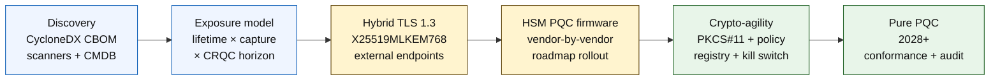

# 2026 양자내성 뱅킹 지수: 양자내성 암호, QKD, 암호 민첩성, 수집 후 복호화 위험

<!-- lead-start: manual -->
<aside class="post-lead" aria-label="기사 요약">

<strong>TL;DR.</strong> 2026년의 양자내성 뱅킹은 두 곡선의 교차점에서 마감일이 결정되는 실행 프로그램입니다. 하나는 기관이 오늘 보유한 데이터의 기밀 유지 수명, 다른 하나는 암호학적으로 유의미한 양자 컴퓨터(CRQC)의 도래 시점입니다. NIST FIPS 203 / 204 / 205는 2024년 8월에 최종 확정되었고, CNSA 2.0은 미국 연방의 최종 도달 시점을 2033년으로 설정했으며, 수집 후 복호화는 이미 장기 데이터에서 벌어지고 있습니다. 이사회용 양자 스코어카드는 인벤토리 완전성, HNDL 노출, NIST 마이그레이션 진척도, 암호 민첩성 준비도라는 네 가지 정확한 백분율을 추적합니다.

<strong>핵심 시사점</strong>

<ul class="post-lead-takeaways">
  <li><strong>알고리즘 논쟁은 2024년 8월 13일에 종결되었습니다.</strong> 답은 ML-KEM (FIPS 203), ML-DSA (FIPS 204), SLH-DSA (FIPS 205)입니다. 2026년에도 "승자 가리기" 내부 평가를 돌리는 은행은 18개월 뒤처져 있습니다.</li>
  <li><strong>수집 후 복호화는 이미 적용되고 있습니다.</strong> 기밀 유지 수명이 신뢰할 수 있는 CRQC 도래 시점을 넘기는 자산 — 30년 만기 모기지, 생명보험 인수 자료, MiFID II / GDPR 거래 녹취, M&amp;A 보유 아카이브 — 은 CRQC가 발표될 때가 아니라 지금 하이브리드 양자내성 키 캡슐화로 이전해야 합니다.</li>
  <li><strong>인벤토리는 성숙도의 관문입니다.</strong> 암호 자산 명세서(CBOM) — 프로토콜, 라이브러리, 인증서, HSM 파티션, 벤더 의존성, 애플리케이션 소유자, 데이터 분류 수명 — 는 이후 모든 작업의 전제 조건입니다. 측정 지표는 커버리지가 아니라 최신성입니다.</li>
  <li><strong>하이브리드 TLS 1.3은 2026년의 표준 배포입니다.</strong> X25519MLKEM768 하이브리드 키 셰어는 Chrome / Firefox / Cloudflare / Akamai가 오늘 실제로 협상하는 방식입니다. 순수 ML-KEM TLS는 HSM 펌웨어와 CA 준비를 기다려야 합니다.</li>
  <li><strong>암호 민첩성은 영속적인 산출물입니다.</strong> PKCS#11 추상화, 레이블링된 키, 비즈니스 서비스를 허용 알고리즘 집합에 매핑하는 정책 레지스트리. 이것이 없으면 다음 알고리즘 전환은 또 한 번의 다년간 프로그램이 됩니다.</li>
</ul>
</aside>
<!-- lead-end -->

2026년의 양자내성 뱅킹은 추측이 아니라 운영 마이그레이션의 문제입니다. NIST는 첫 세 가지 양자내성 암호 표준을 최종 확정했고, 은행은 이제 RSA, ECC, TLS, 서명, HSM, 인증서, 결제 채널, 아카이브, 장기 기밀 데이터에 의존하는 시스템이 무엇인지 파악해야 합니다. 지수가 던지는 질문은 단순합니다. 위협이 운영화되기 전에 기관이 암호를 교체할 수 있는가?

---

> **요약 / 핵심 시사점**
>
> - **NIST 표준은 이제 구체적입니다.** FIPS 203은 키 캡슐화를 위한 ML-KEM을, FIPS 204는 서명을 위한 ML-DSA를, FIPS 205는 무상태 해시 기반 서명 표준으로 SLH-DSA를 정의합니다.
> - **인벤토리는 첫 번째 성숙도 관문입니다.** 은행은 찾을 수 없는 것을 마이그레이션할 수 없습니다. 인증서, 키, 프로토콜, 애플리케이션, 벤더, HSM, API, 아카이브, 임베디드 시스템을 모두 매핑해야 합니다.
> - **암호 민첩성은 영속적인 목표입니다.** 목표는 일회성 알고리즘 교체가 아니라 애플리케이션 전체를 재설계하지 않고도 암호 기본요소를 변경할 수 있는 능력입니다.
> - **장기 데이터는 시급성을 바꿉니다.** 수집 후 복호화 위험은 오늘 포착된 데이터가 충분히 오래 가치를 유지하는 한 나중에 읽힐 수 있다는 뜻입니다.
> - **QKD는 특수한 보완재입니다.** 양자 키 분배는 가장 가치가 높은 채널에는 관련성이 있지만, 기관 전체의 PQC 마이그레이션을 대체하지는 않습니다.
>
---

## 2026년이 이 지수가 중요한 해인 이유

2024-2025년의 세 가지 변화가 양자내성 작업을 연구 관찰 대상이 아니라 측정 가능한 은행 프로그램으로 만들었습니다. 첫째, NIST는 2024년 8월 13일에 주요 양자내성 표준을 최종 확정했습니다. [FIPS 203 (ML-KEM) ⧉](https://nvlpubs.nist.gov/nistpubs/FIPS/NIST.FIPS.203.pdf "FIPS 203 — Module-Lattice-Based Key-Encapsulation Mechanism"), [FIPS 204 (ML-DSA) ⧉](https://nvlpubs.nist.gov/nistpubs/FIPS/NIST.FIPS.204.pdf "FIPS 204 — Module-Lattice-Based Digital Signature Standard"), [FIPS 205 (SLH-DSA) ⧉](https://nvlpubs.nist.gov/nistpubs/FIPS/NIST.FIPS.205.pdf "FIPS 205 — Stateless Hash-Based Digital Signature Standard")입니다. 알고리즘 선정 논쟁은 그 날 종결되었고, 2026년에도 "어느 방식이 이기는가" 내부 워크스트림을 돌리는 은행은 18개월 뒤처져 있습니다.

둘째, [NSA의 CNSA 2.0 ⧉](https://media.defense.gov/2022/Sep/07/2003071834/-1/-1/0/CSA_CNSA_2.0_ALGORITHMS_.PDF "Commercial National Security Algorithm Suite 2.0")은 미국 연방의 최종 도달 시점을 2033년으로 설정하고, 소프트웨어·펌웨어 서명은 2027년, 브라우저와 운영체제는 2030년부터 중간 컷오프를 두었습니다. FedNow, 미 재무부 거래, 연방 고객 계좌 등 미국 연방 카운터파티 노출이 있는 은행은 연방 데이터를 다루는 시스템에 한해 이 경계 안에 들어갑니다. 시계는 더 이상 추상적이지 않습니다.

셋째, [수집 후 복호화(HNDL) ⧉](https://csrc.nist.gov/Projects/post-quantum-cryptography "NIST Post-Quantum Cryptography programme")는 시급성을 정당화하는 핵심 리스크 논거입니다. 정교한 적대 세력은 이미 주요 금융 중심지에서 TLS로 보호되는 결제 메시지, SWIFT 봉투, KYC 문서, 장기 아카이브 암호문을 수집하고 있습니다. 2026년에 포착된 데이터는 복호화 시점에 여전히 기밀로 유지되기만 하면 됩니다. 30년 만기 모기지, 생명보험 인수 자료, MiFID II / GDPR 거래 녹취, M&A 보유 아카이브의 경우 그 창은 암호학적으로 유의미한 양자 컴퓨터(CRQC)에 대한 모든 신뢰할 만한 추정치를 훌쩍 넘깁니다. 적대 세력은 오늘 양자 컴퓨터가 필요한 것이 아닙니다. 데이터가 가치를 잃기 전에 한 대를 확보하면 됩니다.

양자내성 뱅킹 지수는 그 교차점이 도래하기 전에 기관이 마이그레이션을 출시할 수 있는지를 측정합니다. 이제 일은 "마이그레이션을 할 것인가"가 아니라 "방어 가능한 일정 안에 마이그레이션을 완료하는가"입니다.

## 2026 지수 아키텍처

| 지수 레이어 | 2026년 방향 | 준비도 지표 | 잘못 다룰 때의 리스크 |
|---|---|---|---|
| **인벤토리** | 암호 자산, 프로토콜, 인증서, 벤더, 데이터 분류 매핑 | 인벤토리 완료 비율 | 양자 취약 의존성의 미식별 |
| **노출** | 기밀 유지 수명과 거래 중요도로 시스템 분류 | 가치·수명 기준 고위험 자산 | 우선순위 잘못된 마이그레이션 |
| **마이그레이션** | NIST 표준에 맞춘 하이브리드·PQC 대비 패턴 채택 | ML-KEM·ML-DSA 준비도 | 마감 임박 시 비상 재플랫폼화 |
| **암호 민첩성** | 애플리케이션 로직과 암호 기본요소 분리 | 정책 통제 가능한 암호 적용 범위 | 자산 전반에 하드코딩된 알고리즘 |
| **보증** | 상호운용성, 성능, HSM 지원, 인증서, 벤더 준비도 테스트 | 테스트 통과율과 예외 백로그 | 채널 중단 또는 취약한 폴백 통제 |

### 이사회용 양자 스코어카드

신뢰할 만한 양자 준비도 스코어카드는 단순한 프로젝트 상태가 아니라 정확한 백분율을 추적해야 합니다.

1. **인벤토리 완전성:** 암호 자산 명세서(CBOM)가 완전히 매핑된 1티어 애플리케이션의 비율.
2. **HNDL 노출:** 하이브리드 양자내성 키 캡슐화 없이 네트워크를 통해 전송되는 장기 기밀 데이터(예: PII, 영업비밀)의 규모.
3. **NIST 마이그레이션 진척도:** FIPS 203 (ML-KEM)과 FIPS 204 (ML-DSA) 표준으로 이전된 비대칭 암호 키와 디지털 서명의 비율.
4. **암호 민첩성 준비도:** 코드 재컴파일 없이 중앙 정책으로 암호 알고리즘을 교체할 수 있는 핵심 시스템의 비율.

## 추적해야 할 현재 신호

| 신호 | 은행에 주는 의미 | 출처 |
|---|---|---|
| **FIPS 203 ML-KEM** | 일반 암호 키 수립을 위한 NIST 기본 표준 | [NIST ⧉](https://www.nist.gov/news-events/news/2024/08/nist-releases-first-3-finalized-post-quantum-encryption-standards "First three finalized post-quantum encryption standards") |
| **FIPS 204 ML-DSA** | 디지털 서명을 위한 NIST 기본 표준 | [NIST ⧉](https://www.nist.gov/news-events/news/2024/08/nist-releases-first-3-finalized-post-quantum-encryption-standards "First three finalized post-quantum encryption standards") |
| **FIPS 205 SLH-DSA** | 해시 기반 서명 대안과 백업 설계 | [NIST ⧉](https://www.nist.gov/news-events/news/2024/08/nist-releases-first-3-finalized-post-quantum-encryption-standards "First three finalized post-quantum encryption standards") |
| **즉시 통합 권고** | NIST는 전면 통합에 시간이 걸리므로 관리자에게 표준 통합을 즉시 시작하라고 명시 | [NIST ⧉](https://www.nist.gov/news-events/news/2024/08/nist-releases-first-3-finalized-post-quantum-encryption-standards "First three finalized post-quantum encryption standards") |
| **은행 양자 프로그램 확대** | 주요 은행이 PQC 전환을 준비하면서 양자 기술을 탐색 중 | [Quantum Insider ⧉](https://thequantuminsider.com/2026/03/27/15-plus-global-banks-probing-the-wonderful-world-of-quantum-technologies/ "Overview of global banks exploring quantum technologies") |

## 마이그레이션은 암호 자산 원장에서 시작합니다

마이그레이션 순서는 이미 잘 알려져 있습니다. 각 관문은 다음 단계를 끌어가는 증거를 만들어내고, 관문을 건너뛰거나 압축하면 지수 아키텍처의 실패 칸에 등장하는 비상 재플랫폼화 위험이 발생합니다.

첫 번째 산출물은 새로운 알고리즘이 아니라 암호 자산 명세서(CBOM)입니다. 은행은 비즈니스 서비스와 알고리즘, 라이브러리, 인증서, 키 길이, HSM, 데이터 수명, 벤더, 운영 책임자를 연결하는 살아 있는 인벤토리가 필요합니다. 이 원장이 없으면 양자내성 마이그레이션은 추측이 됩니다.

CBOM 레코드 세트는 각 암호 기본요소에 대해 다음 항목을 담아야 합니다. 프로토콜 또는 인터페이스(TLS 1.3, IPsec, SSH, 자체 결제 메시지 포맷), 알고리즘과 매개변수 집합(RSA-2048, ECDH P-256, ML-KEM-768, ML-DSA-65), 라이브러리와 버전(OpenSSL 3.4, BoringSSL 커밋 해시, 벤더 SDK 빌드), 하드웨어 경계(HSM 파티션, TPM, 보안 엔클레이브 또는 없음), 해당 시 인증서 신원, 애플리케이션 소유자, 데이터 분류 수명. 2025-2026년 운영 환경에 도착하는 도구 — IBM Quantum Safe Inventory, 오픈소스 [CycloneDX CBOM 명세 ⧉](https://cyclonedx.org/capabilities/cbom/ "CycloneDX Cryptography Bill of Materials"), CryptoNext / Sandbox / PQShield의 엔터프라이즈 스캐너 — 는 기존 CMDB 파이프라인과 통합됩니다. 어느 것도 단독으로는 완전하지 않습니다. 벤더 도구와 전담 인력이 있어도 CBOM 구축 사이클은 12-18개월로 잡아야 합니다.

추적해야 할 지표는 커버리지가 아니라 최신성입니다. 두 달 묵은 CBOM은 보안팀에 무엇이 마이그레이션되었는지에 대한 잘못된 확신을 주기 때문에 CBOM이 없는 것보다 더 나쁩니다.

## 하이브리드 우선, 민첩성은 상시

대부분의 은행은 한 번에 모든 것을 바꾸지 않습니다. 현실적인 패턴은 벤더, 프로토콜, 인증서, 운영 도구가 성숙해 가는 동안 기존 방식과 양자내성 메커니즘이 함께 돌아가는 하이브리드 배포입니다. 장기 목표는 암호 민첩성입니다. 즉, 비즈니스 애플리케이션을 다시 만들지 않고도 변경할 수 있는 정책 통제 방식의 암호 선택지입니다.

[인터랙티브 컴포넌트 삽입: 수집 후 복호화(HNDL) 리스크 계산기 — 경영진이 데이터 보존 기간과 추정된 양자 도래 시점을 슬라이더로 입력해 노출 창을 확인하는 도구.]

> **핵심 통찰:** 데이터를 10년간 기밀로 유지해야 하고 암호학적으로 유의미한 양자 컴퓨터(CRQC)가 7년 뒤에 도래한다면, 마이그레이션 마감은 7년 뒤가 아니라 3년 전이었습니다.

실무에서 이는 외부에 노출되는 엔드포인트에 하이브리드 `X25519MLKEM768` 키 셰어를 적용한 TLS 1.3을 의미합니다(Chrome / Firefox / Cloudflare / Akamai는 오늘 모두 이를 지원합니다). HSM과 CA 인프라가 따라잡을 때까지는 기존 서명 체인을 유지하고, 비즈니스 애플리케이션을 재컴파일하지 않고도 정책 레지스트리가 알고리즘을 교체할 수 있는 PKCS#11 추상화 계층을 둡니다. 다음 알고리즘 전환(언제 일어날지가 아니라 일어나는 것이 확정)이 6주짜리 교체 작업이 될지 또 한 번의 7년짜리 프로그램이 될지를 가르는 것이 바로 암호 민첩성입니다.

## QKD가 자리하는 곳

양자 키 분배는 특히 금융시장 인프라, 중앙은행 연계, 극도로 민감한 기관 흐름 등 고민감도 채널 옵션으로 지수에 포함됩니다. 엔터프라이즈 마이그레이션을 지연시키는 명분이 아니라 PQC의 보완재로 취급해야 합니다.

## 은행 유형별 시사점

### 글로벌 시스템적 중요은행

어려운 문제는 규모입니다. 수만 개의 TLS 엔드포인트, 수백 개의 HSM 파티션, 수십 개의 내부 인증기관, 암호 기본요소가 내장된 수백 개의 비즈니스 애플리케이션, 그리고 은행이 수정할 수 없는 벤더 SDK가 있습니다. 투자해야 할 대상은 또 다른 파일럿이 아닙니다. CBOM 도구, 모든 신규 빌드에 연결되는 PKCS#11 추상화 계층, PQC 펌웨어에서 한 벤더를 선도로 삼고 나머지에 대해서는 다년간의 잔여 작업을 받아들이는 HSM 통합 계획, 그리고 FIPS 203 / 204 / 205 마이그레이션이 완료된 뒤에도 오래 남는 영속적인 암호 민첩성 표면이 되는 정책 레지스트리입니다.

### 거래·기업 은행

마이그레이션 범위는 G-SIB 단계보다 좁지만 HNDL 노출은 첨예합니다. SWIFT 국경 간 메시징, 기업 카운터파티 PII를 담은 구조화 결제 데이터, 무역금융 문서를 담은 문서 교환 플랫폼, 장기 보유 보고 아카이브가 그렇습니다. 모든 고객 대면 엔드포인트에 하이브리드 TLS를, 보유 아카이브에는 저장 데이터 PQC를 우선 적용하십시오. HSM 벤더의 책임을 강하게 압박하십시오. 기업 뱅킹 플랫폼 팀은 대개 도매 기술 팀에는 없는 직접적인 조달 레버리지를 가지고 있습니다.

### 지역 은행

암호 민첩성 기본요소가 이미 들어 있는 벤더 스택을 구매하십시오. CBOM을 공개하고 ML-KEM / ML-DSA 지원 일정을 약속하는 벤더의 코어 뱅킹 플랫폼을 선택하십시오. 벤더의 HSM 로드맵이 은행의 마이그레이션 마감과 부합하는지 검증하십시오. 암호 민첩성을 처음부터 구축하는 데 필요한 엔지니어링 역량은 다년간 소요됩니다. 그 비용은 벤더가 다수 고객에 분산해 부담하고 은행은 그 혜택을 상속받습니다. 합당한 내부 작업 범위는 검증 작업입니다. 즉, 벤더의 주장이 기관의 MRM 절차를 통과하는지 확인하는 일입니다.

### 핀테크·PSP·인프라 제공업체

2026년에 은행에 납품하는 벤더에 대한 경쟁 질문은 "PQC를 지원하는가"가 아닙니다. "당신의 플랫폼에 대한 CycloneDX CBOM, HSM 벤더 지원 매트릭스, 그리고 알고리즘 교체 SLA를 문서로 제시할 수 있는가"입니다. "예"라고 답하는 벤더는 2026-2027년 1티어 조달 관문을 통과합니다. 그러지 못하는 벤더는 그렇게 할 수 있는 경쟁사에 재계약을 빼앗깁니다.

## 결론

2026년의 양자내성 뱅킹은 연구 관찰 대상이 아니라, 기관이 오늘 보유한 데이터의 기밀 유지 수명과 암호학적으로 유의미한 양자 컴퓨터의 도래 시점이라는 두 곡선의 교차점에서 마감일이 결정되는 실행 프로그램입니다. 2030년에 감독당국과 카운터파티에게 신뢰할 만하게 보이는 기관은 2024년에 CBOM 구축을 시작했고, 2026년 말까지 모든 외부 엔드포인트에 하이브리드 TLS를 배포했으며, 첫날부터 모든 신규 빌드에 암호 민첩성을 설계해 넣은 기관입니다. 그렇게 하지 못한 기관은 적대 세력이 오늘 수집하고 있는 데이터에 대한 마이그레이션 창이 이미 닫혔는지 여부를 뒤늦게 알게 될 것입니다.

마이그레이션을 다른 모든 운영 프로그램과 같은 방식으로 측정하십시오. 범위는 알려져 있고, 순서는 우선순위가 매겨져 있으며, 마감은 약속되어 있고, 예외 등록부는 정직합니다. 자기 자산을 더 깊이 들여다볼수록 마이그레이션 창은 더 좁게 느껴집니다.

## 자주 묻는 질문

**은행이 가장 먼저 인벤토리화해야 할 대상은 무엇인가요?**

외부에 노출된 TLS, 결제 채널, 고객 인증, 은행 간 연계, HSM 기반 서비스, 장기 아카이브, 그리고 유효 수명이 긴 기밀 데이터를 다루는 시스템부터 시작하십시오.

**PQC는 사이버보안 이슈일 뿐인가요?**

아닙니다. 결제, 신원, 법적 증거, 거래 서명, 고객 신뢰, 데이터 보유, 벤더 관리, 운영 회복력 전반에 영향을 미칩니다.

**암호 민첩성이란 무엇을 뜻하나요?**

암호 민첩성은 하드코딩된 애플리케이션 변경이 아니라 정책과 플랫폼 통제를 통해 암호 기본요소를 변경할 수 있는 능력을 말합니다.

**은행은 더 많은 표준을 기다려야 하나요?**

아닙니다. NIST는 전면 통합에 시간이 걸리므로 첫 최종 표준의 통합을 시작하라고 관리자에게 권고했습니다.

## 참고문헌

- NIST, (2026). [First three finalized post-quantum encryption standards ⧉](https://www.nist.gov/news-events/news/2024/08/nist-releases-first-3-finalized-post-quantum-encryption-standards "First three finalized post-quantum encryption standards").

<!-- enrich-start -->
<aside class="author-card" aria-label="저자 소개"><strong class="author-card-name"><a href="/about/index.html">Sebastien Rousseau</a></strong>응용 AI, 결제 인프라, 토큰화 자금, ISO 20022, 양자내성 보안, 클라우드 네이티브 금융 서비스, 규제 디지털 시장에 관해 집필하는 시니어 뱅킹 기술 전문가입니다.HSBC 상업·투자은행, PayPal, Barclays, Shazam, AKQA, Virgin Group을 아우르는 20년 이상의 경력. <a href="/about/index.html">전체 프로필</a> &middot; <a href="https://www.linkedin.com/in/sebastienrousseau/" rel="external noopener">LinkedIn</a> &middot; <a href="https://github.com/sebastienrousseau" rel="external noopener">GitHub</a></aside>

최종 검토 <time datetime="2026-06-04">2026-06-04</time>.

<aside class="related-posts" aria-labelledby="related-heading">
<h2 id="related-heading" class="related-heading">관련 읽을거리</h2>

<article class="related-card"><footer class="related-body"><h3><a href="https://sebastienrousseau.com/2026-05-31-post-quantum-payments-infrastructure-replace-rather-than-retrofit-2026">양자내성 결제 인프라: 개조가 아니라 교체</a></h3>
<time datetime="2026-05-31">2026-05-31</time>
</footer></article>
<article class="related-card"><footer class="related-body"><h3><a href="https://sebastienrousseau.com/2026-05-18-quantum-cryptography-standards-developments-2026">2026년 양자 암호 리셋: PQC 표준, QKD 보증, 그리고 은행이 미룰 수 없는 마이그레이션 작업</a></h3>
<time datetime="2026-05-18">2026-05-18</time>
</footer></article>
<article class="related-card"><footer class="related-body"><h3><a href="https://sebastienrousseau.com/2026-05-14-securing-the-ledger-post-quantum-migration-corporate-finance">원장 보호: 기업 금융을 위한 양자내성 마이그레이션 이사회 가이드</a></h3>
<time datetime="2026-05-14">2026-05-14</time>
</footer></article>

</aside>
<!-- enrich-end -->
