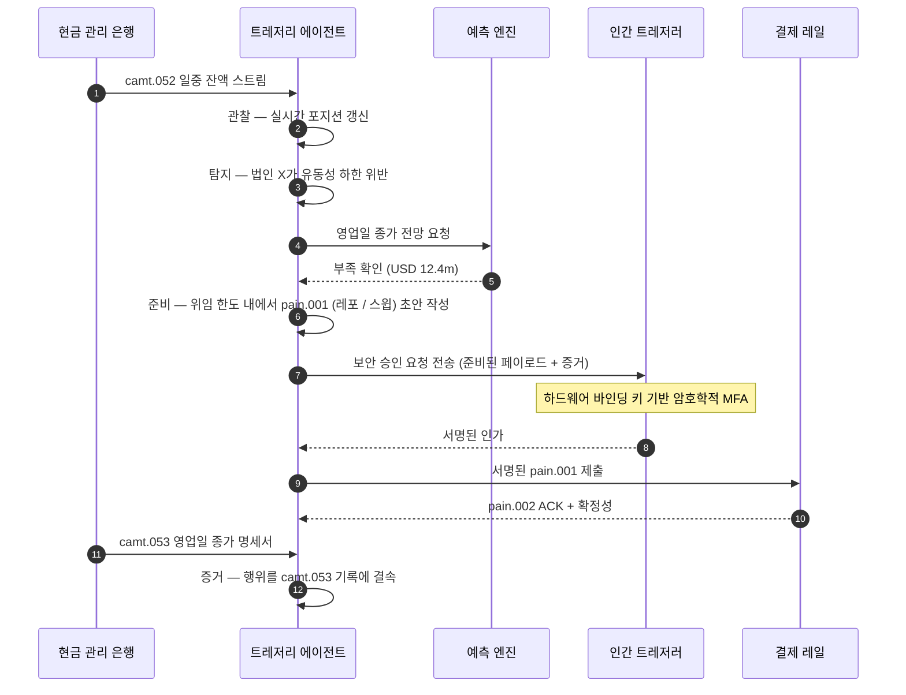

# 2026년 자율 트레저리 지수: 에이전트형 트레저리, 프로그래밍 가능한 유동성, 토큰화 예금, 실시간 현금 통제

<!-- lead-start -->
<aside class="post-lead" aria-label="기사 요약">

<strong>요약.</strong> 2026년 자율 트레저리 지수 — 에이전트형 워크플로우, 프로그래밍 가능한 유동성 커버리지, 토큰화 예금 통합, 실시간 결제 오케스트레이션, 자동화된 현금 통제를 하나의 운영 모델 패브릭으로 측정합니다.

<strong>핵심 시사점</strong>

<ul class="post-lead-takeaways">
  <li><strong>트레저리는 실시간 운영 체계로 진화하고 있습니다.</strong> 정적 현금 예측과 배치 스윕은 더 이상 측정 단위가 아니며, 실시간 데이터 기반의 에이전트형 워크플로우가 그 자리를 대신합니다.</li>
  <li><strong>프로그래밍 가능한 유동성이 이제 실현 가능합니다.</strong> 토큰화 예금과 실시간 레일이 결합하여, 이벤트 단위 유동성 공급을 분기 단위 이니셔티브가 아닌 워크플로우 기본 단위로 만듭니다.</li>
  <li><strong>토큰화 예금은 트레저러의 선호 디지털 화폐입니다.</strong> 은행 화폐의 경제성, 프로그래밍 가능성, 일중 확실성을 제공하면서도 스테이블코인의 발행자 리스크와 준비금 문제에서 자유롭습니다.</li>
  <li><strong>컨트롤 플레인이 새로운 감사 영역입니다.</strong> 위임, 한도, 수동 오버라이드 경로, 취소 증거는 행위별 수동 승인이 아닌 플랫폼 기본 단위로 작동해야 합니다.</li>
  <li><strong>CFO 스코어카드는 분기 단위가 아닌 의사결정 단위입니다.</strong> 자금 비용, 일중 유동성 버퍼 감소, FX 효율성, 예측 정확도가 워크플로우 속도로 측정됩니다.</li>
</ul>

<strong>관련 읽을거리:</strong> <a href="https://sebastienrousseau.com/2026-05-25-programmable-liquidity-ai-tokenised-deposits-real-time-treasury-2026/index.html">2026년 프로그래밍 가능한 유동성: AI, 토큰화 예금, 실시간 트레저리 오케스트레이션</a>, <a href="https://sebastienrousseau.com/2026-05-21-tokenised-deposits-banking-services-status-2026/index.html">2026년 토큰화 예금: 뱅킹 서비스, 스테이블코인 경쟁, 프로그래밍 가능한 상업은행 화폐의 현황</a>.

</aside>
<!-- lead-end -->

자율 트레저리는 에이전트형 AI, 도매 결제, 토큰화 예금, 실시간 유동성이 자연스럽게 만나는 지점입니다. 2026년의 최고 수준 트레저리 아키텍처는 단순히 현금을 예측하는 데 그치지 않고, 계좌·통화·레일·결제 자산 전반에 걸쳐 제한된 유동성 행위를 권고하고, 설명하며, 궁극적으로 실행하게 됩니다.

---

> **이사회 요약 / 핵심 시사점**
>
> - **트레저리는 보고에서 통제로 이동하고 있습니다.** 실시간 잔액, 예측, 결제 상태, 유동성 이동이 하나의 워크플로우로 통합되고 있습니다.
> - **에이전트형 AI는 새로운 트레저리 인터페이스를 만듭니다.** 에이전트는 포지션을 모니터링하고, 이상치를 표면화하며, 자금 조달 행위를 준비하고, 정의된 위임 범위 내에서 의사결정을 에스컬레이션할 수 있습니다.
> - **프로그래밍 가능한 화폐가 현금 레그를 바꿉니다.** 토큰화 예금과 도매 CBDC 실험은 원자적 결제, 조건부 결제, 상시 유동성에 새로운 가능성을 열어줍니다.
> - **지수는 권한을 측정해야 합니다.** 핵심 질문은 에이전트가 행위를 제안할 수 있는지가 아니라, 권한, 한도, 승인, 증거가 명확한지입니다.
> - **트레저리 가치는 측정 가능합니다.** 절감된 유동성, 감소된 수작업 조사, 회피된 결제 실패, 확보된 운전자본이 성공의 척도가 되어야 합니다.
>
---

## 2026년이 이 지수가 중요한 해인 이유

스탠포드 AI 지수는 빠르게 움직이는 기술 분야를 측정 가능한 대상으로 다룬다는 점에서 유용합니다. 연구 산출물, 기술 성능, 책임 있는 배포, 경제성, 산업별 도입, 정책, 대중 인식이 하나의 프레임으로 정리됩니다 ([Stanford HAI ⧉](https://hai.stanford.edu/ai-index/2026-ai-index-report "2026 AI 지수 보고서")). 은행과 금융기관도 이제 인프라에 동일한 규율을 적용해야 합니다. 에이전트형 AI, 양자내성 보안, 클라우드 네이티브 회복탄력성, 도매 결제는 더 이상 별개의 혁신 트랙이 아니라 하나의 운영 모델로 수렴하고 있습니다.

은행의 실질적 질문은 각 영역의 중요성이 아닙니다. 모든 영역에 걸친 준비도를 동시에 측정할 수 있는지가 관건입니다. 은행이 에이전트형 AI를 배포하더라도 암호화 체계가 마이그레이션 준비를 갖추지 못했다면 여전히 취약합니다. 클라우드 플랫폼을 현대화하더라도 결제 데이터가 구조화되지 않았다면 실패할 수 있습니다. 토큰화 파일럿을 운영하더라도 결제, 유동성, 신원, 감사 계층이 함께 설계되지 않았다면 시스템 리스크를 초래할 수 있습니다.

## 2026년 지수 아키텍처

| 지수 계층 | 2026년 방향 | 준비도 지표 | 부적절히 다룰 경우의 리스크 |
|---|---|---|---|
| **가시성** | 계좌, 결제, 유동성, 익스포저 데이터 통합 | 실시간 현금 포지션 커버리지 | 파편화된 현금 가시성 |
| **예측** | AI를 활용한 잔액·플로우·자금 조달 수요 예측 | 예측 정확도와 예외율 | 빈약한 데이터에 대한 그릇된 확신 |
| **자율성** | 에이전트에게 권고와 행위를 위한 제한된 권한 부여 | 위임 커버리지와 승인 품질 | 인가되지 않거나 설명되지 않는 행위 |
| **프로그래밍 가능성** | 가치가 있는 경우 토큰화 예금과 스마트 조건 활용 | 조건부 결제와 원자적 결제 활용 사례 | 기술 주도의 트레저리 파일럿 |
| **통제** | 한도, 제재, FX, 유동성, 감사 통제 내재화 | 트레저리 행위별 통제 증거 | 실행 이후의 수작업 거버넌스 |

## 추적해야 할 현재 신호

| 신호 | 은행에 의미하는 바 | 출처 |
|---|---|---|
| **금융 서비스 내 에이전트형 AI 도입률 52%** | 트레저리는 이제 거버넌스가 적용된 플랫폼을 통해 에이전트형 워크플로우를 흡수할 수 있음 | [Cambridge CCAF ⧉](https://www.jbs.cam.ac.uk/faculty-research/centres/alternative-finance/publications/2026-global-ai-in-financial-services-report/ "2026 글로벌 금융 서비스 AI 보고서") |
| **Project Agorá 조건부 결제** | 토큰화는 조건부 및 상시 결제 역량을 가능하게 할 수 있음 | [BIS ⧉](https://www.bis.org/about/bisih/topics/fmis/agora.htm "Project Agorá") |
| **Bank of England Digital Securities Sandbox** | DLT로 발행된 채권과 주식이 「증권·자금 동시결제(DvP)」 기반으로 결제됩니다 — 자산 레그와 현금 레그(도매 CBDC 또는 토큰화 상업은행 예금)가 동일한 원자적 거래 안에서 결제되어, 원금 거래상대방 리스크가 제거됩니다 | [Bank of England ⧉](https://www.bankofengland.co.uk/financial-stability/digital-securities-sandbox "Digital Securities Sandbox") |
| **SWIFT 구조화 주소 마감 시한** | 트레저리 데이터는 원천에서 올바르게 캡처되어야 함 | [SWIFT ⧉](https://www.swift.com/news-events/news/iso-20022-milestone-november-2026-unstructured-addresses-be-removed "ISO 20022 2026년 11월 구조화 주소 마일스톤") |
| **대형 금융기관이 AI 가치 측정에 어려움을 겪음** | 트레저리 자동화는 견고한 경제 지표가 필요함 | [Cambridge CCAF ⧉](https://www.jbs.cam.ac.uk/faculty-research/centres/alternative-finance/publications/2026-global-ai-in-financial-services-report/ "2026 글로벌 금융 서비스 AI 보고서") |

## 트레저리 에이전트 위임

트레저리 에이전트는 범용 어시스턴트로 설계되어서는 안 됩니다. 위임이 필요합니다. 계좌 관찰, 예외 탐지, 자금 부족 예측, 행위 준비, 승인 요청, 한도 내 실행, 증거 산출이 그것입니다. 각 단계마다 서로 다른 권한 모델이 적용되어야 합니다.

제어 루프는 관찰(Observe) → 탐지(Detect) → 예측(Forecast) → 준비(Prepare) → 승인 요청(Request Approval) 순으로 작동한 뒤 정지합니다. 에이전트는 결코 단독으로 암호학적 인가 경계를 넘지 않습니다. 아래 다이어그램은 하나의 완전한 사이클을 따라갑니다. 수백만 달러 규모의 일중 유동성 부족이 `camt.052` 텔레메트리에서 표면화되고, 에이전트가 영업일 종가 포지션을 예측한 뒤 레포 또는 사내 스윕을 완성된 형태의 `pain.001`로 준비하며, 이를 하드웨어 바인딩 키 기반의 다중 인증 암호학적 서명을 위해 인간 트레저러에게 전달합니다. 이어 에이전트는 서명된 페이로드를 제출하고, 확정성은 `pain.002` ACK로 안착하며, 그 다음의 공식 기록은 `camt.053`이 됩니다.

경계 자체가 핵심입니다. 실제 자금을 이동시키는 모든 행위는 에이전트가 단독으로 충족할 수 없는 암호학적 게이트 뒤에 놓여 있습니다.

## 프로그래밍 가능한 유동성

프로그래밍 가능한 유동성은 조건에 따라 가치를 이동시키는 역량입니다. 임계값이 위반되면, 담보가 적격하면, 거래상대방이 스크리닝을 통과하면, 결제 완결성이 확보되면, 또는 일중 유동성 버퍼가 너무 낮으면 작동합니다. 토큰화 예금과 도매 결제 플랫폼이 이러한 패턴을 더 실용적으로 만듭니다.

프로그래밍 가능성이 표준 이탈을 의미하지는 않습니다. 실행 경로는 `pain.001`, 즉 ISO 20022 고객 계좌이체 개시 메시지입니다. 에이전트가 준비한 행위는 기업 ERP가 사용하는 것과 동일한 채널을 통해 은행에 라우팅되는 완성된 형태의 `pain.001` 페이로드이며, 동일한 스키마로 검증되고, 동일한 사기 및 제재 엔진으로 스코어링되며, 동일한 `pain.002` 상태 보고서로 확인됩니다. 조건성 계층(임계값, 담보 적격성, 확정성 가용성, 버퍼 하한)은 메시지 위쪽에 자리 잡습니다. 즉, `pain.001`이 *전송될지 여부*를 통제할 뿐, *어떤 형태*를 띠는지를 통제하지는 않습니다. 조건을 표현하기 위해 별도의 페이로드를 고안하는 트레저리 플랫폼은 은행이 소비 가능한 경로에서 이탈하여 양자 간 통합으로 되돌아가게 됩니다.

## 트레저리 컨트롤 룸

운영 모델은 컨트롤 룸처럼 보여야 합니다. 포지션, 예측, 결제 상태, 한도 사용, 예외, 승인, 증거가 하나의 인터페이스에 통합되어야 합니다. 지수는 팀이 이메일, 스프레드시트, 은행 포털, 분리된 대시보드를 짜맞춰야 하는 트레저리 스택에 불이익을 주어야 합니다.

해당 인터페이스 뒤의 데이터 플레인은 ISO 20022 현금 관리입니다. 일중 포지션은 `camt.052`, 즉 은행-고객 계좌 보고서로, 모든 현금 관리 은행에서 에이전트의 관찰 계층으로 은행이 게시하는 주기에 맞춰 스트리밍됩니다(티어1 GTB 제공자의 경우 분 단위, 롱테일의 경우 사이클 종료 단위). 영업일 종가 대사는 `camt.053`, 즉 은행-고객 명세서로, 에이전트의 예측이 다음 날 아침 평가되는 감사 가능한 기록입니다. PDF 명세서를 읽거나 은행 포털을 스크린 스크레이핑하는 트레저리 플랫폼은 지수의 「4단계」를 충족할 수 없습니다. 행동에 옮길 시간 안에 예측 루프가 마감되려면, 일중 텔레메트리가 구조화된 `camt.052`로 도착해야 합니다.

## 은행 유형별 시사점

### 글로벌 시스템상 중요 은행(G-SIB)

글로벌 은행은 이 지수를 전사 아키텍처 스코어카드로 다루어야 합니다. 우선순위는 또 하나의 개념 증명이 아니라, 자율 워크플로우, 암호화 마이그레이션, 클라우드 의존성, 결제 현대화를 하나의 리스크·가치 체계로 거버넌스할 수 있다는 증거입니다.

### 트랜잭션 은행과 기업 은행

트랜잭션 은행은 도매 결제, 구조화 데이터, 유동성, 토큰화 예금, 에이전트형 트레저리 서비스에 집중해야 합니다. 가장 가치 있는 고객 제안은 단순한 빠른 자금 이동이 아니라, 조사 건수가 줄고 운전자본 가시성이 향상되는 설명 가능하고 감사 가능하며 프로그래밍 가능한 자금 이동입니다.

### 지역 은행

지역 은행은 프로그램 난립을 피하기 위해 이 지수를 활용해야 합니다. 모든 프런티어를 선도할 필요는 없지만, AI 거버넌스, 양자 이후 인벤토리, 클라우드 출구 증거, 결제 데이터 준비도에 대한 신뢰할 수 있는 입장이 필요합니다.

### 핀테크, PSP, 인프라 제공자

핀테크와 인프라 제공자는 측정 가능한 은행 준비도에 제품 로드맵을 정렬해야 합니다. 가장 우수한 제안은 통합 리스크를 줄이고, 증거를 강화하며, 복잡한 인프라를 은행이 더 쉽게 거버넌스할 수 있게 합니다.

## 결론

지수형 보고서의 가치는 파편화된 기술 의제를 측정 가능한 운영 모델로 전환한다는 점입니다. 2026년 금융 인프라의 승자는 파일럿이 가장 많은 기관이 아닙니다. 자율성, 보안, 회복탄력성, 결제, 경제성, 거버넌스 전반에 걸친 준비도를 동시에 입증할 수 있는 기관입니다.

## 자주 묻는 질문

**자율 트레저리란 무엇인가요?**

자율 트레저리는 AI 에이전트, 실시간 데이터, 프로그래밍 가능한 결제를 활용하여 정의된 통제 범위 내에서 트레저리 행위를 모니터링하고, 권고하며, 잠재적으로 실행하는 것입니다.

**트레저리 에이전트가 결제를 실행해도 되나요?**

좁은 위임 범위, 강력한 한도, 명시적 승인, 완전한 감사 가능성 안에서만 가능합니다. 실행 권한은 성숙도를 통해 획득되어야 합니다.

**토큰화 예금은 트레저리에 어떻게 도움이 되나요?**

상업은행 화폐 관계를 유지하면서도 프로그래밍 가능한 결제, 원자적 실행, 잠재적으로 더 우수한 일중 유동성 통제를 지원할 수 있습니다.

**첫 번째 구현 단계는 무엇인가요?**

자율성을 부여하기 전에 실시간 가시성과 데이터 품질을 구축해야 합니다. 에이전트는 정확하게 볼 수 없는 현금을 안전하게 최적화할 수 없습니다.

## 참고문헌

- Cambridge Centre for Alternative Finance, (2026). [2026 글로벌 금융 서비스 AI 보고서 ⧉](https://www.jbs.cam.ac.uk/faculty-research/centres/alternative-finance/publications/2026-global-ai-in-financial-services-report/ "2026 글로벌 금융 서비스 AI 보고서").
- SWIFT, (2026). [ISO 20022 2026년 11월 구조화 주소 마일스톤 ⧉](https://www.swift.com/news-events/news/iso-20022-milestone-november-2026-unstructured-addresses-be-removed "ISO 20022 2026년 11월 구조화 주소 마일스톤").
- BIS Innovation Hub, (2026). [Project Agorá ⧉](https://www.bis.org/about/bisih/topics/fmis/agora.htm "Project Agorá").
- Bank of England, (2026). [영국의 디지털 금융 미래를 형성하기 ⧉](https://www.bankofengland.co.uk/speech/2025/january/sasha-mills-speech-at-the-tokenisation-summit "영국의 디지털 금융 미래를 형성하기").

<!-- enrich-start -->
<aside class="author-card" aria-label="저자 소개"><strong class="author-card-name"><a href="/about/index.html">Sebastien Rousseau</a></strong>응용 AI, 결제 인프라, 토큰화 화폐, ISO 20022, 양자내성 보안, 클라우드 네이티브 금융 서비스, 규제 디지털 시장에 관해 집필하는 시니어 뱅킹 기술 전문가입니다.HSBC 상업·투자은행, PayPal, Barclays, Shazam, AKQA, Virgin Group을 아우르는 20년 이상의 경력. <a href="/about/index.html">전체 프로필</a> &middot; <a href="https://www.linkedin.com/in/sebastienrousseau/" rel="external noopener">LinkedIn</a> &middot; <a href="https://github.com/sebastienrousseau" rel="external noopener">GitHub</a></aside>

최종 검토 <time datetime="2026-06-07">2026-06-07</time>.

<!-- enrich-end -->
