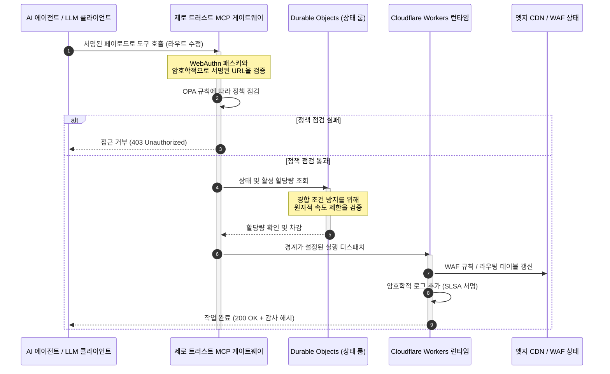

# CloudCDN: 2026년 AI 네이티브 엣지의 오픈 소스 블루프린트

<!-- lead-start: manual -->
<aside class="post-lead" aria-label="기사 요약">

<strong>요약.</strong> 2026년 엔터프라이즈 기술은 전 세계에 분산된 서버리스 실행과 에이전틱 AI의 융합으로 정의됩니다. 정적 파일 캐싱과 기본 트래픽 라우팅을 위해 설계된 표준 CDN은 능동적 실시간 데이터 오케스트레이션 시대에 구조적으로 낡은 모델입니다. CloudCDN은 엣지를 능동적 컨트롤 플레인으로 재구성하는 오픈 소스 블루프린트입니다. 서버리스 런타임, Cloudflare Durable Objects를 통한 상태 기반 조율, 그리고 자율 AI 에이전트가 경계가 설정되고 암호학적으로 보안된 운영 범위 안에서 웹 인프라를 운영하게 하는 제로 트러스트 Model Context Protocol(MCP) 게이트웨이를 갖추고 있습니다.

<strong>핵심 시사점</strong>

<ul class="post-lead-takeaways">
  <li><strong>정적 캐시에서 경계가 설정된 컨트롤 플레인으로.</strong> CloudCDN은 운영 경계를 엣지로 옮겨, CDN 노드를 1밀리초 미만의 보안·라우팅·접근 통제 결정을 실행하는 능동적 정책 게이트로 전환합니다.</li>
  <li><strong>상태 기반 엣지 조율.</strong> Cloudflare Durable Objects가 전 세계적으로 원자적인 실시간 속도 제한과 상태 조율을 강제합니다. 분산 경합 조건도, 엣지 리전 간 체계적 할당량 남용도 없습니다.</li>
  <li><strong>MCP를 통한 안전한 에이전틱 인프라 관리.</strong> 제로 트러스트 게이트웨이가 42개의 전문화된 MCP 도구를 노출하여, AI 에이전트가 암호학적으로 서명된 경계 안에서 인프라를 검사·설정·운영하게 합니다.</li>
  <li><strong>파이프라인 산출물로서의 공급망 보안.</strong> Sigstore/Cosign 기반 SLSA Level 3 빌드 출처 증명과, 모든 릴리스마다 100% 커버리지의 3,185개 단위 테스트를 제공합니다.</li>
  <li><strong>대시보드가 아닌 이사회 수준의 증거.</strong> 엣지 텔레메트리가 DORA 제5조 이사회 책임, BCBS 239 리스크 보고, Basel III 운영 리스크 자본 규정에 직접 매핑됩니다.</li>
</ul>

<strong>관련 글:</strong> <a href="/2026-05-16-best-cloud-infrastructure-architecture-2026/">2026년 최고의 클라우드 인프라 아키텍처: 금융 서비스를 위한 AI 네이티브·멀티 클라우드·양자 대응 블루프린트</a> · <a href="/2026-06-05-cloud-native-banking-index-dora-resilience-platform-engineering-2026/">2026년 클라우드 네이티브 뱅킹 지수: DORA, 플랫폼 엔지니어링, 주권 클라우드, 운영 회복탄력성</a> · <a href="/2026-06-03-agentic-ai-index-banks-autonomy-governance-auditability-2026/">2026년 은행을 위한 에이전틱 AI 지수: 자율성, 거버넌스, 감사 가능성, 비즈니스 영향의 측정</a>

</aside>
<!-- lead-end -->

CDN 논쟁은 끝났습니다. 엣지는 더 이상 캐시가 아니라 AI 네이티브 소프트웨어의 컨트롤 플레인입니다. 에이전트가 도구를 호출하고, 데이터를 이동시키고, 캐시를 퍼지하고, 서명된 URL을 요청하고, 워크플로를 조율하는 시대에, 불투명한 대시보드와 독점 컨트롤 플레인이라는 낡은 모델은 불편을 넘어 규제 리스크가 됩니다. CloudCDN은 다른 모델을 주장합니다. 보안, 접근성, 성능, 감사 가능성을 벤더의 약속이 아니라 강제 가능한 기본값으로 다루는, 개방적이고 검사 가능하며 에이전트가 제어할 수 있는 엣지 플랫폼입니다.

이 글의 오픈 소스 레퍼런스는 [cloudcdn.pro ⧉](https://github.com/sebastienrousseau/cloudcdn.pro "cloudcdn.pro")입니다. 이 저장소는 처음부터 끝까지 읽을 수 있고 독립적으로 배포할 수 있는 멀티 테넌트 AI 네이티브 CDN입니다. Cloudflare PoP 전반에서 100ms 미만의 TTFB, MCP 제어, Durable Objects 속도 제한, WCAG-AA 접근성, 서명된 URL, 패스키, SLSA Level 3, 그리고 100% 커버리지의 3,185개 테스트를 갖추고 있습니다.

---

> **이사회 요약 / 핵심 시사점**
>
> - **엣지가 운영 경계가 됩니다.** CloudCDN은 표준 CDN 노드를 1밀리초 미만의 보안·라우팅·접근 통제를 실행하는 능동적 정책 게이트로 전환합니다.
> - **Durable Objects가 속도 제한을 원자적으로 만듭니다.** 실시간으로 전 세계에서 일관된 할당량 집행은, 최종 일관성 기반 제한기가 공격자와 오작동 에이전트에게 열어 두는 경합 조건의 창을 닫습니다.
> - **에이전트는 경계가 설정된 42개 MCP 도구를 통해 인프라를 운영합니다.** 모든 호출은 실행 전에 WebAuthn 패스키, 서명된 페이로드, OPA 정책에 대해 검증됩니다.
> - **공급망은 제품의 일부입니다.** Sigstore/Cosign 기반 SLSA Level 3 출처 증명이 모든 릴리스를 감사된 소스 코드와 암호학적으로 연결합니다.
> - **텔레메트리는 컴플라이언스 증거입니다.** 엣지 운영이 DORA 제5조, BCBS 239, Basel III 운영 리스크 자본에 사후 보고가 아니라 직접 매핑됩니다.
>
---

## 이 오픈 소스 프로젝트가 2026년에 중요한 이유

2026년 엔터프라이즈 IT는 정적 인프라 프로비저닝에서 실시간 이벤트 기반 데이터 오케스트레이션으로 이동했습니다. 두 가지 시장 동력이 이 전환을 이끕니다.

첫 번째는 에이전틱 AI의 확산입니다. 자율 모델과 소프트웨어 에이전트가 이제 자동화된 위협 완화, 라우팅 결정, 실시간 원장 정산 같은 복잡한 운영 업무를 수행합니다. 이들은 대시보드를 사용하지 않습니다. 도구를 호출합니다.

두 번째는 [디지털 운영 회복탄력성 법(DORA) ⧉](https://eur-lex.europa.eu/legal-content/EN/TXT/?uri=CELEX%3A32022R2554 "금융 부문 디지털 운영 회복탄력성에 관한 규정 (EU) 2022/2554")의 본격적인 집행입니다. 은행은 더 이상 불투명한 독점 제3자 CDN에 의존할 수 없습니다. 규제 기관은 소프트웨어 공급망에 대한 완전한 가시성, 검증 가능한 출구 역량, 변조 불가능한 암호학적 감사 추적을 요구합니다.

중앙집중식 서버 아키텍처는 실시간 오케스트레이션이 감당할 수 없는 지연 시간 비용을 부과합니다. 독점 CDN은 기관이 볼 수도, 입증할 수도 없는 공급망 침해에 노출시키는 블랙박스로 기능합니다. CloudCDN은 엣지를 능동적 컨트롤 플레인으로 전환하는 투명한 제로 트러스트 오픈 소스 블루프린트로 그 간극을 메웁니다. 기술 경영진에게 이는 논의의 축을 컴플라이언스 비용에서 Return on Resilience, 즉 자동화된 감사 대응 운영 파이프라인이 보존하는 자본으로 옮깁니다.

## 아키텍처 관점

CloudCDN 아키텍처는 중앙집중식 미들웨어를 지역화된 상태 기반 엣지 원시 구성요소로 대체하며, 다섯 개 계층으로 구성됩니다:

| 계층 | 설계 결정 | 왜 중요한가 | 잘못 다룰 경우의 리스크 |
|---|---|---|---|
| **엣지 런타임** | Cloudflare Workers와 Pages | 중앙집중식 VM 지연을 제거하고 전 세계에서 1밀리초 미만의 정책을 실행 | 정책 규율 없는 성능 향상은 무질서한 엣지 드리프트를 초래 |
| **상태 조율** | Durable Objects | 리전 전반에서 속도 제한과 공유 상태에 대한 원자적 실시간 일관성을 보장 | 분산 경합 조건, API 자원 남용, 우회되는 경계 할당량 |
| **에이전트 인터페이스** | 제로 트러스트 MCP 게이트웨이 | 42개의 전문화된 MCP 도구를 노출하여 AI 에이전트가 통치된 경계 안에서 인프라를 운영 | 무제한의 도구 호출과 승인되지 않은 설정 변경 |
| **접근 통제** | WebAuthn 패스키와 서명된 URL | 정적 비밀번호를 감사 가능한 작업을 위한 암호학적 서명으로 대체 | 귀속이 약한 변경, 자격 증명 탈취로 인한 경계 침해 |
| **품질 게이트** | SLSA Level 3와 100% 테스트 커버리지 | 빌드 소스를 수학적으로 검증하고 악성 의존성 주입을 차단 | 소프트웨어 공급망을 통한 악성 코드 삽입 |

## 추적해야 할 운영 신호

엣지 준비 수준은 측정 가능합니다. 다음은 의도가 아닌 실행 역량을 입증하는 정량 지표입니다:

| 신호 | 지표 / 벤치마크 | 규제 참조 | 플랫폼 구현 |
|---|---|---|---|
| **42개 MCP 도구** | 자동화된 관리를 위한 경계가 설정된 도구 레지스트리 수 | COBIT 2019 (BAI06) | OPA 정책에 대해 에이전트 서명을 검증하는 MCP 게이트웨이 |
| **Durable Objects** | 누수 없는 1밀리초 미만의 원자적 할당량 집행 | DORA 제6조 | 글로벌 API 할당량 상태를 추적하는 Durable Objects |
| **패스키와 서명된 URL** | 관리자 세션의 100%를 FIDO2 WebAuthn으로 검증 | DORA 제30조 | 엣지 라우터에 내장된 암호학적 서명 점검 |
| **SLSA Level 3** | 암호학적으로 서명된 빌드 매니페스트 (Sigstore) | DORA 제30조 | 서명된 빌드 메타데이터를 생성하는 GitHub Actions 파이프라인 |
| **3,185개 단위 테스트** | 100% 커버리지, 모든 릴리스에 회귀 게이트 적용 | NIST CSF 2.0 (PR.DS-01) | 테스트 실패 시 배포를 중단하는 CI 파이프라인 |

## CDN이 능동적 컨트롤 플레인이 된다

전통적인 CDN은 수동적인 정적 콘텐츠 가속을 중심으로 설계되었습니다. CloudCDN은 그 모델을 재정의합니다. Cloudflare Workers와 Durable Objects가 통합되면, 엣지는 능동적이고 상태를 가진 정책 게이트로 기능합니다.

AI 에이전트나 자동화된 프로세스가 인프라 설정 변경이나 라우팅 조정을 요청할 때, 취약한 중앙집중식 데이터베이스와 통신하지 않습니다. 요청은 가장 가까운 엣지 노드에서 가로채여, 어떤 것도 실행되기 전에 신원, 정책, 할당량 점검을 차례로 통과합니다:

이 시퀀스의 모든 단계가 귀속 가능하고 서명된 기록을 생성합니다. 그것이 콘텐츠를 가속하는 CDN과 통치할 수 있는 컨트롤 플레인의 차이입니다.

## 오픈 소스가 신뢰 모델을 바꾸는 이유

최고정보보호책임자(CISO)에게 불투명한 독점 CDN은 누적되는 리스크입니다. 폐쇄형 엣지 네트워크는 블랙박스입니다. 벤더가 내부 침해를 당하면, 은행은 그 침해가 공개적으로 공시될 때까지 아무런 가시성도 갖지 못합니다.

CloudCDN은 그 비대칭을 세 가지 메커니즘 위에 구축된, 완전히 감사 가능한 오픈 소스 신뢰 모델로 대체합니다:

1. **수학적 빌드 출처 증명.** SLSA Level 3 아래에서 모든 릴리스는 오픈 소스 GitHub 저장소와 암호학적으로 연결됩니다. CISO는 Cloudflare의 글로벌 엣지 노드에서 실행되는 바이너리가 감사된 소스 코드와 정확히 일치한다는 사실을 계약이 아니라 수학으로 검증할 수 있습니다.
2. **지속적이고 공개적인 보안 감사.** 코드베이스는 자동화된 스캔, 공개 취약점 공시, 동료 검토 기반 코드 감사를 거칩니다. 은폐는 통제가 아닙니다. 검토가 통제입니다.
3. **벤더 종속 없음 (DORA 제28조).** DORA는 은행이 핵심 제3자 공급자로부터의 명확하고 시험된 출구 전략을 입증할 것을 요구합니다. CloudCDN은 오픈 소스이고 표준 서버리스 원시 구성요소 위에 구축되어 있으므로, 기관은 엣지 설정을 Cloudflare에서 다른 서버리스 런타임이나 프라이빗 Kubernetes 클러스터로 이전할 수 있으며, 그 역량을 규제 기관에 증거로 제시할 수 있습니다.

## 은행 등급 엣지 패턴

CloudCDN은 글로벌 금융 부문의 컴플라이언스 기준을 충족하도록 설계되었으며, 기술적 엣지 운영을 감독기관이 실제로 검사하는 프레임워크에 직접 매핑합니다:

- **모델 리스크 관리 ([미 연준 SR 11-7 ⧉](https://web.archive.org/web/20260414150921/https://www.federalreserve.gov/supervisionreg/srletters/sr1107.htm "모델 리스크 관리에 관한 감독 지침") / 영국 PRA SS1/23).** 운영 업무를 실행하는 자율 모델은 모델 리스크 거버넌스의 적용 대상입니다. CloudCDN의 MCP 게이트웨이는 에이전틱 도구를 정량 모델처럼 다룹니다. 엄격한 정책 경계, 실시간 로깅, 고영향 작업에 대한 필수 휴먼 인 더 루프 승인이 그것입니다.
- **BCBS 239 (리스크 데이터 집계).** 트랜잭션 데이터를 엣지에서 수집·태깅·구조화함으로써 운영 지표가 실시간으로 생성됩니다. 이는 데이터 무결성, 적시성, 규제 추적 가능성에 대한 BCBS 239 요구사항에 부합합니다.
- **DORA 제5조 (이사회 책임).** 이사회는 운영 회복탄력성에 대해 최종적인 개인 책임을 집니다. CloudCDN은 엣지 텔레메트리를 비기술 이사도 개인 책임 감사에 가져갈 수 있는 정량화되고 검증 가능한 증거로 전환합니다.
- **Basel III 운영 리스크 자본.** 은행은 운영 리스크에 대해 규제 자본을 적립합니다. 자동화된 재해 복구 페일오버와 SLSA Level 3 출처 증명은 기관의 운영 리스크 프로파일을 낮춥니다. 감사를 통과하는 데 그치지 않고, 대차대조표 위의 자본을 보존하는 것입니다.

## 은행 유형별 의미

### 글로벌 시스템 중요 은행 (G-SIB)

G-SIB는 여러 관할권에 걸쳐 막대한 거래량을 처리합니다. 우선순위는 파편화된 레거시 경계 통제를 하나의 통합된 엣지 플레인으로 대체하는 것입니다. CloudCDN 패턴을 배포하면 G-SIB는 보안 정책, API 게이트웨이, 에이전틱 거버넌스를 전 세계적으로 표준화하고, DORA 대응 증거 파이프라인을 분기별 비상 작업이 아니라 운영의 부산물로 생성할 수 있습니다.

### 트랜잭션 뱅크와 기업 은행

트랜잭션 뱅크에게 고객 대면 상품은 실행 속도, 보안, 데이터 투명성의 묶음입니다. CloudCDN 패턴은 이들 은행이 기업 재무 담당자에게 보안 API 대시보드와 실시간 자금 추적 서비스를 노출할 수 있게 합니다. 기업 예금을 방어하는 회복탄력적 엣지 태세입니다.

### 지역 은행과 중소 은행

지역 은행은 G-SIB와 같은 위협 행위자를 상대하면서도 그만한 엔지니어링 예산이 없습니다. 오픈 소스 은행 등급 엣지 블루프린트는 통제를 기본 제공합니다. 독점 라이선스 비용 없는 즉각적인 규제 정합성과, 그것을 입증할 소스 코드가 그것입니다.

## 이사회를 위한 플레이북

운영 회복탄력성은 더 이상 보이지 않는 백오피스 IT 지표가 아닙니다. 개인 책임이 결부된 이사회 우선순위입니다. 2026년에 규제 기관, 고객, 주주의 신뢰를 지키는 기관은 기술을 검증 가능하고 관측 가능한 자산으로 다룹니다.

시니어 기술 리더를 위한 로드맵은 짧습니다:

1. **증거를 제품으로 의무화하십시오.** 엣지에서 자동화되고 자체 문서화되는 파이프라인에 예산을 배정하십시오. 감사인을 위해 짜 맞추는 증거가 아니라, 운영이 생성하는 증거입니다.
2. **상태 기반 엣지 통제로 이동하십시오.** 속도 제한, WAF, 신원 검증을 중앙집중식 서버에서 원자적 엣지 원시 구성요소로 옮기십시오.
3. **암호학적 에이전트 경계를 수립하십시오.** 모든 자동화된 도구 호출에 패스키와 OPA 검증을 갖춘 제로 트러스트 MCP 게이트웨이를 강제하십시오.
4. **오픈 소스 빌드 감사를 요구하십시오.** SLSA Level 3 빌드 출처 증명을 포부가 아니라 배포 조건으로 만드십시오.

## 자주 묻는 질문

**CloudCDN은 DORA 감사에 대응할 준비가 되어 있습니까?**

그렇습니다. CloudCDN은 정보 등록부(Register of Information)의 ITS 템플릿(RT.01부터 RT.15까지)과 DORA 제30조 계약 조항에 직접 매핑되는 자동화된 컴플라이언스 증거를 생성하도록 설계되었습니다.

**속도 제한에 Durable Objects를 사용하는 이점은 무엇입니까?**

전통적인 분산 속도 제한기는 최종 일관성에 의존하며, 이는 공격자나 오작동 에이전트가 악용할 수 있는 지연 시간의 창을 남깁니다. Durable Objects는 전 세계적으로 즉각적이고 원자적인 일관성을 보장하여 경합 조건의 창을 완전히 닫습니다.

**무엇이 CloudCDN을 AI 네이티브로 만듭니까?**

MCP로 제어되는 운영과 에이전트 인식형 통제 모델입니다. 인프라는 암호학적 신원과 정책 경계를 갖춘 42개의 통치된 도구를 통해 운영됩니다. 사람의 대시보드만이 아니라 자율 워크플로를 위해 설계되었습니다.

**오픈 소스 코드는 제로데이 익스플로잇 리스크를 키우지 않습니까?**

아닙니다. 독점 폐쇄형 CDN은 은폐를 통한 보안에 의존합니다. CloudCDN의 코드베이스는 자동화된 테스트, 공개 동료 검토, SLSA Level 3 검증을 지속적으로 거칩니다. 검증 가능하게 더 높은 신뢰 기준입니다.

## 참고 자료

- European Parliament and Council of the European Union, (2022). [금융 부문 디지털 운영 회복탄력성에 관한 규정 (EU) 2022/2554 (DORA) ⧉](https://eur-lex.europa.eu/legal-content/EN/TXT/?uri=CELEX%3A32022R2554 "금융 부문 디지털 운영 회복탄력성에 관한 규정 (EU) 2022/2554 (DORA)"). 브뤼셀: 유럽연합 관보.
- Basel Committee on Banking Supervision (BCBS), (2013). [효과적인 리스크 데이터 집계 및 리스크 보고 원칙 (BCBS 239) ⧉](https://www.bis.org/publ/bcbs239.htm "효과적인 리스크 데이터 집계 및 리스크 보고 원칙 (BCBS 239)"). 바젤: 국제결제은행.
- Board of Governors of the Federal Reserve System, (2011). [모델 리스크 관리에 관한 감독 지침 (SR Letter 11-7) ⧉](https://web.archive.org/web/20260414150921/https://www.federalreserve.gov/supervisionreg/srletters/sr1107.htm "모델 리스크 관리에 관한 감독 지침 (SR Letter 11-7)"). 워싱턴 D.C.: 연방준비제도.
- Cloudflare, (2026). [Durable Objects 문서: 상태 기반 엣지 조율 ⧉](https://developers.cloudflare.com/durable-objects/ "Durable Objects 문서"). 샌프란시스코: Cloudflare.
- Cloudflare, (2026). [MCP, 인증, Durable Objects로 AI 에이전트 구축하기 ⧉](https://blog.cloudflare.com/building-ai-agents-with-mcp-authn-authz-and-durable-objects/ "MCP, 인증, Durable Objects로 AI 에이전트 구축하기").
- GitHub, (2026). [cloudcdn.pro 저장소 ⧉](https://github.com/sebastienrousseau/cloudcdn.pro "cloudcdn.pro 저장소").

<!-- enrich-start -->
<aside class="author-card" aria-label="저자 소개"><strong class="author-card-name"><a href="/about/index.html">Sebastien Rousseau</a></strong>응용 AI, 결제 인프라, 토큰화 화폐, ISO 20022, 양자내성 보안, 클라우드 네이티브 금융 서비스, 규제 디지털 시장에 관해 집필하는 시니어 뱅킹 기술 전문가입니다.HSBC 상업·투자은행, PayPal, Barclays, Shazam, AKQA, Virgin Group을 아우르는 20년 이상의 경력. <a href="/about/index.html">전체 프로필</a> &middot; <a href="https://www.linkedin.com/in/sebastienrousseau/" rel="external noopener">LinkedIn</a> &middot; <a href="https://github.com/sebastienrousseau" rel="external noopener">GitHub</a></aside>

최종 검토 <time datetime="2026-06-11">2026-06-11</time>.

<!-- enrich-end -->
