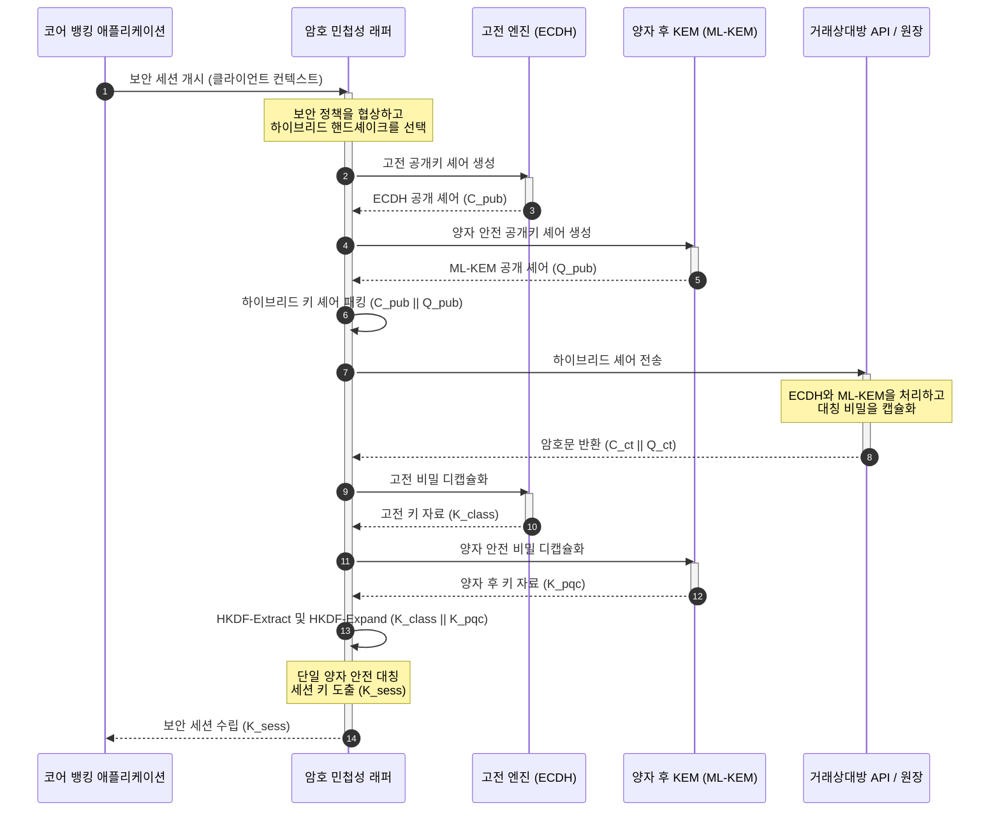

# KyberLib와 양자 후 은행 마이그레이션 2026: 표준에서 코드로

<!-- lead-start: manual -->
<aside class="post-lead" aria-label="기사 요약">

<strong>요약.</strong> 2026년 은행 인프라는 종착점이 알려진 시스템적 위협에 직면해 있습니다. 양자 규모의 연산은 오늘날 전송 트래픽을 보호하는 RSA·ECC 키 교환을 깨뜨릴 것입니다. 연방 표준과 감독 정책 문서가 경각심을 높였지만, 기술적 실행은 여전히 사일로에 갇혀 있습니다. <a href="https://github.com/sebastienrousseau/kyberlib">KyberLib</a>는 양자 후 서사를 구체적이고 메모리 안전한 Rust 코드로 옮기는 오픈 소스 엔지니어링 청사진입니다. NIST 표준 ML-KEM(FIPS 203)을 암호 민첩성 추상화 경계 뒤에 구현해, "지금 저장하고 나중에 복호화(Store Now, Decrypt Later)" 공격이 아카이브에 도달하기 전에 기관이 전송 보안과 키 캡슐화를 업그레이드할 수 있게 합니다.

<strong>핵심 시사점</strong>

<ul class="post-lead-takeaways">
  <li><strong>정책에서 검사 가능한 코드로.</strong> KyberLib는 양자 후 암호를 추상적인 전략 로드맵에서 구체적이고 고성능이며 감사 가능한 Rust 구현으로 옮깁니다.</li>
  <li><strong>표준화된 FIPS 203 ML-KEM 실행.</strong> 이 라이브러리는 NIST FIPS 203으로 확정된 키 확립 알고리즘 ML-KEM을 구현해 글로벌 규제 기대치에 부합하는 적합성을 유지합니다.</li>
  <li><strong>설계 단계부터의 암호 민첩성.</strong> 안정된 추상화 경계 덕분에 은행 애플리케이션은 비용이 크고 오류가 잦은 재작성 없이 암호 프리미티브를 교체할 수 있습니다.</li>
  <li><strong>Rust 기반 메모리 안전성.</strong> 컴파일 타임 소유권 규칙이 레거시 C 기반 암호 라이브러리를 괴롭히는 버퍼 오버플로와 메모리 누수를 제로 코스트 추상화 속도로 제거합니다.</li>
  <li><strong>수탁자 책임 리스크 완화.</strong> 관찰·테스트 가능한 마이그레이션 증거는 DORA 제5조 개인 책임 감사가 요구하는 "합리적 조치" 기록을 이사에게 제공합니다.</li>
</ul>

<strong>관련 읽을거리:</strong> <a href="/2026-05-18-quantum-cryptography-standards-developments-2026/">양자 암호 표준 2026</a> · <a href="/2026-05-28-dora-ai-act-data-sovereignty-banking-compliance-stack-2026/">DORA·AI 법 컴플라이언스 스택</a> · <a href="/2026-05-20-cloud-native-banking-financial-institutions-2026/">클라우드 네이티브 뱅킹</a>

</aside>
<!-- lead-end -->

양자 후 마이그레이션은 더 이상 계획 수립 단계의 과제가 아닙니다. 2026년에는 현재진행형 운영 요건이며, 규제 의도와 엔지니어링 실행 사이의 간극이 바로 리스크가 자리한 지점입니다. [KyberLib ⧉](https://github.com/sebastienrousseau/kyberlib "kyberlib")는 그 간극의 일부를 메웁니다. 확정된 FIPS 203 파라미터에 따라 ML-KEM을 구현하고, 이를 은행의 거래 시스템 자산이 실제로 필요로 하는 암호 민첩성 경계로 감싼, 프로덕션 지향의 메모리 안전 Rust 라이브러리입니다.

---

> **이사회 요약 / 핵심 시사점**
>
> - **위협은 이미 작동 중입니다.** 공격자는 오늘 "지금 저장하고 나중에 복호화(SNDL)" 수집을 실행하고 있으며, 암호학적으로 유의미한 양자 컴퓨터가 등장하는 날 데이터 기밀성은 소급해 무너집니다.
> - **표준은 확정됐습니다.** NIST FIPS 203(ML-KEM)과 FIPS 204(ML-DSA)는 감사위원회에 명확하고 테스트 가능한 기준을 제공합니다. "표준을 기다리고 있다"는 항변은 더 이상 성립하지 않습니다.
> - **KyberLib는 엔지니어링 청사진입니다.** 메모리 안전 Rust, HSM과 스마트카드를 위한 `no_std` 컴파일, 그리고 고전 상호운용성을 보전하는 하이브리드 핸드셰이크 패턴을 갖췄습니다.
> - **암호 민첩성이 지속 가능한 목표입니다.** 안정된 추상화 경계는 애플리케이션 재작성 없이 프리미티브를 교체할 수 있게 합니다. 어떤 단일 알고리즘보다 오래 남는 교훈입니다.
> - **책임은 이사회가 집니다.** DORA 제5조는 이사에게 개인 책임을 부과하며, 검사·관찰 가능한 마이그레이션 코드가 이를 충족하는 증거입니다.
>
---

## 왜 이 오픈 소스 프로젝트가 2026년에 중요한가

비대칭 암호가 수명을 다해가는 가운데, 위협은 암호학적으로 유의미한 양자 컴퓨터가 만들어지기를 기다리지 않습니다. 공격자는 지금 **"지금 저장하고 나중에 복호화(Store Now, Decrypt Later, SNDL)"** 공격을 실행하고 있습니다. 기업 은행 거래, 영업 비밀, 기관 통신의 암호화된 전송 스트림을 수집해 두고 양자 역량이 성숙하면 복호화하겠다는 것입니다. 은행 입장에서는 오늘 회선 위의 모든 고전 핸드셰이크가 기폭 시점이 미뤄진 기밀성 침해입니다.

규제 당국은 구체적인 의무로 대응했습니다.

1. **DORA 제6조(ICT 리스크 관리)**는 기관이 암호 자산 전반의 취약점을 매핑·식별·완화할 것을 요구합니다. 아무도 인벤토리에 올리지 않은 미들웨어 깊숙이 묻힌 비대칭 키 교환까지 포함합니다.
2. **NIST FIPS 203과 204**는 키 캡슐화(ML-KEM)와 디지털 서명(ML-DSA)에 대한 공식 양자 후 표준을 확립해, 감사위원회가 마이그레이션 진척도를 측정할 표준화된 기준을 제공합니다.

운영 중단 없이 이 마이그레이션을 실행하려면 정책 문서를 넘어 **검사 가능한 오픈 소스 암호 인프라**로 옮겨가야 합니다. [KyberLib ⧉](https://github.com/sebastienrousseau/kyberlib "kyberlib")가 바로 그것을 제공합니다. FIPS 203에 적합한 메모리 안전 Rust 라이브러리로, 양자 후 전환을 측정·검증 가능한 엔지니어링 파이프라인으로 바꾸고 기술 투자 논의를 손에 잡히는 회복력 수익률(Return on Resilience) 쪽으로 옮겨 놓습니다.

## 아키텍처 렌즈

KyberLib는 안정된 API 경계 뒤에 자리해, 은행의 핵심 거래 애플리케이션을 저수준 암호 프리미티브 변경으로부터 절연합니다.

| 계층 | 설계 결정 | 왜 중요한가 | 잘못 다룰 때의 위험 |
|---|---|---|---|
| **프리미티브** | FIPS 203 ML-KEM 키 캡슐화 | 고전 Diffie-Hellman과 RSA 키 교환을 격자 기반 구조로 대체 | 확정된 FIPS 203 파라미터 부적합으로 인한 컴플라이언스 감사 실패 |
| **언어** | 메모리 안전 Rust 구현 | C/C++에 고질적인 메모리 손상 취약점(버퍼 오버플로, use-after-free) 제거 | 빌드 체인 무결성을 훼손하는 의존성 난립 |
| **추상화** | 안정된 암호 민첩성 경계 | 표준이 진화해도 애플리케이션이 통합 인터페이스 뒤에서 알고리즘 교체 | 하드코딩된 프리미티브가 향후 모든 마이그레이션에서 수동 재작성을 강제 |
| **배포** | 하이브리드 암호화 핸드셰이크 | 양자 후 KEM과 고전 알고리즘을 이중 래핑 봉투로 결합 | 레거시 상호운용성 상실 또는 조용한 구성 드리프트 |
| **보증** | SLSA Level 3 출처 증명과 검사 가능한 테스트 | 코드 출처와 계보를 보장하고 예제를 한 줄씩 감사 가능 | 보안 연극 — 구현 오류가 프로덕션에서야 드러나는 블랙박스 라이브러리 |

## 추적해야 할 운영 신호

감독 이사회와 규제 당국에 양자 후 컴플라이언스를 입증하려면 구체적이고 정량화 가능한 지표를 추적해야 합니다.

| 신호 | 지표 | 규제 참조 | 플랫폼 구현 |
|---|---|---|---|
| **FIPS 203 ML-KEM 적합성** | 확정 파라미터(ML-KEM-512/768/1024) 100% 준수 | NIST FIPS 203 | KyberLib 모듈 내부에 컴파일된 파라미터 검증 격자 암호 |
| **암호 인벤토리** | 전체 시스템에 걸친 비대칭 키 교환 사용처의 완전한 인벤토리 | NIST SP 1800-38 | 활성 암호 스위트를 중앙 레지스트리에 기록하는 자동 스캐닝 에이전트 |
| **하이브리드 키 교환** | 하이브리드 봉투로 실행되는 전송 계층 핸드셰이크 비율 | DORA 제6조 | 고전 TLS 1.3 핸드셰이크를 PQC 캡슐화로 감싸는 네트워크 프록시 |
| **`no_std` 컴파일** | 제약 타깃을 위해 Rust 표준 라이브러리 없이 컴파일하는 능력 | DORA 제30조 | 하드웨어 보안 모듈(HSM)을 위한 KyberLib의 조건부 `no_std` 컴파일 |
| **암호 민첩성 지수** | API 게이트웨이 전반에서 암호 프리미티브를 교체하는 데 걸리는 시간(분) | 영국 PRA SS1/23 | 런타임 변수로 알고리즘 할당을 관리하는 추상화된 라우팅 레지스트리 |

## 왜 양자 후 암호에 Rust가 중요한가

ML-KEM 같은 양자 후 알고리즘 구현에는 다항식 환에 대한 복잡한 저수준 수학 연산이 필요합니다. 역사적으로 그 연산을 프로덕션 속도로 돌리려면 손으로 작성한 C/C++ 또는 어셈블리가 필요했습니다. 은행이 가장 틀려서는 안 되는 코드에서 메모리 손상의 공격 표면이 가장 커지는 구조였습니다.

Rust는 암호 엔지니어링의 보안 태세를 세 가지 구체적인 방식으로 바꿉니다.

1. **컴파일 타임 메모리 안전성.** Rust의 소유권 모델은 버퍼 오버플로, 이중 해제, use-after-free 오류를 컴파일 타임에 차단합니다. 키 크기와 암호문이 고전 알고리즘보다 훨씬 큰 양자 후 라이브러리에서는 특히 절실한 보장입니다.
2. **결정론적 제로 코스트 추상화.** Rust는 가비지 컬렉터 없이 네이티브 기계어로 컴파일되므로, 안전성을 보전하면서도 실행 속도와 메모리 사용량이 C 기반 라이브러리와 같거나 그 이상입니다.
3. **`no_std` 호환성.** KyberLib는 Rust 표준 라이브러리 없이 컴파일되므로 하드웨어 보안 모듈(HSM)과 스마트카드를 포함한 제약된 베어메탈 환경에서 동작합니다. 은행 수준의 암호를 물리적 보안 경계 안에 유지하는 것입니다.

## 암호 민첩성 아키텍처 설계

암호 마이그레이션의 고전적 실패 양식은 하드코딩입니다. 알고리즘별 가정이 애플리케이션 로직에 직접 박혀 있다가 전환 때마다 뼈아프게 재발견됩니다. 2026년의 지속 가능한 목표는 **암호 민첩성**입니다. 알고리즘을 안정된 인터페이스 뒤의 교체 가능한 모듈로 다루는 추상화 계층을 만들어, 다음 마이그레이션을 자산 전체 재작성이 아니라 구성 변경으로 끝내는 것입니다.

아래 시퀀스는 KyberLib의 암호 민첩성 래퍼가 하이브리드(고전 + 양자 후) 키 교환 핸드셰이크를 조율하는 방식을 보여줍니다.

운영상 핵심은 하이브리드 봉투입니다. 양자 후 프리미티브가 수년간의 프로덕션 검증을 쌓을 때까지 세션 키는 고전 비밀과 양자 후 비밀 양쪽에서 도출됩니다. 공격자가 채널을 복원하려면 ECDH**와** ML-KEM을 모두 깨야 합니다. 아직 마이그레이션하지 않은 거래상대방과의 연결은 그대로 유지되고, 마이그레이션을 마친 거래상대방은 즉시 격자 기반 보호를 얻습니다.

## 이사회 플레이북

양자 후 보안은 백오피스의 암호화 문제가 아니라 개인적 이해관계가 걸린 이사회 거버넌스 사안입니다. 경영진은 마이그레이션을 수탁자 책임의 틀로 바라봐야 합니다.

- **DORA 제5조(거버넌스와 조직)**는 ICT 보안에 대한 개인 책임을 이사회에 부과합니다. 오픈 소스의 관찰 가능한 테스트는 개인 책임 감사가 요구하는 직접 증거입니다. "검사 가능한 FIPS 203 구현을 선정했고 여기 적합성 실행 기록이 있다"는 방어 가능한 답변이지만, "공급업체가 보증했다"는 그렇지 않습니다.
- **모형 리스크 관리(미국 연준 SR 11-7 / 영국 PRA SS1/23)**는 가격결정 모형 못지않게 암호 래퍼 아키텍처에도 적용됩니다. 추상화 계층은 극단적 장애 시나리오에서의 성능을 포함해 MRM 검증을 통과해야 합니다.
- **Basel III 운영리스크 자본**은 입증된 통제 성숙도를 보상합니다. 테스트된 하이브리드 핸드셰이크는 기관의 장기 운영리스크 프로파일을 낮춰 자본 프리미엄을 줄이고, 자금부의 적극적 운용을 위한 대차대조표 여력을 풀어 줍니다.

## 은행 유형별 의미

### 글로벌 시스템적 중요 은행(G-SIB)

G-SIB는 레거시가 두터운 거래 시스템 자산을 운영하므로, 결정적 제약은 발견입니다. 비대칭 키 교환이 실제로 어디에서 일어나는지 아는 것입니다. NIST SP 1800-38 지침에 따른 지속적 암호 인벤토리가 우선이고, 그다음 KyberLib가 인벤토리로 드러난 모든 현대적 노드에서 양자 후 키 캡슐화를 실행할 표준화된 메모리 안전 라이브러리를 제공합니다.

### 거래은행과 기업금융 은행

결제 레일 전반의 기밀성이 곧 프랜차이즈입니다. KyberLib는 베어메탈 `no_std` 타깃으로 컴파일되므로, 거래은행은 애플리케이션 계층만이 아니라 엣지의 결제 라우팅·유동성 관리 하드웨어 내부에 직접 양자 후 핸드셰이크를 배포할 수 있습니다.

### 지역은행과 중소형 은행

지역 금융기관은 G-SIB급 연구 예산 없이 동일한 국가 배후 수집 공격에 직면합니다. 검사 가능한 오픈 소스 Rust 구현은 블랙박스 공급업체 로드맵을 협상할 필요 없이, 즉시 NIST FIPS 203 적합성에 도달하는 턴키 경로를 제공합니다.

## 로드맵에서 컴파일되는 코드로

양자 후 전환은 현재진행형 엔지니어링 과제이며, 2026년 내내 감독당국·거래상대방·기업 자금담당자의 신뢰를 지키는 기관은 추상적 로드맵에서 관찰 가능하고 컴파일되는 코드로 옮겨간 기관입니다. 경영진의 과제는 거기서 곧장 따라옵니다. 레거시 키 교환 지점을 감사하고, 가장 가치가 높은 채널에 하이브리드 핸드셰이크를 배포하며, 향후 모든 프리미티브 교체를 일상 업무로 만드는 안정된 추상화 경계를 구축하는 것입니다. KyberLib는 이 각 단계를 슬라이드 위의 약속이 아니라 측정 가능한 운영 역량으로 만듭니다.

## 자주 묻는 질문

**KyberLib는 확정된 NIST 표준을 준수합니까?**

그렇습니다. KyberLib는 FIPS 203으로 확정된 ML-KEM 파라미터를 중심으로 설계돼, 컴파일된 라이브러리가 연방 및 글로벌 규제 기대치에 부합하도록 유지합니다.

**양자 후 라이브러리에는 전용 하드웨어가 필요합니까?**

아닙니다. KyberLib의 Rust 구현은 표준 시스템 아키텍처로 컴파일됩니다. 여기에 `no_std` 역량이 더해져, 물리적 키 보관이 요구되는 전용 하드웨어 보안 모듈(HSM)과 스마트카드에서도 동작합니다.

**"지금 저장하고 나중에 복호화"는 현재 컴플라이언스에 어떤 영향을 줍니까?**

전송 계층이 고전 RSA나 ECC에 의존한다면, 공격자는 오늘 트래픽을 수집해 두었다가 양자 역량이 성숙하면 복호화할 수 있습니다. 지금 배포한 하이브리드 키 교환은 수집된 데이터를 격자 기반 보호 뒤에 묶어 둡니다.

**왜 양자 후 프리미티브로 곧장 가지 않고 하이브리드 핸드셰이크를 씁니까?**

하이브리드 봉투는 고전 비밀과 양자 후 비밀 양쪽에서 세션 키를 도출하므로, 둘 다 깨지지 않는 한 보안이 유지됩니다. 새 프리미티브가 프로덕션 검증을 쌓는 동안 아직 마이그레이션하지 않은 거래상대방과의 상호운용성도 보전됩니다.

## 참고 자료

- National Institute of Standards and Technology, (2024). [FIPS 203: 모듈 격자 기반 키 캡슐화 메커니즘 표준 ⧉](https://www.nist.gov/news-events/news/2024/08/nist-releases-first-3-finalized-post-quantum-encryption-standards "NIST FIPS 203 발표").
- Board of Governors of the Federal Reserve System, (2011). [모형 리스크 관리에 관한 감독 지침(SR Letter 11-7) ⧉](https://www.federalreserve.gov/supervisionreg/srletters/sr1107.htm "연방준비제도 SR 11-7").
- European Parliament and Council of the European Union, (2022). [금융 부문 디지털 운영 복원력에 관한 규정 (EU) 2022/2554 (DORA) ⧉](https://eur-lex.europa.eu/legal-content/EN/TXT/?uri=CELEX%3A32022R2554 "DORA 규정").
- NIST National Cybersecurity Center of Excellence, (2025). [양자 후 암호로의 마이그레이션(NIST SP 1800-38) ⧉](https://www.nccoe.nist.gov/projects/migration-post-quantum-cryptography "NIST SP 1800-38").
- GitHub, (2026). [kyberlib 오픈 소스 저장소 ⧉](https://github.com/sebastienrousseau/kyberlib "kyberlib 저장소").

<!-- enrich-start -->
<aside class="author-card" aria-label="저자 소개"><strong class="author-card-name"><a href="/about/index.html">Sebastien Rousseau</a></strong>응용 AI, 결제 인프라, 토큰화 화폐, ISO 20022, 양자내성 보안, 클라우드 네이티브 금융 서비스, 오픈 소스 인프라, 규제 디지털 시장에 관해 집필하는 시니어 뱅킹 기술 전문가입니다.HSBC 상업·투자은행, PayPal, Barclays, Shazam, AKQA, Virgin Group을 아우르는 20년 이상의 경력. <a href="/about/index.html">전체 프로필</a> &middot; <a href="https://www.linkedin.com/in/sebastienrousseau/" rel="external noopener">LinkedIn</a> &middot; <a href="https://github.com/sebastienrousseau" rel="external noopener">GitHub</a></aside>

최종 검토 <time datetime="2026-06-12">2026-06-12</time>.

<!-- enrich-end -->
