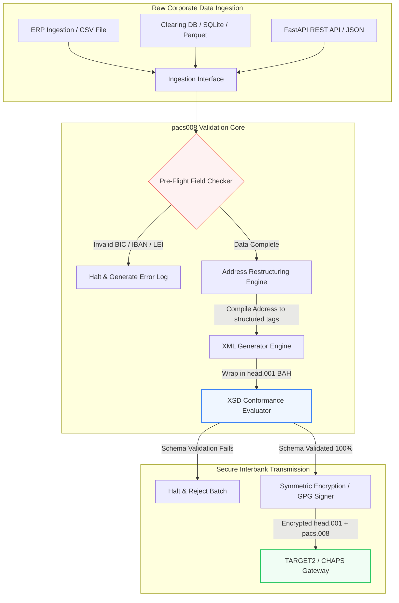

---

# Front Matter (YAML)

author: "contact@sebastienrousseau.com (Sebastien Rousseau)"
banner_alt: "음성 비서와 노트북을 사용하는 사무직 직원 — pacs.008 자동화가 프로그램으로 다룰 수 있게 만드는 구조화된 기계 판독 가능 은행 간 결제 메시지를 상징"
banner_height: "1597"
banner_width: "2584"
banner: "https://cloudcdn.pro/stocks/images/tyler-prahm-lmV3gJSAgbo.webp"
cdn: "https://cloudcdn.pro"
charset: "UTF-8"
cname: "sebastienrousseau.com"
copyright: "© Copyright 2025 - 2026 - Sebastien Rousseau. All rights reserved."
date: "June 15, 2026"
description: "pacs008은 ISO 20022 pacs.008 FI-to-FI 고객 신용 이체 생성과 검증을 자동화하는 오픈 소스 Python 라이브러리입니다. 구조화된 주소, BAH head.001 래핑, BIC/LEI/IBAN 체크섬, UETR 기반 OpenTelemetry 추적까지, 2026년 11월 SWIFT 전환을 겨냥해 설계되었습니다."
format-detection: "telephone=no"
hreflang: "ko"
icon: "https://cloudcdn.pro/clients/sebastienrousseau/v1/logos/sebastienrousseau.svg"
id: "https://sebastienrousseau.com/2026-06-15-pacs008-automation-iso-20022-interbank-payments-2026"
image_alt: "Sebastien Rousseau의 흑백 인물 사진"
image_height: "162"
image_width: "162"
image: "https://cloudcdn.pro/stocks/images/sebastien-rousseau.png"
keywords: "pacs008, ISO 20022 pacs.008, FI to FI 고객 신용 이체, 구조화된 주소, SWIFT CBPR+, BAH head.001, TARGET2, CHAPS, Fedwire, DORA, BCBS 239, Basel III, UETR, LEI 검증, SEPA VoP"
language: "ko-KR"
last_reviewed: "2026-06-15"
layout: "report"
locale: "ko_KR"
logo_alt: "Sebastien Rousseau의 로고"
logo_height: "44"
logo_width: "44"
logo: "https://cloudcdn.pro/clients/sebastienrousseau/v1/logos/sebastienrousseau.svg"
menu: ""
measurementID: "G-169G4ET5HQ"
name: "Sebastien Rousseau"
permalink: "https://sebastienrousseau.com/2026-06-15-pacs008-automation-iso-20022-interbank-payments-2026"
rating: "general"
referrer: "no-referrer"
robots: "index, follow"
schema: "FAQPage, Article"
seo_title: "ISO 20022 시대를 위한 pacs.008 자동화"
short_name: "sebastienrousseau"
subtitle: "pacs.008 메시지는 은행 간 결제 데이터, 구조화된 주소, 컴플라이언스, 라우팅, 결제 운영이 만나는 지점입니다."
tags: "pacs008, ISO 20022, 은행 간 결제, 대규모 결제, Python"
theme-color: "0, 83, 191"
title: "2026년 ISO 20022 은행 간 시대의 pacs.008 자동화 구축"
url: "https://sebastienrousseau.com/2026-06-15-pacs008-automation-iso-20022-interbank-payments-2026"
viewport: "width=device-width, initial-scale=1, shrink-to-fit=no"

# RSS - The RSS feed front matter (YAML).
atom_link: "https://sebastienrousseau.com/2026-06-15-pacs008-automation-iso-20022-interbank-payments-2026/rss.xml"
category: "Finance"
docs: https://validator.w3.org/feed/docs/rss2.html
generator: "Static Site Generator (SSG) (version 0.0.26)"
item_description: "pacs008은 은행 간 결제 시대의 ISO 20022 FI-to-FI 고객 신용 이체 메시지를 자동화하기 위한 오픈 소스 Python 기반을 제공합니다."
item_guid: "https://sebastienrousseau.com/2026-06-15-pacs008-automation-iso-20022-interbank-payments-2026/rss.xml"
item_link: "https://sebastienrousseau.com/2026-06-15-pacs008-automation-iso-20022-interbank-payments-2026/rss.xml"
item_pub_date: "Mon, 15 Jun 2026 06:06:06 +0000"
item_title: "2026년 ISO 20022 은행 간 시대의 pacs.008 자동화 구축"
last_build_date: "Mon, 15 Jun 2026 06:06:06 +0000"
managing_editor: "contact@sebastienrousseau.com (Sebastien Rousseau)"
pub_date: "Mon, 15 Jun 2026 06:06:06 +0000"
ttl: "60"
type: "article"
webmaster: "contact@sebastienrousseau.com"

# Apple - The Apple front matter (YAML).
apple_mobile_web_app_orientations: "portrait"
apple_touch_icon_sizes: "192x192"
apple-mobile-web-app-capable: "yes"
apple-mobile-web-app-status-bar-inset: "black"
apple-mobile-web-app-status-bar-style: "black-translucent"
apple-mobile-web-app-title: "ISO 20022 시대를 위한 pacs.008 자동화"
apple-touch-fullscreen: "yes"

# MS Application - The MS Application front matter (YAML).

msapplication-navbutton-color: "0, 83, 191"

# Twitter Card - The Twitter Card front matter (YAML).

twitter_card: "summary_large_image"
twitter_creator: "@wwdseb"
twitter_description: "pacs008은 은행 간 결제 시대의 ISO 20022 FI-to-FI 고객 신용 이체 메시지를 자동화하기 위한 오픈 소스 Python 기반을 제공합니다."
twitter_image: "https://cloudcdn.pro/clients/sebastienrousseau/v1/logos/sebastienrousseau.svg"
twitter_image_alt: "Sebastien Rousseau의 로고"
twitter_site: "@wwdseb"
twitter_title: "ISO 20022 시대를 위한 pacs.008 자동화"
twitter_url: "https://sebastienrousseau.com/2026-06-15-pacs008-automation-iso-20022-interbank-payments-2026"

excerpt: "pacs008은 ISO 20022 FI-to-FI 고객 신용 이체 메시지를 프로그램으로 다룰 수 있게 만드는 오픈 소스 Python 툴킷입니다. 구조화된 주소, 검증, 라우팅, 컴플라이언스 후크, SWIFT 2026년 11월 마감일이 기본값으로 내장되어 있습니다."

# Humans.txt - The Humans.txt front matter (YAML).
author_website: "https://sebastienrousseau.com"
author_twitter: "@wwdseb"
author_location: "London, UK"
thanks: "읽어 주셔서 감사합니다!"
site_last_updated: "2026-06-15"
site_standards: "HTML5, CSS3, RSS, Atom, JSON, XML, YAML, Markdown, TOML"
site_components: "Kaishi, Kaishi Builder, Kaishi CLI, Kaishi Templates, Kaishi Themes"
site_software: "Static Site Generator, Rust"

---

# 2026년 오픈 소스 Python으로 구축하는 ISO 20022 pacs.008 은행 간 결제 자동화

<!-- lead-start -->
<aside class="post-lead" aria-label="기사 요약">

<strong>요약.</strong> SWIFT CBPR+ 지침에 따라 2026년 11월 14일 구조화 주소 절벽(Structured Address Cliff)이 TARGET2, CHAPS, Fedwire, Lynx, SEPA 전반에서 비구조 우편 주소를 폐기합니다. pacs008은 ISO 20022 FI-to-FI 고객 신용 이체(pacs.008) 메시지 생성과 검증을 자동화하고, 결제를 비즈니스 애플리케이션 헤더(BAH head.001)로 래핑하며, 메시지가 청산 네트워크에 닿기 전에 구조화 주소 컴플라이언스를 데이터 경로에 내장하는 오픈 소스 Python 라이브러리입니다.

<strong>핵심 시사점</strong>

<ul class="post-lead-takeaways">
  <li><strong>구조화 주소 마감일은 절대적입니다.</strong> 2026년 11월 14일 이후 비구조 주소 블록은 폐지됩니다. pacs008은 데이터 컴파일 단계에서 구조화된 우편 주소 요소(<code>&lt;TwnNm&gt;</code>, <code>&lt;Ctry&gt;</code>, <code>&lt;PstCd&gt;</code>)를 강제해 국경 단계 거부를 차단합니다.</li>
  <li><strong>통합 메시지 오케스트레이션.</strong> 핵심 pacs.008 결제 페이로드를 컴플라이언트 비즈니스 애플리케이션 헤더(head.001) 봉투로 감싸 표준 왕복 처리 모델을 제공합니다.</li>
  <li><strong>알고리즘 무결성.</strong> ISO 7064 Modulo 97-10 체크섬 계산을 사용한 BIC 및 법인 식별자(LEI) 검증기를 내장합니다.</li>
  <li><strong>DORA 수준의 추적성.</strong> Unique End-to-End Transaction Reference(UETR)를 키로 한 전면적인 OpenTelemetry 계측으로 실시간 감사 로그와 암호학적 감사 서명을 제공합니다.</li>
  <li><strong>이사회급 수탁자 책임 보존.</strong> 은행 간 메시지 정확성을 DORA 제5조, BCBS 239 보고, Basel III 운영 리스크 자본 절감과 정렬합니다.</li>
</ul>

<strong>관련 읽을거리:</strong> <a href="https://sebastienrousseau.com/2026-05-19-global-wholesale-payments-economics-2026">2026년 글로벌 대규모 결제: ISO 20022, RTGS 재편, 상호운용성의 경제학</a>, <a href="https://sebastienrousseau.com/2026-05-27-ai-operating-system-payments-fraud-routing-resilience-compliance-2026">결제의 운영체제로서의 AI: 2026년 사기 탐지, 라우팅, 회복력, 컴플라이언스</a>, <a href="https://sebastienrousseau.com/2026-05-12-iso-20022-pacs008-structured-address-deadline">2026년 11월 pacs.008 구조화 주소 마감일: 6개월 관점</a>.

</aside>
<!-- lead-end -->

감사 가능하고 스키마 검증된 Python 파이프라인을 통해 레거시 금융 데이터와 구조화된 은행 간 메시징 사이의 간극을 메웁니다.

이 글의 오픈 소스 기준점은 [pacs008 ⧉](https://github.com/sebastienrousseau/pacs008 "pacs008 — 오픈 소스 Python 라이브러리")입니다. 이 저장소는 ISO 20022 pacs.008 FI-to-FI 고객 신용 이체 XML 메시지를 자동화하는 Python 라이브러리로 자리 잡고 있습니다.

## 왜 이 오픈 소스 프로젝트가 2026년에 중요한가

글로벌 은행 간 결제 청산 인프라는 반세기 가까운 기간 중 가장 깊이 있는 현대화 국면을 통과하고 있습니다.

2026년 6월, 금융 서비스 업계는 **2026년 11월 14일 SWIFT 구조화 주소 절벽**으로 빠르게 다가가고 있습니다. 이 시점부터 SWIFT CBPR+ 지침은 TARGET2, CHAPS, Fedwire, 캐나다 Lynx와 함께 비구조 우편 주소 라인(`<PstlAdr>` 블록 내 `<AdrLine>`만 사용하는 방식)을 공식적으로 폐기합니다. 모든 참여 금융기관은 주소를 하이브리드 형식(구조화된 `<TwnNm>` 및 `<Ctry>`에 잔여 세부 정보를 위한 `<AdrLine>` 요소 최대 2개)이나 완전 구조화 형식(거리명, 건물 번호, 우편번호를 개별 요소로 분리)으로 전송해야 합니다. 이 기준을 충족하지 못한 메시지는 네트워크 경계에서 거부됩니다.

금융기관에게 이 전환은 다음과 같은 중대한 운영 제약을 만듭니다.

1. **국경 거부 페널티.** 구조화 주소 기준을 충족하지 못한 결제는 즉시 네트워크 거부를 맞고, 거래 지연, 유동성 차단, 운영 적체로 이어집니다.
2. **SEPA 수취인 검증(VoP).** SEPA 권역의 모든 결제서비스공급자(PSP)는 신용 이체 실행 전 수익자 이름과 IBAN의 일치 여부를 검증해야 하며, 이는 메시지 개시 단계에 또 하나의 검증 게이트를 추가합니다.

[pacs008](https://github.com/sebastienrousseau/pacs008)은 이 문제를 해결합니다. 원시 금융 데이터를 완전 검증되고 스키마 컴플라이언트한 ISO 20022 pacs.008 은행 간 고객 신용 이체 메시지로 변환하는 작업을 자동화하는 가볍고 오픈 소스인 Python 라이브러리입니다. 레거시-구조화 데이터 간극을 메우면서 pacs008은 높은 회복력 대비 수익률(RoR)을 제공하고, 운전자본을 보존하며, 글로벌 결제망 전반에서 실시간 실행을 확보합니다.

## pacs008 2026 아키텍처 관점

pacs008 라이브러리는 절연된 검증 및 생성 엔진으로 설계되어, 원시 입력이 체계적으로 파싱·보강·표준 봉투로 래핑되도록 보장합니다.

| 계층 | 설계 결정 | 왜 중요한가 | 잘못 다룰 때의 위험 |
|---|---|---|---|
| **입력 계층** | CSV, JSON, SQLite, Parquet 수집 | 은행 통합 팀의 데이터가 이미 존재하는 곳에서 작업이 가능하므로 플랫폼 마이그레이션을 막습니다. | 원시·미검증·손상된 데이터 페이로드 수집. |
| **검증 계층** | 공식 XSD 스키마 및 커스텀 비즈니스 규칙에 대한 사전 검증 | 결제 파일이 청산 네트워크로 전송되기 전에 실행을 멈추고 오류를 표시합니다. | 즉각적인 네트워크 거부와 청산 지연을 유발하는 무효 XML 파일. |
| **BAH 봉투 계층** | 비즈니스 애플리케이션 헤더(head.001) 자동 래핑 | `<MsgDefIdr>` 태그 기반 메시지 디스패칭과 라우팅을 표준화합니다. | 필수 외부 봉투 없이 원시 pacs.008 페이로드 전송, 시스템 거부 유발. |
| **직렬화 계층** | 표준 XML과 ISO 컴플라이언트 JSON(TS 23029) 지원 | XML과 JSON 페이로드 간 직접 변환을 가능하게 해 현대적 REST API와 Kafka 스트리밍을 지원합니다. | 공식 ISO 지침을 위반하는 분절된 데이터 표현. |
| **관측성 계층** | UETR을 키로 한 OpenTelemetry 추적 | 상세 실행 경로와 로그를 포착해 실시간 감사 가능성을 제공합니다. | 운영 가시성과 감사를 차단하는 추적 공백. |

## 핵심 은행 간 신호와 규제 마일스톤

거래 단계의 운영 회복력을 입증하려면, 시니어 기술·리스크 관리자는 정량화 가능한 컴플라이언스 지표를 추적해야 합니다.

| 신호 | 지표 / 운영 벤치마크 | G20 / SWIFT / DORA 참조 | 기술 플랫폼 구현 |
|---|---|---|---|
| **구조화 주소 컴플라이언스** | 지정된 `<TwnNm>` 및 `<Ctry>`로 완전 구조화된 `<PstlAdr>` 필드를 사용하는 pacs.008 메시지 비율. | SWIFT SR 2026 마감일 | pacs008의 사전 스키마 점검이 비구조 주소 라인을 거부. |
| **SEPA 수취인 검증** | 메시지 실행 전 수익자 이름과 IBAN 간 일치 검증. | SEPA VoP 규정 | IBAN/BIC에 대한 사전 검증 쿼리를 실행하는 내장 VoP 헬퍼 클래스. |
| **BAH head.001 통합** | 비즈니스 애플리케이션 헤더로 성공적으로 래핑된 출발 결제 페이로드 비율. | TARGET2 / CBPR+ 지침 | 외부 XML 봉투를 자동으로 컴파일하는 BAH 래핑 서브시스템. |
| **LEI Modulo 체크섬** | 채무자 및 채권자 `<LEI>` 블록에 대한 ISO 7064 Modulo 97-10 체크 디짓 검증. | Bank of England 의무 | 20자 식별자 무결성을 검증하는 알고리즘 검사기. |
| **UETR 추적 정확도** | 생성된 결제의 100%가 유효한 Unique End-to-End Transaction Reference로 주입. | SWIFT UETR 사양 | 36자 UUIDv4 참조 코드의 자동 생성 및 추적. |

## 왜 Python은 은행 간 자동화의 최적 진입로인가

2026년 현대 결제 허브와 트레저리 운영 팀은 데이터 변환, 금융 모델링, ERP 데이터베이스 통합에 Python을 광범위하게 의존하고 있습니다.

오픈 소스 Python 라이브러리를 활용함으로써 기관은 다음과 같은 실질적 이점을 얻습니다.

1. **낮은 인지 부담과 높은 상호운용성.** Python은 응집력 있는 가교 역할을 합니다. 개발자가 단순한 스크립트로 레거시 데이터베이스에서 원시 결제 지시를 끌어오고, 복잡한 국제 은행 규칙에 대해 검증하고, 컴플라이언트한 XML을 단일 통합 워크플로 안에서 출력할 수 있게 합니다.
2. **"블랙박스" 불투명 변환기의 제거.** 독점 은행 포털은 종종 커스텀 결제 파일 변환기에 높은 라이선스 수수료를 부과합니다. 이런 변환기는 독점 블랙박스이므로, 보안 팀이 데이터 처리 방식이나 키 보관 위치를 감사하는 것이 불가능합니다. pacs008처럼 검사 가능한 오픈 소스 라이브러리는 완전한 코드 투명성을 보장합니다.
3. **매끄러운 CI/CD 통합.** pacs008은 지속 통합·배포 파이프라인에 직접 통합되어, 개발자가 표준 소프트웨어 전달 수명주기의 일부로 결제 파일 테스트를 자동화할 수 있게 합니다.

## 경계가 명확한 은행 간 파이프라인 설계

은행 간 청산에서 주요 취약점은 "통제되지 않은 일괄 생성" — 명확한 경계의 검증 루프 없이 파일을 만들어 내는 것입니다. pacs008은 엄격히 통제된 다단계 거래 파이프라인 내부의 핵심 검증 엔진으로 동작하도록 설계되었습니다.

아래 운영 흐름은 원시 거래 데이터가 pacs008 파이프라인을 통과해 BAH 봉투로 래핑된 암호학적으로 안전하고 스키마 컴플라이언트한 pacs.008 파일을 생성하는 과정을 보여 줍니다.

## 이사회용 플레이북과 수탁자 책임

은행 간 결제 자동화는 이사회 차원의 리스크 관리 및 기업 거버넌스 사안입니다. 시니어 관리자는 수탁자 책임과 운영 리스크 감축의 렌즈로 거래 데이터 품질을 다뤄야 합니다.

- **DORA 제5조(이사회 책임).** 기관의 ICT 운영의 회복력과 보안에 대해 이사회 구성원에게 직접적이고 개인적인 책임을 부과합니다. 은행 간 청산은 핵심 기업 기능이므로, 이사회는 운영 중단이나 결제 지연을 막기 위한 견고하고 검증되며 자동화된 거래 통제를 시행하고 있음을 입증해야 합니다.
- **BCBS 239(리스크 데이터 집계 및 보고).** 금융 거래 보고가 정확하고 완전하며 실시간으로 생성될 것을 요구합니다. pacs008은 결제 데이터가 발생 지점에서 깔끔하게 구조화되고 검증되도록 보장해, 레거시 스프레드시트를 괴롭히는 데이터 공백과 수동 대사 오류를 제거함으로써 BCBS 239 컴플라이언스 달성에 기여합니다.
- **운영 리스크 자본 부과 완화(Basel III).** Basel III 지침에서 결제 오류율과 수동 개입 부담이 높으면 은행의 운영 리스크 자본 요건이 늘어나, 본래 대출이나 투자에 투입할 수 있는 자본이 묶입니다. 결제 파이프라인 자동화는 이러한 자본 프리미엄을 직접 최소화해 대차대조표 가치를 보존합니다.

## 은행 유형별 의미

### 글로벌 시스템적 중요 은행(G-SIBs)

G-SIBs는 대규모 국경 간 기업 거래량을 다룹니다. 주된 과제는 비구조 레거시 데이터가 청산 네트워크에 도달하기 전에 이를 정비하는 것입니다. pacs008을 기업 은행 게이트웨이에 통합함으로써 G-SIBs는 기업 고객에게 자동 검증 유틸리티를 제공할 수 있고, 수동 결제 수리 부담을 줄이며, SWIFT 네트워크 전반에서 실시간 실행을 확보할 수 있습니다.

### 거래·기업 은행

거래 은행에게 결제 데이터 품질은 경쟁 차별화 요소입니다. pacs008처럼 검사 가능한 오픈 소스 검증 도구를 기업 트레저리 고객에게 제공함으로써, 거래 은행은 온보딩을 가속하고, 결제 파일 거부를 최소화하며, 우수한 STP(Straight-Through Processing) 비율을 통해 고객 신뢰를 구축할 수 있습니다.

### 지역·중소형 은행

지역 은행은 G-SIBs 수준의 거대한 기술 예산 없이도 국제 결제 표준 컴플라이언스를 유지해야 합니다. pacs008은 가볍고 비용 효율적이며 완전 컴플라이언트한 Python 기반 솔루션을 제공해, 중소형 기관이 값비싼 독점 미들웨어 라이선스 없이도 현대적이고 구조화된 결제 개시 역량을 제공할 수 있게 합니다.

## 결론: 은행 간 청산 로드맵

다가오는 SWIFT 2026년 11월 구조화 주소 마감일은 기업 트레저리 운영에 대한 명확한 경계선입니다. 레거시 스프레드시트, 수동 데이터 입력, 비구조 결제 파일에 의존하는 것은 현재 진행형 비즈니스 리스크입니다.

거래 연속성을 확보하고 운영 부담을 최소화하기 위해, 시니어 기술·재무 관리자는 오늘 명확한 청산 로드맵을 실행해야 합니다.

1. **발생 지점에서 검증을 강제하라.** 모든 결제 지시가 기업 ERP 경계를 떠나기 전에 공식 ISO 20022 XSD 스키마에 따라 검증되고 형식이 갖춰지도록 의무화하십시오.
2. **데이터 파이프라인을 감사하라.** 수동 스프레드시트 처리에서 벗어나 pacs008을 사용한 자동화되고 검사 가능한 Python 기반 워크플로를 구현하십시오.
3. **하이브리드 보안을 구현하라.** 생성된 결제 파일이 전송 전에 암호학적으로 서명·암호화되어 제로 트러스트 네트워크 기대치를 충족하도록 보장하십시오.
4. **수탁자 우선순위와 정렬하라.** 결제 자동화 및 데이터 품질 지표를 이사회에 정식 보고하고, DORA 하의 핵심 운영 리스크 감축 프로그램으로 투자를 자리매김하십시오.

## 자주 묻는 질문

**pacs008은 다가오는 SWIFT SR 2026 주소 규칙에 컴플라이언트합니까?**

예. pacs008은 엄격한 SWIFT 2026년 11월 구조화 주소 마일스톤을 지원하도록 설계되었으며, 우편 주소 요소(도시, 국가, 우편번호)를 지정된 ISO 20022 XML 필드로 분리하는 의무를 강제합니다.

**pacs008은 결제 페이로드를 비즈니스 애플리케이션 헤더로 래핑할 수 있습니까?**

예. pacs008은 비즈니스 애플리케이션 헤더(BAH head.001) 래핑을 기본 지원하므로, TARGET2, CHAPS, CBPR+ 네트워크가 요구하는 외부 봉투를 자동으로 컴파일합니다.

**왜 독점 파일 변환기보다 오픈 소스 라이브러리가 선호됩니까?**

독점 변환기는 불투명한 블랙박스로, 보안 감사가 불가능합니다. pacs008처럼 오픈 소스이고 동료 검토된 라이브러리는 완전한 코드 투명성을 제공해, 보안 팀이 처리 중에 민감한 결제 데이터가 노출되지 않음을 직접 검증할 수 있게 합니다.

**pacs008은 어떤 식별자를 검증합니까?**

pacs008은 ISO 7064 Modulo 97-10 체크섬 계산을 사용한 Bank Identifier Code(BIC)와 법인 식별자(LEI) 검증기를 내장하며, 추가로 IBAN 체크 디짓 검증과 UETR 고유성 점검도 제공합니다.

## 참고 자료

- SWIFT, (2024). *ISO 20022 November 2026 Structured Address Milestone*. La Hulpe: SWIFT. Available at: [SWIFT ISO 20022 마일스톤 ⧉](https://www.swift.com/standards/iso-20022/iso-20022-bytes/call-action-november-2026 "SWIFT ISO 20022 마일스톤").
- Basel Committee on Banking Supervision (BCBS), (2013). *Principles for effective risk data aggregation and risk reporting (BCBS 239)*. Basel: Bank for International Settlements. Available at: [BCBS 239 원칙 ⧉](https://www.bis.org/publ/bcbs239.htm "BCBS 239 원칙").
- European Parliament and Council of the European Union, (2022). *Regulation (EU) 2022/2554 on digital operational resilience for the financial sector (DORA)*. Brussels: Official Journal of the European Union. Available at: [DORA 규정 ⧉](https://eur-lex.europa.eu/legal-content/EN/TXT/?uri=CELEX%3A32022R2554 "DORA 규정").
- GitHub, (2026). *pacs008 오픈 소스 저장소*. Available at: [pacs008 저장소 ⧉](https://github.com/sebastienrousseau/pacs008 "pacs008 저장소").

<!-- enrich-start -->
<aside class="author-card" aria-label="저자 소개"><strong class="author-card-name"><a href="/about/index.html">Sebastien Rousseau</a></strong>응용 AI, ISO 20022 이행, 금융 서비스용 양자내성 암호, 대규모 결제의 구조적 전환에 관해 집필하는 시니어 뱅킹 기술 전문가입니다.HSBC 상업·투자은행, PayPal, Barclays, Shazam, AKQA, Virgin Group을 아우르는 20년 이상의 경력. <a href="/about/index.html">전체 프로필</a> &middot; <a href="https://www.linkedin.com/in/sebastienrousseau/" rel="external noopener">LinkedIn</a> &middot; <a href="https://github.com/sebastienrousseau" rel="external noopener">GitHub</a></aside>

최종 검토 <time datetime="2026-06-15">2026-06-15</time>.

<aside class="related-posts" aria-labelledby="related-heading">
<h2 id="related-heading" class="related-heading">관련 읽을거리</h2>

<article class="related-card"><footer class="related-body"><h3><a href="https://sebastienrousseau.com/2026-05-19-global-wholesale-payments-economics-2026">2026년 글로벌 대규모 결제: ISO 20022, RTGS 재편, 상호운용성의 경제학</a></h3>
<time datetime="2026-05-19">2026-05-19</time>
</footer></article>
<article class="related-card"><footer class="related-body"><h3><a href="https://sebastienrousseau.com/2026-05-27-ai-operating-system-payments-fraud-routing-resilience-compliance-2026">결제의 운영체제로서의 AI: 2026년 사기 탐지, 라우팅, 회복력, 컴플라이언스</a></h3>
<time datetime="2026-05-27">2026-05-27</time>
</footer></article>
<article class="related-card"><footer class="related-body"><h3><a href="https://sebastienrousseau.com/2026-05-12-iso-20022-pacs008-structured-address-deadline">2026년 11월 pacs.008 구조화 주소 마감일: 6개월 관점</a></h3>
<time datetime="2026-05-12">2026-05-12</time>
</footer></article>

</aside>
<!-- enrich-end -->
