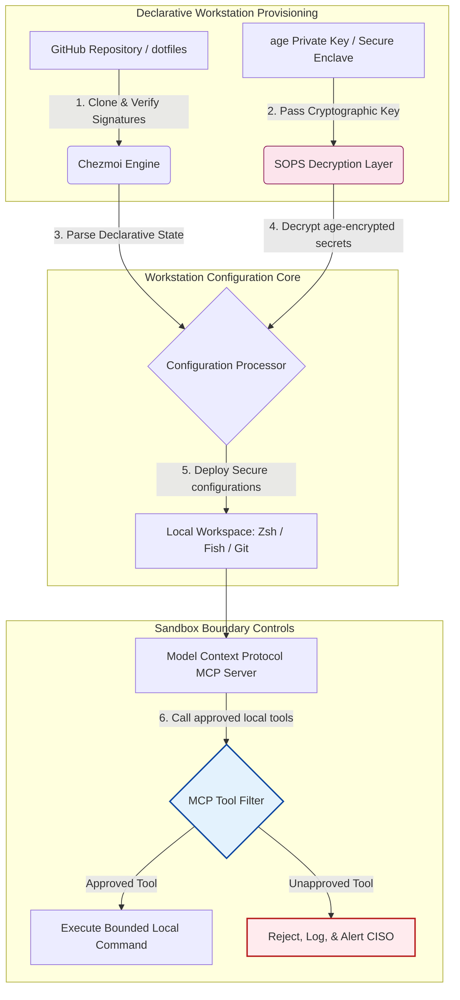

---

# Front Matter (YAML)

author: "contact@sebastienrousseau.com (Sebastien Rousseau)"
banner_alt: "어둑한 조명 속 개발자 워크스테이션 — MCP 서버, SLSA 서명, age/SOPS 시크릿, 멀티 셸 호환성을 갖춘 AI 인식·재현 가능·보안 dotfiles를 상징"
banner_height: "1597"
banner_width: "2584"
banner: "https://cloudcdn.pro/stocks/images/almas-salakhov-Vq2ap8aFFEs.webp"
cdn: "https://cloudcdn.pro"
charset: "UTF-8"
cname: "sebastienrousseau.com"
copyright: "© Copyright 2025 - 2026 - Sebastien Rousseau. All rights reserved."
date: "June 16, 2026"
description: "AI 인식 dotfiles는 MCP 시대를 위한 안전하고 재현 가능한 워크스테이션 패턴입니다 — Chezmoi 기반 선언적 구성, SOPS/age 시크릿, SLSA Level 3 출처, 멀티 셸 호환성, 로컬 AI 에이전트를 위한 경계 샌드박스."
format-detection: "telephone=no"
hreflang: "ko"
icon: "https://cloudcdn.pro/clients/sebastienrousseau/v1/logos/sebastienrousseau.svg"
id: "https://sebastienrousseau.com/2026-06-16-ai-aware-dotfiles-secure-reproducible-workstation-2026"
image_alt: "Black and White Portrait of Sebastien Rousseau"
image_height: "162"
image_width: "162"
image: "https://cloudcdn.pro/stocks/images/sebastienrousseau.webp"
keywords: "dotfiles, Chezmoi, MCP, Model Context Protocol, SLSA, SOPS, age 암호화, 선언적 구성, 개발자 워크스테이션, DORA Article 5, NIST CSF 2.0, 공급망 보안, 에이전트형 AI, 멀티 셸 호환성, Zsh, Fish, Nushell"
language: "ko-KR"
last_reviewed: "2026-06-16"
layout: "report"
locale: "ko_KR"
logo_alt: "Logo for Sebastien Rousseau"
logo_height: "44"
logo_width: "44"
logo: "https://cloudcdn.pro/clients/sebastienrousseau/v1/logos/sebastienrousseau.svg"
menu: ""
measurementID: "G-169G4ET5HQ"
name: "Sebastien Rousseau"
permalink: "https://sebastienrousseau.com/2026-06-16-ai-aware-dotfiles-secure-reproducible-workstation-2026"
rating: "general"
referrer: "no-referrer"
robots: "index, follow"
schema: "FAQPage, Article"
seo_title: "AI 인식 dotfiles: 안전한 개발자 워크스테이션"
short_name: "sebastienrousseau"
subtitle: "개발자 워크스테이션은 이제 AI 공급망의 일부입니다. dotfiles에는 보안, 재현성, 시크릿 위생, MCP 인식 워크플로가 필요합니다."
tags: "dotfiles, 개발자 도구, MCP, SLSA, 보안 워크스테이션, chezmoi, macOS, Linux, WSL"
theme-color: "0, 83, 191"
title: "2026년 AI 인식 dotfiles: MCP, SLSA, 멀티 셸 호환성을 위한 안전하고 재현 가능한 개발자 워크스테이션 구축"
url: "https://sebastienrousseau.com/2026-06-16-ai-aware-dotfiles-secure-reproducible-workstation-2026"
viewport: "width=device-width, initial-scale=1, shrink-to-fit=no"

# RSS - The RSS feed front matter (YAML).
atom_link: "https://sebastienrousseau.com/2026-06-16-ai-aware-dotfiles-secure-reproducible-workstation-2026/rss.xml"
category: "Technology"
docs: https://validator.w3.org/feed/docs/rss2.html
generator: "Static Site Generator (SSG) (version 0.0.26)"
item_description: "macOS, Linux, WSL 전반에서 안전하고 재현 가능한 개발자 워크스테이션을 위한 선언적 dotfiles — MCP 인식, SLSA, age, SOPS, 멀티 셸 호환성을 살펴봅니다."
item_guid: "https://sebastienrousseau.com/2026-06-16-ai-aware-dotfiles-secure-reproducible-workstation-2026/rss.xml"
item_link: "https://sebastienrousseau.com/2026-06-16-ai-aware-dotfiles-secure-reproducible-workstation-2026/rss.xml"
item_pub_date: "Tue, 16 Jun 2026 06:06:06 +0000"
item_title: "2026년 AI 인식 dotfiles: MCP, SLSA, 멀티 셸 호환성을 위한 안전하고 재현 가능한 개발자 워크스테이션 구축"
last_build_date: "Tue, 16 Jun 2026 06:06:06 +0000"
managing_editor: "contact@sebastienrousseau.com (Sebastien Rousseau)"
pub_date: "Tue, 16 Jun 2026 06:06:06 +0000"
ttl: "60"
type: "article"
webmaster: "contact@sebastienrousseau.com"

# Apple - The Apple front matter (YAML).
apple_mobile_web_app_orientations: "portrait"
apple_touch_icon_sizes: "192x192"
apple-mobile-web-app-capable: "yes"
apple-mobile-web-app-status-bar-inset: "black"
apple-mobile-web-app-status-bar-style: "black-translucent"
apple-mobile-web-app-title: "AI 인식 dotfiles: 안전한 개발자 워크스테이션"
apple-touch-fullscreen: "yes"

# MS Application - The MS Application front matter (YAML).

msapplication-navbutton-color: "0, 83, 191"

# Twitter Card - The Twitter Card front matter (YAML).

twitter_card: "summary_large_image"
twitter_creator: "@wwdseb"
twitter_description: "macOS, Linux, WSL 전반에서 안전하고 재현 가능한 개발자 워크스테이션을 위한 선언적 dotfiles — MCP 인식, SLSA, age, SOPS, 멀티 셸 호환성을 살펴봅니다."
twitter_image: "https://cloudcdn.pro/clients/sebastienrousseau/v1/logos/sebastienrousseau.svg"
twitter_image_alt: "Logo of Sebastien Rousseau"
twitter_site: "@wwdseb"
twitter_title: "AI 인식 dotfiles: 안전한 개발자 워크스테이션"
twitter_url: "https://sebastienrousseau.com/2026-06-16-ai-aware-dotfiles-secure-reproducible-workstation-2026"

excerpt: "2026년의 AI 인식 dotfiles는 개발자 워크스테이션을 공급망 인프라로 다룹니다 — chezmoi가 관리하는 선언적 구성, MCP 인식, SLSA 서명 릴리스, age/SOPS 시크릿, 서브초 시작, macOS/Linux/WSL 호환성."

# Humans.txt - The Humans.txt front matter (YAML).
author_website: "https://sebastienrousseau.com"
author_twitter: "@wwdseb"
author_location: "London, UK"
thanks: "읽어주셔서 감사합니다!"
site_last_updated: "2026-06-16"
site_standards: "HTML5, CSS3, RSS, Atom, JSON, XML, YAML, Markdown, TOML"
site_components: "Kaishi, Kaishi Builder, Kaishi CLI, Kaishi Templates, Kaishi Themes"
site_software: "Static Site Generator, Rust"

---

# 2026년 AI 인식 dotfiles: MCP, SLSA, 멀티 셸 호환성을 위한 안전하고 재현 가능한 개발자 워크스테이션 구축

<!-- lead-start -->
<aside class="post-lead" aria-label="기사 요약">

<strong>요약.</strong> 개발자 워크스테이션은 더 이상 단순한 엔드포인트가 아닙니다. 소프트웨어 공급망의 능동적 참여자이자 로컬 AI 제어 평면의 직접 인터페이스입니다. 터미널 기반 AI 어시스턴트와 <a href="https://modelcontextprotocol.io">Model Context Protocol (MCP)</a> 서버는 로컬 셸 명령을 실행하고, 리포지토리를 점검하며, 민감한 구성 파일을 직접 읽습니다. <a href="https://github.com/sebastienrousseau/dotfiles">Sebastien Rousseau의 Dotfiles</a>는 macOS, Linux, Windows Subsystem for Linux (WSL) 전반에서 안전하고 재현 가능한 워크스테이션을 구축하는 선언적 오픈 소스 프레임워크입니다 — <a href="https://www.chezmoi.io/">Chezmoi</a>, <a href="https://github.com/getsops/sops">SOPS, age</a>, SLSA Level 3 빌드 출처를 통합하여 메모리 안전 시크릿 격리와 로컬 AI 모델을 위한 경계 실행 경로를 제공합니다.

<strong>핵심 시사점</strong>

<ul class="post-lead-takeaways">
  <li><strong>워크스테이션은 공급망 인프라입니다.</strong> 개발 환경 구성은 운영 서버 배포와 동일한 선언적 엄격함으로 다뤄야 하며, 수동 구성 표류를 제거해야 합니다.</li>
  <li><strong>AI 제어 평면 과제.</strong> 터미널 기반 AI 모델과 MCP 도구는 로컬 디렉터리에 접근할 수 있습니다. dotfiles는 경계 샌드박스, 엄격한 도구 권한 목록, 변경 불가능한 로컬 로그를 강제해 데이터 유출을 방지해야 합니다.</li>
  <li><strong>완벽한 크로스플랫폼 호환성.</strong> macOS, Linux (Zsh, Fish, Nushell), WSL 전반에서 동일한 서브초 셸 성능과 보안 프로파일을 유지하며, 개발자 온보딩 시간을 몇 주에서 몇 분으로 단축합니다.</li>
  <li><strong>암호학적으로 안전한 시크릿 격리.</strong> SOPS와 age 파일 암호화는 하드코딩된 자격 증명(GitHub 토큰, 클라우드 액세스 키)이 Git에 커밋되거나 로컬 LLM에 읽히는 것을 막습니다.</li>
  <li><strong>이사회 차원의 수탁자 가치.</strong> 워크스테이션 구성 컴플라이언스를 명확한 이사회 우선순위로 환산하여 DORA Article 5, NIST CSF 2.0 엔드포인트 표준, Basel III 운영 리스크 감축을 뒷받침합니다.</li>
</ul>

<strong>관련 읽을거리:</strong> <a href="https://sebastienrousseau.com/2026-05-23-agentic-payments-banking-consent-liability-new-payment-ux-2026">2026년 뱅킹의 에이전트형 결제: 동의, 책임, 새로운 결제 UX</a>, <a href="https://sebastienrousseau.com/2024-03-12-revolutionising-real-time-speech-recognition-on-macos-with-openai-whisper/index.html">macOS에서의 빠른 실시간 음성 인식: OpenAI Whisper</a>, <a href="https://sebastienrousseau.com/2024-02-26-google-gemma-ai-transforming-open-source-ai-development/index.html">Google Gemma AI: 오픈 소스 AI 개발의 전환</a>.

</aside>
<!-- lead-end -->

로컬 AI 모델과 에이전트형 개발자 도구가 보편화된 시대에, 선언적 워크스테이션 구성과 안전한 소프트웨어 공급망 사이의 간극을 메웁니다.

이 글의 오픈 소스 기준점은 [dotfiles ⧉](https://github.com/sebastienrousseau/dotfiles "dotfiles — 선언적 워크스테이션 구성")입니다. 이 리포지토리는 macOS, Linux, WSL을 위한 선언적 dotfiles로 자리매김하며, 멀티 셸 호환성, 서브초 시작, SLSA 서명 릴리스, AI/MCP 인식 구성을 제공합니다.

## 이 오픈 소스 프로젝트가 2026년에 중요한 이유

2026년 6월, 개발자 워크스테이션은 소프트웨어 공급망에서 가장 약한 고리이자 정교한 국가 후원·범죄형 사이버 조직이 노리는 고가치 표적입니다.

개발 환경의 보안 양상은 터미널 기반 AI 코딩 어시스턴트(예: Claude Code)의 부상과 Model Context Protocol (MCP)의 도입으로 급격히 바뀌었습니다. 이제 로컬 개발자 터미널은 다음과 같은 능력을 갖춘 능동적이고 자율적인 AI 에이전트를 호스팅합니다:

- 로컬 소스 파일 읽기와 편집.
- 로컬 CLI 도구 호출(`git`, `npm`, `aws`, `kubectl`).
- 셸 환경 변수, 로컬 데이터베이스, 구성 설정 점검.

개발자의 로컬 환경에 엄격한 경계가 없다면, 이러한 자율 AI 도구는 의도치 않게 민감한 개인 데이터를 읽거나, 클라우드 자격 증명을 공개 LLM API로 유출하거나, 자동화된 빌드 과정에서 악성 패키지를 실행할 수 있습니다.

Digital Operational Resilience Act (DORA)와 NIST Cybersecurity Framework (CSF) 2.0에 따라, 금융기관은 소프트웨어 공급망에 접근하는 모든 장치의 출처와 보안 무결성을 법적으로 검증해야 합니다. "눈송이 노트북" — 수동 구성되고 감사되지 않으며 표류하는 구성 — 은 더 이상 글로벌 뱅킹 표준을 만족하지 못합니다.

[Sebastien Rousseau의 Dotfiles](https://github.com/sebastienrousseau/dotfiles)는 이 문제를 해결합니다. 안전하고 재현 가능한 개발자 워크스테이션을 구축하는 오픈 소스 선언적 워크스테이션 관리 프레임워크입니다. 표준화되고 감사 가능한 구성 기준선을 강제함으로써, 이 프로젝트는 높은 Return on Resilience (RoR)을 제공하며, 개발자 온보딩 시간을 몇 주에서 몇 시간으로 단축하고 민감한 금융 공급망을 엔드포인트 취약점으로부터 보호합니다.

## 2026년 AI 인식 워크스테이션 아키텍처 관점

dotfiles 프레임워크는 안전한 선언적 환경 관리자로 작동합니다 — 모든 로컬 셸, 도구, 시크릿이 체계적으로 관리·감사·격리됩니다:

| 계층 | 설계 결정 | 중요한 이유 | 잘못 다뤘을 때의 위험 |
|---|---|---|---|
| **프로비저닝 계층** | Chezmoi 기반 선언적 구성 관리 | macOS, Linux, WSL 전반에서 완전히 재현 가능한 워크스테이션을 구축하며 표류를 제거합니다. | 감사되지 않고 취약한 로컬 상태를 가진 눈송이 구성. |
| **셸 계층** | 멀티 셸 호환성 (Zsh, Fish, Nushell) | 서로 다른 환경에서도 동일한 서브초 시작과 일관된 별칭 동작을 보장합니다. | 셸 명령 불일치로 인한 예기치 못한 스크립트 결과. |
| **시크릿 계층** | SOPS와 age를 이용한 파일 암호화 | 하드코딩된 자격 증명과 원시 키가 Git에 커밋되거나 로컬 LLM에 노출되는 것을 방지합니다. | 공개 리포지토리 이력에 자격 증명이 유출되거나 로컬 에이전트가 자격 증명을 침해. |
| **AI/MCP 계층** | Model Context Protocol 경계 통제 | 로컬 AI 에이전트를 승인된 도구 목록으로 제한하고 모든 로컬 실행을 기록합니다. | 무제한 AI 에이전트가 로컬에서 폭주하거나 파괴적인 명령을 실행. |
| **공급망 계층** | SLSA 서명 릴리스와 Sigstore 검증 | 부트스트랩 스크립트와 구성 파일의 진정성을 암호학적으로 입증합니다. | 침해된 설정 스크립트가 개발자 환경에 악성 백도어를 주입. |

## 핵심 워크스테이션 보안 및 자동화 신호

개발 자산 전반에 절대적 보안을 유지하려면, Chief Information Security Officer (CISO)와 기술 관리자는 정량화 가능한 운영 지표를 추적해야 합니다:

| 신호 | 지표 / 운영 벤치마크 | NIST CSF / DORA 참조 | 기술 플랫폼 구현 |
|---|---|---|---|
| **워크스테이션 재현성** | 선언적 dotfile 리포지토리로 완전히 관리되어 구성 표류가 없는 개발자 노트북 비율. | NIST CSF 2.0 (PR.DS-01) | 터미널 시작 시 자동 실행되는 Chezmoi 표류 감지 감사. |
| **자격 증명 위생** | 로컬 구성 파일 전반에 평문으로 저장된 미암호화 시크릿이나 키 0건. | DORA Article 6 (ICT Security) | Git 사전 커밋 훅과 로컬 스캔이 미암호화 파일을 거부. |
| **빌드 출처** | 암호학적으로 서명된 매니페스트로 검증된 워크스테이션 부트스트랩 유틸리티 100%. | DORA Article 30 (Supply Chain) | 설정 파이프라인에 내장된 Sigstore와 SLSA Level 3 검증. |
| **개발자 온보딩 시간** | 원시 하드웨어 프로비저닝에서 완전히 구성되고 준수된 개발 작업 공간까지 걸린 시간. | Return on Resilience (RoR) | 15분 이내에 환경을 컴파일하는 자동화된 선언적 설정 스크립트. |
| **AI 에이전트 경계 접근** | 로컬 AI 도구가 정의된 디렉터리 한계 내에서 읽기 전용 기본값으로 작동하는지 검증. | Model Risk Management | 에이전트 도구 카탈로그를 승인된 작업으로 제한하는 MCP 구성 프로파일. |

## 선언적 구성이 워크스테이션 보안의 핵심인 이유

개발자 워크스테이션 설정에 대한 전통적 접근은 매우 수동적이며 그 결과 "눈송이 노트북"을 만듭니다 — 개발자가 사용자 정의 도구를 설치하고, 변수를 조정하고, 로컬 스크립트를 수정함에 따라 시간이 지나면서 구성이 표류하는 환경입니다. 이러한 표류는 몇 가지 치명적인 취약점을 낳습니다:

1. **추적되지 않는 섀도 구성.** 표류하는 노트북은 종종 오래되고 취약한 소프트웨어 패키지나, 기업 보안 도구를 우회하는 로컬 스크립트를 실행합니다.
2. **시크릿 유출.** 개발자는 종종 API 키, GitHub 토큰, AWS 자격 증명을 평문 스크립트나 셸 프로파일에 직접 하드코딩하여 도난에 매우 취약해집니다.
3. **비효율적인 온보딩.** 새 개발자 워크스테이션을 수동으로 설정하는 데 최대 2주의 엔지니어링 시간이 소요되어 팀 속도에 영향을 미칩니다.

Chezmoi를 사용한 선언적·모델 주도 구성으로 전환하면, 개발 작업 공간 전체가 버전 관리되고 재현 가능한 기록 시스템이 됩니다. 모든 변경, 별칭, 패키지 종속성, 보안 기본값이 Git에 문서화되고, 조직의 컴플라이언스 정책에 대해 검증되며, 물리적 노트북에 적용되기 전 암호학적으로 검증됩니다.

## 경계 AI 개발 환경 설계

로컬 AI 에이전트와 MCP 도구가 로컬 자산에 무제한 접근하는 것을 방지하려면, 워크스테이션은 경계 실행 평면으로 작동해야 합니다.

아래 운영 흐름은 dotfiles 프레임워크가 Chezmoi, SOPS, age를 조율하여 안전한 dotfiles를 복호화·배포하면서, MCP 도구를 호출하는 로컬 AI 에이전트에 대한 격리된 샌드박스 실행 경계를 유지하는 방식을 보여줍니다:

## 이사회 플레이북과 수탁자 책임

개발자 워크스테이션 보안과 공급망 무결성은 중대한 이사회 우선순위입니다. 임원진은 개발 환경 리스크를 수탁자 책임, 규제 준수, 사업 가치 보존의 관점에서 다뤄야 합니다:

- **DORA Article 5 (이사회 책임).** 경영진(이사회)이 기관의 ICT 리스크 관리에 대한 궁극적 책임을 진다고 규정합니다. 개발자 워크스테이션이 소프트웨어 공급망으로 가는 관문이기 때문에, 이사회 임원은 엔드포인트가 안전하고, 완전히 감사 가능하며, 엄격한 재현 가능한 구성 프레임워크에서 관리되어 규제 감사 요건을 충족하는지 검증해야 합니다.
- **NIST CSF 2.0 컴플라이언스 (엔드포인트 보안).** 표준화된 안전한 구성을 실행하는 인가·검증된 장치만이 기업 네트워크와 리포지토리에 접근할 수 있도록 요구합니다. 선언적 dotfiles는 보안 팀이 모든 개발 환경이 조직의 보안 기준선을 준수함을 수학적으로 입증할 수 있게 해, 감사되지 않은 "눈송이" 설정의 위험을 제거합니다.
- **재무상태표 가치 보존.** 단 한 건의 침해된 개발자 자격 증명이나 공급망 침해 사고도 기관에 수백만 달러의 복구 비용, 규제 벌금, 평판 손상을 초래할 수 있습니다. 안전한 선언적 개발 환경으로 전환하면 이러한 위험이 직접적으로 최소화되어 재무상태표 가치를 보존하고 고객 신뢰를 보호합니다.

## 은행 유형별 의미

### 글로벌 시스템상 중요 은행 (G-SIBs)

G-SIBs는 여러 대륙과 규제 관할에 걸쳐 수천 대의 개발자 워크스테이션을 관리합니다. 주된 과제는 대규모 엔지니어링 팀 전반에서 구성 일관성을 유지하고 자격 증명 유출을 방지하는 것입니다. Chezmoi를 사용한 선언적 오픈 소스 dotfiles 모델을 채택하면, G-SIBs는 글로벌 조직 전반에서 엔드포인트 보안을 표준화하고, 컴플라이언스 감사를 자동화하며, 개발자 온보딩 시간을 몇 주에서 몇 분으로 단축할 수 있습니다.

### 트랜잭션·기업금융 은행

트랜잭션 은행은 민감한 결제 게이트웨이와 도매 청산 인프라를 운영합니다. 이러한 운영 환경에 배포되는 코드의 절대적 무결성을 입증하는 것은 협상 불가능한 규제 요구입니다. 안전한 SLSA 준수 dotfiles 프레임워크 아래 개발자 워크스테이션을 표준화하면, 소프트웨어 공급망이 완전히 감사되고 로컬 개발자 엔드포인트 취약점으로부터 보호됨을 보장합니다.

### 지역·중소형 은행

지역 은행은 G-SIBs와 같은 막대한 보안 예산 없이도 높은 사이버 보안 표준을 유지해야 합니다. 이 오픈 소스 dotfiles 프레임워크는 가볍고 비용 효율적이며 Python·Rust 친화적인 매우 안전한 해결책을 제공해, 중소형 기관이 값비싼 독점 소프트웨어 라이선스 없이도 엔터프라이즈급 엔드포인트 보안과 공급망 보호를 구현할 수 있게 합니다.

## 결론: 개발자 워크스테이션 로드맵

개발자 워크스테이션은 더 이상 주변 장치가 아닙니다. 소프트웨어 공급망의 중대한 제어 평면입니다. 수동 구성되고 감사되지 않은 "눈송이 노트북"이 기업 자산에 접근하도록 허용하는 것은 심각한 운영·규제 리스크입니다.

소프트웨어 공급망을 보호하고 로컬 AI 에이전트 취약점으로부터 엔드포인트를 보호하려면, 시니어 기술·보안 관리자는 오늘 명확한 개발 로드맵을 실행해야 합니다:

1. **선언적 프로비저닝 의무화.** 수동·문서 주도 설정 절차를 단계적으로 폐지하고, 모든 개발 환경이 Chezmoi를 사용해 선언적으로 프로비저닝되도록 의무화하십시오.
2. **시크릿 위생 강제.** 엄격한 사전 커밋 훅과 스캔 유틸리티를 강제하여, 로컬 워크스테이션 구성 전반에 원시 자격 증명, 키, API 토큰이 평문으로 저장되지 않도록 보장하십시오.
3. **AI 샌드박스 경계 수립.** 안전한 경계 MCP 구성 프로파일을 구현하여 로컬 AI 코딩 어시스턴트와 에이전트를 승인된 읽기 전용 도구와 디렉터리로 제한하십시오.
4. **공급망 보안.** 모든 부트스트랩 스크립트와 환경 구성이 배포 전 SLSA Level 3 출처로 암호학적으로 검증되도록 보장하십시오.

## 자주 묻는 질문

**Chezmoi란 무엇이며 왜 dotfiles에 사용하나요?**

Chezmoi는 안전한 선언적 오픈 소스 dotfile 관리자입니다. 개발자는 로컬 구성을 버전 관리 리포지토리로 관리할 수 있으며, 서로 다른 운영 체제(macOS, Linux, WSL) 전반에서 절대적인 일관성과 재현성을 보장합니다.

**프레임워크는 시크릿을 어떻게 보호하나요?**

프레임워크는 SOPS (Secrets Operations)와 age 파일 암호화를 사용해 민감한 자격 증명(GitHub 토큰이나 클라우드 액세스 키 등)을 dotfile 리포지토리 내부에서 직접 암호화합니다. 이로써 키가 평문으로 커밋되거나 인가되지 않은 로컬 AI 에이전트에 읽히는 것을 방지합니다.

**Model Context Protocol (MCP)은 무엇이며 보안에 어떤 영향을 미치나요?**

MCP는 AI 모델이 로컬 도구를 안전하게 실행하고 파일에 접근할 수 있게 하는 오픈 표준입니다. dotfiles 프레임워크는 엄격한 MCP 구성 파일을 구현해 로컬 AI 도구와 에이전트를 승인된 디렉터리와 명령으로 제한합니다.

**프레임워크가 지원하는 셸은 무엇인가요?**

Bash, Zsh, Fish, Nushell, PowerShell — macOS, Linux, WSL 전반의 호환성을 갖춰 개발자가 어떤 터미널을 열든 명령 동작이 동일하게 유지됩니다.

## 참고문헌

- Open Source Security Foundation (OpenSSF), (2024). *Supply-chain Levels for Software Artifacts (SLSA)*. 출처: [SLSA Framework ⧉](https://slsa.dev/ "SLSA 프레임워크").
- NIST, (2024). *NIST Cybersecurity Framework 2.0*. Gaithersburg: National Institute of Standards and Technology. 출처: [NIST CSF 2.0 ⧉](https://www.nist.gov/cyberframework "NIST Cybersecurity Framework 2.0").
- European Parliament and Council of the European Union, (2022). *Regulation (EU) 2022/2554 on digital operational resilience for the financial sector (DORA)*. Brussels: Official Journal of the European Union. 출처: [DORA 규정 ⧉](https://eur-lex.europa.eu/legal-content/EN/TXT/?uri=CELEX%3A32022R2554 "DORA 규정").
- GitHub, (2026). *dotfiles 오픈 소스 리포지토리*. 출처: [dotfiles 리포지토리 ⧉](https://github.com/sebastienrousseau/dotfiles "dotfiles 리포지토리").

<!-- enrich-start -->
<aside class="author-card" aria-label="저자 소개"><strong class="author-card-name"><a href="/about/index.html">Sebastien Rousseau</a></strong>응용 AI, ISO 20022 마이그레이션, 금융 서비스를 위한 양자내성 암호, 도매 결제의 구조적 전환을 다루는 시니어 뱅킹 기술 전문가.HSBC 상업·투자은행, PayPal, Barclays, Shazam, AKQA, Virgin Group을 아우르는 20년 이상의 경력. <a href="/about/index.html">전체 프로필</a> &middot; <a href="https://www.linkedin.com/in/sebastienrousseau/" rel="external noopener">LinkedIn</a> &middot; <a href="https://github.com/sebastienrousseau" rel="external noopener">GitHub</a></aside>

최종 검토 <time datetime="2026-06-16">2026-06-16</time>.

<aside class="related-posts" aria-labelledby="related-heading">
<h2 id="related-heading" class="related-heading">관련 읽을거리</h2>

<article class="related-card"><footer class="related-body"><h3><a href="https://sebastienrousseau.com/2026-05-23-agentic-payments-banking-consent-liability-new-payment-ux-2026">2026년 뱅킹의 에이전트형 결제: 동의, 책임, 새로운 결제 UX</a></h3>
<time datetime="2026-05-23">2026-05-23</time>
</footer></article>
<article class="related-card"><footer class="related-body"><h3><a href="https://sebastienrousseau.com/2024-03-12-revolutionising-real-time-speech-recognition-on-macos-with-openai-whisper/index.html">macOS에서의 빠른 실시간 음성 인식: OpenAI Whisper</a></h3>
<time datetime="2024-03-12">2024-03-12</time>
</footer></article>
<article class="related-card"><footer class="related-body"><h3><a href="https://sebastienrousseau.com/2024-02-26-google-gemma-ai-transforming-open-source-ai-development/index.html">Google Gemma AI: 오픈 소스 AI 개발의 전환</a></h3>
<time datetime="2024-02-26">2024-02-26</time>
</footer></article>

</aside>
<!-- enrich-end -->
