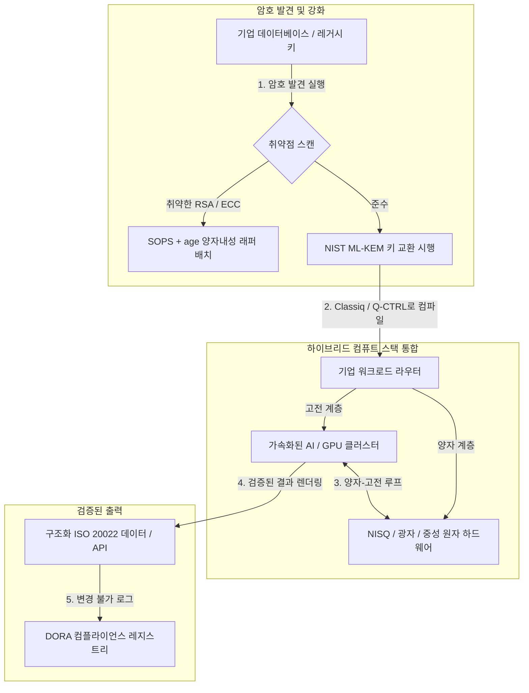

---

# Front Matter (YAML)

author: "contact@sebastienrousseau.com (Sebastien Rousseau)"
banner_alt: "런던에서 열린 Economist Impact 제5회 Commercialising Quantum Global 2026 정상회의의 무대 전경 — 양자 기술이 물리학 연구에서 기업용 워크플로로 전환되는 흐름을 상징"
banner_height: "1597"
banner_width: "2584"
banner: "https://cloudcdn.pro/stocks/images/sebastien-rousseau-20260617-5th-commercialising-quantum-2.webp"
cdn: "https://cloudcdn.pro"
charset: "UTF-8"
cname: "sebastienrousseau.com"
copyright: "© Copyright 2025 - 2026 - Sebastien Rousseau. All rights reserved."
date: "June 17, 2026"
description: "Economist Impact 제5회 Commercialising Quantum Global 2026 정상회의의 이사회 시사점 — 13억 달러 자금 급증, 무리 없는 하이브리드 스택, 양자내성 암호 이전의 시급성, 양자 센싱의 상업화, 그리고 기다림이 자초한 실책이라는 HSBC의 단호한 지침."
format-detection: "telephone=no"
hreflang: "ko"
icon: "https://cloudcdn.pro/clients/sebastienrousseau/v1/logos/sebastienrousseau.svg"
id: "https://sebastienrousseau.com/2026-06-17-economist-commercialising-quantum-summit-2026"
image_alt: "Black and White Portrait of Sebastien Rousseau"
image_height: "162"
image_width: "162"
image: "https://cloudcdn.pro/stocks/images/sebastien-rousseau.png"
keywords: "Commercialising Quantum Global 2026, Economist Impact 정상회의, 양자내성 암호, NIST ML-KEM, harvest-now decrypt-later, SNDL, HSBC 양자, Philip Intallura, 양자 센싱, GPS 독립 항법, NQCC, EU Quantum Act, Quantcore, qBIG 상, Lord Vallance, 하이브리드 양자-고전, DORA Article 6"
language: "ko-KR"
last_reviewed: "2026-06-17"
layout: "report"
locale: "ko_KR"
logo_alt: "Logo for Sebastien Rousseau"
logo_height: "44"
logo_width: "44"
logo: "https://cloudcdn.pro/clients/sebastienrousseau/v1/logos/sebastienrousseau.svg"
menu: ""
measurementID: "G-169G4ET5HQ"
name: "Sebastien Rousseau"
permalink: "https://sebastienrousseau.com/2026-06-17-economist-commercialising-quantum-summit-2026"
rating: "general"
referrer: "no-referrer"
robots: "index, follow"
schema: "FAQPage, Article"
seo_title: "Commercialising Quantum 2026: 이사회 시사점"
short_name: "sebastienrousseau"
subtitle: "양자는 사변적 실험실 과학에서 하이브리드 기업 워크플로로 넘어왔습니다. 이사회는 2026년 13억 달러의 자금, 즉각적인 양자내성 이전, 그리고 더 이상 기다리지 말라는 HSBC의 지침에 응답해야 합니다."
tags: "양자, 양자내성 암호, NIST ML-KEM, harvest-now decrypt-later, 양자 센싱, HSBC, Economist Impact, 하이브리드 컴퓨트, DORA, EU Quantum Act, NQCC, 정상회의 시사점"
theme-color: "0, 83, 191"
title: "큐비트에서 수익으로: Economist 제5회 Commercialising Quantum Global 2026 정상회의의 전략적 시사점"
url: "https://sebastienrousseau.com/2026-06-17-economist-commercialising-quantum-summit-2026"
viewport: "width=device-width, initial-scale=1, shrink-to-fit=no"

# RSS - The RSS feed front matter (YAML).
atom_link: "https://sebastienrousseau.com/2026-06-17-economist-commercialising-quantum-summit-2026/rss.xml"
category: "Technology"
docs: https://validator.w3.org/feed/docs/rss2.html
generator: "Static Site Generator (SSG) (version 0.0.26)"
item_description: "Economist Impact 제5회 Commercialising Quantum Global 2026 정상회의의 이사회 시사점 — 13억 달러 자금 급증, 무리 없는 하이브리드 스택, 양자내성 암호 이전의 시급성, 양자 센싱의 상업화, 그리고 기다림이 자초한 실책이라는 HSBC의 단호한 지침."
item_guid: "https://sebastienrousseau.com/2026-06-17-economist-commercialising-quantum-summit-2026/rss.xml"
item_link: "https://sebastienrousseau.com/2026-06-17-economist-commercialising-quantum-summit-2026/rss.xml"
item_pub_date: "Wed, 17 Jun 2026 06:06:06 +0000"
item_title: "큐비트에서 수익으로: Economist 제5회 Commercialising Quantum Global 2026 정상회의의 전략적 시사점"
last_build_date: "Wed, 17 Jun 2026 06:06:06 +0000"
managing_editor: "contact@sebastienrousseau.com (Sebastien Rousseau)"
pub_date: "Wed, 17 Jun 2026 06:06:06 +0000"
ttl: "60"
type: "article"
webmaster: "contact@sebastienrousseau.com"

# Apple - The Apple front matter (YAML).
apple_mobile_web_app_orientations: "portrait"
apple_touch_icon_sizes: "192x192"
apple-mobile-web-app-capable: "yes"
apple-mobile-web-app-status-bar-inset: "black"
apple-mobile-web-app-status-bar-style: "black-translucent"
apple-mobile-web-app-title: "Commercialising Quantum 2026: 이사회 시사점"
apple-touch-fullscreen: "yes"

# MS Application - The MS Application front matter (YAML).

msapplication-navbutton-color: "0, 83, 191"

# Twitter Card - The Twitter Card front matter (YAML).

twitter_card: "summary_large_image"
twitter_creator: "@wwdseb"
twitter_description: "Economist Impact 제5회 Commercialising Quantum Global 2026 정상회의의 이사회 시사점 — 13억 달러 자금 급증, 무리 없는 하이브리드 스택, 양자내성 암호 이전의 시급성, 양자 센싱의 상업화, 그리고 기다림이 자초한 실책이라는 HSBC의 단호한 지침."
twitter_image: "https://cloudcdn.pro/clients/sebastienrousseau/v1/logos/sebastienrousseau.svg"
twitter_image_alt: "Logo of Sebastien Rousseau"
twitter_site: "@wwdseb"
twitter_title: "Commercialising Quantum 2026: 이사회 시사점"
twitter_url: "https://sebastienrousseau.com/2026-06-17-economist-commercialising-quantum-summit-2026"

excerpt: "Economist Impact 제5회 Commercialising Quantum Global 2026 정상회의는 양자가 기업 워크플로로 선회했음을 확인했습니다. 5개월 만에 13억 달러가 모였고, SNDL 수집 위협 아래 양자내성 암호는 이사회 차원의 수탁자 사안이 되었으며, 양자 센싱은 이미 GPS 독립 항법용으로 출하되고 있습니다. HSBC의 Philip Intallura는 결함 허용 하드웨어를 기다리는 것이 자초한 실책이라는 단호한 지침을 전했습니다."

# Humans.txt - The Humans.txt front matter (YAML).
author_website: "https://sebastienrousseau.com"
author_twitter: "@wwdseb"
author_location: "London, UK"
thanks: "읽어주셔서 감사합니다!"
site_last_updated: "2026-06-17"
site_standards: "HTML5, CSS3, RSS, Atom, JSON, XML, YAML, Markdown, TOML"
site_components: "Kaishi, Kaishi Builder, Kaishi CLI, Kaishi Templates, Kaishi Themes"
site_software: "Static Site Generator, Rust"

---

# 큐비트에서 수익으로: Economist 제5회 Commercialising Quantum Global 2026 정상회의의 전략적 시사점

기업 준비도, 양자내성 암호 이전, 하이브리드 컴퓨트 스택, 그리고 양자 센싱과 네트워킹의 떠오르는 상업적 지형을 다룹니다.

**요약.** 2026년 6월 16일부터 17일까지 런던 Business Design Centre에서 Economist Impact가 주최한 제5회 Commercialising Quantum Global 2026 컨퍼런스에는 기업, 금융, 정책, 연구 분야의 글로벌 리더 1,100명 이상이 모였습니다. 중심 주제는 명확한 구조적 전환을 가리켰습니다. 양자 기술이 사변적 실험실 과학에서 실용적이고 하이브리드한 기업 워크플로로 이행했다는 사실입니다. 2026년 첫 5개월 동안만 벤처 캐피털 13억 달러가 유입되면서, 이사회의 논의는 더 이상 물리적 큐비트 수를 헤아리는 데 있지 않습니다. 무리 없는("no-regrets") 하이브리드 컴퓨트 스택의 구축, "harvest-now, decrypt-later" (SNDL) 암호 위협으로부터의 디지털 자산 보호, 그리고 GPS 독립 항법을 위한 단기 양자 센싱 시스템의 배치로 옮겨갔습니다.

## 핵심 시사점

- **기업의 실용 워크플로로의 전환.** 업계 리더들(HorizonX의 [Steve Suarez](https://www.linkedin.com/in/stevesuarez), HSBC의 [Phil Intallura](https://www.linkedin.com/in/intallura))은 양자 통합이 더 이상 물리학 문제가 아니라 운영의 문제임을 강조했습니다. 은행과 기업은 인재를 양성하고 현행 워크로드를 최적화하기 위해 하이브리드 양자-고전 파일럿을 배포하고 있습니다.
- **양자내성 암호 (PQC)는 이사회 우선순위입니다.** 보안과 법률 전문가들(CMS UK, Microsoft의 [Joanne Miller](https://www.linkedin.com/in/joanne-miller-nso), EY의 [Craig Farrell](https://www.linkedin.com/in/craig-farrell))은 PQC 배치를 위해 결함 허용 하드웨어를 기다릴 수 없다고 경고했습니다. "Harvest-now, decrypt-later" 수집은 오늘 일어나고 있으며, NIST ML-KEM 표준으로의 이전은 즉각적인 수탁자 사안입니다.
- **양자 센싱이 단기 수익성을 견인합니다.** 결함 허용 컴퓨팅은 아직 수년이 남았지만, 양자 센싱(Infleqtion의 [Matthew Kinsella](https://www.linkedin.com/in/matthewkinsella))은 빠르게 확장되고 있습니다. 양자 시계와 관성 센서는 GPS 독립 항법, 국가 안보, 초안정 에너지 그리드에 배치되고 있습니다.
- **주권, 클러스터, 정책의 시급성.** 영국 과학부 장관 [Lord Vallance](https://www.linkedin.com/in/patrick-vallance)와 [Lord William Hague](https://www.linkedin.com/in/williamhague)는 연구를 National Quantum Computing Centre (NQCC)와 협력하는 산업 규모의 "슈퍼클러스터"로 전환하는 국가 임무를 제시했습니다. 곧 시행될 EU Quantum Act는 주권적 컴퓨팅 역량을 둘러싼 지정학적 경쟁을 한층 부각시킵니다.
- **Quantcore가 qBIG 상을 수상했습니다.** University of Glasgow 스핀아웃 Quantcore는 전통 소재보다 높은 온도에서 작동해 극저온 인프라 부담을 크게 줄이는 니오븀 기반 초전도 부품의 혁신으로 IOP qBIG 상을 거머쥐었습니다.

**관련 읽을거리:** [2026년 KyberLib과 양자내성 뱅킹 이전: 표준에서 코드까지](https://sebastienrousseau.com/2026-06-12-kyberlib-post-quantum-banking-migration-standards-code-2026/), [2026년 뱅킹 회복탄력성 지수: AI, 클라우드, 양자, 결제, 제3자 집중 리스크](https://sebastienrousseau.com/2026-06-08-banking-resilience-index-ai-cloud-quantum-payments-third-party-risk-2026/), [2026년 클라우드 네이티브 뱅킹 지수: DORA, 플랫폼 엔지니어링, 주권 클라우드, 운영 회복탄력성](https://sebastienrousseau.com/2026-06-05-cloud-native-banking-index-dora-resilience-platform-engineering-2026/).

## 01. 2026년 정상회의가 이사회에 중요한 이유

Economist의 Commercialising Quantum Global 정상회의의 2026년판은 기업 세계가 딥테크를 평가하는 방식의 영구적 전환을 표시했습니다.

역사적으로 양자 컴퓨팅은 수십 년에 걸친 과학적 시도로서 R&D 부서에 국한되어 있었습니다. 2026년 6월, 이러한 관점은 더 이상 유효하지 않습니다. 조직은 "물리학 중심"의 호기심에서 "비즈니스 중심"의 구현으로 이행해야 합니다. 그 이유는 두 가지입니다.

1. **양자-AI 융합.** HPC 스택은 고전, 가속화된 AI, NISQ (Noisy Intermediate-Scale Quantum) 노드를 단일하고 통합된 컴퓨트 계층으로 합치고 있습니다. 양자 대응 애플리케이션 구축을 미루는 조직은 전략적 우위를 확보할 시간 창이 예상보다 빠르게 닫히고 있음을 깨닫게 될 것입니다.
2. **지정학과 수탁자 시급성.** 영국의 임무 주도 양자 프로그램과 곧 시행될 EU Quantum Act에 따라, 양자 역량은 국가 주권과 기업 지속성의 문제가 되었습니다.

또한 양자내성 사이버 보안은 더 이상 미래의 컴플라이언스 요건이 아닙니다. 적대적 "store now, decrypt later" (SNDL) 공격의 위협은, 오늘 가로채진 기업 데이터가 상용 양자 시스템이 확장되는 시점에 복호화된다는 의미입니다. 이는 Digital Operational Resilience Act (DORA)와 같은 글로벌 운영 회복탄력성 의무 아래 즉각적 책임을 발생시킵니다.

## 02. Commercialising Quantum 2026 전략적 렌즈

기업 기술 리더는 양자 성숙도를 다섯 가지 운영 계층에 매핑하고, 시간축과 재무상태표 리스크를 평가해야 합니다.

### 표 1: Commercialising Quantum 2026 전략적 렌즈

| 계층 | 기업의 초점 | 시간축 / 호라이즌 | 핵심 기업 리스크 |
| :---- | :---- | :---- | :---- |
| **하드웨어 및 컴파일러** | 경쟁 접근(초전도, 트랩 이온, 중성 원자, 광자) 사이의 선택 | 3 – 5년 (결함 허용) | 막다른 아키텍처에 묶이거나 단일 플랫폼에 너무 일찍 베팅. |
| **암호 강화** | 암호 종속성의 발견과 인벤토리; NIST ML-KEM으로의 이전 | 즉시 (진행 중인 이전) | 체계적 데이터 침해와 DORA 및 NIST CSF 2.0 컴플라이언스 실패. |
| **양자 센싱** | GPS 독립 항법, 초안정 시계, 중력계의 배치 | 1 – 2년 (즉각 상업화) | GPS 재밍으로 인한 물류, 해운, 에너지 그리드의 운영 중단. |
| **시스템 통합** | 양자 하드웨어를 기존 고전 HPC와 슈퍼컴퓨팅 데이터센터에 연결 | 1 – 3년 (하이브리드 단계) | 높은 지연, 데이터 전송 병목, 분절된 컴퓨트 사일로. |
| **엔터프라이즈 소프트웨어** | 양자 알고리즘을 고수준 추상화 계층과 API로 노출 (Classiq, Q-CTRL) | 즉시 (스킬 구축) | 실제 엔지니어링 실행으로부터의 인재 및 워크플로 단절. |

## 03. 핵심 양자 신호와 이사회 트리거

기술 리더는 양자 투자 의사결정을 안내하기 위해 정량화 가능한 시장·규제 지표를 모니터링해야 합니다.

### 표 2: 핵심 양자 신호와 이사회 트리거

| 신호 | 정량 지표 | 규제 / 정책 참조 | 실행 가능한 플랫폼 우선순위 |
| :---- | :---- | :---- | :---- |
| **양자 자금 급증** | 2026년 첫 5개월 동안 전 세계 13억 달러 조달 | Return on Resilience (RoR) | 예산을 사변적 파일럿에서 무리 없는 하이브리드 양자-고전 워크로드로 전환. |
| **데이터 복호화 노출** | 공개 채널로 전송된 암호화 데이터의 100%가 SNDL 수집에 노출 | DORA Article 6 (ICT 보안) | 전사 자산 전반에서 취약한 RSA/ECC 키를 식별할 암호 발견 도구를 구현. |
| **주권 인프라** | 영국 National Quantum Strategy 25억 파운드 배정 | 영국 Quantum Missions / Lord Vallance | NQCC와 같은 국가 슈퍼클러스터와 현지 파트너십 구축. |
| **컴플라이언스 마감** | 2026년 11월 14일 SWIFT 구조화 주소 전환 | SWIFT SR 2026 지침 | 은행 간 데이터베이스를 정리하고 구조화 XML 사양에 맞춰 포맷팅. |

## 04. 정상회의 핵심 주제 심층 분석

### 양자가 투자 변곡점에 도달하다

벤처 캐피털 자금이 큰 폭으로 가속되어 2026년 첫 5개월 동안에만 **13억 달러**가 모였습니다. 이전 해의 사변적 거품 사이클과 달리, 이번 자금 흐름은 실세계의 단기 워크로드로 뒷받침됩니다. Classiq과 IBM Quantum Platform의 발표자들은 소프트웨어 추상화 계층과 자동화된 컴파일러가 비전문 개발팀이 오늘날의 고전 인프라 위에서 하이브리드 양자-고전 알고리즘을 실행할 수 있게 한다는 점을 보여주었습니다. 이 무리 없는 전략은 조직이 양자 대응 인재와 워크플로를 즉시 구축할 수 있게 합니다.

### "harvest now, decrypt later"에 관한 법적·규제적 경고

법무 파트너들과 사이버 보안 임원들은 데이터 리스크의 즉시성을 둘러싸고 큰 호응을 이끌어냈습니다. 후원 로펌 CMS UK와 Microsoft CSO [Joanne Miller](https://www.linkedin.com/in/joanne-miller-nso)는 고위 경영진에게 단호히 경고했습니다. *양자내성 암호를 배치하기 전에 결함 허용 하드웨어가 등장하기를 기다리는 것은 중대한 수탁자 의무 위반입니다.*

"store now, decrypt later" (SNDL) 패러다임 아래, 적대적 행위자들은 암호학적으로 유효한 양자 컴퓨터가 등장하는 즉시 복호화할 의도로 오늘날 암호화된 기업 데이터를 능동적으로 수집하고 있습니다. 조직은 장기 보존 민감 데이터셋, 지적 재산, 과거 고객 기록을 보호하기 위해 양자내성 보호 장치(NIST ML-KEM 등)를 즉시 배치해야 합니다.

### "양자 센싱"의 과대광고 재편

결함 허용 양자 컴퓨팅은 아직 수년이 남았지만, 정상회의는 양자 센싱을 실제 배치의 첫 번째로 진정 수익성 있는 물결로 강조했습니다. Infleqtion의 최고경영자 [Matthew Kinsella](https://www.linkedin.com/in/matthewkinsella)는 양자 시계, 관성 센서, 무선 주파수 시스템이 여러 산업에 걸쳐 빠르게 확장되고 있음을 설명했습니다.

이러한 기술이 물리 상수를 원자 이하의 정밀도로 측정하기 때문에, **GPS 독립 항법**, 초안정 에너지 그리드, 심우주 통신을 가능하게 합니다. 이러한 응용은 점증하는 GPS 재밍 위협에 직면한 항공, 해상 운송, 국방 시스템에 매우 유관합니다.

### 생태계와 클러스터 협업

영국 양자 생태계는 런던 정상회의를 활용해 국내 혁신 슈퍼클러스터를 선보였습니다. NQCC와 Digital Catapult의 라이브 업데이트는 초기 단계 딥테크 스핀아웃이 양자 하드웨어를 고전 슈퍼컴퓨팅 데이터센터에 직접 통합함으로써 "기술 격차"를 어떻게 메울 수 있는지 보여주었습니다.

스코틀랜드 양자 스타트업 Quantcore의 공동 창업자 [Wridhdhisom Karar](https://www.linkedin.com/in/wridhdhisomkarar)는 회사의 니오븀 기반 초전도 부품으로 권위 있는 Institute of Physics (IOP) Quantum Business Innovation and Growth (qBIG) 상을 수상했습니다. 이 부품은 전통 소재보다 높은 온도에서 작동하여 양자 프로세서 확장에 필요한 극저온 인프라 부담을 크게 줄입니다.

### HSBC 사례 연구: 양자를 기다리는 것이 "자초한 실책"인 이유

Economist 제5회 Commercialising Quantum Event (2026)에서 [**Philip Intallura, Ph.D.**](https://www.linkedin.com/in/intallura) (HSBC 양자 기술 글로벌 책임자, 영국 정부 자문, 이사회 자문)가 전한 통찰은 강력한 이사회 지침을 담고 있습니다. *"결함 허용 양자를 기다린 뒤 시작하는 것은 자초한 실책입니다."*

Intallura 박사는 금융기관들 사이에 흔한 "관망" 자세가 세 가지 잘못된 가정에 기댄 자책골이라고 주장했습니다.

- **단기 ROI는 실재합니다.** 실증 시험에서 HSBC는 현재 운영 중인 모델을 능가했고, 양자 작업을 다른 사업 부문과 연결했으며, 양자를 활용해 일부 최대 고객과의 관계를 심화하고, **HSBC Innovation Banking**에 의미 있는 신규 비즈니스를 유치했습니다.
- **양자는 가파른 도입 곡선입니다.** 고도로 규제되는 조직 안에서 역량을 구축하고, 전략을 수립하며, 자금을 확보하고, 실험 주기를 운영하는 일은 결코 간단하지 않습니다. 프로세스는 기술에 맞춰 체계적으로 시험되고 적응되어야 합니다.
- **양자는 생태계입니다.** 어떤 단일 주체도 혼자 도달하지 못합니다. HSBC가 수행한 모든 연구 논문, POC, 파일럿은 양자 공급자와 긴밀히 협력해 진행되었으며, 일부 경우에는 학계, 규제기관, 정부로까지 협업이 확장되었습니다.

**이사회 마무리 지침:** *"결함 허용의 첫날 필요할 역량은 바로 지금 만들고 있는 역량입니다."*

## 05. 기업 양자 통합과 암호 파이프라인

디지털 자산을 보호하면서 양자 준비도를 갖추려면, 기업은 명확한 통합 파이프라인을 수립해야 합니다.

## 06. 이사회 플레이북: 실행 명제

Commercialising Quantum Global 2026 정상회의의 통찰을 즉각적 사업 가치로 옮기려면, 고위 경영진은 다음 4단계 이사회 플레이북을 실행해야 합니다.

1. **암호 발견을 의무화합니다.** Chief Information Security Officer (CISO)에게 모든 암호 자산을 목록화하고, 전사 모든 레거시 RSA와 ECC 키를 매핑해 양자내성 이전에 대비하도록 지시하십시오.
2. **무리 없는 하이브리드 전략을 배치합니다.** 완벽한 하드웨어를 기다리지 마십시오. 양자 영감 소프트웨어와 하이브리드 고전-양자 파일럿에 투자해 사내 인재를 육성하고, 오늘 복잡한 물류나 리스크 포트폴리오를 최적화하십시오.
3. **물류용 양자 센싱을 평가합니다.** 조직이 글로벌 공급망, 해운, 중요 인프라에 의존한다면, 지정학적 혼란 리스크를 줄이기 위해 양자 센싱 시스템(GPS 독립 항법 등)을 적극 평가하십시오.
4. **6월 30일 Insight Hour에 등록합니다.** 기술 리더들이 IonQ가 후원하는 가상 **Commercialising Quantum Global Insight Hour** (2026년 6월 30일 오후 3시 BST)에 등록하여 기업 리스크 관리와 인재 배치 전략을 계속 추적하도록 하십시오.

## 07. 자주 묻는 질문

**"harvest now, decrypt later" (SNDL)란 무엇이며, 왜 오늘 중요한가요?**
SNDL은 암호학적으로 유효한 양자 컴퓨터가 등장하는 시점에 복호화할 의도로 오늘 암호화된 데이터를 가로채 저장하는 행위입니다. 장기 보존 민감 데이터셋 — 지적 재산, 고객 기록, 정부 통신 — 은 이미 표적이 되고 있습니다. NIST ML-KEM으로의 이전은 이사회가 미룰 수 없는 수탁자 결정입니다.

**컴퓨팅이 아닌 양자 센싱이 첫 상업 물결인 이유는 무엇인가요?**
양자 센서는 물리 상수를 원자 이하의 정밀도로 측정하며, 양자 컴퓨팅이 요구하는 결함 허용 하드웨어를 필요로 하지 않습니다. 양자 시계, 중력계, 관성 센서는 이미 GPS 독립 항법, 초안정 에너지 그리드, 심우주 통신을 위한 파일럿 배치에 들어가 있습니다.

**HSBC의 양자 작업은 단순한 R&D인가요, 아니면 측정 가능한 수익을 가져왔나요?**
정상회의에서 Philip Intallura에 따르면, HSBC는 현재 운영 중인 모델을 능가했고, 양자를 활용해 최대 고객과의 관계를 심화했으며, HSBC Innovation Banking에 의미 있는 신규 비즈니스를 유치했습니다. 이 작업은 연구를 넘어 운영 통합 단계로 옮겨갔습니다.

## 08. 참고문헌

- **Economist Impact, (2026).** *5th Annual Commercialising Quantum Global 2026.* 라이브 컨퍼런스 자료, 2026년 6월 16–17일. London: Business Design Centre. 출처: [Economist Impact](https://events.economist.com/commercialising-quantum/).
- **National Institute of Standards and Technology (NIST), (2024).** *First Three Finalized Post-Quantum Encryption Standards (FIPS 203, 204, and 205).* Gaithersburg: U.S. Department of Commerce. 출처: [NIST Standards](https://www.nist.gov/news-events/news/2024/08/nist-releases-first-3-finalized-post-quantum-encryption-standards).
- **European Parliament and Council of the European Union, (2022).** *Regulation (EU) 2022/2554 on digital operational resilience for the financial sector (DORA).* Brussels: Official Journal of the European Union. 출처: [DORA Regulation](https://eur-lex.europa.eu/legal-content/EN/TXT/?uri=CELEX%3A32022R2554).
- **SWIFT, (2024).** *ISO 20022 November 2026 Structured Address Milestone.* La Hulpe: SWIFT. 출처: [SWIFT ISO 20022 milestone](https://www.swift.com/standards/iso-20022/iso-20022-bytes/call-action-november-2026).
