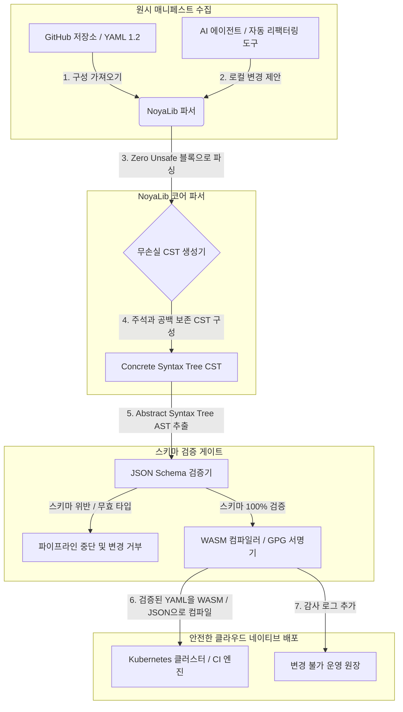

---

# Front Matter (YAML)

author: "contact@sebastienrousseau.com (Sebastien Rousseau)"
banner_alt: "극적인 조명 아래 펼쳐진 건축적 기하학 — CI, Kubernetes, MCP, 금융 서비스 구성 아래에 자리한 안전한 Rust YAML 파서로서 NoyaLib의 하중 지지 역할을 상징"
banner_height: "1597"
banner_width: "2584"
banner: "https://cloudcdn.pro/stocks/images/ken-cheung-KonWFWUaAuk.webp"
cdn: "https://cloudcdn.pro"
charset: "UTF-8"
cname: "sebastienrousseau.com"
copyright: "© Copyright 2025 - 2026 - Sebastien Rousseau. All rights reserved."
date: "June 18, 2026"
description: "NoyaLib는 zero-unsafe Rust YAML 1.2 파서로, 406/406 사양 준수, JSON Schema 검증, 무손실 CST, MCP/WASM 바인딩을 금융 인프라에 제공합니다."
format-detection: "telephone=no"
hreflang: "ko"
icon: "https://cloudcdn.pro/clients/sebastienrousseau/v1/logos/sebastienrousseau.svg"
id: "https://sebastienrousseau.com/2026-06-18-noyalib-safe-yaml-rust-ai-mcp-financial-infrastructure-2026"
image_alt: "Black and White Portrait of Sebastien Rousseau"
image_height: "162"
image_width: "162"
image: "https://cloudcdn.pro/stocks/images/sebastienrousseau.webp"
keywords: "더 안전한 Rust YAML 파서, NoyaLib, YAML 1.2 사양 준수, zero-unsafe Rust, JSON Schema 검증, 무손실 Concrete Syntax Tree, CST, MCP, Model Context Protocol, WebAssembly, Kubernetes 매니페스트, CI/CD 구성, DORA Article 5, BCBS 239, Basel III 운영 리스크, 금융 인프라, 구성 보안, 소프트웨어 공급망"
language: "ko-KR"
last_reviewed: "2026-06-18"
layout: "report"
locale: "ko_KR"
logo_alt: "Logo for Sebastien Rousseau"
logo_height: "44"
logo_width: "44"
logo: "https://cloudcdn.pro/clients/sebastienrousseau/v1/logos/sebastienrousseau.svg"
menu: ""
measurementID: "G-169G4ET5HQ"
name: "Sebastien Rousseau"
permalink: "https://sebastienrousseau.com/2026-06-18-noyalib-safe-yaml-rust-ai-mcp-financial-infrastructure-2026"
rating: "general"
referrer: "no-referrer"
robots: "index, follow"
schema: "FAQPage, Article"
seo_title: "AI, MCP, 금융용 더 안전한 Rust YAML 파서"
short_name: "sebastienrousseau"
subtitle: "더 안전한 Rust YAML 스택 NoyaLib는 YAML 1.2를 편의 마크업에서 암호학적으로 안전하고 사양에 준수하는 구성 제어 평면으로 바꿉니다. AI 에이전트, MCP, Kubernetes, 금융 서비스 인프라를 위한 토대입니다."
tags: "더 안전한 Rust YAML 파서, NoyaLib, YAML 1.2, zero-unsafe Rust, JSON Schema, MCP, WebAssembly, Kubernetes, DORA, BCBS 239, Basel III, 금융 인프라, 공급망 보안"
theme-color: "0, 83, 191"
title: "왜 2026년 AI, MCP, 금융 인프라에는 더 안전한 Rust YAML 스택이 필요한가"
url: "https://sebastienrousseau.com/2026-06-18-noyalib-safe-yaml-rust-ai-mcp-financial-infrastructure-2026"
viewport: "width=device-width, initial-scale=1, shrink-to-fit=no"

# RSS - The RSS feed front matter (YAML).
atom_link: "https://sebastienrousseau.com/2026-06-18-noyalib-safe-yaml-rust-ai-mcp-financial-infrastructure-2026/rss.xml"
category: "Technology"
docs: https://validator.w3.org/feed/docs/rss2.html
generator: "Static Site Generator (SSG) (version 0.0.26)"
item_description: "NoyaLib는 zero-unsafe Rust YAML 1.2 파서로, 406/406 사양 준수, JSON Schema 검증, 무손실 CST, MCP/WASM 바인딩을 금융 인프라에 제공합니다."
item_guid: "https://sebastienrousseau.com/2026-06-18-noyalib-safe-yaml-rust-ai-mcp-financial-infrastructure-2026/rss.xml"
item_link: "https://sebastienrousseau.com/2026-06-18-noyalib-safe-yaml-rust-ai-mcp-financial-infrastructure-2026/rss.xml"
item_pub_date: "Thu, 18 Jun 2026 06:06:06 +0000"
item_title: "왜 2026년 AI, MCP, 금융 인프라에는 더 안전한 Rust YAML 스택이 필요한가"
last_build_date: "Thu, 18 Jun 2026 06:06:06 +0000"
managing_editor: "contact@sebastienrousseau.com (Sebastien Rousseau)"
pub_date: "Thu, 18 Jun 2026 06:06:06 +0000"
ttl: "60"
type: "article"
webmaster: "contact@sebastienrousseau.com"

# Apple - The Apple front matter (YAML).
apple_mobile_web_app_orientations: "portrait"
apple_touch_icon_sizes: "192x192"
apple-mobile-web-app-capable: "yes"
apple-mobile-web-app-status-bar-inset: "black"
apple-mobile-web-app-status-bar-style: "black-translucent"
apple-mobile-web-app-title: "AI, MCP, 금융용 더 안전한 Rust YAML 파서"
apple-touch-fullscreen: "yes"

# MS Application - The MS Application front matter (YAML).

msapplication-navbutton-color: "0, 83, 191"

# Twitter Card - The Twitter Card front matter (YAML).

twitter_card: "summary_large_image"
twitter_creator: "@wwdseb"
twitter_description: "NoyaLib는 zero-unsafe Rust YAML 1.2 파서로, 406/406 사양 준수, JSON Schema 검증, 무손실 CST, MCP/WASM 바인딩을 금융 인프라에 제공합니다."
twitter_image: "https://cloudcdn.pro/clients/sebastienrousseau/v1/logos/sebastienrousseau.svg"
twitter_image_alt: "Logo of Sebastien Rousseau"
twitter_site: "@wwdseb"
twitter_title: "AI, MCP, 금융용 더 안전한 Rust YAML 파서"
twitter_url: "https://sebastienrousseau.com/2026-06-18-noyalib-safe-yaml-rust-ai-mcp-financial-infrastructure-2026"

excerpt: "NoyaLib는 더 안전한 Rust YAML 스택입니다. unsafe 블록이 없고, YAML 1.2 공식 테스트 406/406을 통과하며, 무손실 Concrete Syntax Tree, JSON Schema (Draft 2020-12) 검증, MCP/WASM 바인딩을 갖춰 AI 에이전트, Kubernetes, CI/CD, 그리고 금융 인프라 뒤의 구성 제어 평면을 위해 설계되었습니다."

# Humans.txt - The Humans.txt front matter (YAML).
author_website: "https://sebastienrousseau.com"
author_twitter: "@wwdseb"
author_location: "London, UK"
thanks: "읽어주셔서 감사합니다!"
site_last_updated: "2026-06-18"
site_standards: "HTML5, CSS3, RSS, Atom, JSON, XML, YAML, Markdown, TOML"
site_components: "Kaishi, Kaishi Builder, Kaishi CLI, Kaishi Templates, Kaishi Themes"
site_software: "Static Site Generator, Rust"

---

# 왜 2026년 AI, MCP, 금융 인프라에는 더 안전한 Rust YAML 스택이 필요한가

더 안전한 Rust YAML 스택이 중요한 이유는 명확합니다. YAML은 이제 CI/CD 파이프라인, Kubernetes 매니페스트, [Open Policy Agent](https://www.openpolicyagent.org/) 규칙, Model Context Protocol (MCP) 도구 레지스트리를 실어 나릅니다. 단 하나의 모호한 파싱이 청산 시스템을 중단시키고, 보안 그룹을 잘못 구성하며, 로컬 AI 에이전트에 잘못된 권한을 부여할 수 있습니다. [NoyaLib](https://github.com/sebastienrousseau/noyalib)는 순수 Rust로 작성된 zero-unsafe [YAML 1.2](https://yaml.org/spec/1.2.2/) 파싱 및 검증 생태계로, 그 인프라를 기본부터 안전하게 만들도록 설계되었습니다.

## 빠른 답변

**NoyaLib를 한 문장으로 설명하면 무엇입니까?** NoyaLib는 오픈소스 순수 Rust YAML 1.2 파서이자 검증 생태계로, `unsafe` 코드가 전혀 없고, 406개 공식 테스트 스위트를 100% 통과하며, 무손실 Concrete Syntax Tree와 실시간 [JSON Schema](https://json-schema.org/) 검증을 제공해 AI 에이전트, MCP, Kubernetes, 금융 인프라 구성을 기본부터 안전하게 만들도록 설계되었습니다.

## 임원 요약

YAML은 모호한 파싱이나 스키마 위반이 수십억 달러 규모의 운영 청산 시스템을 멈추기 전까지는 평범해 보입니다. 2026년 현재 YAML은 [CI/CD](https://docs.github.com/en/actions/learn-github-actions/workflow-syntax-for-github-actions) 파이프라인, [Kubernetes](https://kubernetes.io/docs/concepts/configuration/overview/) 매니페스트, [Open Policy Agent](https://www.openpolicyagent.org/) 규칙, Model Context Protocol (MCP) 도구 레지스트리의 사실상 표준입니다. 메모리 취약점과 파괴적 파싱을 동반한 불투명한 레거시 파서는 더 이상 용납할 수 없는 보안 리스크입니다. NoyaLib는 순수 Rust로 작성된 zero-unsafe YAML 1.2 생태계입니다. 406개 공식 스위트 테스트 모두를 100% 통과하고, 주석과 공백을 보존하는 무손실 Concrete Syntax Tree (CST)를 제공하며, JSON Schema 검증이 내장되어 있습니다. 그 결과 YAML은 감사 가능하고 안전하며 에이전트가 접근할 수 있는 구성 제어 평면으로 재정의됩니다.

## 핵심 시사점

- **구성은 운영 코드입니다.** 잘못 작성된 YAML 파일 하나가 클라우드 네이티브 보안 그룹이나 AI 에이전트 권한을 잘못 구성할 수 있습니다. NoyaLib는 YAML을 중요 인프라로 다룹니다.
- **Zero-unsafe 설계.** NoyaLib는 안전한 Rust로만 구축되었고 `unsafe` 블록이 전혀 없어, 핵심 파싱 계층에서 버퍼 오버플로와 원격 코드 실행 등 메모리 안전성 취약점을 제거합니다.
- **절대적 406/406 사양 준수.** 구성 구조를 수학적으로 검증해, 스테이징과 운영 환경 사이의 파싱 불일치와 구조적 표류를 제거합니다.
- **무손실 Concrete Syntax Tree.** 주석과 형식을 버리는 레거시 파서와 달리, NoyaLib는 공백과 주석을 보존하여 AI 에이전트의 안전한 왕복 자동 리팩터링을 가능하게 합니다.
- **이사회 차원의 수탁자 가치.** 구성 무결성을 [DORA Article 5](https://eur-lex.europa.eu/legal-content/EN/TXT/?uri=CELEX%3A32022R2554) 및 [Basel III](https://www.bis.org/bcbs/publ/d424.htm) 운영 리스크 자본 지표와 연결해, 고위 경영진을 개인적 책임으로부터 직접 보호합니다.

**관련 읽을거리:** [2026년 KyberLib과 양자내성 뱅킹 이전: 표준에서 코드까지](https://sebastienrousseau.com/2026-06-12-kyberlib-post-quantum-banking-migration-standards-code-2026/), [2026년 클라우드 네이티브 뱅킹 지수: DORA, 플랫폼 엔지니어링, 주권 클라우드, 운영 회복탄력성](https://sebastienrousseau.com/2026-06-05-cloud-native-banking-index-dora-resilience-platform-engineering-2026/), [2026년 AI 인식 dotfiles: MCP, SLSA, 멀티 셸 패리티를 위한 안전하고 재현 가능한 개발자 워크스테이션 구축](https://sebastienrousseau.com/2026-06-16-ai-aware-dotfiles-secure-reproducible-workstation-2026/).

## 01. 2026년 더 안전한 Rust YAML 스택이 중요한 이유

2026년 6월, 기업 IT 인프라는 고도로 분산되어 있으며 자동화의 정도도 갈수록 높아지고 있습니다.

YAML은 조용히 소프트웨어 엔지니어링 스택 전반의 하중 지지 구성 언어가 되었습니다. 운영 산출물을 컴파일하는 지속적 통합 (CI) 워크플로, 글로벌 클라우드 네이티브 클러스터를 오케스트레이션하는 [Kubernetes](https://kubernetes.io/docs/concepts/overview/) 매니페스트, 그리고 로컬 AI 에이전트에게 로컬 작업을 실행할 권한을 부여하는 [Model Context Protocol](https://modelcontextprotocol.io/) (MCP) 서버 스키마를 실어 나릅니다.

레거시 YAML 파서 — [PyYAML](https://pyyaml.org/), [yaml-cpp](https://github.com/jbeder/yaml-cpp), [libyaml](https://github.com/yaml/libyaml) — 는 두 가지 구조적 리스크를 안고 있습니다.

1. **타입 강제 변환 취약점 ("Norway problem").** 레거시 파서는 종종 따옴표 없는 문자열을 강제 변환합니다. 국가 코드 `NO`를 불리언 `false`로, `yes`/`no`도 같은 방식으로 처리합니다. [YAML 1.1 vs 1.2 boolean tag](https://yaml.org/type/bool.html)를 참고하십시오. 이 동작은 치명적 시스템 장애나 조용한 보안 오구성을 유발합니다.
2. **메모리 안전성 익스플로잇.** C/C++로 작성된 불투명한 파서는 메모리 누수와 버퍼 오버플로 익스플로잇에 노출되어 있으며, 이는 핵심 빌드 서버에서의 원격 코드 실행 (RCE)으로 이어질 수 있습니다.

[NoyaLib](https://github.com/sebastienrousseau/noyalib)는 이러한 과제를 해결합니다. 순수 Rust로 작성된 zero-unsafe YAML 1.2 파싱 및 검증 생태계입니다. 절대적 406/406 사양 준수를 달성하고 파싱 단계에서 직접 엄격한 JSON Schema 검증을 강제함으로써, NoyaLib는 높은 **Return on Resilience (RoR)** 를 제공합니다. 구성으로 인한 다운타임을 예방하고 금융 등급의 소프트웨어 공급망을 보호합니다.

## 02. NoyaLib 2026 아키텍처 렌즈

NoyaLib 생태계는 안전하고 무손실인 구성 파서로 동작합니다. 모든 로컬 및 클라우드 매니페스트는 가장 낮은 실행 계층에서 구조적으로 검증되고 보호됩니다.

### 표 1: NoyaLib 아키텍처 계층과 리스크 완화

| 계층 | 설계 결정 | 중요한 이유 | 잘못 다뤘을 때의 리스크 |
| ---- | ---- | ---- | ---- |
| **파서 계층** | YAML 1.2 준수, `unsafe` 블록이 전혀 없는 순수 Rust 파서 | 가장 낮은 실행 계층에서 메모리 안전성 취약점과 버퍼 오버플로를 제거합니다. | 핵심 빌드 서버에서의 원격 코드 실행 (RCE). |
| **적합성 계층** | 406/406 공식 YAML 1.2 스위트 테스트 100% 준수 | 스테이징과 운영 환경 사이의 파싱 불일치와 타입 강제 변환 표류를 제거합니다. | 보안 그룹을 무력화하는 "Norway problem" 타입 강제 변환 오류. |
| **구문 트리 계층** | 무손실 Concrete Syntax Tree (CST) | 왕복 파싱과 프로그램 기반 리팩터링 과정에서 주석, 공백, 순서를 보존합니다. | 자동화된 AI 리팩터링이 개발자 주석을 파괴. |
| **검증 계층** | 파싱 중 [JSON Schema (Draft 2020-12)](https://json-schema.org/draft/2020-12/release-notes) 검증 | 구성 파일이 운영 클러스터에 도달하기 전에 엄격한 데이터 모델을 강제합니다. | 잘못된 구성 파일이 클라우드 네이티브 클러스터 충돌을 유발. |
| **인터페이스 계층** | WebAssembly (WASM) 및 MCP 바인딩 | 브라우저, 엣지 노드, 로컬 에이전트 툴킷 내부에서 직접 구성 검증을 실행할 수 있습니다. | 검증이 엣지 디바이스에서 실행될 수 없는 도구 사일로. |

## 03. 핵심 워크스테이션 및 구성 보안 신호

개발과 운영 전반의 절대적 보안을 유지하려면, Chief Information Security Officer (CISO)는 정량화 가능한 특정 지표를 모니터링해야 합니다.

### 표 2: 워크스테이션 및 구성 보안 신호

| 신호 | 지표 / 운영 기준 | NIST CSF / DORA 참조 | 기술 플랫폼 구현 |
| ---- | ---- | ---- | ---- |
| **파서 적합성** | 공식 YAML 1.2 테스트 스위트 100% 통과율 (406/406 테스트). | [DORA Article 6](https://eur-lex.europa.eu/legal-content/EN/TXT/?uri=CELEX%3A32022R2554) (ICT 보안) | NoyaLib 파서 코어가 CI 실행 전 모든 매니페스트를 검증. |
| **메모리 안전성 프로필** | 파서 및 직렬화 종속성 내부에 `unsafe` Rust 블록 0개. | DORA Article 30 (공급망) | cargo 빌드의 자동 컴파일러 검사 ([`forbid(unsafe_code)`](https://doc.rust-lang.org/reference/attributes/diagnostics.html#the-forbid-attribute)). |
| **스키마 검증** | 파싱된 구성 파일의 100%가 유효한 [JSON Schema](https://json-schema.org/) 모델 대비 검증. | [NIST CSF 2.0](https://www.nist.gov/cyberframework) (PR.DS-01) | 스키마 위반 시 빌드 파이프라인을 중단시키는 실시간 검증 게이트. |
| **구성 표류** | 로컬 구성 파일의 git 버전 관리 상태로의 실시간 감지 및 복구. | Return on Resilience (RoR) | 모든 로컬 파일 수정을 기록하는 지속적 텔레메트리. |
| **에이전트 접근 제어** | MCP 구성을 통해 동작하는 로컬 AI 도구를 위한 경계가 명확한 읽기 전용 권한. | 모델 리스크 관리 ([SR 11-7](https://web.archive.org/web/20260414150921/https://www.federalreserve.gov/supervisionreg/srletters/sr1107.htm)) | 에이전트 작업을 승인된 디렉터리로 제한하는 MCP 서버 경계. |

## 04. 불투명한 구성 파싱의 오류

클라우드 네이티브 운영의 주요 취약점은 *불투명한 파싱*입니다. 구조 메타데이터(주석, 공백, 문서 순서)를 버리거나 컴파일 도중 조용히 타입을 강제 변환하는 파서의 사용을 가리킵니다. 이 동작은 두 가지 심각한 보안 리스크를 도입합니다.

1. **파괴적 리팩터링.** AI 코딩 어시스턴트나 자동 리팩터링 도구가 배포 매니페스트를 업데이트할 때, 전통적인 파서는 개발자 주석과 형식을 버립니다. 그 결과 사람의 리뷰와 사고 후 포렌식에 필요한 맥락이 파괴됩니다.
2. **파싱 불일치.** 스테이징 환경이 Python 기반 파서를 사용하고 운영 환경이 C 기반 파서를 실행한다면, YAML 1.2 사양 준수의 사소한 차이가 유효한 스테이징 매니페스트를 운영에서 실패시키거나 다르게 동작하게 만들어, 숨겨진 보안 취약점을 만들어냅니다.

NoyaLib의 **무손실 Concrete Syntax Tree (CST)** 가 이를 해결합니다. 파싱과 직렬화 루프 동안 모든 공백, 주석, 문서 행을 보존합니다. 자동화된 AI 어시스턴트는 인간이 작성한 모든 주석을 100% 유지한 채 구성 파일을 편집, 리팩터링, 커밋할 수 있습니다. 절대적인 감사 추적입니다.

## 05. 경계가 명확한 AI 구성 파이프라인 설계

악의적인 구성 변경이 운영 환경에 도달하지 못하도록, 조직은 엄격하게 경계가 정해지고 스키마로 검증되는 구성 파이프라인을 구현해야 합니다.

아래 운영 흐름은 NoyaLib가 원시 YAML을 파싱하고, 무손실 CST를 구성하며, AST를 JSON Schema 모델 대비 검증하고, 브라우저 또는 엣지 환경용 WebAssembly 바인딩을 컴파일하는 방식을 보여줍니다.

## 06. 이사회 플레이북과 수탁자 책임

구성 보안과 소프트웨어 공급망 무결성은 이사회의 핵심 우선순위입니다. 고위 경영진은 수탁자 의무와 운영 회복탄력성의 렌즈로 구성 관리에 접근해야 합니다.

- **DORA Article 5 (이사회 책임).** 기관의 ICT 리스크 관리에 대한 궁극적이고 위임할 수 없는 책임이 이사회에 있다고 규정합니다. 구성 파일이 중요한 클라우드 네이티브 보안 그룹과 결제 경로를 통제하기 때문에, 이사회는 이러한 매니페스트를 파싱하는 시스템이 메모리 안전하며 사양에 완전히 준수한다는 점을 검증해 규제 감사를 충족해야 합니다. ([Regulation (EU) 2022/2554](https://eur-lex.europa.eu/legal-content/EN/TXT/?uri=CELEX%3A32022R2554))
- **BCBS 239 (리스크 데이터 집계 및 보고).** 리스크 보고와 인프라 지표가 정확하고 완전하며 엄격한 데이터 품질 통제 아래 생성되어야 한다고 요구합니다. NoyaLib는 구성 파일을 발생 지점에서 엄격한 스키마 대비 파싱·검증해 BCBS 239를 지원하고, 조용한 데이터 누출이나 오구성으로 인한 장애를 예방합니다. ([BCBS 239 standard](https://www.bis.org/publ/bcbs239.htm))
- **운영 리스크 자본 부담 완화 (Basel III).** 구성으로 인한 장애는 Basel III 아래 운영 리스크 자본 부담을 직접 증가시키며, 재무상태표의 자본을 묶어둡니다. 기업 구성 스택을 NoyaLib 같은 안전한 순수 Rust 파서 위로 표준화하면 이 리스크가 최소화되고, 자본을 보존하며, 고객 신뢰를 지킬 수 있습니다. ([Basel III standards](https://www.bis.org/bcbs/publ/d424.htm))

## 07. 은행 유형별 시사점

### 글로벌 시스템적 중요 은행 (G-SIBs)

G-SIBs는 여러 관할권에 걸쳐 수천 개의 마이크로서비스와 배포 파이프라인을 운용합니다. 이들의 주된 과제는 거대한 클라우드 네이티브 자산 전반에서 구성 일관성을 유지하고 보안 표류를 방지하는 일입니다. NoyaLib 같은 더 안전한 Rust YAML 스택으로 표준화하면 모든 Kubernetes 매니페스트, CI/CD 파이프라인, 보안 정책이 균일하고 메모리 안전한 프레임워크 아래 파싱·검증되며, 감사되지 않은 "스노우플레이크" 구성의 리스크가 제거됩니다.

### 거래 및 코퍼레이트 은행

거래 은행은 민감한 결제 게이트웨이와 도매 청산 인프라를 운영합니다. 운영 환경에 배포되는 코드와 구성의 절대적 보안을 입증하는 일은 협상 불가능한 규제 요구 사항입니다. NoyaLib를 통합하면 소프트웨어 공급망이 완전히 감사되고 무손실이며 파싱 취약점으로부터 보호된다는 점이 보장됩니다. 이는 DORA Article 6 및 [PCI DSS v4.0](https://www.pcisecuritystandards.org/document_library/) 6항에 깔끔하게 매핑되는 통제입니다.

### 지역 및 중소 은행

지역 은행은 G-SIB급 기술 예산 없이도 높은 사이버 보안 기준을 유지해야 합니다. 오픈소스 NoyaLib 프레임워크는 경량이며 비용 효율적이고 매우 안전한 Rust 친화 솔루션을 제공합니다. 중소 기관은 독점 라이선스 비용 없이 기업 등급의 구성 보안과 공급망 보호를 구현할 수 있습니다.

## 08. 결론: 구성 보안 로드맵

개발자 워크스테이션과 클라우드 네이티브 인프라 구성은 소프트웨어 공급망의 핵심 제어 평면입니다. 감사되지 않거나 모호하거나 안전하지 않은 구성 파일이 기업 자산에 도달하도록 허용하는 일은 용납할 수 없는 운영 및 규제 리스크입니다.

소프트웨어 공급망을 보호하고 엔드포인트를 구성 취약점으로부터 지키려면, 고위 기술 및 보안 경영진은 오늘 명확한 개발 로드맵을 실행해야 합니다.

1. **선언적 구성을 의무화하십시오.** 수동의 감사되지 않은 구성 조정을 단계적으로 폐지하고, 모든 매니페스트를 버전 관리되는 선언적 기록 시스템으로 관리하도록 명시하십시오.
2. **스키마 검증을 강제하십시오.** 모든 구성 파일이 배포 전 유효한 JSON Schema 모델 대비 검증되도록 엄격한 사전 커밋 훅과 스캐닝 유틸리티를 강제하십시오.
3. **무손실 왕복을 구현하십시오.** 모든 자동화된 AI 코딩 어시스턴트와 리팩터링 도구가 무손실 파싱을 사용해 주석, 공백, 개발자 맥락을 보존하도록 보장하십시오.
4. **공급망을 보호하십시오.** 모든 구성 설정과 파싱 유틸리티가 실행 전에 NoyaLib 같은 순수 Rust zero-unsafe 라이브러리를 통해 암호학적으로 검증되도록 보장하십시오. ([SLSA framework](https://slsa.dev/))

## 09. 자주 묻는 질문

**NoyaLib는 무엇이며 왜 YAML 파싱에 사용됩니까?**
NoyaLib는 오픈소스 순수 Rust zero-unsafe YAML 1.2 파서입니다. 406개 공식 테스트 스위트를 100% 통과하고, 파싱 중 엄격한 [JSON Schema](https://json-schema.org/) 검증을 강제하며, WASM과 [MCP](https://modelcontextprotocol.io/) 바인딩을 노출합니다. AI 에이전트, Kubernetes, 금융 인프라를 위한 더 안전한 Rust YAML 스택입니다.

**구성 파싱에서 zero-unsafe 설계가 왜 중요합니까?**
C/C++로 작성된 레거시 파서 내부의 메모리 안전성 취약점 — 버퍼 오버플로, use-after-free — 은 핵심 빌드 서버에서의 원격 코드 실행으로 이어질 수 있습니다. NoyaLib의 순수 Rust 설계와 [`#![forbid(unsafe_code)]`](https://doc.rust-lang.org/reference/attributes/diagnostics.html#the-forbid-attribute)는 컴파일 시점에 이러한 취약점을 수학적으로 제거합니다.

**무손실 Concrete Syntax Tree (CST)란 무엇이며 왜 중요합니까?**
전통적인 파서는 주석과 형식을 버리기 때문에 AI 에이전트의 자동 편집이 파괴적으로 작용합니다. NoyaLib의 무손실 Concrete Syntax Tree는 모든 주석, 공백, 문서 행을 보존합니다. AI 어시스턴트는 개발자 맥락, 사고 후 포렌식, 감사 추적을 그대로 유지하면서 안전하게 구성 파일을 편집하고 리팩터링할 수 있습니다.

**NoyaLib는 DORA, BCBS 239, Basel III에 어떻게 매핑됩니까?**
DORA Article 5는 ICT 리스크 책임을 이사회에 부과합니다. BCBS 239는 리스크 보고에 데이터 품질 통제를 요구합니다. Basel III는 운영 리스크 자본에 세금을 부과합니다. NoyaLib는 그 규제들이 코드형 구성에 요구하는 스키마 검증된, 메모리 안전한 파싱 계층을 제공합니다. 규제 매핑이 단순해지고 운영 리스크 자본 부담이 줄어듭니다.

## 10. 참고문헌

- **YAML, (2026).** *YAML 1.2 specification*. 출처: [YAML 1.2 spec](https://yaml.org/spec/1.2.2/).
- **JSON Schema, (2026).** *JSON Schema Draft 2020-12 release notes*. 출처: [JSON Schema Draft 2020-12](https://json-schema.org/draft/2020-12/release-notes).
- **European Parliament and Council of the European Union, (2022).** *Regulation (EU) 2022/2554 on digital operational resilience for the financial sector (DORA)*. Brussels: Official Journal of the European Union. 출처: [DORA regulation](https://eur-lex.europa.eu/legal-content/EN/TXT/?uri=CELEX%3A32022R2554).
- **Basel Committee on Banking Supervision, (2013).** *Principles for effective risk data aggregation and risk reporting (BCBS 239)*. Basel: Bank for International Settlements. 출처: [BCBS 239 standard](https://www.bis.org/publ/bcbs239.htm).
- **Basel Committee on Banking Supervision, (2017).** *Basel III: finalising post-crisis reforms*. Basel: Bank for International Settlements. 출처: [Basel III standards](https://www.bis.org/bcbs/publ/d424.htm).
- **Anthropic, (2025).** *Model Context Protocol (MCP) specification*. 출처: [Model Context Protocol](https://modelcontextprotocol.io/).
- **GitHub, (2026).** *noyalib open-source repository*. 출처: [NoyaLib repository](https://github.com/sebastienrousseau/noyalib).
