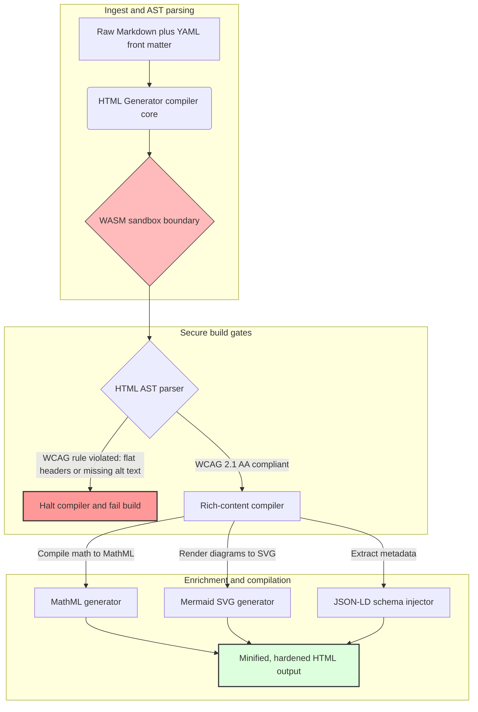

---

# Front Matter (YAML)

author: "contact@sebastienrousseau.com (Sebastien Rousseau)"
banner_alt: "구조화된 빛 아래의 건축적 기하학 — 접근 가능하고 SEO 최적화된 샌드박스 퍼블리싱 인프라를 위한 컴파일 게이트 방식의 Markdown-to-HTML 파이프라인으로서 HTML Generator의 역할을 상징"
banner_height: "1597"
banner_width: "2584"
banner: "https://cloudcdn.pro/api/transform?url=/stocks/images/markus-winkler-IrRbSND5EUc-unsplash.webp&w=1200&format=webp&q=80"
cdn: "https://cloudcdn.pro"
charset: "UTF-8"
cname: "sebastienrousseau.com"
copyright: "© Copyright 2025 - 2026 - Sebastien Rousseau. All rights reserved."
date: "June 20, 2026"
description: "HTML Generator는 Markdown을 WCAG 준수, SEO 최적화, JSON-LD 강화 HTML로 변환하는 순수 Rust 라이브러리입니다 — 코드로서의 접근성, MathML 및 Mermaid 지원, 안전한 기업 퍼블리싱을 위한 WebAssembly 샌드박스 실행을 제공합니다."
format-detection: "telephone=no"
hreflang: "ko"
icon: "https://cloudcdn.pro/clients/sebastienrousseau/v1/logos/sebastienrousseau.svg"
id: "https://sebastienrousseau.com/2026-06-20-html-generator-accessible-seo-structured-markdown-rust-2026"
image_alt: "Sebastien Rousseau의 흑백 초상 사진"
image_height: "162"
image_width: "162"
image: "https://cloudcdn.pro/stocks/images/sebastien-rousseau.png"
keywords: "html-generator, Rust Markdown to HTML, 코드로서의 접근성, WCAG 2.1 AA, SEO 최적화 HTML, JSON-LD, MathML, Mermaid, WebAssembly, EAA, DORA, ADA Title III, 접근 가능한 퍼블리싱, 샌드박스 파싱, 오픈 소스"
language: "ko-KR"
last_reviewed: "2026-06-20"
layout: "report"
locale: "ko_KR"
logo_alt: "Sebastien Rousseau 로고"
logo_height: "44"
logo_width: "44"
logo: "https://cloudcdn.pro/clients/sebastienrousseau/v1/logos/sebastienrousseau.svg"
menu: ""
measurementID: "G-169G4ET5HQ"
name: "Sebastien Rousseau"
permalink: "https://sebastienrousseau.com/2026-06-20-html-generator-accessible-seo-structured-markdown-rust-2026"
rating: "general"
referrer: "no-referrer"
robots: "index, follow"
schema: "FAQPage, Article"
seo_title: "코드로서의 접근성: Rust로 Markdown을 AAA HTML로 변환 (2026)"
short_name: "sebastienrousseau"
subtitle: "기업 웹 퍼블리싱, 제품 문서화, 고객 포털을 접근 불가능한 텍스트 파일에서 고도로 구조화된 규정 준수 및 샌드박스화된 디지털 자산으로 전환합니다."
tags: "html-generator, Rust, Markdown, 접근성, WCAG, SEO, JSON-LD, MathML, Mermaid, WebAssembly, EAA, DORA, ADA, AI 탐색, RAG, 오픈 소스, 뱅킹 인프라"
theme-color: "0, 83, 191"
title: "2026년 Rust로 Markdown을 접근 가능하고 SEO 최적화된 구조적 HTML로 변환하기"
url: "https://sebastienrousseau.com/2026-06-20-html-generator-accessible-seo-structured-markdown-rust-2026"
viewport: "width=device-width, initial-scale=1, shrink-to-fit=no"

# RSS - The RSS feed front matter (YAML).
atom_link: "https://sebastienrousseau.com/2026-06-20-html-generator-accessible-seo-structured-markdown-rust-2026/rss.xml"
category: "Technology"
docs: https://validator.w3.org/feed/docs/rss2.html
generator: "Static Site Generator (SSG) (version 0.0.40)"
item_description: "HTML Generator는 Markdown을 WCAG 준수, SEO 최적화, JSON-LD 강화 HTML로 변환하는 순수 Rust 라이브러리입니다 — 코드로서의 접근성, MathML 및 Mermaid 지원, 안전한 기업 퍼블리싱을 위한 WebAssembly 샌드박스 실행을 제공합니다."
item_guid: "https://sebastienrousseau.com/2026-06-20-html-generator-accessible-seo-structured-markdown-rust-2026/rss.xml"
item_link: "https://sebastienrousseau.com/2026-06-20-html-generator-accessible-seo-structured-markdown-rust-2026/rss.xml"
item_pub_date: "Sat, 20 Jun 2026 06:06:06 +0000"
item_title: "2026년 Rust로 Markdown을 접근 가능하고 SEO 최적화된 구조적 HTML로 변환하기"
last_build_date: "Sat, 20 Jun 2026 06:06:06 +0000"
managing_editor: "contact@sebastienrousseau.com (Sebastien Rousseau)"
pub_date: "Sat, 20 Jun 2026 06:06:06 +0000"
ttl: "60"
type: "article"
webmaster: "contact@sebastienrousseau.com"

# Apple - The Apple front matter (YAML).
apple_mobile_web_app_orientations: "portrait"
apple_touch_icon_sizes: "192x192"
apple-mobile-web-app-capable: "yes"
apple-mobile-web-app-status-bar-inset: "black"
apple-mobile-web-app-status-bar-style: "black-translucent"
apple-mobile-web-app-title: "Rust로 Markdown을 AAA HTML로 변환"
apple-touch-fullscreen: "yes"

# MS Application - The MS Application front matter (YAML).

msapplication-navbutton-color: "0, 83, 191"

# Twitter Card - The Twitter Card front matter (YAML).

twitter_card: "summary_large_image"
twitter_creator: "@wwdseb"
twitter_description: "HTML Generator는 Markdown을 WCAG 준수, SEO 최적화, JSON-LD 강화 HTML로 변환하는 순수 Rust 라이브러리입니다 — 코드로서의 접근성, MathML 및 Mermaid 지원, 안전한 기업 퍼블리싱을 위한 WebAssembly 샌드박스 실행을 제공합니다."
twitter_image: "https://cloudcdn.pro/clients/sebastienrousseau/v1/logos/sebastienrousseau.svg"
twitter_image_alt: "Sebastien Rousseau 로고"
twitter_site: "@wwdseb"
twitter_title: "코드로서의 접근성: Rust로 Markdown을 AAA HTML로 변환"
twitter_url: "https://sebastienrousseau.com/2026-06-20-html-generator-accessible-seo-structured-markdown-rust-2026"

# Humans.txt - The Humans.txt front matter (YAML).
author_website: "https://sebastienrousseau.com"
author_twitter: "@wwdseb"
author_location: "London, UK"
thanks: "읽어주셔서 감사합니다!"
site_last_updated: "2026-06-20"
site_standards: "HTML5, CSS3, RSS, Atom, JSON, XML, YAML, Markdown, TOML"
site_components: "Kaishi, Kaishi Builder, Kaishi CLI, Kaishi Templates, Kaishi Themes"
site_software: "Static Site Generator, Rust"

---

# 2026년 Rust로 Markdown을 접근 가능하고 SEO 최적화된 구조적 HTML로 변환하기

<!-- lead-start -->
<aside class="post-lead" aria-label="아티클 요약">

<strong>TL;DR.</strong> HTML Generator는 빌드 시점에 WCAG 2.1 AA를 강제 적용하고, 스키마 준수 JSON-LD를 주입하며, MathML과 Mermaid SVG를 네이티브로 렌더링하고, 파싱을 WebAssembly 샌드박스 내에서 격리 실행하는 순수 Rust 기반 Markdown-to-HTML 컴파일러입니다 — 접근성, SEO, ICT 보안을 위한 컴파일 게이트 방식의 제어 평면으로 퍼블리싱을 전환합니다.

<strong>핵심 요점</strong>

<ul class="post-lead-takeaways">
  <li><strong>빠른 답변.</strong> HTML Generator를 한 문장으로 설명하면?</li>
  <li><strong>경영진 요약.</strong> Markdown 렌더링은 단순해 보이지만, 퍼블리싱 수준의 HTML을 올바르게 구현하는 것은 규정 준수 문제입니다.</li>
  <li><strong>01. 2026년에 접근성 우선 HTML 컴파일러가 중요한 이유.</strong> EAA(유럽 접근성 법)와 ADA Title III는 접근성을 엔지니어링 위생 관리에서 수탁자 책임으로 격상시켰습니다.</li>
  <li><strong>02. HTML Generator 2026 아키텍처 분석.</strong> 원시 Markdown에서 강화된 HTML 출력까지 이어지는 다단계 컴파일러 게이트 파이프라인.</li>
</ul>

<strong>관련 자료:</strong> <a href="https://sebastienrousseau.com/2026-06-18-noyalib-safe-yaml-rust-ai-mcp-financial-infrastructure-2026">2026년 AI, MCP, 금융 인프라를 위해 YAML에 더 안전한 Rust 스택이 필요한 이유</a>, <a href="https://sebastienrousseau.com/2026-06-17-static-site-generator-secure-default-ai-era-publishing-2026">2026년 AI 시대 퍼블리싱을 위한 기본 보안 정적 사이트 생성기</a>, <a href="https://sebastienrousseau.com/2026-06-11-cloudcdn-open-source-blueprint-ai-native-edge-2026">CloudCDN: 2026년 AI 네이티브 엣지를 위한 오픈소스 청사진</a>.

</aside>
<!-- lead-end -->

2026년, 웹 콘텐츠는 인간 독자만큼이나 AI 검색 크롤러, LLM 기반 검색 엔진, 검색 증강 생성(RAG) 파이프라인에 의해 소비됩니다. 평탄하거나 형식이 잘못된 HTML은 기계의 탐색 가능성을 저해하고, [유럽 접근성 법(EAA)](https://www.accessibility-act.eu/) 및 [미국 ADA Title III](https://www.ada.gov/topics/title-iii/)와 같은 엄격한 글로벌 규정 준수 실패는 이제 명백한 민사 책임입니다. [HTML Generator](https://github.com/sebastienrousseau/html-generator)는 이러한 격차를 해소하기 위해 설계된 고성능 Rust 라이브러리로, 배포 후 패치가 아닌 컴파일러 단계에서 문제를 처리합니다.

## 빠른 답변

**HTML Generator를 한 문장으로 설명하면?** HTML Generator는 빌드 시점에 [WCAG 2.1 AA](https://www.w3.org/TR/WCAG21/)를 강제 적용하고, 시맨틱 랜드마크와 ARIA 속성을 자동 생성하며, YAML 프론트 매터로부터 스키마 준수 [JSON-LD](https://json-ld.org/) 메타데이터를 주입하고, Mermaid 다이어그램과 수식을 접근 가능한 SVG 및 MathML로 렌더링하며, [WebAssembly](https://webassembly.org/) 샌드박스 내에서 실행되는 오픈소스 순수 Rust Markdown-to-HTML 컴파일러입니다 — 기업 퍼블리싱을 컴파일 게이트 방식의 수탁자급 제어 평면으로 전환합니다.

## 경영진 요약

Markdown 렌더링은 단순해 보입니다. 그러나 퍼블리싱 수준의 HTML은 규정 준수 문제입니다. 2026년 6월 현재, 모든 기업 접점 — 투자자 관계 포털, 규제 문서, 고객 문서, API 레퍼런스, 마케팅 자산 — 은 인간과 기계 모두에 의해 파싱됩니다. 모든 페이지에서 두 가지 압력이 충돌합니다: [EAA](https://www.accessibility-act.eu/)와 [ADA Title III](https://www.ada.gov/topics/title-iii/)는 접근성을 이사회 수준의 법적 노출 위험으로 만들고, AI 수집과 RAG 파이프라인은 구조화된 기계 가독성 출력에 대한 보상을 제공합니다. 표준 Markdown 라이브러리는 두 가지 요건을 모두 충족하지 못하는 평탄한 HTML을 생성합니다. HTML Generator는 문서 생성을 컴파일 게이트 파이프라인으로 처리합니다: WCAG 유효성 검사는 빌드 오류이고, JSON-LD는 수동 스탬핑 없이 YAML 프론트 매터에서 생성되며, MathML과 Mermaid는 접근 가능하게 렌더링되고, 전체 엔진은 WebAssembly 대상으로 제공되어 신뢰할 수 없는 문서 파싱이 호스트와 격리된 샌드박스 내에서 유지됩니다.

## 핵심 요점

- **코드로서의 접근성은 새로운 기준선입니다.** EAA는 소비자 디지털 서비스의 접근성을 의무화합니다. HTML Generator는 컴파일 시점에 문서 트리를 평가하여 시맨틱 랜드마크와 ARIA 속성을 자동으로 생성합니다 — 배포 후 수정이 줄어들고, 재작업 예산이 감소하며, 누락된 alt 텍스트가 프로덕션에 배포되지 않습니다.
- **AI 탐색을 위한 구조화 데이터.** 현대 검색과 RAG는 기계 가독성 메타데이터에 의존합니다. 컴파일러는 YAML 프론트 매터를 파싱하고 [Schema.org 준수 JSON-LD](https://schema.org/)를 문서 헤드에 직접 주입하여, 콘텐츠를 [Google Rich Results](https://developers.google.com/search/docs/appearance/structured-data/intro-structured-data), [Bing Webmaster](https://www.bing.com/webmasters), LLM 기반 크롤러가 완전히 해석할 수 있게 만듭니다.
- **기술 콘텐츠의 탁월함.** 기술 퍼블리싱은 단순한 텍스트가 아닙니다. HTML Generator는 원시 Markdown 수식 확장을 접근 가능한 [MathML](https://www.w3.org/Math/)로 컴파일하고, [Mermaid.js](https://mermaid.js.org/) 다이어그램을 반응형 SVG로 렌더링합니다 — 불투명한 이미지로 대체하지 않고 WCAG 준수 구조를 유지합니다.
- **WebAssembly 샌드박싱.** 신뢰할 수 없는 Markdown 파싱은 보안 위험입니다. [WASM](https://webassembly.org/)을 대상으로 함으로써, HTML Generator는 임의 코드 실행을 방지하고 호스트 시스템을 보호하는 격리된 샌드박스 내에서 실행됩니다 — [DORA Article 6](https://eur-lex.europa.eu/legal-content/EN/TXT/?uri=CELEX%3A32022R2554) ICT 보안 의무를 직접 충족합니다.
- **이사회를 위한 수탁자 보호.** 기술적 규정 위반은 이사회 안건으로 부상했습니다. 컴파일러 게이트 HTML 엔진을 표준화함으로써 이사와 고위 경영진은 DORA, EAA, ADA Title III 하에서의 개인 민사 및 규제 노출로부터 보호받습니다.

**관련 자료:** [2026년 AI, MCP, 금융 인프라를 위해 YAML에 더 안전한 Rust 스택이 필요한 이유](https://sebastienrousseau.com/2026-06-18-noyalib-safe-yaml-rust-ai-mcp-financial-infrastructure-2026/), [2026년 AI 시대 퍼블리싱을 위한 기본 보안 정적 사이트 생성기](https://sebastienrousseau.com/2026-06-17-static-site-generator-secure-default-ai-era-publishing-2026/), [CloudCDN: 2026년 AI 네이티브 엣지를 위한 오픈소스 청사진](https://sebastienrousseau.com/2026-06-11-cloudcdn-open-source-blueprint-ai-native-edge-2026/).

## 01. 2026년에 접근성 우선 HTML 컴파일러가 중요한 이유

기업 웹 자산, 문서 라이브러리, 제품 도움말 센터는 중요한 디지털 접점입니다. 이제 두 가지 강력하고 교차하는 압력을 받고 있습니다.

첫 번째는 **AI 수집 및 탐색 가능성**입니다. 콘텐츠는 점점 더 대규모 언어 모델과 검색 증강 생성(RAG) 파이프라인에 의해 처리되고 있습니다. 평탄하거나 형식이 잘못된 HTML은 크롤러 파싱을 혼란스럽게 하여 기업 리서치 및 문서가 현대 검색 패러다임 — [Google Search Generative Experience](https://blog.google/products/search/generative-ai-search/), [ChatGPT](https://chat.openai.com/) 브라우징, 엔터프라이즈 RAG 에이전트를 포함한 — 에서 보이지 않게 만듭니다.

두 번째는 **엄격한 글로벌 접근성 법률**입니다. [유럽 접근성 법(EAA)](https://www.accessibility-act.eu/) (2025년 6월부터 완전 적용)과 [미국 ADA Title III](https://www.ada.gov/topics/title-iii/) 하에서, 기업 퍼블리싱 플랫폼은 완전한 디지털 접근성을 보장해야 합니다. [WCAG 2.1 AA](https://www.w3.org/TR/WCAG21/) 미충족은 더 이상 엔지니어링 관리 소홀이 아닙니다; 수백만 달러의 합의금을 초래한 민사 및 규제 책임입니다.

[HTML Generator](https://github.com/sebastienrousseau/html-generator)는 두 가지 압력을 직접 해결합니다. Markdown을 접근 가능하고 SEO 최적화된 구조적 HTML로 변환하도록 설계된 스레드 안전 Rust 라이브러리입니다. 문서 생성을 컴파일러 게이트 파이프라인으로 처리함으로써, 엔진은 높은 **회복탄력성 수익률(RoR)** 을 제공합니다 — 접근성 소송으로부터 재무제표를 보호하면서 AI 탐색을 위한 기계 가독성을 극대화합니다.

## 02. HTML Generator 2026 아키텍처 분석

프레임워크는 원시 Markdown 텍스트를 암호학적으로 검증된 고접근성 정적 자산으로 변환하는 보안 다단계 컴파일 파이프라인으로 설계되었습니다.

### 표 1: HTML Generator 아키텍처 레이어와 위험 완화

| 레이어 | 설계 결정 | 중요한 이유 | 잘못 처리할 경우의 위험 |
| ---- | ---- | ---- | ---- |
| **입력 레이어** | Markdown 및 YAML 프론트 매터 파서 | 작성자가 익숙한 방식으로 작업하면서 산문과 구조적 메타데이터를 분리합니다. | 일관성 없는 메타데이터, 깨진 사이트맵, 색인 누락. |
| **구조 레이어** | ARIA 태그가 있는 자동화된 목차 및 시맨틱 랜드마크 | 구성 단계에서 탐색 가능하고 접근 가능한 문서 트리를 생성합니다. | 스크린 리더를 깨고 WCAG를 위반하는 평탄한 HTML. |
| **리치 콘텐츠 레이어** | 네이티브 MathML 및 Mermaid.js SVG 렌더링 | 수식과 다이어그램을 접근 가능한 SVG 및 MathML로 컴파일합니다. | 클라이언트 측 JS 렌더링 지연 및 보조 기술 출력 오류. |
| **SEO 및 데이터 레이어** | 통합 JSON-LD 및 구조화 메타데이터 생성 | [Schema.org](https://schema.org/) 준수 JSON-LD를 헤드에 직접 주입합니다. | 검색 엔진과 AI 크롤러가 저자, 컨텍스트, 라이선스를 잘못 읽음. |
| **런타임 레이어** | WebAssembly 대상이 있는 네이티브 Rust 컴파일러 | 서버, 엣지 노드, 브라우저에서 안전하고 샌드박스화된 실행을 가능하게 합니다. | 신뢰할 수 없는 Markdown 파싱 중 임의 코드 실행. |

## 03. 주요 웹 보안 및 접근성 신호

공개 퍼블리싱 자산이 현대 규제 및 보안 감사를 충족하는지 검증하기 위해, 고위 기술 임원은 특정하고 정량화 가능한 지표를 모니터링해야 합니다.

### 표 2: 웹 보안 및 접근성 신호

| 신호 | 지표 / 운영 벤치마크 | EAA / DORA / W3C 참조 | 기술 구현 |
| ---- | ---- | ---- | ---- |
| **접근성 준수** | 컴파일된 페이지의 100%가 WCAG 2.1 AA 규칙에 대해 유효성 검사됨. | [EAA](https://www.accessibility-act.eu/) 및 [ADA Title III](https://www.ada.gov/topics/title-iii/) | 이미지 alt 태그 및 시맨틱 랜드마크를 평가하는 빌드 시점 HTML 파서. |
| **WASM 실행 샌드박스** | 신뢰할 수 없는 Markdown 입력의 100%가 격리된 WebAssembly 런타임에서 컴파일됨. | [DORA Article 6](https://eur-lex.europa.eu/legal-content/EN/TXT/?uri=CELEX%3A32022R2554) (ICT 보안) | 호스트 서버로부터 파싱 환경 격리. |
| **구조화 메타데이터 적용 범위** | 게시된 아티클의 100%에 유효한 스키마 준수 JSON-LD 헤더가 주입됨. | [Schema.org](https://schema.org/) 사양 | 자동 프론트 매터 파싱 및 JSON-LD 객체 변환. |
| **컴파일 처리량** | 일반 하드웨어에서 초당 10,000 페이지 이상의 목표. | 회복탄력성 수익률(RoR) | 고도로 병렬화된 Rust AST 컴파일러. |
| **리치 스니펫 검증** | [Google Rich Results](https://search.google.com/test/rich-results) 및 [Schema validator](https://validator.schema.org/) 실행에서 파싱 오류 없음. | Google 검색 가이드라인 | 빌드 파이프라인 중 생성된 JSON-LD의 구조적 유효성 검사. |

## 04. 단순 Markdown 렌더링의 신화

기술 관리자들 사이의 일반적인 오해는 Markdown을 HTML로 변환하는 것이 단순한 텍스트 치환 작업이라는 것입니다. 많은 표준 라이브러리는 Markdown 포맷을 평탄하고 비구조화된 HTML로 변환합니다. 출력물은 브라우저에서 시각적으로 보이는 사용자에게 렌더링되지만, 규정 준수 함정을 내포합니다.

평탄한 HTML에는 일반적으로 세 가지가 부족합니다.

1. **올바른 제목 계층 구조.** 표준 Markdown은 제목 순서를 강제하지 않습니다. `<h1>`에서 `<h4>`로 건너뛰면 WCAG 2.1 AA를 위반하고 스크린 리더의 문서 탐색을 방해합니다.
2. **명시적 테이블 시맨틱.** 표준 Markdown 테이블은 접근 가능한 파싱에 필요한 올바른 `<th>` 범위 및 `<tbody>` 속성으로 거의 렌더링되지 않습니다.
3. **기계 가독성 메타데이터.** 표준 HTML에는 현대 AI 검색 플랫폼과 RAG 수집 시스템이 의존하는 JSON-LD 후크가 없습니다.

HTML Generator는 Markdown을 **추상 구문 트리(AST)** 로 파싱하여 이를 해결합니다. 엔진은 HTML을 내보내기 전에 문서 구조를 평가하고, 제목 중첩을 검증하며, 적절한 ARIA 속성을 주입하고, 모든 미디어 자산에 대체 텍스트가 있는지 확인합니다 — 접근성을 수동 감사에서 보장된 컴파일 시점 불변량으로 전환합니다.

## 05. 코드로서의 접근성 빌드 파이프라인 설계

접근 불가능하거나 색인화되지 않은 자산이 공개 배포에 도달하지 못하도록 하기 위해, 접근성은 엄격한 컴파일러 게이트여야 합니다. 다음 파이프라인은 HTML Generator가 Markdown을 평가하고, WebAssembly 격리 유효성 검사를 실행하며, 강화된 구조적 HTML을 내보내는 방법을 보여줍니다.

## 06. 이사회 플레이북과 수탁자 책임

현대 접근성 및 웹 보안 규정 준수는 이사회에서 협상 불가능한 사안입니다. 고위 경영진은 법적 위험, 재무적 보호, 규제 노출이라는 관점에서 퍼블리싱 인프라에 접근해야 합니다.

- **유럽 접근성 법(EAA).** 공공 및 민간 디지털 포털에 직접적이고 법적 구속력 있는 준수 의무를 부과합니다. 미준수는 심각한 재정적 처벌, 민사 소송, EU 시장에서의 즉각적인 자산 철수를 초래할 수 있습니다. 코드로서의 접근성을 통합함으로써 이사회는 비준수 코드가 배포될 수 없음을 인증할 수 있습니다 — 사후 재작업을 구조적 법적 방어막으로 전환합니다.
- **DORA Article 6 (안전한 ICT 환경).** ICT 환경 보안에 대한 엄격한 규칙을 수립합니다. WebAssembly 샌드박스 내에서 Markdown 컴파일을 격리함으로써, 조직은 고객이 업로드한 문서나 파트너 피드를 파싱해도 호스트 서버가 임의 코드 실행에 노출되지 않도록 보장합니다 — 중요한 뱅킹 포털을 보호합니다.
- **규정 준수 감사의 비용 절감.** 전통적인 접근성 규정 준수는 비용이 많이 드는 사후 배포 감사에 의존합니다 — 사이트당 연간 수만 달러. WCAG 유효성 검사를 컴파일 시점 차단으로 구현하면 그러한 사후 비용이 제거되어 규정 준수 예산이 방어에서 혁신으로 이동합니다.

## 07. 은행 / 기업 유형별 의미

### 글로벌 시스템적으로 중요한 은행(G-SIB)

G-SIB는 여러 관할권에 걸쳐 수천 편의 리서치 논문, 규제 공시, 투자자 관계 문서를 게시하는 대규모 다국어 공개 자산을 운영합니다. 그들의 과제는 규모와 다국어 동등성입니다. HTML Generator의 WebAssembly 대상과 고처리량 Rust 엔진을 통해 대규모 현지화 리서치 라이브러리를 몇 초 내에 글로벌로 업데이트, 컴파일, 배포할 수 있습니다 — 렌더링 지연이나 접근성 회귀 없이.

### 트랜잭션 및 기업 은행

트랜잭션 은행의 경우, 고객 포털, 문서 허브, 개발자 API 가이드가 중요한 디지털 접점입니다. HTML Generator를 통해 이러한 자산을 컴파일하면 고객 대면 채널에 XSS 노출, 종속성 탈취 벡터, 접근성 결함이 없어져 — 기관 신뢰를 보호하고 소송 위험을 줄입니다.

### 지역 은행 및 핀테크

지역 은행과 민첩한 핀테크는 G-SIB 엔지니어링 예산 없이 디지털 경험에서 경쟁합니다. HTML Generator는 그러한 팀에게 즉시 사용 가능한 엔터프라이즈급 퍼블리싱 파이프라인을 제공하여, 소규모 자산이 규제 기관과 잠재적 기업 고객 모두의 심사를 견딜 수 있는 접근 가능하고, SEO 최적화되며, 샌드박스화된 자산을 배포할 수 있게 합니다.

## 08. 퍼블리싱 인프라 로드맵

기업 공개 웹 자산은 운영 회복탄력성의 핵심 구성 요소입니다. 느리고 동적으로 취약하며 데이터베이스 기반의 웹 엔진이나 서명되지 않은 정적 자산에 의존하는 것은 수용할 수 없는 비즈니스 위험입니다.

공개 디지털 접점을 보안하고 접근성 소송으로부터 재무제표를 보호하기 위해, 고위 기술 및 보안 관리자는 명확한 로드맵을 실행해야 합니다.

1. **정적 아키텍처로 전환.** 리서치, 마케팅, 문서 자산에 대한 레거시 동적 CMS 플랫폼을 단계적으로 폐지합니다. 콘텐츠를 HTML Generator와 같은 컴파일러 게이트 파이프라인으로 이동합니다.
2. **빌드 시점에 접근성 강제 적용.** 코드로서의 접근성을 구현합니다. WCAG 2.1 AA 위반 시 컴파일 파이프라인을 자동으로 실패 처리합니다.
3. **WebAssembly에서 파싱 격리.** WASM 런타임 내에서 모든 문서 및 콘텐츠 파싱을 샌드박스화하여 신뢰할 수 없는 입력이 절대 호스트 시스템에 접촉하지 않도록 합니다.
4. **리치 JSON-LD 메타데이터 주입.** 모든 게시된 자산에 스키마 준수 JSON-LD 헤더가 있어 AI 탐색 가능성을 극대화합니다.

## 09. 자주 묻는 질문

**HTML Generator는 어떻게 접근성을 강제 적용합니까?**

빌드 시점에 생성된 HTML 추상 구문 트리(AST)를 파싱하여 문서를 [WCAG 2.1 AA](https://www.w3.org/TR/WCAG21/) 규칙에 대해 평가합니다. 규칙이 위반되면 — 누락된 alt 속성, 제목 건너뜀, 레이블이 없는 폼 컨트롤 — 컴파일러는 빌드를 중단하여 접근성을 배포 후 감사 작업이 아닌 컴파일 시점 불변량으로 처리합니다.

**WebAssembly 격리가 왜 중요합니까?**

[WebAssembly](https://webassembly.org/)는 Markdown 파싱 엔진이 호스트 서버와 분리된 격리된 샌드박스 내에서 실행될 수 있게 합니다. 악의적인 행위자가 파서 취약점을 악용하도록 설계된 악성 Markdown 문서를 업로드하더라도 실행이 차단됩니다 — 호스트 시스템을 보호하고 DORA Article 6 ICT 보안 의무를 충족합니다.

**2026년에 JSON-LD는 검색 탐색 가능성에 어떤 이점을 제공합니까?**

[JSON-LD](https://json-ld.org/)는 문서 헤드에 구조화된 기계 가독성 메타데이터를 제공합니다. [Google Rich Results](https://developers.google.com/search/docs/appearance/structured-data/intro-structured-data), Bing 크롤러, LLM 기반 검색 에이전트는 저자, 라이선스, 게시 날짜, 시맨틱 컨텍스트를 즉시 식별합니다 — 표준 HTML의 모호성을 우회하고 AI 기반 탐색에서의 노출 영역을 확대합니다.

**HTML Generator의 대상 사용자는 누구입니까?**

정적 사이트 빌더, 문서 팀, 기술 작가, Rust 개발자, 그리고 접근성 중요 또는 규제 대면 자산을 배포하는 플랫폼 엔지니어입니다. [Static Site Generator (SSG)](https://github.com/sebastienrousseau/static-site-generator)와 같은 더 큰 안전 퍼블리싱 파이프라인 내에서 콘텐츠 처리 레이어로도 활용 가능합니다.

## 10. 참고 문헌

- World Wide Web Consortium (W3C), 2024. [웹 콘텐츠 접근성 지침(WCAG) 2.1 ⧉](https://www.w3.org/TR/WCAG21/ "Web Content Accessibility Guidelines 2.1").
- Schema.org, 2026. [Schema.org 구조화 데이터 사양 ⧉](https://schema.org/ "Schema.org structured-data specifications").
- European Parliament and Council of the European Union, 2022. [금융 부문의 디지털 운영 회복탄력성에 관한 규정(EU) 2022/2554 (DORA) ⧉](https://eur-lex.europa.eu/legal-content/EN/TXT/?uri=CELEX%3A32022R2554 "DORA Regulation").
- European Commission, 2025. [유럽 접근성 법 ⧉](https://www.accessibility-act.eu/ "European Accessibility Act").
- US Department of Justice, 2024. [ADA Title III ⧉](https://www.ada.gov/topics/title-iii/ "ADA Title III").
- WebAssembly Community Group, 2026. [WebAssembly 사양 ⧉](https://webassembly.org/ "WebAssembly").
- GitHub, 2026. [HTML Generator 저장소 ⧉](https://github.com/sebastienrousseau/html-generator "HTML Generator open-source repository").

<!-- enrich-start -->
<aside class="author-card" aria-label="저자 소개"><strong class="author-card-name"><a href="/about/index.html">Sebastien Rousseau</a></strong>응용 AI, 결제 인프라, 토큰화 화폐, ISO 20022, 포스트 퀀텀 보안, 클라우드 네이티브 금융 서비스, 오픈소스 인프라, 규제 디지털 시장에 대해 글을 쓰는 시니어 뱅킹 기술자.HSBC Commercial &amp; Investment Bank, PayPal, Barclays, Shazam, AKQA, Virgin Group에서 20년 이상. <a href="/about/index.html">전체 프로필</a> &middot; <a href="https://www.linkedin.com/in/sebastienrousseau/" rel="external noopener">LinkedIn</a> &middot; <a href="https://github.com/sebastienrousseau" rel="external noopener">GitHub</a></aside>

최종 검토 <time datetime="2026-06-20">2026-06-20</time>.

<!-- enrich-end -->
