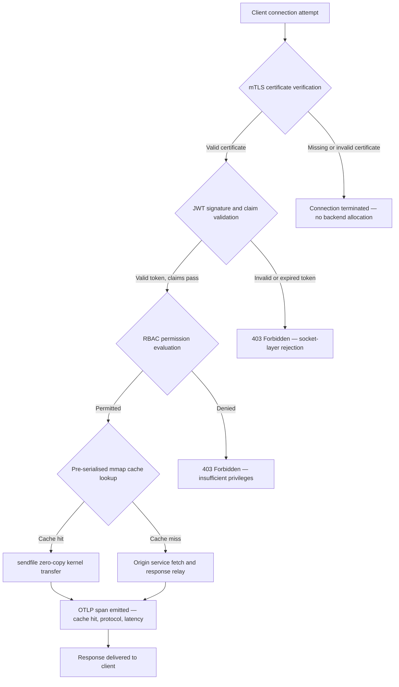

---

# Front Matter (YAML)

author: "contact@sebastienrousseau.com (Sebastien Rousseau)"
banner_alt: "밤의 추상적인 회로 기판 도시 경관 — 커널 수준 제로 복사 전송, mTLS 핸드셰이크, JWT 검증이 단일 정적 링크 바이너리에서 수렴하는 뱅킹 엣지를 시각화"
banner_height: "1597"
banner_width: "2584"
banner: "https://cloudcdn.pro/stocks/images/bit-cloud-GlqbGLCPnQ4.webp"
cdn: "https://cloudcdn.pro"
charset: "UTF-8"
cname: "sebastienrousseau.com"
copyright: "© Copyright 2025 - 2026 - Sebastien Rousseau. All rights reserved."
date: "June 20, 2026"
description: "http-handle은 제로 런타임 의존성, 통합 mTLS 및 JWT 검증, ALPN 협상 HTTP/2 및 HTTP/3, OTLP 관찰 가능성을 갖춘 정적 링크 Rust 바이너리로 뱅킹 엣지에서 초당 180,000개의 요청을 처리합니다 — Nginx와 Envoy가 남긴 보안 및 복원력 격차를 해소합니다."
format-detection: "telephone=no"
hreflang: "ko"
icon: "https://cloudcdn.pro/clients/sebastienrousseau/v1/logos/sebastienrousseau.svg"
id: "https://sebastienrousseau.com/2026-06-20-http-handle-zero-dependency-edge-ingress-banking-rust-2026"
image_alt: "Sebastien Rousseau의 흑백 초상화"
image_height: "162"
image_width: "162"
image: "https://cloudcdn.pro/stocks/images/sebastienrousseau.webp"
keywords: "http-handle, Rust 엣지 인그레스, 의존성 없는 프록시, 뱅킹 인프라, mTLS JWT, sendfile 제로 복사, ALPN HTTP3, DORA 컴플라이언스, 바젤 III, OTLP 관찰 가능성, 정적 바이너리, ARM64 뱅킹, 제로 트러스트 뱅킹, 경량 인그레스, Rust 뱅킹 보안"
language: "ko-KR"
last_reviewed: "2026-06-20"
layout: "report"
locale: "ko_KR"
logo_alt: "Sebastien Rousseau의 로고"
logo_height: "44"
logo_width: "44"
logo: "https://cloudcdn.pro/clients/sebastienrousseau/v1/logos/sebastienrousseau.svg"
menu: ""
measurementID: "G-169G4ET5HQ"
name: "Sebastien Rousseau"
permalink: "https://sebastienrousseau.com/2026-06-20-http-handle-zero-dependency-edge-ingress-banking-rust-2026"
rating: "general"
referrer: "no-referrer"
robots: "index, follow"
schema: "FAQPage, Article"
seo_title: "http-handle: 180k req/s 뱅킹을 위한 의존성 없는 Rust 인그레스"
short_name: "sebastienrousseau"
subtitle: "단일 정적 링크 Rust 바이너리가 뱅킹 엣지에서 mTLS, JWT, ALPN으로 초당 180,000개의 요청을 처리하는 방법 — 그리고 DORA 및 바젤 III 컴플라이언스에 대한 의미."
tags: "http-handle, Rust, banking, edge-ingress, mTLS, JWT, ALPN, HTTP3, DORA, Basel-III, zero-copy, sendfile, ARM64, zero-trust, OTLP, observability, open-source, infrastructure"
theme-color: "0, 83, 191"
title: "http-handle: 2026년 뱅킹을 위한 고성능 의존성 없는 엣지 인그레스"
url: "https://sebastienrousseau.com/2026-06-20-http-handle-zero-dependency-edge-ingress-banking-rust-2026"
viewport: "width=device-width, initial-scale=1, shrink-to-fit=no"

# RSS - The RSS feed front matter (YAML).
atom_link: "https://sebastienrousseau.com/2026-06-20-http-handle-zero-dependency-edge-ingress-banking-rust-2026/rss.xml"
category: "Technology"
docs: https://validator.w3.org/feed/docs/rss2.html
generator: "Static Site Generator (SSG) (version 0.0.40)"
item_description: "http-handle은 제로 런타임 의존성, 통합 mTLS 및 JWT 검증, ALPN 협상 HTTP/2 및 HTTP/3, OTLP 관찰 가능성을 갖춘 정적 링크 Rust 바이너리로 뱅킹 엣지에서 초당 180,000개의 요청을 처리합니다 — Nginx와 Envoy가 남긴 보안 및 복원력 격차를 해소합니다."
item_guid: "https://sebastienrousseau.com/2026-06-20-http-handle-zero-dependency-edge-ingress-banking-rust-2026/rss.xml"
item_link: "https://sebastienrousseau.com/2026-06-20-http-handle-zero-dependency-edge-ingress-banking-rust-2026/rss.xml"
item_pub_date: "Sat, 20 Jun 2026 07:07:07 +0000"
item_title: "http-handle: 2026년 뱅킹을 위한 고성능 의존성 없는 엣지 인그레스"
last_build_date: "Sat, 20 Jun 2026 07:07:07 +0000"
managing_editor: "contact@sebastienrousseau.com (Sebastien Rousseau)"
pub_date: "Sat, 20 Jun 2026 07:07:07 +0000"
ttl: "60"
type: "article"
webmaster: "contact@sebastienrousseau.com"

# Apple - The Apple front matter (YAML).
apple_mobile_web_app_orientations: "portrait"
apple_touch_icon_sizes: "192x192"
apple-mobile-web-app-capable: "yes"
apple-mobile-web-app-status-bar-inset: "black"
apple-mobile-web-app-status-bar-style: "black-translucent"
apple-mobile-web-app-title: "의존성 없는 뱅킹 엣지"
apple-touch-fullscreen: "yes"

# MS Application - The MS Application front matter (YAML).

msapplication-navbutton-color: "0, 83, 191"

# Twitter Card - The Twitter Card front matter (YAML).

twitter_card: "summary_large_image"
twitter_creator: "@wwdseb"
twitter_description: "http-handle은 제로 런타임 의존성, mTLS, JWT, OTLP 관찰 가능성을 갖춘 정적 링크 Rust 바이너리로 뱅킹 엣지에서 초당 180,000개의 요청을 처리합니다."
twitter_image: "https://cloudcdn.pro/clients/sebastienrousseau/v1/logos/sebastienrousseau.svg"
twitter_image_alt: "Logo of Sebastien Rousseau"
twitter_site: "@wwdseb"
twitter_title: "http-handle: 180k req/s 뱅킹을 위한 의존성 없는 Rust 인그레스"
twitter_url: "https://sebastienrousseau.com/2026-06-20-http-handle-zero-dependency-edge-ingress-banking-rust-2026"

# Humans.txt - The Humans.txt front matter (YAML).
author_website: "https://sebastienrousseau.com"
author_twitter: "@wwdseb"
author_location: "London, UK"
thanks: "Thanks for reading!"
site_last_updated: "2026-06-20"
site_standards: "HTML5, CSS3, RSS, Atom, JSON, XML, YAML, Markdown, TOML"
site_components: "Kaishi, Kaishi Builder, Kaishi CLI, Kaishi Templates, Kaishi Themes"
site_software: "Static Site Generator, Rust"

excerpt: "뱅킹 엣지에는 의존성 문제가 있습니다. 클라이언트와 핵심 뱅킹 서비스 사이의 트래픽을 라우팅하는 모든 Nginx 또는 Envoy 인스턴스는 의존성 트리를 갖고 있습니다: OpenSSL 빌드, Lua 모듈, gRPC 라이브러리, 컨테이너 레이어…"
---

# http-handle: 2026년 뱅킹을 위한 고성능 의존성 없는 엣지 인그레스

<!-- lead-start -->
<aside class="post-lead" aria-label="기사 요약">

<strong>TL;DR.</strong> http-handle은 제로 런타임 의존성, 통합 mTLS 및 JWT 검증, ALPN 협상 HTTP/2 및 HTTP/3, OTLP 관찰 가능성을 갖춘 정적 링크 Rust 바이너리로 뱅킹 엣지에서 초당 180,000개의 요청을 처리합니다 — Nginx와 Envoy가 남긴 보안 및 복원력 격차를 해소합니다.

<strong>핵심 요점</strong>

<ul class="post-lead-takeaways">
  <li><strong>간단한 답변.</strong> 한 문장으로 http-handle이란 무엇인가?</li>
  <li><strong>경영진 요약.</strong> 은행들은 10년간 엣지에서 Nginx와 Envoy를 운영해왔습니다.</li>
  <li><strong>01. 뱅킹의 무거운 프록시 문제.</strong> Nginx와 Envoy는 현대 인터넷의 엣지를 구축했습니다.</li>
  <li><strong>02. http-handle 2026 아키텍처 렌즈.</strong> 바이너리는 5개의 상호 의존적인 레이어로 구성되어 있으며, 각각은 전통적인 프록시 아키텍처가 축적하는 특정 위험 범주를 제거하도록 설계되었습니다.</li>
</ul>

<strong>관련 읽기:</strong> <a href="https://sebastienrousseau.com/2023-11-19-crystals-kyber-the-safeguarding-algorithm-in-a-quantum-age/index.html">CRYSTALS-Kyber: 양자 시대의 보호 알고리즘</a>, <a href="https://sebastienrousseau.com/2026-06-20-html-generator-accessible-seo-structured-markdown-rust-2026">2026년 Rust로 마크다운을 접근 가능하고 SEO 최적화된 구조화 HTML로 변환하기</a>, <a href="https://sebastienrousseau.com/2026-06-12-kyberlib-post-quantum-banking-migration-standards-code-2026">KyberLib와 2026년 포스트 양자 뱅킹 마이그레이션: 표준에서 코드로</a>.

</aside>
<!-- lead-end -->

뱅킹 엣지에는 의존성 문제가 있습니다. 클라이언트와 핵심 뱅킹 서비스 사이의 트래픽을 라우팅하는 모든 Nginx 또는 Envoy 인스턴스는 의존성 트리를 갖고 있습니다: OpenSSL 빌드, Lua 모듈, gRPC 라이브러리, 컨테이너 레이어 — 각각이 잠재적인 CVE이고, 각각이 전용 패치 사이클이 필요하며, 각각이 SLA 측정을 복잡하게 만드는 지연 시간 분산을 추가합니다. [디지털 운영 복원력 법(DORA)](https://eur-lex.europa.eu/eli/reg/2022/2554/oj) 하에서 그 복잡성은 이제 운영상의 부담만큼 규제상의 부담이기도 합니다.

[http-handle](https://github.com/sebastienrousseau/http-handle)은 다른 접근 방식을 취합니다. `libc` 이외에 런타임 의존성이 제로인 단일 정적 링크 Rust 바이너리입니다. ARM64 노드에서 초당 180,000개의 요청을 처리하고, 네트워크 소켓 레이어에서 상호 TLS와 JWT 인증을 강제하며, HTTP/2와 HTTP/3을 자동으로 협상합니다 — 모두 20MB RAM 미만의 배포 공간 내에서.

## 간단한 답변

**한 문장으로 http-handle이란 무엇인가?** http-handle은 뱅킹 엣지의 무거운 프록시 컨테이너를 대체하는 오픈 소스 정적 링크 Rust 바이너리로, Linux `sendfile(2)` 제로 복사 커널 전송을 통해 ARM64에서 180,000 req/s를 처리하고, 백엔드 리소스에 접근하기 전에 소켓 레이어에서 mTLS, JWT, RBAC을 강제하며, 네이티브 [OpenTelemetry](https://opentelemetry.io/) 메트릭을 내보냅니다 — `libc` 이외에 런타임 라이브러리 의존성은 제로입니다.

## 경영진 요약

은행들은 10년간 엣지에서 Nginx와 Envoy를 운영해왔습니다. 둘 다 유능하지만 2026년의 규제 환경을 위해 설계되지 않았습니다. 의존성이 많은 컨테이너 이미지는 규정 준수 팀이 충분히 빠르게 처리할 수 없는 CVE 대기열을 생성하고, 모든 라이브러리 버전 업그레이드에는 회귀 위험이 따릅니다. DORA 제5조와 제6조는 ICT 위험이 발견 후 패치가 아닌 설계에 의해 관리되어야 한다고 요구합니다. 바젤 III 운영 위험 프레임워크는 시스템 복잡성과 함께 장애 지점이 증가하는 아키텍처에 패널티를 부과합니다.

http-handle은 근원에서 의존성 문제를 제거합니다. 바이너리는 한 번 정적으로 컴파일되며 런타임에 외부 라이브러리 요구 사항이 없습니다. 공격 표면은 Rust 표준 라이브러리와 `libc`로 축소됩니다. 보안 강제 — mTLS 인증서 검증, JWT 클레임 검증, 역할 기반 액세스 제어 — 는 백엔드 할당 전에 네트워크 소켓에서 실행되어 제로 트러스트 경계를 가능한 최소 표현으로 축소합니다. 성능은 아키텍처에서 비롯됩니다: 사전 직렬화된 메모리 매핑 캐시 블록과 `sendfile(2)` 커널 전송의 조합이 CPU에서 메모리로의 복사 경로에서 데이터를 완전히 제거하여 ARM64 하드웨어에서 180,000 req/s를 유지합니다. 결과는 DORA 복원력 요구 사항을 충족하고, 바젤 III 운영 위험 감소 주장을 지원하며, SM&CR 하에서 시니어 IT 리더에게 엣지 인프라에 대한 검증 가능한 단일 컴포넌트 책임 체인을 제공하는 인그레스 레이어입니다.

## 핵심 요점

- **작은 바이너리, 작은 CVE 대기열.** 정적 링크 단일 바이너리는 패치할 패키지 하나, 검증할 릴리스 하나, 감사할 아티팩트 하나입니다. 표준 모듈 세트를 갖춘 Nginx는 30개 이상의 공유 라이브러리 의존성을 갖추고 있으며, 각각은 자체 취약성 수명 주기를 갖습니다.
- **제로 복사는 최적화가 아닙니다 — 설계 제약입니다.** 초당 180,000 req/s에서 사용자 공간 데이터 복사는 측정 가능한 지연 시간 분산을 도입합니다. `sendfile(2)`는 파일 디스크립터 내용을 커널 공간 내에서 완전히 네트워크 소켓으로 전송합니다. mmap 고정 응답 캐시 블록과 결합하여 CPU는 캐시된 응답에 대한 데이터 경로에 결코 접근하지 않습니다.
- **보안 경계는 소켓에 있습니다.** 애플리케이션 미들웨어에서 JWT와 mTLS 인증서를 검증하는 것은 요청이 거부되기 전에 백엔드가 이미 스레드와 메모리를 할당했음을 의미합니다. 소켓 레이어 검증은 인증되지 않은 요청이 백엔드 리소스를 전혀 소비하지 않도록 보장합니다.
- **OTLP는 관찰 가능성 격차를 제거합니다.** 네이티브 OpenTelemetry 통합은 모든 요청, 모든 인증 결정, 모든 프로토콜 협상이 사이드카 에이전트 없이 구조화된 원격 측정을 생성함을 의미합니다. 기존 은행 대시보드는 OTLP 추적을 직접 수집합니다.

**관련 읽기:** [2026년 AI, MCP, 금융 인프라를 위해 YAML에 더 안전한 Rust 스택이 필요한 이유](https://sebastienrousseau.com/2026-06-18-noyalib-safe-yaml-rust-ai-mcp-financial-infrastructure-2026/), [CloudCDN: 2026년 AI 네이티브 엣지를 위한 오픈 소스 블루프린트](https://sebastienrousseau.com/2026-06-11-cloudcdn-open-source-blueprint-ai-native-edge-2026/), [2026년 은행 및 금융 기관을 위한 최고의 클라우드 인프라 아키텍처](https://sebastienrousseau.com/2026-05-16-best-cloud-infrastructure-architecture-2026/).

## 01. 뱅킹의 무거운 프록시 문제

Nginx와 Envoy는 현대 인터넷의 엣지를 구축했습니다. 구성 가능하고 실전에서 테스트되었으며 대형 커뮤니티의 지원을 받습니다. 또한 DORA가 존재하기 전, 바젤 III 운영 위험 프레임워크가 정량화 가능한 복잡성 감소를 요구하기 전, ARM64 클라우드 노드가 고처리량 컴퓨팅의 경제성을 바꾸기 전에 이루어진 아키텍처 선택입니다.

실질적인 결과는 은행이 필요로 하는 것과 무거운 프록시 컨테이너가 제공하는 것 사이의 격차입니다.

**의존성 표면.** 표준 Envoy 배포는 OpenSSL, Abseil, Protobuf, gRPC, Lua 및 수십 개의 보조 라이브러리를 가져옵니다. 각각은 독립적인 CVE 수명 주기를 갖습니다. National Vulnerability Database가 중요한 OpenSSL 권고를 게시하면 에스테이트의 모든 Envoy 인스턴스는 컴플라이언스 시계가 됩니다: 평가, 패치, 테스트, 재배포, 재인증 — 바이너리가 실행되는 모든 환경에서. DORA 제6조에 따라 은행들은 ICT 위험 관리 프로세스가 비례적이고 문서화되었으며 검증 가능함을 증명해야 합니다. 다중 라이브러리 의존성 트리는 그 증명을 유지하는 비용을 높입니다.

**메모리 오버헤드.** 최소한으로 구성된 Nginx 워커 프로세스는 중간 부하에서 40–80 MB의 상주 메모리를 소비합니다. 대규모로 — 거래 시스템, 지불 API 및 고객 대면 포털에 걸쳐 수백 개의 인그레스 노드 — 그 오버헤드는 잘 설계된 단일 바이너리 대안에 비해 해당하는 성능 이점 없이 측정 가능한 인프라 비용으로 누적됩니다.

**패치 속도.** 컨테이너 이미지 공급망은 CVE 게시와 검증된 패치가 프로덕션에 도달하는 사이에 수일간의 지연을 도입합니다. 기본 이미지를 재구축하고, 애플리케이션 레이어를 다시 레이어하고, 전체 테스트 매트릭스를 다시 실행하고, 배포 파이프라인을 다시 실행해야 합니다. DORA 인시던트 보고 기간 하에서 운영되는 중요한 뱅킹 시스템의 경우 이 사이클은 구조적 위험입니다.

http-handle은 세 가지 모두를 해결합니다. 하나의 바이너리. 하나의 CVE 표면. 패치할 하나의 아티팩트. 프로덕션 인그레스 노드에서 20 MB RAM 미만.

## 02. http-handle 2026 아키텍처 렌즈

바이너리는 5개의 상호 의존적인 레이어로 구성되어 있으며, 각각은 전통적인 프록시 아키텍처가 축적하는 특정 위험 범주를 제거하도록 설계되었습니다.

### 표 1: http-handle 아키텍처 레이어 및 위험 완화

| 레이어 | 설계 결정 | 중요한 이유 | 잘못 처리될 경우의 위험 |
| ---- | ---- | ---- | ---- |
| **서버 코어** | 단일 Rust 바이너리, 정적 링크, `libc` 이외 의존성 제로 | 패치할 아티팩트 하나; 에스테이트 전반의 라이브러리 CVE 전파 제거 | 의존성 혼동 공격; 라이브러리 취약성 누적 |
| **가속 엔진** | 사전 직렬화 mmap 캐시 블록 및 `sendfile(2)` 제로 복사 커널 전송 | ARM64에서 1밀리초 미만의 프록시 오버헤드로 180,000 req/s; 캐시된 응답에 사용자 공간으로 데이터 진입 없음 | 메모리 매핑 누수; 캐시 무효화 하에서 커널 공간 병목 |
| **암호화 보안** | 핫 리로드 인증서 지원 및 ALPN 협상을 갖춘 네이티브 mTLS | 데이터 무결성 및 프로토콜 호환성 보장; 연결 끊김 없는 인증서 교체 | 인증서 만료로 인한 서비스 중단; 약한 암호 스위트 기본값 |
| **액세스 정책 플레인** | 소켓 레이어 JWT 검증 및 RBAC 클레임 평가 | 인증되지 않은 요청은 백엔드 리소스를 소비하지 않음; 커널 경계에서 제로 트러스트 강제 | JWT 알고리즘 혼동 공격; 과도한 권한 액세스를 부여하는 RBAC 구성 오류 |
| **관찰 가능성** | 네이티브 [OpenTelemetry(OTLP)](https://opentelemetry.io/docs/specs/otlp/) 통합 | 사이드카 에이전트 없는 구조화된 원격 측정; 기존 은행 모니터링 에스테이트로 직접 수집 | 중단 중 사각지대; DORA 인시던트 보고를 위한 불완전한 감사 추적 |

## 03. 핵심 성능 및 보안 신호

엣지에서 http-handle을 운영하는 은행들은 DORA 운영 보고 요구 사항과 내부 SLA 거버넌스를 충족하기 위해 5개의 정량화 가능한 신호를 계측해야 합니다.

### 표 2: 운영 벤치마크 및 규제 참조

| 신호 | 벤치마크 | 규제 참조 | 기술 구현 |
| ---- | ---- | ---- | ---- |
| **처리량** | ARM64 노드에서 P99 ≤ 1 ms 프록시 오버헤드로 ≥ 180,000 req/s | 바젤 III 운영 위험 — 시스템 복잡성 감소 | `sendfile(2)` + mmap 사전 직렬화 캐시 블록; 캐시 히트에 대한 사용자 공간 데이터 복사 없음 |
| **공격 표면** | 런타임 라이브러리 의존성 제로; 릴리스당 하나의 바이너리 아티팩트 | [DORA 제6조](https://eur-lex.europa.eu/eli/reg/2022/2554/oj) — 설계에 의한 ICT 위험 관리 | `cargo build --release --target aarch64-unknown-linux-musl`을 통한 정적 컴파일 |
| **인증 지연 시간** | 백엔드 응답의 첫 번째 바이트 전에 완료되는 mTLS 핸드셰이크 + JWT 검증 | [DORA 제5조](https://eur-lex.europa.eu/eli/reg/2022/2554/oj) — ICT 보안 보호 | 소켓 레이어 가로채기; 백엔드 라우팅 전 커널 인접 Rust에서 JWT 클레임 평가 |
| **인증서 가용성** | 교체 중 연결 끊김 제로의 mTLS 인증서 핫 리로드 | 엣지 가용성에 대한 SM&CR 시니어 매니지먼트 책임 | inotify 기반 인증서 감시자; 리로드 중 원자적 파일 디스크립터 교체 |
| **관찰 가능성 커버리지** | 인증 결과, 프로토콜 버전, 캐시 상태를 포함한 OTLP 스팬을 생성하는 요청 100% | DORA 제17조 — 인시던트 감지 및 보고 | 네이티브 OTLP 익스포터; 사이드카 불필요; gRPC 또는 HTTP/Protobuf 전송 구성 가능 |

## 04. 제로 복사 엔진: mmap과 sendfile(2)

고빈도 뱅킹에서의 네트워크 성능 — 실시간 결제, 시장 데이터 API, 인증 토큰 서비스 — 은 다른 무엇보다 하나의 제약에 의해 제한됩니다: 저장소에서 네트워크 소켓으로 바이트를 이동하는 비용.

기존 HTTP 서버는 파일 내용을 사용자 공간 버퍼에 읽은 다음 해당 버퍼를 소켓에 씁니다. 그 순서는 각 응답에 대해 사용자 공간과 커널 공간 사이의 두 개의 메모리 복사와 두 번의 컨텍스트 스위치를 필요로 합니다. 초당 180,000개의 요청에서 누적된 오버헤드는 상당합니다.

http-handle은 두 복사를 모두 제거합니다.

**메모리 매핑 캐시 블록.** 서비스가 시작되면 `mmap(2)`를 사용하여 정적 응답 내용을 메모리 매핑된 영역으로 직렬화합니다. 이 영역들은 커널의 페이지 캐시에 고정됩니다. 캐시된 리소스에 대한 요청이 도착하면 응답은 이미 커널 메모리에 매핑되어 있습니다 — 디스크 읽기 없음, 버퍼 할당 없음.

**`sendfile(2)` 커널 전송.** Linux `sendfile(2)` 시스템 호출은 파일 디스크립터 — 또는 메모리 매핑된 영역 — 에서 네트워크 소켓 파일 디스크립터로 데이터를 커널 내에서 완전히 전송합니다. 어떤 바이트도 사용자 공간에 들어가지 않습니다. CPU의 역할은 시스템 호출 발행과 완료 이벤트 처리로 축소됩니다. 이 아키텍처의 ARM64 노드에서 http-handle은 지속적인 부하에서 1밀리초 미만의 프록시 오버헤드로 180,000 req/s를 유지합니다.

월말 배치 조정, 당일 유동성 보고 또는 실시간 사기 점수 API 트래픽을 실행하는 은행들에게 엔지니어링 결과는 직접적입니다: 트래픽 계층당 ARM64 노드가 적고, 인프라 비용이 낮으며, 용량 부족으로 인한 DORA 복원력 위험이 더 작아집니다.

## 05. mTLS 및 JWT 액세스 정책 플레인

뱅킹에서 엣지의 인증은 기능이 아닙니다 — 규제 요구 사항입니다. DORA는 ICT 보안 통제가 비례적이고 문서화되었으며 검증 가능해야 한다고 의무화합니다. SM&CR은 인프라 보안 결정에 대한 개인적 책임을 지명된 시니어 매니저에게 부여합니다. 문제는 엣지에서 인증할지 여부가 아니라 어느 레이어에서 할지입니다.

http-handle은 백엔드 리소스가 할당되기 전에 3단계 제로 트러스트 정책을 강제합니다.

**1단계: mTLS 클라이언트 인증서 검증.** TLS 핸드셰이크 중에 http-handle은 구성 가능한 신뢰 저장소에 대해 클라이언트 인증서를 요청하고 검증합니다. 유효한 인증서가 없는 연결은 핸드셰이크에서 종료됩니다. 애플리케이션 스레드는 생성되지 않고, 메모리 풀도 할당되지 않습니다. 백엔드는 요청을 결코 보지 않습니다.

**2단계: JWT 클레임 검증.** mTLS를 통과한 연결의 경우 http-handle은 소켓 레이어의 `Authorization` 헤더에서 JSON 웹 토큰을 추출하고 검증합니다. 서명 검증, 만료 확인, 발행자 검증은 요청이 라우팅 레이어에 도달하기 전에 발생합니다. 서버가 비대칭 키가 예상될 때 대칭 알고리즘을 허용하는 알고리즘 혼동 공격은 구성의 명시적 알고리즘 허용 목록에 의해 차단됩니다.

**3단계: RBAC 클레임 평가.** 검증된 JWT 클레임은 메모리 내 역할 테이블에 매핑됩니다. 불충분한 권한을 가진 요청은 액세스 정책 플레인에서 403 응답을 받습니다. 백엔드 서비스는 승인되지 않은 트래픽에 대해 결코 호출되지 않습니다.

이 순서는 운영상 중요합니다. 인증이 애플리케이션 미들웨어에서 실행되는 전통적인 모델에서 공격자는 하나의 거부가 발행되기 전에 인증되지 않은 요청으로 백엔드 스레드 풀을 고갈시킬 수 있습니다. 소켓 레이어 인증은 그 공격 벡터를 완전히 붕괴시킵니다.

## 06. ALPN 라우팅과 HTTP/3 폴백 체인

뱅킹 트래픽은 다양한 네트워크 조건을 통해 도착합니다: 거래 데스크를 위한 기업 광섬유, 모바일 뱅킹 클라이언트를 위한 5G, 원격 운영을 위한 위성 연결, 규제된 환경의 TLS 검사 프록시. 단일 프로토콜 인그레스는 최소 공통 분모 제약을 만듭니다.

http-handle은 [Application-Layer Protocol Negotiation(ALPN)](https://www.rfc-editor.org/rfc/rfc7301)을 사용하여 각 연결에 최적의 프로토콜을 자동으로 선택합니다.

**HTTP/2**는 TCP를 통한 브라우저 및 API 트래픽의 기본값입니다. 단일 연결을 통한 다중화 스트림은 동시 요청 패턴에서 HTTP/1.1이 도입하는 헤드 오브 라인 블로킹을 제거합니다.

**HTTP/3(QUIC)**은 네트워크가 UDP를 지원하고 클라이언트가 ALPN 확장에서 `h3`을 광고할 때 활성화됩니다. QUIC의 독립적인 스트림 멀티플렉싱과 연결 마이그레이션은 TCP 연결이 자주 끊어지고 재연결되는 혼잡한 셀룰러 네트워크의 모바일 뱅킹 클라이언트에게 실질적으로 더 우수합니다.

**우아한 폴백.** ALPN 협상이 실패하면 — 중간 프록시가 확장을 제거하거나 레거시 클라이언트가 그것을 생략하기 때문에 — http-handle은 모든 보안 헤더, mTLS 강제, JWT 검증을 유지하면서 HTTP/1.1로 폴백합니다. 프로토콜 폴백 중에 보안 속성이 저하되지 않습니다.

## 07. 제로 복사 요청 수명 주기

다음 다이어그램은 클라이언트 연결에서 응답 전달까지의 완전한 요청 경로를 보여줍니다. 인증 게이트와 관찰 가능성 방출 지점을 포함합니다.

캐시 히트 응답의 중요 경로는 3개의 보안 게이트와 하나의 시스템 호출을 통과합니다. 응답 본문에 대한 사용자 공간 버퍼가 할당되지 않습니다. OTLP 스팬은 인증 결과, ALPN 협상 프로토콜 버전, 캐시 상태, 엔드 투 엔드 지연 시간을 하나의 구조화된 레코드에 캡처합니다.

## 08. 규제 정렬: DORA, 바젤 III, SM&CR

### DORA 제5조 및 제6조 — ICT 위험 관리 및 보호

[DORA 제5조](https://eur-lex.europa.eu/eli/reg/2022/2554/oj)는 금융 기관이 ICT 위험 관리 프레임워크를 유지할 것을 요구합니다. 제6조는 ICT 시스템의 위험 프로파일에 비례한 보호 및 예방 조치를 구현하도록 요구합니다.

정적 링크 단일 바이너리는 다중 라이브러리 컨테이너 스택보다 더 효율적으로 두 요구 사항을 모두 충족합니다. 공격 표면은 정량화 가능합니다 — 하나의 아티팩트, 하나의 의존성(`libc`), 하나의 CVE 표면 — 그리고 보호 조치는 절차적이 아닌 구조적입니다: mTLS와 JWT 강제는 구성 가능한 애플리케이션 로직이 실행되기 전에 소켓 레이어에서 실행되기 때문에 구성 오류로 우회할 수 없습니다.

### 바젤 III — 운영 위험 자본 요구 사항

[바젤 III의 운영 위험 프레임워크](https://www.bis.org/bcbs/basel3.htm)는 규제 자본 요구 사항을 입증 가능한 위험 감소에 연결합니다. 시스템 복잡성과 ICT 장애 지점 수의 측정 가능한 감소를 문서화할 수 있는 은행들은 운영 위험 자본 할당 감소를 위한 정량화 가능한 주장을 가집니다. 다중 컨테이너 프록시 에스테이트를 단일 바이너리 인그레스 노드로 교체하는 것은 정확히 이 주장을 지지하는 복잡성 감소의 종류입니다 — 엔지니어링 팀이 증명 문서를 생산할 수 있는 경우에 한해.

http-handle의 감사 가능한 릴리스 아티팩트 — 재현 가능한 빌드, SBOM 호환 의존성 매니페스트, OTLP 기반 운영 로그 — 는 바젤 III 자본 논의가 요구하는 문서 체인을 지원합니다.

### SM&CR — 시니어 매니저 책임

[Senior Managers and Certification Regime(SM&CR)](https://www.fca.org.uk/firms/senior-managers-certification-regime)는 지명된 시니어 매니저에게 그들의 책임 하에 있는 시스템의 ICT 보안 자세에 대한 개인적 책임을 부여합니다. 서비스 중단 없이 인증서를 핫 리로드하고, OTLP를 통해 구조화된 감사 로그를 생성하며, 배포당 하나의 버전 고정 아티팩트를 갖는 단일 바이너리 인그레스는 지명된 시니어 매니저에게 검증 가능하고 문서화 가능한 보안 체인을 제공합니다. 다중 라이브러리 컨테이너 스택은 그렇지 않습니다.

## 09. 역할별 의미

### 이사회 및 최고경영자

바젤 III 운영 위험 프레임워크 하의 규제 자본 최적화는 입증 가능한 복잡성 감소에 달려 있습니다. Nginx 또는 Envoy를 단일 정적 링크 바이너리로 교체하면 건전성 규제 기관에 감사 가능하고 제시 가능한 방식으로 ICT 장애 지점 수가 감소합니다. CVE 표면 감소는 또한 사이버 보험료 재협상을 지원합니다 — 보험사는 입증 가능한 공격 표면 메트릭으로 가격을 책정하며, 단일 의존성 인그레스 바이너리는 구체적인 데이터 포인트입니다.

### 최고정보보안책임자 및 최고위험책임자

DORA 컴플라이언스는 ICT 보호 조치가 비례적이고 검증 가능해야 합니다. 소켓 레이어 mTLS 및 JWT 강제는 엣지에서 검증 가능하고 우회 불가능한 인증 게이트를 제공합니다. 핫 리로드 인증서 교체는 전통적인 인증서 업데이트가 갖는 서비스 윈도우 위험을 제거합니다. 의존성 없는 컴파일 모델은 중요한 `libc` 권고가 게시될 때 전체 에스테이트를 수일이 아닌 몇 시간 내에 단일 Rust 소스 아티팩트에서 재빌드, 테스트, 재배포할 수 있음을 의미합니다.

### 엔지니어링 및 IT 관리

표준 ARM64 노드에서 180,000 req/s는 결제 API 및 인증 서비스를 위한 인프라 크기 조정 대화를 바꿉니다. 네이티브 OTLP 통합은 Prometheus 익스포터, 사이드카 에이전트 또는 사용자 정의 로그 쉬퍼의 필요성을 제거합니다. Kubernetes 배포 모델은 표준 포드입니다 — 20 MB RAM 미만, 권한 있는 컨테이너 권한 없음, 호스트 네트워크 액세스 없음. 인증서 핫 리로드는 Kubernetes 롤링 재시작 오버헤드 없이 작동합니다.

## FAQ

**http-handle은 부하 하에서 인증서 교체를 어떻게 처리합니까?**
바이너리는 inotify 감시자를 사용하여 인증서 파일 경로를 모니터링합니다. 새 인증서 및 키 파일이 감지되면 활성 TLS 컨텍스트의 원자적 교체를 수행합니다 — 기존 연결은 이전 인증서를 사용하여 완료되고 새 연결은 즉시 교체된 인증서를 사용합니다. 연결이 끊어지지 않습니다. 서비스 윈도우가 필요하지 않습니다.

**http-handle은 인그레스 컨트롤러로서 Kubernetes 클러스터 내에서 실행할 수 있습니까?**
예. 바이너리는 표준 인그레스 서비스 어노테이션을 사용하여 독립 실행형 포드로 실행됩니다. 리소스 요구 사항은 전체 처리량에서 20 MB RAM 미만이며, 권한 있는 컨테이너 권한 없음 및 호스트 네트워크 액세스 요구 사항 없음입니다. 또한 집중형 게이트웨이 인증보다 사이드카 레이어에서 mTLS 강제가 선호되는 서비스 메시에서 사이드카로 실행할 수도 있습니다.

**프록시 자체의 측정 가능한 지연 시간 기여는 무엇입니까?**
캐시 히트 응답의 경우 프록시 오버헤드 — 소켓 수락에서 `sendfile(2)` 완료까지 — 는 ARM64 하드웨어에서 1밀리초 미만입니다. 업스트림 페치가 필요한 캐시 미스 응답의 경우 오버헤드는 오리진 응답 시간에 더해진 동일한 1밀리초 미만의 숫자입니다. 프록시 자체는 자격 증명 검증이 완료되기 전에 스레드 풀 할당 없이 소켓 레이어에서 동기적으로 인증이 발생하기 때문에 대기열 지연 시간을 추가하지 않습니다.

**http-handle은 기존 API 게이트웨이와 함께 제로 트러스트 아키텍처에 어떻게 맞습니까?**
http-handle은 OSI 레이어 4/7 경계에서 작동합니다: 업스트림 서비스로 라우팅하기 전에 전송 레이어 mTLS를 강제하고 애플리케이션 레이어 JWT를 검증합니다. 전체 API 게이트웨이 앞에 배치할 수 있습니다 — 인증되지 않은 트래픽이 게이트웨이의 더 비싼 처리 레이어에 도달하기 전에 흡수 — 또는 액세스 정책이 JWT 클레임으로 완전히 표현 가능한 서비스의 게이트웨이를 완전히 대체할 수 있습니다.

**바이너리 출력은 공급망 감사 목적으로 재현 가능합니까?**
예. 빌드는 고정된 Rust 툴체인 버전과 잠긴 `Cargo.lock`으로 재현 가능합니다. `cargo cyclonedx`를 통한 SBOM 생성은 각 릴리스에 대한 CycloneDX 호환 자재 명세서를 생성합니다. 두 아티팩트 모두 은행의 내부 소프트웨어 구성 분석 툴체인에 게시 가능하며 DORA 공급망 위험 문서화 요구 사항을 충족합니다.

## 결론

뱅킹 엣지에는 더 많은 기능이 필요하지 않습니다 — 각각이 덜 하고 검증 가능하게 하는 더 적은 컴포넌트가 필요합니다. http-handle은 인그레스 레이어를 불가분의 최솟값으로 줄입니다: 소켓에서 인증을 강제하고, 데이터를 복사 없이 전송하며, 구조화된 원격 측정으로 수행하는 모든 것을 보고하는 단일 Rust 바이너리. DORA 컴플라이언스 타임라인, 바젤 III 자본 최적화 검토, SM&CR 책임 요구 사항을 탐색하는 은행들에게 그 단순함은 엔지니어링 선호도가 아닙니다 — 규제 주장입니다.

[http-handle 소스 코드](https://github.com/sebastienrousseau/http-handle)는 MIT 및 Apache 2.0 이중 라이센스 하에 제공됩니다.

---

*참고 문헌*

Basel Committee on Banking Supervision (2011). *Basel III: A global regulatory framework for more resilient banks and banking systems*. Bank for International Settlements. Available at: [https://www.bis.org/publ/bcbs189.pdf](https://www.bis.org/publ/bcbs189.pdf)

European Parliament and Council (2022). Regulation (EU) 2022/2554 on digital operational resilience for the financial sector (DORA). Available at: [https://eur-lex.europa.eu/legal-content/EN/TXT/?uri=CELEX:32022R2554](https://eur-lex.europa.eu/legal-content/EN/TXT/?uri=CELEX:32022R2554)

Financial Conduct Authority (2015). *Senior Managers and Certification Regime (SM&CR)*. Available at: [https://www.fca.org.uk/firms/senior-managers-certification-regime](https://www.fca.org.uk/firms/senior-managers-certification-regime)

Internet Engineering Task Force (2014). *RFC 7301: Transport Layer Security (TLS) Application-Layer Protocol Negotiation Extension*. Available at: [https://www.rfc-editor.org/rfc/rfc7301](https://www.rfc-editor.org/rfc/rfc7301)

OpenTelemetry Authors (2024). *OpenTelemetry Protocol Specification (OTLP)*. Available at: [https://opentelemetry.io/docs/specs/otlp/](https://opentelemetry.io/docs/specs/otlp/)

<!-- enrich-start -->
<aside class="author-card" aria-label="저자 소개"><strong class="author-card-name"><a href="/about/index.html">Sebastien Rousseau</a></strong>응용 AI, ISO 20022 마이그레이션, 금융 서비스를 위한 포스트 양자 암호화, 도매 결제의 구조적 변환에 대해 저술하는 시니어 뱅킹 기술자.HSBC Commercial &amp; Investment Bank, PayPal, Barclays, Shazam, AKQA, Virgin Group에서 20년 이상. <a href="/about/index.html">전체 프로필</a> &middot; <a href="https://www.linkedin.com/in/sebastienrousseau/" rel="external noopener">LinkedIn</a> &middot; <a href="https://github.com/sebastienrousseau" rel="external noopener">GitHub</a></aside>

최종 검토 <time datetime="2026-06-20">2026-06-20</time>.

<aside class="related-posts" aria-labelledby="related-heading">
<h2 id="related-heading" class="related-heading">관련 읽기</h2>

<article class="related-card"><footer class="related-body"><h3><a href="https://sebastienrousseau.com/2023-11-19-crystals-kyber-the-safeguarding-algorithm-in-a-quantum-age/index.html">CRYSTALS-Kyber: 양자 시대의 보호 알고리즘</a></h3>
<time datetime="2023-11-19">2023-11-19</time>
</footer></article>
<article class="related-card"><footer class="related-body"><h3><a href="https://sebastienrousseau.com/2026-06-20-html-generator-accessible-seo-structured-markdown-rust-2026">2026년 Rust로 마크다운을 접근 가능하고 SEO 최적화된 구조화 HTML로 변환하기</a></h3>
<time datetime="2026-06-20">2026-06-20</time>
</footer></article>
<article class="related-card"><footer class="related-body"><h3><a href="https://sebastienrousseau.com/2026-06-12-kyberlib-post-quantum-banking-migration-standards-code-2026">KyberLib와 2026년 포스트 양자 뱅킹 마이그레이션: 표준에서 코드로</a></h3>
<time datetime="2026-06-12">2026-06-12</time>
</footer></article>

</aside>
<!-- enrich-end -->
