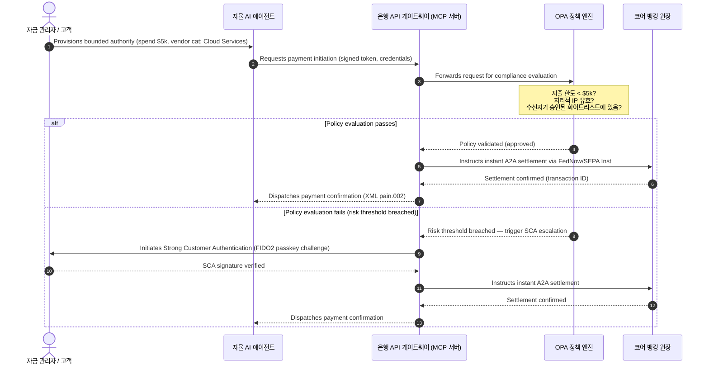

# 2026 글로벌 결제 전망: 에이전트형, 임베디드, 실시간 세계에서의 운영 모델, 리스크 및 수익

2026년 글로벌 결제 사이클은 세 가지 융합되는 힘 — 에이전트형 커머스, 임베디드 결제, 실시간 실행 — 으로 정의되며, Project Agorá 하의 토큰화 통합 원장과 2026년 11월 14/15일의 확정된 SWIFT 및 SEPA 구조화 주소 컷오버 위에 자리잡고 있습니다. Swift CBPR+는 2026년 11월 14일부터 비구조화 `<AdrLine>` 블록을 제거합니다. EPC SEPA 규칙서는 2026년 11월 15일까지만 비구조화 주소를 허용합니다.

<!-- lead-start -->
<aside class="post-lead" aria-label="기사 요약">

<strong>TL;DR.</strong> 2026년 결제 환경은 메시징 마이그레이션에서 벗어나, 실시간 실행이 리스크와 수익을 좌우하는 다차원 운영 모델로 이동했습니다. 이 글은 J.P. Morgan, Global Payments, HSBC, Payments Association의 2026년 전망을 4개 기둥의 G-SIB 운영 계획으로 종합하며, 모델이 개시하는 에이전트형 커머스, 상시 가동 자금 관리 API, BIS Project Agorá 하의 토큰화 통합 원장, 그리고 2026년 11월 14/15일 SWIFT 및 SEPA 구조화 주소 마감일을 다룹니다. Swift CBPR+는 2026년 11월 14일부터 비구조화 `<AdrLine>` 블록을 제거합니다. EPC SEPA 규칙서는 2026년 11월 15일까지만 비구조화 주소를 허용합니다.

<strong>핵심 요점</strong>

<ul class="post-lead-takeaways">
  <li><strong>에이전트형 커머스는 위임 책임의 새로운 영역을 열어줍니다.</strong> 자율 AI 에이전트는 2030년까지 연간 3조~5조 달러의 커머스를 중개할 것으로 전망됩니다. 은행은 MCP 게이트키핑, PSD3/PSR 하의 SCA 위임, 그리고 다중 에이전트 결제 체인 내 KYC/AML 소유권을 정의해야 합니다.</li>
  <li><strong>상시 가동 유동성은 이제 운영 및 규제 기준선입니다.</strong> 24/7 자금 관리 API와 가상 계좌는 정체된 자금을 최소화하고 복원력 기준을 높입니다. 시스템적으로 중요한 실시간 트레저리 API의 경우, 파이브 나인(99.999 %) 가용성은 은행이 감독당국에 DORA 수준의 회복력을 입증하기 위해 설정하는 내부 엔지니어링 목표가 되어가고 있습니다. DORA 자체는 보편적인 파이브 나인 임계값을 규정하지 않습니다. ICT 리스크 관리, 사고 보고, 회복력 테스트, 제3자 리스크, 중요 ICT 공급업체에 대한 감독을 다룹니다.</li>
  <li><strong>토큰화는 규제된 통합 원장으로 발전했습니다.</strong> Project Agorá는 토큰화된 상업은행 예금과 중앙은행 준비금을 위한 가장 큰 민관 프레임워크입니다. 은행은 명확한 건전성 처리를 갖춘 5단계 토큰화 여정을 필요로 합니다.</li>
  <li><strong>2026년 11월 14/15일 구조화 주소 컷오버는 확정된 마감일입니다.</strong> Swift CBPR+는 2026년 11월 14일부터 비구조화 `<AdrLine>` 블록을 제거합니다. EPC SEPA 규칙서는 2026년 11월 15일까지만 비구조화 주소를 허용합니다. 컷오버 이후 비구조화 우편 주소 필드는 즉시 거부를 유발합니다. 제품, 기술, 컴플라이언스 팀 전반에 걸친 깨끗한 데이터 거버넌스가 요구됩니다.</li>
</ul>

<strong>관련 자료:</strong> <a href="https://sebastienrousseau.com/2026-06-23-iso-20022-pain001-programmable-liquidity-autonomic-treasury-2026">Pain.001부터 프로그래머블 유동성까지: 2026년 자금 관리의 자율 신경계로서의 ISO 20022</a>, <a href="https://sebastienrousseau.com/2026-06-24-cross-border-iso-20022-open-finance-tokenised-deposits-treasury-2026">크로스보더 2026: 기업 자금 관리의 ISO 20022, 오픈 파이낸스 및 토큰화 예금</a>, <a href="https://sebastienrousseau.com/2026-06-25-quantum-dawn-cib-kyberlib-quantum-resilient-payments-stack-2026">CIB의 양자 새벽: KyberLib에서 양자 내성 결제 스택까지</a>.

</aside>
<!-- lead-end -->

글로벌 트랜잭션 뱅크에게 2026-2028년 사이클은 구조적 기회의 창입니다. 현대 결제 인프라는 더 이상 행정적 유틸리티가 아닙니다 — 은행 등급 기술 전략의 핵심입니다. G-SIB와 주요 지역 기관 내부에서 기술, 규제, 고객 기대치가 하나의 운영 영역으로 융합되었습니다.

세 가지 힘이 이 사이클을 정의하며, 각각은 경영진의 관심사에 직접 대응됩니다.

- **에이전트형 커머스** — 채널 분배, 제품 설계, 책임 할당, 그리고 감독 검토 하의 모델 리스크 관리.
- **임베디드 결제** — 고객 경험과, 은행이 자체 원장을 기업 및 가맹점 프런트엔드에 임베드하지 못할 경우의 중개 배제 리스크.
- **실시간 실행** — 자본 회전 속도와 그에 따른 유동성 관리, 신용 리스크, 운영 복원력, 사기 방어의 변화.

금융적 이해관계는 실질적입니다. 사기는 속도와 정교함에서 확장되며, 규제 마감일은 확정적입니다. 핵심 시스템을 선제적으로 현대화하는 은행은 상당한 수수료 수익 기회를 확보합니다. 무대응의 비용은 그 반대입니다: 즉각적인 거래 거부, 운영 병목, 규제 처벌, 그리고 빠른 시장 점유율 침식.

## 확실성 사다리 — 무엇이 기한이 있고, 규제되며, 예측인가

이 보고서의 모든 항목이 동일한 확실성을 가지는 것은 아닙니다. 이사회 수준의 질문은 어떤 델타가 마감일이고, 어떤 것이 감독당국의 기대이며, 어떤 것이 여전히 시장 예측인지입니다. 답에 따라 예산 대화가 달라지기 때문입니다.

| 범주 | 예시 |
| --- | --- |
| **확정 마감일** | Swift CBPR+ 구조화 주소 컷오버 (2026년 11월 14일); EPC SEPA 규칙서 (2026년 11월 15일) |
| **규제 의무** | DORA ICT 리스크 + 회복력 테스트 + 제3자 감독 (EU); PSD3/PSR 하의 SCA 위임; SR 11-7 + PRA SS1/23 하의 MRM |
| **고확률 시장 변화** | 실시간 트레저리 API, AI 주도 사기 방어, API 기반 유동성, 딥페이크 주도 생체 인증 사기 |
| **전략적 옵션** | 토큰화 예금, Project Agorá 하의 통합 원장, 에이전트형 커머스 회랑, 연속 FX (Wire 365) |
| **예측** | 2030년까지 에이전트형 커머스 연간 흐름 `$3-$5 trillion` (McKinsey 기준치) |

상위 두 행은 은행이 상방 가치를 포착하든 그렇지 않든 예산 라인을 주도하는 컴플라이언스 사실로 다뤄야 합니다. 하위 두 행은 전략적 옵션으로 다뤄야 합니다. 방향성에서는 확신이 높지만, 실행 시점은 감독당국의 일정이 아니라 이사회의 선택입니다.

## 글로벌 결제 권위자들의 융합

이 보고서는 네 개의 권위 있는 업계 목소리 — [J.P. Morgan Payments](https://www.jpmorgan.com/payments/newsroom/payments-outlook-2026-trends-report-released "J.P. Morgan Payments — Outlook 2026"), [Global Payments](https://investors.globalpayments.com/news-events/press-releases/detail/497/global-payments-releases-its-2026-commerce-and-payment "Global Payments — 2026 Commerce and Payment Trends Report"), HSBC, The Payments Association — 의 2026년 결제 및 커머스 전망을 종합하고, 이를 [국경 간 결제 강화를 위한 G20 로드맵](https://www.fsb.org/2026/03/fsb-kicks-off-new-implementation-phase-to-enhance-cross-border-payments-through-public-private-partnership/ "FSB — cross-border payments implementation phase, March 2026")과 삼각 검증합니다.

각 기관은 서로 다른 시장 각도에서 생태계에 접근하지만, 그들의 결론은 세 가지 불변 요소로 수렴합니다.

1. **즉시, API 기반 레일이 기준선입니다.** 레거시 배치 처리 모델은 국경 간 및 고액 흐름에서 주변화되며, 해당 부문의 거래 회전 속도는 상시 가동 실시간 메시징에 의해 좌우됩니다.
2. **AI는 위협이자 방어입니다.** 생성형 도구와 딥페이크는 거래 사기를 확장시키며, 실시간 다층 머신러닝 대응 방어를 필요로 합니다.
3. **토큰화는 운영 준비가 된 인프라입니다.** 원장은 토큰화된 상업 부채와 도매 중앙은행 디지털 통화를 호스팅하기 위해 통합되고 있습니다.

| 보고서 | 주요 대상 | 초점 | 핵심 기둥 | 은행 시사점 |
| --- | --- | --- | --- | --- |
| **J.P. Morgan Payments** | Corporate treasurers, G-SIBs | Real-time liquidity, fraud | APIs, AI biometrics | Rebuild liquidity, FX, and risk systems for continuous 365-day settlement. |
| **Global Payments** | Merchants, e-commerce | POS evolution, omnichannel | Agentic commerce, frictionless checkout | Build secure, API-gated merchant payment corridors for autonomous AI agents. |
| **HSBC Insights** | Multinational corporates | ERP integrations (SAP/Oracle), real-time cash | Treasury-as-a-Service, cash visibility | Monetise transactional API suites and embed real-time cash ledger reporting at source. |
| **The Payments Association** | Fintechs, payment institutions | Stablecoins, tokenisation, global regulation | Regulated digital assets, policy compliance | Prepare balance sheets for tokenised deposits and navigate PSD3/PSR liability structures. |

네 가지 전망은 사실상 공공 부문 G20 정책 인프라 위에서 작동하는 민간 부문 운영 스택을 정의하며, 정책 의도를 은행 내부의 유동성, 토큰화, 데이터, 사기 통제에 관한 구체적인 결정으로 변환합니다.

## 기둥 1 — 에이전트형 커머스와 임베디드 결제

에이전트형 커머스는 인간이 주도하는 클릭 투 바이 체크아웃에서 자율적, 모델 주도 거래 개시로의 전환입니다. 업계 전망은 2030년까지 자율 에이전트가 중개하는 연간 3조~5조 달러 규모의 커머스로 수렴합니다 — 사람이 '구매'를 클릭하지 않고 실행되는 글로벌 결제 규모의 한 자릿수 비중입니다.

소매 및 상업 생태계에는 그에 상응하는 격차가 있습니다. 분명한 다수의 소비자가 거의 마찰 없는 결제를 기대하지만, 가맹점 중 원클릭 체크아웃이나 API 접근 가능한 제품 카탈로그를 우선시한 곳은 절반 미만입니다. AI 에이전트는 인간의 눈을 위해 설계된 레거시 다중 페이지 체크아웃 화면을 탐색할 수 없습니다. 구조화된 머신-투-머신 API 핸드셰이크가 필요합니다.

### 은행의 우선순위와 운영 영향

- **KYC 및 AML 소유권.** 은행은 에이전트형 거래 체인 내에서 누가 컴플라이언스 의무를 보유하는지 정의해야 합니다. 소비자의 개인 AI 에이전트가 가맹점의 에이전트형 체크아웃을 통해 거래를 개시하는 경우, 은행은 원래의 위임된 권한이 주 계좌 소유자에게 암호학적으로 결합되어 있음을 검증해야 합니다.
- **책임 및 차지백 재설계.** 카드 스킴과 A2A 레일은 인간의 승인을 중심으로 설계되었습니다. AI 에이전트가 잘못된 구매를 할 때 — 예를 들어 데이터 파싱 오류로 잘못된 산업 재고를 조달하는 경우 — 은행은 소비자, 에이전트 제공자, 가맹점 간 책임을 명확히 할당해야 합니다.
- **에이전트형 흐름의 리스크 등급화.** 결제 라우팅 엔진은 안정적인 결제 이력이 존재할 때까지 비인간 개시 거래에 더 높은 준비금 요건이나 인터체인지 요율을 적용하면서, 에이전트형 결제를 동적으로 리스크 등급화해야 합니다.

### 제한된 행동과 제한된 권한

"무제한 행동"을 완화하기 위해 — 소프트웨어 결함으로 인해 무한 재귀 구매 루프를 실행하는 기업 조달 에이전트 — 은행은 **제한된 권한 API 게이트**를 배포해야 합니다. 이 게이트는 세 가지 차원에 걸쳐 정책 수준의 한도를 적용합니다.

1. **계층화된 금융 한도** — 거래 규모, 일일 누적 가치, 가맹점 카테고리에 의해 제한되는 에이전트 지출.
2. **컨텍스트 인식 안전장치** — 원장이 자금을 해제하기 전에 평가되는 보조 신호(시간대, IP 지리적 위치, 거래 빈도).
3. **휴먼-인-더-루프 에스컬레이션** — 거래가 리스크 임계값을 초과할 때마다 PSD3 / PSR 하의 강력한 고객 인증(SCA)을 통해 트리거되는 필수 인간 승인.

아래 Mermaid 시퀀스는 많은 은행이 제한된 권한 에이전트형 결제 흐름으로 인식할 목표 아키텍처를 보여줍니다.

### Model Context Protocol (MCP)

로컬화된 AI 모델을 은행이 통제하는 실행 계층에 연결하기 위해, 업계는 [Model Context Protocol (MCP)](https://modelcontextprotocol.io "Model Context Protocol — open standard for LLM tool integration") — LLM이 핵심 시스템에 대한 원시 접근 없이 명확하게 범위가 정해진 감사 가능한 도구와 API를 호출할 수 있게 하는 개방형 프로토콜 — 을 중심으로 표준화하고 있습니다.

은행 API(결제 개시, 잔액 조회, 당사자 검증)를 MCP 서버 내에 래핑하면 LLM은 데이터베이스 테이블과 시스템 루트 통제에서 멀어집니다. 모델은 구조화되고 감사되며 속도 제한이 있는 엔드포인트를 통해서만 원장과 상호작용합니다 — 보안은 모델 내부에 묻혀 있는 것이 아니라 에이전트형 도구 실행의 경계에서 강제됩니다.

## 기둥 2 — 자금 관리 변혁과 유동성의 재구상

2026년 트랜잭션 뱅킹의 속도는 일말 배치 처리에서 상시 가동, 실시간 자금 관리 운영으로의 전환에 의해 설정됩니다. 다국적 기업은 더 이상 정체된 자금을 용납하지 않습니다 — 결제 시스템이 닫혀 있어 주말이나 휴일 동안 로컬 계좌에서 유휴 상태로 있는 유동성입니다.

### 실시간 유동성에 대한 경제적 사례

J.P. Morgan과 HSBC 모두는 고급 실시간 현금 및 데이터 역량을 갖춘 기업이 주로 정체된 유동성을 줄이고 운전자본 사이클을 최적화함으로써 수익 성장과 자본 효율성에서 동종 기업을 실질적으로 능가할 가능성이 높다고 보고합니다.

그 가치를 포착하기 위해 은행은 기업 ERP(SAP, Oracle)를 은행 원장에 직접 연결할 수 있게 하는 **Treasury-as-a-Service (TaaS) API 제품**을 출시합니다.

- **실시간 잔액 API** — `camt.052` 스키마 사용 — 파일 전송 프로토콜을 즉각적이고 이벤트 기반의 현금 포지션 보고로 대체합니다.
- **벌크 결제 개시 API** — `pain.001` 사용 — ERP 원장에서 벤더 결제 배치의 직접적, 스트레이트-스루 실행.
- **연속 FX API** — 자금 관리 엔진은 크로스보더 정산을 위해 실시간 알고리즘 외환 환율을 잠그며, 익일 시장 격차 리스크를 제거합니다.
- **가상 계좌 API** — 기업은 자동화된 수취채권 매칭 및 원장 분리를 위해 수천 개의 하위 계좌를 동적으로 생성 및 회수합니다.

### 운영 복원력과 DORA

상시 가동 유동성을 제공하면 은행의 리스크 프로파일이 바뀝니다. 시스템적으로 중요한 실시간 트레저리 API의 경우, 파이브 나인(99.999 %) 가용성은 은행이 감독당국에 DORA 수준의 회복력을 입증하기 위해 설정하는 내부 엔지니어링 목표가 되어가고 있습니다. DORA 자체는 보편적인 파이브 나인 임계값을 규정하지 않습니다. ICT 리스크 관리, 사고 보고, 회복력 테스트, 제3자 리스크, 중요 ICT 공급업체에 대한 감독을 다룹니다.

[디지털 운영 복원력 법(DORA)](https://eur-lex.europa.eu/legal-content/EN/TXT/?uri=CELEX%3A32022R2554 "Regulation (EU) 2022/2554 — Digital Operational Resilience Act") 하에서, 이는 IT KPI가 아닙니다 — 엄격한 규제 요구 사항입니다. 규제 당국은 은행이 실시간 자금 관리 API 표면과 원장 데이터베이스가 중대하지만 그럴듯한 사이버 공격, 네트워크 중단, 하이퍼스케일러 장애를 핵심 결제 중단이나 시스템 유동성 손상 없이 흡수할 수 있음을 입증할 것을 기대합니다. 이는 지리적 이중화, 액티브-액티브 멀티 클라우드 데이터베이스 아키텍처, 실시간 위협 탐지 계층, 자동화된 장애 조치를 요구하며 — 감사 문서뿐만 아니라 변경 비용 항목에서 가시화됩니다.

### 연속 FX와 국경 간 혁신

실시간 자금 관리는 단일 통화 경계 내에 살 수 없습니다. G-SIB는 연속 FX 인프라를 배포하고 있으며 — J.P. Morgan의 [Wire 365](https://www.jpmorgan.com/insights/payments/fx-cross-border/wire-365-global-clearing "J.P. Morgan — Wire 365 global clearing reinvented") 플랫폼은 전통적인 중앙은행 RTGS 시간 이외에도 연중 어느 날이든 국경 간 결제와 FX 환전을 처리합니다. 해당 계층은 기둥 3에서 논의된 토큰화 예금 및 통합 원장 시스템과 직접 연동됩니다.

## 기둥 3 — 토큰화 예금과 통합 원장

토큰화는 고립된 개념 증명 파일럿에서 확장된 은행 등급 화폐 인프라로 발전했습니다. 초점은 민간 스테이블코인과 투기적 암호자산에서 프로그래머블 통합 원장에서 실행되는 **토큰화된 상업은행 예금**과 **도매 중앙은행 디지털 통화(wCBDC)**로 이동했습니다.

참조 프레임워크는 [Project Agorá](https://www.bis.org/about/bisih/topics/fmis/agora.htm "BIS Project Agorá — tokenisation of wholesale cross-border payments") — BIS와 IIF가 소집한 주요 민관 협업으로, **8개 중앙은행**과 40개 이상의 민간 금융 기관이 참여합니다 (BIS Agorá 페이지, 2026년 5월 27일 업데이트 기준). 이 프로젝트는 토큰화된 상업은행 예금이 공유 프로그래머블 원장에서 토큰화된 도매 CBDC와 어떻게 통합되어 국경 간 결제 마찰을 제거하고, 컴플라이언스 검사를 조정하며, 24/7 원자적 최종성을 가능하게 하는지 탐구합니다.

### 5단계 토큰화 여정

G-SIB와 주요 지역 은행에게 토큰화는 내부 최적화에서 개방 시장 상호운용성으로의 단계적 여정입니다.

1. **내부 자금 관리 유동성** — 내부 기업 현금 잔액을 토큰화(예: JPM Coin 또는 동등한 민간 은행 원장)하여 은행 자체 지점 전반에 걸쳐 즉각적이고 24/7 국경 간 송금 및 네팅을 가능하게 합니다.
2. **제한된 다중 은행 회랑** — 별개의 기관 전반에 걸쳐 은행 간 정산과 공유 원장 상태를 테스트하기 위한 폐쇄적이고 규제된 컨소시엄(Project Agorá 샌드박스).
3. **연속 프로그래머블 FX** — 통합 원장의 스마트 컨트랙트는 즉각적인 Payment-versus-Payment (PvP) FX를 실행하여, 시간대 전반의 정산 리스크를 제거합니다.
4. **토큰화된 실물 자산(RWA)** — 토큰화된 현금 레그가 토큰화된 증권, 채무 또는 무역 원장과 통합되어 즉각적인 Delivery-versus-Payment (DvP) 최종성을 제공하며, 자본 락업을 일 단위에서 밀리초 단위로 줄입니다.
5. **규제된 공공/하이브리드 상호운용성** — 보안 게이트웨이 래퍼를 통해 기관 유동성이 개방된 공공 네트워크와 안전하게 상호작용할 수 있게 합니다.

### 건전성 및 대차대조표 시사점

토큰화된 현금은 건전성 프레임워크를 신중하게 통과해야 합니다. 감독 당국은 토큰화 예금이 전통적인 상업은행 예금과 경제적으로 동등해야 함을 강조합니다 — 즉, 동일한 예금 보험 적용 범위를 갖는 은행 대차대조표상의 무담보 부채입니다.

운영적으로, 토큰화 예금은 고전적인 유동성 스트레스 모델이 시뮬레이션하도록 설계되지 않은 리스크를 도입합니다. 스마트 컨트랙트는 레거시 가정이 포착하지 못하는 속도와 규모로 프로그래머블 인출을 실행합니다. Basel III 하에서, 은행은 리스크 엔진이 프로그래머블 현금 유출을 모델링할 수 있고 토큰화 원장이 일일 유동성 사이클 전반에 걸쳐 레거시 RTGS 시스템과 깔끔하게 상호운용되도록 보장해야 합니다.

### 스테이블코인 대 토큰화 예금 — 미묘한 입장

민간 완전 준비 스테이블코인(USDC 등)은 소매 국경 간 송금 및 탈중앙화 커머스에서 시장 점유율을 계속 확보하지만, 상업 은행 시스템의 신용 창출 역량과 정산 최종성이 부족합니다.

소매 레일에서 경쟁하기보다 트랜잭션 뱅크는 수탁을 구축하고, 자체의 규제된 토큰화 부채 도구를 발행하며, 안전한 온/오프 램프 게이트웨이를 구축하고 있습니다. 기업 고객은 자본을 규제 영역 내에 유지하면서 프로그래밍 유연성을 얻습니다.

### 이사회가 토큰화된 화폐에 대해 물어야 할 질문

- **통합 원장 참여.** Project Agorá와 같은 도매 민관 통합 원장 이니셔티브에 참여하기 위한 우리의 적극적인 전략 로드맵은 무엇입니까?
- **대차대조표 및 리스크 모델링.** 우리의 리스크 엔진과 자본 적정성 프레임워크는 스마트 컨트랙트가 트리거하는 토큰 유출의 속도를 고려하도록 스트레스 테스트를 업데이트했습니까?
- **선도 고객 세그먼트.** 우리의 기업 자금 관리 및 상업 뱅킹 고객 세그먼트 중 어느 것이 프로그래머블, 토큰화된 DvP/PvP 정산으로부터 즉시 이익을 얻을 수 있습니까?

## 기둥 4 — 구조화 데이터와 사기 방어

2026년 인프라 컴플라이언스는 **2026년 11월 14/15일 구조화 주소 컷오버**에 의해 지배됩니다. Swift CBPR+는 2026년 11월 14일부터 비구조화 `<AdrLine>` 블록을 제거합니다. EPC SEPA 규칙서는 2026년 11월 15일까지만 비구조화 주소를 허용합니다. [SWIFT Standards Release (SR) 2026](https://www.swift.com/standards/iso-20022/removal-unstructured-address "SWIFT — Removal of unstructured address, November 2026") 하에서 컷오버 이후 CBPR+ 및 SEPA 결제 네트워크는 결제 메시지에서 완전히 비구조화된 자유 텍스트 우편 주소 블록(`<AdrLine>`)을 받아들이지 않습니다. 구조화된 요소가 예상되는 곳에서 비구조화 주소를 운반하는 모든 국경 간 또는 국내 메시지는 네트워크에 의해 지연되거나 거부됩니다.

대부분의 기관은 그 날짜를 알고 있습니다. 많은 곳이 이를 인터페이스 계층에서의 표면적인 매핑 작업으로 취급합니다. 현실은 더 깊은 데이터 품질 및 데이터 거버넌스 도전입니다. 치명적인 거부율을 피하기 위해, 결제 운영에는 명확한 부서 간 거버넌스 프레임이 필요합니다.

- **제품 및 운영.** 원천에서의 데이터 캡처. 고객 대면 디지털 포털, 온보딩 인터페이스, 기업 ERP 입력 필드는 결제 개시 시점에 구조화된 주소 필드(`<StrtNm>`, `<PstCd>`, `<TwnNm>`, `<Ctry>`)를 강제해야 합니다.
- **기술.** 파싱, 매핑, 스키마 검증. 검증 엔진은 SWIFT 인터페이스에 도달하기 전에 레거시 파일을 차단합니다. 로컬에 배포된 머신러닝 모델은 레거시 비구조화 주소 블록을 `<PstlAdr>` 하의 XML 호환 태그로 파싱합니다.
- **컴플라이언스 및 리스크.** 제재 스크리닝, 거래 모니터링, AML 로직이 구조화된 XML 필드를 수집하도록 업데이트되어 — 위양성률과 수동 조사를 줄입니다.

### 구조화 데이터의 비즈니스 사례

컴플라이언스 비용으로 취급하면 구조화 데이터 프로그램은 비쌉니다. 수익 활성화 요소로 취급하면 자체적으로 비용을 회수합니다.

1. **고급 신용 의사결정.** 구조화된 송장, 송금, 최종 채무자 데이터는 은행이 기업 고객을 위한 자동화되고 정확한 운전자본 금융 및 공급망 송장 팩토링 프로그램을 구축할 수 있게 합니다.
2. **자동화된 수취채권 매칭.** 구조화된 당사자 및 송장 식별자를 노출하면 프리미엄 현금 조정 및 가상 계좌 풀링 제품을 지원하여 새로운 거래 수수료 수익을 창출합니다.
3. **수익화 가능한 거래 분석.** 은행은 세분화된 실시간 유동성 및 구매 패턴 분석 대시보드를 기업 CFO 및 자금 관리자에게 패키지화하여 판매합니다.

### 계층화된 AI 사기 방어

거래 속도가 실시간으로 가속됨에 따라 사기 기법도 확장되었습니다. [Entrust 2026 신원 사기 보고서](https://www.entrust.com/resources/reports/identity-fraud-report "Entrust 2026 Identity Fraud Report")는 딥페이크를 **생체 인증 사기 시도의 5분의 1**로 보고합니다. 그 이전 Entrust 분석은 딥페이크를 **영상 생체 인증 사기 시도의 40 %**로 구체적으로 위치시켰습니다. 어떤 프레이밍이든 합성 미디어는 온보딩 및 결제 흐름에서 음성 및 얼굴 인식 통제를 무력화하기 위한 중요한 채널입니다.

방어는 **3계층 AI 사기 모델**입니다.

1. **신원 계층.** 생체 검증된 [FIDO2](https://fidoalliance.org/fido2/ "FIDO Alliance — FIDO2 specification") 패스키, 암호학적으로 서명된 하드웨어 디바이스 바인딩, 결제 접근을 보호하기 위한 탈중앙화 디지털 ID 지갑.
2. **행동 계층.** 지속적인 행동 생체 인증 — 세션 탐색 속도, 타이핑 리듬, 디바이스 방향 — 으로 자동화된 봇 실행이나 세션 하이재킹 시도를 탐지합니다.
3. **거래 계층.** ISO 20022의 구조화 필드는 실시간 머신러닝 리스크 엔진에 공급되며, 거래 메타데이터를 공유 네트워크 수준 컨소시엄 인텔리전스와 교차 참조하여 개시 후 밀리초 이내에 의심스러운 거래를 식별합니다.

감독 당국을 만족시키기 위해, 거래 계층 AI 모델은 엄격한 **설명 가능성 매개변수**를 포함하고 전용 모델 리스크 관리(MRM) 프로그램 하에서 운영됩니다. 규제 당국은 은행이 [US Federal Reserve SR 11-7](https://www.federalreserve.gov/frrs/guidance/supervisory-guidance-on-model-risk-management.htm "US Federal Reserve — Supervisory Guidance on Model Risk Management, SR 11-7") 및 영국 영란은행의 [PRA SS1/23](https://www.bankofengland.co.uk/prudential-regulation/publication/2023/may/model-risk-management-principles-for-banks-ss "Bank of England PRA SS1/23 — Model Risk Management principles for banks")에 따라 자동 차단이나 사기 경보를 트리거한 특정 데이터 포인트와 알고리즘 로직을 설명할 것을 기대합니다.

## 2026-2028년 이사회 의제

4개 기둥 전반에 걸쳐 실행하기 위해, G-SIB 및 지역 은행 경영진은 운영 및 기술 투자를 명확한 3단계 지평 로드맵을 따라 조직해야 합니다.

### 지평 1 — 즉시 컴플라이언스 및 코어 강화 (0-12개월)

- **초점.** ISO 20022 데이터 품질을 표준화하고 기본 실시간 거래 경로를 보호합니다.
- **성공 지표 (KPI).** 2026년 11월 14/15일 컷오버 이후 SWIFT 및 SEPA에서 비구조화 주소 거부 제로. Swift CBPR+는 2026년 11월 14일부터 비구조화 `<AdrLine>` 블록을 제거합니다. EPC SEPA 규칙서는 2026년 11월 15일까지만 비구조화 주소를 허용합니다.
- **경영진 책임자.** 최고운영책임자 / 결제 운영 책임자.
- **산출물 유형.** 후회 없는 조치. 코어 데이터베이스 스키마 업데이트와 SWIFT SR 2026 검증 엔진.

### 지평 2 — 자동화 및 에이전트형 안전장치 (12-24개월)

- **초점.** 제한된 에이전트형 API 게이트와 지속적인 사기 방어 아키텍처.
- **성공 지표 (KPI).** 머신-투-머신 및 AI 개시 API 거래의 100%가 FIDO2 하드웨어 바인딩 및 제한된 권한 정책 엔진을 통해 검증됨.
- **경영진 책임자.** 최고정보책임자 / 최고리스크책임자.
- **산출물 유형.** 후회 없는 조치(사기 방어) 플러스 전략적 옵션(에이전트형 커머스). MCP 배포와 3계층 사기 AI.

### 지평 3 — 플랫폼 토큰화 및 통합 원장 (24-36개월)

- **초점.** 자금 관리 자산을 토큰화 예금으로 전환하고 공유 국경 간 원장에 참여합니다.
- **성공 지표 (KPI).** 고액 기업 자금 관리 정산 규모의 최소 15%가 토큰화 예금 도구 또는 통합 원장 약정(예: Project Agorá 회랑)을 통해 네이티브로 처리됨.
- **경영진 책임자.** 그룹 자금 관리자 / 트랜잭션 뱅킹 책임자.
- **산출물 유형.** 전략적 옵션. 프로그래머블 원장 인프라, 스마트 컨트랙트 유동성 규칙, DvP/PvP 정산 어댑터.

## 월요일 아침에 해야 할 일 — 은행을 위한 6가지 체크리스트

3개 지평 로드맵은 사이클 계획입니다. 아래 체크리스트는 CIO, COO, 또는 트랜잭션 뱅킹 책임자가 프로그램의 나머지 부분의 성숙도와 관계없이 다음 영업주 말까지 책상 위에 올려둘 수 있는 항목들입니다.

1. **비구조화 주소 노출 인벤토리화.** 채널과 메시지 유형별로 정리합니다. 여전히 자유 텍스트 `<AdrLine>`을 내보내는 모든 레거시 파일 경로, 모든 레거시 API 엔드포인트, 모든 기업 ERP. 산출물: 소스별 카운트, 소유자, 그리고 시정 일자.
2. **에이전트형 결제 리스크 분류 체계 수립.** 비인간 개시 흐름을 개시 방법(소비자 에이전트, 가맹점 에이전트, 기업 조달 에이전트), 상대방 유형, 레일별로 분류합니다. 산출물: 1페이지 분류 체계와 라우팅 엔진 티켓.
3. **AI 개시 결제에 대한 위임 권한 정책 한도 정의.** 티켓 규모, 가맹점 카테고리, 지역별 계층적 한도. 산출물: OPA 엔진이 강제할 수 있는 정책-코드화 사양 초안.
4. **DORA-중요 트레저리 API와 제3자 의존성 매핑.** 어떤 API가 심각하지만 그럴듯한 시나리오 인벤토리에 들어가는지, 어떤 제3자에 의존하는지, 어떤 계약이 이미 DORA Article 28을 충족하는지. 산출물: API별로 중요 ICT 제3자 등록부 행.
5. **측정 가능한 트레저리 가치를 가진 두 가지 토큰화 예금 사용 사례 식별.** 내부 지점 간 네팅과 단일 Project-Agorá 인접 회랑이 현실적인 첫 두 가지입니다. 산출물: 각각에 대해 규모가 산정된 비즈니스 케이스, 소유자, 90일 의사결정 일자.
6. **사기와 에이전트형 의사결정을 위한 모델 리스크 통제 프레임워크 구축.** 사기 및 에이전트형 결제 경로의 모든 ML 모델을 SR 11-7 / PRA SS1/23 기대치에 매핑합니다: 문서화된 목적, 데이터 계보, 설명 가능성, 모니터링, 재정의 경로. 산출물: 모델별 1페이지 MRM 통제 매트릭스.

이 목록의 요점은 어떤 항목이 새롭다는 것이 아닙니다. 요점은 이번 주에 시작할 만큼 작고, 다음 경영위원회에서 추적할 만큼 관찰 가능하며, 4개 기둥과 구조적으로 정렬되어 초기 작업이 프로그램과 경쟁하지 않고 프로그램에 공급된다는 것입니다.

## FAQ

**에이전트형 커머스가 2030년까지 정말로 3조~5조 달러에 도달할까요?**
McKinsey 기준치는 2030년까지 에이전트형 커머스 매출 5조 달러를 가리키며, 독립적 전망의 범위는 3조 달러에서 5조 달러 사이에 집중됩니다. 변동은 가맹점이 머신 가독성 체크아웃 API를 얼마나 적극적으로 출시하고 은행이 SCA 위임 하에 에이전트가 거래하도록 얼마나 빨리 허용하는지를 반영합니다 — 병목 지점은 에이전트 역량 측이 아닌 은행 및 가맹점 측에 있습니다.

**2026년 11월 14/15일 SWIFT 및 SEPA 컷오버가 국내 SEPA 흐름에도 적용됩니까? Swift CBPR+는 2026년 11월 14일부터 비구조화 `<AdrLine>` 블록을 제거합니다. EPC SEPA 규칙서는 2026년 11월 15일까지만 비구조화 주소를 허용합니다.**
예. 구조화 주소 요건은 CBPR+ 국경 간 및 SEPA 결제 메시지에 적용됩니다. 두 레일을 모두 운영하는 은행은 두 개의 병렬 매핑이 아니라 SWIFT 인터페이스 상류의 단일 정규 주소 스키마가 필요합니다.

**토큰화 예금은 스테이블코인과 같습니까?**
아닙니다. 토큰화 예금은 규제된 은행 대차대조표상의 무담보 부채로, 전통 예금과 동일한 예금 보험 적용 범위를 가집니다. 스테이블코인은 일반적으로 신용 창출 역량이 없는 비은행이 발행한 완전 준비 도구입니다. Project Agorá의 설계는 토큰화 예금이 공유 프로그래머블 원장에서 도매 CBDC와 나란히 위치한다고 가정합니다. 스테이블코인은 도매 정산 레그에 등장하지 않습니다.

**Project Agorá는 기존 wCBDC 파일럿과 어떤 관계입니까?**
Agorá는 통합 프레임입니다. 국가 wCBDC 실험은 중앙은행 화폐 레그를 다루며, Agorá는 토큰화된 상업 예금을 동일한 프로그래머블 원장에 가져와 국경 간 정산이 두 화폐 유형 모두에서 원자적이 되도록 합니다. 8개 참여 중앙은행과 40개 이상의 민간 기관이 도매 토큰화 화폐 아키텍처를 위한 가장 큰 민관 설계 기반으로 만듭니다.

**TaaS API의 최소 DORA 컴플라이언스 자세는 무엇입니까?**
지리적 이중화 액티브-액티브 배포, SM&CR (UK) 하에서 지명된 소유자가 있는 문서화된 중대하지만 그럴듯한 사이버 시나리오, 그리고 핵심 결제를 중단시키지 않는 테스트된 장애 조치. 그것 없이는 TaaS 제품은 수익 라인이기 전에 규제 부채입니다.

## 참고문헌

- Bank for International Settlements (BIS) Innovation Hub. (2026). *Project Agorá: exploring tokenisation of wholesale cross-border payments*. [BIS Project Agorá](https://www.bis.org/about/bisih/topics/fmis/agora.htm).
- Deutsche Bank. (2026). *Digital Money: a perspective on stablecoins, tokenised deposits and CBDCs*. [Deutsche Bank Flow](https://flow.db.com/publications/flow-white-papers-and-guides/digital-money-a-perspective-on-stablecoins-tokenised-deposits-and-cbdcs).
- European Parliament and Council. (2022). *Regulation (EU) 2022/2554 on Digital Operational Resilience (DORA)*. [DORA Regulation](https://eur-lex.europa.eu/legal-content/EN/TXT/?uri=CELEX%3A32022R2554).
- Financial Stability Board. (2026). *FSB kicks off new implementation phase to enhance cross-border payments*. [FSB statement](https://www.fsb.org/2026/03/fsb-kicks-off-new-implementation-phase-to-enhance-cross-border-payments-through-public-private-partnership/).
- Global Payments. (2025). *2026 Commerce and Payment Trends Report — press release*. [Global Payments press release](https://investors.globalpayments.com/news-events/press-releases/detail/497/global-payments-releases-its-2026-commerce-and-payment).
- J.P. Morgan Payments. (2026). *Payments Outlook 2026 Trends Report Released*. [J.P. Morgan Newsroom](https://www.jpmorgan.com/payments/newsroom/payments-outlook-2026-trends-report-released).
- J.P. Morgan Insights. (2026). *5 Payment Trends to Watch for in 2026*. [J.P. Morgan Trends](https://www.jpmorgan.com/insights/payments/trends-innovation/five-payment-trends-in-2026).
- J.P. Morgan FX & Cross-Border. (2026). *Wire 365: Global Clearing Reinvented*. [J.P. Morgan FX Wire 365](https://www.jpmorgan.com/insights/payments/fx-cross-border/wire-365-global-clearing).
- SWIFT. (2026). *ISO 20022 milestone for November 2026: unstructured addresses to be removed*. [SWIFT ISO 20022 Milestone](https://www.swift.com/news-events/news/iso-20022-milestone-november-2026-unstructured-addresses-be-removed).
- SWIFT Standards. (2026). *Removal of unstructured address*. [SWIFT Standards](https://www.swift.com/standards/iso-20022/removal-unstructured-address).
- Bank of England. (2023). *Supervisory Statement (SS1/23) — Model Risk Management principles for banks*. [Bank of England PRA SS1/23](https://www.bankofengland.co.uk/prudential-regulation/publication/2023/may/model-risk-management-principles-for-banks-ss).
- US Federal Reserve. (2011). *Supervisory Guidance on Model Risk Management (SR 11-7)*. [SR 11-7](https://www.federalreserve.gov/frrs/guidance/supervisory-guidance-on-model-risk-management.htm).
- McKinsey & Company. (2025). *McKinsey forecast: $5 trillion in agentic commerce sales by 2030* (via Digital Commerce 360). [McKinsey agentic forecast](https://www.digitalcommerce360.com/2025/10/20/mckinsey-forecast-5-trillion-agentic-commerce-sales-2030/).
- HSBC Business. (2026). *HSBC Business Insights*. [HSBC Insights](https://www.business.hsbc.com/en-gb/insights).
- Bright Defense. (2026). *Deepfake Statistics: A Growing Security Concern*. [Deepfake fraud statistics](https://www.brightdefense.com/resources/deepfake-statistics/).
- European Banking Authority. (2019). *Guidelines on outsourcing arrangements (EBA/GL/2019/02)*. [EBA Outsourcing Guidelines](https://www.eba.europa.eu/regulation-and-policy/internal-governance/guidelines-on-outsourcing-arrangements).

<!-- enrich-start -->
<aside class="author-card" aria-label="저자 소개"><strong class="author-card-name"><a href="/about/index.html">Sebastien Rousseau</a></strong>Senior banking technologist writing on applied AI, ISO 20022 migration, post-quantum cryptography for financial services, and the structural transformation of wholesale payments.20+ years across HSBC Commercial &amp; Investment Bank, PayPal, Barclays, Shazam, AKQA, Virgin Group. <a href="/about/index.html">Full profile</a> &middot; <a href="https://www.linkedin.com/in/sebastienrousseau/" rel="external noopener">LinkedIn</a> &middot; <a href="https://github.com/sebastienrousseau" rel="external noopener">GitHub</a></aside>

Last reviewed <time datetime="2026-06-25">2026-06-25</time>.

<!-- enrich-end -->
