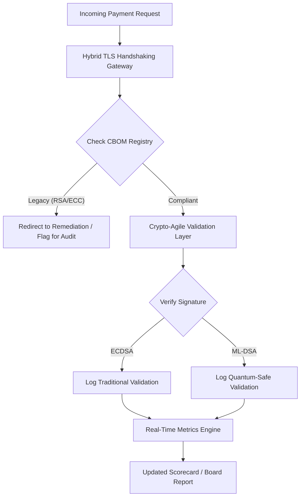

# 2026 양자내성 보안 스코어카드: 수탁자 차원 암호 민첩성을 위한 이사회 지표 프레임워크

<aside class="post-lead" aria-label="기사 요약">

<strong>TL;DR.</strong> 2026년 6월 현재, 양자내성 암호 (PQC)는 실험적 기술 관심사에서 주요 수탁자 의무로 이동했습니다. 이사회는 이제 DORA 아래 시스템적 금융·운영 리스크를 완화하기 위해 레거시 암호화의 NIST FIPS 203 및 204 표준으로의 체계적 이전을 감독해야 합니다.

<strong>핵심 시사점</strong>

<ul class="post-lead-takeaways">
  <li><strong>G20 정렬과 강행 기한.</strong> 국제 규제 당국은 2020년대 후반을 양자내성 전환의 강행 기한으로 설정하여, 기관이 정량화 가능한 이전 진행률을 입증하도록 요구합니다.</li>
  <li><strong>암호 자재 명세서 (CBOM).</strong> 소프트웨어 BOM과 유사하게, CBOM은 공급망 전반의 가시성을 확보하는 데 필요한 모든 암호 자산의 살아 있는 자동화 인벤토리입니다.</li>
  <li><strong>Harvest-Now-Decrypt-Later (HNDL) 노출.</strong> 적대 세력은 현재 고가치 도매 결제 데이터의 암호문을 가로채 저장하고 있습니다. 이를 완화하려면 하이브리드 PQC 아키텍처의 즉시 배치가 필요합니다.</li>
  <li><strong>암호 민첩성을 통한 수탁자 거버넌스.</strong> 암호 민첩성은 측정 가능한 거버넌스 지표입니다. 핵심 시스템 재설계 없이 암호 프리미티브를 교체할 수 있는 능력 (KyberLib 같은 라이브러리를 사용)은 이제 SM&CR 아래 이사회 차원의 책임입니다.</li>
</ul>

<strong>관련 읽을거리:</strong> <a href="https://sebastienrousseau.com/2026-06-12-kyberlib-post-quantum-banking-migration-standards-code-2026">2026년 KyberLib과 양자내성 뱅킹 이전</a>, <a href="https://sebastienrousseau.com/2023-11-19-crystals-kyber-the-safeguarding-algorithm-in-a-quantum-age/index.html">CRYSTALS-Kyber: 양자 시대의 보호 알고리즘</a>.

</aside>
양자내성 보안은 더 이상 연구 프로젝트가 아닙니다. "감독의 시계"는 2020년대 후반 강행 기한을 향해 가고 있습니다. [NIST FIPS 203 (ML-KEM)](https://csrc.nist.gov/pubs/fips/203/final)과 [NIST FIPS 204 (ML-DSA)](https://csrc.nist.gov/pubs/fips/204/final)의 확정은 키 캡슐화와 디지털 서명의 표준을 명문화했습니다.

규제 당국은 이제 Tier-1 은행이 파일럿 프로그램을 넘어서기를 기대합니다. 2026년에 초점은 이러한 표준의 산업화로 이동했습니다. 명확한 이전 경로를 입증하지 못하면 [디지털 운영 회복탄력성 법 (DORA)](https://eur-lex.europa.eu/eli/reg/2022/2554/oj) 아래 상당한 규제 제재를 받게 되며, 양자 기반 복호화의 예측 가능한 위협을 무시한 이사에 대한 개인적 책임이 발생할 수 있습니다.

## 01. 이사회 차원의 양자 스코어카드

다음 지표는 이사회가 상업 및 투자 은행 (CIB) 자산 전반의 양자 준비도와 암호 건전성을 평가할 표준화된 프레임워크를 제공합니다.

### 표 1: PQC 스코어카드 지표와 허용 한계

| 지표 | 수학적 공식 | 이사회 승인 허용 한계 | 한계 초과 시 리스크 |
| ---- | ---- | ---- | ---- |
| **인벤토리 완성도 비율 (ICP)** | (식별된 암호 자산 / 추정 총 자산) × 100 | > 98% | 고가치 청산 데이터 경로 내 섀도 암호화와 사각지대. |
| **HNDL 노출률 (HER)** | (레거시 암호 기반 장수명 데이터 / 장수명 데이터 총량) × 100 | < 5% | 영업 비밀, 국채 원장, 도매 결제 기록의 영구적 침해. |
| **NIST 이전 진행률 (MPR)** | (FIPS 203/204 운영 시스템 / 핵심 시스템 총수) × 100 | > 60% (2026년 말 기준) | 규제 부적합과 G20 정렬 거래상대방으로부터의 배제. |
| **암호 민첩성 준비 지수 (CARI)** | (추상화된 암호 계층을 가진 앱 / 핵심 앱 총수) × 100 | > 85% | 심각한 기술 부채와 향후 알고리즘 폐기에 대응 불능. |

## 02. 암호 자재 명세서 (CBOM)

ICP 지표는 포괄적인 **CBOM 발견 단계**를 통해 베이스라인이 잡힙니다. 이는 기업 내 모든 암호 엔드포인트를 식별하는 자동화 프로세스입니다.

- **엔드포인트 발견:** 내부 및 클라우드 네트워크를 스캔해 활성 TLS 세션을 확인하고 레거시 RSA 또는 ECC 사용을 식별합니다.
- **키 인벤토리:** 공개/개인 키 쌍을 각 소유자에게 매핑하고 정확한 만료일을 매핑합니다.
- **종속성 매핑:** 폐기된 알고리즘에 의존하는 서드파티 라이브러리와 API를 식별합니다.

이 발견 단계는 단일 진실 공급원을 만들어, CISO가 재무 성과와 동일한 세분성으로 암호 건전성을 보고할 수 있게 합니다.

## 03. 도매 결제에서 HNDL 노출 제거

적대 세력은 도매 결제와 장수명 기업 데이터베이스를 적극적으로 표적으로 삼고 있습니다. 이러한 "Harvest-Now-Decrypt-Later" (HNDL) 공격은 오늘의 암호문 트래픽을 가로채 보관하는 행위를 포함합니다.

암호학적으로 유의미한 양자 컴퓨터 (CRQC)가 오늘 존재하지 않더라도, 지금 가로챈 데이터는 미래에 취약해집니다. 이를 완화하려면 장수명 데이터(예: 신원 기록, 30년 만기 채권 계약, 법률 아카이브)의 우선순위 높은 이전이 필요하며, 이는 HER 지표를 직접 낮춥니다. 결제 채널을 하이브리드 PQC-전통 암호화(X25519와 함께 ML-KEM 사용)로 업그레이드하면 보관 위협에 대한 즉각적 방어를 제공합니다.

## 04. 잘 설계된 인터페이스를 통한 암호 민첩성 운영화

암호 민첩성은 엔지니어링 추상화를 통해 구현됩니다. [KyberLib](https://sebastienrousseau.com/2026-06-12-kyberlib-post-quantum-banking-migration-standards-code-2026) 같은 현대 라이브러리는 개발자가 전체 애플리케이션 스택을 다시 작성하지 않고도 양자내성 모듈을 구현할 수 있는 방법을 보여줍니다.

- **추상화된 래퍼:** 애플리케이션은 알고리즘별 루틴 대신 일반적인 `encrypt()` 또는 `sign()` 함수를 호출합니다.
- **런타임 교체:** 복잡한 코드 배포 대신 구성 변경을 통해 기반 모듈을 ECDSA에서 ML-DSA로 교체할 수 있습니다.

이 아키텍처는 특정 PQC 알고리즘이 향후 손상되더라도 조직이 수년이 아닌 수 시간 내에 전환할 수 있도록 보장합니다.

## 05. 양자내성 인그레스 검증 워크플로

다음 다이어그램은 양자 민첩 뱅킹 환경에서 보안 경계로 진입하는 데이터의 수명 주기를 보여줍니다.

## 결론

Tier-1 은행의 암호 자산은 더 이상 CISO만의 관심사가 아닙니다. 그것은 수탁자 인프라입니다. NIST FIPS 203과 204가 알고리즘을 정하고, DORA 제5조가 책임의 면을 설정하며, SM&CR이 이를 지명된 고위 관리자에게 고정합니다. 위의 스코어카드 — 인벤토리 완성도, HNDL 노출, 이전 진행률, 암호 민첩성 — 는 이사회가 암호 코드를 읽지 않고도 그 자산을 통제하기 위해 필요한 네 개의 숫자를 제공합니다.

가장 중요한 숫자는 HNDL 노출입니다. 오늘 도매 결제 아카이브에 보관된 레거시 암호 기록은 모두 최초의 암호학적으로 유의미한 양자 컴퓨터가 출하되는 날 판독 가능해집니다. 카운트다운은 조용하고 비대칭입니다. 방어자는 자신이 보유한 데이터에 대해서만 행동할 수 있지만, 적대 세력은 수년 전에 이미 유출한 데이터에 대해 행동할 수 있습니다. 2024년에 RSA-2048로 암호화된 30년 만기 회사채 계약은 CRQC가 가동되는 날 기밀성 보증을 잃게 됩니다.

[KyberLib](https://sebastienrousseau.com/2026-06-12-kyberlib-post-quantum-banking-migration-standards-code-2026)과 그 동류는 이를 다년간의 플랫폼 재작성에서 구성 변경으로 바꿉니다. 이사회의 일은 코드를 작성하는 것이 아닙니다. 이사회의 일은 암호 민첩성 준비 지수 — 추상화된 암호 인터페이스 뒤에 있는 핵심 애플리케이션의 비율 — 가 12개월 내에 85 %를 통과하도록 요구하고, 분기별 스코어카드를 읽는 일입니다.

<aside class="author-card" aria-label="저자 소개"><strong class="author-card-name"><a href="/about/index.html">Sebastien Rousseau</a></strong>응용 AI, ISO 20022 이전, 금융 서비스용 양자내성 암호, 도매 결제의 구조적 전환을 다루는 시니어 뱅킹 기술자.HSBC Commercial & Investment Bank, PayPal, Barclays, Shazam에서 20년 이상. <a href="https://www.linkedin.com/in/sebastienrousseau/" rel="external noopener">LinkedIn</a> &middot; <a href="https://github.com/sebastienrousseau" rel="external noopener">GitHub</a></aside>

최종 검토 <time datetime="2026-06-29">2026-06-29</time>.

