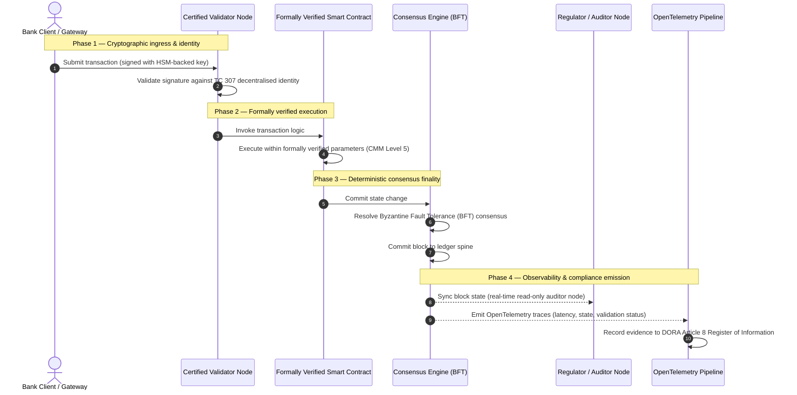

# 증거에서 진실로: 왜 인증된 블록체인이 은행 신뢰의 다음 시대를 정의할 것인가

## 전략 요약 (핵심)

도매 금융과 글로벌 거래는 2026년에 역사적 변곡점에 서 있다. 금융 서비스가 태생적으로 디지털이며 실시간인 청산 네트워크로 이행하고, 인공지능이 확률적 비결정성을 도입함에 따라, 전통적인 아날로그·회고적 보증 모델(정적이고 실체 기반의 감사 등)은 더 이상 현대의 리스크 관리와 수탁자 의무의 요구를 충족하지 못한다.

ISO/IEC 기술위원회 TC 307은 분산원장 기술을 위한 표준화된 기반을 확립했다. 그러나 진정한 기관 도입에는 서술적 지침에서 규범적이고 독립적으로 인증 가능한 블록체인 보증으로의 전환이 필요하다. 원장 거버넌스, 합의 무결성, 스마트 컨트랙트 안전성, 암호 민첩성을 엄격한 5단계 역량 성숙도 모델(CMM)에 비추어 채점함으로써, 은행은 단편적이고 벤더 종속적인 가정에서 인증 가능하고 이사회가 감사할 수 있는 재무적 진실로 나아갈 수 있다.

## 핵심 요점

* **수탁자 마찰 격차**: 오늘날 우리는 은행(Basel III), 클라우드(ISO 27001), AI 거버넌스 시스템(ISO 42001)을 인증할 수 있지만, 무엇이 진실인지를 점점 더 결정하는 분산원장은 아직 인증하지 못한다. 이 비대칭은 중대한 운영 취약점이다.  
* **DORA는 직접적 수탁자 책임을 부과한다**: DORA 제5조에 따라 은행 이사회는 모든 제3자 및 원장 배포의 운영 회복력에 대해 직접적이고 위임 불가능한 개인 책임을 지며, 위반 시 SM&CR 체제 하에서 엄중한 개인 제재를 받는다.  
* **AI의 감사 백본**: 머신러닝이 재현 불가능하고 확률적인 결과를 내는 지점에서, 인증된 블록체인은 결정론적 상태 포착을 제공한다. 모델 버전, 입력, 검증 결정을 온체인으로 기록하는 것은 ISO 42001과 모델 리스크 관리 기준을 충족한다.  
* **인증 블록체인 지수**: 이 지수는 거버넌스, 합의, 스마트 컨트랙트, 관측 가능성을 0에서 5까지의 CMM 척도로 검증 가능하고 감사 준비된 스코어카드로 공식화하며, 엔지니어링 지표를 이사회 승인 리스크 선호 진술로 번역한다.

## 01. 디지털 뱅킹에서의 수탁자 마찰 격차

고전적 뱅킹에서 신뢰는 관계적이고 기관적이며 회고적이다. 그것은 독립된 제3자 감사인이 고정된 시점에 재무 상태를 검토하고 양자 원장 사일로 간의 불일치를 조정하는 데 의존한다. 2026년의 실시간, API 주도 시장에서 이 모델은 금지적인 지연과 구조적 위험을 도입한다.

거래가 즉시 결제되고, 일중 유동성 풀이 API 게이트웨이에 의해 동적으로 관리되며, 자산 소유권이 공유 원장 전반에 토큰화되면, 회고적 감사는 예방적 통제가 아니라 포렌식 연습이 된다. 수탁자는 더 이상 법인 실체의 인증에만 의존할 수 없다. 그들은 디지털 기질 자체를 인증해야 한다.

현재 은행은 명백한 아키텍처 비대칭 하에서 운영된다:

1. **인증된 클라우드 인프라**: 하드웨어 노드, 가상화 컨테이너, 물리적 데이터센터는 ISO/IEC 27001 및 SOC 2 Type II 통제에 비추어 검증된다.  
2. **인증된 관리 프로세스**: 운영 리스크 정책, 사업 연속성 계획, 알고리즘 배포는 엄격한 리스크 프레임워크로 관리된다.  
3. **미인증 원장 엔진**: 분산 합의 메커니즘, 검증자 노드 공급망, 스마트 컨트랙트 경계, 네트워크 거버넌스 모델은 미인증이거나 맞춤형 또는 컨소시엄 특정 가정에 맡겨진다.

이 비대칭은 중대한 실패 지점이다. 은행은 안전하고 ISO 27001 인증된 클라우드 컨테이너 내에서 검증된 애플리케이션을 실행할 수 있지만, 그 컨테이너가 중앙집중식 검증자 통제, 취약한 합의 매개변수, 또는 미감사 스마트 컨트랙트를 가진 분산원장에 기록한다면 거래 무결성이 훼손된다. 이 격차를 메우려면 원장 엔진 자체가 인증 가능한 보증 대상이 되어야 한다.

## 02. ISO/IEC TC 307 표준화 기반

분산원장을 표준화하는 데 필요한 기초 작업은 ISO/IEC 기술위원회 TC 307(블록체인 및 분산원장 기술)이 확립하고 있다. 블록체인을 고립된 기술 프로토콜로 취급하는 대신, TC 307은 그것을 기관적 신뢰 인프라로 접근하며, 작업을 다섯 개의 핵심 기둥을 중심으로 구성한다:

1. **분류체계와 어휘(ISO 22739)**: 공통 명명법을 확립하여 다양한 관할권, 금융 스킴, 기관 전반에 걸쳐 일관된 법적·운영적 정의를 보장한다.  
2. **참조 아키텍처(ISO/TR 23245)**: 준수하는 분산원장 시스템의 경계, 계층, 데이터 흐름, 기능 구성요소를 정의한다.  
3. **보안, 프라이버시, 스마트 컨트랙트(ISO/TR 23244 / ISO 23613)**: 디지털 자산 시스템을 위한 기본 보안 지침을 확립하고 스마트 컨트랙트 취약점 완화와 수명주기 거버넌스의 모범 사례를 상술한다.  
4. **상호운용성 프레임워크**: 이질적인 원장 네트워크 간의 데이터·자산 교환 메커니즘을 다루며, 고립된 토큰화 사일로의 형성을 방지한다.  
5. **탈중앙화 신원과 신뢰 앵커**: 원장 기반 암호 식별자를 공식 공개키 기반구조(PKI) 및 국가 승인 등록부와 통합한다.

종합적으로 TC 307은 DLT가 맞춤형 엔지니어링 선택에서 표준화된 아키텍처 규율로 이행함을 시사한다. 그러나 TC 307은 주로 서술적으로 남아 있다. 그것은 탁월함이 어떤 모습인지를 정의하지만(지침), 리스크 담당자와 감독자가 중요하거나 필수적인 기능(CIF)의 프로덕션 배포를 승인하는 데 필요한 규범적 검증 프로토콜(보증)은 제공하지 않는다.

## 03. 지침 대 보증: 수탁자적 구별

금융 시장 참여자는 기술이 혁신적이거나 우아하기 때문에 배포하지 않는다. 그것을 관리하고, 감사하고, 방어하고, 자본 준비금 요건과 조정할 수 있을 때 배포한다. 그렇기 때문에 뱅킹에서 표준화는 자연스럽게 두 계층으로 분해된다:

* **지침(프레임워크)**: 모범 사례, 참조 목표, 아키텍처 지침을 개괄한다(예: ISO/IEC TC 307, NIST 프레임워크).  
* **보증(증명)**: 프레임워크가 구현되고 설계대로 작동하고 있다는 독립적이고 지속적이며 제3자 검증 가능한 증거를 제공한다(예: ISO 27001 인증, SOC 2 감사, 규제 검사).

클라우드 인프라를 인증하면서 미인증 원장 합의에 의존하는 것은 중대한 규제 격차다. "불변" 블록체인이 반드시 "기관적으로 신뢰되는" 것은 아니다. 불변성은 입력된 데이터가 변경되지 않음만을 보장한다. 그것은 검증자 노드가 안전한지, 합의 프로토콜이 담합에 강인한지, 스마트 컨트랙트 로직이 수학적으로 건전한지, 암호 키 관리가 포스트 양자 명령을 준수하는지는 검증하지 않는다.

이 격차를 닫기 위해, 2026 인증 블록체인 지수는 이러한 요건을 글로벌 은행 규제에 매핑된 정량화 가능한 역량 성숙도 모델(CMM)로 공식화한다.

## 04. 2026 인증 블록체인 지수

고위 경영진이 원장 플랫폼을 평가하고 인증할 수 있도록, 이 지수는 분산원장 인프라를 0에서 5까지의 CMM 척도로 채점되는 다섯 개의 감사 가능한 운영 계층으로 구조화한다.

## 표 1: 인증 블록체인 지수 아키텍처

| 지수 계층 | 성숙도 수준(CMM) | 기술적·운영적 지표 | 규제/수탁자 통제 참조 |
| ---- | ---- | ---- | ---- |
| **원장 거버넌스** | **수준 0**: 임시 컨소시엄**수준 3**: 자동화된 검증자 심사 및 순환**수준 5**: 탈중앙화된 다자간 암호 신원 앵커링 | 심사된 금융 실체가 운영하는 검증자 노드 비율; 검증자 분쟁 해결 평균 시간; 노드의 지리적 분포 | **DORA 제5조**(거버넌스 및 조직); **CPMI-IOSCO PFMI 원칙 2**(거버넌스) 및 **원칙 3**(포괄적 리스크 관리 프레임워크) |
| **합의 무결성** | **수준 0**: 단일 노드 또는 불투명한 PoW**수준 3**: 결정론적 최종성을 갖춘 감사된 BFT**수준 5**: 지속적 지연 모니터링을 갖춘 다관할·정형 검증된 합의 | 최대 허용 합의 지연; 담합 저항 임계값; 시뮬레이션된 노드 분할 하 가용성 SLA | **DORA 제6조**(ICT 리스크 관리 프레임워크); **CPMI-IOSCO PFMI 원칙 8**(결제 최종성) |
| **신원 및 암호** | **수준 0**: 취약한 RSA/ECDSA 키**수준 3**: HSM 지원 키 관리를 갖춘 다중서명**수준 5**: 양자 안전 하이브리드 키(FIPS 203 ML-KEM) 및 영지식 프라이버시 게이트 | HSM 지원 키로 서명된 원장 거래 비율; PQC 마이그레이션 준비도 점수; ZK 증명 지연 | **NIST FIPS 203 / 204**; **ISO/IEC 27001**(정보보안 관리) |
| **스마트 컨트랙트 보증** | **수준 0**: 미감사 Solidity 스크립트**수준 3**: 자동화된 컴파일러 검증 및 외부 감사**수준 5**: 서킷 브레이커 업그레이드를 갖춘 정형 검증되고 불변인 스마트 컨트랙트 | 수학적 정형 검증을 갖춘 스마트 컨트랙트 비율; 컴파일러 경고 수; 취약점 스캔 커버리지 | **아웃소싱에 관한 EBA 지침**(제81, 113-117항); **DORA 제30조**(최소 계약 조항) |
| **감사 및 관측 가능성** | **수준 0**: 수동 로그 스크래핑**수준 3**: 구조화된 OTel 추적 및 읽기 전용 감사인 노드**수준 5**: 제8조 등록부와의 자동화된 지속 조정 | OpenTelemetry 추적으로 커버되는 거래 비율; 블록 커밋에서 감사인 노드 동기화까지의 지연 | **BCBS 239**(리스크 데이터 집계); **DORA 제8조**(정보 등록부 / ITS 스키마) |

## 표 2: 글로벌 은행 표준에 매핑된 주요 신뢰 신호

| 신호 / 벤치마크 | 지표 | 은행 플랫폼에 대한 영향 | 규제 출처 |
| ---- | ---- | ---- | ---- |
| **ISO/IEC TC 307 진전** | ISO/TR 기술 보고서에서 공식 인증 스킴으로의 전환 | 분산원장 엔진을 인증하는 최초의 표준화된 프레임워크 확립 | **ISO/IEC JTC 1 / SC 44**(분산원장 기술) |
| **Agorá 프로젝트 프로토타입 단계** | 40개 이상의 참여 상업은행; 토큰화 예금의 통합 원장 테스트 | 국경 간 청산을 메시징(SWIFT)에서 원자적 토큰화 결제로 이동 | **국제결제은행(BIS) 혁신 허브** |
| **DORA 제30조 제3자 감사** | 노드 제공자와 인프라 호스트의 100%가 보안 기준에 따라 감사됨 | "그림자 검증자 노드" 제거; 완전한 공급망 투명성 의무화 | **유럽 감독 당국(ESA)** |
| **ISO/IEC 42001(AI 거버넌스)** | AI 모델 및 학습 로그를 온체인에서 암호적으로 불변화 | 블록체인을 머신러닝의 불변 증거 등록부("감사 백본")로 활용 | **ISO/IEC 42001:2023**(정보기술 — 인공지능) |
| **Basel III 자본 적정성** | 문서화된 복잡성 감소에 기반한 운영 리스크 자본 버퍼 축소 | 표준화된 운영 리스크 프레임워크가 검증된 원장 회복력을 직접 인정 | **바젤 은행감독위원회(BCBS)** |

## 05. AI의 "감사 백본": 결정론적 인프라 위의 확률적 지능

2026년 인증된 블록체인의 가장 강력한 전략적 역할 중 하나는 인공지능 배포를 위한 **"감사 백본"**으로 기능하는 것이다. 현대 금융 시스템은 점점 더 확률적이 되고 있다. 신용 스코어링, 실시간 사기 탐지, 알고리즘 거래, 자율 고객 상호작용은 시간에 따라 진화하고 표류하며 적응하는 머신러닝 모델에 의해 구동된다. 이 모델들은 비결정론적이다: 같은 입력을 서로 다른 두 시점에 주어도, 동적 가중치와 지속적 학습으로 인해 다른 출력을 낼 수 있다.

이 비결정성은 **ISO/IEC 42001(AI 거버넌스)**과 모델 리스크 관리(MRM) 기준(예: **미 연준의 SR 11-7**과 **영국 PRA의 SS1/23**) 하에서 심대한 거버넌스 과제를 제기한다: *엄격하게 재현 불가능한 결정을 어떻게 감사하고 설명하고 방어할 것인가?*

인증된 분산원장은 결정론적 균형추를 제공한다. AI 모델이 확률적으로 작동하는 곳에서, 인증된 블록체인은 그 매개변수를 결정론적으로 기록하여 변경 불가능한 증거 백본을 확립한다:

* **모델 버전 관리 및 가중치 앵커링**: 배포된 각 모델 버전, 그 연관 가중치, 학습 데이터의 체크섬은 빌드 시점에 해시되어 원장에 기록되며, **SLSA Level 3** 공급망 요건을 충족한다.  
* **맥락적 입력 로깅**: AI 모델이 중요한 결정(예: 대출 승인 또는 거래 플래그)을 실행할 때, 정확한 맥락적 입력과 모델 해시가 원장에 기록되어 변조 방지 이력을 만든다.  
* **코드 접근 없는 감사 가능성**: 규제 당국이 "왜 당신의 모델이 6월 3일에 이 신용 신청을 거절했는가?"라고 묻는다면, 은행은 독점 코드를 노출할 필요도, 정확한 모델 상태를 재현하려 시도할 필요도 없다. 입력, 가중치, 검증 상태의 암호 서명된 온체인 기록을 제시한다.

머신러닝 모델의 확률적 결정을 인증된 블록체인의 결정론적 합의에 앵커링함으로써, 기관은 방어 가능하고 재구성 가능하며 독립적으로 검증 가능한 자동화 행동의 타임라인을 만든다.

## 06. 인증된 합의-대-감사 파이프라인의 시각화

다음 시퀀스 다이어그램은 인증된 블록체인 플랫폼을 통과하는 거래의 수명주기를 보여주며, 검증 게이트, 합의 무결성, 스마트 컨트랙트 실행, 텔레메트리 방출이 어떻게 맞물려 이사회 준비 규제 증거를 생성하는지를 보여준다:

이 거래 시퀀스의 임계 경로는 모든 검증, 실행, 합의 단계가 암호 서명될 것을 요구하여 종단 간 출처를 보장한다. 규제 당국의 감사인 노드는 블록 상태를 실시간으로 동기화하여 회고적이고 수동적인 재무 조정의 필요를 제거한다.

## 07. 고위 경영진을 위한 이사회 플레이북

조직적 신뢰에서 인프라적 신뢰로의 이행을 성공적으로 헤쳐 나가기 위해, 은행 임원과 고위 경영진은 즉시 네 가지 핵심 지침을 실행해야 한다:

1. **전사적 리스크 관리(ERM)에서 원장 감사를 의무화하라**: 어떤 분산원장 플랫폼(사설, 공개, 컨소시엄을 불문)도 5계층 **인증 블록체인 지수 아키텍처**(최소 CMM 수준 3)에 비추어 감사받지 않고는 중요하거나 필수적인 기능(CIF)에 배포될 수 없다는 정책을 시행하라.  
2. **블록체인을 ISO 42001 AI 증거 백본으로 통합하라**: 최고리스크책임자와 수석 AI 아키텍트에게 모든 고영향 머신러닝 모델을 인증된 블록체인과 통합하여 모델 버전, 가중치, 입력, 결정의 변조 방지 감사 등록부를 만들도록 지시하라.  
3. **검증자 노드 공급망을 감사하라(DORA 제30조)**: 조달 부서에 검증자 노드를 호스팅하거나 DLT 네트워크를 위한 클라우드 호스팅을 관리하는 모든 제3자 실체를 감사하도록 요구하고, 은행 내부 클라우드 노드에 적용되는 것과 동일한 사이버보안 및 운영 회복력 기준을 의무화하라.  
4. **원장 아키텍처를 CPMI-IOSCO 및 BCBS 239와 정렬하라**: 플랫폼 엔지니어링 팀에 원장 출력 텔레메트리를 **BCBS 239** 데이터 보고 요건과 직접 정렬하고, 합의 및 결제 최종성 매개변수가 **CPMI-IOSCO 원칙 8 및 9**를 엄격히 준수하도록 보장하도록 지시하라.

## 08. 자주 묻는 질문

**ISO/IEC TC 307은 인증 표준인가?**  
아니다. ISO/IEC TC 307은 어휘, 참조 아키텍처, 보안 지침을 확립하는 기술위원회다. 그것이 "탁월함이 어떤 모습인지"를 정의하지만(지침), 업계는 은행 감독자를 만족시키기 위해 이 문서들을 공식적이고 감사 가능한 인증 스킴(보증)으로 운영화해야 한다.

**인증된 블록체인은 어떻게 DORA 준수를 지원하는가?**  
DORA 제5조에 따라 은행 이사회는 기술 회복력에 대해 직접적 개인 책임을 진다. 인증된 블록체인은 합의 무결성, 검증자 공급망 통제, 스마트 컨트랙트 안전성에 대한 검증 가능한 암호 증거를 제공하여, 이사회 구성원에게 SM&CR 하의 개인 책임 주장에 대해 방어하는 데 필요한 문서화 가능한 "합리적 조치"를 제공한다.

전통적 원장 감사와 인증된 블록체인 감사의 차이는 무엇인가?  
전통적 감사는 회고적이다: 거래가 결제된 후 수동 기입과 정적 파일을 검증한다. 인증된 블록체인 감사는 지속적이고 실시간이다; 검증자 노드, BFT 합의 엔진, 정형 검증된 스마트 컨트랙트는 거래를 결정론적으로 실행하도록 인증되어, 시스템의 건전성을 지속적으로 검증하는 구조화된 텔레메트리(OpenTelemetry)를 방출한다.

공개 블록체인을 은행 용도로 인증할 수 있는가?  
대부분의 관할권에서 순수하게 무허가인 공개 블록체인은 검증자 신원 검증의 부재, 예측 불가능한 거래 비용, 비결정론적 최종성(예: 확률적 proof-of-work/stake 포크) 때문에 은행 규제를 충족하지 못한다. 뱅킹의 인증된 블록체인은 일반적으로 검증자 노드 운영자가 식별되고 감사된 금융 실체인 기업 허가형 아키텍처 또는 엄격하게 규제된 공개-하이브리드 아키텍처를 사용한다.

## 09. 참고 문헌

* 바젤 은행감독위원회(BCBS), 2013. *Principles for effective risk data aggregation and reporting (BCBS 239)*. 바젤: 국제결제은행. 이용 가능: [https://www.bis.org/publ/bcbs239.pdf](https://www.bis.org/publ/bcbs239.pdf).  
* Committee on Payments and Market Infrastructures 및 Technical Committee of the International Organization of Securities Commissions (CPMI-IOSCO), 2012. *Principles for financial market infrastructures*. 바젤: 국제결제은행. 이용 가능: [https://www.bis.org/cpmi/publ/d101.htm](https://www.bis.org/cpmi/publ/d101.htm).  
* 유럽은행감독청(EBA), 2019. *EBA/GL/2019/02 — Guidelines on outsourcing arrangements*. 파리: EBA. 이용 가능: [https://www.eba.europa.eu/regulation-and-policy/internal-governance/guidelines-on-outsourcing-arrangements](https://www.eba.europa.eu/regulation-and-policy/internal-governance/guidelines-on-outsourcing-arrangements).  
* 유럽의회 및 유럽연합이사회, 2022. *금융 부문의 디지털 운영 회복력에 관한 규정 (EU) 2022/2554 (DORA)*. 브뤼셀: 유럽연합 관보. 이용 가능: [https://eur-lex.europa.eu/legal-content/EN/TXT/?uri=CELEX%3A32022R2554](https://eur-lex.europa.eu/legal-content/EN/TXT/?uri=CELEX%3A32022R2554).  
* ISO/IEC JTC 1/SC 42, 2023. *ISO/IEC 42001:2023 — Information technology — Artificial intelligence — Management system*. 제네바: 국제표준화기구. 이용 가능: [https://www.iso.org/standard/81230.html](https://www.iso.org/standard/81230.html).  
* 기술위원회 ISO/IEC 307, 2020. *ISO/IEC 22739:2020 — Blockchain and distributed ledger technologies — Vocabulary*. 제네바: 국제표준화기구. 이용 가능: [https://www.iso.org/standard/73771.html](https://www.iso.org/standard/73771.html).  
* National Institute of Standards and Technology (NIST), 2026. *First Three Finalized Post-Quantum Encryption Standards (FIPS 203, 204, and 205)*. 게이더스버그: U.S. Department of Commerce. 이용 가능: [https://www.nist.gov/news-events/news/2024/08/nist-releases-first-3-finalized-post-quantum-encryption-standards](https://www.nist.gov/news-events/news/2024/08/nist-releases-first-3-finalized-post-quantum-encryption-standards).
