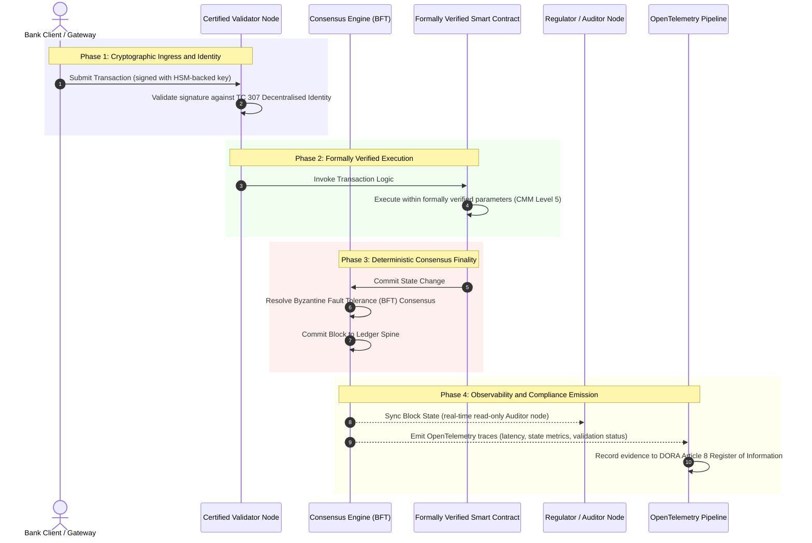

# 증거에서 진실로: 왜 인증 블록체인이 뱅킹 신뢰의 다음 시대를 정의하는가

**불변은 신뢰와 같지 않습니다.** 홀세일 뱅킹이 실시간 결제와 확률론적 AI로 이동하면서, 무엇이 진실인지를 결정하는 원장은 은행이 여전히 인증하지 못하는 유일한 계층이 되었습니다. 은행은 Basel III 하에서 법인을, ISO 27001 하에서 클라우드를, ISO 42001 하에서 자사의 AI를 인증하지만, 분산 원장과 그 거버넌스, 합의, 암호, 스마트 컨트랙트는 벤더별 가정에 맡겨져 있습니다. 이 보고서는 그 수탁 책임의 공백을 메우려면 ISO/IEC TC 307 지침에서 규범적 보증으로 나아가야 한다고 주장합니다. 즉, 원장을 5단계 인증 블록체인 지수에 대해 채점하여 엔지니어링 지표를 이사회가 감사할 수 있고 DORA로 방어 가능한 진실로 바꾸는 것입니다.

<!-- lead-start -->
<aside class="post-lead" aria-label="글 요약">

<strong>요약.</strong> 은행은 법인, 클라우드, 그리고 자사의 AI는 인증하지만, 점점 더 무엇이 진실인지를 결정하는 원장은 인증하지 못합니다. ISO/IEC TC 307은 보증이 아니라 지침을 제공합니다. 5단계 인증 블록체인 지수는 원장 거버넌스, 합의 무결성, 신원과 암호, 스마트 컨트랙트 보증, 관측성을 역량 성숙도 모델에 대해 채점하여, 수탁 책임의 공백을 메우고 확률론적 AI에 결정론적 감사 스파인을 제공합니다.

<strong>핵심 요점</strong>

<ul class="post-lead-takeaways">
  <li><strong>수탁 책임의 마찰적 공백.</strong> 은행(Basel III), 클라우드(ISO 27001), AI 거버넌스 체계(ISO 42001)는 인증할 수 있지만, 무엇이 진실인지를 결정하는 분산 원장은 아직 인증할 수 없습니다. 그 비대칭성은 현존하는 운영상의 취약점입니다.</li>
  <li><strong>DORA는 이를 개인의 문제로 만듭니다.</strong> DORA Article 5 하에서 은행 이사회는 제3자 및 원장 배포의 회복력에 대해 직접적이며 위임할 수 없는 책임을 지며, 실패 시 SM&amp;CR에 따른 개인 제재를 받습니다.</li>
  <li><strong>AI 감사 스파인.</strong> 머신러닝은 재현 불가능합니다. 인증 블록체인은 모델 버전, 입력, 검증 결정을 온체인에 결정론적으로 포착하여 ISO 42001 및 모델 리스크 관리 표준을 충족합니다.</li>
  <li><strong>인증 블록체인 지수.</strong> 거버넌스, 합의, 암호, 스마트 컨트랙트, 관측성이 0에서 5까지의 CMM 스코어카드가 되어 엔지니어링 지표를 이사회 승인 리스크 성향 선언(Risk Appetite Statement)으로 옮깁니다.</li>
</ul>

<strong>함께 읽기:</strong> <a href="https://sebastienrousseau.com/2026-07-02-certified-blockchains-banking-trust-tc307-assurance-2026">인증 블록체인과 뱅킹 신뢰: TC 307 보증</a>, <a href="https://sebastienrousseau.com/2026-07-24-global-payments-outlook-operating-model-risk-revenue">2026 글로벌 결제 전망</a>.

</aside>
<!-- lead-end -->

> **핵심 요약**
>
> - **홀세일 뱅킹은 변곡점에 있습니다.** 실시간 청산과 확률론적 AI는 아날로그적, 사후적 보증 모델을 무너뜨립니다. 정적이고 법인 기반의 감사는 더 이상 현대적 리스크 관리나 수탁 책임 요구를 충족하지 못합니다.
> - **TC 307은 기준선이지 인증서가 아닙니다.** ISO/IEC TC 307은 분산 원장에 대한 어휘, 참조 아키텍처, 보안 지침을 표준화했으나, 이는 서술적입니다. 무엇이 좋은지를 정의할 뿐, 리스크 담당자와 감독당국이 상용 배포를 승인하는 데 필요한 규범적 검증을 제공하지 않습니다.
> - **보증은 원장을 채점하는 것을 의미합니다.** 거버넌스, 합의 무결성, 스마트 컨트랙트 안전성, 암호 민첩성을 엄격한 5단계 역량 성숙도 모델에 대해 채점하면, 은행은 짜깁기식 벤더별 가정에서 인증 가능하고 이사회가 감사할 수 있는 재무적 진실로 이동합니다.
> - **원장은 AI를 위한 감사 스파인입니다.** 모델 버전, 입력, 검증 결정을 결정론적 합의에 고정하면, 재현 불가능한 머신러닝에 ISO 42001, SR 11-7, PRA SS1/23 하에서 방어 가능하고 재구성 가능한 증거 기록을 부여합니다.

## 디지털 뱅킹에서의 수탁 책임의 마찰적 공백

전통적 뱅킹에서 신뢰는 관계적, 제도적, 사후적입니다. 이는 독립적인 제3자 감사인이 정적인 시점의 재무 상태를 검토하고, 양자 간 원장 사일로에 걸친 불일치를 대사(reconcile)하는 데 의존합니다. 2026년의 실시간 API 기반 시장에서 이 모델은 감당하기 어려운 지연과 구조적 리스크를 초래합니다.

거래가 즉시 결제되고, 일중 유동성 풀이 API 게이트웨이에 의해 동적으로 관리되며, 자산 소유권이 공유 원장 전반에 걸쳐 토큰화되면, 사후적 감사는 예방적 통제가 아니라 포렌식 작업이 됩니다. 수탁자는 더 이상 법인을 인증하는 데만 의존할 수 없습니다. 이들은 디지털 기반 그 자체를 인증해야 합니다.

현재 은행은 두드러진 아키텍처적 비대칭성 하에서 운영됩니다.

1. **인증된 클라우드 인프라**: 하드웨어 노드, 가상화 컨테이너, 물리적 데이터센터는 ISO/IEC 27001 및 SOC 2 Type II 통제에 대해 검증됩니다.  
2. **인증된 관리 프로세스**: 운영 리스크 정책, 업무 연속성 계획, 알고리즘 배포는 엄격한 리스크 프레임워크 하에서 관리됩니다.  
3. **인증되지 않은 원장 엔진**: 핵심 분산 합의 메커니즘, 검증자 노드 공급망, 스마트 컨트랙트 경계, 네트워크 거버넌스 모델은 인증되지 않은, 맞춤형, 또는 컨소시엄별 가정에 맡겨져 있습니다.

이 비대칭성은 주요한 실패 지점입니다. 은행은 검증된 애플리케이션을 안전한 ISO 27001 인증 클라우드 컨테이너 안에서 실행할 수 있지만, 그 컨테이너가 중앙 집중화된 검증자 통제, 취약한 합의 파라미터, 또는 감사되지 않은 스마트 컨트랙트를 가진 분산 원장에 기록한다면, 거래 무결성은 훼손됩니다. 이 공백을 메우려면 원장 엔진 그 자체가 인증 가능한 보증 대상이 되어야 합니다.

## ISO/IEC TC 307 표준화 기준선

분산 원장을 표준화하는 데 필요한 기초 작업은 ISO/IEC 기술위원회 307(TC 307\)(블록체인 및 분산 원장 기술)에 의해 확립되고 있습니다. TC 307은 블록체인을 고립된 기술 프로토콜로 다루는 대신, 제도적 신뢰 인프라로 접근하며, 그 작업을 다섯 개의 핵심 축으로 구성합니다.

1. **분류 체계와 어휘(ISO 22739\)**: 공통 명명법을 확립하여 서로 다른 관할권, 금융 체계, 기관 전반에서 일관된 법적·운영적 정의를 보장합니다.  
2. **참조 아키텍처(ISO/TR 23245\)**: 준수하는 분산 원장 시스템의 경계, 계층, 데이터 흐름, 기능 구성 요소를 정의합니다.  
3. **보안, 프라이버시, 스마트 컨트랙트(ISO/TR 23244 / ISO 23613\)**: 디지털 자산 시스템에 대한 기준 보안 지침을 확립하고, 스마트 컨트랙트 취약점 완화와 생명주기 거버넌스를 위한 모범 사례를 상세히 다룹니다.  
4. **상호운용성 프레임워크**: 이기종 원장 네트워크 간의 데이터 및 자산 교환 메커니즘을 다루어, 고립된 토큰화 사일로의 형성을 방지합니다.  
5. **탈중앙 신원과 신뢰 앵커**: 원장 기반 암호 식별자를 공식 공개키 기반구조(PKI) 및 국가 승인 등록소와 통합합니다.

종합적으로 TC 307은 DLT가 맞춤형 엔지니어링 선택에서 표준화된 아키텍처 규율로 전환되고 있음을 시사합니다. 그러나 TC 307은 여전히 주로 서술적입니다. 무엇이 좋은지(지침)를 정의하지만, 리스크 담당자와 감독당국이 핵심 또는 중요 기능(CIFs)의 상용 배포를 승인하는 데 필요한 규범적 검증 프로토콜(보증)을 제공하지는 않습니다.

## 지침 대 보증: 수탁 책임의 구분

금융시장 참가자는 기술이 혁신적이거나 우아하다는 이유로 도입하지 않습니다. 그들은 그 기술이 관리되고, 감사되고, 방어되고, 자본 준비금 요건과 대사될 수 있을 때 도입합니다. 이것이 뱅킹에서의 표준화가 자연스럽게 두 개의 계층으로 귀결되는 이유입니다.

* **지침(프레임워크)**: 모범 사례, 참조 목표, 아키텍처 가이드라인을 제시합니다(예: ISO/IEC TC 307, NIST 프레임워크).  
* **보증(증명)**: 프레임워크가 설계대로 구현되고 운영되고 있다는, 독립적이고 지속적이며 제3자가 검증 가능한 증거를 제공합니다(예: ISO 27001 인증, SOC 2 감사, 규제 검사).

클라우드 인프라를 인증하면서 인증되지 않은 원장 합의에 의존하는 것은 중대한 규제 공백입니다. "불변"인 블록체인이 반드시 "제도적으로 신뢰되는" 것은 아닙니다. 불변성은 입력된 데이터가 변경되지 않았음을 보장할 뿐이며, 검증자 노드가 안전한지, 합의 프로토콜이 담합에 회복력이 있는지, 스마트 컨트랙트 로직이 수학적으로 견고한지, 암호 키 관리가 포스트 양자 의무를 준수하는지는 검증하지 않습니다.

이 공백을 메우기 위해 2026 인증 블록체인 지수는 이러한 요건을 글로벌 뱅킹 규제에 매핑된 정량적 역량 성숙도 모델(CMM)로 공식화합니다.

## 2026 인증 블록체인 지수

고위 경영진이 자사의 원장 플랫폼을 평가하고 인증할 수 있도록, 이 지수는 분산 원장 인프라를 다섯 개의 감사 가능한 운영 계층으로 구조화하여 0에서 5까지의 CMM 척도로 채점합니다.

### 표 1: 인증 블록체인 지수 아키텍처

| 지수 계층 | 역량 성숙도 수준(CMM) | 기술 및 운영 지표 | 규제 / 수탁 통제 참조 |
| ---- | ---- | ---- | ---- |
| **원장 거버넌스** | **Level 0**: 임시 컨소시엄**Level 3**: 자동화된 검증자 심사 및 순환**Level 5**: 탈중앙, 다자간 암호 신원 앵커링 | 심사된 금융 기관이 운영하는 검증자 노드 비율(%); 검증자 분쟁 해결 평균 시간; 노드의 지리적 분포 | **DORA Article 5**(거버넌스 및 조직); **CPMI-IOSCO PFMI Principle 2**(거버넌스) 및 **Principle 3**(리스크의 포괄적 관리를 위한 프레임워크) |
| **합의 무결성** | **Level 0**: 단일 노드 또는 불투명한 POW**Level 3**: 결정론적 최종성을 갖춘 감사된 BFT**Level 5**: 지속적 지연 모니터링을 갖춘 다관할권, 형식 검증된 합의 | 최대 허용 합의 지연; 담합 저항 임계값; 시뮬레이션된 노드 분할 상황에서의 가동 SLA | **DORA Article 6**(ICT 리스크 관리 프레임워크); **CPMI-IOSCO PFMI Principle 8**(결제 최종성) |
| **신원 및 암호** | **Level 0**: 취약한 RSA / ECDSA 키**Level 3**: HSM 기반 키 관리를 갖춘 다중 서명**Level 5**: 양자 안전 하이브리드 키(FIPS 203 ML-KEM) 및 영지식 프라이버시 게이트 | HSM 기반 키로 서명된 원장 거래 비율(%); PQC 마이그레이션 준비도 점수; ZK 증명 지연 | **NIST FIPS 203 / 204**; **ISO/IEC 27001**(정보 보안 관리) |
| **스마트 컨트랙트 보증** | **Level 0**: 감사되지 않은 solidity 스크립트**Level 3**: 자동화된 컴파일러 검증 및 외부 감사**Level 5**: 서킷 브레이커 업그레이드를 갖춘 형식 검증된 불변 스마트 컨트랙트 | 수학적 형식 검증을 거친 스마트 컨트랙트 비율(%); 컴파일러 경고 건수; 취약점 스캔 커버리지 | **EBA 아웃소싱 계약 지침**(제81, 113-117항); **DORA Article 30**(최소 계약 조항) |
| **감사 및 관측성** | **Level 0**: 수동 로그 스크래핑**Level 3**: 구조화된 OTel 트레이스 및 읽기 전용 감사인 노드**Level 5**: Article 8 등록부에 대한 자동화된 지속적 대사 | OpenTelemetry 트레이스로 커버되는 거래 비율(%); 원장 블록 커밋에서 감사인 노드 동기화까지의 지연 | **BCBS 239**(리스크 데이터 집계); **DORA Article 8**(정보 등록부 / ITS 스키마) |

### 표 2: 글로벌 뱅킹 표준에 매핑된 주요 신뢰 신호

| 신호 / 벤치마크 | 지표 | 뱅킹 플랫폼에 대한 영향 | 규제 출처 |
| ---- | ---- | ---- | ---- |
| **ISO/IEC TC 307 진척** | ISO/TR 기술 보고서에서 공식 인증 체계로의 전환 | 분산 원장 엔진을 인증하기 위한 최초의 표준화된 프레임워크를 확립 | **ISO/IEC JTC 1 / SC 44**(분산 원장 기술) |
| **Project Agorá 프로토타입 단계** | 40개 이상의 참여 상업 은행; 토큰화 예금의 통합 원장 테스트 | 국경 간 청산을 메시징(SWIFT)에서 원자적 토큰화 결제로 전환 | **국제결제은행(BIS) 혁신 허브** |
| **DORA Article 30 제3자 감사** | 노드 제공자 및 인프라 호스트의 100%가 보안 기준에 대해 감사됨 | "섀도 검증자 노드"를 제거; 완전한 공급망 투명성을 의무화 | **유럽 감독당국(ESA)** |
| **ISO/IEC 42001(AI 거버넌스)** | AI 모델 및 학습 로그를 암호적으로 불변화하여 온체인화 | 블록체인을 머신러닝을 위한 불변 증거 원장("감사 스파인")으로 활용 | **ISO/IEC 42001:2023**(정보 기술, 인공지능) |
| **Basel III 자본 적정성** | 문서화된 복잡성 감소에 기반한 운영 리스크 자본 버퍼의 축소 | 표준화된 운영 리스크 프레임워크가 검증된 원장 회복력을 직접적으로 인정 | **바젤 은행감독위원회(BCBS)** |

## AI "감사 스파인": 결정론적 인프라 위의 확률론적 지능

2026년 인증 블록체인의 가장 강력한 전략적 역할 중 하나는 인공지능 배포를 위한 **"감사 스파인"** 역할을 하는 것입니다. 현대 금융 시스템은 점점 더 확률론적입니다. 신용 평점, 실시간 사기 탐지, 알고리즘 트레이딩, 자율 고객 상호작용은 시간이 지남에 따라 진화하고, 드리프트하며, 적응하는 머신러닝 모델에 의해 구동됩니다. 이러한 모델은 비결정론적입니다. 서로 다른 두 시점에 동일한 입력이 주어져도, 동적 가중치와 지속적 학습으로 인해 다른 출력을 산출할 수 있습니다.

이 비결정론성은 **ISO/IEC 42001(AI 거버넌스)** 및 **모델 리스크 관리(MRM)** 표준(예: **미국 연방준비제도 SR 11-7** 및 **영국 PRA SS1/23**) 하에서 심대한 거버넌스 과제를 야기합니다. *엄밀히 재현 불가능한 결정을 어떻게 감사하고, 설명하고, 방어할 것인가?*

인증 분산 원장은 결정론적 균형추를 제공합니다. AI 모델이 확률론적으로 작동하는 반면, 인증 블록체인은 그 파라미터를 결정론적으로 기록하여 변경 불가능한 증거 스파인을 확립합니다.

* **모델 버전 관리와 가중치 앵커링**: 배포된 모든 모델 버전, 그와 연관된 가중치, 학습 데이터 체크섬은 빌드 시점에 해싱되어 원장에 기록되며, 이는 **SLSA Level 3** 공급망 요건을 충족합니다.  
* **맥락적 입력 로깅**: AI 모델이 핵심 결정(예: 대출 승인 또는 거래 플래깅)을 실행할 때, 정확한 맥락적 입력과 모델 해시가 원장에 기록되어 변조가 드러나는 이력을 생성합니다.  
* **코드 접근 없는 감사 가능성**: 감독당국이 "왜 귀사의 모델이 6월 3일에 이 신용 신청을 거절했는가?"라고 물으면, 은행은 독점 코드를 공개하거나 정확한 모델 상태를 재현하려 할 필요가 없습니다. 은행은 입력, 가중치, 검증 상태에 대한 암호적으로 서명된 온체인 원장 기록을 제시합니다.

머신러닝 모델의 확률론적 결정을 인증 블록체인의 결정론적 합의에 고정함으로써, 기관은 방어 가능하고, 재구성 가능하며, 독립적으로 검증 가능한 자동화 행위의 타임라인을 만듭니다.

## 인증된 합의-감사 파이프라인의 시각화

다음 시퀀스 다이어그램은 인증 블록체인 플랫폼을 통과하는 거래의 생명주기를 나타내며, 검증 게이트, 합의 무결성, 스마트 컨트랙트 실행, 텔레메트리 방출이 어떻게 맞물려 이사회에 제출 가능한 규제 증거를 산출하는지 보여줍니다.

이 거래 시퀀스의 핵심 경로는 모든 검증, 실행, 합의 단계가 암호적으로 서명되어 종단 간 출처(provenance)를 보장할 것을 요구합니다. 감독당국의 감사인 노드는 블록 상태를 실시간으로 동기화하여, 사후적이고 수동적인 재무 대사의 필요성을 제거합니다.

## 고위 관리자를 위한 이사회 플레이북

조직적 신뢰에서 인프라적 신뢰로의 전환을 성공적으로 관리하기 위해, 은행 임원과 고위 관리자는 즉시 네 가지 핵심 지침을 실행해야 합니다.

1. **전사적 리스크 관리(ERM)에 원장 감사를 의무화하십시오**: 사설, 공개, 또는 컨소시엄 기반 여부를 불문하고, 5계층 **인증 블록체인 지수 아키텍처**(최소 CMM Level 3)에 대해 감사받지 않은 분산 원장 플랫폼은 핵심 또는 중요 기능(CIFs)에 배포될 수 없다는 정책을 시행하십시오.  
2. **블록체인을 ISO 42001 AI 증거 스파인으로 통합하십시오**: 최고 리스크 책임자(CRO)와 수석 AI 아키텍트가 모든 고영향 머신러닝 모델을 인증 블록체인과 통합하여, 모델 버전, 가중치, 입력, 결정의 변조가 드러나는 감사 원장을 생성하도록 지시하십시오.  
3. **검증자 노드 공급망을 감사하십시오(DORA Article 30\)**: 조달 부서가 검증자 노드를 호스팅하거나 DLT 네트워크를 위한 클라우드 호스팅을 관리하는 모든 제3자 기관을 감사하도록 요구하고, 은행의 내부 클라우드 노드에 적용되는 것과 동일한 사이버보안 및 운영 회복력 표준의 준수를 의무화하십시오.  
4. **원장 아키텍처를 CPMI-IOSCO 및 BCBS 239에 정렬하십시오**: 플랫폼 엔지니어링 팀이 원장 출력 텔레메트리를 **BCBS 239** 데이터 보고 요건에 직접 정렬하도록 지시하고, 합의 및 결제 최종성 파라미터가 **CPMI-IOSCO Principles 8 및 9**를 엄격히 준수하도록 보장하십시오.

## 자주 묻는 질문

**ISO/IEC TC 307은 인증 표준입니까?**  
아닙니다. ISO/IEC TC 307은 어휘, 참조 아키텍처, 보안 지침을 확립하는 기술위원회입니다. "무엇이 좋은지"(지침)를 정의하지만, 업계는 은행 감독당국을 충족하기 위해 이러한 문서를 공식적이고 감사 가능한 인증 체계(보증)로 운영화해야 합니다.

**인증 블록체인은 DORA 준수를 어떻게 지원합니까?**  
DORA Article 5 하에서 은행 이사회는 기술 회복력에 대해 직접적, 개인적 책임을 집니다. 인증 블록체인은 합의 무결성, 검증자 공급망 통제, 스마트 컨트랙트 안전성에 대한 검증 가능한 암호적 증거를 제공하여, 이사회 구성원이 SM\&CR 개인 책임 청구에 대해 방어하는 데 필요한 문서화 가능한 "합리적 조치"를 제공합니다.

**전통적 원장 감사와 인증 블록체인 감사의 차이는 무엇입니까?**  
전통적 감사는 사후적이며, 거래가 청산된 후 수동 기입과 정적 파일을 검증합니다. 인증 블록체인 감사는 지속적이고 실시간입니다. 검증자 노드, BFT 합의 엔진, 형식 검증된 스마트 컨트랙트가 거래를 결정론적으로 실행하도록 인증되며, 시스템의 건전성을 지속적으로 검증하는 구조화된 텔레메트리(OpenTelemetry)를 방출합니다.

**공개 블록체인을 뱅킹 용도로 인증할 수 있습니까?**  
대부분의 관할권에서, 순수한 무허가 공개 블록체인은 검증자 신원 확인의 부재, 예측 불가능한 가스/거래 비용, 비결정론적 최종성(예: 확률론적 작업증명/지분증명 포크)으로 인해 뱅킹 규제를 충족하지 못합니다. 뱅킹에서의 인증 블록체인은 일반적으로 검증자 노드 운영자가 식별되고 감사된 금융 기관인 엔터프라이즈 허가형 또는 고도로 규제된 공개-하이브리드 아키텍처를 활용합니다.

## 참고 문헌

* Basel Committee on Banking Supervision (BCBS), 2013\. *Principles for effective risk data aggregation and reporting (BCBS 239\)*. Basel: Bank for International Settlements. Available at: [Basel Committee on Banking Supervision (BCBS), 2013\.](https://www.bis.org/publ/bcbs239.pdf "Basel Committee on Banking Supervision (BCBS), 2013\.").  
* Committee on Payments and Market Infrastructures and Technical Committee of the International Organisation of Securities Commissions (CPMI-IOSCO), 2012\. *Principles for financial market infrastructures*. Basel: Bank for International Settlements. Available at: [Committee on Payments and Market Infrastructures and Technical Committee of the International Organisation of Securities Commissions (CPMI-IOSCO), 2012\.](https://www.bis.org/cpmi/publ/d101a.pdf "Committee on Payments and Market Infrastructures and Technical Committee of the International Organisation of Securities Commissions (CPMI-IOSCO), 2012\.").  
* European Banking Authority (EBA), 2019\. *EBA/GL/2019/02, Guidelines on outsourcing arrangements*. Paris: EBA. Available at: [European Banking Authority (EBA), 2019\.](https://www.eba.europa.eu/regulation-and-policy/internal-governance/guidelines-on-outsourcing-arrangements "European Banking Authority (EBA), 2019\.").  
* European Parliament and Council of the European Union, 2022\. *Regulation (EU) 2022/2554 on digital operational resilience for the financial sector (DORA)*. Brussels: Official Journal of the European Union. Available at: [European Parliament and Council of the European Union, 2022\.](https://eur-lex.europa.eu/legal-content/EN/TXT/?uri=CELEX%3A32022R2554 "European Parliament and Council of the European Union, 2022\.").  
* ISO/IEC JTC 1/SC 42, 2023\. *ISO/IEC 42001:2023, Information technology, Artificial intelligence, Management system*. Geneva: International Organisation for Standardisation. Available at: [ISO/IEC JTC 1/SC 42, 2023\.](https://www.iso.org/standard/81230.html "ISO/IEC JTC 1/SC 42, 2023\.").  
* ISO/IEC Technical Committee 307, 2020\. *ISO/IEC 22739:2020, Blockchain and distributed ledger technologies, Vocabulary*. Geneva: International Organisation for Standardisation. Available at: [ISO/IEC Technical Committee 307, 2020\.](https://www.iso.org/standard/73771.html "ISO/IEC Technical Committee 307, 2020\.").  
* National Institute of Standards and Technology (NIST), 2026\. *First Three Finalised Post-Quantum Encryption Standards (FIPS 203, 204, and 205\)*. Gaithersburg: U.S. Department of Commerce. Available at: [National Institute of Standards and Technology (NIST), 2026\.](https://www.nist.gov/news-events/news/2024/08/nist-releases-first-3-finalised-post-quantum-encryption-standards "National Institute of Standards and Technology (NIST), 2026\.").
