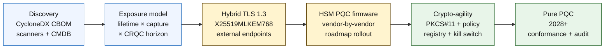

## 2026 मधील क्वांटम-सुरक्षित बँकिंग निर्देशांक: पोस्ट-क्वांटम क्रिप्टोग्राफी, QKD, क्रिप्टो-चपळता आणि हार्वेस्ट-नाऊ-डिक्रिप्ट-लेटर जोखीम

2026 मधील क्वांटम-सुरक्षित बँकिंग हे अनुमानाबद्दल नसून परिचालनात्मक स्थलांतराबद्दल आहे. NIST ने पहिली तीन पोस्ट-क्वांटम क्रिप्टोग्राफी मानके अंतिम केली आहेत आणि आता बँकांनी कोणत्या प्रणाली RSA, ECC, TLS, स्वाक्षऱ्या, HSM, प्रमाणपत्रे, पेमेंट वाहिन्या, संग्रह आणि दीर्घकाळ टिकणाऱ्या गोपनीय डेटावर अवलंबून आहेत हे समजून घेतले पाहिजे. निर्देशांकाचा प्रश्न सोपा आहे: धोका परिचालनात्मक होण्यापूर्वी संस्था क्रिप्टोग्राफी बदलू शकते का?

---

> **कार्यकारी सारांश / मुख्य मुद्दे**
>
> - **NIST मानके आता ठोस आहेत.** FIPS 203 की एन्कॅप्सुलेशनसाठी ML-KEM परिभाषित करते, FIPS 204 स्वाक्षऱ्यांसाठी ML-DSA परिभाषित करते, आणि FIPS 205 स्टेटलेस हॅश-आधारित स्वाक्षरी मानक म्हणून SLH-DSA परिभाषित करते.
> - **यादी ही पहिली परिपक्वता वेस आहे.** जे बँकेला सापडत नाही ते ती स्थलांतरित करू शकत नाही: प्रमाणपत्रे, की, प्रोटोकॉल, ॲप्लिकेशन्स, विक्रेते, HSM, API, संग्रह आणि एम्बेडेड प्रणाली यांचे मानचित्रण झाले पाहिजे.
> - **क्रिप्टो-चपळता हे टिकाऊ उद्दिष्ट आहे.** उद्दिष्ट एकवेळचा अल्गोरिदम बदल नाही; ते संपूर्ण ॲप्लिकेशन्सचा पुनर्रचना न करता क्रिप्टोग्राफिक प्रिमिटिव्ह बदलण्याची क्षमता आहे.
> - **दीर्घकाळ टिकणारा डेटा निकड बदलतो.** हार्वेस्ट-नाऊ-डिक्रिप्ट-लेटर जोखमीचा अर्थ आज पकडलेला डेटा, तो पुरेसा काळ मूल्यवान राहिल्यास, नंतर वाचनीय होऊ शकतो.
> - **[QKD](/2023-12-11-quantum-key-distribution-revolutionising-security-in-banking/index.html) हे एक विशेष पूरक आहे.** क्वांटम की वितरण सर्वोच्च-मूल्याच्या वाहिन्यांसाठी सुसंगत असू शकते, परंतु ते संस्थाभर PQC स्थलांतराची जागा घेत नाही.
>
---

## 2026 हे वर्ष हा निर्देशांक का महत्त्वाचा आहे

2024-2025 मधील तीन बदलांनी क्वांटम-सुरक्षिततेला एका संशोधन देखरेखीच्या मुद्द्याऐवजी एक मोजता येण्याजोगा बँक कार्यक्रम बनवले. पहिले, NIST ने 13 ऑगस्ट 2024 रोजी प्राथमिक पोस्ट-क्वांटम मानके अंतिम केली: [FIPS 203 (ML-KEM) ⧉](https://nvlpubs.nist.gov/nistpubs/FIPS/NIST.FIPS.203.pdf "FIPS 203 — Module-Lattice-Based Key-Encapsulation Mechanism"), [FIPS 204 (ML-DSA) ⧉](https://nvlpubs.nist.gov/nistpubs/FIPS/NIST.FIPS.204.pdf "FIPS 204 — Module-Lattice-Based Digital Signature Standard"), [FIPS 205 (SLH-DSA) ⧉](https://nvlpubs.nist.gov/nistpubs/FIPS/NIST.FIPS.205.pdf "FIPS 205 — Stateless Hash-Based Digital Signature Standard"). अल्गोरिदम-निवडीचा वाद त्या तारखेला संपला; 2026 मध्ये अजूनही "कोणती योजना जिंकते" ही अंतर्गत कार्यप्रवाह चालवणाऱ्या बँका 18 महिने मागे आहेत.

दुसरे, [NSA च्या CNSA 2.0 ⧉](https://media.defense.gov/2022/Sep/07/2003071834/-1/-1/0/CSA_CNSA_2.0_ALGORITHMS_.PDF "Commercial National Security Algorithm Suite 2.0") ने अमेरिकी फेडरल अंतिम-स्थिती 2033 वर निश्चित केली, ज्यात सॉफ्टवेअर आणि फर्मवेअर स्वाक्षरीसाठी 2027 पासून आणि ब्राउझर व ऑपरेटिंग सिस्टिमसाठी 2030 पासून मध्यवर्ती कटऑफ आहेत. अमेरिकी फेडरल प्रतिपक्ष एक्सपोजर असलेली कोणतीही बँक — FedNow, ट्रेझरी परिचालन, फेडरल ग्राहक खाती — फेडरल डेटाला स्पर्श करणाऱ्या प्रणालींसाठी त्या परिघात बसते. घड्याळ आता अमूर्त राहिलेले नाही.

तिसरे, [हार्वेस्ट-नाऊ-डिक्रिप्ट-लेटर (HNDL) ⧉](https://csrc.nist.gov/Projects/post-quantum-cryptography "NIST Post-Quantum Cryptography programme") हा निकडीसाठीचा भार-वाहक जोखीम युक्तिवाद आहे. प्रगत विरोधक आधीच प्रमुख वित्तीय केंद्रांवर TLS-संरक्षित पेमेंट संदेश, SWIFT लिफाफे, KYC कागदपत्रे आणि दीर्घकाळ टिकणारे संग्रह सिफरटेक्स्ट पकडत आहेत. 2026 मध्ये पकडलेल्या डेटाला केवळ डिक्रिप्शनच्या क्षणी गोपनीयता-संवेदनशील राहण्याची गरज असते — 30-वर्षीय गहाणखते, जीवनविमा अंडररायटिंग, MiFID II / GDPR व्यवहार नोंदी आणि M&A ठेवणीच्या संग्रहांसाठी, ती खिडकी क्रिप्टोग्राफिकदृष्ट्या सुसंगत क्वांटम संगणकाच्या (CRQC) प्रत्येक विश्वासार्ह अंदाजाच्या खूप पलीकडे विस्तारते. विरोधकाला आज क्वांटम संगणकाची गरज नाही. डेटा महत्त्वाचा राहणे थांबण्यापूर्वी त्याला तो लागतो.

क्वांटम-सुरक्षित बँकिंग निर्देशांक हे मोजतो की तो छेद येण्यापूर्वी तुमची संस्था स्थलांतर पाठवू शकते का. काम आता स्थलांतर करायचे की नाही याबद्दल नाही; ते स्थलांतर बचावता येण्याजोग्या कालरेषेवर पूर्ण होते का याबद्दल आहे.

## 2026 निर्देशांक स्थापत्य

| निर्देशांक स्तर | 2026 दिशा | सज्जता मापक | चुकीच्या हाताळणीची जोखीम |
|---|---|---|---|
| **यादी** | क्रिप्टोग्राफिक मालमत्ता, प्रोटोकॉल, प्रमाणपत्रे, विक्रेते आणि डेटा वर्ग यांचे मानचित्रण करा | यादी केलेल्या इस्टेटची टक्केवारी | अज्ञात क्वांटम-असुरक्षित अवलंबित्वे |
| **एक्सपोजर** | गोपनीयता आयुर्मान आणि व्यवहार निर्णायकतेनुसार प्रणालींचे वर्गीकरण करा | मूल्य आणि आयुर्मानानुसार उच्च-जोखीम मालमत्ता | चुकीच्या प्राधान्याने केलेले स्थलांतर |
| **स्थलांतर** | NIST मानकांशी संरेखित हायब्रिड आणि PQC-सज्ज नमुने स्वीकारा | ML-KEM आणि ML-DSA सज्जता | अंतिम मुदतीखाली आणीबाणीचे पुनर्-प्लॅटफॉर्मिंग |
| **क्रिप्टो-चपळता** | ॲप्लिकेशन तर्क क्रिप्टोग्राफिक प्रिमिटिव्हपासून वेगळे करा | धोरण-नियंत्रित क्रिप्टो व्याप्ती | संपूर्ण इस्टेटमध्ये हार्ड-कोड केलेले अल्गोरिदम |
| **आश्वासन** | आंतरकार्यक्षमता, कामगिरी, HSM समर्थन, प्रमाणपत्रे आणि विक्रेता सज्जतेची चाचणी करा | चाचणी उत्तीर्ण दर आणि अपवाद अनुशेष | तुटलेल्या वाहिन्या किंवा कमकुवत फॉलबॅक नियंत्रणे |

### बोर्ड-स्तरीय क्वांटम स्कोअरकार्ड

एक विश्वासार्ह क्वांटम सज्जता स्कोअरकार्ड केवळ प्रकल्प स्थितींचा नव्हे, तर अचूक टक्केवारींचा मागोवा घेण्याची मागणी करते:

1. **यादीची पूर्णता:** पूर्णपणे मानचित्रित क्रिप्टोग्राफिक बिल ऑफ मटेरियल्स (CBOM) असलेल्या टियर-1 ॲप्लिकेशन्सची टक्केवारी.
2. **HNDL एक्सपोजर:** हायब्रिड क्वांटम-सुरक्षित की एन्कॅप्सुलेशनविना नेटवर्कवरून प्रसारित होणाऱ्या दीर्घकाळ टिकणाऱ्या गोपनीय डेटाचे (उदा., PII, व्यापारी रहस्ये) प्रमाण.
3. **NIST स्थलांतर प्रगती:** FIPS 203 (ML-KEM) आणि FIPS 204 (ML-DSA) मानकांकडे स्थलांतरित झालेल्या असममित एन्क्रिप्शन की आणि डिजिटल स्वाक्षऱ्यांची टक्केवारी.
4. **क्रिप्टो-चपळता सज्जता:** कोड पुनर्संकलनाची गरज न भासता केंद्रीकृत धोरणाद्वारे क्रिप्टोग्राफिक अल्गोरिदम फिरवता येणाऱ्या निर्णायक प्रणालींची टक्केवारी.

## मागोवा घेण्याजोगे सद्य संकेत

| संकेत | बँकांसाठी याचा अर्थ काय | स्रोत |
|---|---|---|
| **FIPS 203 ML-KEM** | सर्वसाधारण एन्क्रिप्शन की स्थापनेसाठी प्राथमिक NIST मानक | [NIST ⧉](https://www.nist.gov/news-events/news/2024/08/nist-releases-first-3-finalized-post-quantum-encryption-standards "First three finalized post-quantum encryption standards") |
| **FIPS 204 ML-DSA** | डिजिटल स्वाक्षऱ्यांसाठी प्राथमिक NIST मानक | [NIST ⧉](https://www.nist.gov/news-events/news/2024/08/nist-releases-first-3-finalized-post-quantum-encryption-standards "First three finalized post-quantum encryption standards") |
| **FIPS 205 SLH-DSA** | हॅश-आधारित स्वाक्षरी पर्याय आणि बॅकअप रचना | [NIST ⧉](https://www.nist.gov/news-events/news/2024/08/nist-releases-first-3-finalized-post-quantum-encryption-standards "First three finalized post-quantum encryption standards") |
| **तात्काळ एकीकरणास प्रोत्साहन** | संपूर्ण एकीकरणास वेळ लागतो म्हणून NIST प्रशासकांना मानके एकत्रित करण्यास सुरुवात करण्यास स्पष्टपणे सांगते | [NIST ⧉](https://www.nist.gov/news-events/news/2024/08/nist-releases-first-3-finalized-post-quantum-encryption-standards "First three finalized post-quantum encryption standards") |
| **बँकांचे क्वांटम कार्यक्रम विस्तारत आहेत** | प्रमुख बँका PQC संक्रमणांची तयारी करताना क्वांटम तंत्रज्ञानांचा शोध घेत आहेत | [Quantum Insider ⧉](https://thequantuminsider.com/2026/03/27/15-plus-global-banks-probing-the-wonderful-world-of-quantum-technologies/ "Overview of global banks exploring quantum technologies") |

## स्थलांतराची सुरुवात क्रिप्टोग्राफीच्या खतावणीने होते

स्थलांतराचा क्रम या टप्प्यावर चांगल्या प्रकारे समजलेला आहे. प्रत्येक वेस पुढील गोष्टीला चालना देणारा पुरावा निर्माण करते; एखादी वेस वगळणे किंवा संकुचित करणे हेच निर्देशांक स्थापत्याच्या अपयश स्तंभात दिसणारी आणीबाणीच्या पुनर्-प्लॅटफॉर्मिंगची जोखीम निर्माण करते.

पहिली फलनिष्पत्ती हा नवीन अल्गोरिदम नाही; ती क्रिप्टोग्राफिक बिल ऑफ मटेरियल्स (CBOM) आहे. बँकांना एक जिवंत यादी हवी जी व्यावसायिक सेवांना अल्गोरिदम, लायब्ररी, प्रमाणपत्रे, की लांबी, HSM, डेटा आयुर्मान, विक्रेते आणि परिचालन मालकांशी जोडते. त्या खतावणीविना क्वांटम-सुरक्षित स्थलांतर अंदाजपंचे बनते.

CBOM नोंद संचाने प्रत्येक क्रिप्टोग्राफिक प्रिमिटिव्हसाठी हे टिपले पाहिजे: प्रोटोकॉल किंवा इंटरफेस (TLS 1.3, IPsec, SSH, सानुकूल पेमेंट-संदेश स्वरूप), अल्गोरिदम आणि पॅरामीटर संच (RSA-2048, ECDH P-256, ML-KEM-768, ML-DSA-65), लायब्ररी आणि आवृत्ती (OpenSSL 3.4, BoringSSL कमिट हॅश, विक्रेता SDK बिल्ड), हार्डवेअर सीमा (HSM विभाजन, TPM, सुरक्षित एन्क्लेव्ह, किंवा काहीच नाही), लागू असल्यास प्रमाणपत्र ओळख, ॲप्लिकेशन मालक, आणि डेटा-वर्गीकरण आयुर्मान. 2025-2026 मध्ये उत्पादनात येणारी साधने — IBM Quantum Safe Inventory, ओपन-सोर्स [CycloneDX CBOM विनिर्देश ⧉](https://cyclonedx.org/capabilities/cbom/ "CycloneDX Cryptography Bill of Materials"), CryptoNext / Sandbox / PQShield कडील एंटरप्राइझ स्कॅनर — विद्यमान CMDB पाइपलाइनमध्ये एकत्रित होतात. यापैकी कोणतेही स्वतःहून पूर्ण नाही; विक्रेता साधने आणि समर्पित मनुष्यबळ असूनही 12-18 महिन्यांचे CBOM बांधणी चक्र अपेक्षित ठेवा.

मागोवा घेण्याजोगे मापक हे व्याप्ती नव्हे, ताजेपणा आहे. दोन महिने जुनी CBOM ही अजिबात CBOM नसण्यापेक्षा वाईट आहे कारण ती सुरक्षा संघाला काय स्थलांतरित झाले याबद्दल खोटा आत्मविश्वास देते.

## प्रथम हायब्रिड, सदैव चपळ

बहुतांश बँका सर्व काही एकाच वेळी बदलणार नाहीत. वास्तववादी नमुना म्हणजे हायब्रिड तैनाती, जिथे शास्त्रीय आणि पोस्ट-क्वांटम यंत्रणा एकत्र चालतात जोपर्यंत विक्रेते, प्रोटोकॉल, प्रमाणपत्रे आणि परिचालन साधने परिपक्व होत नाहीत. दीर्घकालीन लक्ष्य क्रिप्टो-चपळता आहे: धोरण-नियंत्रित क्रिप्टोग्राफिक निवडी ज्या व्यावसायिक ॲप्लिकेशनची पुनर्रचना न करता बदलता येतात.

[परस्परसंवादी घटक समाविष्ट करा: हार्वेस्ट-नाऊ-डिक्रिप्ट-लेटर (HNDL) जोखीम कॅल्क्युलेटर — एक स्लायडर-आधारित साधन जिथे कार्यकारी अधिकारी डेटा शेल्फ-लाइफ विरुद्ध अंदाजित क्वांटम कालरेषा टाकून त्यांची एक्सपोजर खिडकी पाहतात.]

> **मुख्य अंतर्दृष्टी:** जर तुमचा डेटा 10 वर्षे गोपनीय राहायला हवा असेल आणि क्रिप्टोग्राफिकदृष्ट्या सुसंगत क्वांटम संगणक (CRQC) 7 वर्षे दूर असेल, तर तुमची स्थलांतर अंतिम मुदत 7 वर्षांत नाही — ती 3 वर्षांपूर्वी होती.

व्यवहारात याचा अर्थ बाह्य-मुखी एंडपॉइंटसाठी हायब्रिड `X25519MLKEM768` की शेअरसह TLS 1.3 (Chrome / Firefox / Cloudflare / Akamai हे सर्व आज याला समर्थन देतात), HSM आणि CA पायाभूत सुविधा गाठ धरेपर्यंत शास्त्रीय स्वाक्षरी साखळ्या, आणि एक PKCS#11 अमूर्तता स्तर जो धोरण नोंदणीला व्यावसायिक ॲप्लिकेशन्स पुनर्संकलित न करता अल्गोरिदम फिरवू देतो. पुढील अल्गोरिदम संक्रमण (कधी, "जर" नाही) हे सहा आठवड्यांचे फिरवणे असेल की आणखी सात-वर्षीय कार्यक्रम, हे क्रिप्टो-चपळताच ठरवते.

## QKD कुठे बसते

क्वांटम की वितरण निर्देशांकात एक उच्च-संवेदनशीलता वाहिनी पर्याय म्हणून बसते, विशेषतः वित्तीय-बाजार पायाभूत सुविधा, मध्यवर्ती-बँक जोडणी आणि अत्यंत संवेदनशील संस्थात्मक प्रवाहांसाठी. त्याला PQC चे पूरक म्हणून वागवले पाहिजे, एंटरप्राइझ स्थलांतरास विलंब करण्याचे निमित्त म्हणून नाही.

## बँक प्रकारानुसार याचा अर्थ काय

### जागतिक प्रणालीदृष्ट्या महत्त्वपूर्ण बँका

कठीण समस्या ही प्रमाणाची आहे: हजारो TLS एंडपॉइंट, शेकडो HSM विभाजने, डझनभर अंतर्गत प्रमाणपत्र प्राधिकरणे, एम्बेडेड क्रिप्टोग्राफिक प्रिमिटिव्ह असलेले शेकडो व्यावसायिक ॲप्लिकेशन्स, आणि बँक बदलू शकत नाही असे विक्रेता SDK. गुंतवणूक ही आणखी एक पायलट नाही; ती CBOM साधने, प्रत्येक नवीन बिल्डमध्ये जोडलेला PKCS#11 अमूर्तता स्तर, एका विक्रेत्याला PQC फर्मवेअरमध्ये आघाडीवर निवडून इतरांवर बहु-वर्षीय शेपटी स्वीकारणारी HSM एकत्रीकरण योजना, आणि FIPS 203 / 204 / 205 स्थलांतर पूर्ण झाल्यानंतरही टिकाऊ क्रिप्टो-चपळता पृष्ठभाग बनणारी धोरण नोंदणी आहे.

### व्यवहार आणि कॉर्पोरेट बँका

स्थलांतराची व्याप्ती G-SIB स्तरापेक्षा संकुचित आहे परंतु HNDL एक्सपोजर तीव्र आहे: SWIFT सीमापार संदेशवहन, कॉर्पोरेट-प्रतिपक्ष PII वाहणारा संरचित पेमेंट डेटा, व्यापार-वित्त कागदपत्रे धारण करणारे कागदपत्र-देवाणघेवाण प्लॅटफॉर्म, आणि दीर्घ-ठेवणीचे अहवाल संग्रह. प्रत्येक ग्राहक-मुखी एंडपॉइंटवर हायब्रिड TLS आणि ठेवणी संग्रहांसाठी विश्रांतीवेळचे PQC यांना प्राधान्य द्या. HSM-विक्रेता उत्तरदायित्व पुढे ढकला — कॉर्पोरेट-बँकिंग प्लॅटफॉर्म संघाकडे थेट खरेदी प्रभाव असतो जो होलसेल तंत्रज्ञान संघाकडे बहुधा नसतो.

### प्रादेशिक बँका

आधीच क्रिप्टो-चपळता प्रिमिटिव्ह असलेला विक्रेता स्टॅक विकत घ्या. असे कोर बँकिंग प्लॅटफॉर्म निवडा ज्याचा विक्रेता CBOM प्रकाशित करतो आणि ML-KEM / ML-DSA समर्थन कालरेषांना बांधील आहे. विक्रेत्याचा HSM आराखडा बँकेच्या स्थलांतर अंतिम मुदतीशी संरेखित आहे याची पडताळणी करा. क्रिप्टो-चपळता शून्यापासून बांधण्यासाठी लागणारी अभियांत्रिकी क्षमता बहु-वर्षीय आहे; विक्रेता तो खर्च अनेक ग्राहकांमध्ये भागवतो आणि बँकेला त्याचा लाभ वारशाने मिळतो. पडताळणी काम — विक्रेत्याचे दावे संस्थेच्या MRM प्रक्रियेत टिकतात का हे तपासणे — ही वैध अंतर्गत व्याप्ती आहे.

### फिनटेक, PSP आणि पायाभूत सुविधा पुरवठादार

2026 मध्ये बँकांना विकणाऱ्या विक्रेत्यांसाठी स्पर्धात्मक प्रश्न "तुम्ही PQC ला समर्थन देता का" हा नाही. तो आहे "तुम्ही तुमच्या प्लॅटफॉर्मसाठी CycloneDX CBOM, एक HSM-विक्रेता समर्थन मॅट्रिक्स आणि एक लिखित अल्गोरिदम-फिरवणी SLA तयार करू शकता का." जे विक्रेते होय म्हणून उत्तर देतील ते 2026-2027 मध्ये टियर-1 खरेदी वेसा उत्तीर्ण होतील. जे करू शकणार नाहीत ते नूतनीकरण चक्र ते करू शकणाऱ्या स्पर्धकाला गमावतील.

## निष्कर्ष

2026 मधील क्वांटम-सुरक्षित बँकिंग हा संशोधन देखरेखीचा मुद्दा नाही; तो एक अंमलबजावणी कार्यक्रम आहे ज्याची अंतिम मुदत दोन वक्ररेषांच्या छेदाने ठरते — संस्थेकडे आज असलेल्या डेटाचे गोपनीयता आयुर्मान आणि क्रिप्टोग्राफिकदृष्ट्या सुसंगत क्वांटम संगणकाच्या आगमनाचे क्षितिज. 2030 मध्ये नियामक आणि प्रतिपक्षांना विश्वासार्ह दिसणाऱ्या संस्था त्या आहेत ज्यांनी 2024 मध्ये CBOM बांधणी सुरू केली, 2026 च्या अखेरीस प्रत्येक बाह्य एंडपॉइंटवर हायब्रिड TLS तैनात केला, आणि पहिल्या दिवसापासून प्रत्येक नवीन बिल्डमध्ये क्रिप्टो-चपळता अभियंत्रित केली. ज्यांनी तसे केले नाही त्यांना कळेल की त्यांचा विरोधक आज हार्वेस्ट करत असलेल्या डेटासाठी त्यांची स्थलांतर खिडकी आधीच बंद झाली आहे का.

तुम्ही कोणताही परिचालन कार्यक्रम मोजता तसे स्थलांतर मोजा: व्याप्ती ज्ञात, अनुक्रम प्राधान्यित, अंतिम मुदती बांधील, अपवाद नोंदी प्रामाणिक. तुम्ही तुमच्या स्वतःच्या इस्टेटकडे जितके कठोरपणे पाहाल, तितकी स्थलांतर खिडकी लहान वाटेल.

## वारंवार विचारले जाणारे प्रश्न

**बँकेने प्रथम कशाची यादी करावी?**

बाह्यपणे उघड TLS, पेमेंट वाहिन्या, ग्राहक प्रमाणीकरण, आंतरबँक जोडणी, HSM-समर्थित सेवा, दीर्घकालीन संग्रह, आणि दीर्घ उपयुक्त आयुर्मान असलेला गोपनीय डेटा हाताळणाऱ्या प्रणालींपासून सुरुवात करा.

**PQC हा केवळ सायबरसुरक्षेचा मुद्दा आहे का?**

नाही. तो पेमेंट, ओळख, कायदेशीर पुरावा, व्यवहार स्वाक्षरी, ग्राहक विश्वास, डेटा ठेवणी, विक्रेता व्यवस्थापन आणि परिचालन लवचिकतेवर परिणाम करतो.

**क्रिप्टो-चपळता म्हणजे काय?**

क्रिप्टो-चपळता म्हणजे हार्ड-कोड केलेल्या ॲप्लिकेशन बदलांऐवजी धोरण आणि प्लॅटफॉर्म नियंत्रणांद्वारे क्रिप्टोग्राफिक प्रिमिटिव्ह बदलण्याची क्षमता.

**बँकांनी अधिक मानकांची वाट पाहावी का?**

नाही. संपूर्ण एकीकरणास वेळ लागतो म्हणून NIST ने प्रशासकांना पहिली अंतिम मानके एकत्रित करण्यास सुरुवात करण्यास प्रोत्साहन दिले आहे.

## संदर्भ

- NIST, (2026). [First three finalized post-quantum encryption standards ⧉](https://www.nist.gov/news-events/news/2024/08/nist-releases-first-3-finalized-post-quantum-encryption-standards "First three finalized post-quantum encryption standards").
