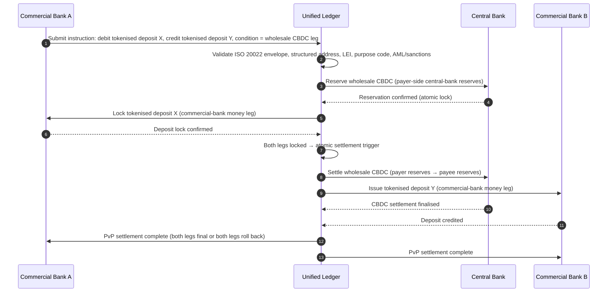

## २०२६ मधील होलसेल पेमेंट्स इंडेक्स: ISO 20022, टोकनाइझ्ड ठेवी, रिअल-टाइम रेल्स आणि सीमापार सेटलमेंट

२०२६ मधील होलसेल पेमेंट्स दोन एकाच वेळी घडणाऱ्या बदलांनी पुनर्रचित होत आहेत: संरचित पेमेंट डेटा आणि प्रोग्रामेबल सेटलमेंट. SWIFT चा नोव्हेंबर २०२६ चा संरचित-पत्ता टप्पा डेटा गुणवत्तेला ऑपरेटिंग मॉडेलमध्ये आणण्यास भाग पाडतो, तर BIS Project Agorá आणि टोकनाइझ्ड ठेवी सीमापार सेटलमेंट अधिक अणुस्तरीय, पारदर्शक आणि नेहमी-सुरू होऊ शकते का याची चाचणी करत आहेत.

---

> **कार्यकारी सारांश / मुख्य मुद्दे**
>
> - **नोव्हेंबर २०२६ हा एक कठोर डेटा टप्पा आहे.** SWIFT म्हणते की SR 2026 बदलानंतर असंरचित पत्ते असलेली पेमेंट्स यापुढे समर्थित राहणार नाहीत.
> - **संरचित डेटा उत्पादन पायाभूत सुविधा बनतो.** किमान गाव आणि देश नियुक्त फील्डमध्ये असणे आवश्यक आहे, ज्यामुळे पेमेंट-डेटा गुणवत्ता ही ग्राहक, ऑपरेशन्स आणि अनुपालनाची बाब बनते.
> - **टोकनाइझ्ड ठेवी हा होलसेल डिझाइन पर्याय आहे.** Project Agorá हे टोकनाइझ्ड व्यापारी बँक ठेवी आणि टोकनाइझ्ड मध्यवर्ती बँक राखीव एका एकीकृत लेजर मॉडेलमध्ये अभ्यासते.
> - **इंडेक्सने केवळ वेग नाही तर सेटलमेंट गुणवत्ता मोजली पाहिजे.** अंतिमता, पारदर्शकता, दुरुस्ती दर, लिक्विडिटी वापर, अनुपालन डेटा आणि ग्राहक दृश्यमानता या तात्काळ अंमलबजावणीएवढ्याच महत्त्वाच्या आहेत.
> - **सीमापार पेमेंट्स हा सार्वजनिक-खासगी अजेंडा राहतो.** FSB सार्वजनिक आणि खासगी-क्षेत्र समन्वयासह अंमलबजावणीद्वारे G20 रोडमॅप पुढे नेत आहे.
>
---

## २०२६ हे वर्ष या इंडेक्ससाठी का महत्त्वाचे आहे

Stanford AI Index उपयुक्त आहे कारण तो एका वेगाने बदलणाऱ्या तंत्रज्ञान क्षेत्राला मोजता येण्याजोगे मानतो: संशोधन उत्पादन, तांत्रिक कामगिरी, जबाबदार अंमलबजावणी, अर्थशास्त्र, क्षेत्रीय स्वीकार, धोरण आणि जनभावना एका चौकटीत आणल्या जातात ([Stanford HAI ⧉](https://hai.stanford.edu/ai-index/2026-ai-index-report "२०२६ चा AI Index अहवाल")). बँका आणि वित्तीय संस्थांना आता पायाभूत सुविधांसाठी तीच शिस्त हवी आहे. एजंटिक AI, क्वांटम-सुरक्षित सुरक्षा, क्लाउड नेटिव्ह लवचिकता आणि होलसेल पेमेंट्स हे यापुढे वेगळे नवोन्मेष मार्ग राहिलेले नाहीत; ते एका ऑपरेटिंग मॉडेलमध्ये एकत्र येत आहेत.

बँकेसाठीचा व्यावहारिक प्रश्न प्रत्येक क्षेत्र महत्त्वाचे आहे का हा नाही. तो प्रश्न आहे की संस्था या सर्वांमधील सज्जता एकाच वेळी मोजू शकते का. एखादी बँक एजंटिक AI तैनात करू शकते आणि तरीही, तिची क्रिप्टोग्राफी स्थलांतर-सज्ज नसेल तर, नाजूक राहू शकते. ती क्लाउड प्लॅटफॉर्म आधुनिक करू शकते आणि तरीही, पेमेंट डेटा असंरचित राहिल्यास, अपयशी ठरू शकते. ती टोकनायझेशन पायलट चालवू शकते आणि तरीही, सेटलमेंट, लिक्विडिटी, ओळख आणि ऑडिट स्तर एकत्रितपणे डिझाइन केले नसतील, तर प्रणालीगत धोका निर्माण करू शकते.

## २०२६ इंडेक्स आर्किटेक्चर

| इंडेक्स स्तर | २०२६ दिशा | सज्जता मेट्रिक | चुकीच्या हाताळणीचा धोका |
|---|---|---|---|
| **ISO 20022 डेटा** | असंरचित मजकुराकडून प्रशासित संरचित फील्डकडे जा | संरचित-पत्ता सज्जता आणि नकार दर | पेमेंट नकार आणि हाताने दुरुस्ती |
| **रेल ऑर्केस्ट्रेशन** | RTGS, इन्स्टंट, करस्पॉन्डंट, स्टेबलकॉइन आणि टोकनाइझ्ड रेल्समध्ये राउटिंग करा | खर्च, वेग, अंतिमता आणि अधिकारक्षेत्र-जाणकार राउटिंग | नकली नियंत्रणांसह विखुरलेल्या रेल्स |
| **टोकनाइझ्ड सेटलमेंट** | जिथे घर्षण कमी होते तिथे टोकनाइझ्ड ठेवी आणि मध्यवर्ती बँक पैसा वापरा | DvP, PvP, अणुस्तरीय सेटलमेंट व्याप्ती | व्यावसायिक वर्कफ्लो मूल्याविना पायलट मालमत्ता |
| **लिक्विडिटी** | इंट्राडे लिक्विडिटी, अडकलेली रोकड आणि सेटलमेंट विंडो इष्टतम करा | वाचवलेली लिक्विडिटी आणि सेटलमेंट-अपयश घट | लिक्विडिटीचा जलद निचरा |
| **अनुपालन** | AML, निर्बंध, FATF आणि ऑडिट आवश्यकता पेमेंट डेटामध्ये अंतर्भूत करा | स्ट्रेट-थ्रू अनुपालन आणि स्पष्टीकरणक्षमता | मजबूत नियंत्रणांविना समृद्ध डेटा |

## जागतिक प्राधान्यक्रमांशी जोडलेले प्रमुख होलसेल-पेमेंट्स संकेत

२०२६ चा संकेत-संच हा संशोधन अजेंडा नाही. ही एक वितरण तपासयादी आहे ज्यावर बँकेचा मुख्य पेमेंट्स अधिकारी आधीच मोजला जात आहे. दुरुस्तीचे काम तीन ठिकाणी दिसते: संदेश आवरण, रेल ऑर्केस्ट्रेशन स्तर आणि सेटलमेंट लेजर.

| संकेत | G20 / SWIFT / BIS संदर्भ | तांत्रिक प्लॅटफॉर्म अंमलबजावणी |
|---|---|---|
| **६५ % पेमेंट संदेशांमध्ये अजूनही असंरचित पत्ते आहेत** | [SWIFT SR 2026 — संरचित-पत्ता टप्पा, नोव्हें २०२६ ⧉](https://www.swift.com/news-events/news/iso-20022-milestone-november-2026-unstructured-addresses-be-removed "ISO 20022 नोव्हेंबर २०२६ संरचित पत्ता टप्पा") | संदेश SWIFTNet अ‍ॅडॅप्टरला पोहोचण्यापूर्वी पेमेंट मिडलवेअरमध्ये स्कीमा वैधता; कॉर्पोरेट-चॅनेल + करस्पॉन्डंट-बँक प्रवेशद्वारावर स्वयंचलित पत्ता पार्सिंग. |
| **FSB G20 लक्ष्य: २०२७ पर्यंत ७५ % सीमापार पेमेंट्स १ तासात पूर्ण** | [FSB सीमापार पेमेंट्स रोडमॅप, २०२६ अंमलबजावणी टप्पा ⧉](https://www.fsb.org/2026/03/fsb-kicks-off-new-implementation-phase-to-enhance-cross-border-payments-through-public-private-partnership/ "FSB सीमापार पेमेंट्स अंमलबजावणी टप्पा") | पूर्व-मान्य लिक्विडिटी विंडोसह रिअल-टाइम FX-रूपांतरण गेटवे; ग्राहक पोर्टलमध्ये T+0 पुष्टीकरण हुक; १ तासाचे आवरण पूर्ण करू न शकणारा कोणताही कॉरिडॉर वगळणारे रेल-राउटिंग इंजिन. |
| **FSB G20 लक्ष्य: सरासरी सीमापार व्यवहार खर्च १ % पेक्षा कमी, किरकोळ ३ % पेक्षा कमी** | [FSB G20 परिमाणात्मक लक्ष्ये ⧉](https://www.fsb.org/2026/03/fsb-kicks-off-new-implementation-phase-to-enhance-cross-border-payments-through-public-private-partnership/ "FSB सीमापार पेमेंट्स अंमलबजावणी टप्पा") | प्रत्येक कॉरिडॉरवर खर्च-विवरण टेलिमेट्री (FX स्प्रेड, करस्पॉन्डंट शुल्क, लिफ्टिंग खर्च); कोट देण्यापूर्वी अ-अनुरूप किंमत उघड करणारी मार्जिन पॉलिसी रजिस्ट्री. |
| **BIS Project Agorá सात मध्यवर्ती बँका + ४१ व्यापारी बँकांमध्ये प्रोटोटाइप टप्प्यात प्रवेश करते** | [BIS Project Agorá ⧉](https://www.bis.org/about/bisih/topics/fmis/agora.htm "Project Agorá") | एकीकृत-लेजर एकत्रीकरण तपशील: टोकनाइझ्ड-ठेव लेजर नोड + होलसेल-CBDC सेटलमेंट प्लेन + KYC/AML हुक; बँकेच्या कॉरिडॉर हिश्श्यानुसार आकारलेले ऑन-चेन लिक्विडिटी पूल. |
| **Deutsche Bank ची "डिजिटल मनी" चौकट ग्राहक आर्किटेक्चरमध्ये स्फटिकित होते** | [Deutsche Bank — Digital Money: stablecoins, tokenised deposits and CBDCs ⧉](https://flow.db.com/publications/flow-white-papers-and-guides/digital-money-a-perspective-on-stablecoins-tokenised-deposits-and-cbdcs "Digital Money: stablecoins, tokenised deposits and CBDCs") | प्रत्येक पेमेंटसाठी स्टेबलकॉइन / टोकनाइझ्ड-ठेव / CBDC निवड सारांशित करणारे वॉलेट-निरपेक्ष सेटलमेंट API; ग्राहकाच्या नव्हे तर बँकेच्या पॉलिसी रजिस्ट्रीविरुद्ध मूल्यांकित प्रोग्रामेबल अटी. |

## पेमेंट डेटाचा वळणबिंदू

ISO 20022 हे संदेश-स्वरूप प्रकल्पाकडून डेटा-गुणवत्ता ऑपरेटिंग मॉडेलकडे सरकले आहे. जर लाभार्थी, ऋणको, धनको, एजंट, गाव, देश, हेतू आणि पक्ष डेटा दुर्बल असेल, तर बँकेला नकार, दुरुस्त्या, निर्बंध घर्षण, ग्राहक असंतोष आणि दुर्बल विश्लेषणाचा अनुभव येईल.

**SR 2026 हे याला एक कठोर करार बनवते, सल्ला नाही.** SWIFT Standards Release 2026 (नोव्हेंबर २०२६) नेटवर्क स्तरावर संरचित-पत्ता नियम लागू करते — ज्या संदेशांच्या `<PstlAdr>` घटकात `<TwnNm>` आणि `<Ctry>` नाही ते SWIFTNet वैधता स्टॅककडून प्राप्तीवेळी नाकारले जातील, दुरुस्तीसाठी चिन्हांकित केले जाणार नाहीत. दुरुस्ती रांग ही बॅक-ऑफिस खर्च ओळ राहणे थांबते आणि ग्राहकाला दिसणाऱ्या विलंबासह एक सेटलमेंट-अपयश घटना बनते. SR 2026 ला "कठोर मार्गदर्शन" मानणारी ऑपरेशन्स टीम चुकीच्या रनबुकवरून काम करत आहेत.

### ISO 20022 अंतर्गत संरचित पेमेंट डेटा अनुपालन

दुरुस्ती पृष्ठभाग अरुंद आणि सुस्पष्ट आहे. खालील XML घटक हेच ठिकाण आहे जिथे नोव्हेंबर २०२६ चा SWIFTNet वैधता स्टॅक प्रत्यक्षात संदेश अपयशी करतो; बाकी सर्व हे पुढील परिणाम आहेत.

| डेटा घटक | ISO 20022 XML टॅग | नोव्हेंबर २०२६ SWIFT आवश्यकता | तांत्रिक दुरुस्ती धोरण |
|---|---|---|---|
| **संरचित पत्ता** | `<TwnNm>` + `<Ctry>` असलेले `<PstlAdr>` | अनिवार्य. असंरचित `<AdrLine>` मजकूर प्राप्तकर्त्या SWIFTNet अ‍ॅडॅप्टरवर नेटवर्क नकार सुरू करतो. | पेमेंट सुरुवातीवेळी स्वयंचलित पत्ता पार्सिंग; कॉर्पोरेट-चॅनेल फॉर्म पुनर्लेखन; पुढील डेबिटपूर्वी प्रत्येक प्रतिपक्षावर बॅक-बुक शुद्धीकरण. |
| **लीगल एंटिटी आयडेंटिफायर (LEI)** | `<OrgId>` अंतर्गत `<Id>` | गैर-व्यक्ती वित्तीय प्रतिपक्ष पडताळणीसाठी अत्यंत शिफारसीय; अनेक CBPR+ कॉरिडॉरमध्ये अनिवार्य. | कॉर्पोरेट ऑनबोर्डिंगवेळी LEI लुकअप + GLEIF क्रॉस-चेक; संदर्भ-डेटा सेवांद्वारे बॅक-बुक प्रतिपक्षांसाठी स्वयंचलित समृद्धीकरण. |
| **पेमेंट हेतू कोड** | `<Cd>` असलेले `<Purp>` | स्वयंचलित AML / निर्बंध तपासणीसाठी अनेक प्रादेशिक रिअल-टाइम कॉरिडॉरमध्ये (CBPR+, SEPA Inst, TIPS) अनिवार्य. | बँक-अंतर्गत जुने व्यवहार कोड मानक ISO 20022 ExternalPurposeCode यादीशी जुळवा; कॉर्पोरेट-चॅनेल UI मध्ये हेतू निवड उघड करा; अज्ञात कोडवर डिफॉल्ट-नकार. |
| **अंतिम पक्ष** | `<UltmtDbtr>` / `<UltmtCdtr>` | G20 FATF ट्रॅव्हल-रूल + निर्बंध मापदंड पूर्ण करण्यासाठी अंतिम लाभार्थी संदर्भ उघड करा; अनेक पेमेंट-प्रकार कोडांसाठी अनिवार्य. | लेजर उप-खात्यांमधून एंड-टू-एंड पक्ष नावे काढा; KYC ग्राफशी ताळमेळ करा; प्रत्येक पुष्टीकरणावर अंतिम पक्ष उघड करा. |
| **रेमिटन्स माहिती (संरचित)** | `<RfrdDocInf>` असलेले `<RmtInf><Strd>` | CBPR+ Phase 2 अंतर्गत ताळमेळ करण्याजोग्या इनव्हॉइस-लिंक्ड कॉर्पोरेट पेमेंट्ससाठी आवश्यक. | कॉर्पोरेट पोर्टलमध्ये कोट-वेळी संरचित रेमिटन्स नोंदवा; उच्च-मूल्य प्रवाहांसाठी मुक्त-मजकूर पर्याय नाकारा. |

## टोकनाइझ्ड ठेवी आणि होलसेल CBDC

टोकनाइझ्ड ठेवी प्रोग्रामेबिलिटी जोडत असतानाच व्यापारी-बँक पैसा मॉडेल जपतात. होलसेल मध्यवर्ती बँक पैसा सेटलमेंट अंतिमता जपतो. रोचक डिझाइन पॅटर्न हे संयोजन आहे: ग्राहक संबंध आणि पत मध्यस्थीसाठी व्यापारी बँक पैसा, अंतिम सेटलमेंट आणि प्रणालीगत विश्वासासाठी मध्यवर्ती बँक पैसा.

Project Agorá हे संयोजन ठोस बनवते. खालील आर्किटेक्चर हे एका एकीकृत लेजरद्वारे समन्वयित, व्यापारी-बँक ठेव लेजर आणि होलसेल-CBDC सेटलमेंट प्लेन या दोन्हींचा वापर करून केलेल्या अणुस्तरीय, पेमेंट-विरुद्ध-पेमेंट (PvP) सीमापार सेटलमेंटसाठीचा BIS संदर्भ पॅटर्न आहे.

सेटलमेंट रचनेनुसारच अणुस्तरीय आहे: दोन्ही टप्पे कमिट होतात किंवा दोन्ही परत फिरतात. होलसेल-CBDC टप्प्यावरील सेटलमेंट अंतिमता व्यापारी-बँक टोकनाइझ्ड-ठेव हस्तांतरण करस्पॉन्डंट धोक्याविना प्रभावी करते. एकीकृत लेजर हा समन्वय प्लेन आहे, स्वतःच एक पेमेंट प्रणाली नाही — मध्यवर्ती बँक अजूनही सेटलमेंट मालमत्ता जारी करते आणि व्यापारी बँक अजूनही ठेव दायित्व नोंदवते.

## नवीन होलसेल पेमेंट उत्पादन

उत्पादन आता केवळ एक पेमेंट राहिलेले नाही. ते अंमलबजावणी, डेटा, लिक्विडिटी, अनुपालन, मागोवा घेण्याची क्षमता आणि अपवाद व्यवस्थापनाचे एक बंडल आहे. ज्या बँका या क्षमता API आणि ग्राहक डॅशबोर्डद्वारे उघड करू शकतात, त्या पायाभूत सुविधा अनुपालनाला ग्राहक मूल्यात रूपांतरित करतील.

## बँकेच्या प्रकारानुसार याचा अर्थ काय

### जागतिक प्रणालीगतदृष्ट्या महत्त्वाच्या बँका

जागतिक बँकांनी या इंडेक्सला एंटरप्राइझ आर्किटेक्चर स्कोअरकार्ड मानले पाहिजे. प्राधान्य आणखी एक संकल्पना-सिद्धता नाही; ते हे आहे की स्वायत्त वर्कफ्लो, क्रिप्टोग्राफिक स्थलांतर, क्लाउड अवलंबित्व आणि पेमेंट आधुनिकीकरण एका एकाच धोका आणि मूल्य प्रणाली म्हणून प्रशासित करता येते याचा पुरावा.

### ट्रान्झॅक्शन बँका आणि कॉर्पोरेट बँका

ट्रान्झॅक्शन बँकांनी होलसेल पेमेंट्स, संरचित डेटा, लिक्विडिटी, टोकनाइझ्ड ठेवी आणि एजंटिक ट्रेझरी सेवांवर लक्ष केंद्रित केले पाहिजे. सर्वात मूल्यवान ग्राहक प्रस्ताव केवळ जलद पैसा हालचाल नाही; तो कमी तपासण्या आणि उत्तम कार्यशील-भांडवल दृश्यमानतेसह स्पष्टीकरणक्षम, ऑडिटयोग्य, प्रोग्रामेबल पैसा हालचाल आहे.

### प्रादेशिक बँका

प्रादेशिक बँकांनी कार्यक्रम विस्ताराला टाळण्यासाठी या इंडेक्सचा वापर केला पाहिजे. त्यांना प्रत्येक आघाडीवर नेतृत्व करण्याची गरज नाही, पण त्यांना AI प्रशासन, पोस्ट-क्वांटम इन्व्हेंटरी, क्लाउड एक्झिट पुरावा आणि पेमेंट डेटा सज्जतेवर विश्वसनीय भूमिका हवी आहे.

### फिनटेक, PSPs आणि इन्फ्रास्ट्रक्चर पुरवठादार

फिनटेक आणि इन्फ्रास्ट्रक्चर पुरवठादारांनी त्यांचे उत्पादन रोडमॅप मोजता येण्याजोग्या बँक सज्जतेशी संरेखित केले पाहिजेत. सर्वोत्तम प्रस्ताव एकत्रीकरण धोका कमी करतील, पुरावा मजबूत करतील आणि जटिल पायाभूत सुविधा बँकांसाठी प्रशासित करणे सोपे करतील.

## निष्कर्ष

इंडेक्स-शैलीच्या अहवालाचे मूल्य हे आहे की तो विखुरलेला तंत्रज्ञान अजेंडा मोजता येण्याजोग्या ऑपरेटिंग मॉडेलमध्ये रूपांतरित करतो. २०२६ मध्ये, वित्तीय पायाभूत सुविधांमधील विजेते सर्वाधिक पायलट असलेल्या संस्था नसतील. ते अशा संस्था असतील ज्या स्वायत्तता, सुरक्षा, लवचिकता, सेटलमेंट, अर्थशास्त्र आणि प्रशासनामधील सज्जता एकाच वेळी सिद्ध करू शकतात.

## वारंवार विचारले जाणारे प्रश्न

**ISO 20022 अजूनही २०२६ चा मुद्दा का आहे?**

कारण पेमेंट डेटा संरचित, प्रशासित, स्रोतावर नोंदवलेला आणि चॅनेल, ग्राहक व बाजार पायाभूत सुविधांमध्ये वापरण्याजोगा होईपर्यंत स्थलांतर पूर्ण होत नाही.

**टोकनाइझ्ड ठेव म्हणजे काय?**

टोकनाइझ्ड ठेव हे व्यापारी बँक पैशाचे एक डिजिटल प्रतिनिधित्व आहे, जे प्रोग्रामेबल सेटलमेंट सक्षम करत असतानाच बँक-ठेवीदार संबंध जपण्यासाठी रचलेले आहे.

**टोकनाइझ्ड ठेवी स्टेबलकॉइन्सची जागा घेतात का?**

सर्वत्र नाही. स्टेबलकॉइन्स काही डिजिटल-मालमत्ता आणि सीमापार संदर्भांमध्ये उपयुक्त राहू शकतात, तर टोकनाइझ्ड ठेवी नियंत्रित होलसेल बँकिंगसाठी संरचनात्मकदृष्ट्या आकर्षक आहेत.

**बँकांनी काय मोजावे?**

संरचित-डेटा सज्जता, पेमेंट नकार, दुरुस्ती खर्च, सेटलमेंट वेळ, लिक्विडिटी वापर, रेल राउटिंग परिणाम आणि ग्राहक दृश्यमानता मोजा.

## संदर्भ

- SWIFT, (2026). [ISO 20022 नोव्हेंबर २०२६ संरचित पत्ता टप्पा ⧉](https://www.swift.com/news-events/news/iso-20022-milestone-november-2026-unstructured-addresses-be-removed "ISO 20022 नोव्हेंबर २०२६ संरचित पत्ता टप्पा").
- BIS Innovation Hub, (2026). [Project Agorá ⧉](https://www.bis.org/about/bisih/topics/fmis/agora.htm "Project Agorá").
- FSB, (2026). [सीमापार पेमेंट्स अंमलबजावणी टप्पा ⧉](https://www.fsb.org/2026/03/fsb-kicks-off-new-implementation-phase-to-enhance-cross-border-payments-through-public-private-partnership/ "सीमापार पेमेंट्स अंमलबजावणी टप्पा").
- Deutsche Bank, (2026). [Digital Money: stablecoins, tokenised deposits and CBDCs ⧉](https://flow.db.com/publications/flow-white-papers-and-guides/digital-money-a-perspective-on-stablecoins-tokenised-deposits-and-cbdcs "Digital Money: stablecoins, tokenised deposits and CBDCs").
